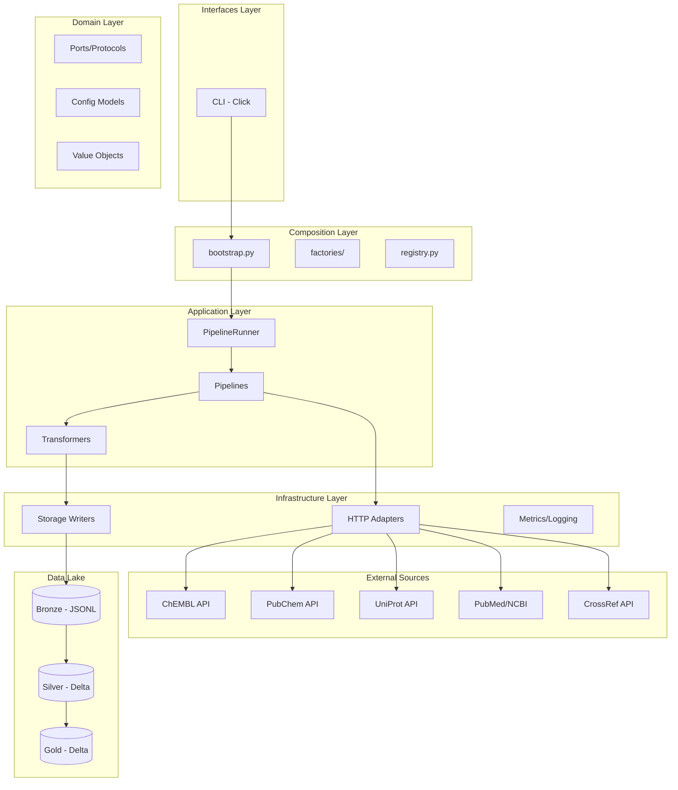

# Промпт: Комплексное Обновление Документации BioETL

*Версия: 1.0 | Дата: 2025-12-29*

---

## Контекст

Ты — технический писатель и архитектор, отвечающий за документацию проекта **BioETL** — фреймворка для сбора биоактивных данных из публичных API (ChEMBL, PubChem, UniProt, PubMed) в Delta Lake хранилище.

**Текущее состояние:**
- 117 markdown-файлов в `docs/`
- 20 ADR документов
- Архитектурные обзоры и планы рефакторинга требуют консолидации
- RULES.md v5.8 — источник истины
- Проект зрелый: 2895 тестов, 89% coverage

---

## Цели Обновления

### 1. Удаление Устаревших Документов

**Критерии удаления:**
- Дублирование контента с каноническим источником
- Версия ниже v5.8 без актуального контента
- Stub-файлы с перенаправлениями
- Промежуточные версии аудитов/планов

**Документы для удаления (верифицировать существование):**

| Путь | Причина |
|------|---------|
| `docs/consolidated-refactoring-plan.md` | Дубликат `refactoring-plan.md` |
| `docs/consolidated-refactoring-plan-v2.md` | Дубликат |
| `docs/consolidated-refactoring-analysis.md` | Дубликат |
| `docs/08-architecture-audit-2025-12-28.md` | Заменён более новым |
| `docs/07-consolidated-architecture-audit-2025-12.md` | Устарел |
| `docs/consolidated-architecture-audit.md` | Устарел |
| `docs/archived-audit-report.md` | Устарел |
| `docs/01-governance/rules.md` | Stub к RULES.md |
| `docs/00-project_rules/01-project-rules.md` | Stub к RULES.md |
| `docs/mermaid-test.md` | Тестовый файл |
| `docs/00-project_rules/AUDIT-REPORT.md` | Пустой stub |
| `reports/` директория | Дублирует `docs/` |

**Процедура:**
```bash
# Перед удалением — проверить наличие
ls -la docs/consolidated*.md
ls -la docs/*audit*.md

# Переместить в archived/ если содержит уникальный контент
mkdir -p docs/archived/2025-12
mv docs/<file>.md docs/archived/2025-12/

# Или удалить напрямую если полный дубликат
rm docs/<file>.md
```

---

### 2. Консолидация Архитектурных Обзоров

**Цель:** Один актуальный `docs/architecture-audit.md` вместо множества датированных версий.

**Шаги:**
1. Определить последнюю версию архитектурного аудита
2. Проверить что она содержит все важные разделы:
   - Executive Summary
   - Objective Metrics
   - Category Evaluation (10 категорий)
   - Strengths/Weaknesses
   - Recommendations
3. Переименовать в `docs/architecture-audit.md` (без даты)
4. Обновить ссылки в `00-map.md` и `CLAUDE.md`

**Структура консолидированного аудита:**
```markdown
# BioETL Architecture Audit

*Last Updated: YYYY-MM-DD | RULES.md v5.8*

## Executive Summary
## 1. Objective Metrics
## 2. Layer Architecture (10/10)
## 3. Domain Model Quality (9/10)
## 4. Testing (9/10)
## 5. Error Handling (9/10)
## 6. Observability (8/10)
## 7. Performance (8/10)
## 8. Security (8/10)
## 9. Documentation (9/10)
## 10. Technical Debt (8/10)
## Recommendations
## Appendix: Verification Log
```

---

### 3. Консолидация Планов Рефакторинга

**Цель:** Один `docs/refactoring-plan.md` как единственный источник планирования.

**Требования:**
1. Сохранить секции:
   - ✅ УЖЕ РЕАЛИЗОВАНО
   - ❌ ЛОЖНЫЕ УТВЕРЖДЕНИЯ
   - 🔴 ПОДТВЕРЖДЁННЫЕ ПРОБЛЕМЫ
   - ROADMAP (если есть актуальные задачи)
2. Удалить устаревшие задачи
3. Добавить дату последней верификации

**Архив устаревших планов:**
```bash
mkdir -p docs/archived/refactoring-plans
mv docs/pipeline-refactoring-plan.md docs/archived/refactoring-plans/
mv docs/plans/refactoring-detail-2025-12-29.md docs/archived/refactoring-plans/
```

---

### 4. Обновление Версий и Синхронизация

**Документы для обновления версии на v5.8:**

| Документ | Действие |
|----------|----------|
| `docs/00-map.md` | Обновить "Synced with RULES.md v5.8" |
| `docs/index.md` | Обновить версию |
| `docs/00-project_rules/00-rules-summary.md` | Обновить версию, синхронизировать с RULES.md |
| `docs/00-project_rules/02-user-rules.md` | Обновить версию |
| `docs/00-project_rules/03-file-policy.md` | Обновить версию |
| `docs/00-project_rules/04-extending-bioetl.md` | Обновить версию |
| `docs/00-project_rules/05-cleanup-policy.md` | Обновить версию |
| `docs/02-architecture/diagrams/00-diagramming-policy.md` | Обновить версию |

**Шаблон версионирования:**
```markdown
*Synced with RULES.md v5.8 | Last updated: 2025-12-29*
```

---

### 5. Обновление Диаграмм

**Текущие диаграммы (проверить актуальность):**

| Файл | Тип | Проверить |
|------|-----|-----------|
| `docs/02-architecture/diagrams.md` | Mermaid | Architecture flow |
| `docs/02-architecture/system-context.md` | Mermaid | C4 Context |
| `docs/02-architecture/container-diagram.md` | Mermaid | C4 Container |
| `docs/02-architecture/data-flow.md` | Mermaid | Medallion flow |
| `docs/02-architecture/observability-layers.md` | Mermaid | Observability |

**Проверка актуальности:**
1. Сравнить с реальной структурой `src/bioetl/`
2. Проверить что все слои показаны: domain, application, composition, infrastructure, interfaces
3. Проверить провайдеров: ChEMBL, PubChem, UniProt, PubMed, CrossRef
4. Проверить Medallion: Bronze → Silver → Gold

**Обновление при необходимости:**


---

### 6. Оптимизация Структуры Документации

**Текущая vs Целевая структура:**

```
docs/
├── 00-map.md                    # ✅ Keep (Project Navigator)
├── RULES.md                     # ✅ Keep (Source of Truth)
├── REQUIREMENTS.md              # ✅ Keep (127 requirements)
├── glossary.md                  # ✅ Keep (Ubiquitous Language)
├── refactoring-plan.md          # ✅ Keep (Consolidated)
├── architecture-audit.md        # ✅ Keep (Consolidated, без даты)
├── index.md                     # ✅ Keep (MkDocs entry)
├── CHANGELOG.md                 # ✅ Keep (redirect to root)
│
├── 00-project_rules/            # ✅ Keep (Governance)
│   ├── 00-rules-summary.md
│   ├── 02-user-rules.md
│   ├── 03-file-policy.md
│   ├── 04-extending-bioetl.md
│   ├── 05-cleanup-policy.md
│   ├── 06-rules-mapping.md
│   └── 07-consistency-check.md
│
├── 02-architecture/             # ✅ Keep
│   ├── 01-domain-layer.md
│   ├── 02-application-layer.md
│   ├── 03-infrastructure-layer.md
│   ├── 04-interfaces-layer.md
│   ├── 05-composition-layer.md
│   ├── system-context.md
│   ├── container-diagram.md
│   ├── data-flow.md
│   ├── data-layers.md
│   ├── observability-layers.md
│   ├── diagrams.md
│   ├── decisions/               # 20 ADRs
│   └── diagrams/
│
├── 03-guides/                   # ✅ Keep (10 guides)
├── 04-reference/                # ✅ Keep (API docs)
├── 05-operations/               # ✅ Keep (Runbooks)
├── contracts/                   # ✅ Keep (JSON schemas)
├── domain/                      # ✅ Keep (Schema docs)
├── providers/                   # ✅ Keep (Provider docs)
├── templates/                   # ✅ Keep
│
├── archived/                    # NEW: Archive folder
│   ├── 2025-12/                # Устаревшие документы
│   └── refactoring-plans/      # Старые планы
│
└── __-prompts/                  # Промпты для агентов (опционально удалить)
```

**Удалить/переместить:**
- `docs/issues/` → удалить (использовать GitHub Issues)
- `docs/architecture/` → удалить дубликат, сохранить `02-architecture/`
- `docs/plans/` → переместить в archived/

---

### 7. Чек-лист Выполнения

**Перед началом:**
- [ ] `git status` — чистый working tree
- [ ] `make lint && make test` — проходят
- [ ] Создать ветку `docs/documentation-update-YYYY-MM-DD`

**Удаление:**
- [ ] Удалены дубликаты consolidated-*.md
- [ ] Удалены устаревшие audit-*.md
- [ ] Удалены stub-файлы
- [ ] Удалена директория `reports/` (если существует)

**Консолидация:**
- [ ] architecture-audit.md — единственный аудит
- [ ] refactoring-plan.md — единственный план
- [ ] Все ссылки обновлены

**Версионирование:**
- [ ] Все документы обновлены до v5.8
- [ ] Даты обновлены на текущую

**Диаграммы:**
- [ ] Все Mermaid диаграммы актуальны
- [ ] Архитектурные слои соответствуют src/bioetl/
- [ ] Провайдеры актуальны (5 штук)

**Финализация:**
- [ ] `make lint` — проходит
- [ ] `00-map.md` обновлён
- [ ] Коммит с сообщением: `docs: consolidate documentation and update to v5.8`

---

## Ограничения

1. **Не удалять:**
   - RULES.md (источник истины)
   - ADR документы (архитектурные решения)
   - Runbooks (операционная документация)

2. **Сохранять backward-compatibility:**
   - Если документ используется в CI/CD — обновить ссылки
   - Если документ ссылается на MkDocs — проверить mkdocs.yml

3. **Язык документации:**
   - Public-facing: English (README, CONTRIBUTING)
   - Internal governance: Russian (RULES.md, AGENT.md)
   - Architecture: Russian (02-architecture/)
   - Guides: English (03-guides/)

---

## Метрики Успеха

| Метрика | До | После |
|---------|-----|-------|
| Количество md файлов | 117 | ~90 (целевое) |
| Дублирующих документов | 14+ | 0 |
| Документов с устаревшей версией | 9+ | 0 |
| Архитектурных аудитов | 5+ | 1 |
| Планов рефакторинга | 4+ | 1 |

---

*Промпт создан: 2025-12-29*
