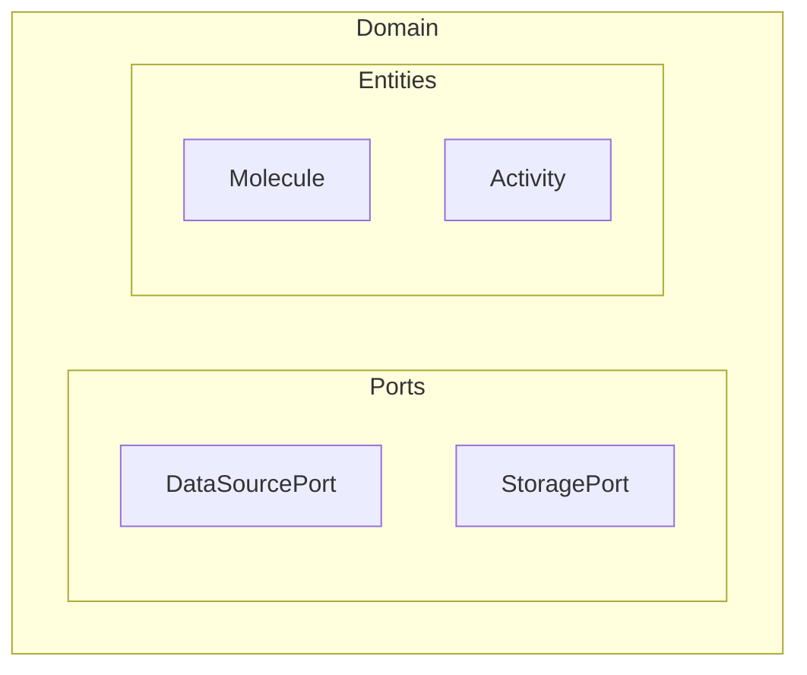

# /mermaid-design

Создание, рефакторинг и проверка Mermaid-диаграмм для BioETL.

## Использование

```
/mermaid-design [action] [target]
```

**Действия:**
- `create` — создать новую диаграмму (по умолчанию)
- `lint` — проверить все диаграммы на соответствие ADR-040
- `render` — отрендерить `.mmd` → SVG/PNG
- `fix` — исправить проблемы в существующей диаграмме
- `review` — ревью диаграммы с рекомендациями

**Target:**
- Путь к `.mmd` / `.mermaid` файлу
- Тип диаграммы: `flowchart`, `sequence`, `class`, `state`, `er`
- Название архитектурного компонента (e.g., `medallion-flow`, `adapter-hierarchy`)

**Примеры:**
```
/mermaid-design create flowchart medallion-pipeline
/mermaid-design lint
/mermaid-design fix docs/02-architecture/mmd-diagrams/overview.mmd
/mermaid-design render docs/02-architecture/mmd-diagrams/
/mermaid-design review docs/02-architecture/diagrams/mermaid/class-diagrams/ports.mermaid
```

---

## Инструкции для Claude

При вызове этого skill:

### Шаг 0: Загрузить спецификацию

Прочитай `.codex/skills/technical-designer-mermaid/SKILL.md` — полная спецификация
с ADR-040 compliance, палитрой, метаданными и правилами плотности.

### Режим автоопределения

Если работа идёт с файлами в `docs/02-architecture/` → **BioETL project mode**.
Иначе → **Generic Mermaid mode**.

### Действие: `create`

**Шаг 1:** Определить тип диаграммы и назначение.
- `flowchart` — для component/process flow
- `sequenceDiagram` — для взаимодействий между компонентами
- `classDiagram` — для моделей, ответственностей, наследования
- `stateDiagram-v2` — для lifecycle и FSM
- `erDiagram` — для relational modeling

**Шаг 2:** Выбрать размещение файла (BioETL mode):
- Canonical: `docs/02-architecture/mmd-diagrams/{name}.mmd`
- Decomposed views: `docs/02-architecture/diagrams/mermaid/{category}/{name}.mermaid`
- Categories: `architecture/`, `class-diagrams/`, `foundation/`

**Шаг 3:** Создать диаграмму с обязательными метаданными:
```mermaid
%% @version 1.0.0
%% @date YYYY-MM-DD
%% @type flowchart|sequence|class|state|er
%% @level high|implementation|debug
%% @nodes N
%% @adr ADR-NNN (если применимо)
```

**Шаг 4:** Соблюдать правила плотности:
- ≤15 nodes: идеально
- 16-20: soft limit
- 21-35: рекомендуется декомпозиция
- >35: обязательная декомпозиция
- >20 nodes: добавить `%%{init: {"flowchart": {"defaultRenderer": "elk"}}}%%`

**Шаг 5:** Использовать только каноническую палитру ADR-040 (без ad-hoc hex).

**Шаг 6:** Применить Layout Best Practices (см. раздел ниже).

### Действие: `lint`

```bash
python scripts/lint_diagrams.py docs
bash scripts/validate_mermaid_syntax.sh
```

Показать результаты с рекомендациями по исправлению.

### Действие: `render`

```bash
bash docs/02-architecture/mmd-diagrams/render.sh
```

### Действие: `fix`

1. Прочитать указанный файл
2. Проверить: метаданные, палитра, плотность, синтаксис
3. Исправить найденные проблемы
4. Запустить lint для верификации

### Действие: `review`

1. Прочитать диаграмму
2. Проверить по чеклисту: тип соответствует intent, boundaries видны,
   critical paths подписаны, abstraction level единый
3. В BioETL mode: метаданные, палитра, emoji constraints, @nodes/ELK policy
4. Проверить соблюдение Layout Best Practices (LBP-001..LBP-010)
5. Выдать рекомендации по улучшению

---

## Layout Best Practices (MUST для BioETL mode, SHOULD для Generic)

### LBP-001: Clustering — группировка по радиусу взаимодействия

Располагай ноды внутри `subgraph` так, чтобы наиболее часто взаимодействующие
компоненты находились рядом. Это уменьшает длину стрелок и пересечения.

```mermaid
subgraph Application Layer
  direction LR
  subgraph Processing Cluster
    Transformers --> RecordProcessor
    RecordProcessor --> Validators
  end
end
```

**Правило:** Если два компонента обмениваются >3 связями — они MUST быть в одном кластере.

### LBP-002: Invisible links для выравнивания

Используй `A ~~~ B` (невидимую связь) чтобы выравнивать ноды на одном уровне,
когда стандартный layout (Dagre/ELK) даёт хаотичный результат.

```mermaid
A --> C
B --> C
A ~~~ B  %% forces A and B to same rank
```

**Правило:** Использовать ONLY когда layout engine не справляется. Документировать
причину комментарием `%% alignment hint: ...`.

### LBP-003: Layout Engine & Edge Routing Policy

Выбор layout engine и маршрутизации рёбер зависит от количества нод:

| Nodes | Layout Engine | Edge Routing | Требование |
|:-----:|:-------------|:------------|:----------:|
| ≤10 | Dagre (default) | Default (auto) | — |
| 11-30 | ELK | `POLYLINE` | SHOULD |
| >30 | ELK | `ORTHOGONAL` | MUST |

> **Примечание:** `edgeRouting` работает только с `layout: 'elk'`.
> `sequenceDiagram` не поддерживает ELK — для них всегда используется Dagre.

```mermaid
%% Для ≤10 нод (Dagre, без ELK):
%%{init: {'theme': 'base', 'themeVariables': {'fontFamily': 'Inter, Roboto, sans-serif', 'lineWidth': '2'}}}%%

%% Для 11-30 нод (ELK + POLYLINE):
%%{init: {'layout': 'elk', 'theme': 'base', 'themeVariables': {'fontFamily': 'Inter, Roboto, sans-serif'}, 'elk': {'mergeEdges': true, 'nodePlacementStrategy': 'BRANDES_KOEPF', 'cycleBreakingStrategy': 'GREEDY', 'spacing.nodeNode': 40, 'spacing.edgeNode': 30, 'spacing.edgeEdge': 20, 'edgeRouting': 'POLYLINE'}}}%%

%% Для >30 нод (ELK + ORTHOGONAL):
%%{init: {'layout': 'elk', 'theme': 'base', 'themeVariables': {'fontFamily': 'Inter, Roboto, sans-serif'}, 'elk': {'mergeEdges': true, 'nodePlacementStrategy': 'BRANDES_KOEPF', 'cycleBreakingStrategy': 'GREEDY', 'spacing.nodeNode': 40, 'spacing.edgeNode': 30, 'spacing.edgeEdge': 20, 'edgeRouting': 'ORTHOGONAL'}}}%%
```

**Правила:**
- `@nodes > 30` → MUST использовать ELK + ORTHOGONAL routing (манхэттенские углы 90°).
- `@nodes 11-30` → SHOULD использовать ELK + POLYLINE (прямые сегменты с изломами).
- `@nodes ≤ 10` → Dagre (default), auto routing достаточен.
- `sequenceDiagram` → всегда Dagre (ELK не поддерживается Mermaid).

### LBP-004: Порты входа/выхода (Edge Ports)

В сложных `subgraph` располагай ноды так, чтобы входящие связи шли сверху (или слева),
а исходящие — снизу (или справа). Создаёт предсказуемый вектор движения взгляда.

```mermaid
subgraph Infrastructure
  direction TB
  %% Входящие порты (от Domain) — верх
  AdapterPort["Port: DataSourcePort"]
  %% Реализация — середина
  ChEMBLAdapter --> HTTPClient
  %% Исходящие (к внешним API) — низ
  HTTPClient --> ExternalAPI["ChEMBL API"]
end
```

**Правило:** Для `Infrastructure` subgraph: Domain ports → сверху, External APIs → снизу.

### LBP-005: Семантическая толщина связей

Различай связи толщиной (`stroke-width`) в зависимости от значимости:

| Тип связи | Толщина | Цвет | Назначение |
|-----------|:-------:|:----:|-----------|
| Medallion Data Flow | `3px` | `#1E293B` | Основной поток данных (Bronze→Silver→Gold) |
| Orchestration/Control | `2px` | `#2e7d32` | Управляющие сигналы, DI wiring |
| DI/Implements | `1.5px` dashed | `#6a1b9a` | Dependency injection, interface impl |
| Observability/Metrics | `1px` | `#94A3B8` | Логирование, метрики, tracing |

```mermaid
linkStyle 0 stroke:#1E293B,stroke-width:3px
linkStyle 1 stroke:#2e7d32,stroke-width:2px
linkStyle 2 stroke:#6a1b9a,stroke-width:1.5px,stroke-dasharray:5
linkStyle 3 stroke:#94A3B8,stroke-width:1px
```

**Правило:** MUST применять для диаграмм с >10 связями разных типов.

### LBP-006: Краткие inline-метки

Вместо длинных подписей на стрелках используй краткие коды (≤15 символов).
Длинный текст на стрелках раздвигает ноды и «взрывает» компактность.

```mermaid
%% ПЛОХО:
A -->|"Transforms raw API response into Silver-layer validated records"| B

%% ХОРОШО:
A -->|"transform"| B
```

**Правило:** Метки на стрелках MUST быть ≤15 символов. Детали — в легенду или комментарий.

### LBP-007: Hub-and-Spoke для концентраторов

Если нода имеет ≥6 связей, используй технику Virtual Nodes (дублирование с пометкой):

```mermaid
EventBus1["EventBus (shared)"]:::hub
EventBus2["EventBus (shared)"]:::hub

ServiceA --> EventBus1
ServiceB --> EventBus1
ServiceC --> EventBus2
ServiceD --> EventBus2
```

**Правило:** `>=6` связей из одной ноды → SHOULD использовать Virtual Nodes.
`>=10` связей → MUST. Помечать `(shared)` и использовать единый `classDef hub`.

### LBP-008: Nest Leveling — оптимизация вложенности subgraph

Не более 2 уровней вложенности subgraph. При сложной структуре —
`direction LR` внутри вложенного subgraph при общем `direction TB`.



**Правило:** Max depth = 2. Если нужен 3-й уровень → декомпозировать в отдельную
диаграмму (View). Смешивать `TB`/`LR` для эффективного использования пространства.

### LBP-009: Стандартные размеры нод через classDef

Фиксированная ширина для нод одного типа через `classDef` в шаблоне:

```mermaid
classDef port fill:#E3F2FD,stroke:#1565C0,stroke-width:2px,min-width:160px
classDef adapter fill:#FFF3E0,stroke:#E65100,stroke-width:2px,min-width:160px
classDef service fill:#E8F5E9,stroke:#2E7D32,stroke-width:2px,min-width:160px
classDef storage fill:#F3E5F5,stroke:#6A1B9A,stroke-width:2px,min-width:160px
```

**Правило:** MUST определять `classDef` для каждого типа ноды. Ноды одного типа
SHOULD иметь одинаковую `min-width`. Определять в `mmd-diagrams/_template.mmd`.

### LBP-010: Автоматическая декомпозиция по связности

Если средняя плотность пересечений высока — диаграмма MUST быть разбита на Views:

| Метрика | Порог | Действие |
|---------|:-----:|----------|
| Edges / Nodes ratio | > 2.5 | SHOULD декомпозировать |
| Edges / Nodes ratio | > 3.5 | MUST декомпозировать |
| Cross-subgraph edges | > 60% от всех edges | SHOULD пересмотреть группировку |

Паттерн декомпозиции: `Overview` (высокоуровневый) + N × `Detail View` (по подсистемам).

**Правило:** Одна диаграмма — одна ключевая мысль. Если нужно >20 секунд чтобы
понять основной flow — диаграмма слишком сложна.

---

## Review Checklist (полный)

При `review` проверять все пункты:

**Структура:**
- [ ] Тип диаграммы соответствует intent
- [ ] Boundaries/ownership видны
- [ ] Critical paths подписаны
- [ ] Единый abstraction level

**ADR-040 (BioETL mode):**
- [ ] Метаданные (@version, @date, @type, @level, @nodes)
- [ ] Каноническая палитра (без ad-hoc hex)
- [ ] Без emoji в subgraph labels
- [ ] @nodes/ELK policy соблюдена

**Layout Best Practices:**
- [ ] LBP-001: Взаимосвязанные ноды в одном кластере
- [ ] LBP-002: Invisible links задокументированы (если есть)
- [ ] LBP-003: Edge routing (≤10 auto, 11-30 POLYLINE, >30 ORTHOGONAL)
- [ ] LBP-004: Входящие сверху, исходящие снизу
- [ ] LBP-005: Толщина связей семантична
- [ ] LBP-006: Метки ≤15 символов
- [ ] LBP-007: Hub ноды (≥6 связей) используют Virtual Nodes
- [ ] LBP-008: Вложенность subgraph ≤2
- [ ] LBP-009: classDef с min-width для типов нод
- [ ] LBP-010: Edges/Nodes ratio ≤ 3.5
