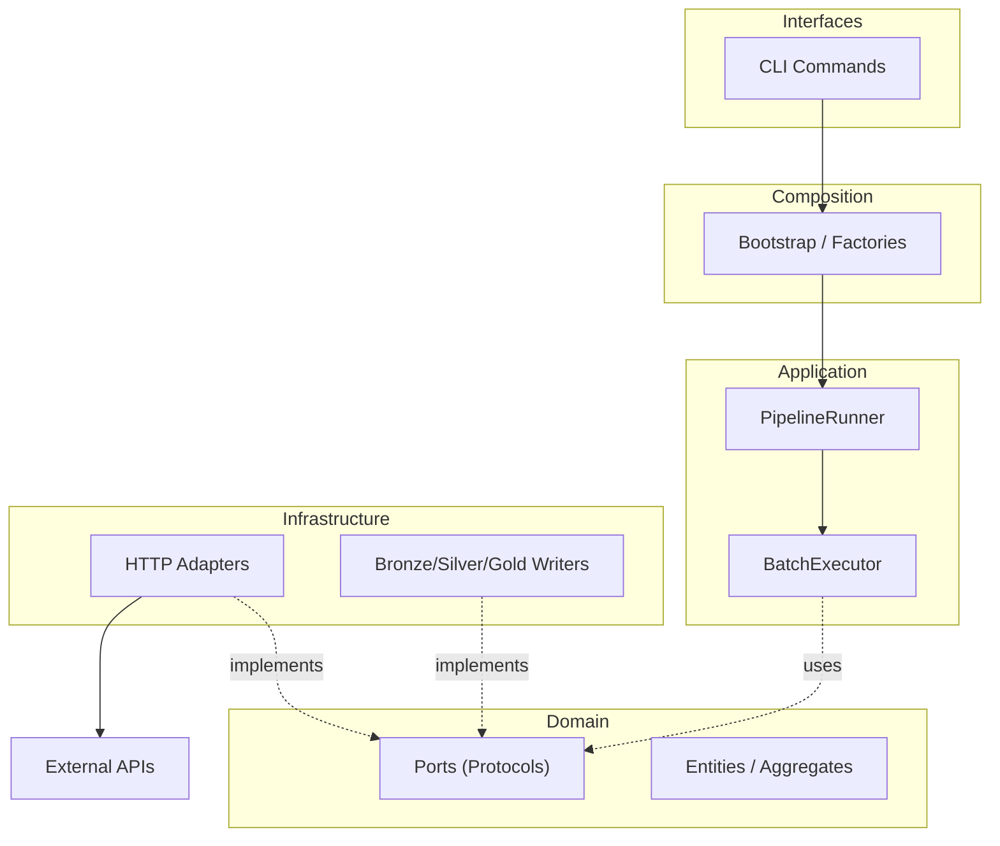
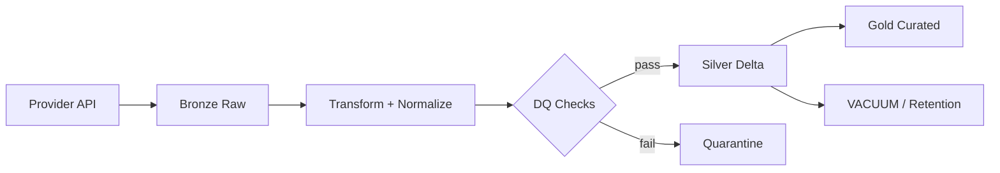
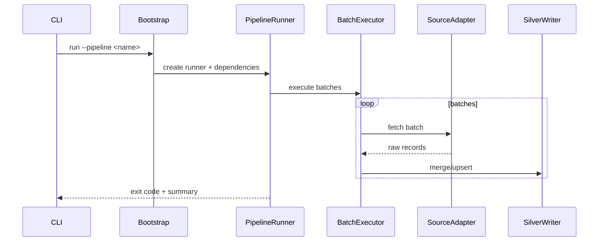
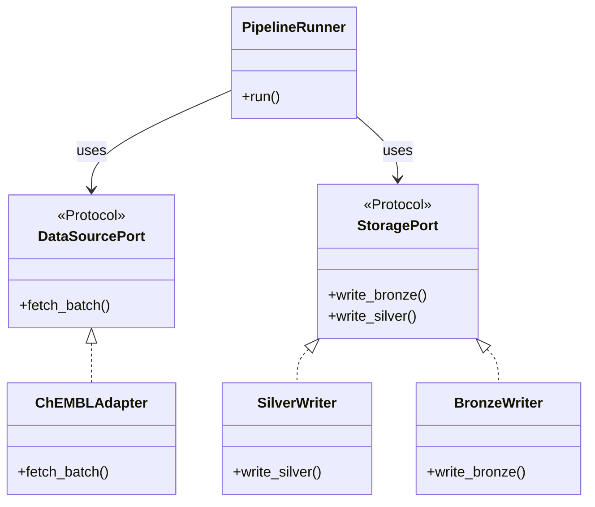
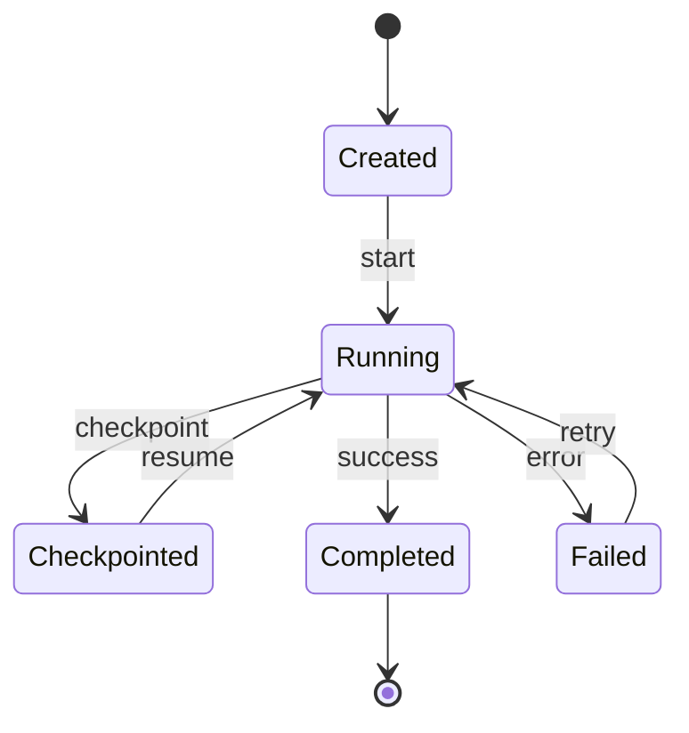
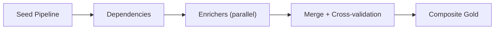

# Mermaid Pattern Library (BioETL-Oriented)

Use these templates as starting points for BioETL diagrams, then adapt node names
to match actual modules/files in the repository.

## Canonical `.mmd` Header Template

```mermaid
%% BioETL - <Title>
%% <Coverage summary>
%% @version 1.0.0
%% @date 2026-02-27
%% @type flowchart
%% @level System / Component
%% @nodes 12
%% @adr ADR-040
flowchart TB
```

## Flowchart: Hexagonal 5-Layer View



## Flowchart: Medallion Data Flow



## Sequence: CLI to Pipeline Runner



## Class Diagram: Port to Adapter Mapping



## State Diagram: Pipeline Run Lifecycle



## Flowchart: Composite Pipeline


