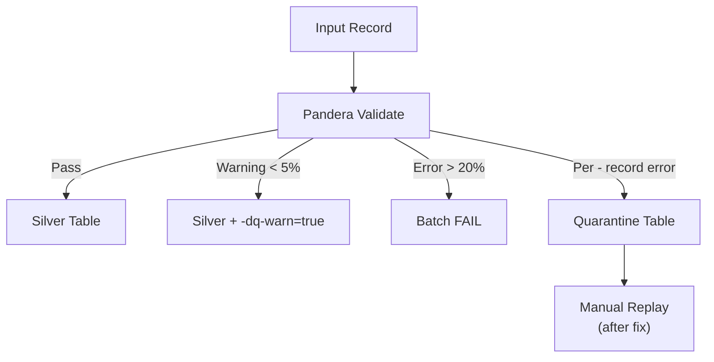

# Data Flow

*Aligned with RULES.md v5.22 (Local-Only Deployment)*

## Overview

Medallion Architecture — трёхслойная модель хранения данных: Bronze → Silver → Gold.

----------------------------------------------------------------------

## Medallion Architecture Diagram

> **Diagram:** See [`03-medallion-data-flow.mmd`](mmd-diagrams/architecture/03-medallion-data-flow.mmd)
> *(rendered не публикуются; используй source `.mmd`)*

----------------------------------------------------------------------

## Layer Specifications (§2.1)

| Layer      | Format          | Validation       | Retention         | Idempotency            |
| ---------- | --------------- | ---------------- | ----------------- | ---------------------- |
| **Bronze** | JSONL + zstd    | None             | 90 days → Archive | Append-only            |
| **Silver** | Delta Lake      | Pandera (soft)   | Permanent         | Merge/Upsert           |
| **Gold**   | Delta / Parquet | Pandera (strict) | Permanent         | SCD Type 2 / Overwrite |

----------------------------------------------------------------------

## Storage Paths

> **Note**: Local-Only deployment использует локальную файловую систему.
> Для распределённого развёртывания (future) — S3/MinIO.

```
data/output/                       # Local-Only (current)
├── bronze/
│   └── {provider}/{entity}/{date}/
│       ├── batch-001.jsonl.zst
│       └── -manifest.json
│
├── silver/
│   └── {provider}/{entity}/
│       └── [{partition-cols}/]  # Optional, configured via `partition-by` in YAML
│           └── -delta-log/
│
├── gold/
│   └── {provider}/{entity}/
│       └── -delta-log/
│
├── quarantine/
│   └── {provider}/{entity}/
│       └── {date}/
│
└── checkpoints/
    └── {pipeline-name}.json
```

**Note**: Silver partitioning is **configurable** via `partition-by` field in pipeline YAML configs.
Examples: `["year", "month"]`, `["assay-type"]`, `["organism"]`, or `[]` (no partitioning).
See `configs/entities/{provider}/{entity}.yaml` for specific configurations.

----------------------------------------------------------------------

## Pipeline Execution Flow

> **Diagram:** See [`04-pipeline-execution-flow.mmd`](mmd-diagrams/architecture/04-pipeline-execution-flow.mmd)
> *(rendered не публикуются; используй source `.mmd`)*

----------------------------------------------------------------------

## Required Metadata Fields (§2.4)

| Field              | Type      | Description                            |
| ------------------ | --------- | -------------------------------------- |
| `-run-id`          | UUID      | Pipeline execution ID                  |
| `-run-type`        | Enum      | `incremental` / `backfill` / `rebuild` |
| `-source-batch-id` | UUID      | FK to lineage-log                      |
| `-ingestion-ts`    | Timestamp | UTC ingestion time                     |
| `-content-hash`    | String    | SHA256 for deduplication               |
| `-dq-warn`         | Boolean   | Data quality warning flag              |

----------------------------------------------------------------------

## Silver → Gold Transformation

При записи в Gold слой выполняется трансформация:

1. **Фильтрация записей**: `should-write-gold()` определяет, какие записи попадают в Gold
1. **Исключение JSON полей**: `transform-for-gold()` удаляет поля из `GOLD-EXCLUDE-FIELDS`:
   - `molecule-hierarchy`, `molecule-properties`, `molecule-structures`
   - `molecule-synonyms`, `cross-references`, `atc-classifications`
1. **Валидация**: Pandera схема (strict mode) проверяет плоские поля

**Code Reference**: `src/bioetl/application/core/base-transformer.py` → `BaseTransformer.transform-for-gold()`

----------------------------------------------------------------------

## Data Quality Flow (§2.6)



**Thresholds**:

- `< 5%` errors → Write with `-dq-warn=true`
- `5-20%` errors → Warning in logs
- `> 20%` errors → Batch fails entirely

----------------------------------------------------------------------

## Error Handling Summary

| Error Type                          | Action                         | Reference |
| ----------------------------------- | ------------------------------ | --------- |
| **Transient** (timeout, rate limit) | Retry with exponential backoff | §3.1.3    |
| **Circuit Breaker** (5 consecutive) | Open for 5 min, then half-open | §3.1.4    |
| **Data Quality**                    | Route to Quarantine            | §2.6      |
| **Lock Lost**                       | Abort to prevent split-brain   | §3.3      |

----------------------------------------------------------------------

## Related Documents

- **System Context**: [system-context.md](system-context.md)
- **Architecture Diagrams**: [00-diagramming-policy.md](mmd-diagrams/docs/00-diagramming-policy.md)
