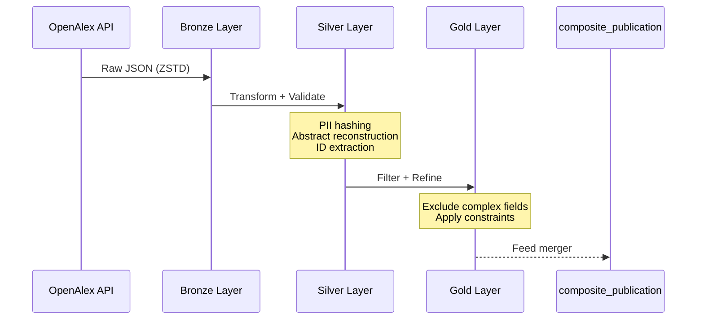
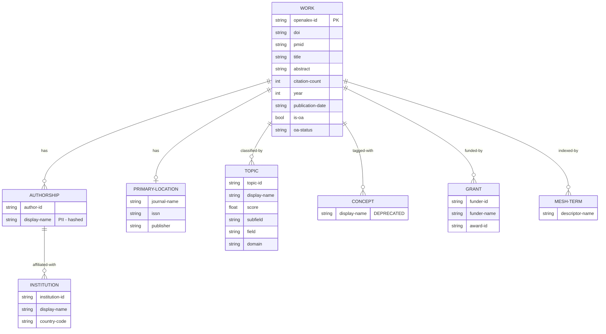

# openalex_publication

> **Status**: Deprecated. This legacy guide is superseded by current pipeline specs in `docs/pipelines/` (see `docs/pipelines/INDEX.md`).

OpenAlex Works pipeline for scholarly publication metadata with DOI resolution and title-based fallback.

---

## Overview

The `openalex_publication` pipeline ingests scholarly work records from the [OpenAlex Works API](https://docs.openalex.org/api-entities/works), transforming them through Bronze (raw JSON), Silver (normalized), and Gold (analytics-ready) layers.

**Key Features:**
- Batch DOI resolution with automatic title-based fallback
- Abstract reconstruction from inverted index format
- PII-compliant author name hashing
- Hierarchical topic classification (replacing deprecated concepts)
- Open Access status tracking (gold/green/hybrid/bronze/closed)
- Full lineage tracking with lookup method metadata

**Use Cases:**
- DOI-to-metadata resolution for publication enrichment
- Citation analysis and bibliometric research
- Open Access landscape monitoring
- Author disambiguation (via institution IDs)

---

## Pipeline Identity

| Property | Value |
|----------|-------|
| **Pipeline Name** | `openalex_publication` |
| **Version** | 1.2.0 |
| **Provider** | `openalex` |
| **Entity Type** | `publication` |
| **Primary Key** | `openalex-id` |
| **Loading Strategy** | `full-scan-only` (ADR-030, ADR-031) |
| **Batch Size** | 50 records |

### Storage Paths

| Layer | Path | Format |
|-------|------|--------|
| Bronze | `data/output/bronze/openalex/publication` | ZSTD-compressed JSONL |
| Silver | `data/output/silver/openalex/publication` | Delta Lake (partitioned by `year`) |
| Gold | `data/output/gold/openalex/publication` | Delta Lake / Parquet |

---

## Source API

### Endpoint

| Property | Value |
|----------|-------|
| **Base URL** | `https://api.openalex.org` |
| **Endpoint** | `/works` |
| **Format** | JSON |
| **Authentication** | Email-based (polite pool) |
| **Rate Limit** | ~10 req/sec (polite pool) |

### Resolution Methods

The pipeline supports multiple identifier resolution strategies:

| Method | Endpoint Pattern | Priority |
|--------|------------------|----------|
| **Direct** | `/works/{openalex-id}` | 1 (highest) |
| **DOI** | `/works/doi:{doi}` | 2 |
| **Title Fallback** | `/works?filter=title.search:{title}` | 3 (lowest) |

When DOI resolution fails, the pipeline automatically falls back to title-based search. The resolution method is tracked in `-lookup-method` for data quality auditing.

### API Response Structure

```json
{
  "id": "https://openalex.org/W2148763428",
  "doi": "https://doi.org/10.1038/nature12373",
  "title": "Example Publication Title",
  "abstract-inverted-index": {"the": [0, 5], "protein": [1], ...},
  "authorships": [...],
  "primary-location": {"source": {...}},
  "open-access": {"is-oa": true, "oa-status": "gold"},
  "cited-by-count": 150,
  ...
}
```

---

## Silver Output Contract

### Field Mapping

#### System Fields (Prefix)

| Silver Field | Type | Source | Description |
|--------------|------|--------|-------------|
| `entity-id` | string | Computed | UUID hash of business data |
| `content-hash` | string | Computed | SHA-256 of normalized content |
| `-run-id` | string | Context | Pipeline execution ID |
| `-run-type` | string | Context | "incremental" or "full-scan" |
| `-source-batch-id` | string | Adapter | Batch identifier |
| `-source` | string | Fixed | Always "openalex" |
| `-ingestion-ts` | string | Context | ISO 8601 timestamp |
| `-index` | int64 | Processor | Record index within batch |

#### Lookup Metadata

| Silver Field | Type | Source | Values |
|--------------|------|--------|--------|
| `-lookup-method` | string | Adapter | "direct" \| "doi" \| "title-fallback" \| "unknown" |
| `-original-id` | string | Adapter | Original identifier if fallback used |

#### Primary Identifier

| API Field | Silver Field | Type | Extraction |
|-----------|--------------|------|------------|
| `id` | `openalex-id` | string | URL to ID extraction |

**Extraction Logic:**
```
"https://openalex.org/W2148763428" → "W2148763428"
```

#### Cross-Reference Identifiers

| API Field | Silver Field | Type | Extraction |
|-----------|--------------|------|------------|
| `doi` | `doi` | string | URL normalization via `DOI` Value Object |
| `ids.pmid` | `pmid` | string | URL extraction (last path segment) |
| `ids.pmcid` | `pmc-id` | string | URL extraction |
| `ids.mag` | `mag-id` | string | Integer/string to string coercion |

**External ID URL Patterns:**
- PMID: `https://pubmed.ncbi.nlm.nih.gov/12345678` → `"12345678"`
- PMCID: `https://www.ncbi.nlm.nih.gov/pmc/articles/PMC123456` → `"PMC123456"`

#### Core Metadata

| API Field | Silver Field | Type | Notes |
|-----------|--------------|------|-------|
| `title` | `title` | string | Publication title |
| `abstract-inverted-index` | `abstract` | string | Reconstructed + HTML stripped |
| `type` | `type` | string | Raw OpenAlex type |
| `type` | `doc-type` | string | Mapped to unified type |
| `language` | `language` | string | ISO 639 code |
| `is-retracted` | `is-retracted` | bool | Default: False |

#### Authors & Affiliations

| API Field | Silver Field | Type | Notes |
|-----------|--------------|------|-------|
| `authorships[].author.display-name` | `authors` | string (JSON) | **PII hashed** |
| `authorships[].institutions[].display-name` | `affiliations` | string (JSON) | Sorted, deduplicated |
| `authorships[].institutions[].id` | `institution-ids` | list[string] | OpenAlex institution IDs |
| `authorships[].institutions[].country-code` | `institution-country-codes` | list[string] | ISO 2-letter codes |

#### Journal & Venue

| API Field | Silver Field | Type |
|-----------|--------------|------|
| `primary-location.source.display-name` | `journal` | string |
| `primary-location.source.issn-l` | `issn` | string |
| `primary-location.source.host-organization-name` | `publisher` | string |

#### Bibliographic Information

| API Field | Silver Field | Type |
|-----------|--------------|------|
| `biblio.volume` | `volume` | string |
| `biblio.issue` | `issue` | string |
| `biblio.first-page` | `first-page` | string |
| `biblio.last-page` | `last-page` | string |

#### Dates

| API Field | Silver Field | Type | Validation |
|-----------|--------------|------|------------|
| `publication-year` | `year` | int64 | 1500-2100 range |
| `publication-date` | `publication-date` | string | ISO 8601 normalized |

#### Open Access

| API Field | Silver Field | Type | Values |
|-----------|--------------|------|--------|
| `open-access.is-oa` | `is-oa` | bool | true/false/null |
| `open-access.oa-status` | `oa-status` | string | gold/green/hybrid/bronze/closed |

#### Classification

| API Field | Silver Field | Type | Notes |
|-----------|--------------|------|-------|
| `topics[0..9]` | `topics` | list[dict] | Hierarchical (new format) |
| `primary-topic` | `primary-topic` | dict | Most relevant topic |
| `concepts[0..9]` | `concepts` | list[string] | **DEPRECATED** |
| `mesh[].descriptor-name` | `mesh-terms` | list[string] | MeSH terms |
| `keywords[].display-name` | `keywords` | list[string] | Author keywords |
| `grants[]` | `grants` | list[dict] | Funding information |

#### Metrics

| API Field | Silver Field | Type | Notes |
|-----------|--------------|------|-------|
| `cited-by-count` | `citation-count` | int64 | Unified field name |
| `referenced-works-count` | `referenced-works-count` | int64 | Reference count |
| `fwci` | `fwci` | float64 | Field-Weighted Citation Impact |

#### DQ Flags (Suffix)

| Silver Field | Type | Default | Description |
|--------------|------|---------|-------------|
| `-dq-warn` | bool | False | Soft threshold exceeded |
| `-dq-error` | bool | False | Hard threshold exceeded |

---

## Transformations (Silver)

### Abstract Reconstruction from Inverted Index

OpenAlex stores abstracts in an inverted index format where each word maps to its positions in the text. The transformer reconstructs the original text:

**Algorithm:**
1. Parse the inverted index: `{word: [pos1, pos2, ...]}`
2. Build position-word pairs: `[(pos, word), ...]`
3. Sort by position
4. Join words with spaces
5. Strip HTML tags (OpenAlex may include markup)

**Example:**
```
Input:
{
  "the": [0, 5],
  "protein": [1],
  "structure": [2],
  "is": [3],
  "complex": [4]
}

Output: "the protein structure is complex the"
```

This approach preserves word order while handling repeated words correctly.

### PII Hashing (Authors)

Author names are classified as PII and hashed before storage (RULES.md 5.4):

```
Input:  ["John Smith", "Jane Doe"]
Output: ["sha256:a1b2c3...", "sha256:d4e5f6..."]
```

The hashed values are JSON-serialized for storage in the `authors` field.

### Affiliation Deduplication

Institution names are deduplicated and sorted for deterministic output:

```
Input:  ["MIT", "Harvard", "MIT", "Stanford"]
Output: ["Harvard", "MIT", "Stanford"]
```

### External ID URL Parsing

All external identifiers are extracted from URL format to bare IDs:

| Source Format | Extracted |
|---------------|-----------|
| `https://openalex.org/W123` | `W123` |
| `https://doi.org/10.1038/...` | `10.1038/...` |
| `https://pubmed.ncbi.nlm.nih.gov/12345` | `12345` |

### Topics Structure (Hierarchical)

Each topic includes 4-level classification hierarchy:

```json
{
  "id": "T1234",
  "display-name": "Machine Learning",
  "score": 0.95,
  "subfield": "Artificial Intelligence",
  "field": "Computer Science",
  "domain": "Physical Sciences"
}
```

---

## Gold Output Contract

### Schema Definition

**Schema Class:** `OpenAlexPublicationGoldSchema`

| Field | Type | Nullable | Constraints |
|-------|------|----------|-------------|
| `entity-id` | string | **No** | - |
| `content-hash` | string | **No** | - |
| `openalex-id` | string | **No** | Primary key |
| `doi` | string | Yes | - |
| `pmid` | string | Yes | - |
| `title` | string | Yes | - |
| `abstract` | string | Yes | - |
| `authors` | string | Yes | JSON list |
| `affiliations` | list[str] | Yes | - |
| `concepts` | list[str] | Yes | - |
| `mesh-terms` | list[str] | Yes | - |
| `keywords` | list[str] | Yes | - |
| `mag-id` | string | Yes | - |
| `journal` | string | Yes | - |
| `issn` | string | Yes | - |
| `publisher` | string | Yes | - |
| `first-page` | string | Yes | - |
| `last-page` | string | Yes | - |
| `year` | float | Yes | ge=1500, le=2100, coerce=True |
| `publication-date` | string | Yes | - |
| `type` | string | Yes | Raw OpenAlex type |
| `is-oa` | bool | Yes | coerce=True |
| `oa-status` | string | Yes | - |
| `citation-count` | float | Yes | ge=0, coerce=True |
| `language` | string | Yes | - |
| `-source` | string | **No** | Always "openalex" |
| `-lookup-method` | string | **No** | Resolution method |
| `-original-id` | string | Yes | - |
| `-dq-warn` | bool | **No** | default=False |
| `-dq-error` | bool | **No** | default=False |
| `-run-id` | string | **No** | - |
| `-run-type` | string | **No** | - |
| `-source-batch-id` | string | Yes | - |
| `-ingestion-ts` | string | **No** | - |
| `-index` | int | **No** | - |

### Required Fields

The following fields are required (nullable=False):
- `entity-id`, `content-hash` (system)
- `openalex-id` (primary key)
- `-source`, `-lookup-method` (tracking)
- `-dq-warn`, `-dq-error` (quality flags)
- `-run-id`, `-run-type`, `-ingestion-ts`, `-index` (lineage)

### Year Constraints

- **Minimum:** 1500 (historical publications)
- **Maximum:** 2100 (future-proof)
- **Coercion:** Integer to float for nullable support

### Citation Count Constraint

- **Minimum:** 0 (non-negative)
- **Coercion:** Integer to float for nullable support

---

## Gold Filters and Exclusions

### Fields Excluded from Gold

The following Silver fields are **excluded** from Gold output:

| Field | Reason |
|-------|--------|
| `topics` | Complex nested structure |
| `primary-topic` | Complex nested structure |
| `grants` | Complex nested structure |
| `pmc-id` | Not collected for OpenAlex |
| `doc-type` | Gold uses raw `type` instead |
| `institution-ids` | Denormalized institution data |
| `institution-country-codes` | Denormalized institution data |
| `referenced-works-count` | Reference metric |
| `fwci` | Citation impact metric |
| `is-retracted` | Retraction flag |

### Filter Configuration Hierarchy

Filters are loaded from (ADR-028, ADR-029):
1. `configs/base/pipeline.yaml#filter_defaults` (global)
2. `configs/providers/openalex.yaml#filters` (provider)
3. `configs/entities/openalex/publication.yaml#filters` (entity)

---

## Data Quality Checklist

### URL Parsing Failures

| Check | Severity | Threshold |
|-------|----------|-----------|
| Invalid OpenAlex ID URL | Error | 0% |
| Invalid DOI URL format | Warning | 5% |
| Invalid PMID URL format | Warning | 10% |

### Missing Identifiers

| Check | Severity | Notes |
|-------|----------|-------|
| Missing `openalex-id` | Error | Primary key required |
| Missing `doi` | Warning | Expected for most records |
| Missing `pmid` | Info | Not all works have PMID |

### Abstract Reconstruction

| Check | Severity | Threshold |
|-------|----------|-----------|
| Empty inverted index | Warning | 30% |
| Reconstruction failure | Error | 1% |
| HTML tags remaining | Warning | 5% |

### Open Access Consistency

| Check | Severity | Notes |
|-------|----------|-------|
| `is-oa=true` but `oa-status=closed` | Warning | Inconsistent OA data |
| `is-oa=null` | Info | Unknown OA status |
| Invalid `oa-status` value | Error | Must be known status |

### Author/Affiliation Extraction

| Check | Severity | Threshold |
|-------|----------|-----------|
| Empty authors list | Warning | 10% |
| PII hashing failure | Error | 0% |
| Empty affiliations | Info | 40% (many works lack affiliations) |

---

## Lineage

### Data Flow



### Upstream Sources

| Source | Description |
|--------|-------------|
| OpenAlex Works API | Primary data source |
| DOI resolution | Via `/works/doi:{doi}` |
| Title search | Fallback via `?filter=title.search:{title}` |

### Downstream Consumers

| Consumer | Usage |
|----------|-------|
| `composite_publication` | Silver merge input |
| Analytics dashboards | Gold layer queries |
| DOI enrichment services | Publication metadata lookup |

### Composite Pipeline Integration

The `composite_publication` pipeline uses OpenAlex Silver data as an enricher:

```yaml
# composite_publication config excerpt
enrichers:
  - name: openalex_publication
    source: silver/openalex/publication
    join-keys: [doi, pmid]
    priority: 2
```

---

## Examples

### Sample Bronze Record

```json
{
  "id": "https://openalex.org/W2148763428",
  "doi": "https://doi.org/10.1038/nature12373",
  "title": "Crystal structure of a bacterial homologue",
  "abstract-inverted-index": {
    "The": [0],
    "crystal": [1],
    "structure": [2],
    "reveals": [3]
  },
  "authorships": [
    {
      "author": {
        "id": "https://openalex.org/A1234567890",
        "display-name": "John Smith"
      },
      "institutions": [
        {
          "id": "https://openalex.org/I1234567890",
          "display-name": "University of Oxford",
          "country-code": "GB"
        }
      ]
    }
  ],
  "primary-location": {
    "source": {
      "display-name": "Nature",
      "issn-l": "0028-0836",
      "host-organization-name": "Springer Nature"
    }
  },
  "open-access": {
    "is-oa": true,
    "oa-status": "hybrid"
  },
  "cited-by-count": 150,
  "publication-year": 2013,
  "publication-date": "2013-08-15"
}
```

### Sample Silver Record

```json
{
  "entity-id": "uuid-abc123...",
  "content-hash": "sha256:def456...",
  "openalex-id": "W2148763428",
  "doi": "10.1038/nature12373",
  "pmid": null,
  "title": "Crystal structure of a bacterial homologue",
  "abstract": "The crystal structure reveals",
  "authors": "[\"sha256:author1...\"]",
  "affiliations": "[\"University of Oxford\"]",
  "institution-ids": ["I1234567890"],
  "institution-country-codes": ["GB"],
  "journal": "Nature",
  "issn": "0028-0836",
  "publisher": "Springer Nature",
  "is-oa": true,
  "oa-status": "hybrid",
  "citation-count": 150,
  "year": 2013,
  "publication-date": "2013-08-15",
  "-source": "openalex",
  "-lookup-method": "doi",
  "-run-id": "run-123",
  "-dq-warn": false,
  "-dq-error": false
}
```

---

## Entity Relationship Diagram



**Note:** Institutions, Topics, Concepts, Grants, and MeSH terms are stored as JSON arrays in Silver, not as normalized tables.

---

## Known Limitations / TODO

### Current Limitations

1. **Full Scan Only**: No incremental loading due to OpenAlex API offset pagination instability (ADR-030, ADR-031).

2. **Topics Not in Gold**: Hierarchical topic classification is excluded from Gold schema due to complex nested structure.

3. **Concepts Deprecated**: The `concepts` field is deprecated by OpenAlex (2024). Use `topics` for new development.

4. **Title Fallback Accuracy**: Title-based search may return incorrect matches for common titles. The `-lookup-method` field allows filtering these records.

5. **Abstract Coverage**: Not all OpenAlex works have abstracts. The inverted index may be empty or null.

6. **PII Hashing Irreversibility**: Author names cannot be recovered once hashed. Store raw names separately if needed for display.

### Future Enhancements

- [ ] Add `topics` and `grants` to Gold schema with flattened structure
- [ ] Implement incremental loading when OpenAlex stabilizes cursor pagination
- [ ] Add author ORCID extraction from `authorships[].author.orcid`
- [ ] Add related works extraction (`related-works[]`)
- [ ] Add citation context extraction from `referenced-works[]`

---

## Changelog

| Version | Date | Changes |
|---------|------|---------|
| 1.2.0 | 2026-01 | Added topics/primary-topic extraction (new OpenAlex format) |
| 1.1.0 | 2025-12 | Added institution-ids and country-codes extraction |
| 1.0.0 | 2025-10 | Initial release with DOI resolution and title fallback |

---

## References

- [OpenAlex Works API Documentation](https://docs.openalex.org/api-entities/works)
- [OpenAlex Data Model](https://docs.openalex.org/about-the-data)
- [ADR-030: Publication Pagination Strategy](../../02-architecture/decisions/ADR-030-publication-pagination-strategy.md)
- [ADR-031: Loading Strategy Formalization](../../02-architecture/decisions/ADR-031-loading-strategy-formalization.md)
- [RULES.md 5.4: PII Handling](../../00-project/RULES.md#54-политика-чувствительных-данных-sensitive-data)
