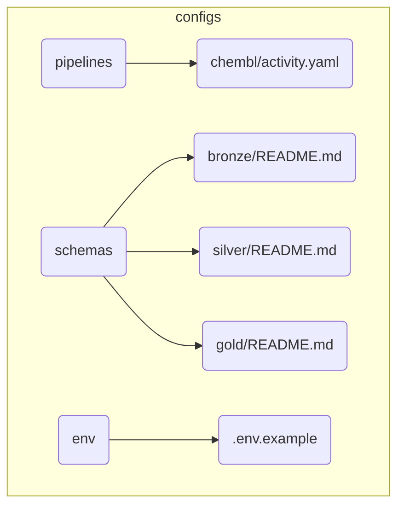

# BioETL Project Navigator
*Synced with RULES.md v5.0 (2025-12-15)*

## Quick Links

| Need to... | Go to |
|------------|-------|
| Understand the rules | [RULES.md](../RULES.md) |
| Create a new pipeline | [04-extending-bioetl.md](00-project_rules/04-extending-bioetl.md) |
| Review a pipeline | [pipeline-review-checklist.md](templates/pipeline-review-checklist.md) |
| Handle a prod error | [runbooks/](runbooks/) |
| Understand architecture | [01-architecture/](01-architecture/) |
| Check data contracts | [contracts/gold/](contracts/gold/) |

---

## Documentation Structure

```
docs/
├── 00-map.md                    # This file (Project Navigator)
│
├── 00-project_rules/            # Project governance
│   ├── 00-rules-summary.md      # TL;DR of RULES.md
│   ├── 01-project-rules.md      # Full project rules
│   ├── 02-user-rules.md         # Guidelines for contributors
│   ├── 03-file-policy.md        # File/directory structure
│   ├── 04-extending-bioetl.md   # How to add providers/pipelines
│   └── 05-cleanup-policy.md     # Cleanup and retention
│
├── 01-architecture/             # System architecture
│   ├── 01-domain-objects.md     # Business entities (DEPRECATED, see system-context)
│   ├── 02-etl-layers.md         # Layer responsibilities
│   ├── 03-data-flow.md          # Pipeline execution flow
│   ├── 04-duplication-reduction.md  # Code reuse patterns
│   ├── 05-physical-layout.md    # Directory structure
│   ├── 06-architecture-diagrams.md  # Visual diagrams
│   ├── decisions/               # Architecture Decision Records
│   └── diagrams/                # Diagram source files
│       └── 00-diagramming-policy.md
│
├── 02-architecture/             # C4 Model & High-Level Diagrams
│   ├── system-context.md        # C4 System Context Diagram
│   └── data-flow.md             # High-level Medallion data flow
│
├── application/                 # Pipeline documentation
│   └── pipelines/               # Per-provider/entity docs
│       └── {provider}/
│           └── {entity}/
│
├── contracts/                   # Data contracts
│   ├── README.md                # Contract versioning policy
│   └── gold/                    # Gold schema JSON files
│       └── {entity}.json
│
├── domain/                      # Domain documentation
│   └── schemas/                 # Schema documentation
│
├── guides/                      # How-to guides
│
├── infrastructure/              # Infrastructure docs
│
├── interfaces/                  # CLI documentation
│
├── runbooks/                    # Operational runbooks
│
└── templates/                   # Document templates
    └── pipeline-review-checklist.md
```

---

## By Topic

### Getting Started

1. [RULES.md](../RULES.md) - Project rules (start here)
2. [00-rules-summary.md](00-project_rules/00-rules-summary.md) - Quick reference
3. [02-user-rules.md](00-project_rules/02-user-rules.md) - Contributor guidelines

### Architecture

| Document | Covers | RULES.md |
|----------|--------|----------|
| [01-domain-objects.md](01-architecture/01-domain-objects.md) | Entity models, IDs, relationships | §2.8 |
| [02-etl-layers.md](01-architecture/02-etl-layers.md) | Ports & Adapters, layer responsibilities | §1.1 |
| [03-data-flow.md](01-architecture/03-data-flow.md) | Pipeline stages, Medallion flow | §2.1, §3 |
| [04-duplication-reduction.md](01-architecture/04-duplication-reduction.md) | Code reuse, patterns | §1 |
| [05-physical-layout.md](01-architecture/05-physical-layout.md) | Directory structure, imports | §6 |
| [06-architecture-diagrams.md](01-architecture/06-architecture-diagrams.md) | Visual diagrams | - |

### Data Management

| Topic | Document | RULES.md |
|-------|----------|----------|
| Medallion Layers | [03-data-flow.md](01-architecture/03-data-flow.md) | §2.1 |
| Schema Drift | [01-project-rules.md](00-project_rules/01-project-rules.md#33-политика-дрейфа-схемы-schema-drift) | §2.2 |
| Data Lineage | [01-domain-objects.md](01-architecture/01-domain-objects.md) | §2.3 |
| Backfill/Replay | [01-project-rules.md](00-project_rules/01-project-rules.md#35-политика-backfill--replay) | §2.4 |
| Quarantine | [01-project-rules.md](00-project_rules/01-project-rules.md#371-unified-quarantine-commonquarantine) | §2.6 |
| Content Hash | [01-domain-objects.md](01-architecture/01-domain-objects.md) | §2.8 |

### Operations

| Topic | Document | RULES.md |
|-------|----------|----------|
| Error Handling | [02-etl-layers.md](01-architecture/02-etl-layers.md#error-handling-31) | §3.1 |
| Circuit Breaker | [02-etl-layers.md](01-architecture/02-etl-layers.md#circuit-breaker-314) | §3.1.4 |
| Locking | [03-data-flow.md](01-architecture/03-data-flow.md#1-lock-acquisition-33) | §3.3 |
| DQ Metrics | [01-project-rules.md](00-project_rules/01-project-rules.md#47-метрики-качества-данных-dq-metrics) | §3.4 |
| Graceful Shutdown | [03-data-flow.md](01-architecture/03-data-flow.md#graceful-shutdown-53) | §5.3 |
| DR Procedures | [runbooks/](runbooks/) | §5.5 |
| Cleanup | [05-cleanup-policy.md](00-project_rules/05-cleanup-policy.md) | §2.1.1 |

### Development

| Topic | Document | RULES.md |
|-------|----------|----------|
| Adding Providers | [04-extending-bioetl.md](00-project_rules/04-extending-bioetl.md) | App D |
| Pipeline Review | [pipeline-review-checklist.md](templates/pipeline-review-checklist.md) | §4.2 |
| Testing | [01-project-rules.md](00-project_rules/01-project-rules.md#13-тестирование-и-контроль-качества) | §4.2 |
| Code Style | [01-project-rules.md](00-project_rules/01-project-rules.md#10-стиль-кода-и-качество) | §4 |
| Refactoring | [01-project-rules.md](00-project_rules/01-project-rules.md#14-рефакторинг-модулей) | - |

---

## Source Code Map

```
src/bioetl/
├── domain/                  # Pure logic, no I/O
│   ├── ports.py             # Protocol interfaces (§1.1.1)
│   ├── models/              # Pydantic models
│   ├── schemas/             # Pandera schemas
│   ├── services/            # Hash, Validation, Normalization
│   └── rules/               # DQ rules, Schema Drift
│
├── application/             # Orchestration
│   ├── pipelines/           # {provider}/{entity}/
│   ├── services/            # Extraction, Bootstrap
│   └── observers/           # Metrics, Circuit Breaker, Health
│
├── infrastructure/          # I/O adapters
│   ├── adapters/            # API clients
│   ├── storage/             # Delta Lake, Bronze, S3
│   ├── locking/             # Redis locks
│   ├── security/            # Salt manager
│   ├── quarantine/          # DQ failure handling
│   ├── config/              # YAML → Pydantic
│   └── logging/             # UnifiedLogger
│
└── interfaces/              # External interfaces
    └── cli/                 # Typer CLI
```

---

## Config Files Map



---

## Key Files

| File | Purpose |
|------|---------|
| `RULES.md` | Master rules document |
| `CHANGELOG.md` | Version history |
| `configs/pipelines/{provider}/{entity}.yaml` | Pipeline configuration |
| `src/bioetl/domain/ports.py` | Protocol interfaces |
| `src/bioetl/domain/schemas/{provider}/{entity}.py` | Pandera schemas |
| `docs/02-architecture/system-context.md` | High-level system diagram |
| `docs/contracts/gold/{entity}.json` | Gold data contracts |

---

## Related Resources

- **Repository**: [SatoryKono/BioactivityDataAcquisition](https://github.com/SatoryKono/BioactivityDataAcquisition)
- **Issues**: Report bugs and feature requests
- **CI/CD**: GitHub Actions workflows

---

## Document Status

| Document | Last Updated | Status |
|----------|--------------|--------|
| RULES.md | 2025-12-15 | v5.0 |
| 00-rules-summary.md | 2025-12-15 | Synced |
| 01-project-rules.md | 2025-12-15 | Synced |
| All architecture docs | 2025-12-15 | Synced |

---

*This navigator is auto-generated. Update when adding new documentation.*
