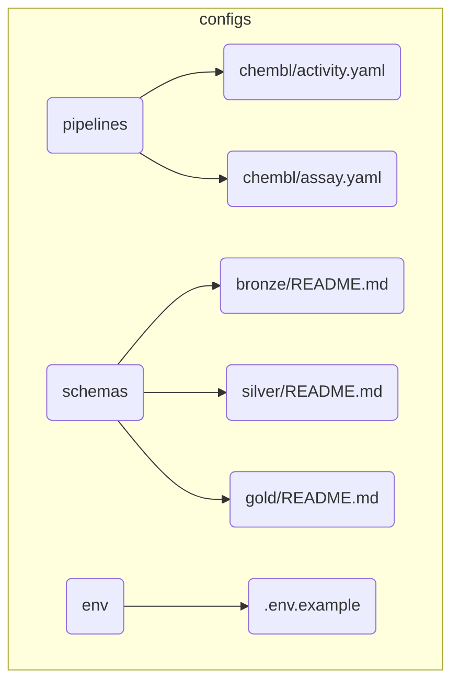

# BioETL Project Navigator

*Synced with RULES.md v5.12 | Last updated: 2026-01-26*

> **Documentation Update:** 2026-01-26
> - Architecture diagrams updated: Composite Pipeline (ADR-026) added to layer diagrams
> - New diagram: `26_composite_pipeline_workflow.mmd` — visualizes seed → enrich → merge flow
> - Cross-links added between all layer documents (Domain ↔ Application ↔ Infrastructure ↔ Interfaces ↔ Composition)
> - All 7 providers now reflected in diagrams (including CrossRef, OpenAlex, SemanticScholar)
> - ADR-030, ADR-031 added to registry
> - See: [02-architecture/00-overview.md](02-architecture/00-overview.md) for updated architecture overview

## Quick Links

| Need to...              | Go to                                                                  |
|-------------------------|------------------------------------------------------------------------|
| Understand the rules    | [RULES.md](RULES.md)                 |
| Look up terminology     | [glossary.md](glossary.md)           |
| Create a new pipeline   | [00-project_rules/04-extending-bioetl.md](00-project_rules/04-extending-bioetl.md)      |
| Review a pipeline       | [templates/pipeline-review-checklist.md](templates/pipeline-review-checklist.md) |
| Handle a prod error     | [05-operations/runbooks/index.md](05-operations/runbooks/index.md)                           |
| Understand architecture | [02-architecture/00-overview.md](02-architecture/00-overview.md)                  |
| Check data contracts    | [contracts/gold/activity_v1.0.json](contracts/gold/activity_v1.0.json)                        |

---

## Language Policy

| Category | Language | Examples |
|----------|----------|----------|
| **Public-facing** | English | README.md, CONTRIBUTING.md, CHANGELOG.md |
| **User guides** | English | docs/03-guides/*, docs/04-reference/* |
| **Internal governance** | Russian | RULES.md, AGENT.md, docs/00-project_rules/* |
| **Architecture docs** | Russian | docs/02-architecture/* |
| **Code comments** | Russian | Docstrings, inline comments |

---

## Documentation Structure

```
docs/
├── 00-map.md                    # This file (Project Navigator)
├── index.md                     # Welcome page
├── glossary.md                  # Ubiquitous Language terminology
├── RULES.md                     # Canonical rules document (v5.12)
├── REQUIREMENTS.md              # 156 testable requirements
│
├── archived/                    # Historical documents
│   ├── audits/                  # Audit reports
│   └── refactoring-plan.md     # Archived refactoring roadmap
│
├── 00-project_rules/            # Project governance
│   ├── 03-file-policy.md        # File/directory structure
│   └── 04-extending-bioetl.md   # How to add providers/pipelines
│
├── quick-reference/             # Quick reference documents
│   └── rules-summary.md         # TL;DR of RULES.md
│
├── 02-architecture/             # System architecture
│   ├── 00-overview.md           # Architecture overview & navigation
│   ├── 01-domain-layer.md       # Domain layer architecture
│   ├── 02-application-layer.md  # Application layer architecture
│   ├── 03-infrastructure-layer.md # Infrastructure layer architecture
│   ├── 04-interfaces-layer.md   # Interfaces layer architecture
│   ├── 05-composition-layer.md  # Composition layer (DI) architecture
│   ├── system-context.md        # C4 System Context Diagram
│   ├── container-diagram.md     # C4 Container Diagram
│   ├── data-flow.md             # High-level Medallion data flow
│   ├── data-layers.md           # Bronze/Silver/Gold layer details
│   ├── observability-layers.md  # Observability architecture
│   ├── diagrams.md              # Mermaid diagrams collection
│   ├── decisions/               # ADR-001..031 (31 records)
│   └── diagrams/                # 35 Mermaid diagram files + render_diagrams.py
│
├── 03-guides/                   # How-to guides (13 guides)
│   ├── quick-start.md           # Quick start guide
│   ├── getting-started.md       # Getting started
│   ├── running-pipelines.md     # Running pipelines
│   ├── testing.md               # Testing guide
│   ├── local-storage-layout.md  # Storage layout explanation
│   ├── pipeline-lifecycle.md    # Pipeline lifecycle
│   ├── registry-pattern.md      # Registry pattern guide
│   ├── troubleshooting.md       # Troubleshooting
│   ├── add-new-source.md        # Adding new provider
│   ├── add-pipeline-existing-source.md  # Adding pipeline to existing provider
│   ├── date-handling.md         # Date normalization guide
│   └── dq-configuration.md      # Data quality configuration
│
├── 03-data-contracts/           # Data contracts
│   └── gold-schemas.md          # Gold layer schema documentation
│
├── 04-reference/                # Reference documentation
│   ├── api/                     # API reference by layer
|   │   ├── application/         # Application layer docs
|   │   │   ├── core.md          # Core components
|   │   │   └── services.md      # Application services
│   ├── cli.md                   # CLI reference
│   └── pipelines/               # Pipeline-specific reference
│
├── 05-operations/               # Operational runbooks
│   ├── README.md                # Operations overview
│   ├── runbooks/                # 16 incident response playbooks
│   ├── performance-baselines.md # Performance metrics
│   ├── vacuum-retention.md      # VACUUM retention policies
│   └── RELEASE_CHECKLIST.md     # Release checklist
│
├── archived/                    # Historical documents
│   ├── audits/                  # Audit files (2025-2026)
│   ├── plans/                   # Archived planning documents
│   ├── project_rules/           # Deprecated project rules
│   └── refactoring-plan.md      # Archived refactoring roadmap
│
├── domain/schemas/              # Schema documentation
│   └── chembl/                  # ChEMBL entity schemas (4 files)
│
├── providers/                   # Provider-specific documentation
│   ├── README.md                # Provider overview
│   ├── chembl/                  # ChEMBL (12 entities)
│   ├── pubchem/                 # PubChem (1 entity)
│   ├── uniprot/                 # UniProt (1 entity)
│   ├── pubmed/                  # PubMed (1 entity)
│   ├── crossref/                # CrossRef (1 entity)
│   ├── openalex/                # OpenAlex (1 entity)
│   └── semanticscholar/         # SemanticScholar (1 entity)
│
├── refactoring/                 # Active refactoring documentation
│   ├── README.md                # Refactoring overview
│   ├── duplication-analysis-2026-01.md
│   └── refactoring-plan-duplicate-logic.md
│
├── analysis/                    # Analysis reports
│   ├── bioetl-interfaces-analysis-2026-01-14.md
│   └── pipeline-interface-alignment-report.md
│
├── contracts/gold/              # Gold layer JSON schemas
│
└── templates/                   # Document & code templates
```

---

## By Topic

### Getting Started

1. [RULES.md](RULES.md) - Project rules (start here)
2. [rules-summary.md](quick-reference/rules-summary.md) - Quick reference
3. [04-extending-bioetl.md](00-project_rules/04-extending-bioetl.md) - Adding providers/pipelines

### Architecture

| Document                                                                                     | Covers                                   | RULES.md |
|----------------------------------------------------------------------------------------------|------------------------------------------|----------|
| [system-context.md](02-architecture/system-context.md)                                       | Entity models, IDs, relationships        | §2.8     |
| [container-diagram.md](02-architecture/container-diagram.md)                               | C4 Container, Docker services            | §5.6     |
| [data-flow.md](02-architecture/data-flow.md)                                                 | Ports & Adapters, layer responsibilities | §1.1     |
| [05-composition-layer.md](02-architecture/05-composition-layer.md)                           | Composition Root, DI, Factories          | §1.1     |
| [ADR-001: Delta Lake](02-architecture/decisions/ADR-001-delta-lake-vs-parquet.md)            | Storage engine choice                    | §2.1, §3 |
| [ADR-002: Medallion](02-architecture/decisions/ADR-002-medallion-architecture.md)            | Data layering pattern                    | §1       |
| [ADR-003: In-Memory Locking](02-architecture/decisions/ADR-003-in-memory-locking-strategy.md) | MemoryLock strategy                      | §6       |
| [ADR-004: Pydantic](02-architecture/decisions/ADR-004-pydantic-vs-dataclasses.md)            | Validation approach                      | -        |
| [ADR-005: Composition Layer](02-architecture/decisions/ADR-005-composition-layer-separation.md) | DI and layer separation               | §1.1     |
| [ADR-006: Logger/Metrics Ports](02-architecture/decisions/ADR-006-logger-metrics-ports.md)   | Port abstractions                        | §1.1     |
| [ADR-007: Circuit Breaker](02-architecture/decisions/ADR-007-circuit-breaker-implementation.md) | Failure handling pattern               | §3.1.4   |
| [ADR-008: Graceful Shutdown](02-architecture/decisions/ADR-008-graceful-shutdown-strategy.md) | SIGTERM/SIGINT handling                  | §5.3     |
| [ADR-009: Paginated Fetcher](02-architecture/decisions/ADR-009-paginated-fetcher-mixin.md)   | Pagination abstraction                   | App D    |
| [ADR-010: Local-Only Deploy](02-architecture/decisions/ADR-010-local-only-deployment.md)     | File-based deployment (no Docker)        | §5.6     |
| [ADR-011: Watermark Removal](02-architecture/decisions/ADR-011-remove-watermark-mechanism.md) | Simplified checkpoint model             | §2.4     |
| [ADR-012: Storage Clear Contract](02-architecture/decisions/ADR-012-storage-clear-contract-and-run-id.md) | Storage clear API, run_id injection | §2.1     |
| [ADR-013: Async Storage Cleanup](02-architecture/decisions/ADR-013-async-storage-cleanup.md) | MedallionLifecycleService pattern        | §2.1     |
| [ADR-014: Deterministic Writes](02-architecture/decisions/ADR-014-deterministic-writes.md)   | SCD2 ingestion_ts, reproducible writes   | §2.1     |
| [ADR-015: Pipeline Services Lifecycle](02-architecture/decisions/ADR-015-pipeline-services-lifecycle.md) | Port lifecycle contracts       | §1.1     |
| [ADR-016: Error Handling Strategy](02-architecture/decisions/ADR-016-error-handling-strategy.md) | Unified error classification          | §3.1     |
| [ADR-017: Observability Architecture](02-architecture/decisions/ADR-017-observability-architecture.md) | Metrics, tracing, logging ports    | §5.1     |
| [ADR-018: Gold Strict Validation](02-architecture/decisions/ADR-018-gold-strict-validation.md) | Pandera Gold validation                | §2.7     |
| [ADR-019: Observability Port Enforcement](02-architecture/decisions/ADR-019-observability-port-enforcement.md) | REQ-OBS-001 compliance       | §5.1     |
| [ADR-020: BasePipeline Decomposition](02-architecture/decisions/ADR-020-basepipeline-decomposition.md) | God Object refactoring       | §1.1     |
| [ADR-021: DDD Aggregates](02-architecture/decisions/ADR-021-ddd-aggregates-adoption.md) | DDD aggregates adoption       | -        |
| [ADR-022: Tracing NoOp](02-architecture/decisions/ADR-022-tracing-noop.md) | NoOp for tracing              | -        |
| [ADR-023: Entity Type Patterns](02-architecture/decisions/ADR-023-entity-type-patterns.md) | Entity type patterns          | -        |
| [ADR-024: Entity Naming Unification](02-architecture/decisions/ADR-024-entity-naming-unification.md) | Entity naming unification     | -        |
| [ADR-025: Pipeline Config Unification](02-architecture/decisions/ADR-025-pipeline-config-unification.md) | Pipeline config unification   | -        |
| [ADR-026: Composite Pipeline Pattern](02-architecture/decisions/ADR-026-composite-pipeline-pattern.md) | Composite pipeline pattern    | -        |
| [ADR-027: DQ Rules Externalization](02-architecture/decisions/ADR-027-dq-rules-externalization.md) | Hierarchical DQ configuration | §3.1.2   |
| [ADR-028: Filter Rules Externalization](02-architecture/decisions/ADR-028-filter-rules-externalization.md) | Hierarchical filter configuration | App D   |
| [ADR-029: Output Metadata Unification](02-architecture/decisions/ADR-029-output-metadata-unification.md) | Unified output metadata contracts | §2.4    |
| [ADR-030: Publication Pagination Strategy](02-architecture/decisions/ADR-030-publication-pagination-strategy.md) | Publication pagination strategy | -       |
| [ADR-031: Loading Strategy Formalization](02-architecture/decisions/ADR-031-loading-strategy-formalization.md) | Loading strategy formalization | -       |

### Data Management

| Topic            | Document                                                                                            | RULES.md |
|------------------|-----------------------------------------------------------------------------------------------------|----------|
| Medallion Layers | [data-flow.md](02-architecture/data-flow.md)                                                        | §2.1     |
| Schema Drift     | [RULES.md](RULES.md#22-обработка-дрейфа-схемы)   | §2.2     |
| Data Lineage     | [system-context.md](02-architecture/system-context.md)                                              | §2.3     |
| Backfill/Replay  | [RULES.md](RULES.md#24-стратегия-backfill-и-replay)            | §2.4     |
| Quarantine       | [RULES.md](RULES.md#26-dead-letter-queue--quarantine) | §2.6     |
| Content Hash     | [system-context.md](02-architecture/system-context.md)                                              | §2.8     |

### Schema Documentation

| Provider | Entity | Schema Document | RULES.md |
|----------|--------|-----------------|----------|
| ChEMBL | Activity | [activity-schema.md](domain/schemas/chembl/activity-schema.md) | §2.8 |
| ChEMBL | Molecule | [molecule-schema.md](domain/schemas/chembl/molecule-schema.md) | §2.8 |
| ChEMBL | Target | [target-schema.md](domain/schemas/chembl/target-schema.md) | §2.8 |
| ChEMBL | Assay | [assay-schema.md](domain/schemas/chembl/assay-schema.md) | §2.8 |

### Operations

| Topic             | Document                                                                                          | RULES.md |
|-------------------|---------------------------------------------------------------------------------------------------|----------|
| Error Handling    | [ADR-016](02-architecture/decisions/ADR-016-error-handling-strategy.md)         | §3.1     |
| Circuit Breaker   | [ADR-007](02-architecture/decisions/ADR-007-circuit-breaker-implementation.md)  | §3.1.4   |
| Locking           | [ADR-003](02-architecture/decisions/ADR-003-in-memory-locking-strategy.md)      | §3.3     |
| DQ Metrics        | [RULES.md](RULES.md#34-data-quality-метрики)                                    | §3.4     |
| Graceful Shutdown | [ADR-008](02-architecture/decisions/ADR-008-graceful-shutdown-strategy.md)      | §5.3     |
| DR Procedures     | [runbooks/index.md](05-operations/runbooks/index.md)                            | §5.5     |
| Cleanup           | [cleanup-policy.md](03-guides/cleanup-policy.md)                                | §2.1.1   |

### Development

| Topic            | Document                                                                                        | RULES.md |
|------------------|-------------------------------------------------------------------------------------------------|----------|
| Adding Providers | [add-new-source.md](03-guides/add-new-source.md)                                                | App D    |
| Adding Pipelines | [add-pipeline-existing-source.md](03-guides/add-pipeline-existing-source.md)                    | App D    |
| Pipeline Review  | [pipeline-review-checklist.md](templates/pipeline-review-checklist.md)                          | §4.2     |
| Testing          | [testing.md](03-guides/testing.md)                                                              | §4.2     |
| E2E Testing      | [ADR-010](02-architecture/decisions/ADR-010-local-only-deployment.md)                           | §4.2.3   |
| Date Handling    | [date-handling.md](03-guides/date-handling.md)                                                  | §2.4     |
| Code Style       | [RULES.md §4](RULES.md#4-качество-кода-и-тестирование)                                          | §4       |

---

## Source Code Map

```
src/bioetl/
├── domain/                      # Pure logic, no I/O (§1.1)
│   ├── ports/                   # Protocol interfaces (Ports & Adapters)
│   │   ├── __init__.py          # Facade — single import point
│   │   ├── data_source.py       # DataSourcePort, FilterableDataSourcePort
│   │   ├── storage.py           # StoragePort
│   │   ├── locking.py           # LockPort
│   │   ├── checkpoint.py        # CheckpointPort
│   │   ├── quarantine.py        # QuarantinePort
│   │   ├── observability.py     # MetricsPort, TracingPort, LoggerPort
│   │   ├── validation.py        # GoldValidatorPort
│   │   └── filtering.py         # InputFilterPort
│   ├── config.py                # Domain config models
│   ├── exceptions.py            # Domain exceptions hierarchy
│   ├── transformations.py       # Pure transformation functions
│   └── types.py                 # Value objects (RunType, ErrorCode)
│
├── application/                 # Pipeline orchestration (§1.1)
│   ├── core/                    # Core pipeline infrastructure
│   │   ├── base.py              # Base pipeline primitives
│   │   ├── base_transformer.py  # Base transformer contracts
│   │   ├── batch_executor.py    # Batch executor
│   │   ├── pipeline_services.py # Service container
│   │   ├── runner.py            # PipelineRunner (Driving Adapter logic)
│   │   └── shutdown.py          # Graceful shutdown handling
│   ├── composite/               # Composite pipeline orchestration
│   ├── pipelines/               # Concrete pipeline implementations
│   │   ├── common/              # Shared pipeline helpers
│   │   ├── chembl/              # Provider namespace
│   │   │   ├── activity.py      # ChEMBL Activity pipeline
│   │   │   ├── assay.py         # ChEMBL Assay pipeline
│   │   │   └── molecule.py      # ChEMBL Molecule pipeline
│   │   ├── pubchem/             # Provider namespace
│   │   │   └── compound.py      # PubChem Compound pipeline
│   │   ├── pubmed/              # Provider namespace
│   │   │   └── publication.py   # PubMed Publication pipeline
│   │   ├── uniprot/             # Provider namespace
│   │   │   └── protein.py       # UniProt Protein pipeline
│   │   ├── crossref/            # Provider namespace
│   │   │   └── transformer.py   # CrossRef transformer
│   │   ├── openalex/            # Provider namespace
│   │   │   └── transformer.py   # OpenAlex transformer
│   │   ├── semanticscholar/     # Provider namespace
│   │   │   └── transformer.py   # SemanticScholar transformer
│   │   └── generic.py           # Generic pipeline helpers
│   ├── services/                # Application services
│   └── observability/           # Application-level observability
│
├── composition/                 # Composition Root (DI container)
│   ├── bootstrap/               # Bootstrap helpers
│   ├── bootstrap_contexts.py    # Bootstrap contexts
│   ├── bootstrap_logger.py      # Bootstrap logging setup
│   ├── builders.py              # Composition builders
│   ├── entrypoints.py           # CLI/runner entrypoints
│   ├── observability.py         # Observability wiring
│   ├── registry.py              # Pipeline discovery
│   ├── providers/               # Provider registration
│   ├── services/                # Composition services
│   └── factories/               # Consolidated factories
│       ├── pipeline_factory.py  # Pipeline factory
│       ├── runner_factory.py    # Runner factory
│       └── storage_factory.py   # Multi-layer storage factory
│
├── infrastructure/              # I/O adapters (§1.1)
│   ├── adapters/                # External API clients
│   │   ├── http/                # HTTP client infrastructure
│   │   ├── chembl/              # ChEMBL API adapter
│   │   ├── pubchem/             # PubChem API adapter
│   │   └── uniprot/             # UniProt API adapter
│   ├── storage/                 # Data persistence
│   │   ├── bronze_writer.py     # JSONL + zstd writer
│   │   ├── delta_writer.py      # Delta Lake merge/upsert
│   │   └── gold_writer.py       # SCD Type 2 writer
│   ├── locking/                 # Distributed locking
│   │   └── memory_lock.py       # In-memory (local-only)
│   ├── checkpoint/              # Checkpoint persistence
│   ├── quarantine/              # DQ failure handling
│   ├── observability/           # Metrics, logging
│   ├── schemas/                 # Pydantic config schemas
│   ├── factories/               # Infrastructure factories
│   └── config.py                # Settings (Pydantic)
│
└── interfaces/                  # External interfaces
    ├── cli/                     # CLI package (bioetl run/quarantine/checkpoint)
    │   ├── __init__.py          # CLI package entry
    │   ├── __main__.py          # CLI module entrypoint
    │   ├── exit_codes.py        # CLI exit codes
    │   ├── formatters.py        # CLI output formatting
    │   ├── main.py              # Click command group
    │   └── commands/            # CLI subcommands
    ├── http/                    # HTTP interfaces (health server)
    │   ├── health_server.py     # Health server
    │   └── types.py             # HTTP types
    ├── orchestration/           # Orchestration helpers
    └── observability.py         # Interface observability wiring

tests/
├── unit/                        # Isolated unit tests (mock I/O)
│   ├── domain/                  # Domain logic tests
│   ├── application/             # Pipeline/transformer tests
│   └── infrastructure/          # Adapter tests
├── integration/                 # Integration tests (VCR cassettes)
│   └── adapters/                # HTTP adapter tests
├── e2e/                         # E2E tests (Local-Only arch)
│   ├── conftest.py              # E2E helpers & fixtures
│   └── test_pipeline_e2e.py     # Full pipeline cycle tests
├── architecture/                # Architecture validation tests
│   └── test_layer_imports.py    # Import matrix enforcement
└── fixtures/                    # Test fixtures
    └── vcr/                     # VCR cassettes for HTTP
```

---

## Config Files Map



---

## Key Files

| File                                               | Purpose                   |
|----------------------------------------------------|---------------------------|
| `docs/RULES.md`                                    | Master rules document     |
| `docs/glossary.md`                                 | Ubiquitous Language terminology |
| `CHANGELOG.md`                                     | Version history           |
| `configs/pipelines/{provider}/{entity}.yaml`       | Pipeline configuration    |
| `src/bioetl/domain/ports/`                         | Protocol interfaces (package) |
| `src/bioetl/composition/bootstrap.py`              | Composition root          |
| `src/bioetl/infrastructure/config.py`              | Application settings      |
| `docs/02-architecture/system-context.md`           | High-level system diagram |
| `docs/contracts/gold/{entity}.json`                | Gold data contracts       |

---

## Related Resources

- **Repository**: [SatoryKono/BioactivityDataAcquisition](https://github.com/SatoryKono/BioactivityDataAcquisition)
- **Issues**: Report bugs and feature requests
- **CI/CD**: GitHub Actions workflows

---

## Document Status

| Document                 | Last Updated | Status                       |
|--------------------------|--------------|------------------------------|
| RULES.md                 | 2026-01-21   | v5.12 (ADR Registry Update)  |
| REQUIREMENTS.md          | 2026-01-21   | v1.4 (156 requirements)      |
| glossary.md              | 2025-12-29   | v1.0 (Ubiquitous Language)   |
| 00-map.md                | 2026-01-21   | v6.9 API Sync Completed      |
| rules-summary.md         | 2026-01-21   | v5.12 Synced                 |
| 03-guides/               | 2026-01-20   | Consolidated (13 guides)     |
| ADR-001..028             | 2026-01-21   | All 28 ADRs documented       |
| 05-operations/runbooks/  | 2026-01-04   | 16 active runbooks           |
| domain/schemas/          | 2025-12-28   | ChEMBL schemas (4 entities)  |
| archived/audits/         | 2026-01-21   | Historical audit files       |
| 02-architecture/diagrams/| 2025-12-31   | 34 Mermaid diagrams          |

---

*Last updated: 2026-01-21. Documentation sync audit completed.*
