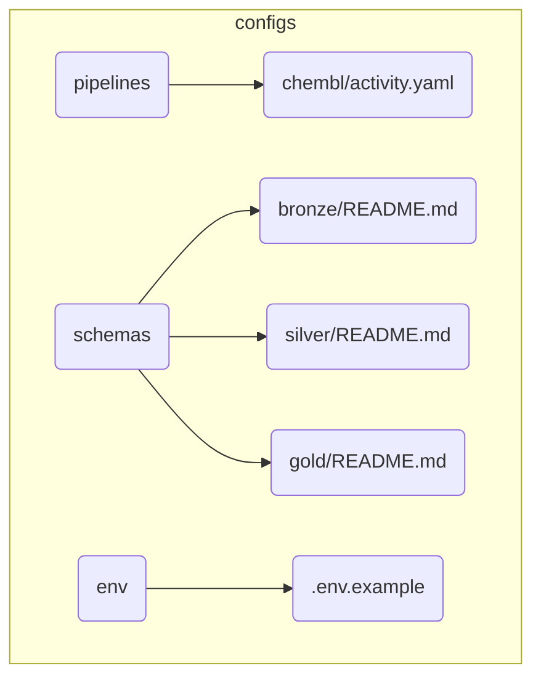

# BioETL Project Navigator

*Synced with RULES.md v5.0 (2025-12-15)*

## Quick Links

| Need to...              | Go to                                                                  |
|-------------------------|------------------------------------------------------------------------|
| Understand the rules    | [00-project_rules/01-project-rules.md](00-project_rules/01-project-rules.md)                 |
| Create a new pipeline   | [00-project_rules/04-extending-bioetl.md](00-project_rules/04-extending-bioetl.md)      |
| Review a pipeline       | [templates/pipeline-review-checklist.md](templates/pipeline-review-checklist.md) |
| Handle a prod error     | [05-operations/runbooks/index.md](05-operations/runbooks/index.md)                           |
| Understand architecture | [02-architecture/system-context.md](02-architecture/system-context.md)                  |
| Check data contracts    | [contracts/gold/activity.json](contracts/gold/activity.json)                                  |

---

## Documentation Structure

```
docs/
├── 00-map.md                    # This file (Project Navigator)
│
├── 00-project_rules/            # Project governance
│   ├── 00-rules-summary.md      # TL;DR of RULES.md
│   ├── 01-project-rules.md      # Full project rules
│   ├── 02-user-rules.md         # Guidelines for contributors
│   ├── 03-file-policy.md        # File/directory structure
│   ├── 04-extending-bioetl.md   # How to add providers/pipelines
│   └── 05-cleanup-policy.md     # Cleanup and retention
│
├── 02-architecture/             # System architecture
│   ├── system-context.md        # C4 System Context Diagram
│   ├── data-flow.md             # High-level Medallion data flow
│   ├── decisions/               # Architecture Decision Records
│   └── diagrams/                # Diagram source files
│       └── 00-diagramming-policy.md
│
├── 03-guides/                      # How-to guides
│
├── 04-reference/                  # Reference documentation
│
├── 05-operations/                 # Operational runbooks
│
└── templates/                   # Document templates
    └── pipeline-review-checklist.md
```

---

## By Topic

### Getting Started

1. [01-project-rules.md](00-project_rules/01-project-rules.md) - Project rules (start here)
2. [00-rules-summary.md](00-project_rules/00-rules-summary.md) - Quick reference
3. [02-user-rules.md](00-project_rules/02-user-rules.md) - Contributor guidelines

### Architecture

| Document                                                                                     | Covers                                   | RULES.md |
|----------------------------------------------------------------------------------------------|------------------------------------------|----------|
| [system-context.md](02-architecture/system-context.md)                                       | Entity models, IDs, relationships        | §2.8     |
| [data-flow.md](02-architecture/data-flow.md)                                                 | Ports & Adapters, layer responsibilities | §1.1     |
| [ADR-001: Delta Lake](02-architecture/decisions/ADR-001-delta-lake-vs-parquet.md)            | Pipeline stages, Medallion flow          | §2.1, §3 |
| [ADR-002: Medallion](02-architecture/decisions/ADR-002-medallion-architecture.md)            | Code reuse, patterns                     | §1       |
| [ADR-003: Redis Locking](02-architecture/decisions/ADR-003-redis-for-distributed-locking.md) | Directory structure, imports             | §6       |
| [ADR-004: Pydantic](02-architecture/decisions/ADR-004-pydantic-vs-dataclasses.md)            | Visual diagrams                          | -        |

### Data Management

| Topic            | Document                                                                                            | RULES.md |
|------------------|-----------------------------------------------------------------------------------------------------|----------|
| Medallion Layers | [data-flow.md](02-architecture/data-flow.md)                                                        | §2.1     |
| Schema Drift     | [01-project-rules.md](00-project_rules/01-project-rules.md)   | §2.2     |
| Data Lineage     | [system-context.md](02-architecture/system-context.md)                                              | §2.3     |
| Backfill/Replay  | [01-project-rules.md](00-project_rules/01-project-rules.md)            | §2.4     |
| Quarantine       | [01-project-rules.md](00-project_rules/01-project-rules.md) | §2.6     |
| Content Hash     | [system-context.md](02-architecture/system-context.md)                                              | §2.8     |

### Operations

| Topic             | Document                                                                                          | RULES.md |
|-------------------|---------------------------------------------------------------------------------------------------|----------|
| Error Handling    | [data-flow.md](02-architecture/data-flow.md)                                    | §3.1     |
| Circuit Breaker   | [data-flow.md](02-architecture/data-flow.md)                                  | §3.1.4   |
| Locking           | [data-flow.md](02-architecture/data-flow.md)                                | §3.3     |
| DQ Metrics        | [01-project-rules.md](00-project_rules/01-project-rules.md) | §3.4     |
| Graceful Shutdown | [data-flow.md](02-architecture/data-flow.md)                                 | §5.3     |
| DR Procedures     | [05-operations/runbooks/index.md](05-operations/runbooks/index.md)                                                      | §5.5     |
| Cleanup           | [05-cleanup-policy.md](00-project_rules/05-cleanup-policy.md)                                     | §2.1.1   |

### Development

| Topic            | Document                                                                                        | RULES.md |
|------------------|-------------------------------------------------------------------------------------------------|----------|
| Adding Providers | [04-extending-bioetl.md](00-project_rules/04-extending-bioetl.md)                               | App D    |
| Pipeline Review  | [templates/pipeline-review-checklist.md](templates/pipeline-review-checklist.md)                          | §4.2     |
| Testing          | [01-project-rules.md](00-project_rules/01-project-rules.md) | §4.2     |
| Code Style       | [01-project-rules.md](00-project_rules/01-project-rules.md)            | §4       |
| Refactoring      | [01-project-rules.md](00-project_rules/01-project-rules.md)              | -        |

---

## Source Code Map

```
src/bioetl/
├── domain/                  # Pure logic, no I/O
│   ├── ports.py             # Protocol interfaces (§1.1.1)
│   ├── models/              # Pydantic models
│   ├── schemas/             # Pandera schemas
│   └── services/            # Hash, Validation, Normalization
│
├── services/             # Orchestration
│   ├── pipelines/           # {provider}/{entity}/
│   ├── services/            # Extraction, Bootstrap
│   └── observers/           # Metrics, Circuit Breaker, Health
│
├── infrastructure/          # I/O adapters
│   ├── adapters/            # API clients
│   ├── storage/             # Delta Lake, Bronze, S3
│   ├── locking/             # Redis locks
│   ├── security/            # Salt manager
│   ├── quarantine/          # DQ failure handling
│   ├── config/              # YAML → Pydantic
│   └── logging/             # UnifiedLogger
│
└── interfaces/              # External interfaces
    └── cli/                 # Typer CLI
```

---

## Config Files Map



---

## Key Files

| File                                               | Purpose                   |
|----------------------------------------------------|---------------------------|
| `docs/00-project_rules/01-project-rules.md`        | Master rules document     |
| `CHANGELOG.md`                                     | Version history           |
| `configs/pipelines/{provider}/{entity}.yaml`       | Pipeline configuration    |
| `src/bioetl/domain/ports.py`                       | Protocol interfaces       |
| `src/bioetl/domain/schemas/{provider}/{entity}.py` | Pandera schemas           |
| `docs/02-architecture/system-context.md`           | High-level system diagram |
| `docs/contracts/gold/{entity}.json`                | Gold data contracts       |

---

## Related Resources

- **Repository**: [SatoryKono/BioactivityDataAcquisition](https://github.com/SatoryKono/BioactivityDataAcquisition)
- **Issues**: Report bugs and feature requests
- **CI/CD**: GitHub Actions workflows

---

## Document Status

| Document              | Last Updated | Status |
|-----------------------|--------------|--------|
| 01-project-rules.md   | 2025-12-15   | v5.0   |
| 00-rules-summary.md   | 2025-12-15   | Synced |
| All architecture docs | 2025-12-15   | Synced |

---

*This navigator is auto-generated. Update when adding new documentation.*
