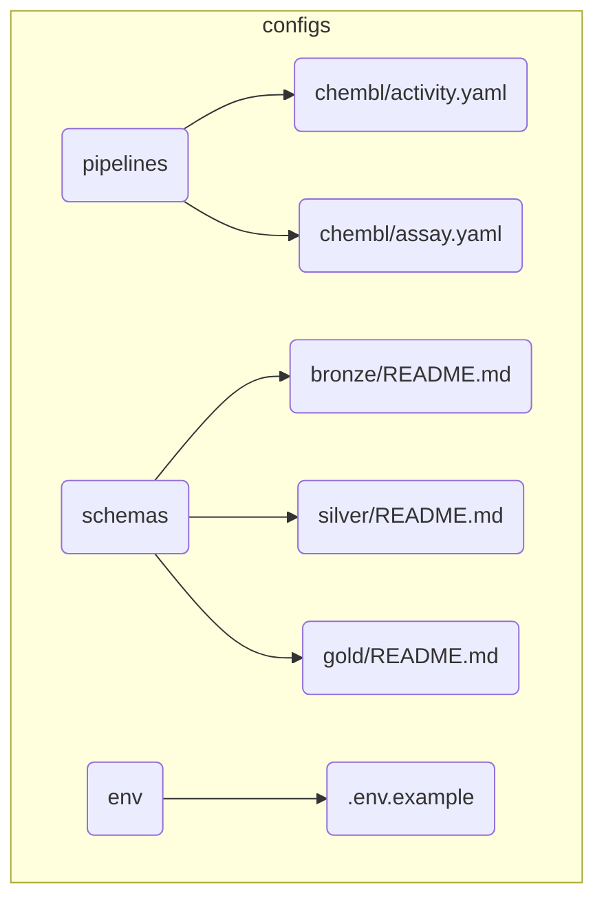

# BioETL Project Navigator

*Synced with RULES.md v5.1 | Last updated: 2025-12-22*

## Quick Links

| Need to...              | Go to                                                                  |
|-------------------------|------------------------------------------------------------------------|
| Understand the rules    | [00-project_rules/01-project-rules.md](00-project_rules/01-project-rules.md)                 |
| Create a new pipeline   | [00-project_rules/04-extending-bioetl.md](00-project_rules/04-extending-bioetl.md)      |
| Review a pipeline       | [templates/pipeline-review-checklist.md](templates/pipeline-review-checklist.md) |
| Handle a prod error     | [05-operations/runbooks/index.md](05-operations/runbooks/index.md)                           |
| Understand architecture | [02-architecture/system-context.md](02-architecture/system-context.md)                  |
| Check data contracts    | [contracts/gold/activity.json](contracts/gold/activity.json)                                  |

---

## Language Policy

| Category | Language | Examples |
|----------|----------|----------|
| **Public-facing** | English | README.md, CONTRIBUTING.md, CHANGELOG.md |
| **User guides** | English | docs/03-guides/*, docs/04-reference/* |
| **Internal governance** | Russian | RULES.md, AGENT.md, docs/00-project_rules/* |
| **Architecture docs** | Russian | docs/02-architecture/* |
| **Code comments** | Russian | Docstrings, inline comments |

---

## Documentation Structure

```
docs/
├── 00-map.md                    # This file (Project Navigator)
│
├── 00-project_rules/            # Project governance
│   ├── 00-rules-summary.md      # TL;DR of RULES.md
│   ├── 01-project-rules.md      # Full project rules
│   ├── 02-user-rules.md         # Guidelines for contributors
│   ├── 03-file-policy.md        # File/directory structure
│   ├── 04-extending-bioetl.md   # How to add providers/pipelines
│   └── 05-cleanup-policy.md     # Cleanup and retention
│
├── 02-architecture/             # System architecture
│   ├── system-context.md        # C4 System Context Diagram
│   ├── container-diagram.md     # C4 Container Diagram
│   ├── data-flow.md             # High-level Medallion data flow
│   ├── 04-interfaces-layer.md   # Interfaces layer docs
│   ├── 05-composition-layer.md  # Composition layer (DI) docs
│   ├── decisions/               # Architecture Decision Records (ADR-001..006)
│   └── diagrams/                # Diagram source files
│
├── 03-guides/                   # How-to guides
│   ├── quick-start.md           # Quick start guide
│   ├── getting-started.md       # Getting started
│   ├── running-pipelines.md     # Running pipelines
│   ├── troubleshooting.md       # Troubleshooting
│   ├── add-new-source.md        # Adding new data source
│   └── add-pipeline-existing-source.md  # Adding pipeline to existing source
│
├── 04-reference/                # Reference documentation
│
├── 05-operations/               # Operational runbooks
│
├── contracts/                   # Data contracts
│   └── gold/                    # Gold layer contracts
│
└── templates/                   # Document & code templates
    ├── pipeline-review-checklist.md
    ├── config.yaml.tpl
    ├── factory.py.tpl
    ├── pipeline.py.tpl
    └── source_adapter.py.tpl
```

---

## By Topic

### Getting Started

1. [01-project-rules.md](00-project_rules/01-project-rules.md) - Project rules (start here)
2. [00-rules-summary.md](00-project_rules/00-rules-summary.md) - Quick reference
3. [02-user-rules.md](00-project_rules/02-user-rules.md) - Contributor guidelines

### Architecture

| Document                                                                                     | Covers                                   | RULES.md |
|----------------------------------------------------------------------------------------------|------------------------------------------|----------|
| [system-context.md](02-architecture/system-context.md)                                       | Entity models, IDs, relationships        | §2.8     |
| [container-diagram.md](02-architecture/container-diagram.md)                               | C4 Container, Docker services            | §5.6     |
| [data-flow.md](02-architecture/data-flow.md)                                                 | Ports & Adapters, layer responsibilities | §1.1     |
| [05-composition-layer.md](02-architecture/05-composition-layer.md)                           | Composition Root, DI, Factories          | §1.1     |
| [ADR-001: Delta Lake](02-architecture/decisions/ADR-001-delta-lake-vs-parquet.md)            | Storage engine choice                    | §2.1, §3 |
| [ADR-002: Medallion](02-architecture/decisions/ADR-002-medallion-architecture.md)            | Data layering pattern                    | §1       |
| [ADR-003: Redis Locking](02-architecture/decisions/ADR-003-redis-for-distributed-locking.md) | Distributed locking                      | §6       |
| [ADR-004: Pydantic](02-architecture/decisions/ADR-004-pydantic-vs-dataclasses.md)            | Validation approach                      | -        |
| [ADR-005: Composition Layer](02-architecture/decisions/ADR-005-composition-layer-separation.md) | DI and layer separation               | §1.1     |
| [ADR-006: Logger/Metrics Ports](02-architecture/decisions/ADR-006-logger-metrics-ports.md)   | Port abstractions                        | §1.1     |

### Data Management

| Topic            | Document                                                                                            | RULES.md |
|------------------|-----------------------------------------------------------------------------------------------------|----------|
| Medallion Layers | [data-flow.md](02-architecture/data-flow.md)                                                        | §2.1     |
| Schema Drift     | [01-project-rules.md](00-project_rules/01-project-rules.md)   | §2.2     |
| Data Lineage     | [system-context.md](02-architecture/system-context.md)                                              | §2.3     |
| Backfill/Replay  | [01-project-rules.md](00-project_rules/01-project-rules.md)            | §2.4     |
| Quarantine       | [01-project-rules.md](00-project_rules/01-project-rules.md) | §2.6     |
| Content Hash     | [system-context.md](02-architecture/system-context.md)                                              | §2.8     |

### Operations

| Topic             | Document                                                                                          | RULES.md |
|-------------------|---------------------------------------------------------------------------------------------------|----------|
| Error Handling    | [data-flow.md](02-architecture/data-flow.md)                                    | §3.1     |
| Circuit Breaker   | [data-flow.md](02-architecture/data-flow.md)                                  | §3.1.4   |
| Locking           | [data-flow.md](02-architecture/data-flow.md)                                | §3.3     |
| DQ Metrics        | [01-project-rules.md](00-project_rules/01-project-rules.md) | §3.4     |
| Graceful Shutdown | [data-flow.md](02-architecture/data-flow.md)                                 | §5.3     |
| DR Procedures     | [05-operations/runbooks/index.md](05-operations/runbooks/index.md)                                                      | §5.5     |
| Cleanup           | [05-cleanup-policy.md](00-project_rules/05-cleanup-policy.md)                                     | §2.1.1   |

### Development

| Topic            | Document                                                                                        | RULES.md |
|------------------|-------------------------------------------------------------------------------------------------|----------|
| Adding Providers | [add-new-source.md](03-guides/add-new-source.md)                                                | App D    |
| Adding Pipelines | [add-pipeline-existing-source.md](03-guides/add-pipeline-existing-source.md)                    | App D    |
| Pipeline Review  | [templates/pipeline-review-checklist.md](templates/pipeline-review-checklist.md)                | §4.2     |
| Testing          | [01-project-rules.md](00-project_rules/01-project-rules.md)                                     | §4.2     |
| Code Style       | [01-project-rules.md](00-project_rules/01-project-rules.md)                                     | §4       |

---

## Source Code Map

```
src/bioetl/
├── domain/                      # Pure logic, no I/O (§1.1)
│   ├── ports.py                 # Protocol interfaces (DataSourcePort, etc.)
│   ├── config.py                # Domain config models
│   ├── exceptions.py            # Domain exceptions hierarchy
│   ├── transformations.py       # Pure transformation functions
│   └── types.py                 # Value objects (RunType, ErrorCode)
│
├── application/                 # Pipeline orchestration (§1.1)
│   ├── core/                    # Core pipeline infrastructure
│   │   ├── executor.py          # Batch executor
│   │   ├── pipeline_services.py # Service container
│   │   ├── shutdown.py          # Graceful shutdown handling
│   │   └── base_pipeline.py     # Abstract base pipeline
│   ├── orchestration/           # Execution coordination
│   │   └── runner.py            # PipelineRunner (Driving Adapter logic)
│   ├── pipelines/               # Concrete pipeline implementations
│   │   └── chembl_activity.py   # ChEMBL Activity pipeline
│   └── observability/           # Application-level observability
│
├── composition/                 # Composition Root (DI container)
│   ├── bootstrap.py             # Pipeline bootstrap & wiring
│   ├── registry.py              # Pipeline discovery
│   └── factories/               # Consolidated factories
│       ├── generic_factory.py   # Universal pipeline factory
│       ├── data_source_registry.py # Central source creation
│       └── storage_factory.py   # Multi-layer storage factory
│
├── infrastructure/              # I/O adapters (§1.1)
│   ├── adapters/                # External API clients
│   │   ├── http/                # HTTP client infrastructure
│   │   ├── chembl/              # ChEMBL API adapter
│   │   ├── pubchem/             # PubChem API adapter
│   │   └── uniprot/             # UniProt API adapter
│   ├── storage/                 # Data persistence
│   │   ├── bronze_writer.py     # JSONL + zstd writer
│   │   ├── delta_writer.py      # Delta Lake merge/upsert
│   │   └── gold_writer.py       # SCD Type 2 writer
│   ├── locking/                 # Distributed locking
│   │   ├── redis_lock.py        # Redis SETNX + heartbeat
│   │   └── memory_lock.py       # In-memory (dev/test)
│   ├── checkpoint/              # Checkpoint persistence
│   ├── quarantine/              # DQ failure handling
│   ├── observability/           # Metrics, logging
│   ├── schemas/                 # Pydantic config schemas
│   ├── factories/               # Infrastructure factories
│   └── config.py                # Settings (Pydantic)
│
└── interfaces/                  # External interfaces
    ├── cli.py                   # Click CLI (bioetl run/quarantine/checkpoint)
    └── orchestration/           # Pipeline orchestration adapters
        ├── signals.py           # OS signal handlers
        └── prefect/             # Prefect integration
```

---

## Config Files Map



---

## Key Files

| File                                               | Purpose                   |
|----------------------------------------------------|---------------------------|
| `docs/RULES.md`                                    | Master rules document     |
| `CHANGELOG.md`                                     | Version history           |
| `configs/pipelines/{provider}/{entity}.yaml`       | Pipeline configuration    |
| `src/bioetl/domain/ports.py`                       | Protocol interfaces       |
| `src/bioetl/composition/bootstrap.py`              | Composition root          |
| `src/bioetl/infrastructure/config.py`              | Application settings      |
| `docs/02-architecture/system-context.md`           | High-level system diagram |
| `docs/contracts/gold/{entity}.json`                | Gold data contracts       |

---

## Related Resources

- **Repository**: [SatoryKono/BioactivityDataAcquisition](https://github.com/SatoryKono/BioactivityDataAcquisition)
- **Issues**: Report bugs and feature requests
- **CI/CD**: GitHub Actions workflows

---

## Document Status

| Document                 | Last Updated | Status                      |
|--------------------------|--------------|----------------------------|
| RULES.md (docs/)         | 2025-12-15   | v5.0 (Production Ready)     |
| 01-project-rules.md      | 2025-12-18   | Redirect to RULES.md        |
| 00-rules-summary.md      | 2025-12-15   | v5.0 Synced                 |
| 00-map.md                | 2025-12-20   | Updated (cleanup, new ADRs) |
| CHANGELOG.md             | 2025-12-16   | Updated (v5.0.0)            |
| 03-guides/               | 2025-12-20   | Consolidated (6 guides)     |
| ADR-001..006             | 2025-12-20   | All 6 ADRs documented       |
| pyproject.toml           | 2025-12-16   | Version 5.0.0               |

---

*Last updated: 2025-12-22. Update when adding new documentation.*
