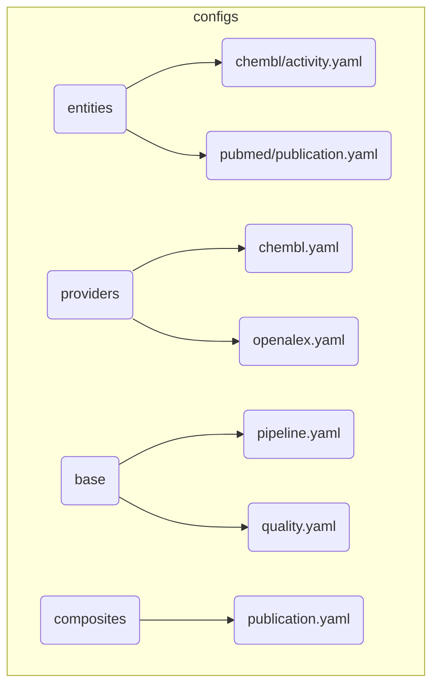

______________________________________________________________________

Version: 1.1.2
Status: active
Class: published
Owner: BioETL Team
Reviewers:

- BioETL Team
  Last verified: '2026-04-29'

______________________________________________________________________

# BioETL Project Navigator

*Synced with RULES.md v6.1.4 | Last updated: 2026-07-24*

> **Documentation Update:** 2026-06-03
>
> - 2026-06-03: Added ADR-046, ADR-047, ADR-048, ADR-049 to ADR registry
> - 2026-04-29: navigator trimmed to navigation-only duties; manual document-status matrix removed to avoid freshness drift
> - **Issue #3091 Resolution**: Fixed ADR status contradiction (ADR-001..043 → ADR-001..045)
> - **Source-code map updated**: Navigator now points to the live high-level package topology from `src/bioetl/README.md` instead of a stale file-by-file tree snapshot
> - **Workflow inventory added**: `.github/workflows/*.yml` now has a canonical published catalog under `docs/04-reference/github-actions-workflows.md`
> - Compatibility inventory synced with the current measured CLI shim registry
> - Source-code map updated for the storage subpackage decomposition (`bronze/`, `silver/`, `gold/`, `metadata/`, `delta/`, `support/`)
> - Snapshot-style file/test counts removed from active navigation blocks to reduce drift
> - Active entry points clarified: `RULES.md`, `TOOLS.md`, and canonical layer docs in `docs/02-architecture/`
> - 2026-03-20: stale config-loader entry updated to current composition/runtime and infrastructure config seams
> - 2026-03-24: composition/domain references synced with RF-021 config ownership and RF-022 runtime port contracts
> - 2026-03-27: navigator synced with ADR-044/ADR-045, GitHub local workflow guide, and active traceability runbooks
> - 2026-04-01: control-plane documentation pack re-synced with RunManifest / RunLedger runtime, storage layout, rollout flags, inspection CLI, and event baseline
> - 2026-04-02: navigator re-synced with `04-reference/index.md` and `05-operations/archive-index.md`
> - 2026-04-04: published docs verification guide added to active entrypoints and mixed-environment workflow references

## Quick Links

| Need to...                         | Go to                                                                                  |
| ---------------------------------- | -------------------------------------------------------------------------------------- |
| Understand the rules               | [NORMATIVE_SOURCES.md](NORMATIVE_SOURCES.md), [RULES.md](RULES.md)                   |
| Look up terminology                | [glossary.md](glossary.md)                                                             |
| Find tool commands                 | [TOOLS.md](TOOLS.md)                                                                   |
| Verify docs quality gates          | [docs-verification.md](../03-guides/docs-verification.md)                              |
| Check entity config parity         | [docs-parity-gate.md](../03-guides/docs-parity-gate.md)                                |
| Review structure / retention rules | [03-file-policy.md](governance/03-file-policy.md)                                      |
| Govern documentation               | [D-01](governance/01-documentation-governance-style-guide.md)                          |
| Create a new pipeline              | [governance/04-extending-bioetl.md](governance/04-extending-bioetl.md)                 |
| Review a pipeline                  | [pipeline-review-checklist.md](../04-reference/templates/pipeline-review-checklist.md) |
| Browse published reference docs    | [index.md](../04-reference/index.md)                                                   |
| Find doc templates                 | [templates/index.md](../04-reference/templates/index.md)                               |
| Inspect run traceability           | [run-manifest-ledger.md](../04-reference/contracts/run-manifest-ledger.md)             |
| Use inspection CLI                 | [cli.md](../04-reference/cli.md)                                                       |
| Check normalization governance     | [chembl-normalization-overview.md](../04-reference/normalization/chembl-normalization-overview.md) |
| Review non-ChEMBL normalization    | [non-chembl-normalization-overview.md](../04-reference/normalization/non-chembl-normalization-overview.md) |
| Review publication normalization   | [publication-normalization.md](../04-reference/normalization/publication-normalization.md) |
| Review PubChem and UniProt policy  | [pubchem-normalization.md](../04-reference/normalization/pubchem-normalization.md), [uniprot-normalization.md](../04-reference/normalization/uniprot-normalization.md) |
| Review ontology companion policy   | [ontology-governance.md](../04-reference/schemas/domain/chembl/ontology-governance.md)             |
| Review identifier family policy    | [reference-identifiers.md](../04-reference/normalization/reference-identifiers.md)     |
| Run control-plane triage           | [run-manifest-inspection.md](../05-operations/runbooks/run-manifest-inspection.md)     |
| Understand control-plane decision  | [ADR-044](../02-architecture/decisions/ADR-044-run-manifest-ledger-control-plane.md)   |
| Understand workflow control-plane decision | [ADR-047](../02-architecture/decisions/ADR-047-workflow-control-plane.md) |
| Workflow orchestration & recovery runbook | [workflow-control-plane.md](../05-operations/runbooks/workflow-control-plane.md) |
| Execution control commands (`run/status/resume/repair/force`) | [workflows.md](../03-guides/workflows.md) |
| Quality gates for docs/runtime drift | [docs-verification.md](../03-guides/docs-verification.md) |
| Understand rollout / DQ decision   | [ADR-045](../02-architecture/decisions/ADR-045-dq-contract-system.md)                  |
| Handle a prod error                | [runbooks/index.md](../05-operations/runbooks/index.md)                                |
| Browse historical ops material     | [archive-index.md](../05-operations/archive-index.md)                                  |
| Understand architecture            | [00-overview.md](../02-architecture/00-overview.md)                                    |
| Check data contracts               | [chembl_activity-v1.0.json](../04-reference/contracts/gold/chembl_activity_v1.0.json)  |
| Check DQ contracts                 | [dq-contracts.md](../04-reference/contracts/dq-contracts.md)                           |
| Browse ADR registry                | [adr-registry.md](../02-architecture/adr-registry.md)                                  |
| Need historical context            | Repository path `docs/99-archive/README.md` *(non-canonical)*                          |
| Browse shipped dashboards           | [dashboards/README.md](../03-guides/dashboards/README.md) (coverage matrix)            |
| Operator dashboard triage          | [monitoring-index.md](../03-guides/dashboards/monitoring-index.md) (incident-time navigation) |
| Find canonical domain catalog      | [domain/README.md](../04-reference/domain/README.md)                                   |
| Inspect runtime context surfaces   | [contexts.md](../04-reference/domain/contexts.md)                                      |
| Check workflow lifecycle semantics | [workflow-state-machine.md](../04-reference/domain/workflow-state-machine.md)          |
| Browse GitHub Actions workflows    | [github-actions-workflows.md](../04-reference/github-actions-workflows.md)             |

## Surface Routing

- Published guidance: `docs/00-05/**`
- Repo-only drafts and working notes: repository paths such as `docs/D-*.md`,
  `docs/plans/**`, `docs/reports/**`, `reports/**`
- Historical material: repository path `docs/99-archive/**`
- Code-navigation-only package maps: `src/**/README.md`

When multiple surfaces discuss the same area, prefer the published entrypoint
first and use repo-only or code-navigation-only material as supporting context.

______________________________________________________________________

## Language Policy

| Category                | Language | Examples                                          |
| ----------------------- | -------- | ------------------------------------------------- |
| **Public-facing**       | English  | README.md, CONTRIBUTING.md, CHANGELOG.md          |
| **User guides**         | English  | docs/03-guides/*, docs/04-reference/*             |
| **Internal governance** | Russian  | RULES.md, AGENT.md, docs/00-project/governance/\* |
| **Architecture docs**   | Russian  | docs/02-architecture/\*                           |
| **Code comments**       | Russian  | Docstrings, inline comments                       |

______________________________________________________________________

## Documentation Structure

```
docs/
├── 00-project/                  # Project rules & governance
│   ├── 00-map.md                # This file (Project Navigator)
│   ├── index.md                 # Welcome page
│   ├── RULES.md                 # Canonical rules document (see file header Version)
│   ├── NORMATIVE_SOURCES.md     # Normative stack index for AI/contributors
│   ├── glossary.md              # Ubiquitous Language terminology
│   ├── TOOLS.md                 # Active tools hub & unified entry points
│   ├── rules-summary.md         # TL;DR of RULES.md
│   └── governance/              # Project governance policies
│       ├── 01-documentation-governance-style-guide.md  # D-01 documentation metapolicy
│       ├── 02-naming-policy.md  # Entity naming conventions
│       ├── 03-file-policy.md
│       ├── 04-extending-bioetl.md
│       ├── 05-github-policy.md  # CI/CD, branch protection, reviews
│       └── 06-doc-publication-policy.md  # Documentation publication policy
│
├── 01-requirements/             # Requirements
│   └── REQUIREMENTS.md          # Testable requirements catalog
│
├── 02-architecture/             # Architecture & Decisions
│   ├── 00-overview.md           # Architecture overview
│   ├── decisions/               # ADR decision files (see generated adr-registry.md)
│   ├── diagrams/            # Canonical Mermaid source files and rendered views
│   └── ... (Layer docs: 01-domain, 02-application, etc.)
│
├── 03-guides/                   # Guides & Manuals
│   ├── development/             # Developer guides (config schema, etc.)
│   └── ... (User guides: getting-started, testing, etc.)
│
├── 04-reference/                # Reference Documentation
│   ├── index.md                 # Reference landing page
│   ├── api/                     # API Reference
│   ├── cli.md                   # CLI Reference
│   ├── providers/               # Provider documentation (ChEMBL, PubMed, etc.)
│   ├── pipelines/               # Pipeline specifications
│   ├── contracts/               # Data and control-plane contracts
│   ├── schemas/                 # Auxiliary schemas & field maps
│   └── templates/               # Code & doc templates + published template index
│
├── 05-operations/               # Operations & Runbooks
│   ├── archive-index.md         # Historical / archive-only operations surface
│   ├── runbooks/                # Incident response playbooks
│   ├── verification/            # Data verification reports
│   └── ... (Ops guides: vacuum, performance)
│
└── 99-archive/                  # Historical / superseded (repo-only, non-canonical)
    ├── reports/                 # Old project reports
    └── ...
```

______________________________________________________________________


## Control Plane Navigation (ADR-047)

- **Orchestration model**: [Workflow Object](../03-guides/workflows.md)
- **Execution control surface**: `bioetl workflow run`, `--resume-last`, `--repair-steps`, `--force-steps`, and `bioetl workflow status` in [CLI Reference](../04-reference/cli.md) and [Workflow Control-Plane Recovery](../05-operations/runbooks/workflow-control-plane.md)
- **Quality gates**: [Docs Verification](../03-guides/docs-verification.md), plus runtime mirror freshness checks from `scripts.docs check-drift --runtime-mirrors --freshness`
- **Policy chain**: [ADR-047](../02-architecture/decisions/ADR-047-workflow-control-plane.md) ↔ [POST_CHANGE_VALIDATION](ai/agents/policy/POST_CHANGE_VALIDATION.md) ↔ [workflow-control-plane runbook](../05-operations/runbooks/workflow-control-plane.md)
- **Deprecated**: references that frame workflow resume as ledger-only or workflow-name-only without execution fingerprint. Canonical source is ADR-047.

## By Topic

### Getting Started

1. [RULES.md](RULES.md) - Project rules (start here)
1. [rules-summary.md](rules-summary.md) - Quick reference
1. [TOOLS.md](TOOLS.md) - Active tools hub and script entry points
1. [04-extending-bioetl.md](governance/04-extending-bioetl.md) - Adding providers/pipelines

### Architecture

| Document                                                                                                                        | Covers                                                 | RULES.md   |
| ------------------------------------------------------------------------------------------------------------------------------- | ------------------------------------------------------ | ---------- |
| [system-context.md](../02-architecture/system-context.md)                                                                       | Entity models, IDs, relationships                      | §2.8       |
| [container-diagram.md](../02-architecture/diagrams/guide/container-reference.md)                                                | C4 Container, Local-Only runtime                       | §5.6       |
| [data-flow.md](../02-architecture/diagrams/guide/data-flow-reference.md)                                                        | Ports & Adapters, layer responsibilities               | §1.1       |
| [05-composition-layer.md](../02-architecture/05-composition-layer.md)                                                           | Composition Root, DI, Factories                        | §1.1       |
| [ADR-001: Delta Lake](../02-architecture/decisions/ADR-001-delta-lake-vs-parquet.md)                                            | Storage engine choice                                  | §2.1, §3   |
| [ADR-002: Medallion](../02-architecture/decisions/ADR-002-medallion-architecture.md)                                            | Data layering pattern                                  | §1         |
| [ADR-010: Local-Only Deployment](../02-architecture/decisions/ADR-010-local-only-deployment.md)                                | Current single-process locking posture; ADR-003 historical | §6      |
| [ADR-004: Pydantic](../02-architecture/decisions/ADR-004-pydantic-vs-dataclasses.md)                                            | Validation approach                                    | -          |
| [ADR-005: Composition Layer](../02-architecture/decisions/ADR-005-composition-layer-separation.md)                              | DI and layer separation                                | §1.1       |
| [ADR-006: Logger/Metrics Ports](../02-architecture/decisions/ADR-006-logger-metrics-ports.md)                                   | Port abstractions                                      | §1.1       |
| [ADR-007: Circuit Breaker](../02-architecture/decisions/ADR-007-circuit-breaker-implementation.md)                              | Failure handling pattern                               | §3.1.4     |
| [ADR-015: Pipeline Services Lifecycle](../02-architecture/decisions/ADR-015-pipeline-services-lifecycle.md)                    | Current SIGTERM/SIGINT handling and shutdown coordination | §5.3    |
| [ADR-009: Paginated Fetcher](../02-architecture/decisions/ADR-009-paginated-fetcher-mixin.md)                                   | Pagination abstraction                                 | App D      |
| [ADR-010: Local-Only Deploy](../02-architecture/decisions/ADR-010-local-only-deployment.md)                                     | File-based deployment (no Docker)                      | §5.6       |
| [ADR-011: Watermark Removal](../02-architecture/decisions/ADR-011-remove-watermark-mechanism.md)                                | Simplified checkpoint model                            | §2.4       |
| [ADR-012: Storage Clear Contract](../02-architecture/decisions/ADR-012-storage-clear-contract-and-run-id.md)                    | Storage clear API, run-id injection                    | §2.1       |
| [ADR-013: Async Storage Cleanup](../02-architecture/decisions/ADR-013-async-storage-cleanup.md)                                 | MedallionLifecycleService pattern                      | §2.1       |
| [ADR-014: Deterministic Writes](../02-architecture/decisions/ADR-014-deterministic-writes.md)                                   | SCD2 ingestion-ts, reproducible writes                 | §2.1       |
| [ADR-015: Pipeline Services Lifecycle](../02-architecture/decisions/ADR-015-pipeline-services-lifecycle.md)                     | Port lifecycle contracts                               | §1.1       |
| [ADR-016: Error Handling Strategy](../02-architecture/decisions/ADR-016-error-handling-strategy.md)                             | Unified error classification                           | §3.1       |
| [ADR-017: Observability Architecture](../02-architecture/decisions/ADR-017-observability-architecture.md)                       | Metrics, tracing, logging ports                        | §5.1       |
| [ADR-018: Gold Strict Validation](../02-architecture/decisions/ADR-018-gold-strict-validation.md)                               | Pandera Gold validation                                | §2.7       |
| [ADR-019: Observability Port Enforcement](../02-architecture/decisions/ADR-019-observability-port-enforcement.md)               | REQ-OBS-001 compliance                                 | §5.1       |
| [ADR-020: BasePipeline Decomposition](../02-architecture/decisions/ADR-020-basepipeline-decomposition.md)                       | God Object refactoring                                 | §1.1       |
| [ADR-021: DDD Aggregates](../02-architecture/decisions/ADR-021-ddd-aggregates-adoption.md)                                      | DDD aggregates adoption                                | -          |
| [ADR-022: Tracing NoOp](../02-architecture/decisions/ADR-022-tracing-noop.md)                                                   | NoOp for tracing                                       | -          |
| [ADR-023: Entity Type Patterns](../02-architecture/decisions/ADR-023-entity-type-patterns.md)                                   | Entity type patterns                                   | -          |
| [ADR-024: Entity Naming Unification](../02-architecture/decisions/ADR-024-entity-naming-unification.md)                         | Entity naming unification                              | -          |
| [ADR-025: Pipeline Config Unification](../02-architecture/decisions/ADR-025-pipeline-config-unification.md)                     | Pipeline config unification                            | -          |
| [ADR-026: Composite Pipeline Pattern](../02-architecture/decisions/ADR-026-composite-pipeline-pattern.md)                       | Composite pipeline pattern                             | -          |
| [ADR-027: DQ Rules Externalization](../02-architecture/decisions/ADR-027-dq-rules-externalization.md)                           | Hierarchical DQ configuration                          | §3.1.2     |
| [ADR-028: Filter Rules Externalization](../02-architecture/decisions/ADR-028-filter-rules-externalization.md)                   | Hierarchical filter configuration                      | App D      |
| [ADR-029: Output Metadata Unification](../02-architecture/decisions/ADR-029-output-metadata-unification.md)                     | Unified output metadata contracts                      | §2.4       |
| [ADR-030: Publication Pagination Strategy](../02-architecture/decisions/ADR-030-publication-pagination-strategy.md)             | Publication pagination strategy                        | -          |
| [ADR-031: Loading Strategy Formalization](../02-architecture/decisions/ADR-031-loading-strategy-formalization.md)               | Loading strategy formalization                         | -          |
| [ADR-032: Unified HTTP Client](../02-architecture/decisions/ADR-032-unified-http-client.md)                                     | Unified HTTP client pattern                            | App A      |
| [ADR-033: Publication Validation Strategy](../02-architecture/decisions/ADR-033-publication-validation-strategy.md)             | Five-level publication validation                      | §3.4       |
| [ADR-034: Schema↔Domain Pairs](../02-architecture/decisions/ADR-034-schema-domain-pairs.md)                                     | Schema↔Domain configuration pairs                      | §2.8       |
| [ADR-035: JSON Field Typing Policy](../02-architecture/decisions/ADR-035-json-field-typing-policy.md)                           | JSON field typing (Silver↔Gold)                        | §2.8       |
| [ADR-036: Gold Contract Versioning](../02-architecture/decisions/ADR-036-gold-contract-versioning-policy.md)                    | Gold contract versioning policy                        | §2.7       |
| [ADR-037: Canonical Schema Generation](../02-architecture/decisions/ADR-037-canonical-schema-generation.md)                     | Canonical schema source and generation                 | §2.8       |
| [ADR-038: Enum Externalization](../02-architecture/decisions/ADR-038-enum-externalization.md)                                   | ChEMBL enum values externalization                     | App D      |
| [ADR-039: Unified Entity Config](../02-architecture/decisions/ADR-039-unified-entity-config-format.md)                          | Unified entity configuration format                    | App D      |
| [ADR-040: Diagram Governance](../02-architecture/decisions/ADR-040-diagram-governance.md)                                       | Mermaid diagram standards and governance               | §7.5       |
| [ADR-041: Naming Policy Skills/Agents](../02-architecture/decisions/ADR-041-naming-policy-skills-agents.md)                     | Naming conventions for skills and agents               | §7.1       |
| [ADR-042: Testing Strategy Matrix](../02-architecture/decisions/ADR-042-testing-strategy-matrix.md)                             | Test categorization and coverage strategy              | §5         |
| [ADR-043: Documentation Knowledge Management](../02-architecture/decisions/ADR-043-documentation-knowledge-management.md)       | Documentation governance and knowledge management      | §7         |
| [ADR-044: Run Manifest and Run Ledger Control Plane](../02-architecture/decisions/ADR-044-run-manifest-ledger-control-plane.md) | Immutable manifest, append-only ledger, inspection CLI | §2.4, §5.5 |
| [ADR-045: Data Quality Contract System](../02-architecture/decisions/ADR-045-dq-contract-system.md)                             | DQ contract semantics and rollout alignment            | §3.4, §5.5 |
| [ADR-046: Checkpoint Versus Ledger-Based Resume](../02-architecture/decisions/ADR-046-checkpoint-vs-ledger-resume.md)       | Checkpoint vs ledger resume distinction                 | §2.4       |
| [ADR-047: Workflow Control Plane](../02-architecture/decisions/ADR-047-workflow-control-plane.md)                                         | Workflow orchestration and recovery control plane      | §2.4, §5.5 |
| [ADR-048: Domain Schema Boundary and Runtime Pandera Compatibility](../02-architecture/decisions/ADR-048-domain-schema-boundary-and-runtime-pandera-compat.md) | Pandera in domain layer boundary                      | §2.8       |
| [ADR-049: Context-Aware LOC Target Policy](../02-architecture/decisions/ADR-049-context-aware-loc-target-policy.md)                                   | Context-aware LOC reduction targets                    | §7.5       |

### Data Management

| Topic            | Document                                                                 | RULES.md |
| ---------------- | ------------------------------------------------------------------------ | -------- |
| Medallion Layers | [data-flow.md](../02-architecture/diagrams/guide/data-flow-reference.md) | §2.1     |
| Schema Drift     | [RULES.md](RULES.md)                                                     | §2.2     |
| Data Lineage     | [system-context.md](../02-architecture/system-context.md)                | §2.3     |
| Backfill/Replay  | [RULES.md](RULES.md)                                                     | §2.4     |
| Quarantine       | [RULES.md](RULES.md)                                                     | §2.6     |
| Content Hash     | [system-context.md](../02-architecture/system-context.md)                | §2.8     |

### Control Plane & Traceability

| Topic                            | Document                                                                             | RULES.md   |
| -------------------------------- | ------------------------------------------------------------------------------------ | ---------- |
| Published control-plane contract | [run-manifest-ledger.md](../04-reference/contracts/run-manifest-ledger.md)           | §2.4, §5.5 |
| Supported inspection CLI         | [cli.md](../04-reference/cli.md)                                                     | §5.5       |
| Mandatory inspection runbook     | [run-manifest-inspection.md](../05-operations/runbooks/run-manifest-inspection.md)   | §2.4, §5.5 |
| Control-plane ADR                | [ADR-044](../02-architecture/decisions/ADR-044-run-manifest-ledger-control-plane.md) | §2.4, §5.5 |
| DQ / rollout ADR                 | [ADR-045](../02-architecture/decisions/ADR-045-dq-contract-system.md)                | §3.4, §5.5 |
| Documentation metapolicy         | [D-01](governance/01-documentation-governance-style-guide.md)                        | §7         |

### Schema Documentation

| Provider | Entity   | Schema Document                                                                | RULES.md |
| -------- | -------- | ------------------------------------------------------------------------------ | -------- |
| ChEMBL   | Activity | [activity-schema.md](../04-reference/schemas/domain/chembl/activity-schema.md) | §2.8     |
| ChEMBL   | Molecule | [molecule-schema.md](../04-reference/schemas/domain/chembl/molecule-schema.md) | §2.8     |
| ChEMBL   | Target   | [target-schema.md](../04-reference/schemas/domain/chembl/target-schema.md)     | §2.8     |
| ChEMBL   | Assay    | [assay-schema.md](../04-reference/schemas/domain/chembl/assay-schema.md)       | §2.8     |

### Operations

| Topic                    | Document                                                                           | RULES.md   |
| ------------------------ | ---------------------------------------------------------------------------------- | ---------- |
| Error Handling           | [ADR-016](../02-architecture/decisions/ADR-016-error-handling-strategy.md)         | §3.1       |
| Circuit Breaker          | [ADR-007](../02-architecture/decisions/ADR-007-circuit-breaker-implementation.md)  | §3.1.4     |
| Locking                  | [ADR-010](../02-architecture/decisions/ADR-010-local-only-deployment.md)            | §3.3       |
| DQ Metrics               | [RULES.md](RULES.md)                                                               | §3.4       |
| Graceful Shutdown        | [ADR-015](../02-architecture/decisions/ADR-015-pipeline-services-lifecycle.md)      | §5.3       |
| DR Procedures            | [runbooks/index.md](../05-operations/runbooks/index.md)                            | §5.5       |
| Control-Plane Contract   | [run-manifest-ledger.md](../04-reference/contracts/run-manifest-ledger.md)         | §2.4, §5.5 |
| Inspection CLI           | [cli.md](../04-reference/cli.md)                                                   | §5.5       |
| Run Traceability         | [run-manifest-inspection.md](../05-operations/runbooks/run-manifest-inspection.md) | §2.4, §5.5 |
| Historical Ops Artifacts | [archive-index.md](../05-operations/archive-index.md)                              | §7         |
| Cleanup                  | [cleanup-policy.md](../03-guides/cleanup-policy.md)                                | §2.1.1     |

### Development

| Topic            | Document                                                                               | RULES.md |
| ---------------- | -------------------------------------------------------------------------------------- | -------- |
| Adding Providers | [add-new-source.md](../03-guides/add-new-source.md)                                    | App D    |
| Adding Pipelines | [add-pipeline-existing-source.md](../03-guides/add-pipeline-existing-source.md)        | App D    |
| Pipeline Review  | [pipeline-review-checklist.md](../04-reference/templates/pipeline-review-checklist.md) | §4.2     |
| GitHub Workflow  | [github-local-workflow.md](../03-guides/github-local-workflow.md)                      | §7.3     |
| Testing          | [testing.md](../03-guides/testing.md)                                                  | §4.2     |
| Coverage Config  | [coverage-configuration.md](../03-guides/coverage-configuration.md)                    | §4.2     |
| E2E Testing      | [ADR-010](../02-architecture/decisions/ADR-010-local-only-deployment.md)               | §4.2.3   |
| Date Handling    | [date-handling.md](../03-guides/date-handling.md)                                      | §2.4     |
| Code Style       | [RULES.md §4](RULES.md)                                                                | §4       |

______________________________________________________________________

## Source Code Map

This navigator intentionally keeps the source map at the **package topology**
level. For the live code-navigation map, start from `src/bioetl/README.md`.

```text
src/bioetl/
├── domain/              # Pure business rules, value objects, policies, contracts
│   ├── aggregates/      # Aggregate roots and lifecycle owners
│   ├── composite/       # Composite pipeline domain models
│   ├── config/          # Domain config models
│   ├── control_plane/   # Run/workflow provenance models
│   ├── lineage/         # Domain lineage models
│   ├── ports/           # Sanctioned transport-neutral port facade
│   │   ├── observability/       # Observability port package
│   ├── schemas/         # Domain schema contracts and helpers
│   ├── types/           # Typed contract families
│   ├── value_objects/   # Immutable domain primitives
│   └── workflow/        # Workflow config + DAG invariants
├── application/         # Use-case orchestration
│   ├── composite/       # Composite orchestration
│   ├── core/            # Single-pipeline runtime core
│   ├── observability/   # Application-level observability services
│   ├── pipelines/       # Provider pipeline implementations
│   ├── services/        # Control-plane / DQ / execution services
│   └── workflow/        # Workflow runner/orchestration support
├── composition/         # Dependency wiring and runtime assembly
│   ├── bootstrap/       # CLI/runtime bootstrap seams
│   ├── factories/       # Factory families
│   ├── providers/       # Provider registration
│   ├── runtime_builders/# Runtime builder seams
│   └── services/        # Composition-owned helper services
├── infrastructure/      # Concrete adapters and persistence
│   ├── adapters/        # Provider/API adapters
│   ├── config/          # Config loaders and normalization
│   ├── control_plane/   # Control-plane persistence adapters
│   ├── quality/         # DQ infrastructure services
│   ├── storage/         # Bronze/Silver/Gold/metadata storage seams
│   ├── system/          # System/runtime helpers
│   ├── time/            # Time-related infrastructure helpers
│   └── validation/      # Validator adapters
└── interfaces/          # CLI and HTTP boundary adapters
    ├── cli/
    └── http/

tests/
├── unit/
├── integration/
├── e2e/
├── architecture/
└── fixtures/
```

______________________________________________________________________

## Config Files Map



______________________________________________________________________

## Key Files

| File                                                                         | Purpose                                                 |
| ---------------------------------------------------------------------------- | ------------------------------------------------------- |
| `docs/00-project/RULES.md`                                                   | Master rules document                                   |
| `docs/00-project/glossary.md`                                                | Ubiquitous Language terminology                         |
| `CHANGELOG.md`                                                               | Version history                                         |
| `configs/entities/{provider}/{entity}.yaml`                                  | Pipeline configuration                                  |
| `src/bioetl/domain/ports/`                                                   | Protocol interfaces (package)                           |
| `src/bioetl/composition/bootstrap_contexts.py`                               | Composition root                                        |
| `src/bioetl/infrastructure/config/composite_config_api.py`                   | Canonical composite-config loading seam                 |
| `src/bioetl/infrastructure/config/`                                          | Infrastructure config loaders and normalization package |
| `docs/02-architecture/system-context.md`                                     | High-level system diagram                               |
| `docs/04-reference/contracts/gold/{provider}_{entity}_v{major}.{minor}.json` | Published Gold data contract exports                    |

______________________________________________________________________

### CI/CD & GitHub

| Topic         | Document                                                                                                      | RULES.md |
| ------------- | ------------------------------------------------------------------------------------------------------------- | -------- |
| GitHub Policy | [05-github-policy.md](governance/05-github-policy.md)                                                         | §4, §5   |
| Workflow Inventory | [github-actions-workflows.md](../04-reference/github-actions-workflows.md)                              | §7       |
| Contributing  | [CONTRIBUTING.md](https://github.com/SatoryKono/BioactivityDataAcquisition/blob/main/.github/CONTRIBUTING.md) | —        |
| Security      | [SECURITY.md](https://github.com/SatoryKono/BioactivityDataAcquisition/blob/main/.github/SECURITY.md)         | §5.4     |

## Related Resources

- **Repository**: [SatoryKono/BioactivityDataAcquisition](https://github.com/SatoryKono/BioactivityDataAcquisition)
- **Issues**: Report bugs and feature requests
- **CI/CD**: GitHub Actions workflows ([GitHub Policy](governance/05-github-policy.md))

______________________________________________________________________

Navigator freshness is carried by the page header and per-document metadata.
This page intentionally avoids a separate manual status table because it drifts
faster than the canonical owner docs themselves.
