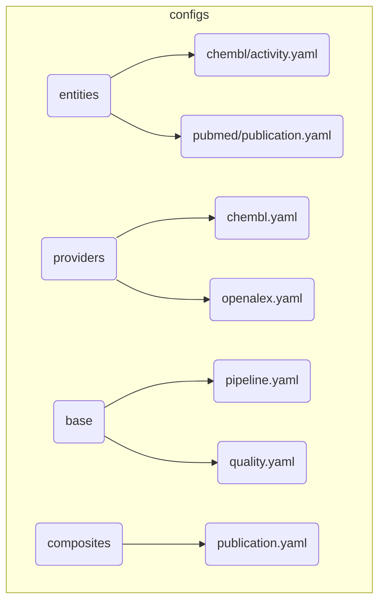

______________________________________________________________________

Version: 1.1.1
Status: active
Class: published
Owner: BioETL Team
Reviewers:

- BioETL Team
  Last verified: '2026-04-24'

______________________________________________________________________

# BioETL Project Navigator

*Synced with RULES.md v6.1.2 | Last updated: 2026-04-09*

> **Documentation Update:** 2026-04-24
>
> - **Issue #3091 Resolution**: Fixed ADR status contradiction (ADR-001..043 → ADR-001..045)
> - **Source-code map updated**: Added missing directories (`domain/lineage/`, `domain/control_plane/`, `domain/config/control_plane.py`, `domain/composite/checkpoint/`, `application/services/control_plane/`, `application/services/dq/`, `application/services/execution/`, `application/services/lineage/`, `composition/monitoring/`, `infrastructure/adr/`, `infrastructure/audit/`, `infrastructure/compat/`, `infrastructure/control_plane/`, `infrastructure/system/`)
> - Compatibility inventory synced with the current measured CLI shim registry
> - Source-code map updated for the storage subpackage decomposition (`bronze/`, `silver/`, `gold/`, `metadata/`, `delta/`, `support/`)
> - Snapshot-style file/test counts removed from active navigation blocks to reduce drift
> - Active entry points clarified: `RULES.md`, `TOOLS.md`, and canonical layer docs in `docs/02-architecture/`
> - 2026-03-20: stale config-loader entry updated to current composition/runtime and infrastructure config seams
> - 2026-03-24: composition/domain references synced with RF-021 config ownership and RF-022 runtime port contracts
> - 2026-03-27: navigator synced with ADR-044/ADR-045, GitHub local workflow guide, and active traceability runbooks
> - 2026-04-01: control-plane documentation pack re-synced with RunManifest / RunLedger runtime, storage layout, rollout flags, inspection CLI, and event baseline
> - 2026-04-02: navigator re-synced with `04-reference/index.md` and `05-operations/archive-index.md`
> - 2026-04-04: published docs verification guide added to active entrypoints and mixed-environment workflow references

## Quick Links

| Need to...                        | Go to                                                                                  |
| --------------------------------- | -------------------------------------------------------------------------------------- |
| Understand the rules              | [RULES.md](RULES.md)                                                                   |
| Look up terminology               | [glossary.md](glossary.md)                                                             |
| Find tool commands                | [TOOLS.md](TOOLS.md)                                                                   |
| Verify docs quality gates         | [docs-verification.md](../03-guides/docs-verification.md)                              |
| Govern documentation              | [D-01](governance/01-documentation-governance-style-guide.md)                          |
| Create a new pipeline             | [governance/04-extending-bioetl.md](governance/04-extending-bioetl.md)                 |
| Review a pipeline                 | [pipeline-review-checklist.md](../04-reference/templates/pipeline-review-checklist.md) |
| Browse published reference docs   | [index.md](../04-reference/index.md)                                                   |
| Find doc templates                | [templates/index.md](../04-reference/templates/index.md)                               |
| Inspect run traceability          | [run-manifest-ledger.md](../04-reference/contracts/run-manifest-ledger.md)             |
| Use inspection CLI                | [cli.md](../04-reference/cli.md)                                                       |
| Run control-plane triage          | [run-manifest-inspection.md](../05-operations/runbooks/run-manifest-inspection.md)     |
| Understand control-plane decision | [ADR-044](../02-architecture/decisions/ADR-044-run-manifest-ledger-control-plane.md)   |
| Understand rollout / DQ decision  | [ADR-045](../02-architecture/decisions/ADR-045-dq-contract-system.md)                  |
| Handle a prod error               | [runbooks/index.md](../05-operations/runbooks/index.md)                                |
| Browse historical ops material    | [archive-index.md](../05-operations/archive-index.md)                                  |
| Understand architecture           | [00-overview.md](../02-architecture/00-overview.md)                                    |
| Check data contracts              | [chembl_activity-v1.0.json](../04-reference/contracts/gold/chembl_activity_v1.0.json)  |
| Check DQ contracts                | [dq-contracts.md](../04-reference/contracts/dq-contracts.md)                                |
| Need historical context           | Repository path `docs/99-archive/README.md` *(non-canonical)*                          |

______________________________________________________________________

## Language Policy

| Category                | Language | Examples                                          |
| ----------------------- | -------- | ------------------------------------------------- |
| **Public-facing**       | English  | README.md, CONTRIBUTING.md, CHANGELOG.md          |
| **User guides**         | English  | docs/03-guides/*, docs/04-reference/*             |
| **Internal governance** | Russian  | RULES.md, AGENT.md, docs/00-project/governance/\* |
| **Architecture docs**   | Russian  | docs/02-architecture/\*                           |
| **Code comments**       | Russian  | Docstrings, inline comments                       |

______________________________________________________________________

## Documentation Structure

```
docs/
├── 00-project/                  # Project rules & governance
│   ├── 00-map.md                # This file (Project Navigator)
│   ├── index.md                 # Welcome page
│   ├── RULES.md                 # Canonical rules document (v6.1.2)
│   ├── glossary.md              # Ubiquitous Language terminology
│   ├── TOOLS.md                 # Active tools hub & unified entry points
│   ├── rules-summary.md         # TL;DR of RULES.md
│   └── governance/              # Project governance policies
│       ├── 01-documentation-governance-style-guide.md  # D-01 documentation metapolicy
│       ├── 02-naming-policy.md  # Entity naming conventions
│       ├── 03-file-policy.md
│       ├── 04-extending-bioetl.md
│       ├── 05-github-policy.md  # CI/CD, branch protection, reviews
│       └── 06-doc-publication-policy.md  # Documentation publication policy
│
├── 01-requirements/             # Requirements
│   └── REQUIREMENTS.md          # Testable requirements catalog
│
├── 02-architecture/             # Architecture & Decisions
│   ├── 00-overview.md           # Architecture overview
│   ├── decisions/               # ADRs (ADR-001..045)
│   ├── diagrams/            # Canonical Mermaid source files and rendered views
│   └── ... (Layer docs: 01-domain, 02-application, etc.)
│
├── 03-guides/                   # Guides & Manuals
│   ├── development/             # Developer guides (config schema, etc.)
│   └── ... (User guides: getting-started, testing, etc.)
│
├── 04-reference/                # Reference Documentation
│   ├── index.md                 # Reference landing page
│   ├── api/                     # API Reference
│   ├── cli.md                   # CLI Reference
│   ├── providers/               # Provider documentation (ChEMBL, PubMed, etc.)
│   ├── pipelines/               # Pipeline specifications
│   ├── contracts/               # Data and control-plane contracts
│   ├── schemas/                 # Auxiliary schemas & field maps
│   └── templates/               # Code & doc templates + published template index
│
├── 05-operations/               # Operations & Runbooks
│   ├── archive-index.md         # Historical / archive-only operations surface
│   ├── runbooks/                # Incident response playbooks
│   ├── verification/            # Data verification reports
│   └── ... (Ops guides: vacuum, performance)
│
└── 99-archive/                  # Historical / superseded (repo-only, non-canonical)
    ├── reports/                 # Old project reports
    └── ...
```

______________________________________________________________________

## By Topic

### Getting Started

1. [RULES.md](RULES.md) - Project rules (start here)
1. [rules-summary.md](rules-summary.md) - Quick reference
1. [TOOLS.md](TOOLS.md) - Active tools hub and script entry points
1. [04-extending-bioetl.md](governance/04-extending-bioetl.md) - Adding providers/pipelines

### Architecture

| Document                                                                                                                        | Covers                                                 | RULES.md   |
| ------------------------------------------------------------------------------------------------------------------------------- | ------------------------------------------------------ | ---------- |
| [system-context.md](../02-architecture/system-context.md)                                                                       | Entity models, IDs, relationships                      | §2.8       |
| [container-diagram.md](../02-architecture/diagrams/guide/container-reference.md)                                                | C4 Container, Local-Only runtime                       | §5.6       |
| [data-flow.md](../02-architecture/diagrams/guide/data-flow-reference.md)                                                        | Ports & Adapters, layer responsibilities               | §1.1       |
| [05-composition-layer.md](../02-architecture/05-composition-layer.md)                                                           | Composition Root, DI, Factories                        | §1.1       |
| [ADR-001: Delta Lake](../02-architecture/decisions/ADR-001-delta-lake-vs-parquet.md)                                            | Storage engine choice                                  | §2.1, §3   |
| [ADR-002: Medallion](../02-architecture/decisions/ADR-002-medallion-architecture.md)                                            | Data layering pattern                                  | §1         |
| [ADR-003: In-Memory Locking](../02-architecture/decisions/ADR-003-in-memory-locking-strategy.md)                                | MemoryLock strategy                                    | §6         |
| [ADR-004: Pydantic](../02-architecture/decisions/ADR-004-pydantic-vs-dataclasses.md)                                            | Validation approach                                    | -          |
| [ADR-005: Composition Layer](../02-architecture/decisions/ADR-005-composition-layer-separation.md)                              | DI and layer separation                                | §1.1       |
| [ADR-006: Logger/Metrics Ports](../02-architecture/decisions/ADR-006-logger-metrics-ports.md)                                   | Port abstractions                                      | §1.1       |
| [ADR-007: Circuit Breaker](../02-architecture/decisions/ADR-007-circuit-breaker-implementation.md)                              | Failure handling pattern                               | §3.1.4     |
| [ADR-008: Graceful Shutdown](../02-architecture/decisions/ADR-008-graceful-shutdown-strategy.md)                                | SIGTERM/SIGINT handling                                | §5.3       |
| [ADR-009: Paginated Fetcher](../02-architecture/decisions/ADR-009-paginated-fetcher-mixin.md)                                   | Pagination abstraction                                 | App D      |
| [ADR-010: Local-Only Deploy](../02-architecture/decisions/ADR-010-local-only-deployment.md)                                     | File-based deployment (no Docker)                      | §5.6       |
| [ADR-011: Watermark Removal](../02-architecture/decisions/ADR-011-remove-watermark-mechanism.md)                                | Simplified checkpoint model                            | §2.4       |
| [ADR-012: Storage Clear Contract](../02-architecture/decisions/ADR-012-storage-clear-contract-and-run-id.md)                    | Storage clear API, run-id injection                    | §2.1       |
| [ADR-013: Async Storage Cleanup](../02-architecture/decisions/ADR-013-async-storage-cleanup.md)                                 | MedallionLifecycleService pattern                      | §2.1       |
| [ADR-014: Deterministic Writes](../02-architecture/decisions/ADR-014-deterministic-writes.md)                                   | SCD2 ingestion-ts, reproducible writes                 | §2.1       |
| [ADR-015: Pipeline Services Lifecycle](../02-architecture/decisions/ADR-015-pipeline-services-lifecycle.md)                     | Port lifecycle contracts                               | §1.1       |
| [ADR-016: Error Handling Strategy](../02-architecture/decisions/ADR-016-error-handling-strategy.md)                             | Unified error classification                           | §3.1       |
| [ADR-017: Observability Architecture](../02-architecture/decisions/ADR-017-observability-architecture.md)                       | Metrics, tracing, logging ports                        | §5.1       |
| [ADR-018: Gold Strict Validation](../02-architecture/decisions/ADR-018-gold-strict-validation.md)                               | Pandera Gold validation                                | §2.7       |
| [ADR-019: Observability Port Enforcement](../02-architecture/decisions/ADR-019-observability-port-enforcement.md)               | REQ-OBS-001 compliance                                 | §5.1       |
| [ADR-020: BasePipeline Decomposition](../02-architecture/decisions/ADR-020-basepipeline-decomposition.md)                       | God Object refactoring                                 | §1.1       |
| [ADR-021: DDD Aggregates](../02-architecture/decisions/ADR-021-ddd-aggregates-adoption.md)                                      | DDD aggregates adoption                                | -          |
| [ADR-022: Tracing NoOp](../02-architecture/decisions/ADR-022-tracing-noop.md)                                                   | NoOp for tracing                                       | -          |
| [ADR-023: Entity Type Patterns](../02-architecture/decisions/ADR-023-entity-type-patterns.md)                                   | Entity type patterns                                   | -          |
| [ADR-024: Entity Naming Unification](../02-architecture/decisions/ADR-024-entity-naming-unification.md)                         | Entity naming unification                              | -          |
| [ADR-025: Pipeline Config Unification](../02-architecture/decisions/ADR-025-pipeline-config-unification.md)                     | Pipeline config unification                            | -          |
| [ADR-026: Composite Pipeline Pattern](../02-architecture/decisions/ADR-026-composite-pipeline-pattern.md)                       | Composite pipeline pattern                             | -          |
| [ADR-027: DQ Rules Externalization](../02-architecture/decisions/ADR-027-dq-rules-externalization.md)                           | Hierarchical DQ configuration                          | §3.1.2     |
| [ADR-028: Filter Rules Externalization](../02-architecture/decisions/ADR-028-filter-rules-externalization.md)                   | Hierarchical filter configuration                      | App D      |
| [ADR-029: Output Metadata Unification](../02-architecture/decisions/ADR-029-output-metadata-unification.md)                     | Unified output metadata contracts                      | §2.4       |
| [ADR-030: Publication Pagination Strategy](../02-architecture/decisions/ADR-030-publication-pagination-strategy.md)             | Publication pagination strategy                        | -          |
| [ADR-031: Loading Strategy Formalization](../02-architecture/decisions/ADR-031-loading-strategy-formalization.md)               | Loading strategy formalization                         | -          |
| [ADR-032: Unified HTTP Client](../02-architecture/decisions/ADR-032-unified-http-client.md)                                     | Unified HTTP client pattern                            | App A      |
| [ADR-033: Publication Validation Strategy](../02-architecture/decisions/ADR-033-publication-validation-strategy.md)             | Five-level publication validation                      | §3.4       |
| [ADR-034: Schema↔Domain Pairs](../02-architecture/decisions/ADR-034-schema-domain-pairs.md)                                     | Schema↔Domain configuration pairs                      | §2.8       |
| [ADR-035: JSON Field Typing Policy](../02-architecture/decisions/ADR-035-json-field-typing-policy.md)                           | JSON field typing (Silver↔Gold)                        | §2.8       |
| [ADR-036: Gold Contract Versioning](../02-architecture/decisions/ADR-036-gold-contract-versioning-policy.md)                    | Gold contract versioning policy                        | §2.7       |
| [ADR-037: Canonical Schema Generation](../02-architecture/decisions/ADR-037-canonical-schema-generation.md)                     | Canonical schema source and generation                 | §2.8       |
| [ADR-038: Enum Externalization](../02-architecture/decisions/ADR-038-enum-externalization.md)                                   | ChEMBL enum values externalization                     | App D      |
| [ADR-039: Unified Entity Config](../02-architecture/decisions/ADR-039-unified-entity-config-format.md)                          | Unified entity configuration format                    | App D      |
| [ADR-040: Diagram Governance](../02-architecture/decisions/ADR-040-diagram-governance.md)                                       | Mermaid diagram standards and governance               | §7.5       |
| [ADR-041: Naming Policy Skills/Agents](../02-architecture/decisions/ADR-041-naming-policy-skills-agents.md)                     | Naming conventions for skills and agents               | §7.1       |
| [ADR-042: Testing Strategy Matrix](../02-architecture/decisions/ADR-042-testing-strategy-matrix.md)                             | Test categorization and coverage strategy              | §5         |
| [ADR-043: Documentation Knowledge Management](../02-architecture/decisions/ADR-043-documentation-knowledge-management.md)       | Documentation governance and knowledge management      | §7         |
| [ADR-044: Run Manifest and Run Ledger Control Plane](../02-architecture/decisions/ADR-044-run-manifest-ledger-control-plane.md) | Immutable manifest, append-only ledger, inspection CLI | §2.4, §5.5 |
| [ADR-045: Data Quality Contract System](../02-architecture/decisions/ADR-045-dq-contract-system.md)                             | DQ contract semantics and rollout alignment            | §3.4, §5.5 |

### Data Management

| Topic            | Document                                                                 | RULES.md |
| ---------------- | ------------------------------------------------------------------------ | -------- |
| Medallion Layers | [data-flow.md](../02-architecture/diagrams/guide/data-flow-reference.md) | §2.1     |
| Schema Drift     | [RULES.md](RULES.md)                                                     | §2.2     |
| Data Lineage     | [system-context.md](../02-architecture/system-context.md)                | §2.3     |
| Backfill/Replay  | [RULES.md](RULES.md)                                                     | §2.4     |
| Quarantine       | [RULES.md](RULES.md)                                                     | §2.6     |
| Content Hash     | [system-context.md](../02-architecture/system-context.md)                | §2.8     |

### Control Plane & Traceability

| Topic                            | Document                                                                             | RULES.md   |
| -------------------------------- | ------------------------------------------------------------------------------------ | ---------- |
| Published control-plane contract | [run-manifest-ledger.md](../04-reference/contracts/run-manifest-ledger.md)           | §2.4, §5.5 |
| Supported inspection CLI         | [cli.md](../04-reference/cli.md)                                                     | §5.5       |
| Mandatory inspection runbook     | [run-manifest-inspection.md](../05-operations/runbooks/run-manifest-inspection.md)   | §2.4, §5.5 |
| Control-plane ADR                | [ADR-044](../02-architecture/decisions/ADR-044-run-manifest-ledger-control-plane.md) | §2.4, §5.5 |
| DQ / rollout ADR                 | [ADR-045](../02-architecture/decisions/ADR-045-dq-contract-system.md)                | §3.4, §5.5 |
| Documentation metapolicy         | [D-01](governance/01-documentation-governance-style-guide.md)                        | §7         |

### Schema Documentation

| Provider | Entity   | Schema Document                                                                | RULES.md |
| -------- | -------- | ------------------------------------------------------------------------------ | -------- |
| ChEMBL   | Activity | [activity-schema.md](../04-reference/schemas/domain/chembl/activity-schema.md) | §2.8     |
| ChEMBL   | Molecule | [molecule-schema.md](../04-reference/schemas/domain/chembl/molecule-schema.md) | §2.8     |
| ChEMBL   | Target   | [target-schema.md](../04-reference/schemas/domain/chembl/target-schema.md)     | §2.8     |
| ChEMBL   | Assay    | [assay-schema.md](../04-reference/schemas/domain/chembl/assay-schema.md)       | §2.8     |

### Operations

| Topic                    | Document                                                                           | RULES.md   |
| ------------------------ | ---------------------------------------------------------------------------------- | ---------- |
| Error Handling           | [ADR-016](../02-architecture/decisions/ADR-016-error-handling-strategy.md)         | §3.1       |
| Circuit Breaker          | [ADR-007](../02-architecture/decisions/ADR-007-circuit-breaker-implementation.md)  | §3.1.4     |
| Locking                  | [ADR-003](../02-architecture/decisions/ADR-003-in-memory-locking-strategy.md)      | §3.3       |
| DQ Metrics               | [RULES.md](RULES.md)                                                               | §3.4       |
| Graceful Shutdown        | [ADR-008](../02-architecture/decisions/ADR-008-graceful-shutdown-strategy.md)      | §5.3       |
| DR Procedures            | [runbooks/index.md](../05-operations/runbooks/index.md)                            | §5.5       |
| Control-Plane Contract   | [run-manifest-ledger.md](../04-reference/contracts/run-manifest-ledger.md)         | §2.4, §5.5 |
| Inspection CLI           | [cli.md](../04-reference/cli.md)                                                   | §5.5       |
| Run Traceability         | [run-manifest-inspection.md](../05-operations/runbooks/run-manifest-inspection.md) | §2.4, §5.5 |
| Historical Ops Artifacts | [archive-index.md](../05-operations/archive-index.md)                              | §7         |
| Cleanup                  | [cleanup-policy.md](../03-guides/cleanup-policy.md)                                | §2.1.1     |

### Development

| Topic            | Document                                                                               | RULES.md |
| ---------------- | -------------------------------------------------------------------------------------- | -------- |
| Adding Providers | [add-new-source.md](../03-guides/add-new-source.md)                                    | App D    |
| Adding Pipelines | [add-pipeline-existing-source.md](../03-guides/add-pipeline-existing-source.md)        | App D    |
| Pipeline Review  | [pipeline-review-checklist.md](../04-reference/templates/pipeline-review-checklist.md) | §4.2     |
| GitHub Workflow  | [github-local-workflow.md](../03-guides/github-local-workflow.md)                      | §7.3     |
| Testing          | [testing.md](../03-guides/testing.md)                                                  | §4.2     |
| Coverage Config  | [coverage-configuration.md](../03-guides/coverage-configuration.md)                    | §4.2     |
| E2E Testing      | [ADR-010](../02-architecture/decisions/ADR-010-local-only-deployment.md)               | §4.2.3   |
| Date Handling    | [date-handling.md](../03-guides/date-handling.md)                                      | §2.4     |
| Code Style       | [RULES.md §4](RULES.md)                                                                | §4       |

______________________________________________________________________

## Source Code Map

```
src/bioetl/
├── domain/                      # Pure logic, no I/O (§1.1)
│   ├── ports/                   # Protocol interfaces
│   │   ├── __init__.py          # Facade — single import point (ARCH-008)
│   │   ├── data_source.py       # DataSourcePort, FilterableDataSourcePort
│   │   ├── storage.py           # StoragePort
│   │   ├── locking.py           # LockPort
│   │   ├── checkpoint.py        # CheckpointPort
│   │   ├── quarantine.py        # QuarantinePort
│   │   ├── observability.py     # MetricsPort, TracingPort, LoggerPort
│   │   ├── validation.py        # GoldValidatorPort
│   │   ├── filtering.py         # InputFilterPort
│   │   ├── health_check.py      # HealthCheckPort
│   │   ├── resilience.py        # CircuitBreakerPort
│   │   ├── runner.py            # PipelineRunnerPort
│   │   ├── shutdown.py          # ShutdownPort
│   │   ├── memory.py            # MemoryPort
│   │   ├── metadata.py          # MetadataPort
│   │   ├── metadata_coordinator.py  # MetadataCoordinatorPort
│   │   ├── delta_reader.py      # DeltaReaderPort
│   │   ├── data_normalization.py    # DataNormalizationPort
│   │   ├── dq_config.py         # DQConfigPort
│   │   ├── dq_report.py         # DQReportPort
│   │   ├── serialization.py     # SerializationPort
│   │   ├── idmapping.py         # IdMappingPort
│   │   ├── adr.py               # AdrPort
│   │   ├── audit.py             # AuditPort
│   │   ├── pii.py               # PiiPort
│   │   └── noop.py              # NoOp implementations (Null Object Pattern)
│   ├── config/                  # Domain config models (package)
│   │   ├── pipeline.py          # PipelineConfig
│   │   ├── runtime.py           # RuntimeConfig
│   │   ├── dq.py                # DQ config models
│   │   ├── table.py             # TableConfig
│   │   ├── memory.py            # MemoryConfig
│   │   ├── validation.py        # ValidationConfig
│   │   └── control_plane.py     # Control plane config models
│   ├── exceptions/              # Domain exceptions hierarchy (package)
│   │   ├── base.py              # BioETLError base
│   │   ├── validation.py        # ValidationError
│   │   ├── network.py           # NetworkError
│   │   ├── infrastructure.py    # InfrastructureError
│   │   ├── internal.py          # InternalError
│   │   └── data_quality.py      # DataQualityError
│   ├── aggregates/              # DDD Aggregates (ADR-021)
│   │   ├── batch.py             # Batch aggregate
│   │   ├── pipeline_run.py      # PipelineRun aggregate
│   │   ├── quarantine_entry.py  # QuarantineEntry aggregate
│   │   └── events.py            # Domain events
│   ├── composite/               # Composite pipeline domain (ADR-026)
│   │   ├── strategy.py          # Merge strategies
│   │   ├── state.py             # Composite state machine
│   │   ├── result.py            # CompositeResult
│   │   ├── lineage.py           # Field-level lineage
│   │   ├── cross_validation.py  # Pre-merge validation
│   │   ├── field_groups.py      # Column ordering
│   │   ├── config.py            # Composite config models
│   │   ├── aggregation.py       # Enricher aggregation
│   │   └── checkpoint/           # Composite checkpoint models
│   ├── contracts/gold/          # Gold contract modules
│   │   ├── chembl.py            # ChEMBL Gold contract exports
│   │   ├── composite.py         # Composite Gold contract exports
│   │   ├── publications.py      # Publication Gold contract exports
│   │   ├── pubchem.py           # PubChem Gold contract exports
│   │   └── uniprot.py           # UniProt Gold contract exports
│   ├── entities/                # Domain entities
│   ├── filtering/               # Filter domain models (ADR-028)
│   │   ├── input_config.py      # InputFilterConfig
│   │   ├── silver_config.py     # SilverFilterConfig
│   │   ├── gold_config.py       # GoldFilterConfig
│   │   └── ...                  # column_filter, range_filter, list_filters
│   ├── lineage/                 # Data lineage tracking
│   │   ├── field_lineage.py     # Field-level lineage tracking
│   │   ├── pipeline_lineage.py  # Pipeline-level lineage
│   │   └── ...                  # Lineage utilities
│   ├── control_plane/           # Control plane domain models
│   │   ├── run_manifest.py      # Run manifest models
│   │   ├── run_ledger.py       # Run ledger models
│   │   └── ...                  # Control plane contracts
│   ├── mapping/                 # Field mapping definitions
│   │   ├── publication_fields.py        # Publication field mappings
│   │   ├── publication_type_mapping.py  # Type classification
│   │   ├── activity_fields.py           # Activity field mappings
│   │   └── molecule_fields.py           # Molecule field mappings
│   ├── models/                  # Domain models
│   ├── registry/                # Entity registries
│   ├── schemas/                 # PyArrow Silver schemas (by provider)
│   │   ├── common/              # Base schemas (publication_base, molecule_base)
│   │   ├── chembl/              # 13 ChEMBL entity schemas
│   │   ├── crossref/            # CrossRef schemas
│   │   ├── openalex/            # OpenAlex schemas
│   │   ├── pubchem/             # PubChem schemas
│   │   ├── pubmed/              # PubMed schemas
│   │   ├── semanticscholar/     # SemanticScholar schemas
│   │   └── uniprot/             # UniProt schemas
│   ├── services/                # Domain services
│   │   ├── normalization_service.py     # Data normalization
│   │   ├── identity_service.py          # Entity ID generation
│   │   ├── text_similarity.py           # Text similarity
│   │   ├── dq_metrics_calculator.py     # DQ metrics
│   │   ├── unit_converter.py            # Unit conversion
│   │   └── ...
│   ├── value_objects/           # Value objects
│   │   ├── run_context.py       # RunContext
│   │   ├── dq_result.py         # DQResult
│   │   ├── silver_result.py     # SilverResult
│   │   └── ...
│   ├── transformations.py       # Pure transformation functions
│   └── types.py                 # Shared types (RunType, HealthStatus, ErrorCode)
│
├── application/                 # Pipeline orchestration (§1.1)
│   ├── core/                    # Core pipeline infrastructure
│   │   ├── base.py              # Base pipeline primitives
│   │   ├── base_transformer/    # Base transformer contracts and structural policy
│   │   ├── batch_executor.py    # Batch executor
│   │   ├── runner.py            # PipelineRunner (Driving Adapter logic)
│   │   ├── record_processor.py  # Record processing
│   │   ├── lifecycle/           # Shutdown, checkpoint, locks, cleanup, heartbeat
│   │   ├── preflight/           # Pre-run validation and health aggregation
│   │   ├── postrun/             # Post-run cleanup, DQ, metadata and VACUUM
│   │   ├── quarantine_manager.py    # Quarantine management
│   │   ├── batch_memory_manager.py  # Memory management
│   │   └── ...
│   ├── composite/               # Composite pipeline orchestration
│   ├── pipelines/               # Concrete pipeline implementations
│   │   ├── common/              # Shared pipeline helpers
│   │   ├── chembl/              # ChEMBL transformers and pipeline helpers
│   │   │   ├── activity_transformer.py
│   │   │   ├── assay_transformer.py
│   │   │   ├── molecule_transformer.py
│   │   │   ├── target_transformer.py
│   │   │   ├── publication_transformer.py
│   │   │   ├── cell_line_transformer.py
│   │   │   ├── protein_class_transformer.py
│   │   │   ├── compound_record_transformer.py
│   │   │   ├── tissue_transformer.py
│   │   │   ├── target_component_transformer.py
│   │   │   ├── assay_parameters_transformer.py
│   │   │   ├── publication_term_transformer.py
│   │   │   ├── publication_similarity_transformer.py
│   │   │   ├── subcellular_fraction_transformer.py
│   │   │   ├── base_chembl_transformer.py
│   │   │   └── _pipelines.py
│   │   ├── pubchem/             # PubChem transformers
│   │   ├── pubmed/              # PubMed transformers
│   │   ├── uniprot/             # UniProt transformers
│   │   ├── crossref/            # CrossRef transformers
│   │   ├── openalex/            # OpenAlex transformers
│   │   └── semanticscholar/     # SemanticScholar transformers
│   ├── services/                # Application services
│   │   ├── control_plane/       # Control plane services
│   │   ├── dq/                 # Data quality services
│   │   ├── execution/          # Execution services
│   │   └── lineage/            # Lineage services
│   └── observability/           # Application-level observability
│
├── composition/                 # Composition Root (DI container)
│   ├── bootstrap/               # Bootstrap helpers
│   │   ├── assembly/            # Storage/checkpoint assembly
│   │   ├── cli/                 # CLI bootstrap (adr, checkpoint, config, health, ...)
│   │   └── runtime/             # Runtime assembly, composite, pipeline, runner
│   ├── bootstrap_contexts.py    # Bootstrap contexts
│   ├── bootstrap_logger.py      # Bootstrap logging setup
│   ├── builders.py              # Composition builders
│   ├── entrypoints.py           # CLI/runner entrypoints
│   ├── monitoring/              # Monitoring and health checks
│   ├── observability.py         # Observability wiring
│   ├── providers/               # Provider registration
│   ├── registry.py              # Pipeline discovery
│   ├── runtime_builders/        # Runtime builder helpers
│   ├── services/                # Composition services
│   └── factories/               # Consolidated factories
│       ├── pipeline_factory.py  # Pipeline factory
│       ├── runner_factory.py    # Runner factory
│       ├── storage_factory.py   # Multi-layer storage factory
│       ├── http_client_factory.py   # HTTP client factory
│       ├── datasource/data_source_factory.py   # Data source factory
│       ├── transformer_factory.py   # Transformer factory
│       └── ...
│
├── infrastructure/              # I/O adapters (§1.1)
│   ├── adapters/                # External API clients
│   │   ├── http/                # HTTP client infrastructure (rate limiter, circuit breaker)
│   │   ├── chembl/              # ChEMBL API adapter
│   │   ├── crossref/            # CrossRef API adapter
│   │   ├── openalex/            # OpenAlex API adapter
│   │   ├── pubchem/             # PubChem API adapter
│   │   ├── pubmed/              # PubMed API adapter
│   │   ├── semanticscholar/     # Semantic Scholar API adapter
│   │   ├── uniprot/             # UniProt API adapter
│   │   ├── common/              # Shared adapter utilities
│   │   ├── decorators/          # circuit_breaker, retry decorators
│   │   └── input/               # CSV filter reader
│   ├── storage/                 # Data persistence with canonical public seams + internal subpackages
│   │   ├── bronze/              # Bronze writer internals
│   │   ├── silver/              # Silver writer internals
│   │   ├── gold/                # Gold writer internals
│   │   ├── metadata/            # Metadata builder/writer internals
│   │   ├── delta/               # Shared Delta helpers
│   │   ├── support/             # Retention/checkpoint/atomic helpers
│   │   ├── bronze_writer.py     # Bronze layer public writer seam
│   │   ├── silver_writer.py     # Silver layer public writer seam
│   │   ├── gold_writer.py       # Gold layer public writer seam
│   │   ├── base_delta_writer.py # Shared Delta writer seam
│   │   ├── delta_reader.py      # Delta table reader seam
│   │   ├── metadata_builder.py  # Metadata builder seam
│   │   ├── metadata_writer.py   # Metadata writer seam
│   │   └── atomic.py            # Atomic file-write facade
│   ├── adr/                     # ADR utilities
│   ├── audit/                   # Audit utilities
│   ├── config/                  # Config loaders (package)
│   ├── control_plane/           # Control plane infrastructure
│   ├── errors/                  # Error handling
│   ├── export/                  # Export utilities
│   ├── locking/                 # Local in-process locking
│   │   └── memory_lock.py       # In-memory single-instance lock (ADR-010)
│   ├── checkpoint/              # Checkpoint persistence
│   ├── compat/                  # Compatibility utilities
│   ├── quarantine/              # DQ failure handling
│   ├── observability/           # Metrics, logging, tracing adapters
│   ├── schemas/                 # Pydantic config schemas
│   ├── security/                # PII hashing
│   ├── serialization/           # JSON encoders
│   ├── validation/              # Pandera validator
│   ├── config_merge.py          # Config merge utility
│   └── system/                  # System utilities
│
└── interfaces/                  # External interfaces
    ├── cli/                     # CLI package (bioetl run/quarantine/checkpoint)
    │   ├── __init__.py          # CLI package entry
    │   ├── __main__.py          # CLI module entrypoint
    │   ├── exit_codes.py        # CLI exit codes
    │   ├── formatters.py        # CLI output formatting
    │   ├── main.py              # Click command group
    │   └── commands/            # CLI command entrypoints + support/compat modules
    ├── http/                    # HTTP interfaces (health server)
    │   ├── health_server.py     # Health server
    │   └── types.py             # HTTP types
    └── orchestration/           # Orchestration helpers

tests/
├── unit/                        # Isolated unit tests (mock I/O)
│   ├── domain/                  # Domain logic tests
│   ├── application/             # Pipeline/transformer tests
│   └── infrastructure/          # Adapter tests
├── integration/                 # Integration tests (VCR cassettes)
│   └── adapters/                # HTTP adapter tests
├── e2e/                         # E2E tests (Local-Only arch)
├── architecture/                # Architecture validation tests
└── fixtures/                    # Test fixtures
    └── vcr/                     # VCR cassettes for HTTP
```

______________________________________________________________________

## Config Files Map



______________________________________________________________________

## Key Files

| File                                                                         | Purpose                                                 |
| ---------------------------------------------------------------------------- | ------------------------------------------------------- |
| `docs/00-project/RULES.md`                                                   | Master rules document                                   |
| `docs/00-project/glossary.md`                                                | Ubiquitous Language terminology                         |
| `CHANGELOG.md`                                                               | Version history                                         |
| `configs/entities/{provider}/{entity}.yaml`                                  | Pipeline configuration                                  |
| `src/bioetl/domain/ports/`                                                   | Protocol interfaces (package)                           |
| `src/bioetl/composition/bootstrap_contexts.py`                               | Composition root                                        |
| `src/bioetl/infrastructure/config/composite_config_api.py`                   | Canonical composite-config loading seam                 |
| `src/bioetl/infrastructure/config/`                                          | Infrastructure config loaders and normalization package |
| `docs/02-architecture/system-context.md`                                     | High-level system diagram                               |
| `docs/04-reference/contracts/gold/{provider}_{entity}_v{major}.{minor}.json` | Published Gold data contract exports                    |

______________________________________________________________________

### CI/CD & GitHub

| Topic         | Document                                                                                                       | RULES.md |
| ------------- | -------------------------------------------------------------------------------------------------------------- | -------- |
| GitHub Policy | [05-github-policy.md](governance/05-github-policy.md)                                                          | §4, §5   |
| Contributing  | [CONTRIBUTING.md](https://github.com/SatoryKono/BioactivityDataAcquisition/blob/main/.github/CONTRIBUTING.md) | —        |
| Security      | [SECURITY.md](https://github.com/SatoryKono/BioactivityDataAcquisition/blob/main/.github/SECURITY.md)         | §5.4     |

## Related Resources

- **Repository**: [SatoryKono/BioactivityDataAcquisition](https://github.com/SatoryKono/BioactivityDataAcquisition)
- **Issues**: Report bugs and feature requests
- **CI/CD**: GitHub Actions workflows ([GitHub Policy](governance/05-github-policy.md))

______________________________________________________________________

## Document Status

| Document                  | Last Updated | Status                         |
| ------------------------- | ------------ | ------------------------------ |
| RULES.md                  | 2026-04-09   | v6.1.2 (Latest)                |
| REQUIREMENTS.md           | 2026-04-16   | v1.8.1 (rules sync refreshed)  |
| glossary.md               | 2026-03-08   | v2.7 (Ubiquitous Language)     |
| 00-map.md                 | 2026-03-24   | v8.3 Active navigator synced   |
| rules-summary.md          | 2026-03-13   | v6.1 Synced                    |
| TOOLS.md                  | 2026-03-13   | v3.0 Active tools hub          |
| 03-guides/                | 2026-03-19   | Active guides index            |
| 03-guides/development/    | 2026-01-26   | Config schema guidelines       |
| ADR-001..045              | 2026-04-24   | Current ADR set documented     |
| 05-operations/runbooks/   | 2026-03-19   | Active Local-Only runbooks     |
| 04-reference/schemas/     | 2026-03-19   | Active schema references       |
| docs/reports/             | 2026-03-19   | Historical evidence and audits |
| 02-architecture/diagrams/ | 2026-03-10   | Canonical diagram source tree  |

______________________________________________________________________

*Last updated: 2026-03-24. Source Code Map tracks stable entry points and avoids snapshot counts that drift quickly.*
