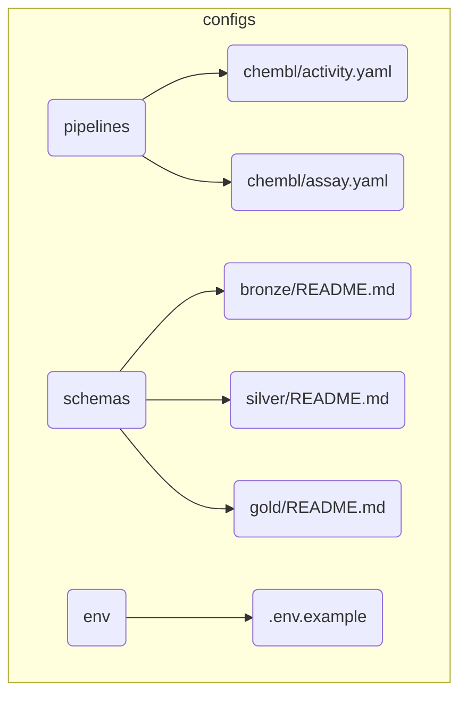

# BioETL Project Navigator

*Synced with RULES.md v5.21 | Last updated: 2026-02-24*

> **Documentation Update:** 2026-02-24
>
> - Added Codex operational guidance in `docs/00-project/agents/CODEX.md` (architecture audit + implementation protocol)
> - Added AI agent index page with explicit links to AGENT/CLAUDE/GEMINI/CODEX instructions
> - Navigator quick links extended with AI agent guidance entry

## Quick Links

| Need to...              | Go to                                                                                  |
| ----------------------- | -------------------------------------------------------------------------------------- |
| Understand the rules    | [RULES.md](RULES.md)                                                                   |
| Look up terminology     | [glossary.md](glossary.md)                                                             |
| Create a new pipeline   | [governance/04-extending-bioetl.md](governance/04-extending-bioetl.md)                 |
| Review a pipeline       | [pipeline-review-checklist.md](../04-reference/templates/pipeline-review-checklist.md) |
| Handle a prod error     | [runbooks/index.md](../05-operations/runbooks/index.md)                                |
| Understand architecture | [00-overview.md](../02-architecture/00-overview.md)                                    |
| Check data contracts    | [chembl_activity_v1.0.json](../04-reference/contracts/gold/chembl_activity_v1.0.json)  |
| AI agent instructions   | [agents/README.md](agents/README.md)                                                   |

______________________________________________________________________

## Language Policy

| Category                | Language | Examples                                          |
| ----------------------- | -------- | ------------------------------------------------- |
| **Public-facing**       | English  | README.md, CONTRIBUTING.md, CHANGELOG.md          |
| **User guides**         | English  | docs/03-guides/*, docs/04-reference/*             |
| **Internal governance** | Russian  | RULES.md, AGENT.md, docs/00-project/governance/\* |
| **Architecture docs**   | Russian  | docs/02-architecture/\*                           |
| **Code comments**       | Russian  | Docstrings, inline comments                       |

______________________________________________________________________

## Documentation Structure

```
docs/
├── 00-project/                  # Project rules & governance
│   ├── 00-map.md                # This file (Project Navigator)
│   ├── index.md                 # Welcome page
│   ├── RULES.md                 # Canonical rules document (v5.21)
│   ├── glossary.md              # Ubiquitous Language terminology
│   ├── TOOLS.md                 # Tools & Setup
│   ├── rules-summary.md         # TL;DR of RULES.md
│   └── governance/              # Project governance policies
│       ├── 02-naming-policy.md  # Entity naming conventions
│       ├── 03-file-policy.md
│       ├── 04-extending-bioetl.md
│       └── 05-github-policy.md  # CI/CD, branch protection, reviews
│
├── 01-requirements/             # Requirements
│   └── REQUIREMENTS.md          # 156 testable requirements
│
├── 02-architecture/             # Architecture & Decisions
│   ├── 00-overview.md           # Architecture overview
│   ├── decisions/               # ADRs (ADR-001..034)
│   ├── diagrams/                # System diagrams
│   │   └── mermaid/             # Mermaid source files
│   └── ... (Layer docs: 01-domain, 02-application, etc.)
│
├── 03-guides/                   # Guides & Manuals
│   ├── development/             # Developer guides (config schema, etc.)
│   ├── quick-ref/               # Quick reference cheat sheets
│   └── ... (User guides: getting-started, testing, etc.)
│
├── 04-reference/                # Reference Documentation
│   ├── api/                     # API Reference
│   ├── cli.md                   # CLI Reference
│   ├── providers/               # Provider documentation (ChEMBL, PubMed, etc.)
│   ├── pipelines/               # Pipeline specifications
│   ├── contracts/               # Data Contracts (Gold layer schemas)
│   ├── schemas/                 # Auxiliary schemas & field maps
│   └── templates/               # Code & doc templates
│
├── 05-operations/               # Operations & Runbooks
│   ├── runbooks/                # Incident response playbooks
│   ├── verification/            # Data verification reports
│   └── ... (Ops guides: vacuum, performance)
│
└── 99-archive/                  # Archived / Deprecated
    ├── reports/                 # Old project reports
    └── ...
```

______________________________________________________________________

## By Topic

### Getting Started

1. [RULES.md](RULES.md) - Project rules (start here)
1. [rules-summary.md](rules-summary.md) - Quick reference
1. [04-extending-bioetl.md](governance/04-extending-bioetl.md) - Adding providers/pipelines

### Architecture

| Document                                                                                                            | Covers                                   | RULES.md |
| ------------------------------------------------------------------------------------------------------------------- | ---------------------------------------- | -------- |
| [system-context.md](../02-architecture/system-context.md)                                                           | Entity models, IDs, relationships        | §2.8     |
| [container-diagram.md](../02-architecture/container-diagram.md)                                                     | C4 Container, Docker services            | §5.6     |
| [data-flow.md](../02-architecture/data-flow.md)                                                                     | Ports & Adapters, layer responsibilities | §1.1     |
| [05-composition-layer.md](../02-architecture/05-composition-layer.md)                                               | Composition Root, DI, Factories          | §1.1     |
| [ADR-001: Delta Lake](../02-architecture/decisions/ADR-001-delta-lake-vs-parquet.md)                                | Storage engine choice                    | §2.1, §3 |
| [ADR-002: Medallion](../02-architecture/decisions/ADR-002-medallion-architecture.md)                                | Data layering pattern                    | §1       |
| [ADR-003: In-Memory Locking](../02-architecture/decisions/ADR-003-in-memory-locking-strategy.md)                    | MemoryLock strategy                      | §6       |
| [ADR-004: Pydantic](../02-architecture/decisions/ADR-004-pydantic-vs-dataclasses.md)                                | Validation approach                      | -        |
| [ADR-005: Composition Layer](../02-architecture/decisions/ADR-005-composition-layer-separation.md)                  | DI and layer separation                  | §1.1     |
| [ADR-006: Logger/Metrics Ports](../02-architecture/decisions/ADR-006-logger-metrics-ports.md)                       | Port abstractions                        | §1.1     |
| [ADR-007: Circuit Breaker](../02-architecture/decisions/ADR-007-circuit-breaker-implementation.md)                  | Failure handling pattern                 | §3.1.4   |
| [ADR-008: Graceful Shutdown](../02-architecture/decisions/ADR-008-graceful-shutdown-strategy.md)                    | SIGTERM/SIGINT handling                  | §5.3     |
| [ADR-009: Paginated Fetcher](../02-architecture/decisions/ADR-009-paginated-fetcher-mixin.md)                       | Pagination abstraction                   | App D    |
| [ADR-010: Local-Only Deploy](../02-architecture/decisions/ADR-010-local-only-deployment.md)                         | File-based deployment (no Docker)        | §5.6     |
| [ADR-011: Watermark Removal](../02-architecture/decisions/ADR-011-remove-watermark-mechanism.md)                    | Simplified checkpoint model              | §2.4     |
| [ADR-012: Storage Clear Contract](../02-architecture/decisions/ADR-012-storage-clear-contract-and-run-id.md)        | Storage clear API, run-id injection      | §2.1     |
| [ADR-013: Async Storage Cleanup](../02-architecture/decisions/ADR-013-async-storage-cleanup.md)                     | MedallionLifecycleService pattern        | §2.1     |
| [ADR-014: Deterministic Writes](../02-architecture/decisions/ADR-014-deterministic-writes.md)                       | SCD2 ingestion-ts, reproducible writes   | §2.1     |
| [ADR-015: Pipeline Services Lifecycle](../02-architecture/decisions/ADR-015-pipeline-services-lifecycle.md)         | Port lifecycle contracts                 | §1.1     |
| [ADR-016: Error Handling Strategy](../02-architecture/decisions/ADR-016-error-handling-strategy.md)                 | Unified error classification             | §3.1     |
| [ADR-017: Observability Architecture](../02-architecture/decisions/ADR-017-observability-architecture.md)           | Metrics, tracing, logging ports          | §5.1     |
| [ADR-018: Gold Strict Validation](../02-architecture/decisions/ADR-018-gold-strict-validation.md)                   | Pandera Gold validation                  | §2.7     |
| [ADR-019: Observability Port Enforcement](../02-architecture/decisions/ADR-019-observability-port-enforcement.md)   | REQ-OBS-001 compliance                   | §5.1     |
| [ADR-020: BasePipeline Decomposition](../02-architecture/decisions/ADR-020-basepipeline-decomposition.md)           | God Object refactoring                   | §1.1     |
| [ADR-021: DDD Aggregates](../02-architecture/decisions/ADR-021-ddd-aggregates-adoption.md)                          | DDD aggregates adoption                  | -        |
| [ADR-022: Tracing NoOp](../02-architecture/decisions/ADR-022-tracing-noop.md)                                       | NoOp for tracing                         | -        |
| [ADR-023: Entity Type Patterns](../02-architecture/decisions/ADR-023-entity-type-patterns.md)                       | Entity type patterns                     | -        |
| [ADR-024: Entity Naming Unification](../02-architecture/decisions/ADR-024-entity-naming-unification.md)             | Entity naming unification                | -        |
| [ADR-025: Pipeline Config Unification](../02-architecture/decisions/ADR-025-pipeline-config-unification.md)         | Pipeline config unification              | -        |
| [ADR-026: Composite Pipeline Pattern](../02-architecture/decisions/ADR-026-composite-pipeline-pattern.md)           | Composite pipeline pattern               | -        |
| [ADR-027: DQ Rules Externalization](../02-architecture/decisions/ADR-027-dq-rules-externalization.md)               | Hierarchical DQ configuration            | §3.1.2   |
| [ADR-028: Filter Rules Externalization](../02-architecture/decisions/ADR-028-filter-rules-externalization.md)       | Hierarchical filter configuration        | App D    |
| [ADR-029: Output Metadata Unification](../02-architecture/decisions/ADR-029-output-metadata-unification.md)         | Unified output metadata contracts        | §2.4     |
| [ADR-030: Publication Pagination Strategy](../02-architecture/decisions/ADR-030-publication-pagination-strategy.md) | Publication pagination strategy          | -        |
| [ADR-031: Loading Strategy Formalization](../02-architecture/decisions/ADR-031-loading-strategy-formalization.md)   | Loading strategy formalization           | -        |
| [ADR-032: Unified HTTP Client](../02-architecture/decisions/ADR-032-unified-http-client.md)                         | Unified HTTP client pattern              | App A    |

### Data Management

| Topic            | Document                                                                                                                                           | RULES.md |
| ---------------- | -------------------------------------------------------------------------------------------------------------------------------------------------- | -------- |
| Medallion Layers | [data-flow.md](../02-architecture/data-flow.md)                                                                                                    | §2.1     |
| Schema Drift     | [RULES.md](RULES.md#22-%D0%BE%D0%B1%D1%80%D0%B0%D0%B1%D0%BE%D1%82%D0%BA%D0%B0-%D0%B4%D1%80%D0%B5%D0%B9%D1%84%D0%B0-%D1%81%D1%85%D0%B5%D0%BC%D1%8B) | §2.2     |
| Data Lineage     | [system-context.md](../02-architecture/system-context.md)                                                                                          | §2.3     |
| Backfill/Replay  | [RULES.md](RULES.md#24-%D1%81%D1%82%D1%80%D0%B0%D1%82%D0%B5%D0%B3%D0%B8%D1%8F-backfill-%D0%B8-replay)                                              | §2.4     |
| Quarantine       | [RULES.md](RULES.md#26-dead-letter-queue--quarantine)                                                                                              | §2.6     |
| Content Hash     | [system-context.md](../02-architecture/system-context.md)                                                                                          | §2.8     |

### Schema Documentation

| Provider | Entity   | Schema Document                                                                | RULES.md |
| -------- | -------- | ------------------------------------------------------------------------------ | -------- |
| ChEMBL   | Activity | [activity-schema.md](../04-reference/schemas/domain/chembl/activity-schema.md) | §2.8     |
| ChEMBL   | Molecule | [molecule-schema.md](../04-reference/schemas/domain/chembl/molecule-schema.md) | §2.8     |
| ChEMBL   | Target   | [target-schema.md](../04-reference/schemas/domain/chembl/target-schema.md)     | §2.8     |
| ChEMBL   | Assay    | [assay-schema.md](../04-reference/schemas/domain/chembl/assay-schema.md)       | §2.8     |

### Operations

| Topic             | Document                                                                          | RULES.md |
| ----------------- | --------------------------------------------------------------------------------- | -------- |
| Error Handling    | [ADR-016](../02-architecture/decisions/ADR-016-error-handling-strategy.md)        | §3.1     |
| Circuit Breaker   | [ADR-007](../02-architecture/decisions/ADR-007-circuit-breaker-implementation.md) | §3.1.4   |
| Locking           | [ADR-003](../02-architecture/decisions/ADR-003-in-memory-locking-strategy.md)     | §3.3     |
| DQ Metrics        | [RULES.md](RULES.md#34-data-quality-%D0%BC%D0%B5%D1%82%D1%80%D0%B8%D0%BA%D0%B8)   | §3.4     |
| Graceful Shutdown | [ADR-008](../02-architecture/decisions/ADR-008-graceful-shutdown-strategy.md)     | §5.3     |
| DR Procedures     | [runbooks/index.md](../05-operations/runbooks/index.md)                           | §5.5     |
| Cleanup           | [cleanup-policy.md](../03-guides/cleanup-policy.md)                               | §2.1.1   |

### Development

| Topic            | Document                                                                                                                                                                            | RULES.md |
| ---------------- | ----------------------------------------------------------------------------------------------------------------------------------------------------------------------------------- | -------- |
| Adding Providers | [add-new-source.md](../03-guides/add-new-source.md)                                                                                                                                 | App D    |
| Adding Pipelines | [add-pipeline-existing-source.md](../03-guides/add-pipeline-existing-source.md)                                                                                                     | App D    |
| Pipeline Review  | [pipeline-review-checklist.md](../04-reference/templates/pipeline-review-checklist.md)                                                                                              | §4.2     |
| Testing          | [testing.md](../03-guides/testing.md)                                                                                                                                               | §4.2     |
| E2E Testing      | [ADR-010](../02-architecture/decisions/ADR-010-local-only-deployment.md)                                                                                                            | §4.2.3   |
| Date Handling    | [date-handling.md](../03-guides/date-handling.md)                                                                                                                                   | §2.4     |
| Code Style       | [RULES.md §4](RULES.md#4-%D0%BA%D0%B0%D1%87%D0%B5%D1%81%D1%82%D0%B2%D0%BE-%D0%BA%D0%BE%D0%B4%D0%B0-%D0%B8-%D1%82%D0%B5%D1%81%D1%82%D0%B8%D1%80%D0%BE%D0%B2%D0%B0%D0%BD%D0%B8%D0%B5) | §4       |

______________________________________________________________________

## Source Code Map

```
src/bioetl/
├── domain/                      # Pure logic, no I/O (§1.1)
│   ├── ports/                   # Protocol interfaces (Ports & Adapters)
│   │   ├── --init--.py          # Facade — single import point
│   │   ├── data-source.py       # DataSourcePort, FilterableDataSourcePort
│   │   ├── storage.py           # StoragePort
│   │   ├── locking.py           # LockPort
│   │   ├── checkpoint.py        # CheckpointPort
│   │   ├── quarantine.py        # QuarantinePort
│   │   ├── observability.py     # MetricsPort, TracingPort, LoggerPort
│   │   ├── validation.py        # GoldValidatorPort
│   │   └── filtering.py         # InputFilterPort
│   ├── config.py                # Domain config models
│   ├── exceptions.py            # Domain exceptions hierarchy
│   ├── transformations.py       # Pure transformation functions
│   └── types.py                 # Value objects (RunType, ErrorCode)
│
├── application/                 # Pipeline orchestration (§1.1)
│   ├── core/                    # Core pipeline infrastructure
│   │   ├── base.py              # Base pipeline primitives
│   │   ├── base-transformer.py  # Base transformer contracts
│   │   ├── batch-executor.py    # Batch executor
│   │   ├── pipeline-services.py # Service container
│   │   ├── runner.py            # PipelineRunner (Driving Adapter logic)
│   │   └── shutdown.py          # Graceful shutdown handling
│   ├── composite/               # Composite pipeline orchestration
│   ├── pipelines/               # Concrete pipeline implementations
│   │   ├── common/              # Shared pipeline helpers
│   │   ├── chembl/              # Provider namespace
│   │   │   ├── activity.py      # ChEMBL Activity pipeline
│   │   │   ├── assay.py         # ChEMBL Assay pipeline
│   │   │   └── molecule.py      # ChEMBL Molecule pipeline
│   │   ├── pubchem/             # Provider namespace
│   │   │   └── compound.py      # PubChem Compound pipeline
│   │   ├── pubmed/              # Provider namespace
│   │   │   └── publication.py   # PubMed Publication pipeline
│   │   ├── uniprot/             # Provider namespace
│   │   │   └── protein.py       # UniProt Protein pipeline
│   │   ├── crossref/            # Provider namespace
│   │   │   └── transformer.py   # CrossRef transformer
│   │   ├── openalex/            # Provider namespace
│   │   │   └── transformer.py   # OpenAlex transformer
│   │   ├── semanticscholar/     # Provider namespace
│   │   │   └── transformer.py   # SemanticScholar transformer
│   │   └── generic.py           # Generic pipeline helpers
│   ├── services/                # Application services
│   └── observability/           # Application-level observability
│
├── composition/                 # Composition Root (DI container)
│   ├── bootstrap/               # Bootstrap helpers
│   ├── bootstrap-contexts.py    # Bootstrap contexts
│   ├── bootstrap-logger.py      # Bootstrap logging setup
│   ├── builders.py              # Composition builders
│   ├── entrypoints.py           # CLI/runner entrypoints
│   ├── observability.py         # Observability wiring
│   ├── registry.py              # Pipeline discovery
│   ├── providers/               # Provider registration
│   ├── services/                # Composition services
│   └── factories/               # Consolidated factories
│       ├── pipeline_factory.py  # Pipeline factory
│       ├── runner_factory.py    # Runner factory
│       └── storage_factory.py   # Multi-layer storage factory
│
├── infrastructure/              # I/O adapters (§1.1)
│   ├── adapters/                # External API clients
│   │   ├── http/                # HTTP client infrastructure
│   │   ├── chembl/              # ChEMBL API adapter
│   │   ├── crossref/            # CrossRef API adapter
│   │   ├── openalex/            # OpenAlex API adapter
│   │   ├── pubchem/             # PubChem API adapter
│   │   ├── pubmed/              # PubMed API adapter
│   │   ├── semanticscholar/     # Semantic Scholar API adapter
│   │   └── uniprot/             # UniProt API adapter
│   ├── storage/                 # Data persistence
│   │   ├── bronze-writer.py     # JSONL + zstd writer
│   │   ├── base-delta-writer.py  # Delta Lake merge/upsert
│   │   ├── silver-writer.py     # Silver layer writer
│   │   └── gold-writer.py       # SCD Type 2 writer
│   ├── locking/                 # Distributed locking
│   │   └── memory-lock.py       # In-memory (local-only)
│   ├── checkpoint/              # Checkpoint persistence
│   ├── quarantine/              # DQ failure handling
│   ├── observability/           # Metrics, logging
│   ├── schemas/                 # Pydantic config schemas
│   ├── factories/               # Infrastructure factories
│   └── config.py                # Settings (Pydantic)
│
└── interfaces/                  # External interfaces
    ├── cli/                     # CLI package (bioetl run/quarantine/checkpoint)
    │   ├── --init--.py          # CLI package entry
    │   ├── --main--.py          # CLI module entrypoint
    │   ├── exit-codes.py        # CLI exit codes
    │   ├── formatters.py        # CLI output formatting
    │   ├── main.py              # Click command group
    │   └── commands/            # CLI subcommands
    ├── http/                    # HTTP interfaces (health server)
    │   ├── health-server.py     # Health server
    │   └── types.py             # HTTP types
    ├── orchestration/           # Orchestration helpers
    └── observability.py         # Interface observability wiring

tests/
├── unit/                        # Isolated unit tests (mock I/O)
│   ├── domain/                  # Domain logic tests
│   ├── application/             # Pipeline/transformer tests
│   └── infrastructure/          # Adapter tests
├── integration/                 # Integration tests (VCR cassettes)
│   └── adapters/                # HTTP adapter tests
├── e2e/                         # E2E tests (Local-Only arch)
│   ├── conftest.py              # E2E helpers & fixtures
│   └── test-pipeline_e2e.py     # Full pipeline cycle tests
├── architecture/                # Architecture validation tests
│   └── test-layer-imports.py    # Import matrix enforcement
└── fixtures/                    # Test fixtures
    └── vcr/                     # VCR cassettes for HTTP
```

______________________________________________________________________

## Config Files Map



______________________________________________________________________

## Key Files

| File                                             | Purpose                         |
| ------------------------------------------------ | ------------------------------- |
| `docs/00-project/RULES.md`                       | Master rules document           |
| `docs/00-project/glossary.md`                    | Ubiquitous Language terminology |
| `CHANGELOG.md`                                   | Version history                 |
| `configs/pipelines/{provider}/{entity}.yaml`     | Pipeline configuration          |
| `src/bioetl/domain/ports/`                       | Protocol interfaces (package)   |
| `src/bioetl/composition/bootstrap-contexts.py`   | Composition root                |
| `src/bioetl/infrastructure/config.py`            | Application settings            |
| `docs/02-architecture/system-context.md`         | High-level system diagram       |
| `docs/04-reference/contracts/gold/{entity}.json` | Gold data contracts             |

______________________________________________________________________

### CI/CD & GitHub

| Topic         | Document                                              | RULES.md |
| ------------- | ----------------------------------------------------- | -------- |
| GitHub Policy | [05-github-policy.md](governance/05-github-policy.md) | §4, §5   |
| Contributing  | [CONTRIBUTING.md](../../.github/CONTRIBUTING.md)      | —        |
| Security      | [SECURITY.md](../../.github/SECURITY.md)              | §5.4     |

## Related Resources

- **Repository**: [SatoryKono/BioactivityDataAcquisition2](https://github.com/SatoryKono/BioactivityDataAcquisition2)
- **Issues**: Report bugs and feature requests
- **CI/CD**: GitHub Actions workflows ([GitHub Policy](governance/05-github-policy.md))

______________________________________________________________________

## Document Status

| Document                  | Last Updated | Status                       |
| ------------------------- | ------------ | ---------------------------- |
| RULES.md                  | 2026-02-21   | v5.21 (Latest)               |
| REQUIREMENTS.md           | 2026-02-21   | v1.5 (Local-Only sync)       |
| glossary.md               | 2026-02-06   | v2.5 (Ubiquitous Language)   |
| 00-map.md                 | 2026-02-21   | v7.3 Audit remediation       |
| rules-summary.md          | 2026-02-21   | v5.21 Synced                 |
| TOOLS.md                  | 2026-02-21   | v2.1 Synced with RULES v5.21 |
| 03-guides/                | 2026-01-20   | Consolidated (16 guides)     |
| 03-development/           | 2026-01-26   | Config schema guidelines     |
| ADR-001..034              | 2026-02-17   | All 34 ADRs documented       |
| 05-operations/runbooks/   | 2026-01-04   | 16 active runbooks           |
| domain/schemas/           | 2025-12-28   | ChEMBL schemas (4 entities)  |
| audits/                   | 2026-02-17   | Consolidated (audit/ merged) |
| 02-architecture/diagrams/ | 2025-12-31   | 50+ Mermaid diagrams         |

______________________________________________________________________

*Last updated: 2026-02-21. Audit remediation (P0+P1) applied.*
