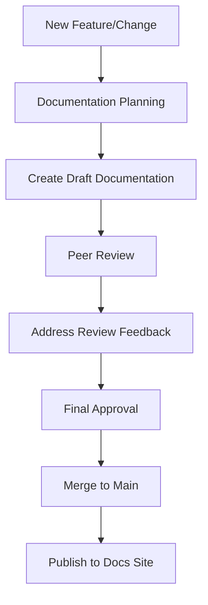

# 📚 BioETL Documentation Governance Framework

## 🎯 Purpose

This framework establishes the governance model, quality standards, and maintenance processes for BioETL project documentation. It ensures that documentation remains **accurate, discoverable, maintainable, and aligned** with the evolving codebase and architectural decisions.

## 📋 Governance Principles

### 1. Documentation as Code

- Documentation is treated with the same rigor as source code
- Subject to version control, peer review, and CI/CD quality gates
- Follows semantic versioning where applicable

### 2. Single Source of Truth

- Canonical documentation lives in `docs/00-05/` sections
- Generated artifacts are non-normative
- Legacy content is clearly marked and maintained separately

### 3. Quality Over Quantity

- Prefer accurate, maintained documentation over comprehensive but outdated content
- Regular pruning of obsolete material
- Quality metrics and enforcement

### 4. Discoverability First

- Clear navigation and search optimization
- Cross-referencing and contextual linking
- Audience-appropriate organization

### 5. Continuous Improvement

- Regular documentation reviews
- Feedback-driven updates
- Metrics-based maintenance

## 👥 Roles and Responsibilities

### Documentation Working Group (DWG)

**Responsibility**: Overall documentation strategy and governance
**Members**: Architecture lead, tech lead, documentation champion, quality engineer

**Responsibilities**:

- Approve governance changes
- Prioritize documentation initiatives
- Resolve cross-cutting documentation issues
- Quarterly documentation health reviews

### Documentation Owners

**Responsibility**: Content quality and maintenance for specific areas

| Area              | Owner             | Responsibilities                             |
| ----------------- | ----------------- | -------------------------------------------- |
| **Architecture**  | Architecture Team | ADRs, design decisions, component diagrams   |
| **Pipelines**     | Pipeline Team     | Pipeline specs, configuration, data flow     |
| **Data Quality**  | DQ Team           | Contracts, validation rules, quality metrics |
| **API/Contracts** | Integration Team  | API documentation, contract surfaces         |
| **Operations**    | DevOps Team       | Deployment, monitoring, operational guides   |
| **Development**   | Engineering Team  | Contribution guides, coding standards        |

### Contributors

**Responsibility**: Follow documentation standards and processes

**Expectations**:

- Update documentation with code changes
- Follow templates and style guides
- Participate in documentation reviews
- Report documentation issues

### Reviewers

**Responsibility**: Ensure documentation quality through review process

**Review Criteria**:

- ✅ Accuracy and completeness
- ✅ Clarity and readability
- ✅ Proper cross-referencing
- ✅ Adherence to templates
- ✅ Appropriate audience level

## 📋 Documentation Lifecycle

### Creation Process



### Update Process

1. **Identify Need**: Code change, bug fix, or improvement
1. **Create PR**: Include documentation updates with code changes
1. **Review**: Documentation owner + peer review
1. **Approve**: Documentation lead sign-off
1. **Merge**: Automated publishing trigger

### Deprecation Process

1. **Mark as Legacy**: Add deprecation notice
1. **Redirect**: Implement redirect if applicable
1. **Archive**: Move to `docs/99-archive/` after 2 releases
1. **Remove**: Delete after 1 year in archive (with notice)

## 🏗️ Documentation Standards

### File Organization

```
docs/
├── 00-project/          # Project overview, governance, roadmap
├── 01-requirements/      # Functional/non-functional requirements
├── 02-architecture/      # Architecture decisions, components, patterns
├── 03-guides/           # User guides, tutorials, how-tos
├── 04-reference/        # API docs, contracts, technical reference
├── 05-operations/       # Deployment, monitoring, operations
├── 99-archive/          # Legacy documentation (non-normative)
└── plans/               # Working plans (repo-only)
```

### Naming Conventions

- **Files**: `kebab-case.md` (e.g., `data-quality-contracts.md`)
- **Directories**: `kebab-case/` (e.g., `data-quality/`)
- **ADRs**: `ADR-XXX-title.md` (e.g., `ADR-001-delta-lake-strategy.md`)
- **Templates**: `template-type-template.md` (e.g., `pipeline-spec-template.md`)

### Content Standards

#### **Markdown Format**

- Use standard Markdown with GitHub Flavored Markdown extensions
- Prefer ATX headers (`# Header`) over Setext (`Header =====`)
- Use fenced code blocks with language specification
- Limit line length to 120 characters where practical

#### **Front Matter**

```yaml
---
title: Document Title
description: Brief description of document purpose
audience: developers/architects/operators/users
status: active/legacy/deprecated
date: YYYY-MM-DD
owner: team/individual
---
```

#### **Header Structure**

```markdown
# Main Title (H1 - one per file)

## Section (H2)

### Subsection (H3)

#### Detail (H4 - use sparingly)
```

#### **Cross-Referencing**

- Use relative links: `[text](../path/to/file.md)`
- Reference specific sections: `[text](../path/to/file.md#section)`
- For external links, include title attributes

#### **Code Examples**

- Use fenced code blocks with language tags
- Include comments explaining non-obvious parts
- Show complete, runnable examples where possible
- Note version requirements if applicable

#### **Diagrams**

- Prefer Mermaid.js for simple diagrams
- Use PlantUML for complex architecture diagrams
- Store source in markdown files
- Generate PNG/SVG artifacts in CI

## 🔧 Quality Gates

### Documentation Parity Gate

**Purpose**: Ensure documentation stays in sync with code/configuration

**Implementation**:

- CI/CD check on PRs and main branch
- Validates config vs. documentation parity
- Blocks merges if critical discrepancies found

**Thresholds**:

- **Warning**: \<95% parity
- **Error**: \<90% parity
- **Block**: \<85% parity or missing critical docs

### Link Validation Gate

**Purpose**: Prevent broken links in published documentation

**Implementation**:

- `scripts/check_doc_links.py` enhanced
- Runs on PRs and scheduled basis
- Generates quality report

**Thresholds**:

- **Warning**: >1% broken links
- **Error**: >3% broken links
- **Block**: >5% broken links or critical path breaks

### Style and Linting Gate

**Purpose**: Enforce consistent documentation style

**Implementation**:

- Markdown linting (markdownlint)
- Custom style checks
- Spell checking

**Thresholds**:

- **Warning**: Style issues
- **Error**: Readability issues
- **Block**: Critical formatting errors

## 📊 Quality Metrics

### Core Metrics

| Metric           | Target      | Measurement                 | Frequency |
| ---------------- | ----------- | --------------------------- | --------- |
| **Coverage**     | 95%         | Docs vs. code/config parity | Weekly    |
| **Freshness**    | \<30 days   | Last update age             | Daily     |
| **Link Quality** | \<1% broken | Broken link percentage      | Daily     |
| **Findability**  | >90%        | Search success rate         | Monthly   |
| **Completeness** | 100%        | Required docs present       | Weekly    |

### Reporting

**Documentation Quality Dashboard**:

- Published at `docs/reports/docs-quality-report.md`
- Updated weekly
- Includes trends and action items

**CI/CD Reports**:

- PR comments with documentation status
- Build artifacts with detailed metrics
- Historical data for trend analysis

## 🛠️ Maintenance Processes

### Regular Reviews

| Review Type              | Frequency  | Scope                              | Owner             |
| ------------------------ | ---------- | ---------------------------------- | ----------------- |
| **Documentation Health** | Quarterly  | Overall quality and coverage       | DWG               |
| **ADR Review**           | Bi-annual  | Architecture decision relevance    | Architecture Team |
| **Pipeline Specs**       | Monthly    | Configuration documentation parity | Pipeline Team     |
| **API Contracts**        | Monthly    | Contract surface accuracy          | Integration Team  |
| **User Feedback**        | Continuous | Usability and findability          | All Teams         |

### Update Cadence

| Content Type       | Update Frequency         | Review Frequency |
| ------------------ | ------------------------ | ---------------- |
| **API Contracts**  | With every change        | Weekly           |
| **Pipeline Specs** | With every change        | Weekly           |
| **ADRs**           | As needed                | Quarterly        |
| **User Guides**    | Monthly or as needed     | Quarterly        |
| **Architecture**   | With significant changes | Quarterly        |
| **Reference**      | With every release       | Bi-annual        |

### Deprecation Schedule

| Stage        | Duration         | Actions                           |
| ------------ | ---------------- | --------------------------------- |
| **Current**  | Until superseded | Normal maintenance                |
| **Legacy**   | 2 releases       | Deprecation notices, redirects    |
| **Archived** | 1 year           | Moved to `99-archive/`, read-only |
| **Removed**  | After 1 year     | Deleted from repository           |

## 📋 Documentation Change Control

### Change Classification

| Class        | Description                                   | Process                          |
| ------------ | --------------------------------------------- | -------------------------------- |
| **Minor**    | Typo fixes, formatting, minor clarifications  | Direct commit                    |
| **Standard** | Content updates, new sections, normal changes | PR with 1 review                 |
| **Major**    | New documents, structural changes, ADRs       | PR with 2 reviews + DWG approval |
| **Critical** | Governance changes, navigation restructuring  | RFC process + DWG approval       |

### RFC Process (for Critical Changes)

1. **Proposal**: Create RFC document in `docs/plans/`
1. **Review Period**: 2-week comment period
1. **DWG Review**: Working group discussion
1. **Decision**: Approve/reject/modify
1. **Implementation**: PR with changes
1. **Announcement**: Communicate changes to stakeholders

## 🔗 Cross-Cutting Concerns

### Documentation and Code Parity

- **Principle**: Documentation should evolve with code
- **Process**: Documentation updates included in same PR as code changes
- **Exception**: Separate PRs allowed for extensive documentation work

### ADR Management

- **Creation**: RFC process for new architectural decisions
- **Status Tracking**: Active, superseded, deprecated, archived
- **Cross-Referencing**: ADRs linked from relevant documentation
- **Registry**: Central ADR index with metadata

### Legacy Content Management

- **Identification**: Content no longer reflecting current state
- **Handling**: Deprecation notices, redirects, or archival
- **Discovery**: Prevent legacy content from appearing in search results
- **Maintenance**: Minimal updates to legacy content

## 📋 Tools and Automation

### Documentation Toolchain

| Tool                     | Purpose                     | Configuration        |
| ------------------------ | --------------------------- | -------------------- |
| **MkDocs**               | Static site generation      | `mkdocs.yml`         |
| **Material for MkDocs**  | Theme and navigation        | `mkdocs.yml`         |
| **markdownlint**         | Markdown style checking     | `.markdownlint.json` |
| **check_doc_links.py**   | Link validation             | Custom script        |
| **docs_parity_check.py** | Config/documentation parity | Custom script        |
| **GitHub Actions**       | CI/CD pipelines             | `.github/workflows/` |

### Automation Scripts

**Required Scripts**:

1. `scripts/check_doc_links.py` - Link validation
1. `scripts/docs_parity_check.py` - Configuration parity
1. `scripts/generate_adr_registry.py` - ADR metadata generation
1. `scripts/docs_quality_report.py` - Quality metrics reporting

`check_doc_links.py` is the active published-docs integrity gate. When invoked
with `--report-json docs/reports/docs-link-check-report.json`, it emits the
stable repo-only link-quality report used for local reproduction and CI
artifacts. Exit code `0` means the selected checks passed; exit code `1` means
violations were found and the docs change must not be treated as clean.

## 📋 Compliance and Enforcement

### Documentation Requirements by PR Type

| PR Type                  | Documentation Required                         | Review Level |
| ------------------------ | ---------------------------------------------- | ------------ |
| **New Feature**          | Full documentation (user guide, API, examples) | Standard     |
| **Bug Fix**              | Update affected documentation                  | Light        |
| **Configuration Change** | Update specs and reference                     | Standard     |
| **Architecture Change**  | ADR + affected documentation                   | Major        |
| **Dependency Update**    | Update compatibility notes                     | Light        |
| **Refactoring**          | Update all references                          | Standard     |

### Enforcement Mechanisms

1. **CI/CD Gates**: Block merges for documentation violations
1. **PR Templates**: Documentation checklist for contributors
1. **Automated Reminders**: Bot comments for missing documentation
1. **Quality Reports**: Visibility into documentation health
1. **Governance Reviews**: Regular compliance audits

## 📋 Onboarding and Training

### New Contributor Onboarding

- **Documentation Tour**: Overview of structure and standards
- **Style Guide**: Markdown and content guidelines
- **Tool Setup**: Local documentation environment
- **Review Process**: How documentation changes are approved

### Team Training

- **Quarterly Workshops**: Advanced documentation techniques
- **Tool Training**: New tools and automation
- **Best Practices**: Documentation patterns and anti-patterns
- **Governance Updates**: Changes to processes and standards

## 📋 Continuous Improvement

### Feedback Channels

- **GitHub Issues**: Label `docs` for documentation issues
- **PR Comments**: Documentation-specific feedback
- **User Surveys**: Quarterly documentation satisfaction
- **Analytics**: Search patterns and page views

### Improvement Process

1. **Identify**: Gather feedback and metrics
1. **Analyze**: Root cause analysis
1. **Propose**: Create improvement plan
1. **Implement**: Execute changes
1. **Measure**: Track impact of improvements
1. **Iterate**: Continuous refinement

## 📋 Appendix

### Glossary

- **ADR**: Architecture Decision Record
- **DWG**: Documentation Working Group
- **DQ**: Data Quality
- **Parity**: Equivalence between code/config and documentation
- **Canonical**: Authoritative, primary source
- **Normative**: Content that defines requirements
- **Informative**: Content that provides guidance

### References

- **Governance**: `D-01 Governance & Style Guide.md`
- **ADR Template**: `04-reference/templates/adr-template.md`
- **Pipeline Spec Template**: `04-reference/templates/pipeline-spec-template.md`
- **Contract Spec Template**: `04-reference/templates/contract-spec-template.md`

### Change History

| Version | Date       | Changes                        | Author                      |
| ------- | ---------- | ------------------------------ | --------------------------- |
| 1.0     | 2024-04-23 | Initial governance framework   | Documentation Working Group |
| 1.1     | 2024-04-30 | Added quality gates section    | Quality Team                |
| 1.2     | 2024-05-15 | Enhanced maintenance processes | Operations Team             |

______________________________________________________________________

**Status**: Active ✅
**Owner**: Documentation Working Group
**Last Reviewed**: 2024-04-23
**Next Review**: 2024-07-23
