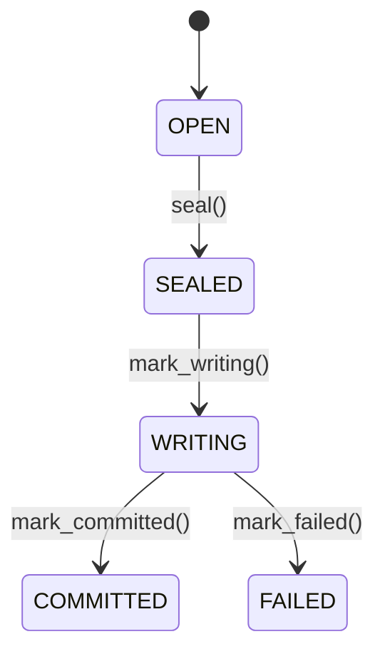
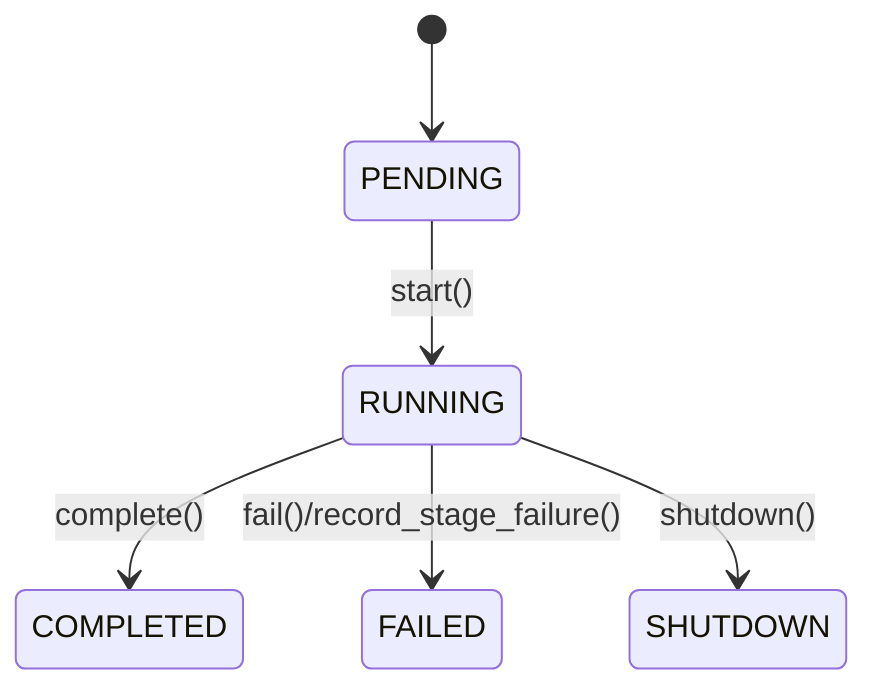
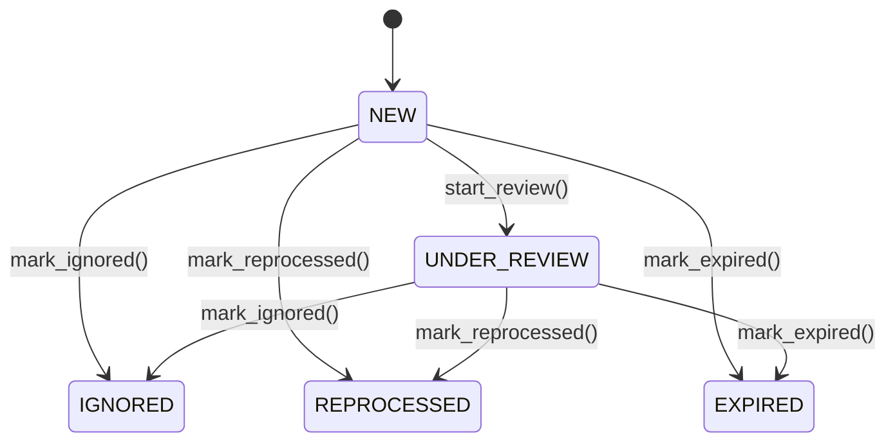

______________________________________________________________________

Version: 1.0.0
Status: active
Class: published
Owner: BioETL Team
Reviewers:

- BioETL Team
  Last verified: '2026-03-29'

______________________________________________________________________

# Слой Domain (Домен)

**Расположение:** `src/bioetl/domain/`

## 1. Назначение

Слой `Domain` содержит чистую предметную логику BioETL: доменные сущности, value objects, агрегаты, доменные события,
контракты портов и правила валидации. В BioETL это не только "business-only" слой: он также является sanctioned owner
для чистых cross-layer contracts и детерминированных runtime context primitives. Слой не должен зависеть от
`application`, `infrastructure` и `interfaces`.

Ключевые характеристики:

- Чистота: без I/O и без инфраструктурных зависимостей.
- Консистентность: инварианты удерживаются внутри aggregate boundaries.
- Типобезопасность: значения и идентификаторы выражены через отдельные типы и value objects.

## 2. Актуальная Спецификация (2026-03-24)

### 2.1. Порты (`ports/`)

`src/bioetl/domain/ports/` содержит `Protocol`-контракты для Ports & Adapters:

Сейчас пакет включает **17 top-level Python modules** в `domain/ports` (включая
фасадный `__init__.py`), и это число синхронизируется архитектурным тестом
`test_ports_count_matches_docs`.

- источники и хранение (`DataSourcePort`, `PipelineStorageProtocol`, `CheckpointPort`, `LockPort`);
- observability (`LoggerPort`, `MetricsPort`, `TracingPort`, `DQMonitorPort`);
- качество данных (`BronzeDQAnalyzerPort`, `SilverDQAnalyzerPort`, `GoldDQAnalyzerPort`, валидаторы, quarantine/report);
- runtime/resilience (`RunnerFactoryPort`, `PipelineFactoryPort`, `ExecutionObservabilityPort`, `RunnablePort`, `RateLimiterPort`, `CircuitBreakerPort`);
- NoOp реализации для опциональных зависимостей.

Runtime-oriented порты намеренно остаются в `domain.ports`: это допустимо, потому что они выражают чистые абстракции
межслойного контракта, а не concrete infrastructure behavior. Правило слоя звучит как "в domain нельзя тянуть I/O и
конкретные adapter/framework dependencies", а не как "в domain нельзя описывать runtime contracts".

После `RF-022` runtime factory contracts дополнительно очищены от outer-layer
semantics: `PipelineFactoryPort` выражается через `SettingsPort`,
`PipelineYamlConfigPort` и `ExecutionObservabilityPort`, а не через concrete
composition/runtime bundle types.

Правило импорта:

```python
# ✅ из фасада
from bioetl.domain.ports import BronzeStoragePort, SilverStoragePort, GoldStoragePort, LockPort

# ❌ из внутренних модулей
from bioetl.domain.ports.storage import BronzeStoragePort
```

Проверка выполняется архитектурным тестом `test_ports_imported_only_from_facade`.

Фасад `bioetl.domain.ports` остаётся единственной sanctioned import surface для всех first-party слоёв. Это снижает
навигационную стоимость, не раскрывает internal port modules наружу и делает policy вокруг runtime/resilience ports
явной и стабильной.

### 2.2. DDD Aggregates (`aggregates/`)

`src/bioetl/domain/aggregates/` реализует публичные фасады агрегатов и приватные split-модули (`_*.py`) для жизненных циклов,
инвариантов и read-model логики.

Публичные точки входа:

- `batch.py` -> `Batch`, `BatchRecord`, `BatchStatus`
- `pipeline_run.py` -> `PipelineRun`, `PipelineRunState`, `StageResult`, `StageStatus`
- `quarantine_entry.py` -> `QuarantineEntry`, `QuarantineStatus`, `ResolutionInfo`
- `events.py` -> каталог доменных событий

#### 2.2.1. Таблица агрегатов

| Aggregate         | Root              | Children (VO/Entity)                                  | Инварианты                                                                                                                                                                    | State machine                                                                       |
| ----------------- | ----------------- | ----------------------------------------------------- | ----------------------------------------------------------------------------------------------------------------------------------------------------------------------------- | ----------------------------------------------------------------------------------- |
| `Batch`           | `Batch`           | `BatchRecord` (VO), `BatchStatus`                     | `start_index >= 0`; запись/карантин только в `OPEN`; переходы только `OPEN -> SEALED -> WRITING -> COMMITTED/FAILED`                                                          | `OPEN -> SEALED -> WRITING -> COMMITTED/FAILED`                                     |
| `PipelineRun`     | `PipelineRun`     | `StageResult` (VO), `PipelineRunState`, `StageStatus` | запуск только из `PENDING`; завершение только при наличии стадий и отсутствии `FAILED`; после terminal состояния переходы запрещены                                           | `PENDING -> RUNNING -> COMPLETED/FAILED/SHUTDOWN`                                   |
| `QuarantineEntry` | `QuarantineEntry` | `ResolutionInfo` (VO), `QuarantineStatus`             | обязательны `entry_id`, `pipeline_name`, `error_code`, `payload`, `payload_hash`; resolve разрешён только из `NEW/UNDER_REVIEW`; `new_record_id` обязателен для `REPROCESSED` | `NEW -> UNDER_REVIEW -> IGNORED/REPROCESSED`, а также `NEW/UNDER_REVIEW -> EXPIRED` |

#### 2.2.2. Машины состояний







#### 2.2.3. Доменные события

Каталог событий (`events.py`):

- Pipeline: `PipelineCompleted`, `PipelineFailed`, `PipelineShutdown`
- Batch: `BatchCreated`, `BatchSealed`, `BatchWritten`, `BatchFailed`, `RecordQuarantined`
- Quarantine: `QuarantineEntryCreated`, `QuarantineEntryResolved`

### 2.3. Сущности и Bounded Contexts (`entities/`)

В текущей реализации можно выделить следующие bounded contexts (тактический уровень):

- Pipeline Lifecycle: выполнение пайплайна и стадий (`PipelineRun` aggregate).
- Batch Lifecycle: пакетная обработка и запись (`Batch` aggregate).
- Quarantine Management: триаж/разрешение невалидных записей (`QuarantineEntry` aggregate).
- Publication Metadata: унифицированная модель публикаций для OpenAlex/CrossRef/PubMed/Semantic Scholar (`PublicationEntityBase` и provider-specific entities).
- Protein & Mapping: белковые записи и ID-mapping (`UniprotTarget`, `IDMappingResult`).

### 2.4. Value Objects (`value_objects/`)

`src/bioetl/domain/value_objects/` содержит неизменяемые доменные примитивы с валидацией. Ключевые идентификаторы
публикаций и белков:

| Value object        | Минимальные правила валидации                                |
| ------------------- | ------------------------------------------------------------ |
| `DOI`               | `10.<digits>/<suffix>`, удаление `doi.org`/`doi:`, lowercase |
| `PubMedId`          | только цифры, `> 0`, ограничение верхней границы             |
| `OpenAlexId`        | формат `W<digits>`, поддержка URL-входа                      |
| `SemanticScholarId` | ровно 40 hex-символов                                        |
| `ISSN`              | формат `NNNN-NNNN` (check-digit может быть `X`)              |
| `ORCID`             | формат `NNNN-NNNN-NNNN-NNNX`, поддержка URL-входа            |
| `UniProtId`         | паттерны accession UniProt, длина 6 или 10                   |
| `ChemblId`          | `CHEMBL<number>`, нормализация регистра и числа              |
| `PubChemCid`        | положительный целочисленный CID                              |

Дополнительно: activity/chemical/molecular/DQ/result value objects, а также объекты для field groups и run context.

#### 2.4.1. Sanctioned public entrypoints для domain фасадов

Для текущего compatibility-governance цикла следующие domain entrypoints считаются
санкционированными стабильными публичными import paths:

- `bioetl.domain.composite.config`
- `bioetl.domain.value_objects.activity_values`

Split internal modules остаются implementation detail owner packages и не являются
рекомендуемыми import path для нового first-party кода.
Текущий lifecycle/status этих фасадов ведётся в
[Compatibility Facade Inventory](07-compatibility-facade-inventory.md).

### 2.5. Пользовательские типы (`types/`)

`src/bioetl/domain/types/` содержит типизированные идентификаторы и alias-ы, используемые агрегатами и сущностями:
`RunID`, `BatchID`, `EntityID`, `ContentHash`, `RunType`, `MetaDict`, `JsonDict` и другие.

### 2.5.1. Runtime Context (`context.py`)

`src/bioetl/domain/context.py` содержит runtime execution contexts и связанные
domain-level context objects.

В текущей архитектуре execution model намеренно разделён на два разных
контракта:

- `PipelineRunContext` — launch/execution descriptor верхнего уровня; он
  несёт параметры запуска, rollout/resume flags, identity anchors и
  launch-time overrides, которые нужны composition/runtime assembly до старта
  runner-а;
- `PipelineContext` — in-run processing context; он несёт `run_id`,
  `run_type`, `LoggerPort` и детерминированный `started_at` для record, batch,
  write и post-write flows после завершения launch-time assembly.

`PipelineContext` остаётся нормативным domain-level processing context:

- `started_at` — единый детерминированный источник времени для batch и writer flows по ADR-014;
- `logger` хранится как `LoggerPort`, то есть как чистая абстракция, а не как привязка к `structlog`;
- `bind_logger()` остаётся частью того же контекста, потому что он распространяет execution metadata через порт,
  не вводя concrete logging dependency в domain.

Следовательно, `PipelineContext` не считается infrastructure leakage. Concrete logger implementation по-прежнему
создаётся вне domain и внедряется через composition/infrastructure, а domain удерживает только value semantics и
portable execution context contract.

`src/bioetl/domain/control_plane/run_manifest.py` решает другую задачу.
`domain.control_plane.RunManifest` — это immutable provenance/control-plane
artifact, который фиксирует, что именно было запущено и с какими
reproducibility anchors. Он не заменяет `PipelineRunContext` или
`PipelineContext` как runtime descriptor.

Соответственно, проект не использует модель “один universal manifest на всё”.
Отдельный minimal `value_objects.RunManifest` больше не входит в активную
domain surface. Runtime execution остаётся на `PipelineRunContext` и
`PipelineContext`, а provenance/control-plane — на
`domain.control_plane.RunManifest`.

### 2.6. Доменные сервисы (`services/`)

`src/bioetl/domain/behavior/` содержит чистые доменные сервисы без I/O, например:

- `EntityIdentityGenerator` (детерминированные `entity_id`/`content_hash`),
- нормализация DOI/PMID/текста/дат,
- вычисление и сериализация DQ-метрик,
- классификация и валидация доменных значений.

### 2.7. Конфигурационные модели (`config/`)

- `src/bioetl/domain/config/` — канонический пакет dataclass-конфигов доменного уровня.
- Документация domain-слоя должна ссылаться только на физически существующие import surfaces; исторические compatibility shims не описываются как отдельный живой package family, если соответствующий каталог больше не существует.

### 2.8. Дополнительные поддиректории

Помимо перечисленных выше, domain-слой включает:

- `composite/`
- `contracts/`
- `control_plane/`
- `exceptions/`
- `filtering/`
- `lineage/`
- `mapping/`
- `models/`
- `registry/`
- `schemas/`
- `transformations/`
- `types/`
- `validation/`

## 3. Глобальные Инварианты Слоя

- Domain не выполняет I/O и не импортирует infrastructure/application/interfaces.
- Между агрегатами взаимодействие строится через идентификаторы и доменные события, а не через инфраструктурные зависимости.
- Value objects валидируют и нормализуют данные при создании.
- Состояние агрегатов изменяется только через явные transition-методы.

## 4. Связанные Материалы

### Навигация по Слоям

| \<- Предыдущий | Текущий    | Следующий ->                                 |
| -------------- | ---------- | -------------------------------------------- |
| -              | **Domain** | [Application Layer](02-application-layer.md) |

### Связанные диаграммы

| Диаграмма            | Файл                                                                                           | Описание                    |
| -------------------- | ---------------------------------------------------------------------------------------------- | --------------------------- |
| Domain Layer Classes | [04-domain-layer-class-diagram.mermaid](diagrams/foundation/04-domain-layer-class-diagram.mmd) | Порты, сущности, типы       |
| Domain DDD           | [08-domain-ddd.mermaid](diagrams/foundation/08-domain-ddd.mmd)                                 | Агрегаты и доменные события |
| Domain Models        | [13-domain-models-relationship.mermaid](diagrams/foundation/13-domain-models-relationship.mmd) | Связи доменных моделей      |
| Ports Architecture   | [26-hexagonal-ports-adapters.mermaid](diagrams/foundation/26-hexagonal-ports-adapters.mmd)     | Карта портов и адаптеров    |

### Связанные ADR

| ADR                                                        | Тема                          |
| ---------------------------------------------------------- | ----------------------------- |
| [ADR-004](decisions/ADR-004-pydantic-vs-dataclasses.md)    | Dataclasses/Pydantic в домене |
| [ADR-014](decisions/ADR-014-deterministic-writes.md)       | Детерминизм пайплайнов        |
| [ADR-017](decisions/ADR-017-observability-architecture.md) | Observability source of truth |
| [ADR-021](decisions/ADR-021-ddd-aggregates-adoption.md)    | Внедрение DDD-агрегатов       |

### Смежные разделы документации

- [RULES.md §1 "Архитектура и слои"](../00-project/RULES.md)
- [API Reference: Domain](../04-reference/api/domain.md)
- [Glossary](../00-project/glossary.md)
