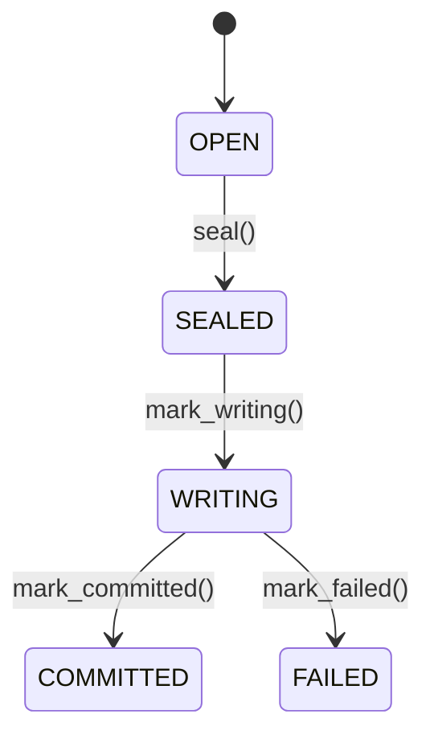
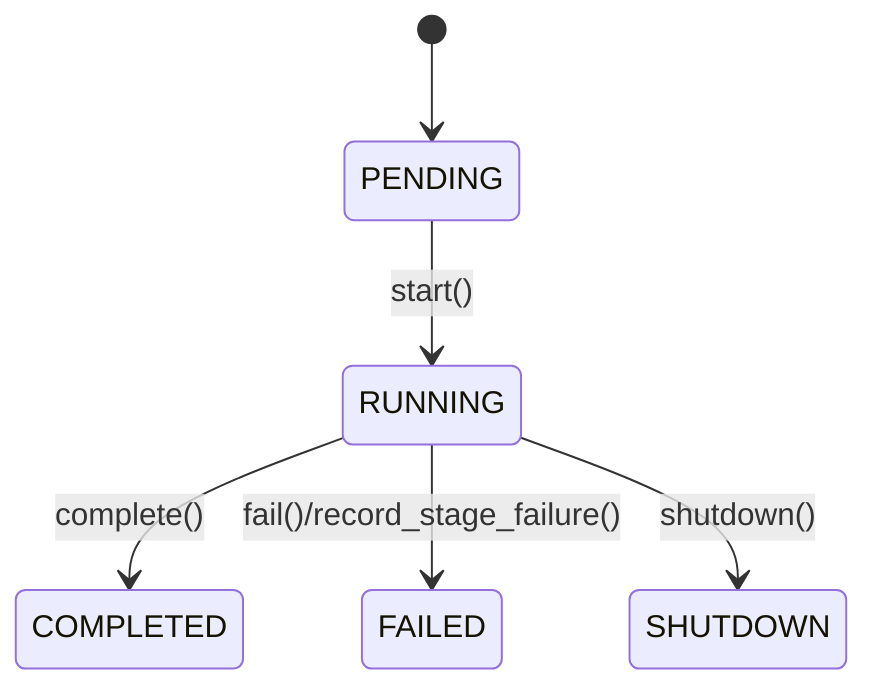
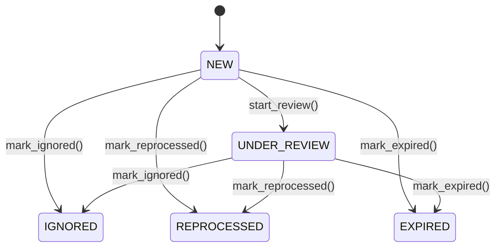

______________________________________________________________________

Version: 1.0.0
Status: active
Class: published
Owner: BioETL Team
Reviewers:

- BioETL Team
  Last verified: '2026-03-29'

______________________________________________________________________

# Слой Domain (Домен)

**Расположение:** `src/bioetl/domain/`

## 1. Назначение

Слой `Domain` содержит чистую предметную логику BioETL: доменные сущности, value objects, агрегаты, доменные события,
контракты портов и правила валидации. В BioETL это не только "business-only" слой: он также является sanctioned owner
для чистых cross-layer contracts и детерминированных runtime context primitives. Слой не должен зависеть от
`application`, `infrastructure` и `interfaces`.

### Published reference routing

- Эта архитектурная страница остаётся объяснением структуры и rationale.
- Canonical published catalog для live domain surfaces теперь находится в
  [`../04-reference/domain/README.md`](../04-reference/domain/README.md).
- `src/bioetl/domain/README.md` следует трактовать как `code-navigation-only`
  package map, а не как operator/reference source of truth.

### Aggregate invariants and lifecycle

Для canonical документации инвариантов и state machine агрегатов:
- [Aggregate Invariants](domain/aggregate-invariants.md) - Architecture-level FSM diagrams and invariants
- [Domain Invariants (Reference)](../04-reference/domain/invariants.md) - Detailed invariants with examples
- [Aggregate State Machines](../04-reference/domain/aggregate-state-machines.md) - Formal FSM transition tables
- [Aggregates Overview](../04-reference/domain/aggregates.md) - Aggregate boundaries and responsibilities

Ключевые характеристики:

- Чистота: без I/O и без инфраструктурных зависимостей.
- Консистентность: инварианты удерживаются внутри aggregate boundaries.
- Типобезопасность: значения и идентификаторы выражены через отдельные типы и value objects.

## 2. Актуальная Спецификация (2026-03-24)

### 2.1. Порты (`ports/`)

`src/bioetl/domain/ports/` содержит `Protocol`-контракты для Ports & Adapters:

Сейчас пакет включает **82+ port interfaces** в `domain/ports` во вложенной структуре
(включая фасадный `__init__.py`):

- config/ (3 порта)
- control_plane/ (8 портов)
- metadata/ (5 портов)
- observability/ (8 портов)
- quality/ (13 портов)
- runtime/ (18 портов, плюс memory/ и runner/ подпакеты)
- storage/ (7 портов)

Это число синхронизируется архитектурным тестом `test_ports_count_matches_docs`.

- источники, хранение и runtime-контроль (`DataSourcePort`,
  `BronzeStoragePort`, `SilverStoragePort`, `GoldStoragePort`,
  `MergedStoragePort`, `CheckpointPort`, `LockPort`);
- observability (`LoggerPort`, `MetricsPort`, `TracingPort`, `DQMonitorPort`);
- качество данных (`BronzeDQAnalyzerPort`, `SilverDQAnalyzerPort`, `GoldDQAnalyzerPort`, валидаторы, quarantine/report);
- runtime/resilience (`RunnerFactoryPort`, `PipelineFactoryPort`, `ExecutionObservabilityPort`, `RunnablePort`, `RateLimiterPort`, `CircuitBreakerPort`);
- NoOp реализации для опциональных зависимостей.

Runtime-oriented порты намеренно остаются в `domain.ports`: это допустимо, потому что они выражают чистые абстракции
межслойного контракта, а не concrete infrastructure behavior. Правило слоя звучит как "в domain нельзя тянуть I/O и
конкретные adapter/framework dependencies", а не как "в domain нельзя описывать runtime contracts".

`PipelineStorageProtocol` не является domain port. Это application-owned
aggregate protocol в
`src/bioetl/application/core/pipeline_runtime_service_protocols.py`, который
комбинирует narrow domain storage ports для DI bundle одного pipeline run.

После `RF-022` runtime factory contracts дополнительно очищены от outer-layer
semantics: `PipelineFactoryPort` выражается через `SettingsPort`,
`PipelineYamlConfigPort` и `ExecutionObservabilityPort`, а не через concrete
composition/runtime bundle types.

Правило импорта:

```python
# ✅ из фасада
from bioetl.domain.ports import BronzeStoragePort, SilverStoragePort, GoldStoragePort, LockPort

# ❌ из внутренних модулей
from bioetl.domain.ports.storage import BronzeStoragePort
```

Проверка выполняется архитектурным тестом `test_ports_imported_only_from_facade`.

Фасад `bioetl.domain.ports` остаётся единственной sanctioned import surface для всех first-party слоёв. Это снижает
навигационную стоимость, не раскрывает internal port modules наружу и делает policy вокруг runtime/resilience ports
явной и стабильной.

### 2.2. DDD Aggregates (`aggregates/`)

`src/bioetl/domain/aggregates/` реализует публичные фасады агрегатов и приватные split-модули (`_*.py`) для жизненных циклов,
инвариантов и read-model логики.

Публичные точки входа:

- `batch.py` -> `Batch`, `BatchRecord`, `BatchStatus`
- `pipeline_run.py` -> `PipelineRun`, `PipelineRunState`, `StageResult`, `StageStatus`
- `quarantine_entry.py` -> `QuarantineEntry`, `QuarantineStatus`, `ResolutionInfo`
- `events.py` -> каталог доменных событий

#### 2.2.1. Таблица агрегатов

| Aggregate         | Root              | Children (VO/Entity)                                  | Инварианты                                                                                                                                                                    | State machine                                                                       |
| ----------------- | ----------------- | ----------------------------------------------------- | ----------------------------------------------------------------------------------------------------------------------------------------------------------------------------- | ----------------------------------------------------------------------------------- |
| `Batch`           | `Batch`           | `BatchRecord` (VO), `BatchStatus`                     | `start_index >= 0`; запись/карантин только в `OPEN`; переходы только `OPEN -> SEALED -> WRITING -> COMMITTED/FAILED`                                                          | `OPEN -> SEALED -> WRITING -> COMMITTED/FAILED`                                     |
| `PipelineRun`     | `PipelineRun`     | `StageResult` (VO), `PipelineRunState`, `StageStatus` | запуск только из `PENDING`; завершение только при наличии стадий и отсутствии `FAILED`; после terminal состояния переходы запрещены                                           | `PENDING -> RUNNING -> COMPLETED/FAILED/SHUTDOWN`                                   |
| `QuarantineEntry` | `QuarantineEntry` | `ResolutionInfo` (VO), `QuarantineStatus`             | обязательны `entry_id`, `pipeline_name`, `error_code`, `payload`, `payload_hash`; resolve разрешён только из `NEW/UNDER_REVIEW`; `new_record_id` обязателен для `REPROCESSED` | `NEW -> UNDER_REVIEW -> IGNORED/REPROCESSED`, а также `NEW/UNDER_REVIEW -> EXPIRED` |

#### 2.2.2. Машины состояний

##### 2.2.2.1. Batch Aggregate State Machine

**Реализация:** `src/bioetl/domain/aggregates/_batch_lifecycle.py`



##### 2.2.2.2. PipelineRun Aggregate State Machine

**Реализация:** `src/bioetl/domain/aggregates/_pipeline_run_mixins.py`



##### 2.2.2.3. QuarantineEntry Aggregate State Machine

**Реализация:** `src/bioetl/domain/aggregates/_quarantine_entry_transitions_mixin.py`



#### 2.2.4. Дополнительные Domain Value Objects и Enums

##### 2.2.4.1. StageResult

**Файл:** `src/bioetl/domain/aggregates/pipeline_run_stage_result.py`

**Назначение:** Immutable value object, представляющий результат выполнения отдельной стадии pipeline.

**Атрибуты:**
- `stage`: Название стадии (например, "preflight", "execution", "postrun")
- `status`: Статус выполнения (`StageStatus`)
- `started_at`: Время начала выполнения
- `completed_at`: Время завершения (для статусов `SUCCESS`/`FAILED`)
- `error`: Сообщение об ошибке (если статус `FAILED`)
- `error_type`: Тип ошибки (если статус `FAILED`)
- `result`: Результат выполнения (payload)
- `records_processed`: Количество обработанных записей

**Инварианты:**
- Название стадии не может быть пустым
- Failed стадия должна иметь сообщение об ошибке
- Completed/Failed стадии должны иметь `completed_at` timestamp
- `records_processed` не может быть отрицательным

**Связь с PipelineRun:** `PipelineRun` содержит коллекцию `StageResult` для отслеживания прогресса по стадиям.

##### 2.2.4.2. StageStatus

**Файл:** `src/bioetl/domain/aggregates/pipeline_run_state.py`

**Назначение:** Enum, определяющий статус отдельной стадии pipeline.

**Значения:**
- `PENDING`: Стадия ожидает выполнения
- `RUNNING`: Стадия выполняется
- `SUCCESS`: Стадия успешно завершена
- `FAILED`: Стадия завершилась с ошибкой
- `SKIPPED`: Стадия была пропущена

##### 2.2.4.3. PipelineRunState

**Файл:** `src/bioetl/domain/aggregates/pipeline_run_state.py`

**Назначение:** Enum, определяющий жизненный цикл pipeline run (текущее состояние во время выполнения).

**Значения:**
- `PENDING`: Pipeline ожидает запуска
- `RUNNING`: Pipeline выполняется
- `COMPLETED`: Pipeline успешно завершён
- `FAILED`: Pipeline завершился с ошибкой
- `SHUTDOWN`: Pipeline был остановлен

**Методы:**
- `is_terminal()`: Возвращает `True` если состояние терминальное (COMPLETED/FAILED/SHUTDOWN)

**Отличие от PipelineRunResult:** `PipelineRunState` отслеживает *текущее состояние* во время выполнения, в то время как `PipelineRunResult` (из application.services) представляет финальный результат завершения.

#### 2.2.5. Доменные события

Каталог событий (`events.py`):

- Pipeline: `PipelineCompleted`, `PipelineFailed`, `PipelineShutdown`
- Batch: `BatchCreated`, `BatchSealed`, `BatchWritten`, `BatchFailed`, `RecordQuarantined`
- Quarantine: `QuarantineEntryCreated`, `QuarantineEntryResolved`

### 2.3. Сущности и Bounded Contexts (`entities/`)

В текущей реализации можно выделить следующие bounded contexts (тактический уровень):

- Pipeline Lifecycle: выполнение пайплайна и стадий (`PipelineRun` aggregate).
- Batch Lifecycle: пакетная обработка и запись (`Batch` aggregate).
- Quarantine Management: триаж/разрешение невалидных записей (`QuarantineEntry` aggregate).
- Publication Metadata: унифицированная модель публикаций для OpenAlex/CrossRef/PubMed/Semantic Scholar (`PublicationEntityBase` и provider-specific entities).
- Protein & Mapping: белковые записи и ID-mapping (`UniprotTarget`, `IDMappingResult`).

### 2.4. Value Objects (`value_objects/`)

`src/bioetl/domain/value_objects/` содержит неизменяемые доменные примитивы с валидацией. Ключевые идентификаторы
публикаций и белков:

| Value object        | Минимальные правила валидации                                |
| ------------------- | ------------------------------------------------------------ |
| `DOI`               | `10.<digits>/<suffix>`, удаление `doi.org`/`doi:`, lowercase |
| `PubMedId`          | только цифры, `> 0`, ограничение верхней границы             |
| `OpenAlexId`        | формат `W<digits>`, поддержка URL-входа                      |
| `SemanticScholarId` | ровно 40 hex-символов                                        |
| `ISSN`              | формат `NNNN-NNNN` (check-digit может быть `X`)              |
| `ORCID`             | формат `NNNN-NNNN-NNNN-NNNX`, поддержка URL-входа            |
| `UniProtId`         | паттерны accession UniProt, длина 6 или 10                   |

#### 2.4.1. Детальные правила валидации

**DOI** (`src/bioetl/domain/value_objects/publications.py`)

- **Regex Pattern:** `^10\.\d{4,}/\S+$`
- **Validation Rules:**
  - Должен начинаться с "10."
  - Registrant code должен содержать минимум 4 цифры
  - Суффикс после "/" не должен быть пустым
  - Нормализуется к lowercase
  - URL prefixes автоматически удаляются: `https://doi.org/`, `http://doi.org/`, `doi:`, `DOI:`
- **Error Messages:**
  - `"DOI must be str, got {type}"` - если не строка
  - `"DOI cannot be empty"` - если пустая строка
  - `"Invalid DOI format: {value!r}. Expected: 10.NNNN/suffix"` - если regex не совпадает
- **Edge Cases:**
  - Обрабатывает whitespace после URL prefix removal
  - Сохраняет пробелы в суффиксе (но trim при валидации)
- **Properties:**
  - `url` - полный HTTPS URL для web access
  - `registrant_code` - registrant code (организация, зарегистрировавшая DOI)

**PubMedId** (`src/bioetl/domain/value_objects/publications.py`)

- **Regex Pattern:** `^\d+$`
- **Validation Rules:**
  - Должен содержать только цифры
  - Должен представлять положительное целое число (no leading zeros кроме "0")
  - Не должен превышать разумные границы (< 10^10, определено в `PMID_MAX_EXCLUSIVE`)
  - Поддерживает coercion из int в str
- **Error Messages:**
  - `"PubMedId must be str or int, got {type}"` - если не строка или int
  - `"PubMed ID cannot be empty"` - если пустая строка
  - `"Invalid PubMed ID format: {value!r}. Must contain only digits."` - если содержит не-цифры
  - `"PubMed ID must be positive: {value}"` - если <= 0
  - `"PubMed ID too large: {value}"` - если >= PMID_MAX_EXCLUSIVE
- **Edge Cases:**
  - Bool типы отклоняются (явно проверяется)
  - Leading zeros удаляются при нормализации (str(int_value))
- **Properties:**
  - `as_int` - PMID как integer для численных операций

**OpenAlexId** (`src/bioetl/domain/value_objects/academic_ids.py`)

- **Regex Pattern:** `^W\d+$`
- **Validation Rules:**
  - Должен начинаться с "W" (case-insensitive)
  - За "W" должны следовать одна или более цифр
  - Нормализуется к uppercase
  - URL prefixes автоматически удаляются: `https://openalex.org/`, `http://openalex.org/`
- **Error Messages:**
  - `"OpenAlexId must be str, got {type}"` - если не строка
  - `"OpenAlexId cannot be empty"` - если пустая строка
  - `"Invalid OpenAlex ID format: {value!r}. Expected: W<digits>"` - если regex не совпадает
- **Edge Cases:**
  - Обрабатывает URL-формат и plain ID формат
  - Whitespace обрезается до и после URL prefix removal
- **Properties:**
  - `url` - полный OpenAlex URL для web access
  - `numeric_id` - числовая часть OpenAlex ID (без "W")

**SemanticScholarId** (`src/bioetl/domain/value_objects/academic_ids.py`)

- **Regex Pattern:** `^[0-9a-f]{40}$`
- **Validation Rules:**
  - Ровно 40 hexadecimal символов
  - Нормализуется к lowercase
- **Error Messages:**
  - `"SemanticScholarId must be str, got {type}"` - если не строка
  - `"SemanticScholarId cannot be empty"` - если пустая строка
  - `"Invalid Semantic Scholar ID format: {value!r}. Expected: 40-character hexadecimal string"` - если regex не совпадает
- **Edge Cases:**
  - Корпусный формат (CorpusId) deprecated, поддерживается только 40-char hex

**ISSN** (`src/bioetl/domain/value_objects/academic_ids.py`)

- **Regex Pattern:** `^(\d{4})-?(\d{3}[\dXx])$`
- **Validation Rules:**
  - Восемь символов (с или без дефиса)
  - Первые семь символов - цифры
  - Последний символ - цифра или 'X' (check digit для 10)
  - Нормализуется к включению дефиса и uppercase X
- **Error Messages:**
  - `"ISSN must be str, got {type}"` - если не строка
  - `"ISSN cannot be empty"` - если пустая строка
  - `"Invalid ISSN format: {value!r}. Expected: NNNN-NNNN"` - если regex не совпадает
- **Edge Cases:**
  - Обрабатывает форматы с и без дефиса
  - 'x' в check digit нормализуется к 'X'
- **Properties:**
  - `compact` - ISSN без дефиса

**ORCID** (`src/bioetl/domain/value_objects/academic_ids.py`)

- **Regex Pattern:** `^(\d{4})-?(\d{4})-?(\d{4})-?(\d{3}[\dXx])$`
- **Validation Rules:**
  - 16 цифр (с или без дефисов)
  - Последний символ может быть 'X' для checksum 10
  - Нормализуется к включению дефисов
  - URL prefixes автоматически удаляются: `https://orcid.org/`, `http://orcid.org/`, `orcid.org/`, `ormolecule_id.org/` (legacy)
- **Error Messages:**
  - `"ORCID must be str, got {type}"` - если не строка
  - `"ORCID cannot be empty"` - если пустая строка
  - `"Invalid ORCID format: {value!r}. Expected: NNNN-NNNN-NNNN-NNNN"` - если regex не совпадает
- **Edge Cases:**
  - Обрабатывает legacy `ormolecule_id.org` prefix
  - 'x' в check digit нормализуется к 'X'
- **Properties:**
  - `url` - полный ORCID URL для web access
  - `compact` - ORCID без дефисов

**UniProtId** (`src/bioetl/domain/value_objects/identifiers.py`)

- **Primary Pattern:** `^[OPQ]\d[A-Z\d]{3}\d$` (6 символов)
- **Secondary Pattern:** `^[A-NR-Z]\d([A-Z][A-Z\d]{2}\d){1,2}$` (6 или 10 символов)
- **Validation Rules:**
  - Primary format: `[OPQ][0-9][A-Z0-9]{3}[0-9]` (например, P12345, Q9Y6K9)
  - Extended format: `[A-NR-Z][0-9]([A-Z][A-Z0-9]{2}[0-9]){1,2}` (например, A0A1B2C3D4)
  - Длина должна быть 6 или 10 символов
  - Нормализуется к uppercase
- **Error Messages:**
  - `"UniProtId must be str, got {type}"` - если не строка
  - `"UniProtId cannot be empty"` - если пустая строка
  - `"Invalid UniProt accession length: {value!r}. Expected 6 or 10 characters."` - если неверная длина
  - `"Invalid UniProt accession format: {value!r}"` - если regex не совпадает
- **Edge Cases:**
  - Поддерживает как primary (6-char), так и extended (10-char) форматы
- **Properties:**
  - `is_primary_format` - True если primary format (6 chars), False если extended (10 chars)

**ChemblId** (`src/bioetl/domain/value_objects/identifiers.py`)

- **Regex Pattern:** `^CHEMBL(\d+)$` (case-insensitive)
- **Validation Rules:**
  - Должен начинаться с "CHEMBL" (case-insensitive)
  - За "CHEMBL" должно следовать положительное целое число
  - Не должно быть leading zeros в числовой части
  - Нормализуется к uppercase
- **Error Messages:**
  - `"ChemblId must be str, got {type}"` - если не строка
  - `"ChemblId cannot be empty"` - если пустая строка
  - `"Invalid ChEMBL ID format: {value!r}. Expected: CHEMBL<number>"` - если regex не совпадает
  - `"ChEMBL ID number must be positive: {value!r}"` - если числовая часть <= 0
- **Edge Cases:**
  - Leading zeros удаляются при нормализации (CHEMBL00125 → CHEMBL125)
- **Properties:**
  - `numeric_id` - числовая часть ChEMBL ID (без "CHEMBL")

#### 2.4.2. Ссылки на реализации

- DOI: `src/bioetl/domain/value_objects/publications.py` (строки 23-124)
- PubMedId: `src/bioetl/domain/value_objects/publications.py` (строки 127-199)
- OpenAlexId: `src/bioetl/domain/value_objects/academic_ids.py` (строки 26-93)
- SemanticScholarId: `src/bioetl/domain/value_objects/academic_ids.py` (строки 96-147)
- ISSN: `src/bioetl/domain/value_objects/academic_ids.py` (строки 150-206)
- ORCID: `src/bioetl/domain/value_objects/academic_ids.py` (строки 209-287)
- UniProtId: `src/bioetl/domain/value_objects/identifiers.py` (строки 104-199)
- ChemblId: `src/bioetl/domain/value_objects/identifiers.py` (строки 28-101)
| `ChemblId`          | `CHEMBL<number>`, нормализация регистра и числа              |
| `PubChemCid`        | положительный целочисленный CID                              |

Дополнительно: activity/chemical/molecular/DQ/result value objects, а также объекты для field groups и run context.

#### 2.4.1. Sanctioned public entrypoints для domain фасадов

Для текущего compatibility-governance цикла следующие domain entrypoints считаются
санкционированными стабильными публичными import paths:

- `bioetl.domain.composite.config`

Former retained activity-value entrypoints were removed from the compatibility
inventory; activity-related value-object symbols остаются доступны через
package-root lazy exports `bioetl.domain.value_objects`.
Split internal modules остаются implementation detail owner packages и не являются
рекомендуемыми import path для нового first-party кода.
Текущий lifecycle/status этих фасадов ведётся в
[Compatibility Facade Inventory](07-compatibility-facade-inventory.md).

### 2.5. Пользовательские типы (`types/`)

`src/bioetl/domain/types/` содержит типизированные идентификаторы и alias-ы, используемые агрегатами и сущностями:
`RunID`, `BatchID`, `EntityID`, `ContentHash`, `RunType`, `MetaDict`, `JsonDict` и другие.

### 2.5.1. Runtime Context (`context.py`)

`src/bioetl/domain/context.py` содержит runtime execution contexts и связанные
domain-level context objects.

В текущей архитектуре execution model намеренно разделён на два разных
контракта:

- `PipelineRunContext` — launch/execution descriptor верхнего уровня; он
  несёт параметры запуска, rollout/resume flags, identity anchors и
  launch-time overrides, которые нужны composition/runtime assembly до старта
  runner-а;
- `PipelineContext` — in-run processing context; он несёт `run_id`,
  `run_type`, `LoggerPort` и детерминированный `started_at` для record, batch,
  write и post-write flows после завершения launch-time assembly.

`PipelineContext` остаётся нормативным domain-level processing context:

- `started_at` — единый детерминированный источник времени для batch и writer flows по ADR-014;
- `logger` хранится как `LoggerPort`, то есть как чистая абстракция, а не как привязка к `structlog`;
- `bind_logger()` остаётся частью того же контекста, потому что он распространяет execution metadata через порт,
  не вводя concrete logging dependency в domain.

Следовательно, `PipelineContext` не считается infrastructure leakage. Concrete logger implementation по-прежнему
создаётся вне domain и внедряется через composition/infrastructure, а domain удерживает только value semantics и
portable execution context contract.

`src/bioetl/domain/control_plane/run_manifest.py` решает другую задачу.
`domain.control_plane.RunManifest` — это immutable provenance/control-plane
artifact, который фиксирует, что именно было запущено и с какими
reproducibility anchors. Он не заменяет `PipelineRunContext` или
`PipelineContext` как runtime descriptor.

Соответственно, проект не использует модель “один universal manifest на всё”.
Отдельный minimal `value_objects.RunManifest` больше не входит в активную
domain surface. Runtime execution остаётся на `PipelineRunContext` и
`PipelineContext`, а provenance/control-plane — на
`domain.control_plane.RunManifest`.

### 2.6. Доменное поведение (`behavior/`)

`src/bioetl/domain/behavior/` содержит чистые доменные сервисы без I/O, например:

- `EntityIdentityGenerator` (детерминированные `entity_id`/`content_hash`),
- нормализация DOI/PMID/текста/дат,
- вычисление и сериализация DQ-метрик,
- классификация и валидация доменных значений.

### 2.7. Конфигурационные модели (`config/`)

- `src/bioetl/domain/config/` — канонический пакет dataclass-конфигов доменного уровня.
- Документация domain-слоя должна ссылаться только на физически существующие import surfaces; исторические compatibility shims не описываются как отдельный живой package family, если соответствующий каталог больше не существует.

### 2.8. Дополнительные поддиректории

Помимо перечисленных выше, domain-слой включает следующие поддиректории:

#### 2.8.1. `composite/`

**Назначение:** Реализация Composite pattern для агрегации domain configs и cross-validation.

**Ключевые файлы:**
- `aggregation.py` - агрегация composite configs
- `config.py` - composite domain config
- `config_*.py` - специализированные composite configs
- `cross_validation.py` - cross-validation logic
- `field_groups.py` - field groups
- `lineage.py` - lineage для composite
- `result.py` - composite results

**Зависимости:** Связан с ADR-008 (Composite Pattern).

#### 2.8.2. `contracts/`

**Назначение:** Domain-level контракты и интерфейсы.

**Ключевые файлы:** Контрактные определения для domain interactions.

#### 2.8.3. `control_plane/`

**Назначение:** Domain control plane artifacts для ADR-044 и ADR-047.

**Ключевые файлы:**
- `run_manifest.py` - domain model for run manifest
- `run_ledger.py` - domain model for run ledger
- `workflow_manifest.py` - domain model for workflow manifest
- `workflow_ledger.py` - domain model for workflow ledger

**Зависимости:** Критически важен для workflow control plane (ADR-044, ADR-047).

#### 2.8.4. `exceptions/`

**Назначение:** Domain-specific исключения.

**Ключевые файлы:** Custom exceptions для domain layer.

#### 2.8.5. `filtering/`

**Назначение:** Фильтрация данных в domain layer.

**Ключевые файлы:** Фильтры для domain entities и value objects.

#### 2.8.6. `lineage/`

**Назначение:** Lineage tracking implementation.

**Ключевые файлы:** Модель lineage tracking для domain entities.

**Зависимости:** Используется для metadata lineage.

#### 2.8.7. `mapping/`

**Назначение:** Mapping логика для domain transformations.

**Ключевые файлы:** Mapping between domain models.

#### 2.8.8. `models/`

**Назначение:** Domain models и DTOs.

**Ключевые файлы:** Data transfer objects и domain model helpers.

#### 2.8.9. `registry/`

**Назначение:** Registry паттерн для domain entities.

**Ключевые файлы:** Реализации registry для domain components.

#### 2.8.10. `schemas/`

**Назначение:** Schema definitions для domain validation.

**Ключевые файлы:** Pandera schemas и validation rules.

#### 2.8.11. `transformations/`

**Назначение:** Domain-level transformations.

**Ключевые файлы:** Transformation логика для domain data.

#### 2.8.12. `types/`

**Назначение:** Custom domain types (см. раздел 2.5).

**Ключевые файлы:** Runtime Context и другие custom types.

#### 2.8.13. `validation/`

**Назначение:** Валидация domain объектов.

**Ключевые файлы:** Валидаторы для domain entities и value objects.

## 3. Глобальные Инварианты Слоя

- Domain не выполняет I/O и не импортирует infrastructure/application/interfaces.
- Между агрегатами взаимодействие строится через идентификаторы и доменные события, а не через инфраструктурные зависимости.
- Value objects валидируют и нормализуют данные при создании.
- Состояние агрегатов изменяется только через явные transition-методы.

## 4. Связанные Материалы

### Навигация по Слоям

| \<- Предыдущий | Текущий    | Следующий ->                                 |
| -------------- | ---------- | -------------------------------------------- |
| -              | **Domain** | [Application Layer](02-application-layer.md) |

### Связанные диаграммы

| Диаграмма            | Файл                                                                                           | Описание                    |
| -------------------- | ---------------------------------------------------------------------------------------------- | --------------------------- |
| Domain Layer Classes | [04-domain-layer-class-diagram.mermaid](diagrams/foundation/04-domain-layer-class-diagram.mmd) | Порты, сущности, типы       |
| Domain DDD           | [08-domain-ddd.mermaid](diagrams/foundation/08-domain-ddd.mmd)                                 | Агрегаты и доменные события |
| Domain Models        | [13-domain-models-relationship.mermaid](diagrams/foundation/13-domain-models-relationship.mmd) | Связи доменных моделей      |
| Ports Architecture   | [26-hexagonal-ports-adapters.mermaid](diagrams/foundation/26-hexagonal-ports-adapters.mmd)     | Карта портов и адаптеров    |

### Связанные ADR

| ADR                                                        | Тема                          |
| ---------------------------------------------------------- | ----------------------------- |
| [ADR-004](decisions/ADR-004-pydantic-vs-dataclasses.md)    | Dataclasses/Pydantic в домене |
| [ADR-014](decisions/ADR-014-deterministic-writes.md)       | Детерминизм пайплайнов        |
| [ADR-017](decisions/ADR-017-observability-architecture.md) | Observability source of truth |
| [ADR-021](decisions/ADR-021-ddd-aggregates-adoption.md)    | Внедрение DDD-агрегатов       |

### Смежные разделы документации

- [RULES.md §1 "Архитектура и слои"](../00-project/RULES.md)
- [API Reference: Domain](../04-reference/api/domain.md)
- [Glossary](../00-project/glossary.md)
