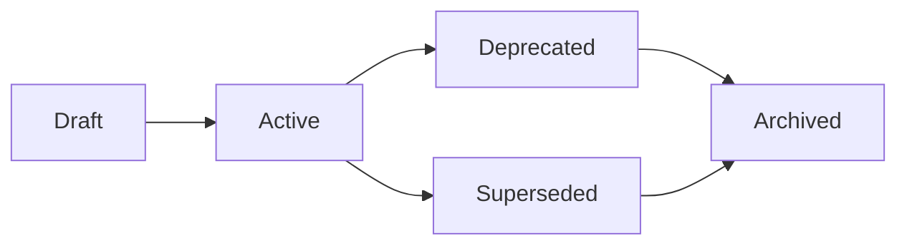

# 📚 Architecture Decision Record (ADR) Registry

This registry provides a comprehensive index of all Architecture Decision Records
with metadata, status, and relationships.

**Total ADRs**: 45
**Last Updated**: 2026-04-24

## 📊 Status Summary

| Status | Count | Percentage |
|--------|-------|------------|
| `active` | 37 | 82.2% |
| `archived` | 1 | 2.2% |
| `deprecated` | 3 | 6.7% |
| `draft` | 1 | 2.2% |
| `superseded` | 3 | 6.7% |

## 🟢 Active ADRs

### 37 decisions

### ADR-001: delta lake vs parquet

**Status**: `active` | **Category**: `architecture` | **Owner**: `architecture-team`

**Context**: The project requires a reliable, high-performance storage format for the Silver (normalized) and Gold (aggregated) layers of the data warehouse. The p...

[📄 View Full ADR](decisions/ADR-001-delta-lake-vs-parquet.md) | [🔗 Permalink](#adr-001)

---

### ADR-002: medallion architecture

**Status**: `active` | **Category**: `architecture` | **Owner**: `architecture-team`

**Context**: The project needs a structured and scalable approach to manage data pipelines, from raw ingestion to analysis-ready aggregates....

[📄 View Full ADR](decisions/ADR-002-medallion-architecture.md) | [🔗 Permalink](#adr-002)

---

### ADR-004: pydantic vs dataclasses

**Status**: `active` | **Category**: `architecture` | **Owner**: `architecture-team`

**Context**: The project requires a robust way to define and validate data schemas, especially for data contracts between layers (e.g., API responses, records in D...

[📄 View Full ADR](decisions/ADR-004-pydantic-vs-dataclasses.md) | [🔗 Permalink](#adr-004)

---

### ADR-005: composition layer separation

**Status**: `active` | **Category**: `architecture` | **Owner**: `architecture-team`

**Context**: During architecture review, the question arose whether the `composition/` module (Composition Root, DI wiring, factories) should be merged into `inter...

[📄 View Full ADR](decisions/ADR-005-composition-layer-separation.md) | [🔗 Permalink](#adr-005)

---

### ADR-006: logger metrics ports

**Status**: `active` | **Category**: `architecture` | **Owner**: `architecture-team`

**Context**: Logger and metrics dependencies were not consistently formalized as ports. The logger was typed as a concrete `structlog.BoundLogger` in `PipelineServ...

[📄 View Full ADR](decisions/ADR-006-logger-metrics-ports.md) | [🔗 Permalink](#adr-006)

---

### ADR-007: circuit breaker implementation

**Status**: `active` | **Category**: `architecture` | **Owner**: `architecture-team`

**Context**: External API calls (ChEMBL, PubChem, UniProt) can experience temporary failures, slowdowns, or rate limiting. Without protection, the pipeline would r...

[📄 View Full ADR](decisions/ADR-007-circuit-breaker-implementation.md) | [🔗 Permalink](#adr-007)

---

### ADR-008: graceful shutdown strategy

**Status**: `active` | **Category**: `architecture` | **Owner**: `architecture-team`

**Context**: ETL pipelines process large datasets in batches, maintaining state via checkpoints and holding runtime locks. An abrupt shutdown (kill -9, OOM, etc.) ...

[📄 View Full ADR](decisions/ADR-008-graceful-shutdown-strategy.md) | [🔗 Permalink](#adr-008)

---

### ADR-009: paginated fetcher mixin

**Status**: `active` | **Category**: `architecture` | **Owner**: `architecture-team`

**Context**: All data source adapters (ChEMBL, PubChem, UniProt) implement pagination, but each API uses different mechanisms (offset-based, cursor-based, page tok...

[📄 View Full ADR](decisions/ADR-009-paginated-fetcher-mixin.md) | [🔗 Permalink](#adr-009)

---

### ADR-010: local only deployment

**Status**: `active` | **Category**: `architecture` | **Owner**: `architecture-team`

**Relationships**: Supersedes: ADR-003

**Context**: BioETL изначально проектировался с поддержкой облачной инфраструктуры:
- S3 для хранения Bronze/Silver/Gold слоёв
- Redis для распределённых блокирово...

[📄 View Full ADR](decisions/ADR-010-local-only-deployment.md) | [🔗 Permalink](#adr-010)

---

### ADR-011: remove watermark mechanism

**Status**: `active` | **Category**: `architecture` | **Owner**: `architecture-team`

**Context**: Механизм Watermark был реализован для поддержки инкрементальной загрузки данных:
- `Watermark` value object в domain слое для хранения позиции (timest...

[📄 View Full ADR](decisions/ADR-011-remove-watermark-mechanism.md) | [🔗 Permalink](#adr-011)

---

### ADR-012: storage clear contract and run id

**Status**: `active` | **Category**: `architecture` | **Owner**: `architecture-team`

**Context**: Два архитектурных вопроса требовали решения:
### Проблема 1: Дублирование run-id
На момент принятия ADR `BasePipeline` создавал собственный `run_id` в...

[📄 View Full ADR](decisions/ADR-012-storage-clear-contract-and-run-id.md) | [🔗 Permalink](#adr-012)

---

### ADR-013: async storage cleanup

**Status**: `active` | **Category**: `architecture` | **Owner**: `architecture-team`

**Context**: На момент принятия ADR путь очистки в `PipelineRunner` был представлен через
приватный метод `_clear_exports()`, который вызывал асинхронные методы
`S...

[📄 View Full ADR](decisions/ADR-013-async-storage-cleanup.md) | [🔗 Permalink](#adr-013)

---

### ADR-014: deterministic writes

**Status**: `active` | **Category**: `architecture` | **Owner**: `architecture-team`

**Context**: Для обеспечения воспроизводимости и упрощения отладки пайплайнов необходим детерминизм:
1. **Проблема отладки**: При расследовании инцидентов невозмож...

[📄 View Full ADR](decisions/ADR-014-deterministic-writes.md) | [🔗 Permalink](#adr-014)

---

### ADR-015: pipeline services lifecycle

**Status**: `active` | **Category**: `architecture` | **Owner**: `architecture-team`

**Context**: BioETL pipelines use multiple infrastructure components (data sources, storage, locks, checkpoints, metrics, tracing) that require proper initializati...

[📄 View Full ADR](decisions/ADR-015-pipeline-services-lifecycle.md) | [🔗 Permalink](#adr-015)

---

### ADR-016: error handling strategy

**Status**: `active` | **Category**: `architecture` | **Owner**: `architecture-team`

**Context**: The BioETL pipeline needs a consistent strategy for handling errors across all adapters and processing stages. Without a unified approach, error handl...

[📄 View Full ADR](decisions/ADR-016-error-handling-strategy.md) | [🔗 Permalink](#adr-016)

---

### ADR-017: observability architecture

**Status**: `active` | **Category**: `architecture` | **Owner**: `architecture-team`

**Context**: BioETL pipelines require comprehensive observability for debugging, performance monitoring, and operational alerting. The observability stack must fol...

[📄 View Full ADR](decisions/ADR-017-observability-architecture.md) | [🔗 Permalink](#adr-017)

---

### ADR-018: gold strict validation

**Status**: `active` | **Category**: `architecture` | **Owner**: `architecture-team`

**Relationships**: Related: ADR-035

**Context**: Gold-слой должен гарантировать качество данных для downstream consumers. Текущая реализация позволяет пайплайнам работать без определённой Gold-схемы,...

[📄 View Full ADR](decisions/ADR-018-gold-strict-validation.md) | [🔗 Permalink](#adr-018)

---

### ADR-019: observability port enforcement

**Status**: `active` | **Category**: `architecture` | **Owner**: `architecture-team`

**Relationships**: Related: ADR-006, ADR-017

**Context**: Following the adoption of `LoggerPort` abstraction (ADR-006), there was still direct usage of `structlog` in the `interfaces` layer:
1. `src/bioetl/in...

[📄 View Full ADR](decisions/ADR-019-observability-port-enforcement.md) | [🔗 Permalink](#adr-019)

---

### ADR-021: ddd aggregates adoption

**Status**: `active` | **Category**: `architecture` | **Owner**: `architecture-team`

**Context**: ### Мотивация
В рамках развития архитектуры BioETL возникла необходимость усилить защиту бизнес-инвариантов
и улучшить модульность domain слоя. Ранее ...

[📄 View Full ADR](decisions/ADR-021-ddd-aggregates-adoption.md) | [🔗 Permalink](#adr-021)

---

### ADR-022: tracing noop

**Status**: `active` | **Category**: `architecture` | **Owner**: `architecture-team`

**Context**: BioETL uses Local-Only Deployment (ADR-010). Distributed tracing (Jaeger, Zipkin,
OpenTelemetry Collector) is relevant for microservice architectures ...

[📄 View Full ADR](decisions/ADR-022-tracing-noop.md) | [🔗 Permalink](#adr-022)

---

### ADR-023: entity type patterns

**Status**: `active` | **Category**: `architecture` | **Owner**: `architecture-team`

**Context**: При анализе интерфейсов трансформеров выявлено 3 паттерна передачи `entity_type`:
### Исходная Проблема
`BaseTransformer.__init__()` принимает опциона...

[📄 View Full ADR](decisions/ADR-023-entity-type-patterns.md) | [🔗 Permalink](#adr-023)

---

### ADR-026: composite pipeline pattern

**Status**: `active` | **Category**: `architecture` | **Owner**: `architecture-team`

**Context**: BioETL uses Hexagonal Architecture + Medallion (Bronze→Silver→Gold) for ETL biоактивных данных. Current pipelines operate independently:
- `chembl_act...

[📄 View Full ADR](decisions/ADR-026-composite-pipeline-pattern.md) | [🔗 Permalink](#adr-026)

---

### ADR-027: dq rules externalization

**Status**: `active` | **Category**: `architecture` | **Owner**: `architecture-team`

**Context**: Data Quality (DQ) rules were embedded directly in pipeline YAML configuration files (`configs/entities/{provider}/{entity}.yaml`). This caused several...

[📄 View Full ADR](decisions/ADR-027-dq-rules-externalization.md) | [🔗 Permalink](#adr-027)

---

### ADR-028: filter rules externalization

**Status**: `active` | **Category**: `architecture` | **Owner**: `architecture-team`

**Context**: Filter configurations (`input-filter` and `gold-filters`) were embedded directly in pipeline YAML configuration files (`configs/entities/{provider}/{e...

[📄 View Full ADR](decisions/ADR-028-filter-rules-externalization.md) | [🔗 Permalink](#adr-028)

---

### ADR-030: publication pagination strategy

**Status**: `active` | **Category**: `architecture` | **Owner**: `architecture-team`

**Context**: Publication entities (documents, works, papers) from external APIs present unique challenges for incremental extraction:
### Problem Statement
1. **Of...

[📄 View Full ADR](decisions/ADR-030-publication-pagination-strategy.md) | [🔗 Permalink](#adr-030)

---

### ADR-031: loading strategy formalization

**Status**: `active` | **Category**: `architecture` | **Owner**: `architecture-team`

**Context**: ### Problem Statement
Publication pipelines currently have implicit loading behavior:
1. They **look like** incremental pipelines (same config structu...

[📄 View Full ADR](decisions/ADR-031-loading-strategy-formalization.md) | [🔗 Permalink](#adr-031)

---

### ADR-032: unified http client

**Status**: `active` | **Category**: `architecture` | **Owner**: `architecture-team`

**Context**: All data source adapters require HTTP communication with external APIs (ChEMBL, PubChem, UniProt, CrossRef, OpenAlex, PubMed, Semantic Scholar). Each ...

[📄 View Full ADR](decisions/ADR-032-unified-http-client.md) | [🔗 Permalink](#adr-032)

---

### ADR-033: publication validation strategy

**Status**: `active` | **Category**: `architecture` | **Owner**: `architecture-team`

**Context**: ### Проблема
Система BioETL интегрирует метаданные научных публикаций из **5 гетерогенных провайдеров**:
| Провайдер            | Полей | Primary Key ...

[📄 View Full ADR](decisions/ADR-033-publication-validation-strategy.md) | [🔗 Permalink](#adr-033)

---

### ADR-034: schema domain pairs

**Status**: `active` | **Category**: `architecture` | **Owner**: `architecture-team`

**Context**: BioETL использует Hexagonal Architecture. Domain слой определяет immutable
value objects (frozen dataclasses) для конфигурации. Infrastructure слой
оп...

[📄 View Full ADR](decisions/ADR-034-schema-domain-pairs.md) | [🔗 Permalink](#adr-034)

---

### ADR-035: json field typing policy

**Status**: `active` | **Category**: `architecture` | **Owner**: `architecture-team`

**Relationships**: Related: ADR-018, ADR-034

**Context**: В Silver/Gold схемах исторически смешивались 2 подхода для JSON-like полей:
- `Series[str]` с JSON-serialized payload (`pa.string()`)
- `Series[object...

[📄 View Full ADR](decisions/ADR-035-json-field-typing-policy.md) | [🔗 Permalink](#adr-035)

---

### ADR-036: gold contract versioning policy

**Status**: `active` | **Category**: `architecture` | **Owner**: `architecture-team`

**Relationships**: Related: ADR-018, ADR-026, ADR-035

**Context**: Schema audits (2026-02-17) выявили множественные потенциальные breaking changes в Gold контрактах:
- Переименование PK (`tissue-chembl-id` → `tissue-i...

[📄 View Full ADR](decisions/ADR-036-gold-contract-versioning-policy.md) | [🔗 Permalink](#adr-036)

---

### ADR-037: canonical schema generation

**Status**: `active` | **Category**: `architecture` | **Owner**: `architecture-team`

**Context**: В проекте одновременно поддерживаются три типа schema-артефактов:
1. Pandera Silver schemas (`src/bioetl/domain/schemas/...`)
1. PyArrow Silver schema...

[📄 View Full ADR](decisions/ADR-037-canonical-schema-generation.md) | [🔗 Permalink](#adr-037)

---

### ADR-038: enum externalization

**Status**: `active` | **Category**: `architecture` | **Owner**: `architecture-team`

**Context**: ChEMBL enum values (allowed values for `standard-type`, `assay-type`, `molecule-type`,
etc.) were defined in three places:
1. **Python frozensets** in...

[📄 View Full ADR](decisions/ADR-038-enum-externalization.md) | [🔗 Permalink](#adr-038)

---

### ADR-041: naming policy skills agents

**Status**: `active` | **Category**: `architecture` | **Owner**: `architecture-team`

**Relationships**: Related: ADR-040

**Context**: Критический аудит historical runtime skills, agents, and command surfaces выявил
**системные расхождения** в наименованиях, форматах файлов и языковой...

[📄 View Full ADR](decisions/ADR-041-naming-policy-skills-agents.md) | [🔗 Permalink](#adr-041)

---

### ADR-042: testing strategy matrix

**Status**: `active` | **Category**: `architecture` | **Owner**: `architecture-team`

**Relationships**: Related: ADR-027, ADR-032

**Context**: BioETL has grown to 854+ test files across 9 test categories. While coverage meets
the 85% threshold, several gaps exist:
1. **No formalized test matr...

[📄 View Full ADR](decisions/ADR-042-testing-strategy-matrix.md) | [🔗 Permalink](#adr-042)

---

### ADR-043: documentation knowledge management

**Status**: `active` | **Category**: `architecture` | **Owner**: `architecture-team`

**Relationships**: Related: ADR-040, ADR-041, ADR-042

**Context**: BioETL has 100+ documentation files across `docs/`, 43 ADRs, and extensive
inline documentation. However, several knowledge management gaps exist:
1. ...

[📄 View Full ADR](decisions/ADR-043-documentation-knowledge-management.md) | [🔗 Permalink](#adr-043)

---

### ADR-044: run manifest ledger control plane

**Status**: `active` | **Category**: `architecture` | **Owner**: `architecture-team`

**Relationships**: Related: ADR-014, ADR-015, ADR-029, ADR-043, ADR-045

**Context**: BioETL already captured useful provenance fragments during execution:
- `RunContext` stored `pipeline_version`, `git_commit`, and `config_hash`;
- Bro...

[📄 View Full ADR](decisions/ADR-044-run-manifest-ledger-control-plane.md) | [🔗 Permalink](#adr-044)

---

## 🟡 Draft ADRs

### 1 decisions

### ADR-045: dq contract system

**Status**: `draft` | **Category**: `architecture` | **Owner**: `architecture-team`

**Context**: The BioETL pipeline required a comprehensive data quality framework to ensure:
- Consistent data validation across multiple data providers (ChEMBL, Pu...

[📄 View Full ADR](decisions/ADR-045-dq-contract-system.md) | [🔗 Permalink](#adr-045)

---

## 🟠 Deprecated ADRs

### 3 decisions

### ADR-020: basepipeline decomposition

**Status**: `deprecated` | **Category**: `architecture` | **Owner**: `architecture-team`

**Context**: ### Проблема
`BasePipeline` являлся God Object с 13+ зависимостями в конструкторе:
```python
# СТАРЫЙ API (deprecated)
def __init__(
    self,
    pip...

[📄 View Full ADR](decisions/ADR-020-basepipeline-decomposition.md) | [🔗 Permalink](#adr-020)

---

### ADR-029: output metadata unification

**Status**: `deprecated` | **Category**: `architecture` | **Owner**: `architecture-team`

**Context**: Bronze/Silver/Gold Medallion layers использовали разные структуры для `output`-метаданных в sidecar-файлах:
| Layer  | Класс                  | Поля  ...

[📄 View Full ADR](decisions/ADR-029-output-metadata-unification.md) | [🔗 Permalink](#adr-029)

---

### ADR-040: diagram governance

**Status**: `deprecated` | **Category**: `architecture` | **Owner**: `architecture-team`

**Relationships**: Related: ADR-005, ADR-020

**Context**: BioETL содержит два согласованных diagram subtrees с разными форматами и
назначением. Текущий measured baseline ниже отражает состояние репозитория на...

[📄 View Full ADR](decisions/ADR-040-diagram-governance.md) | [🔗 Permalink](#adr-040)

---

## 🔵 Superseded ADRs

### 3 decisions

### ADR-003: in memory locking strategy

**Status**: `superseded` | **Category**: `architecture` | **Owner**: `architecture-team`

**Relationships**: Superseded by: ADR-010, Related: ADR-010

**Context**: Система требует механизм блокировок для предотвращения одновременного запуска одного пайплайна (например, `chembl_activity`). Это защищает от race con...

[📄 View Full ADR](decisions/ADR-003-in-memory-locking-strategy.md) | [🔗 Permalink](#adr-003)

---

### ADR-024: entity naming unification

**Status**: `superseded` | **Category**: `architecture` | **Owner**: `architecture-team`

**Context**: При работе с доменными сущностями из разных провайдеров выявлено несоответствие между терминологией провайдеров (API-специфичные имена) и каноническим...

[📄 View Full ADR](decisions/ADR-024-entity-naming-unification.md) | [🔗 Permalink](#adr-024)

---

### ADR-025: pipeline config unification

**Status**: `superseded` | **Category**: `architecture` | **Owner**: `architecture-team`

**Relationships**: Superseded by: ADR-039

**Context**: Pipeline configs имели следующие проблемы:
1. Плоские пути без иерархии `{provider}/{entity}`
1. Отсутствие `sort-by` у 78% entity configs (нарушение ...

[📄 View Full ADR](decisions/ADR-025-pipeline-config-unification.md) | [🔗 Permalink](#adr-025)

---

## ⚪ Archived ADRs

### 1 decisions

### ADR-039: unified entity config format

**Status**: `archived` | **Category**: `architecture` | **Owner**: `architecture-team`

**Relationships**: Supersedes: ADR-025, Related: ADR-025, ADR-027, ADR-028, ADR-029

**Context**: До рефакторинга конфигурация одного стандартного pipeline была распределена по **11 файлам**
в 9 разных директориях:
```
configs/
├── pipelines/{provi...

[📄 View Full ADR](decisions/ADR-039-unified-entity-config-format.md) | [🔗 Permalink](#adr-039)

---

## 🎯 Using the ADR Registry

- **Active ADRs**: Currently applicable architectural decisions
- **Draft ADRs**: Proposed decisions under review
- **Deprecated ADRs**: No longer recommended but may still be in use
- **Superseded ADRs**: Replaced by newer decisions
- **Archived ADRs**: Historical decisions no longer relevant

## 📋 ADR Lifecycle

