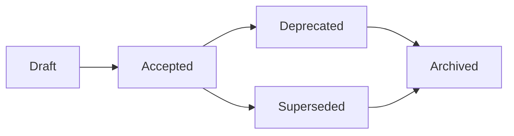

# 📚 Architecture Decision Record (ADR) Registry

This registry provides a comprehensive index of all Architecture Decision Records
with metadata, status, and relationships.

Canonical live ADR index: `docs/02-architecture/decisions/README.md`.
This page is a generated governance mirror and MUST be regenerated via
`python3 scripts/generate_adr_registry.py` after ADR additions or metadata changes.

**Total ADRs**: 53
**Last Updated**: 2026-07-28

## 📊 Status Summary

| Status | Count | Percentage |
|--------|-------|------------|
| `accepted` | 51 | 96.2% |
| `superseded` | 2 | 3.8% |

## 🟢 Accepted ADRs

### 51 decisions

### ADR-001: Delta Lake vs Parquet

**Status**: `accepted` | **Category**: `Storage` | **Owner**: `BioETL Team`

**Context**: The project requires a reliable, high-performance storage format for the Silver (normalized) and Gold (aggregated) layers of the data warehouse. The p...

[📄 View Full ADR](decisions/ADR-001-delta-lake-vs-parquet.md)

---

### ADR-002: Medallion Architecture

**Status**: `accepted` | **Category**: `Architecture` | **Owner**: `BioETL Team`

**Context**: The project needs a structured and scalable approach to manage data pipelines, from raw ingestion to analysis-ready aggregates....

[📄 View Full ADR](decisions/ADR-002-medallion-architecture.md)

---

### ADR-004: Pydantic vs Dataclasses

**Status**: `accepted` | **Category**: `Data Modeling` | **Owner**: `BioETL Team`

**Context**: The project requires a robust way to define and validate data schemas, especially for data contracts between layers (e.g., API responses, records in D...

[📄 View Full ADR](decisions/ADR-004-pydantic-vs-dataclasses.md)

---

### ADR-005: Composition Layer Separation

**Status**: `accepted` | **Category**: `Architecture` | **Owner**: `BioETL Team`

**Context**: During architecture review, the question arose whether the `composition/` module (Composition Root, DI wiring, factories) should be merged into `inter...

[📄 View Full ADR](decisions/ADR-005-composition-layer-separation.md)

---

### ADR-006: Logger and Metrics Ports

**Status**: `accepted` | **Category**: `Observability` | **Owner**: `BioETL Team`

**Context**: Logger and metrics dependencies were not consistently formalized as ports. The logger was typed as a concrete `structlog.BoundLogger` in `PipelineServ...

[📄 View Full ADR](decisions/ADR-006-logger-metrics-ports.md)

---

### ADR-007: Circuit Breaker Implementation

**Status**: `accepted` | **Category**: `Resilience` | **Owner**: `BioETL Team`

**Context**: External API calls (ChEMBL, PubChem, UniProt) can experience temporary failures, slowdowns, or rate limiting. Without protection, the pipeline would r...

[📄 View Full ADR](decisions/ADR-007-circuit-breaker-implementation.md)

---

### ADR-009: PaginatedFetcherMixin Design

**Status**: `accepted` | **Category**: `Data Fetching` | **Owner**: `BioETL Team`

**Context**: All data source adapters (ChEMBL, PubChem, UniProt) implement pagination, but each API uses different mechanisms (offset-based, cursor-based, page tok...

[📄 View Full ADR](decisions/ADR-009-paginated-fetcher-mixin.md)

---

### ADR-010: Local-Only Deployment

**Status**: `accepted` | **Category**: `Deployment` | **Owner**: `BioETL Team`

**Relationships**: Supersedes: ADR-003

**Context**: BioETL изначально проектировался с поддержкой облачной инфраструктуры:
- S3 для хранения Bronze/Silver/Gold слоёв
- Redis для распределённых блокирово...

[📄 View Full ADR](decisions/ADR-010-local-only-deployment.md)

---

### ADR-011: Remove Watermark Mechanism

**Status**: `accepted` | **Category**: `Data Loading` | **Owner**: `BioETL Team`

**Context**: Механизм Watermark был реализован для поддержки инкрементальной загрузки данных:
- `Watermark` value object в domain слое для хранения позиции (timest...

[📄 View Full ADR](decisions/ADR-011-remove-watermark-mechanism.md)

---

### ADR-012: Storage Clear Contract and Run ID

**Status**: `accepted` | **Category**: `Storage` | **Owner**: `BioETL Team`

**Context**: Два архитектурных вопроса требовали решения:
### Проблема 1: Дублирование run-id
На момент принятия ADR `BasePipeline` создавал собственный `run_id` в...

[📄 View Full ADR](decisions/ADR-012-storage-clear-contract-and-run-id.md)

---

### ADR-013: Async Storage Cleanup

**Status**: `accepted` | **Category**: `Storage` | **Owner**: `BioETL Team`

**Context**: На момент принятия ADR путь очистки в `PipelineRunner` был представлен через
приватный метод `_clear_exports()`, который вызывал асинхронные методы
ис...

[📄 View Full ADR](decisions/ADR-013-async-storage-cleanup.md)

---

### ADR-014: Deterministic Writes and Retries

**Status**: `accepted` | **Category**: `Reproducibility` | **Owner**: `BioETL Team`

**Context**: Для обеспечения воспроизводимости и упрощения отладки пайплайнов необходим детерминизм:
1. **Проблема отладки**: При расследовании инцидентов невозмож...

[📄 View Full ADR](decisions/ADR-014-deterministic-writes.md)

---

### ADR-015: Pipeline Services Lifecycle

**Status**: `accepted` | **Category**: `Lifecycle` | **Owner**: `BioETL Team`

**Context**: BioETL pipelines use multiple infrastructure components (data sources, storage, locks, checkpoints, metrics, tracing) that require proper initializati...

[📄 View Full ADR](decisions/ADR-015-pipeline-services-lifecycle.md)

---

### ADR-016: Error Handling Strategy

**Status**: `accepted` | **Category**: `Resilience` | **Owner**: `BioETL Team`

**Context**: The BioETL pipeline needs a consistent strategy for handling errors across all adapters and processing stages. Without a unified approach, error handl...

[📄 View Full ADR](decisions/ADR-016-error-handling-strategy.md)

---

### ADR-017: Observability Architecture

**Status**: `accepted` | **Category**: `Observability` | **Owner**: `BioETL Team`

**Context**: BioETL pipelines require comprehensive observability for debugging, performance monitoring, and operational alerting. The observability stack must fol...

[📄 View Full ADR](decisions/ADR-017-observability-architecture.md)

---

### ADR-018: Gold Strict Validation

**Status**: `accepted` | **Category**: `Data Quality` | **Owner**: `BioETL Team`

**Relationships**: Related: ADR-035

**Context**: Gold-слой должен гарантировать качество данных для downstream consumers.
Исторически ADR вводила feature flag для контролируемой миграции существующих...

[📄 View Full ADR](decisions/ADR-018-gold-strict-validation.md)

---

### ADR-019: Observability Port Enforcement

**Status**: `accepted` | **Category**: `Observability` | **Owner**: `BioETL Team`

**Relationships**: Related: ADR-006, ADR-017

**Context**: Following the adoption of `LoggerPort` abstraction (ADR-006), there was still direct usage of `structlog` in the `interfaces` layer:
1. `src/bioetl/in...

[📄 View Full ADR](decisions/ADR-019-observability-port-enforcement.md)

---

### ADR-020: BasePipeline Decomposition

**Status**: `accepted` | **Category**: `Architecture` | **Owner**: `BioETL Team`

**Source status text**: `Accepted (Implemented 2025-12-16)`

**Context**: ### Проблема
`BasePipeline` являлся God Object с 13+ зависимостями в конструкторе:
```python
# СТАРЫЙ API (deprecated)
def __init__(
    self,
    pip...

[📄 View Full ADR](decisions/ADR-020-basepipeline-decomposition.md)

---

### ADR-021: DDD Aggregates Adoption

**Status**: `accepted` | **Category**: `Domain Model` | **Owner**: `BioETL Team`

**Source status text**: `Accepted (Implemented 2025-12-29)`

**Context**: ### Мотивация
В рамках развития архитектуры BioETL возникла необходимость усилить защиту бизнес-инвариантов
и улучшить модульность domain слоя. Ранее ...

[📄 View Full ADR](decisions/ADR-021-ddd-aggregates-adoption.md)

---

### ADR-022: NoOp Tracing for Local-Only

**Status**: `accepted` | **Category**: `Observability` | **Owner**: `BioETL Team`

**Context**: BioETL uses Local-Only Deployment (ADR-010). Distributed tracing (Jaeger, Zipkin,
OpenTelemetry Collector) is relevant for microservice architectures ...

[📄 View Full ADR](decisions/ADR-022-tracing-noop.md)

---

### ADR-023: Entity Type Patterns

**Status**: `accepted` | **Category**: `Observability` | **Owner**: `BioETL Team`

**Context**: При анализе интерфейсов трансформеров выявлено 3 паттерна передачи `entity_type`:
### Исходная Проблема
`BaseTransformer.__init__()` принимает опциона...

[📄 View Full ADR](decisions/ADR-023-entity-type-patterns.md)

---

### ADR-024: Entity Naming Unification

**Status**: `accepted` | **Category**: `Architecture` | **Owner**: `BioETL Team`

**Context**: При работе с доменными сущностями из разных провайдеров выявлено несоответствие между терминологией провайдеров (API-специфичные имена) и каноническим...

[📄 View Full ADR](decisions/ADR-024-entity-naming-unification.md)

---

### ADR-025: Pipeline Config Unification

**Status**: `accepted` | **Category**: `Configuration` | **Owner**: `BioETL Team`

**Source status text**: `Accepted (partially superseded by ADR-039)`

**Relationships**: Superseded by: ADR-039

**Context**: Pipeline configs имели следующие проблемы:
1. Плоские пути без иерархии `{provider}/{entity}`
1. Отсутствие `sort-by` у 78% entity configs (нарушение ...

[📄 View Full ADR](decisions/ADR-025-pipeline-config-unification.md)

---

### ADR-026: Composite Pipeline Pattern

**Status**: `accepted` | **Category**: `Architecture` | **Owner**: `BioETL Team`

**Context**: BioETL uses Hexagonal Architecture + Medallion (Bronze→Silver→Gold) for ETL biоактивных данных. Current pipelines operate independently:
- `chembl_act...

[📄 View Full ADR](decisions/ADR-026-composite-pipeline-pattern.md)

---

### ADR-027: DQ Rules Externalization

**Status**: `accepted` | **Category**: `Data Quality` | **Owner**: `BioETL Team`

**Context**: Data Quality (DQ) rules were embedded directly in pipeline YAML configuration files (`configs/entities/{provider}/{entity}.yaml`). This caused several...

[📄 View Full ADR](decisions/ADR-027-dq-rules-externalization.md)

---

### ADR-028: Filter Rules Externalization

**Status**: `accepted` | **Category**: `Configuration` | **Owner**: `BioETL Team`

**Context**: Filter configurations (`input-filter` and `gold-filters`) were embedded directly in pipeline YAML configuration files (`configs/entities/{provider}/{e...

[📄 View Full ADR](decisions/ADR-028-filter-rules-externalization.md)

---

### ADR-029: Output Metadata Unification

**Status**: `accepted` | **Category**: `Data Modeling` | **Owner**: `BioETL Team`

**Context**: Bronze/Silver/Gold Medallion layers использовали разные структуры для `output`-метаданных в sidecar-файлах:
| Layer  | Класс                  | Поля  ...

[📄 View Full ADR](decisions/ADR-029-output-metadata-unification.md)

---

### ADR-030: Publication Pagination Strategy

**Status**: `accepted` | **Category**: `Data Fetching` | **Owner**: `BioETL Team`

**Context**: Publication entities (documents, works, papers) from external APIs present unique challenges for incremental extraction:
### Problem Statement
1. **Of...

[📄 View Full ADR](decisions/ADR-030-publication-pagination-strategy.md)

---

### ADR-031: Loading Strategy Formalization

**Status**: `accepted` | **Category**: `Data Loading` | **Owner**: `BioETL Team`

**Context**: ### Problem Statement
Publication pipelines currently have implicit loading behavior:
1. They **look like** incremental pipelines (same config structu...

[📄 View Full ADR](decisions/ADR-031-loading-strategy-formalization.md)

---

### ADR-032: Unified HTTP Client Pattern

**Status**: `accepted` | **Category**: `HTTP/Networking` | **Owner**: `BioETL Team`

**Context**: All data source adapters require HTTP communication with external APIs (ChEMBL, PubChem, UniProt, CrossRef, OpenAlex, PubMed, Semantic Scholar). Each ...

[📄 View Full ADR](decisions/ADR-032-unified-http-client.md)

---

### ADR-033: Publication Metadata Validation Strategy

**Status**: `accepted` | **Category**: `Data Quality` | **Owner**: `BioETL Team`

**Context**: ### Проблема
Система BioETL интегрирует метаданные научных публикаций из **5 гетерогенных провайдеров**:
| Провайдер            | Полей | Primary Key ...

[📄 View Full ADR](decisions/ADR-033-publication-validation-strategy.md)

---

### ADR-034: Schema↔Domain Configuration Pairs

**Status**: `accepted` | **Category**: `Architecture` | **Owner**: `BioETL Team`

**Context**: BioETL использует Hexagonal Architecture. Domain слой определяет immutable
value objects (frozen dataclasses) для конфигурации. Infrastructure слой
оп...

[📄 View Full ADR](decisions/ADR-034-schema-domain-pairs.md)

---

### ADR-035: JSON Field Typing Policy (Silver↔Gold)

**Status**: `accepted` | **Category**: `Data Modeling` | **Owner**: `BioETL Team`

**Relationships**: Related: ADR-018, ADR-034

**Context**: В Silver/Gold схемах исторически смешивались 2 подхода для JSON-like полей:
- `Series[str]` с JSON-serialized payload (`pa.string()`)
- `Series[object...

[📄 View Full ADR](decisions/ADR-035-json-field-typing-policy.md)

---

### ADR-036: Gold Contract Versioning Policy

**Status**: `accepted` | **Category**: `Data Quality` | **Owner**: `BioETL Team`

**Relationships**: Related: ADR-018, ADR-026, ADR-035

**Context**: Schema audits (2026-02-17) выявили множественные потенциальные breaking changes в Gold контрактах:
- Переименование PK (`tissue-chembl-id` → `tissue-i...

[📄 View Full ADR](decisions/ADR-036-gold-contract-versioning-policy.md)

---

### ADR-037: Canonical Schema Source and Generation

**Status**: `accepted` | **Category**: `Data Contracts` | **Owner**: `BioETL Team`

**Context**: В проекте одновременно поддерживаются три типа schema-артефактов:
1. Pandera Silver schemas (`src/bioetl/domain/schemas/...`)
1. PyArrow Silver schema...

[📄 View Full ADR](decisions/ADR-037-canonical-schema-generation.md)

---

### ADR-038: ChEMBL Enum Values Externalization to YAML

**Status**: `accepted` | **Category**: `Configuration` | **Owner**: `BioETL Team`

**Context**: ChEMBL enum values (allowed values for `standard-type`, `assay-type`, `molecule-type`,
etc.) were defined in three places:
1. **Python frozensets** in...

[📄 View Full ADR](decisions/ADR-038-enum-externalization.md)

---

### ADR-039: Unified Entity Config Format

**Status**: `accepted` | **Category**: `Configuration` | **Owner**: `BioETL Team`

**Relationships**: Supersedes: ADR-025, Related: ADR-025, ADR-027, ADR-028, ADR-029

**Context**: До рефакторинга конфигурация одного стандартного pipeline была распределена по **11 файлам**
в 9 разных директориях:
```
configs/
├── pipelines/{provi...

[📄 View Full ADR](decisions/ADR-039-unified-entity-config-format.md)

---

### ADR-040: Diagram Governance and Layout Policy

**Status**: `accepted` | **Category**: `Documentation` | **Owner**: `BioETL Team`

**Relationships**: Related: ADR-005, ADR-020

**Context**: BioETL содержит два согласованных diagram subtrees с разными форматами и
назначением. Текущий measured baseline ниже отражает состояние репозитория на...

[📄 View Full ADR](decisions/ADR-040-diagram-governance.md)

---

### ADR-041: Naming Policy for Skills, Agents, Commands

**Status**: `accepted` | **Category**: `Architecture` | **Owner**: `BioETL Team`

**Relationships**: Related: ADR-040

**Context**: Критический аудит historical runtime skills, agents, and command surfaces выявил
**системные расхождения** в наименованиях, форматах файлов и языковой...

[📄 View Full ADR](decisions/ADR-041-naming-policy-skills-agents.md)

---

### ADR-042: Testing Strategy Matrix & Fixture Gov.

**Status**: `accepted` | **Category**: `Testing` | **Owner**: `BioETL Team`

**Relationships**: Related: ADR-027, ADR-032

**Context**: BioETL has grown to 854+ test files across 9 test categories. While coverage meets
the 85% threshold, several gaps exist:
1. **No formalized test matr...

[📄 View Full ADR](decisions/ADR-042-testing-strategy-matrix.md)

---

### ADR-043: Documentation & Knowledge Management

**Status**: `accepted` | **Category**: `Documentation` | **Owner**: `BioETL Team`

**Relationships**: Related: ADR-040, ADR-041, ADR-042

**Context**: BioETL has 100+ documentation files across `docs/`, 43 ADRs, and extensive
inline documentation. However, several knowledge management gaps exist:
1. ...

[📄 View Full ADR](decisions/ADR-043-documentation-knowledge-management.md)

---

### ADR-044: Run Manifest & Ledger Control Plane

**Status**: `accepted` | **Category**: `Reproducibility` | **Owner**: `BioETL Team`

**Relationships**: Related: ADR-014, ADR-015, ADR-029, ADR-043, ADR-045

**Context**: BioETL already captured useful provenance fragments during execution:
- `RunContext` stored `pipeline_version`, `git_commit`, and `config_hash`;
- Bro...

[📄 View Full ADR](decisions/ADR-044-run-manifest-ledger-control-plane.md)

---

### ADR-045: Data Quality Contract System

**Status**: `accepted` | **Category**: `Data Quality` | **Owner**: `BioETL Team`

**Context**: The BioETL pipeline required a comprehensive data quality framework to ensure:
- Consistent data validation across multiple data providers (ChEMBL, Pu...

[📄 View Full ADR](decisions/ADR-045-dq-contract-system.md)

---

### ADR-046: Checkpoint Versus Ledger-Based Resume

**Status**: `accepted` | **Category**: `Reproducibility` | **Owner**: `BioETL Team`

**Relationships**: Related: ADR-010, ADR-014, ADR-015, ADR-026, ADR-044

**Context**: BioETL currently has two different control surfaces that touch resumability, but
they do not serve the same role.
- `CompositeCheckpointState` persist...

[📄 View Full ADR](decisions/ADR-046-checkpoint-vs-ledger-resume.md)

---

### ADR-047: Workflow Control Plane for Declarative Workflows

**Status**: `accepted` | **Category**: `Reproducibility` | **Owner**: `BioETL Team`

**Relationships**: Related: ADR-010, ADR-014, ADR-015, ADR-044, ADR-046

**Context**: Declarative workflow DAGs had already shipped config loading and sequential
execution, but safe operator recovery still needed explicit workflow-level...

[📄 View Full ADR](decisions/ADR-047-workflow-control-plane.md)

---

### ADR-048: Domain Schema Boundary and Runtime Pandera Compatibility

**Status**: `accepted` | **Category**: `Architecture` | **Owner**: `BioETL Team`

**Relationships**: Related: ADR-004, ADR-018, ADR-033, ADR-037

**Context**: BioETL intentionally keeps Pandera-backed schemas in the domain layer because
they are data contracts for Silver and Gold records, not infrastructure ...

[📄 View Full ADR](decisions/ADR-048-domain-schema-boundary-and-runtime-pandera-compat.md)

---

### ADR-049: Context-Aware LOC Target Policy

**Status**: `accepted` | **Category**: `Architecture` | **Owner**: `BioETL Team`

**Context**: During refactoring work on GitHub issues #5056 and #5057 (LOC reduction targets), we identified that a blanket 250 LOC target for all files is not app...

[📄 View Full ADR](decisions/ADR-049-context-aware-loc-target-policy.md)

---

### ADR-050: Silver Structural and Gold Semantic Filter Boundary

**Status**: `accepted` | **Category**: `Data Quality` | **Owner**: `BioETL Team`

**Relationships**: Related: ADR-002, ADR-014, ADR-017, ADR-018, ADR-028, ADR-042, ADR-044, ADR-045, ADR-046, ADR-047

[📄 View Full ADR](decisions/ADR-050-silver-structural-gold-semantic-filter-boundary.md)

---

### ADR-051: QuarantineEntry Wide Constructor as Intentional Aggregate Surface

**Status**: `accepted` | **Category**: `Architecture` | **Owner**: `BioETL Team`

**Context**: `QuarantineEntry` is a Domain aggregate root that freezes identity and
immutability invariants for quarantine records. Its constructor currently
takes...

[📄 View Full ADR](decisions/ADR-051-quarantine-entry-aggregate-surface.md)

---

### ADR-052: Infrastructure Config Package Root as Permanent Public API

**Status**: `accepted` | **Category**: `Architecture` | **Owner**: `BioETL Team`

**Context**: Among public lazy facades, `bioetl.infrastructure.config` (package root at
`src/bioetl/infrastructure/config/__init__.py`) was still classified as
`co...

[📄 View Full ADR](decisions/ADR-052-infrastructure-config-package-root-public-api.md)

---

### ADR-053: Optional Grafana Scenes App Shell as Presentation Adapter

**Status**: `accepted` | **Category**: `Observability` | **Owner**: `BioETL Team`

**Relationships**: Related: ADR-010, ADR-017

**Context**: BioETL ships a fixed portfolio of **seven** provisioned Grafana dashboards
(`grafana/dashboards/*.json`) as the operator observability surface. Grafan...

[📄 View Full ADR](decisions/ADR-053-optional-grafana-scenes-app-shell.md)

---

## 🔵 Superseded ADRs

### 2 decisions

### ADR-003: In-Memory Locking (MemoryLock)

**Status**: `superseded` | **Category**: `Locking` | **Owner**: `BioETL Team`

**Source status text**: `Superseded (revised 2025-12-23; see ADR-010)`

[📄 View Full ADR](decisions/ADR-003-in-memory-locking-strategy.md)

---

### ADR-008: Graceful Shutdown Strategy

**Status**: `superseded` | **Category**: `Lifecycle` | **Owner**: `BioETL Team`

[📄 View Full ADR](decisions/ADR-008-graceful-shutdown-strategy.md)

---

## 🎯 Using the ADR Registry

- **Accepted ADRs**: Currently applicable architectural decisions
- **Draft ADRs**: Proposed decisions under review
- **Deprecated ADRs**: No longer recommended but may still be in use
- **Superseded ADRs**: Replaced by newer decisions
- **Archived ADRs**: Historical decisions no longer relevant

## 📋 ADR Lifecycle

