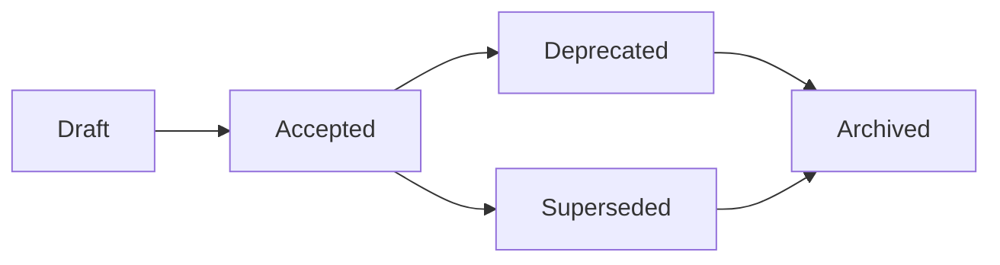

# ADR Registry

This directory contains the generated Architecture Decision Record (ADR) registry
with metadata, status tracking, and navigation aids.

## Authority

- `docs/02-architecture/decisions/README.md` is the canonical live ADR index.
- `index.md`, `status-dashboard.md`, and `registry.json` in this directory are
  generated mirrors for navigation and tooling.
- Regenerate these files with `python3 scripts/generate_adr_registry.py`
  whenever ADR files or ADR index metadata change.

## Files

- `index.md` - Main ADR registry with all decisions organized by status
- `status-dashboard.md` - Quick overview of ADR health and metrics
- `registry.json` - Machine-readable JSON registry for tooling integration

## Usage

### For Developers

1. **Browse ADRs**: Start with `index.md` for the complete registry
2. **Check Status**: Use `status-dashboard.md` for health metrics
3. **Find Decisions**: Use browser search (Ctrl+F) to find relevant ADRs
4. **Understand Context**: Each ADR entry includes context and relationships

### For Tooling

The `registry.json` file provides machine-readable access to all ADR metadata:

```json
{
  "generated": "2024-04-23T12:00:00",
  "total_adrs": 50,
  "adrs": [
    {
      "adr_number": "001",
      "title": "Decision Title",
      "status": "accepted",
      "source_status": "Accepted",
      "category": "architecture",
      "owner": "architecture-team",
      "file_path": "ADR-001-decision-title.md",
      "supersedes": [],
      "superseded_by": [],
      "related": []
    }
  ],
  "stats": {
    "by_status": {"accepted": 40, "deprecated": 5, "archived": 5},
    "by_category": {"architecture": 30, "data": 10, "infrastructure": 10}
  }
}
```

## ADR Lifecycle



## Status Definitions

- **🟢 Accepted**: Currently applicable architectural decision
- **🟡 Draft**: Proposed decision under review
- **🟠 Deprecated**: No longer recommended but may still be in use
- **🔵 Superseded**: Replaced by a newer decision
- **⚪ Archived**: Historical decision no longer relevant

## Maintenance

This registry is automatically generated by `scripts/generate_adr_registry.py`.

To regenerate:

```bash
python3 scripts/generate_adr_registry.py
```

The registry should be regenerated whenever:
- New ADRs are added
- Existing ADRs are updated
- ADR status changes
- Before major releases

## Integration

The ADR registry integrates with:

1. **Project Navigator**: Linked from main documentation index
2. **CI/CD Pipeline**: Automated generation on documentation builds
3. **Architecture Reviews**: Used for ADR health monitoring
4. **Onboarding**: Helps new team members understand architectural context

## Related

- [ADR Decisions Directory](../decisions/)
- [Architecture Overview](../00-overview.md)
- [D-01 Documentation Governance](../../00-project/governance/01-documentation-governance-style-guide.md)
