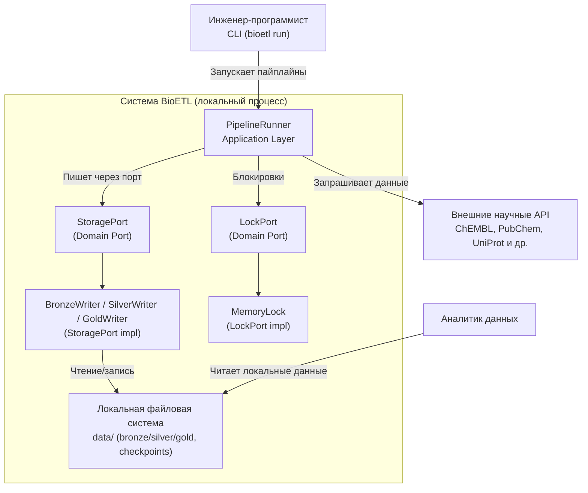

# C4: Диаграмма Контейнеров

Эта диаграмма детализирует "Систему BioETL", представленную на диаграмме контекста. Она показывает основные контейнеры (приложения и хранилища данных), которые составляют систему BioETL, и их взаимодействие.

## Компоненты

*   **PipelineRunner (Application Layer)**: Локальный процесс, который оркестрирует пайплайны и вызывает порты для источников данных, хранения и блокировок.
*   **StoragePort**: Доменный порт, через который `PipelineRunner` записывает данные в Bronze/Silver/Gold уровни.
*   **BronzeWriter / SilverWriter / GoldWriter**: Реализации `StoragePort`, которые пишут данные в локальную файловую систему `data/`.
*   **LockPort / MemoryLock**: Локальный механизм блокировок, реализующий `LockPort` в рамках single-instance выполнения (ADR-010).
*   **Локальная файловая система (`data/`)**: Хранилище Bronze/Silver/Gold и checkpoints в рамках Local-Only развертывания.
