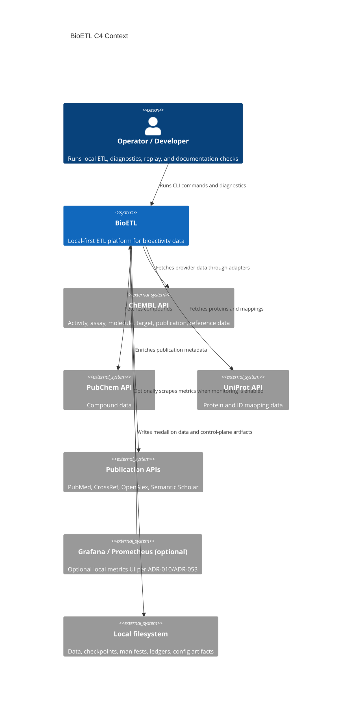
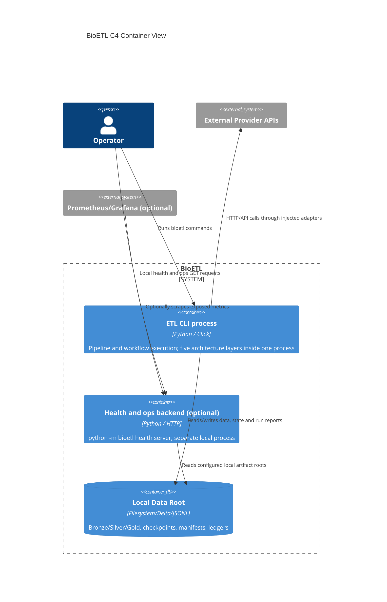
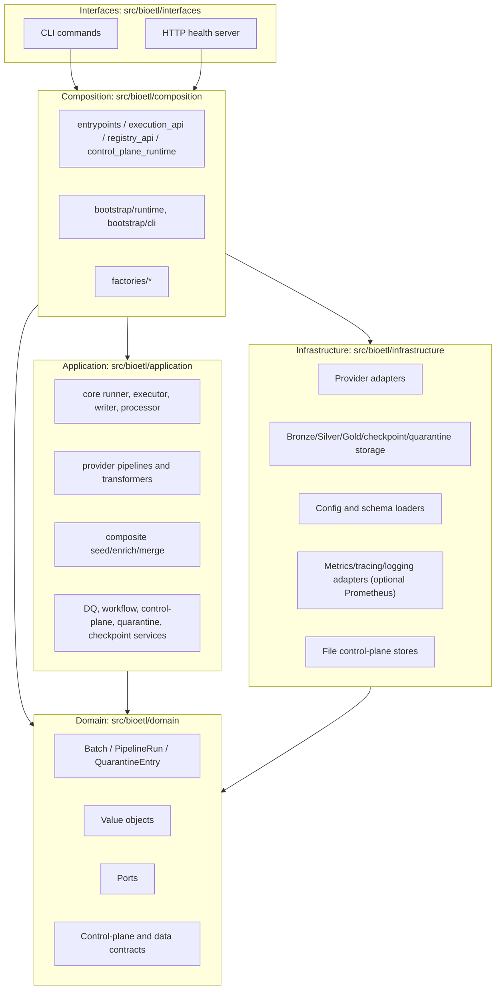
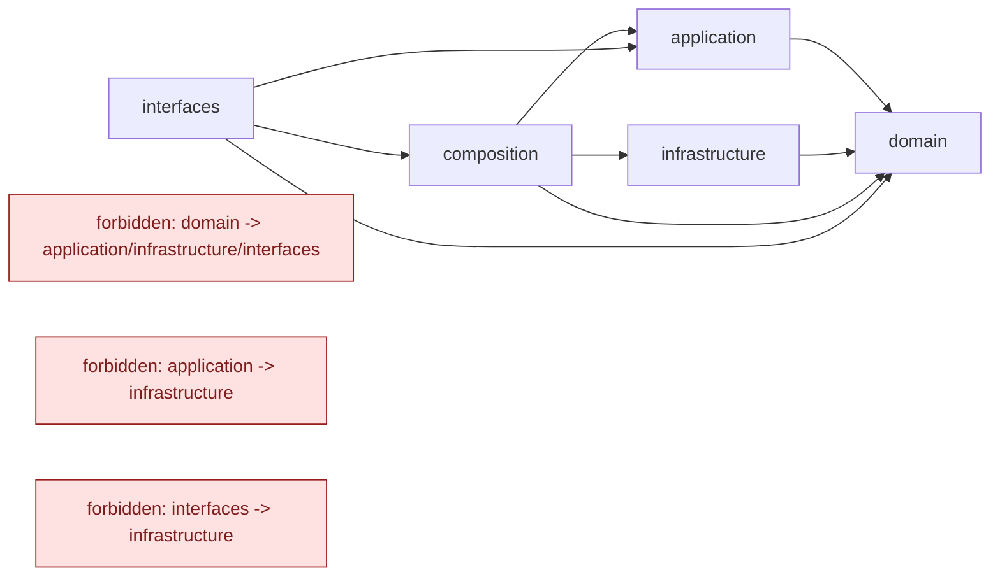
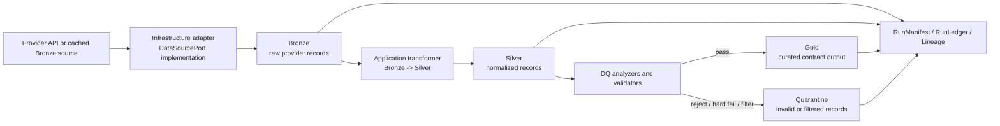
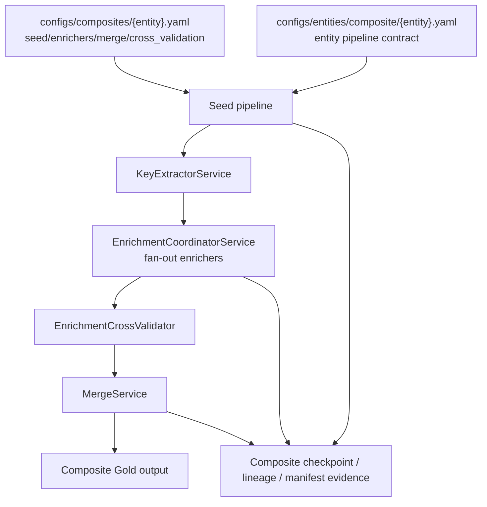
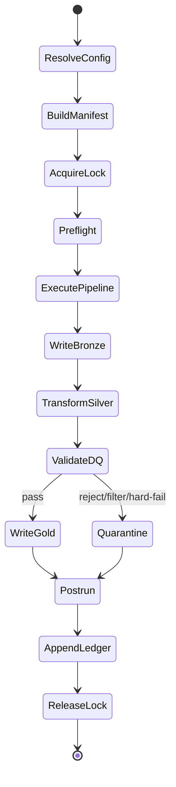
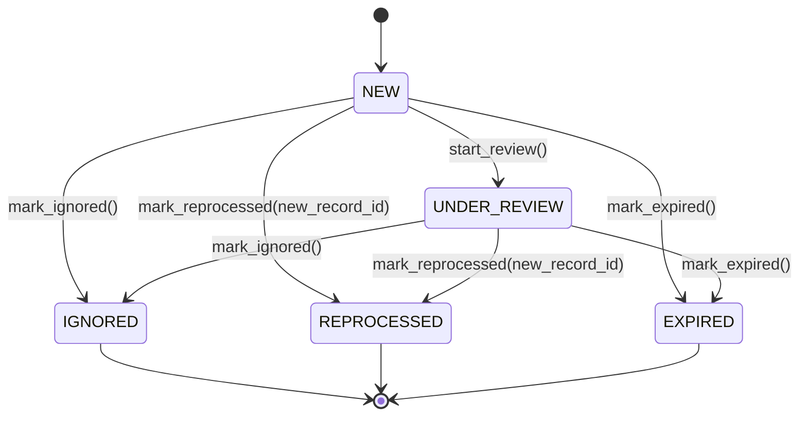
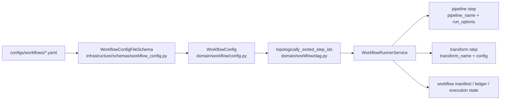

______________________________________________________________________

Version: 1.0.0
Status: active
Class: published
Owner: BioETL Team
Reviewers:

- BioETL Team
  Last verified: '2026-08-05'

______________________________________________________________________

# Current State Diagrams

These Mermaid diagrams summarize the current BioETL architecture from code and
configuration evidence. Canonical rendered historical diagram bundles remain in
`docs/02-architecture/diagrams/`; this page is the compact current-state view
used by documentation audits.

Evidence anchors:

- Layers: `src/bioetl/domain/`, `src/bioetl/application/`,
  `src/bioetl/infrastructure/`, `src/bioetl/composition/`,
  `src/bioetl/interfaces/`.
- Runtime control plane:
  `src/bioetl/domain/control_plane/`,
  `src/bioetl/application/services/control_plane/`,
  `src/bioetl/infrastructure/control_plane/`.
- Workflow model:
  `src/bioetl/domain/workflow/config.py`,
  `src/bioetl/infrastructure/schemas/workflow_config.py`,
  `configs/workflows/*.yaml`.
- Pipeline/config model:
  `configs/entities/**/*.yaml`, `configs/composites/*.yaml`,
  entity data contracts under `configs/contracts/{provider}/*.yaml`, and the
  separate error catalog at `configs/contracts/errors/error_catalog.yaml`.
- Observability (optional local stack per ADR-010 / ADR-053):
  `src/bioetl/infrastructure/observability/`, optional
  `grafana/dashboards/*.json`, optional `grafana/prometheus-rules/*.yml`.
  Default BioETL remains local-only; Prometheus/Grafana are **not** required.
  Loki, Tempo, and Quarantine Explorer UI are **not** part of the current
  default shipping surface (historical / retired from main Docker compose).

## C4 Context

<!-- diagram-audit:summary-only -->

## C4 Container

<!-- diagram-audit:summary-only -->

Here C4 containers describe execution and data-store boundaries, not Docker
containers or Python layers. Composition, Application, Domain and Infrastructure
are in-process components of the package (see Layer Diagram below).

| Element | Implementation anchor |
| --- | --- |
| ETL CLI process | `pyproject.toml` entrypoint `bioetl.interfaces.cli:main`; `src/bioetl/composition/bootstrap/runtime/` |
| Optional health/ops process | `src/bioetl/interfaces/cli/commands/domains/health/observability_backend_process.py` launches `python -m bioetl health server`; `docker-compose.yml` packages the same command |
| Local data and control-plane stores | `src/bioetl/infrastructure/storage/`, `checkpoint/`, `control_plane/`, `quarantine/`; data and reports mounts in `docker-compose.yml` |
| Optional monitoring | `docker-compose.monitoring.yml`; ADR-010 and ADR-053 preserve the local-only default |

The backend has its own lifecycle and shares configured artifact roots with ETL.
Docker and monitoring remain optional packaging/observability choices.

## Layer Diagram

<!-- diagram-audit:summary-only -->

## Dependency Direction

<!-- diagram-audit:summary-only -->

## Medallion Data Flow

<!-- diagram-audit:summary-only -->

## Composite Pipeline

<!-- diagram-audit:summary-only -->

## Run Lifecycle

<!-- diagram-audit:summary-only -->

## Quarantine Lifecycle

<!-- diagram-audit:summary-only -->

## Workflow DAG

<!-- diagram-audit:summary-only -->

