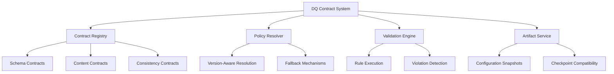

# ADR-045: Data Quality Contract System

**Date:** 2026-03-26
**Decision makers:** @BioETL-Team

## Context

The BioETL pipeline required a comprehensive data quality framework to ensure:
- Consistent data validation across multiple data providers (ChEMBL, PubChem, etc.)
- Auditability and provenance tracking for compliance requirements
- Configurable quality thresholds and policies
- Backward compatibility during system evolution
- Governance and observability for data quality issues

Previously, data quality validation was inconsistent across the pipeline, with different providers implementing ad-hoc validation logic. This led to:
- Inconsistent data quality standards
- Difficult debugging and troubleshooting
- Lack of audit trail for quality issues
- Challenges in maintaining backward compatibility

## Decision

Implement a contract-based Data Quality (DQ) System with the following characteristics:

### 1. Contract-Based Validation Architecture



### 2. Core Components

#### 2.1 DQ Contract Types

```python
# Core DQ Contract Types
class DQDisposition(StrEnum):
    """How to handle DQ violations"""
    FAIL = "fail"          # Pipeline fails on violation
    WARN = "warn"          # Log warning but continue
    QUARANTINE = "quarantine"  # Isolate problematic data

class DQViolationKind(StrEnum):
    """Category of DQ violation"""
    SCHEMA = "schema"      # Structural validation
    CONTENT = "content"    # Data quality rules
    CONSISTENCY = "consistency"  # Cross-source validation
    PROVENANCE = "provenance"  # Lineage tracking

class DQPolicyRef(NamedTuple):
    """Reference to specific DQ policy"""
    contract_id: str
    version: str
    severity: DQDisposition = DQDisposition.FAIL
```

#### 2.2 Contract Validation Layers

1. **Schema Validation**: JSON Schema validation for data structure
2. **Content Validation**: Rule-based validation for data quality
3. **Consistency Validation**: Cross-source data consistency checks
4. **Provenance Validation**: Lineage and audit trail verification

#### 2.3 Policy Resolution Strategy

```
Exact Match (contract_id + version)
    ↓
Latest Version of Contract
    ↓
Default Contract for Entity Type
    ↓
Global Fallback Policy
```

#### 2.4 Configuration Runtime Artifacts

```yaml
# EffectiveConfigArtifact Example
effective_config:
  version: "1.0"
  timestamp: "2024-03-25T14:30:00Z"
  pipeline_name: "chembl_molecule_etl"
  dq_contracts:
    - contract_id: "molecule_schema_validation"
      version: "2.1"
      hash: "a1b2c3d4e5f67890"
      disposition: "fail"
  provenance:
    git_commit: "abc1234"
    config_files:
      - "configs/providers/chembl.yaml"
      - "configs/entities/molecule.yaml"
```

### 3. Phased Migration Support

```python
# Migration Phase Configuration
class MigrationPhaseConfig:
    phase_name: str
    start_version: str
    end_version: str | None
    backward_compatible: bool
    migration_strategy: Literal["immediate", "gradual", "optional"]
    fallback_behavior: Literal["warn", "error", "silent"]

# Version Comparison Logic
def version_compare(v1: str, v2: str) -> int:
    """Compare semantic versions (-1, 0, 1)"""
    # Implementation handles different version lengths
    # e.g., "1.2" vs "1.2.3" -> "1.2.0" vs "1.2.3"
```

## Implementation Details

### Integration Points

1. **Pipeline Initialization**: DQ contracts loaded and validated
2. **Data Ingestion**: Schema and content validation applied
3. **Transformation**: Consistency checks between sources
4. **Output**: Final DQ validation before persistence
5. **Observability**: DQ metrics and violations logged

### Configuration Example

```yaml
# configs/providers/chembl.yaml
dq_contracts:
  schema_validation:
    version: "2.1"
    disposition: "fail"
    rules:
      - type: "required_fields"
        fields: ["molecule_id", "smiles", "assay_type"]
      - type: "field_types"
        molecule_id: "string"
        smiles: "string"
        assay_type: "string"
        pchembl_value: "number"

  content_validation:
    version: "1.3"
    disposition: "warn"
    rules:
      - type: "range_check"
        field: "pchembl_value"
        min: 0
        max: 100
      - type: "pattern_match"
        field: "smiles"
        pattern: "^[A-Za-z0-9@+=\-\[\]()/.]+$"

  consistency_validation:
    version: "1.0"
    disposition: "quarantine"
    rules:
      - type: "cross_source"
        primary: "chembl"
        comparison: ["pubchem", "bindingdb"]
        fields: ["molecule_id", "smiles"]
        tolerance: 0.95
```

### Performance Considerations

1. **Caching**: DQ policy resolution results cached for performance
2. **Parallel Validation**: Independent validations run in parallel
3. **Lazy Loading**: DQ contracts loaded only when needed
4. **Incremental Validation**: Only changed data re-validated

## Consequences

### Positive ✅

1. **Consistent Quality Standards**: Uniform DQ validation across all providers
2. **Improved Debugging**: Clear audit trail for data quality issues
3. **Reproducible Runs**: Configuration artifacts enable exact reproduction
4. **Smooth Migrations**: Phased approach for breaking changes
5. **Enhanced Observability**: Comprehensive DQ metrics and logging
6. **Governance Compliance**: Formal contract system meets regulatory needs

### Negative ❌

1. **Increased Complexity**: More components to understand and maintain
2. **Performance Overhead**: Additional validation steps add processing time
3. **Learning Curve**: Team needs to learn new contract system concepts
4. **Configuration Management**: More configuration files to maintain
5. **Backward Compatibility**: Requires careful version management

## Alternatives Considered

### 1. Simple Validation Library
**Rejected because**: Lacked governance features, no contract system, limited observability

### 2. External DQ Service
**Rejected because**: Latency concerns, reliability issues, vendor lock-in risks

### 3. Provider-Specific Validation
**Rejected because**: Inconsistency across pipeline, maintenance burden, no unified standards

### 4. Rule Engine Approach
**Rejected because**: Overly complex for our needs, difficult to debug, poor performance

## Success Metrics

1. **DQ Issue Detection**: 95%+ of data quality issues caught before production
2. **Configuration Stability**: <5% of pipeline runs affected by config changes
3. **Migration Success**: 100% backward compatibility during transition periods
4. **Performance Impact**: <10% overhead on pipeline execution time
5. **Adoption Rate**: 100% of new pipelines use DQ contract system within 6 months

## Rollout Plan

### Phase 1: Foundation (Completed)
- [x] Core DQ contract types and interfaces
- [x] Basic policy resolution logic
- [x] Configuration artifact framework
- [x] Unit tests for core components

### Phase 2: Integration (Completed)
- [x] Pipeline integration points
- [x] Provider-specific contract implementations
- [x] Observability and logging
- [x] Integration tests

### Phase 3: Adoption (In Progress)
- [ ] Migration of existing pipelines
- [ ] Documentation and training
- [ ] Performance optimization
- [ ] Monitoring and alerts

### Phase 4: Maturity (Planned)
- [ ] Advanced policy features
- [ ] Machine learning for anomaly detection
- [ ] Automated contract generation
- [ ] Contract versioning system

## Related Documents

- [ADR-002: Medallion Architecture](ADR-002-medallion-architecture.md)
- [ADR-017: Observability Architecture](ADR-017-observability-architecture.md)
- [DQ Contract System Component Spec](../../04-reference/components/dq-contract-system.md)
- [Configuration Runtime Artifacts](../../04-reference/components/config-runtime-artifacts.md)

## Revision History

- **1.0** (2024-03-25): Initial draft
- **1.1** (2024-03-28): Added implementation details
- **1.2** (2024-04-01): Incorporated feedback from architecture review
