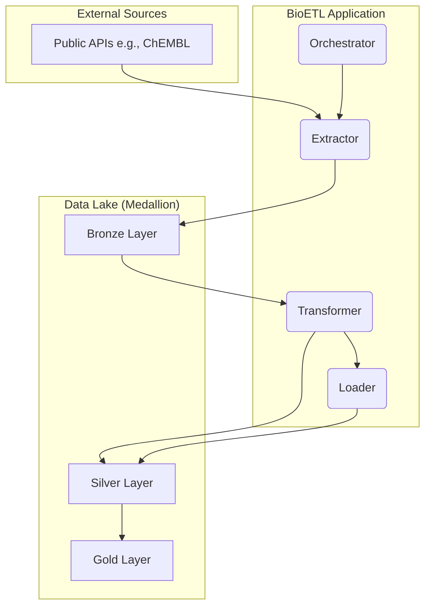
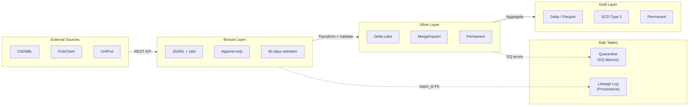
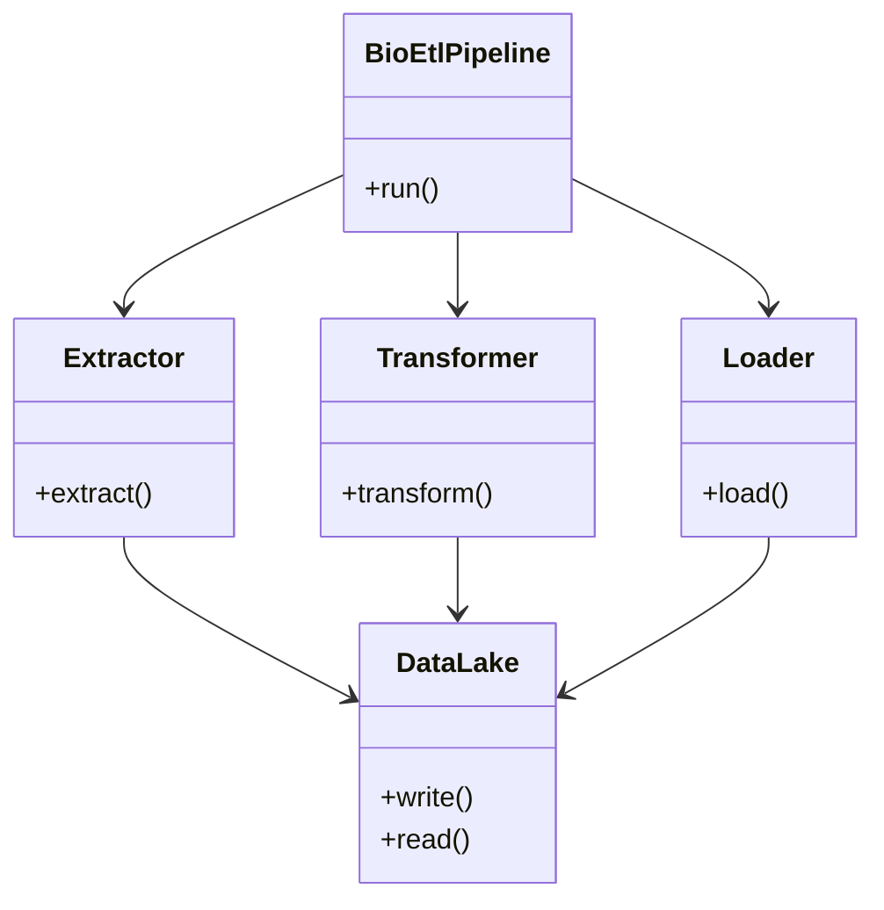

# Diagrams

## High-Level Architecture

```mermaid
flowchart TD
    subgraph "External Sources"
        A[Public APIs e.g., ChEMBL]
    end

    subgraph "BioETL Application"
        B(Orchestrator)
        C(Extractor)
        D(Transformer)
        E(Loader)
    end

    subgraph "Data Lake (Medallion)"
        F[Bronze Layer]
        G[Silver Layer]
        H[Gold Layer]
    end

    A --> C
    B --> C
    C --> F
    F --> D
    D --> G
    G --> H
    D --> E
    E --> G
```

## Medallion Architecture

```mermaid
flowchart LR
    subgraph Sources["External Sources"]
        SRC1["ChEMBL"]
        SRC2["PubChem"]
        SRC3["UniProt"]
    end

    subgraph Bronze["Bronze Layer"]
        direction TB
        B1["JSONL + zstd"]
        B2["Append-only"]
        B3["90 days retention"]
    end

    subgraph Silver["Silver Layer"]
        direction TB
        S1["Delta Lake"]
        S2["Merge/Upsert"]
        S3["Permanent"]
    end

    subgraph Gold["Gold Layer"]
        direction TB
        G1["Delta / Parquet"]
        G2["SCD Type 2"]
        G3["Permanent"]
    end

    subgraph Side["Side Tables"]
        Q["Quarantine<br/>(DQ failures)"]
        L["Lineage Log<br/>(Provenance)"]
    end

    Sources -->|REST API| Bronze
    Bronze -->|Transform + Validate| Silver
    Silver -->|Aggregate| Gold
    Silver -.->|DQ errors| Q
    Bronze -.->|batch_id FK| L
```

## Class Diagram

```mermaid
classDiagram
    class BioEtlPipeline {
        +run()
    }

    class Extractor {
        +extract()
    }

    class Transformer {
        +transform()
    }

    class Loader {
        +load()
    }

    class DataLake {
        +write()
        +read()
    }

    BioEtlPipeline --> Extractor
    BioEtlPipeline --> Transformer
    BioEtlPipeline --> Loader
    Extractor --> DataLake
    Transformer --> DataLake
    Loader --> DataLake
```
