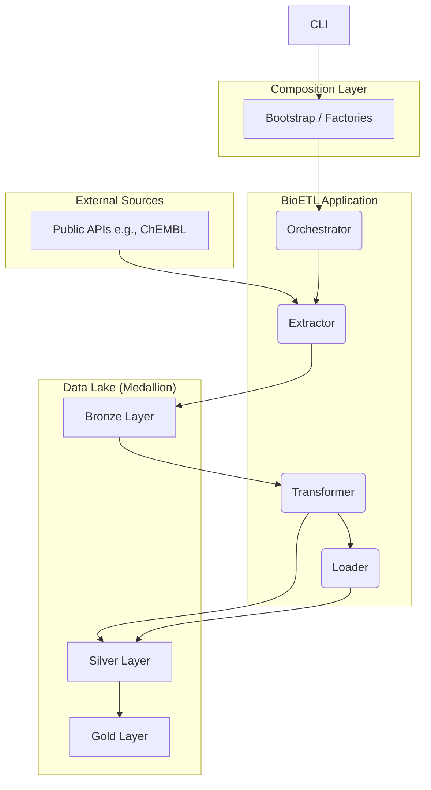
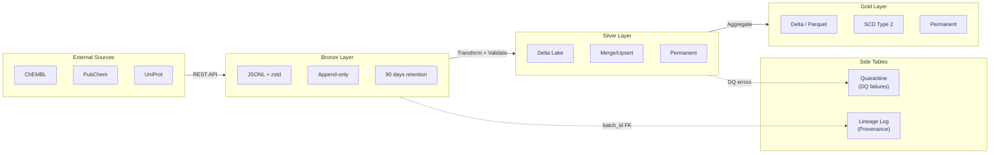
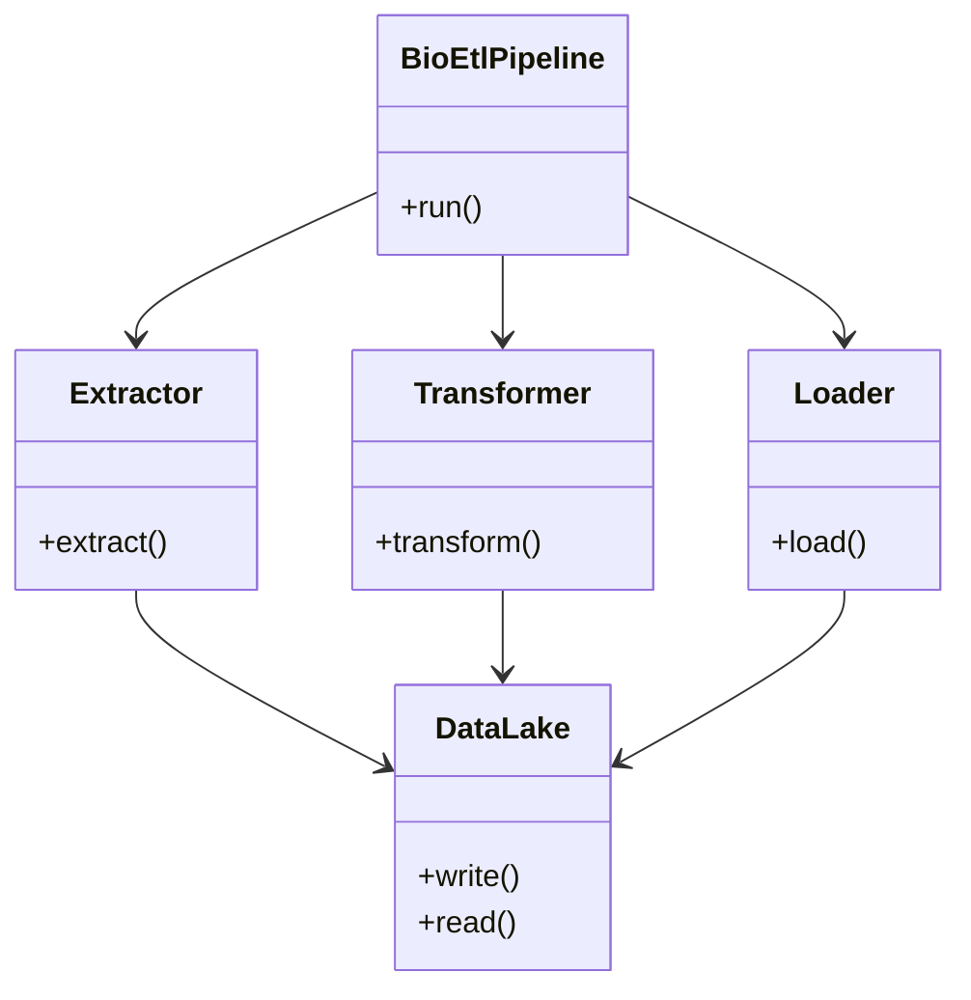
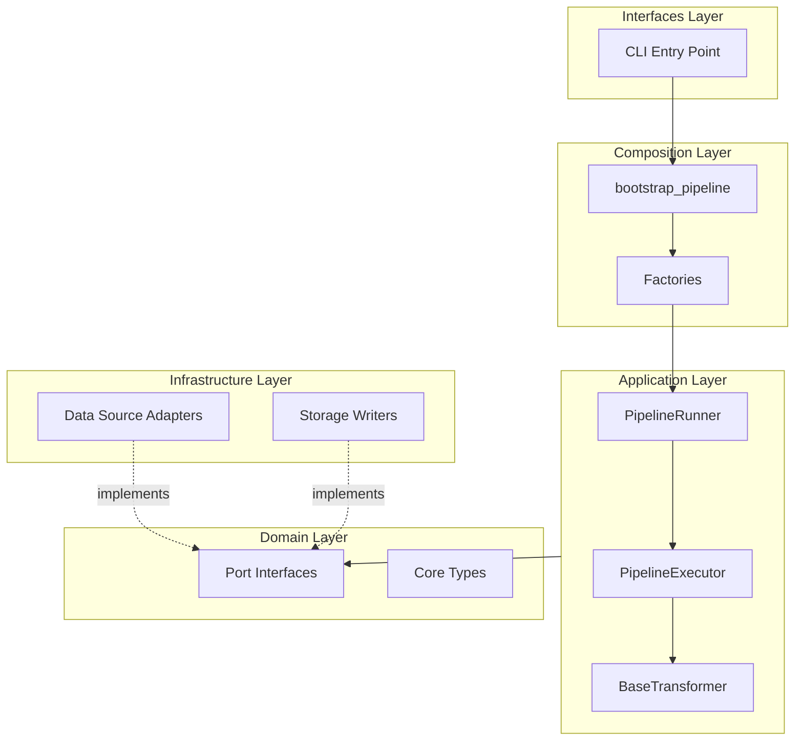
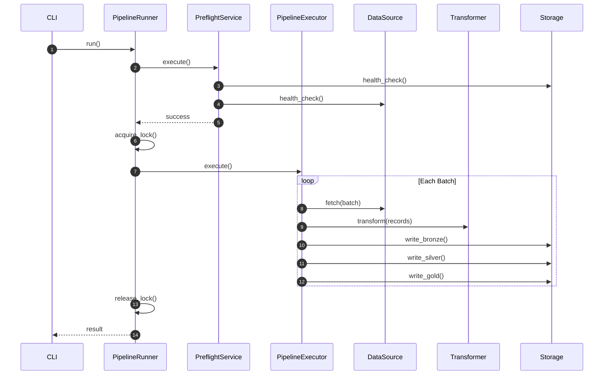
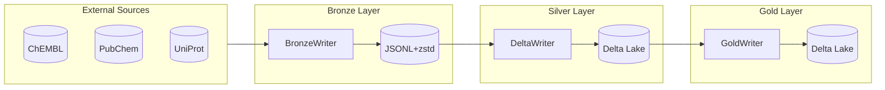
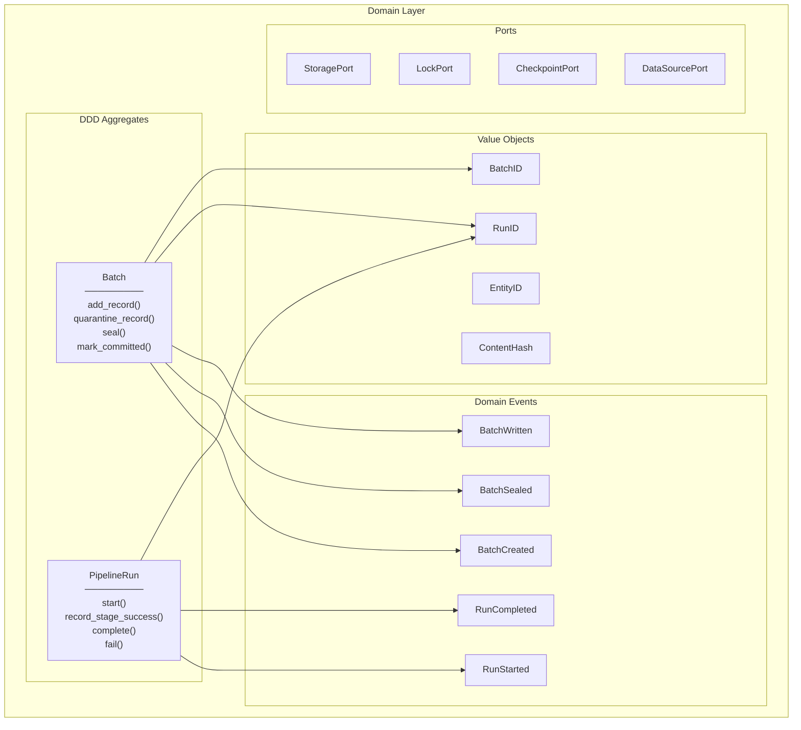
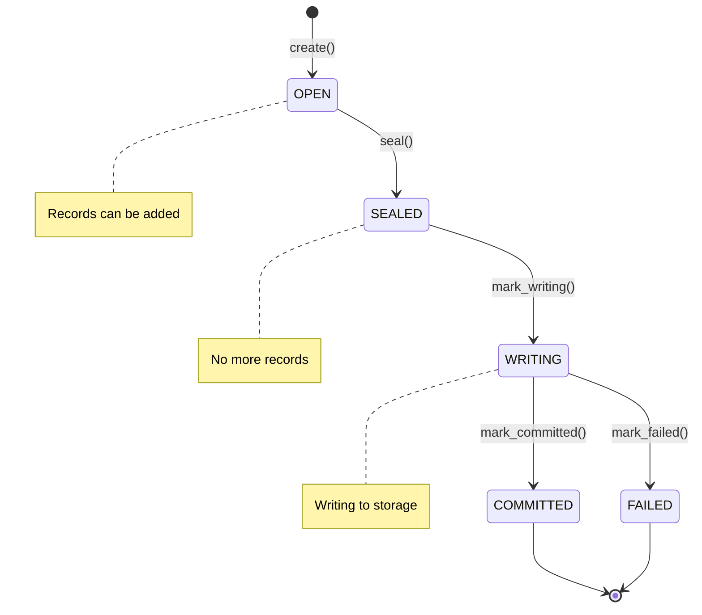
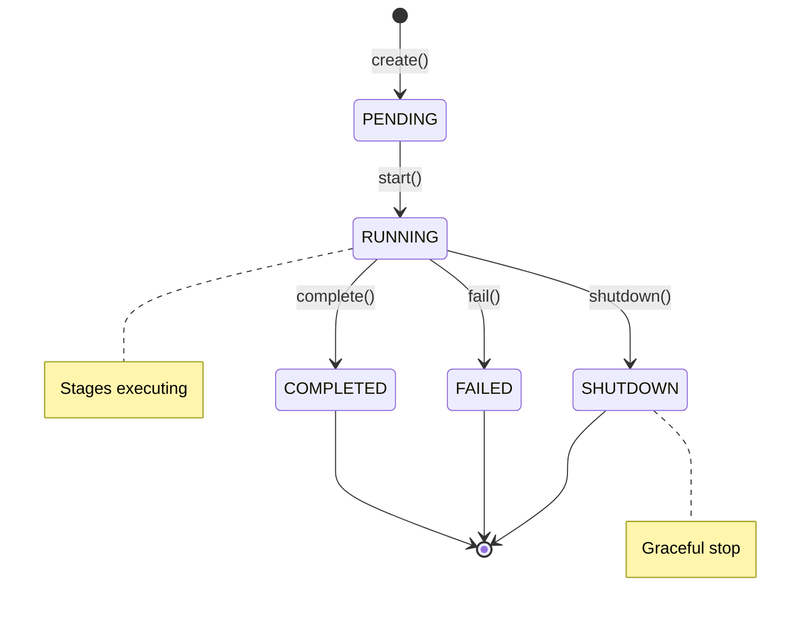

# Diagrams

## High-Level Architecture

## Medallion Architecture

## Class Diagram

## Layer Interaction

Shows how BioETL layers communicate following Hexagonal Architecture:

## Pipeline Execution Sequence

Shows the complete execution flow from CLI to data storage:

## Medallion Data Flow

Shows data transformation through Bronze → Silver → Gold layers:

## Domain Layer (DDD)

Shows the DDD components in the domain layer:

See [ADR-021: DDD Aggregates Adoption](decisions/ADR-021-ddd-aggregates-adoption.md) for details.

## Batch State Machine

## PipelineRun State Machine

## C4 Container Diagram

For a more detailed look at the runtime instances and interactions between the services, see the C4 Container Diagram.

*   **[C4: Диаграмма Контейнеров](container-diagram.md)**
