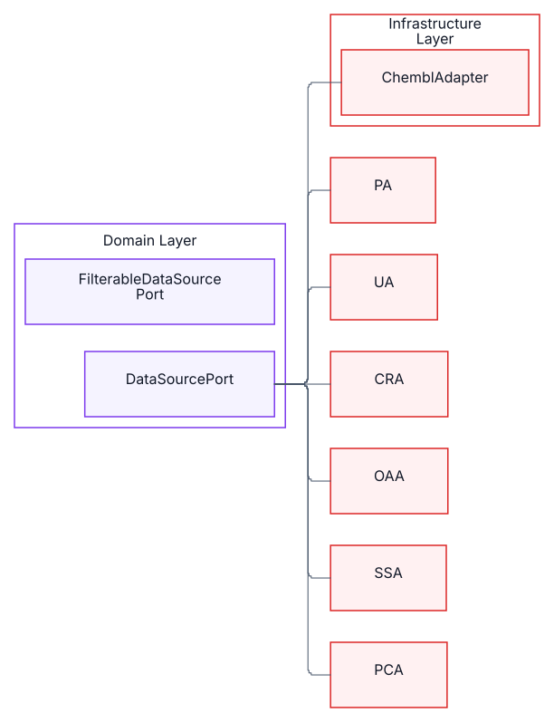
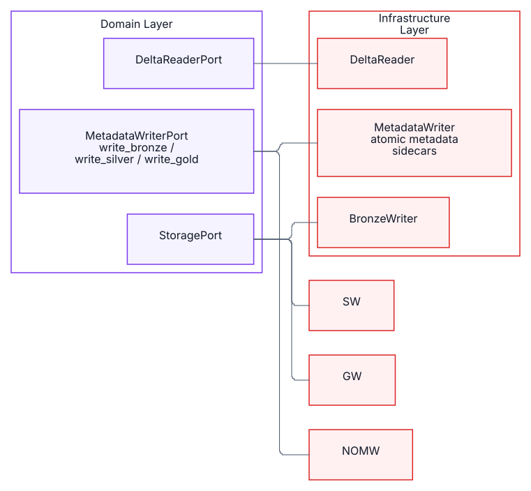
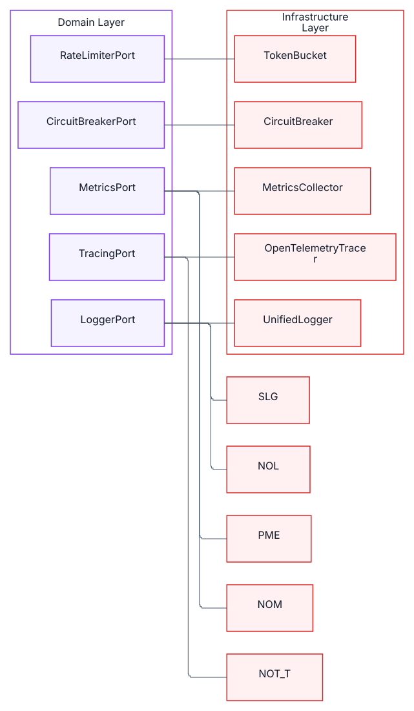

# BioETL Diagrams — SVG Index

_Generated: 2026-05-12T12:39:45+03:00_

## High Level Hexagonal

---

## 01ahexagonal Overview

---

## 01bhexagonal Domain App

---

## 01chexagonal Infra Comp

---

## 01dhexagonal Overview Rounded

---

## Layer Dependency Matrix

---

## Medallion Data Flow

---

## 03amedallion Layers Overview

---

## Pipeline Execution Flow

---

## Provider Adapter Hierarchy

---

## 05aadapter Hierarchy Base

---

## 05badapter Hierarchy Providers

---

## Storage Layer

---

## 06astorage Writers

---

## 06bstorage Support

---

## Dq System

---

## 07adq Analysis

---

## 07bdq Pipeline

---

## Composite Pipeline

---

## 08acomposite Config

---

## 08bcomposite Execution

---

## Observability Stack

---

## 09aobservability App

---

## 09bobservability Infra

---

## Resilience Patterns

---

## Configuration System

---

## 11aconfig Loading

---

## 11bconfig Domain

---

## Bootstrap Di Container

---

## 12abootstrap Factories

---

## 12bbootstrap Wiring

---

## Port Protocol Contracts

---

## 13adata Storage Ports

---

## 13aport Contracts Data Sources

---

## 13boperational Ports

---

## 13bport Contracts Storage

---

## 13cport Contracts Observability

---

## 13cvalidation Dq Ports

---

## 13dport Contracts Services

---

## 13eoperational Ports Domain

---

## 13foperational Ports Infra

---

## Cli Interface Layer

---

## 14acli Commands

---

## 14bcli Routing

---

## Batch Executor Internals

---

## Transformer Hierarchy

---

## 16atransformer Base

---

## 16btransformer Pub Other

---

## Security Pii Audit

---

## Lock Checkpoint Shutdown

---

## 18alock System

---

## 18bcheckpoint Shutdown

---

## Control Plane Artifacts

---

## Data Traceability Runtime

---

## Idempotent Processing Guards

---

## Data Operations Observability

---

## Reproducible Run Contract

---

