# BioETL Architecture Diagrams Bundle

- Generated: 2026-07-18T18:29:11
- Diagram count: 89

## Table of Contents

- [01-high-level-hexagonal-simple — Simplified High-Level Hexagonal Architecture](#01-high-level-hexagonal-simple)
- [01-high-level-hexagonal — High-Level Hexagonal Architecture](#01-high-level-hexagonal)
- [01a-hexagonal-overview — Hexagonal Overview](#01a-hexagonal-overview)
- [01b-hexagonal-domain-app — Hexagonal Domain and Application](#01b-hexagonal-domain-app)
- [01c-hexagonal-infra-comp — Hexagonal Infrastructure and Composition](#01c-hexagonal-infra-comp)
- [01d-hexagonal-overview-rounded — Hexagonal Overview (Rounded Nodes)](#01d-hexagonal-overview-rounded)
- [02-layer-dependency-matrix — Layer Dependency Matrix (ARCH-001)](#02-layer-dependency-matrix)
- [03-medallion-data-flow — Medallion Architecture Data Flow (Bronze → Silver → Gold)](#03-medallion-data-flow)
- [03a-medallion-layers-overview — Medallion Layers Overview](#03a-medallion-layers-overview)
- [04-pipeline-execution-flow — Pipeline Execution Lifecycle](#04-pipeline-execution-flow)
- [05-provider-adapter-hierarchy — Provider Adapter Hierarchy](#05-provider-adapter-hierarchy)
- [05a-adapter-hierarchy-base — Adapter Hierarchy: Base Types](#05a-adapter-hierarchy-base)
- [05b-adapter-hierarchy-providers — Adapter Hierarchy: Provider Implementations](#05b-adapter-hierarchy-providers)
- [06-storage-layer — Storage Layer Components](#06-storage-layer)
- [06a-storage-writers — Storage Writers](#06a-storage-writers)
- [06b-storage-support — Storage Support Components](#06b-storage-support)
- [07-dq-system — Data Quality (DQ) System](#07-dq-system)
- [07a-dq-analysis — DQ Analysis Services](#07a-dq-analysis)
- [07b-dq-pipeline — DQ Pipeline Integration](#07b-dq-pipeline)
- [08-composite-pipeline — Composite Pipeline Architecture](#08-composite-pipeline)
- [08a-composite-config — Composite Pipeline Configuration & FSM](#08a-composite-config)
- [08b-composite-execution — Composite Pipeline Execution](#08b-composite-execution)
- [09-observability-stack — Observability Stack](#09-observability-stack)
- [09a-observability-app — Observability: Application Layer](#09a-observability-app)
- [09b-observability-infra — Observability: Infrastructure Layer](#09b-observability-infra)
- [10-resilience-patterns — Resilience Patterns](#10-resilience-patterns)
- [11-configuration-system — Configuration System](#11-configuration-system)
- [11a-config-loading — Configuration: Loading Pipeline](#11a-config-loading)
- [11b-config-domain — Configuration: Domain & Application Config](#11b-config-domain)
- [12-bootstrap-di-container — Bootstrap / DI Container (Composition Root)](#12-bootstrap-di-container)
- [12a-bootstrap-factories — Bootstrap: Registries, Public APIs, and Factory Seams](#12a-bootstrap-factories)
- [12b-bootstrap-wiring — Bootstrap: Runtime, Control-Plane, and Admin Wiring](#12b-bootstrap-wiring)
- [13-port-protocol-contracts — Port/Protocol Contracts (Full Map)](#13-port-protocol-contracts)
- [13a-data-storage-ports — DataSource and Storage Ports](#13a-data-storage-ports)
- [13g-port-contracts-data-sources — Port Contracts: Data Sources](#13g-port-contracts-data-sources)
- [13b-operational-ports — Operational and Observability Ports](#13b-operational-ports)
- [13h-port-contracts-storage — Port Contracts: Storage](#13h-port-contracts-storage)
- [13i-port-contracts-observability — Port Contracts: Observability and Resilience](#13i-port-contracts-observability)
- [13c-validation-dq-ports — Validation and Data Quality Ports](#13c-validation-dq-ports)
- [13d-port-contracts-services — Port Contracts: Services and Controls](#13d-port-contracts-services)
- [13e-operational-ports-domain — Domain Operational Ports](#13e-operational-ports-domain)
- [13f-operational-ports-infra — Infrastructure Operational Implementations](#13f-operational-ports-infra)
- [14-cli-interface-layer — CLI / Interface Layer](#14-cli-interface-layer)
- [14a-cli-commands — CLI: Command Structure](#14a-cli-commands)
- [14b-cli-routing — CLI: Routing to Composition Boundary](#14b-cli-routing)
- [15-batch-executor-internals — BatchExecutor Internal Architecture](#15-batch-executor-internals)
- [16-transformer-hierarchy — Transformer Hierarchy](#16-transformer-hierarchy)
- [16a-transformer-base — Base Transformer and ChEMBL Transformers](#16a-transformer-base)
- [16b-transformer-pub-other — Publication, UniProt, Other Transformers and Blocks](#16b-transformer-pub-other)
- [17-security-pii-audit — Security, PII Hashing, and Audit Trail](#17-security-pii-audit)
- [18-lock-checkpoint-shutdown — Locking, Checkpoint, and Graceful Shutdown](#18-lock-checkpoint-shutdown)
- [18a-lock-system — Lock System](#18a-lock-system)
- [18b-checkpoint-shutdown — Checkpoint and Shutdown System](#18b-checkpoint-shutdown)
- [19-control-plane-artifacts — Control-Plane Artifacts and Traceability](#19-control-plane-artifacts)
- [20-data-traceability-runtime — Data Traceability Runtime Path](#20-data-traceability-runtime)
- [21-idempotent-processing-guards — Idempotent Processing Guards](#21-idempotent-processing-guards)
- [22-data-operations-observability — Data Operations Observability](#22-data-operations-observability)
- [23-reproducible-run-contract — Reproducible Run Contract](#23-reproducible-run-contract)
- [24-control-plane-artifact-publication-pipeline — Control Plane Artifact Publication Pipeline](#24-control-plane-artifact-publication-pipeline)
- [25-effective-execution-config-resolution-and-artifact-hashing — Effective Execution Config Resolution And Artifact Hashing](#25-effective-execution-config-resolution-and-artifact-hashing)
- [26-reproducible-run-contract-across-manifest-ledger-and-output-metadata — Reproducible Run Contract Across Manifest Ledger And Output Metadata](#26-reproducible-run-contract-across-manifest-ledger-and-output-metadata)
- [27-composite-preflight-field-priority-and-normalization-compatibility-resolution — Composite Preflight Field Priority And Normalization Compatibility Resolution](#27-composite-preflight-field-priority-and-normalization-compatibility-resolution)
- [28-historical-replay-universe-inventory-and-closure-report — Historical Replay Universe Inventory And Closure Report](#28-historical-replay-universe-inventory-and-closure-report)
- [29-provider-registry-loading-to-data-source-creation — Provider Registry Loading To Data Source Creation](#29-provider-registry-loading-to-data-source-creation)
- [30-postrun-retention-deduplication-and-vacuum-warning-path — Postrun Retention Deduplication And Vacuum Warning Path](#30-postrun-retention-deduplication-and-vacuum-warning-path)
- [31-workflow-control-plane-manifest-and-ledger-publication — Workflow Control Plane Manifest And Ledger Publication](#31-workflow-control-plane-manifest-and-ledger-publication)
- [32-lock-heartbeat-checkpoint-and-shutdown-collaboration — Lock Heartbeat Checkpoint And Shutdown Collaboration](#32-lock-heartbeat-checkpoint-and-shutdown-collaboration)
- [33-pipeline-service-bundle-and-runner-dependencies — Pipeline Service Bundle And Runner Dependencies](#33-pipeline-service-bundle-and-runner-dependencies)
- [34-pipelinerun-aggregate-stage-result-and-terminal-transition-model — PipelineRun Aggregate Stage Result And Terminal Transition Model](#34-pipelinerun-aggregate-stage-result-and-terminal-transition-model)
- [35-batch-aggregate-seal-write-commit-failure-lifecycle — Batch Aggregate Seal Write Commit Failure Lifecycle](#35-batch-aggregate-seal-write-commit-failure-lifecycle)
- [36-quarantine-entry-review-resolution-and-discard-flow — Quarantine Entry Review And Resolution Flow](#36-quarantine-entry-review-resolution-and-discard-flow)
- [37-observability-bootstrap-bundle-from-settings-to-ports — Observability Bootstrap Bundle From Settings To Ports](#37-observability-bootstrap-bundle-from-settings-to-ports)
- [38-chembl-bronze-activity-extraction-to-artifact-publication — ChEMBL Activity Extraction To Bronze Artifact Publication](#38-chembl-bronze-activity-extraction-to-artifact-publication)
- [39-crossref-search-fallback-and-batch-doi-fetch-publications — CrossRef Publication Search Fallback And Batch DOI Fetch](#39-crossref-search-fallback-and-batch-doi-fetch-publications)
- [40-pubmed-search-fetch-xml-parse-and-publication-mapping — PubMed Search Fetch XML Parse And Publication Mapping](#40-pubmed-search-fetch-xml-parse-and-publication-mapping)
- [41-openalex-cursor-pagination-and-response-mapping-path — OpenAlex Cursor Pagination And Response Mapping Path](#41-openalex-cursor-pagination-and-response-mapping-path)
- [42-semanticscholar-search-fallback-and-batch-request-flow — SemanticScholar Search Fallback And Batch Request Flow](#42-semanticscholar-search-fallback-and-batch-request-flow)
- [43-uniprot-mapping-job-to-protein-fetch-enrichment — UniProt IDMapping To Protein Fetch Enrichment](#43-uniprot-mapping-job-to-protein-fetch-enrichment)
- [44-pubchem-fetch-strategy-resolution-for-compounds — PubChem Compound Fetch Strategy Resolution](#44-pubchem-fetch-strategy-resolution-for-compounds)
- [45-dq-contract-config-loading-and-policy-resolution — DQ Contract Config Loading And Policy Resolution](#45-dq-contract-config-loading-and-policy-resolution)
- [46-filter-config-resolution-and-column-filter-evaluation — Filter Config Resolution And Column Filter Evaluation](#46-filter-config-resolution-and-column-filter-evaluation)
- [47-run-manifest-domain-model-and-serialization-surface — Run Manifest Domain Model And Serialization Surface](#47-run-manifest-domain-model-and-serialization-surface)
- [48-effective-config-artifact-domain-model — Effective Config Artifact Domain Model](#48-effective-config-artifact-domain-model)
- [49-chembl-pipeline-activity-dataflow — ChEMBL Activity Source To Silver And Gold](#49-chembl-pipeline-activity-dataflow)
- [50-chembl-pipeline-activity-filter-criteria — ChEMBL Activity Query And Filtering Criteria](#50-chembl-pipeline-activity-filter-criteria)
- [51a-chembl-pipeline-activity-silver-fields-1 — ChEMBL Activity Silver Output Fields 1 Of 2](#51a-chembl-pipeline-activity-silver-fields-1)
- [51b-chembl-pipeline-activity-silver-fields-2 — ChEMBL Activity Silver Output Fields 2 Of 2](#51b-chembl-pipeline-activity-silver-fields-2)
- [52a-chembl-pipeline-activity-gold-fields-1 — ChEMBL Activity Gold Output Fields 1 Of 2](#52a-chembl-pipeline-activity-gold-fields-1)
- [52b-chembl-pipeline-activity-gold-fields-2 — ChEMBL Activity Gold Output Fields 2 Of 2](#52b-chembl-pipeline-activity-gold-fields-2)

\newpage

## 01-high-level-hexagonal-simple

**Simplified High-Level Hexagonal Architecture**

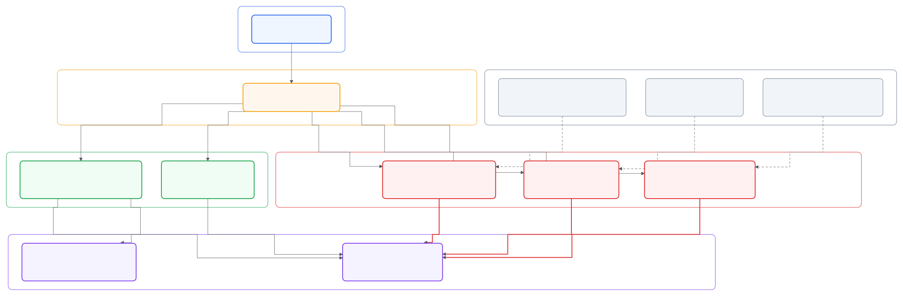

### Описание
Диаграмма «Simplified High-Level Hexagonal Architecture» из architecture-набора детализирует конкретный архитектурный компонент или подсистему BioETL. Она представлена в формате блок-схема потоков (flowchart) и служит ориентиром на уровне детализации «System / Component». В комментариях исходника зафиксирован фокус диаграммы: Simplified overview of Ports & Adapters pattern with essential layers only.. Схема имеет плотность порядка 13 узлов и 15 связей; её удобно использовать как обзорный архитектурный срез для проверки влияния изменений, согласования интерфейсов и подготовки рефакторинга, но не как исчерпывающий каталог текущей кодовой поверхности. Ключевые блоки/подграфы: External Systems, Interfaces Layer, Composition Layer, Application Layer, Domain Layer, Infrastructure Layer. Показательные узлы для быстрого чтения: External APIs (ChEMBL, PubMed, UniProt, etc.), File System (Delta Lake / Parquet), Observability (Prometheus, OpenTelemetry), CLI Commands, Bootstrap / Assembly, Core Pipeline (Executor, Transformer, Writer). Примечание: Simplified version of 01-high-level-hexagonal.mmd (46 nodes → 13 nodes).

### Метаданные
- Тип: `flowchart`
- Уровень: `System / Component`
- Дата: `2026-07-03`
- Узлы (metadata): `13`

\newpage

## 01-high-level-hexagonal

**High-Level Hexagonal Architecture**

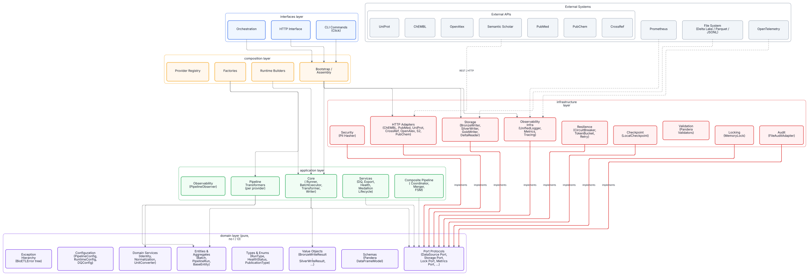

### Описание
Диаграмма «High-Level Hexagonal Architecture» из architecture-набора детализирует конкретный архитектурный компонент или подсистему BioETL. Она представлена в формате блок-схема потоков (flowchart) и служит ориентиром на уровне детализации «System / Component». В комментариях исходника зафиксирован фокус диаграммы: the Ports & Adapters (Hexagonal) pattern across all layers.. Схема имеет плотность порядка 46 узлов и 29 связей; её удобно использовать как обзорный архитектурный срез для проверки влияния изменений, согласования интерфейсов и подготовки рефакторинга, но не как исчерпывающий каталог текущей кодовой поверхности. Ключевые блоки/подграфы: External Systems, External APIs, interfaces layer, composition layer, application layer, domain layer (pure, no I/O). Показательные узлы для быстрого чтения: ChEMBL, PubMed, UniProt, PubChem, CrossRef, OpenAlex. Примечание: Decomposed into 01a, 01b, 01c sub-diagrams.

### Метаданные
- Тип: `flowchart`
- Уровень: `System / Component`
- Дата: `2026-02-24`
- Узлы (metadata): `46`

\newpage

## 01a-hexagonal-overview

**Hexagonal Overview**

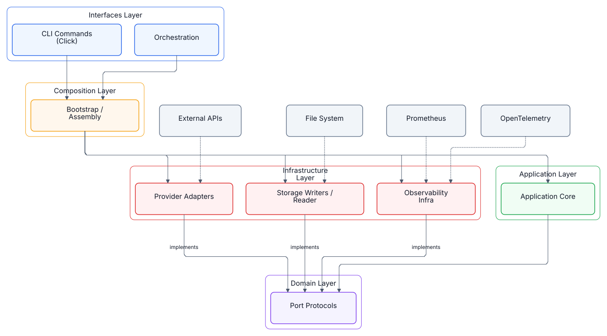

### Описание
Диаграмма «Hexagonal Overview» из architecture-набора детализирует конкретный архитектурный компонент или подсистему BioETL. Она представлена в формате блок-схема потоков (flowchart) и служит ориентиром на уровне детализации «System / Component». В комментариях исходника зафиксирован фокус диаграммы: Covers 5 architectural layers, external systems, and main dependency directions.. Схема имеет плотность порядка 11 узлов и 14 связей; её удобно использовать как обзорный архитектурный срез для проверки влияния изменений, согласования интерфейсов и подготовки рефакторинга, но не как исчерпывающий каталог текущей кодовой поверхности. Ключевые блоки/подграфы: Interfaces Layer, Composition Layer, Application Layer, Domain Layer, Infrastructure Layer. Показательные узлы для быстрого чтения: CLI Commands (Click), Orchestration, Bootstrap / Assembly, Application Core, Port Protocols, Provider Adapters.

### Метаданные
- Тип: `flowchart`
- Уровень: `System / Component`
- Дата: `2026-02-25`
- Узлы (metadata): `11`

\newpage

## 01b-hexagonal-domain-app

**Hexagonal Domain and Application**

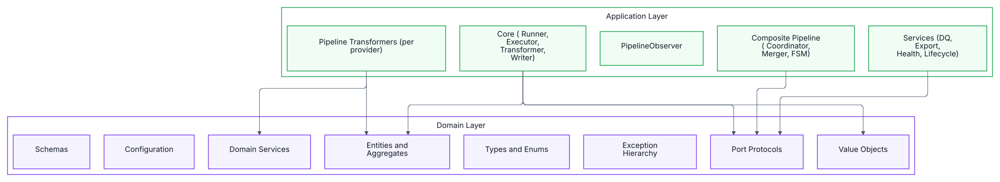

### Описание
Диаграмма «Hexagonal Domain and Application» из architecture-набора детализирует конкретный архитектурный компонент или подсистему BioETL. Она представлена в формате блок-схема потоков (flowchart) и служит ориентиром на уровне детализации «System / Component». В комментариях исходника зафиксирован фокус диаграммы: Covers domain contracts and core application services that depend on them.. Схема имеет плотность порядка 13 узлов и 7 связей; её удобно использовать как обзорный архитектурный срез для проверки влияния изменений, согласования интерфейсов и подготовки рефакторинга, но не как исчерпывающий каталог текущей кодовой поверхности. Ключевые блоки/подграфы: Application Layer, Domain Layer. Показательные узлы для быстрого чтения: Core (Runner, Executor, Transformer, Writer), Services (DQ, Export, Health, Lifecycle), Composite Pipeline (Coordinator, Merger, FSM), Pipeline Transformers (per provider), PipelineObserver, Port Protocols.

### Метаданные
- Тип: `flowchart`
- Уровень: `System / Component`
- Дата: `2026-02-25`
- Узлы (metadata): `13`

\newpage

## 01c-hexagonal-infra-comp

**Hexagonal Infrastructure and Composition**

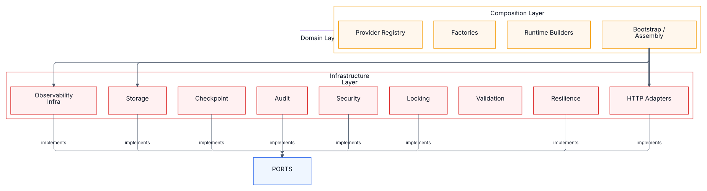

### Описание
Диаграмма «Hexagonal Infrastructure and Composition» из architecture-набора детализирует конкретный архитектурный компонент или подсистему BioETL. Она представлена в формате блок-схема потоков (flowchart) и служит ориентиром на уровне детализации «System / Component». В комментариях исходника зафиксирован фокус диаграммы: Covers infrastructure adapters and composition-root wiring points.. Схема имеет плотность порядка 14 узлов и 11 связей; её удобно использовать как обзорный архитектурный срез для проверки влияния изменений, согласования интерфейсов и подготовки рефакторинга, но не как исчерпывающий каталог текущей кодовой поверхности. Ключевые блоки/подграфы: Composition Layer, Infrastructure Layer, Domain Layer. Показательные узлы для быстрого чтения: Bootstrap / Assembly, Factories, Provider Registry, Runtime Builders, HTTP Adapters, Storage.

### Метаданные
- Тип: `flowchart`
- Уровень: `System / Component`
- Дата: `2026-02-25`
- Узлы (metadata): `14`

\newpage

## 01d-hexagonal-overview-rounded

**Hexagonal Overview (Rounded Nodes)**

### Описание
Диаграмма «Hexagonal Overview (Rounded Nodes)» из architecture-набора детализирует конкретный архитектурный компонент или подсистему BioETL. Она представлена в формате блок-схема потоков (flowchart) и служит ориентиром на уровне детализации «System / Component». В комментариях исходника зафиксирован фокус диаграммы: Covers 5 architectural layers, external systems, and main dependency directions.. Схема имеет плотность порядка 11 узлов и 14 связей; её удобно использовать как обзорный архитектурный срез для проверки влияния изменений, согласования интерфейсов и подготовки рефакторинга, но не как исчерпывающий каталог текущей кодовой поверхности. Ключевые блоки/подграфы: Interfaces Layer, Composition Layer, Application Layer, Domain Layer, Infrastructure Layer. Показательные узлы для быстрого чтения: CLI Commands (Click), Orchestration, Bootstrap / Assembly, Application Core, Port Protocols, Provider Adapters.

### Метаданные
- Тип: `flowchart`
- Уровень: `System / Component`
- Дата: `2026-03-01`
- Узлы (metadata): `11`

\newpage

## 02-layer-dependency-matrix

**Layer Dependency Matrix (ARCH-001)**

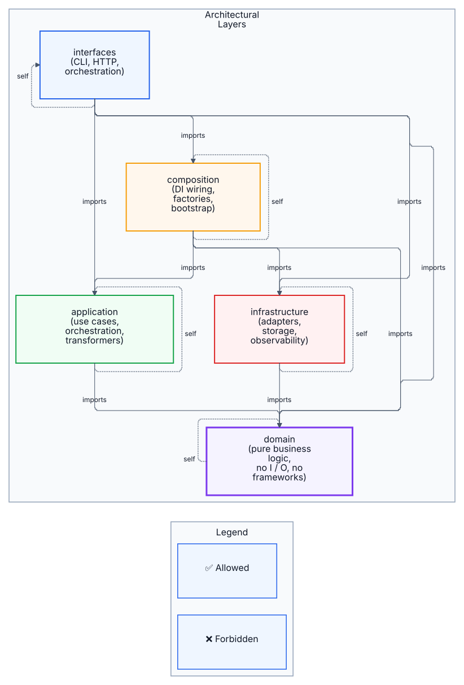

### Описание
Диаграмма «Layer Dependency Matrix (ARCH-001)» из architecture-набора детализирует конкретный архитектурный компонент или подсистему BioETL. Она представлена в формате блок-схема потоков (flowchart) и служит ориентиром на уровне детализации «System / Component». В комментариях исходника зафиксирован фокус диаграммы: Enforced import boundaries between architectural layers.. Схема имеет плотность порядка 5 узлов и 14 связей; её удобно использовать как обзорный архитектурный срез для проверки влияния изменений, согласования интерфейсов и подготовки рефакторинга, но не как исчерпывающий каталог текущей кодовой поверхности. Ключевые блоки/подграфы: Legend, Architectural Layers. Показательные узлы для быстрого чтения: ✅ Allowed, ❌ Forbidden, domain (pure business logic, no I/O, no frameworks), application (use cases, orchestration, transformers), infrastructure (adapters, storage, observability), composition (DI wiring, factories, bootstrap).

### Метаданные
- Тип: `flowchart`
- Уровень: `System / Component`
- Дата: `2026-02-24`
- Узлы (metadata): `5`

\newpage

## 03-medallion-data-flow

**Medallion Architecture Data Flow (Bronze → Silver → Gold)**

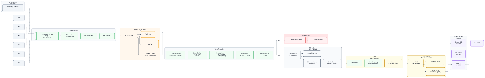

### Описание
Диаграмма «Medallion Architecture Data Flow (Bronze → Silver → Gold)» из architecture-набора детализирует конкретный архитектурный компонент или подсистему BioETL. Она представлена в формате блок-схема потоков (flowchart) и служит ориентиром на уровне детализации «System / Component». В комментариях исходника зафиксирован фокус диаграммы: how data flows through the three medallion layers.. Схема имеет плотность порядка 36 узлов и 31 связей; её удобно использовать как обзорный архитектурный срез для проверки влияния изменений, согласования интерфейсов и подготовки рефакторинга, но не как исчерпывающий каталог текущей кодовой поверхности. Ключевые блоки/подграфы: External Data Sources, Data Ingestion, Bronze Layer (Raw), Transformation, Silver Layer (Normalized), Gold Transformation. Показательные узлы для быстрого чтения: Semantic Scholar API, DataSourcePort fetch() / fetch_filtered(), RateLimiter (TokenBucket), CircuitBreaker, Retry Logic, BronzeWriter. Примечание: Canonical medallion flow — at threshold boundary.

### Метаданные
- Тип: `flowchart`
- Уровень: `System / Component`
- Дата: `2026-02-24`
- Узлы (metadata): `36`

\newpage

## 03a-medallion-layers-overview

**Medallion Layers Overview**

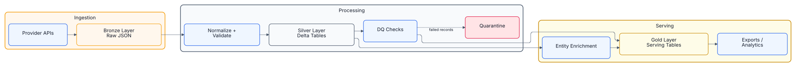

### Описание
Диаграмма «Medallion Layers Overview» из architecture-набора детализирует конкретный архитектурный компонент или подсистему BioETL. Она представлена в формате блок-схема потоков (flowchart) и служит ориентиром на уровне детализации «System / Component». В комментариях исходника зафиксирован фокус диаграммы: Compact decomposition view for 03-medallion-data-flow.mmd (layer-level semantics). Схема имеет плотность порядка 12 узлов и 9 связей; её удобно использовать как обзорный архитектурный срез для проверки влияния изменений, согласования интерфейсов и подготовки рефакторинга, но не как исчерпывающий каталог текущей кодовой поверхности. Ключевые блоки/подграфы: Ingestion, Processing, Serving. Показательные узлы для быстрого чтения: Provider APIs, Bronze Layer\nRaw JSON, Normalize + Validate, Silver Layer\nDelta Tables, DQ Checks, Quarantine. Связанный ADR: ADR-002, ADR-040.

### Метаданные
- Тип: `flowchart`
- Уровень: `System / Component`
- Дата: `2026-02-27`
- Узлы (metadata): `12`
- ADR: `ADR-002, ADR-040`

\newpage

## 04-pipeline-execution-flow

**Pipeline Execution Lifecycle**

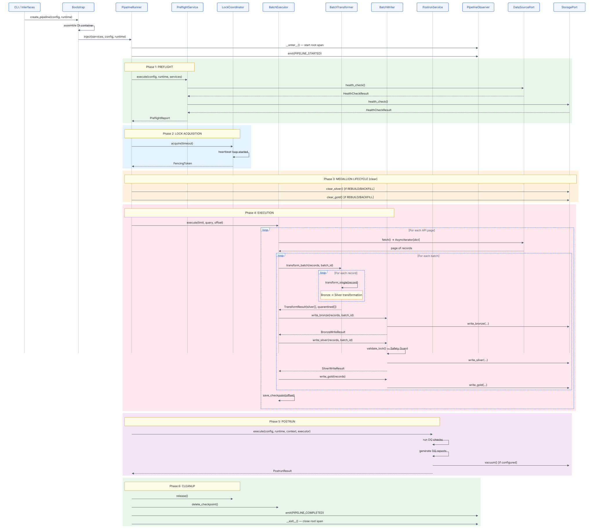

### Описание
Диаграмма «Pipeline Execution Lifecycle» из architecture-набора детализирует конкретный архитектурный компонент или подсистему BioETL. Она представлена в формате диаграмма последовательности (sequence) и служит ориентиром на уровне детализации «System / Component». В комментариях исходника зафиксирован фокус диаграммы: Sequence of phases in a single pipeline run.. Схема имеет плотность порядка 12 узлов и 9 связей; её удобно использовать как обзорный архитектурный срез для проверки влияния изменений, согласования интерфейсов и подготовки рефакторинга, но не как исчерпывающий каталог текущей кодовой поверхности.

### Метаданные
- Тип: `sequenceDiagram`
- Уровень: `System / Component`
- Дата: `2026-02-24`
- Узлы (metadata): `12`

\newpage

## 05-provider-adapter-hierarchy

**Provider Adapter Hierarchy**

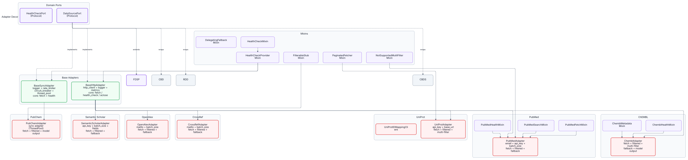

### Описание
Диаграмма «Provider Adapter Hierarchy» из architecture-набора детализирует конкретный архитектурный компонент или подсистему BioETL. Она представлена в формате блок-схема потоков (flowchart) и служит ориентиром на уровне детализации «System / Component». В комментариях исходника зафиксирован фокус диаграммы: how each provider adapter inherits from base classes and implements DataSourcePort.. Схема имеет плотность порядка 27 узлов и 24 связей; её удобно использовать как обзорный архитектурный срез для проверки влияния изменений, согласования интерфейсов и подготовки рефакторинга, но не как исчерпывающий каталог текущей кодовой поверхности. Ключевые блоки/подграфы: Domain Ports, Mixins, Base Adapters, ChEMBL, PubMed, UniProt. Показательные узлы для быстрого чтения: DataSourcePort (Protocol), HealthCheckPort (Protocol), HealthCheckMixin, HealthCheckProviderMixin, NotSupportedMultiFilterMixin, DelegatingFallbackMixin. Примечание: Decomposed into 05a, 05b sub-diagrams.

### Метаданные
- Тип: `flowchart`
- Уровень: `System / Component`
- Дата: `2026-02-24`
- Узлы (metadata): `27`

\newpage

## 05a-adapter-hierarchy-base

**Adapter Hierarchy: Base Types**

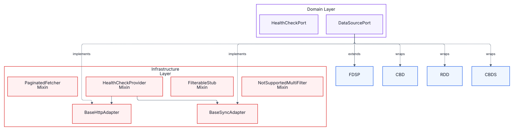

### Описание
Диаграмма «Adapter Hierarchy: Base Types» из architecture-набора детализирует конкретный архитектурный компонент или подсистему BioETL. Она представлена в формате блок-схема потоков (flowchart) и служит ориентиром на уровне детализации «System / Component». В комментариях исходника зафиксирован фокус диаграммы: Covers core ports, base adapters, reusable mixins, and adapter decorators.. Схема имеет плотность порядка 12 узлов и 8 связей; её удобно использовать как обзорный архитектурный срез для проверки влияния изменений, согласования интерфейсов и подготовки рефакторинга, но не как исчерпывающий каталог текущей кодовой поверхности. Ключевые блоки/подграфы: Domain Layer, Infrastructure Layer. Показательные узлы для быстрого чтения: DataSourcePort, HealthCheckPort, HealthCheckProviderMixin, NotSupportedMultiFilterMixin, FilterableStubMixin, PaginatedFetcherMixin.

### Метаданные
- Тип: `flowchart`
- Уровень: `System / Component`
- Дата: `2026-02-25`
- Узлы (metadata): `12`

\newpage

## 05b-adapter-hierarchy-providers

**Adapter Hierarchy: Provider Implementations**

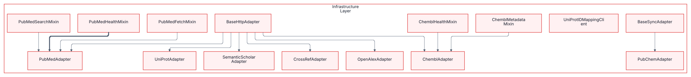

### Описание
Диаграмма «Adapter Hierarchy: Provider Implementations» из architecture-набора детализирует конкретный архитектурный компонент или подсистему BioETL. Она представлена в формате блок-схема потоков (flowchart) и служит ориентиром на уровне детализации «System / Component». В комментариях исходника зафиксирован фокус диаграммы: Covers concrete provider adapters and provider-specific mixins.. Схема имеет плотность порядка 15 узлов и 12 связей; её удобно использовать как обзорный архитектурный срез для проверки влияния изменений, согласования интерфейсов и подготовки рефакторинга, но не как исчерпывающий каталог текущей кодовой поверхности. Ключевые блоки/подграфы: Infrastructure Layer. Показательные узлы для быстрого чтения: BaseHttpAdapter, BaseSyncAdapter, ChemblAdapter, PubMedAdapter, UniProtAdapter, CrossRefAdapter.

### Метаданные
- Тип: `flowchart`
- Уровень: `System / Component`
- Дата: `2026-02-25`
- Узлы (metadata): `15`

\newpage

## 06-storage-layer

**Storage Layer Components**

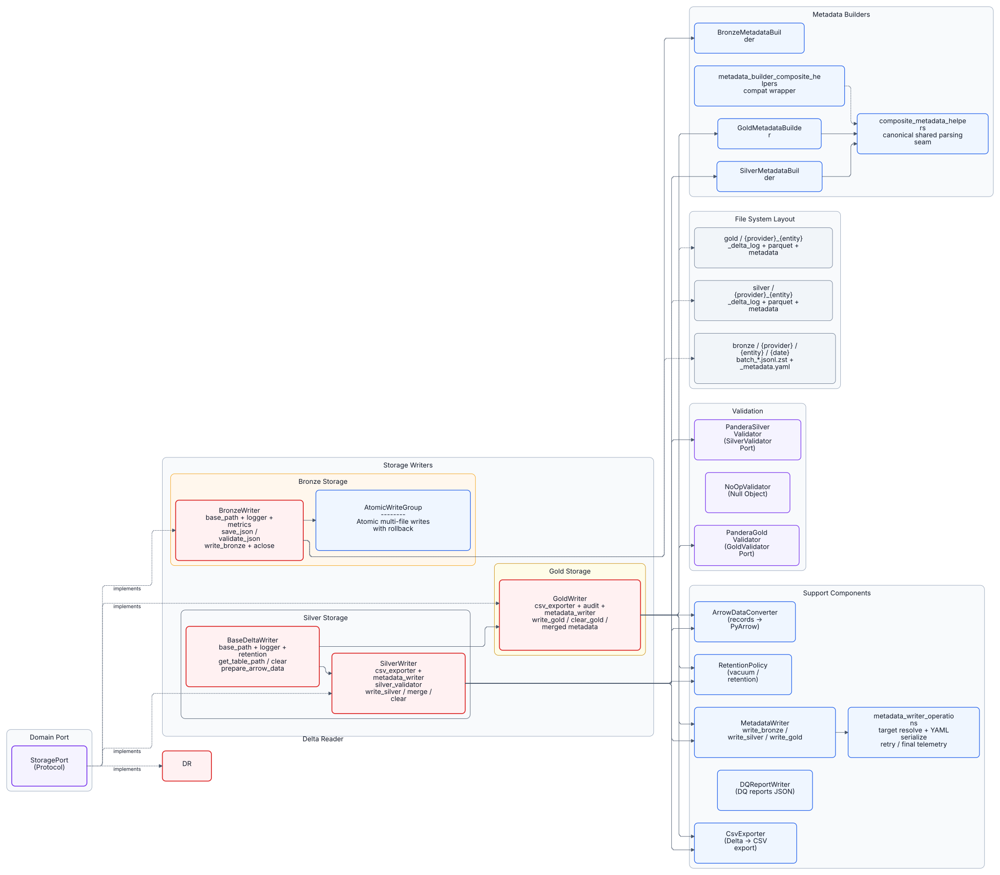

### Описание
Диаграмма «Storage Layer Components» из architecture-набора детализирует конкретный архитектурный компонент или подсистему BioETL. Она представлена в формате блок-схема потоков (flowchart) и служит ориентиром на уровне детализации «System / Component». В комментариях исходника зафиксирован фокус диаграммы: Bronze/Silver/Gold writers, metadata sidecar zones, Delta Lake, and validation.. Схема имеет плотность порядка 23 узлов и 27 связей; её удобно использовать как обзорный архитектурный срез для проверки влияния изменений, согласования интерфейсов и подготовки рефакторинга, но не как исчерпывающий каталог текущей кодовой поверхности. Ключевые блоки/подграфы: Domain Storage Ports, Storage Writers, Bronze Storage, Silver Storage, Gold Storage, Delta Reader. Показательные узлы для быстрого чтения: BronzeStoragePort / SilverStoragePort GoldStoragePort / MergedStoragePort, AtomicWriteGroup ━━━━━━━━━━━━━━━━━ Atomic multi-file writes with rollback, ArrowDataConverter (records → PyArrow), RetentionPolicy (vacuum/retention), MetadataWriter write_bronze / write_silver / write_gold, CsvExporter (Delta → CSV export). Примечание: Decomposed into 06a-storage-writers, 06b-storage-support.

### Метаданные
- Тип: `flowchart`
- Уровень: `System / Component`
- Дата: `2026-03-19`
- Узлы (metadata): `23`

\newpage

## 06a-storage-writers

**Storage Writers**

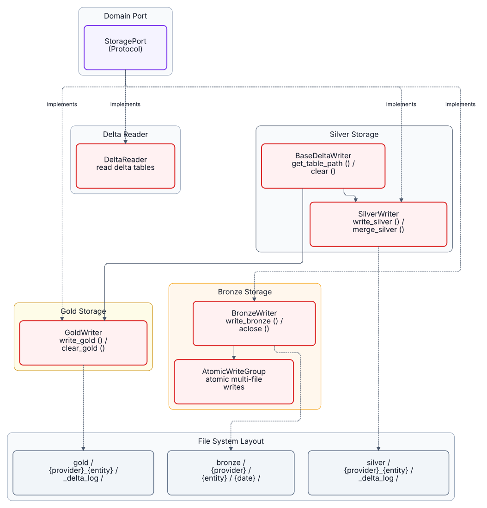

### Описание
Диаграмма «Storage Writers» из architecture-набора детализирует конкретный архитектурный компонент или подсистему BioETL. Она представлена в формате блок-схема потоков (flowchart) и служит ориентиром на уровне детализации «System / Component». В комментариях исходника зафиксирован фокус диаграммы: Bronze/Silver/Gold writers with Delta Lake base class, port contract, and file system layout.. Схема имеет плотность порядка 10 узлов и 10 связей; её удобно использовать как обзорный архитектурный срез для проверки влияния изменений, согласования интерфейсов и подготовки рефакторинга, но не как исчерпывающий каталог текущей кодовой поверхности. Ключевые блоки/подграфы: Domain Storage Ports, Bronze Storage, Silver Storage, Gold Storage, Delta Reader, File System Layout. Показательные узлы для быстрого чтения: BronzeStoragePort / SilverStoragePort GoldStoragePort / MergedStoragePort, BronzeWriter write_bronze() / aclose(), AtomicWriteGroup atomic multi-file writes, BaseDeltaWriter get_table_path() / clear(), SilverWriter write_silver() / merge_silver(), GoldWriter write_gold() / clear_gold().

### Метаданные
- Тип: `flowchart`
- Уровень: `System / Component`
- Дата: `2026-02-27`
- Узлы (metadata): `10`

\newpage

## 06b-storage-support

**Storage Support Components**

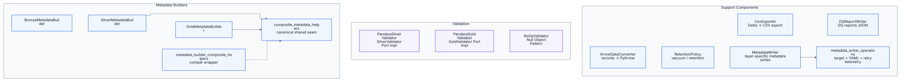

### Описание
Диаграмма «Storage Support Components» из architecture-набора детализирует конкретный архитектурный компонент или подсистему BioETL. Она представлена в формате блок-схема потоков (flowchart) и служит ориентиром на уровне детализации «System / Component». В комментариях исходника зафиксирован фокус диаграммы: Support utilities, metadata write-preparation zones, validators, and metadata builders for the storage layer.. Схема имеет плотность порядка 14 узлов и 11 связей; её удобно использовать как обзорный архитектурный срез для проверки влияния изменений, согласования интерфейсов и подготовки рефакторинга, но не как исчерпывающий каталог текущей кодовой поверхности. Ключевые блоки/подграфы: Support Components, Validation, Metadata Builders. Показательные узлы для быстрого чтения: ArrowDataConverter records → PyArrow, RetentionPolicy vacuum / retention, MetadataWriter layer-specific metadata writes, metadata_writer_operations target + YAML + retry telemetry, CsvExporter Delta → CSV export, DQReportWriter DQ reports JSON.

### Метаданные
- Тип: `flowchart`
- Уровень: `System / Component`
- Дата: `2026-03-19`
- Узлы (metadata): `14`

\newpage

## 07-dq-system

**Data Quality (DQ) System**

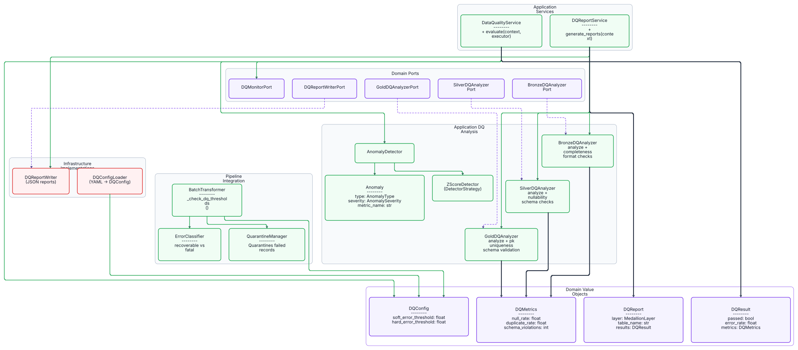

### Описание
Диаграмма «Data Quality (DQ) System» из architecture-набора детализирует конкретный архитектурный компонент или подсистему BioETL. Она представлена в формате блок-схема потоков (flowchart) и служит ориентиром на уровне детализации «System / Component». В комментариях исходника зафиксирован фокус диаграммы: DQ monitoring, analysis, and reporting across all medallion layers.. Схема имеет плотность порядка 22 узлов и 24 связей; её удобно использовать как обзорный архитектурный срез для проверки влияния изменений, согласования интерфейсов и подготовки рефакторинга, но не как исчерпывающий каталог текущей кодовой поверхности. Ключевые блоки/подграфы: Domain Ports, Application Services, Application DQ Analysis, Pipeline Integration, Domain Value Objects, Infrastructure Implementations. Показательные узлы для быстрого чтения: DQMonitorPort, BronzeDQAnalyzerPort, SilverDQAnalyzerPort, GoldDQAnalyzerPort, DQReportWriterPort, DataQualityService -------- + evaluate(context, executor). Примечание: Decomposed into 07a-dq-analysis, 07b-dq-pipeline.

### Метаданные
- Тип: `flowchart`
- Уровень: `System / Component`
- Дата: `2026-02-27`
- Узлы (metadata): `22`

\newpage

## 07a-dq-analysis

**DQ Analysis Services**

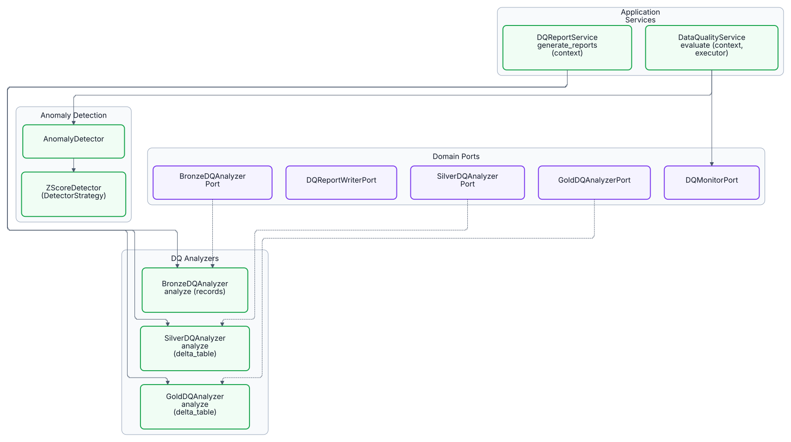

### Описание
Диаграмма «DQ Analysis Services» из architecture-набора детализирует конкретный архитектурный компонент или подсистему BioETL. Она представлена в формате блок-схема потоков (flowchart) и служит ориентиром на уровне детализации «System / Component». В комментариях исходника зафиксирован фокус диаграммы: Domain ports, application services, analyzers, and anomaly detection for Data Quality.. Схема имеет плотность порядка 12 узлов и 11 связей; её удобно использовать как обзорный архитектурный срез для проверки влияния изменений, согласования интерфейсов и подготовки рефакторинга, но не как исчерпывающий каталог текущей кодовой поверхности. Ключевые блоки/подграфы: Domain Ports, Application Services, DQ Analyzers, Anomaly Detection. Показательные узлы для быстрого чтения: DQMonitorPort, BronzeDQAnalyzerPort, SilverDQAnalyzerPort, GoldDQAnalyzerPort, DQReportWriterPort, DataQualityService evaluate(context, executor).

### Метаданные
- Тип: `flowchart`
- Уровень: `System / Component`
- Дата: `2026-02-27`
- Узлы (metadata): `12`

\newpage

## 07b-dq-pipeline

**DQ Pipeline Integration**

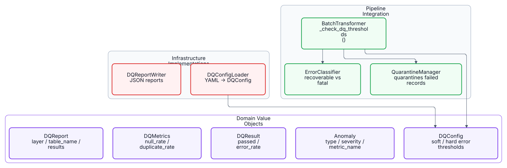

### Описание
Диаграмма «DQ Pipeline Integration» из architecture-набора детализирует конкретный архитектурный компонент или подсистему BioETL. Она представлена в формате блок-схема потоков (flowchart) и служит ориентиром на уровне детализации «System / Component». В комментариях исходника зафиксирован фокус диаграммы: Pipeline DQ checks, domain value objects, and infrastructure config/report writers.. Схема имеет плотность порядка 10 узлов и 4 связей; её удобно использовать как обзорный архитектурный срез для проверки влияния изменений, согласования интерфейсов и подготовки рефакторинга, но не как исчерпывающий каталог текущей кодовой поверхности. Ключевые блоки/подграфы: Pipeline Integration, Domain Value Objects, Infrastructure Implementations. Показательные узлы для быстрого чтения: BatchTransformer _check_dq_thresholds(), QuarantineManager quarantines failed records, ErrorClassifier recoverable vs fatal, DQMetrics null_rate / duplicate_rate, DQResult passed / error_rate, DQReport layer / table_name / results.

### Метаданные
- Тип: `flowchart`
- Уровень: `System / Component`
- Дата: `2026-02-27`
- Узлы (metadata): `10`

\newpage

## 08-composite-pipeline

**Composite Pipeline Architecture**

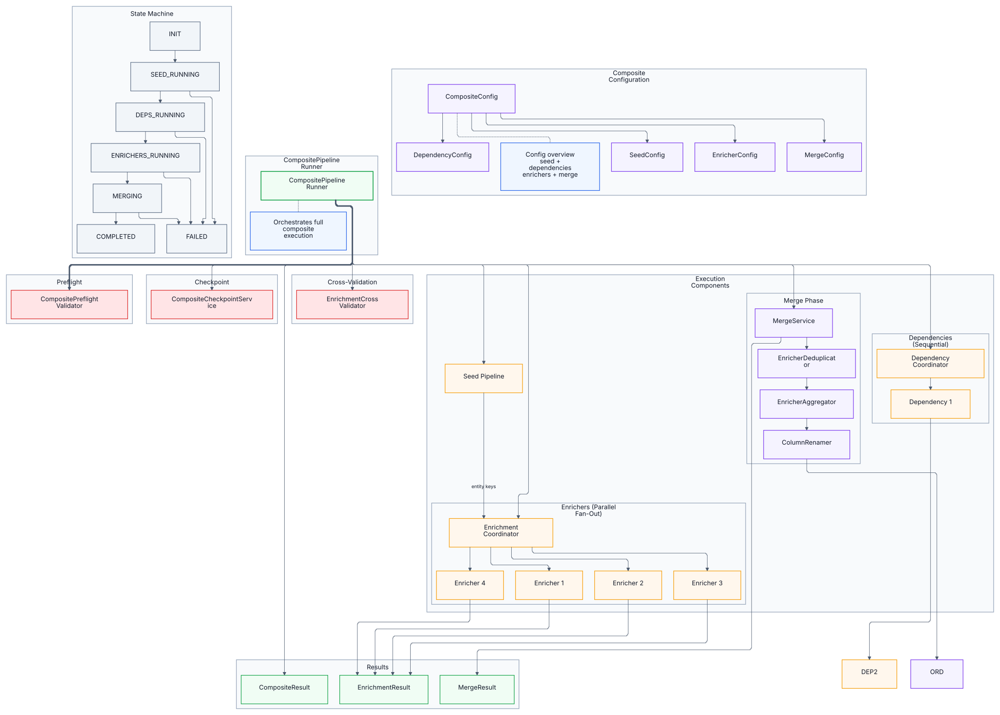

### Описание
Диаграмма «Composite Pipeline Architecture» из architecture-набора детализирует конкретный архитектурный компонент или подсистему BioETL. Она представлена в формате блок-схема потоков (flowchart) и служит ориентиром на уровне детализации «System / Component». В комментариях исходника зафиксирован фокус диаграммы: seed → dependencies → enrichers (parallel) → merge flow.. Схема имеет плотность порядка 33 узлов и 34 связей; её удобно использовать как обзорный архитектурный срез для проверки влияния изменений, согласования интерфейсов и подготовки рефакторинга, но не как исчерпывающий каталог текущей кодовой поверхности. Ключевые блоки/подграфы: Composite Configuration, CompositePipelineRunner, State Machine, Execution Components, Dependencies (Sequential), Enrichers (Parallel Fan-Out). Показательные узлы для быстрого чтения: CompositeConfig, SeedConfig, DependencyConfig, EnricherConfig, MergeConfig, Config overview seed + dependencies enrichers + merge. Примечание: Decomposed into 08a-composite-config, 08b-composite-execution.

### Метаданные
- Тип: `flowchart`
- Уровень: `System / Component`
- Дата: `2026-02-24`
- Узлы (metadata): `33`

\newpage

## 08a-composite-config

**Composite Pipeline Configuration & FSM**

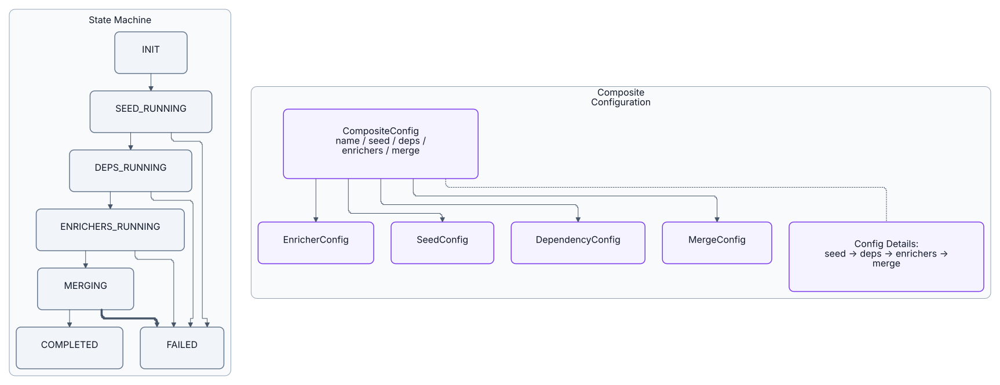

### Описание
Диаграмма «Composite Pipeline Configuration & FSM» из architecture-набора детализирует конкретный архитектурный компонент или подсистему BioETL. Она представлена в формате блок-схема потоков (flowchart) и служит ориентиром на уровне детализации «System / Component». В комментариях исходника зафиксирован фокус диаграммы: Config hierarchy (CompositeConfig → sub-configs) and execution state machine.. Схема имеет плотность порядка 13 узлов и 13 связей; её удобно использовать как обзорный архитектурный срез для проверки влияния изменений, согласования интерфейсов и подготовки рефакторинга, но не как исчерпывающий каталог текущей кодовой поверхности. Ключевые блоки/подграфы: Composite Configuration, State Machine. Показательные узлы для быстрого чтения: CompositeConfig name / seed / deps / enrichers / merge, SeedConfig, DependencyConfig, EnricherConfig, MergeConfig, Config Details: seed → deps → enrichers → merge.

### Метаданные
- Тип: `flowchart`
- Уровень: `System / Component`
- Дата: `2026-02-27`
- Узлы (metadata): `13`

\newpage

## 08b-composite-execution

**Composite Pipeline Execution**

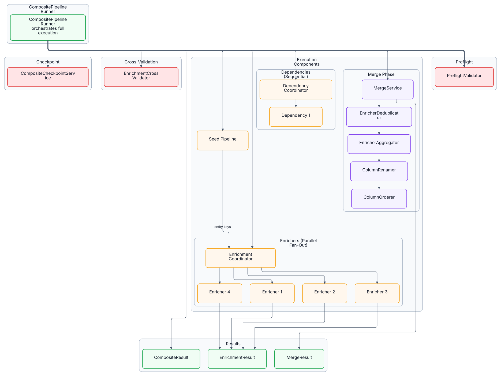

### Описание
Диаграмма «Composite Pipeline Execution» из architecture-набора детализирует конкретный архитектурный компонент или подсистему BioETL. Она представлена в формате блок-схема потоков (flowchart) и служит ориентиром на уровне детализации «System / Component». В комментариях исходника зафиксирован фокус диаграммы: Runner orchestration: seed → deps → enrichers (parallel) → merge, with checkpointing and cross-validation.. Схема имеет плотность порядка 20 узлов и 20 связей; её удобно использовать как обзорный архитектурный срез для проверки влияния изменений, согласования интерфейсов и подготовки рефакторинга, но не как исчерпывающий каталог текущей кодовой поверхности. Ключевые блоки/подграфы: CompositePipelineRunner, Preflight, Execution Components, Dependencies (Sequential), Enrichers (Parallel Fan-Out), Merge Phase. Показательные узлы для быстрого чтения: CompositePipelineRunner orchestrates full execution, PreflightValidator, Seed Pipeline, DependencyCoordinator, Dependency 1, EnrichmentCoordinator.

### Метаданные
- Тип: `flowchart`
- Уровень: `System / Component`
- Дата: `2026-02-27`
- Узлы (metadata): `20`

\newpage

## 09-observability-stack

**Observability Stack**

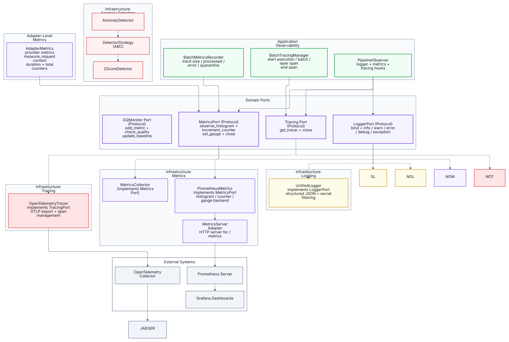

### Описание
Диаграмма «Observability Stack» из architecture-набора детализирует конкретный архитектурный компонент или подсистему BioETL. Она представлена в формате блок-схема потоков (flowchart) и служит ориентиром на уровне детализации «System / Component». В комментариях исходника зафиксирован фокус диаграммы: Logging, Metrics, Tracing architecture.. Схема имеет плотность порядка 24 узлов и 13 связей; её удобно использовать как обзорный архитектурный срез для проверки влияния изменений, согласования интерфейсов и подготовки рефакторинга, но не как исчерпывающий каталог текущей кодовой поверхности. Ключевые блоки/подграфы: Domain Ports, Application Emission, Composition-Owned Seams, Infrastructure: Logging, Infrastructure: Metrics, Infrastructure: Tracing. Показательные узлы для быстрого чтения: LoggerPort (Protocol) bind + info/warn/error/debug/exception, MetricsPort (Protocol) observe_histogram + increment_counter set_gauge + close, TracingPort (Protocol) get_tracer + close, DQMonitorPort (Protocol) add_metric + check_quality update_baseline, PipelineObserver canonical lifecycle emitter ordinary runs, PipelineMetricsRecorder pipeline-scoped metric vocabulary. Примечание: Decomposed into 09a-observability-app, 09b-observability-infra.

### Метаданные
- Тип: `flowchart`
- Уровень: `System / Component`
- Дата: `2026-04-12`
- Узлы (metadata): `24`

\newpage

## 09a-observability-app

**Observability: Application Layer**

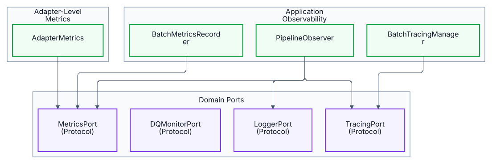

### Описание
Диаграмма «Observability: Application Layer» из architecture-набора детализирует конкретный архитектурный компонент или подсистему BioETL. Она представлена в формате блок-схема потоков (flowchart) и служит ориентиром на уровне детализации «System / Component». В комментариях исходника зафиксирован фокус диаграммы: Application-level observability: ports, pipeline observer, batch metrics, adapter metrics.. Схема имеет плотность порядка 10 узлов и 6 связей; её удобно использовать как обзорный архитектурный срез для проверки влияния изменений, согласования интерфейсов и подготовки рефакторинга, но не как исчерпывающий каталог текущей кодовой поверхности. Ключевые блоки/подграфы: Domain Ports, Application Observability. Показательные узлы для быстрого чтения: LoggerPort (Protocol), MetricsPort (Protocol), TracingPort (Protocol), DQMonitorPort (Protocol), PipelineObserver canonical lifecycle emitter, PipelineMetricsRecorder.

### Метаданные
- Тип: `flowchart`
- Уровень: `System / Component`
- Дата: `2026-04-12`
- Узлы (metadata): `10`

\newpage

## 09b-observability-infra

**Observability: Infrastructure Layer**

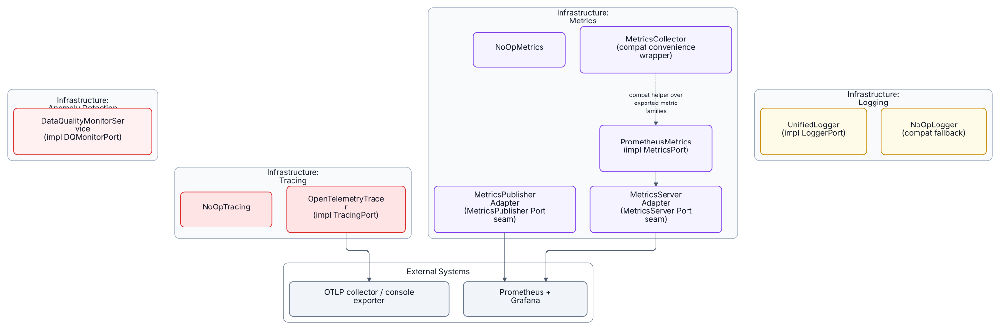

### Описание
Диаграмма «Observability: Infrastructure Layer» из architecture-набора детализирует конкретный архитектурный компонент или подсистему BioETL. Она представлена в формате блок-схема потоков (flowchart) и служит ориентиром на уровне детализации «System / Component». В комментариях исходника зафиксирован фокус диаграммы: Infrastructure implementations: logging, metrics, tracing, anomaly detection, external systems.. Схема имеет плотность порядка 12 узлов и 4 связей; её удобно использовать как обзорный архитектурный срез для проверки влияния изменений, согласования интерфейсов и подготовки рефакторинга, но не как исчерпывающий каталог текущей кодовой поверхности. Ключевые блоки/подграфы: Infrastructure: Logging, Infrastructure: Metrics, Infrastructure: Tracing, Infrastructure: Anomaly Detection, External Systems. Показательные узлы для быстрого чтения: UnifiedLogger (impl LoggerPort), NoOpLogger (compat fallback), PrometheusMetrics (impl MetricsPort), MetricsServerAdapter (MetricsServerPort seam), MetricsPublisherAdapter (MetricsPublisherPort seam), MetricsCollector (compat convenience wrapper).

### Метаданные
- Тип: `flowchart`
- Уровень: `System / Component`
- Дата: `2026-04-12`
- Узлы (metadata): `12`

\newpage

## 10-resilience-patterns

**Resilience Patterns**

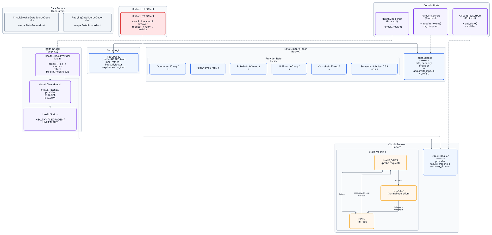

### Описание
Диаграмма «Resilience Patterns» из architecture-набора детализирует конкретный архитектурный компонент или подсистему BioETL. Она представлена в формате блок-схема потоков (flowchart) и служит ориентиром на уровне детализации «System / Component». В комментариях исходника зафиксирован фокус диаграммы: Circuit Breaker, Rate Limiter, Retry, Health Check patterns.. Схема имеет плотность порядка 15 узлов и 13 связей; её удобно использовать как обзорный архитектурный срез для проверки влияния изменений, согласования интерфейсов и подготовки рефакторинга, но не как исчерпывающий каталог текущей кодовой поверхности. Ключевые блоки/подграфы: Domain Ports, Circuit Breaker Pattern, State Machine, Rate Limiter (Token Bucket), Provider Rate Limits, Retry Logic. Показательные узлы для быстрого чтения: CircuitBreakerPort (Protocol) -------- + get_state() + call(fn), RateLimiterPort (Protocol) -------- + acquire(tokens) + try_acquire(), HealthCheckPort (Protocol) -------- + check_health(), CircuitBreaker -------- provider failure_threshold recovery_timeout, CLOSED (normal operation), OPEN (fail fast).

### Метаданные
- Тип: `flowchart`
- Уровень: `System / Component`
- Дата: `2026-02-24`
- Узлы (metadata): `15`

\newpage

## 11-configuration-system

**Configuration System**

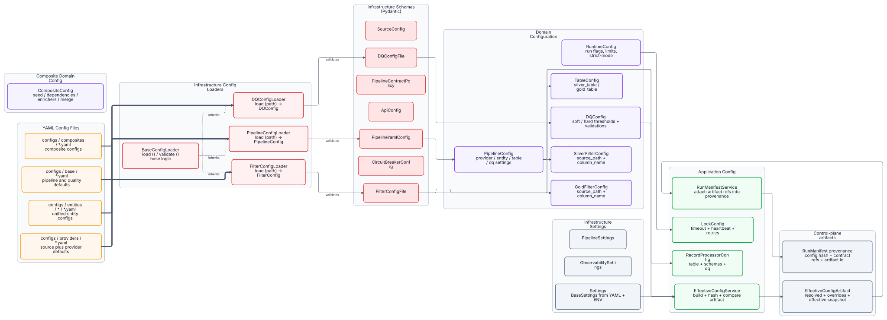

### Описание
Диаграмма «Configuration System» из architecture-набора детализирует конкретный архитектурный компонент или подсистему BioETL. Она представлена в формате блок-схема потоков (flowchart) и служит ориентиром на уровне детализации «System / Component». В комментариях исходника зафиксирован фокус диаграммы: how YAML configs are loaded, validated, and published as effective-config and manifest provenance artifacts.. Схема имеет плотность порядка 31 узлов и 31 связей; её удобно использовать как обзорный архитектурный срез для проверки влияния изменений, согласования интерфейсов и подготовки рефакторинга, но не как исчерпывающий каталог текущей кодовой поверхности. Ключевые блоки/подграфы: YAML Config Files, Infrastructure Config Loaders, Infrastructure Schemas (Pydantic), Domain Configuration, Composite Domain Config, Application Config. Показательные узлы для быстрого чтения: configs/base/*.yaml pipeline and quality defaults, configs/providers/*.yaml source plus provider defaults, configs/entities/*/*.yaml unified entity configs, configs/composites/*.yaml composite configs, PipelineConfigLoader load(path) -> PipelineConfig, DQConfigLoader load(path) -> DQConfig. Примечание: Decomposed into 11a-config-loading, 11b-config-domain.

### Метаданные
- Тип: `flowchart`
- Уровень: `System / Component`
- Дата: `2026-03-28`
- Узлы (metadata): `31`

\newpage

## 11a-config-loading

**Configuration: Loading Pipeline**

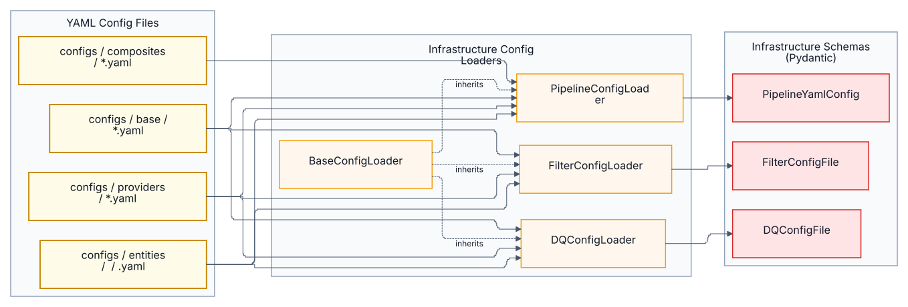

### Описание
Диаграмма «Configuration: Loading Pipeline» из architecture-набора детализирует конкретный архитектурный компонент или подсистему BioETL. Она представлена в формате блок-схема потоков (flowchart) и служит ориентиром на уровне детализации «System / Component». В комментариях исходника зафиксирован фокус диаграммы: YAML files, config loaders, and infrastructure schemas (Pydantic validation).. Схема имеет плотность порядка 11 узлов и 16 связей; её удобно использовать как обзорный архитектурный срез для проверки влияния изменений, согласования интерфейсов и подготовки рефакторинга, но не как исчерпывающий каталог текущей кодовой поверхности. Ключевые блоки/подграфы: YAML Config Files, Infrastructure Config Loaders, Infrastructure Schemas (Pydantic). Показательные узлы для быстрого чтения: configs/base/*.yaml, configs/providers/*.yaml, configs/entities/*/*.yaml, configs/composites/*.yaml, BaseConfigLoader, PipelineConfigLoader.

### Метаданные
- Тип: `flowchart`
- Уровень: `System / Component`
- Дата: `2026-02-27`
- Узлы (metadata): `11`

\newpage

## 11b-config-domain

**Configuration: Domain & Application Config**

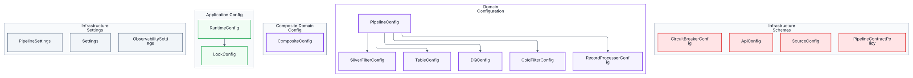

### Описание
Диаграмма «Configuration: Domain & Application Config» из architecture-набора детализирует конкретный архитектурный компонент или подсистему BioETL. Она представлена в формате блок-схема потоков (flowchart) и служит ориентиром на уровне детализации «System / Component». В комментариях исходника зафиксирован фокус диаграммы: Domain config objects, composite config, application config, and infrastructure settings.. Схема имеет плотность порядка 16 узлов и 6 связей; её удобно использовать как обзорный архитектурный срез для проверки влияния изменений, согласования интерфейсов и подготовки рефакторинга, но не как исчерпывающий каталог текущей кодовой поверхности. Ключевые блоки/подграфы: Infrastructure Schemas, Domain Configuration, Composite Domain Config, Application Config, Infrastructure Settings. Показательные узлы для быстрого чтения: ApiConfig, SourceConfig, CircuitBreakerConfig, PipelineContractPolicy, PipelineConfig, TableConfig.

### Метаданные
- Тип: `flowchart`
- Уровень: `System / Component`
- Дата: `2026-02-27`
- Узлы (metadata): `16`

\newpage

## 12-bootstrap-di-container

**Bootstrap / DI Container (Composition Root)**

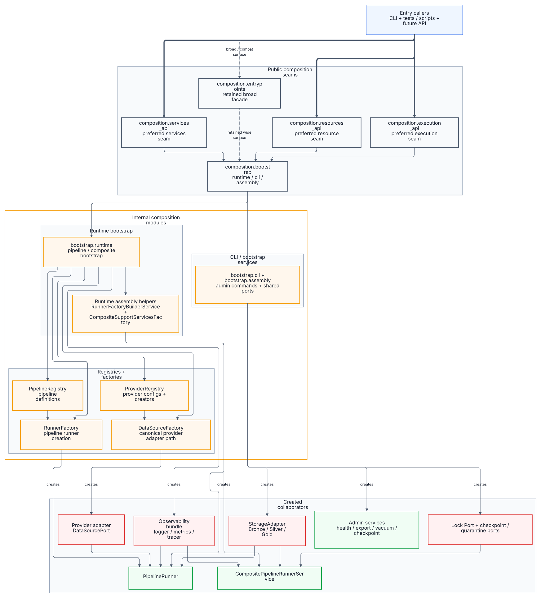

### Описание
Диаграмма «Bootstrap / DI Container (Composition Root)» из architecture-набора детализирует конкретный архитектурный компонент или подсистему BioETL. Она представлена в формате блок-схема потоков (flowchart) и служит ориентиром на уровне детализации «System / Component». В комментариях исходника зафиксирован фокус диаграммы: current public composition seams, runtime assembly, and control-plane artifact wiring.. Схема имеет плотность порядка 25 узлов и 39 связей; её удобно использовать как обзорный архитектурный срез для проверки влияния изменений, согласования интерфейсов и подготовки рефакторинга, но не как исчерпывающий каталог текущей кодовой поверхности. Ключевые блоки/подграфы: Public composition seams, Registries + factories, Runtime assembly path, Admin / support bootstrap, Created services + artifacts. Показательные узлы для быстрого чтения: Entry callers CLI + tests/scripts + programmatic integrations, composition.entrypoints broad public facade, execution_api / control_plane_api / health_api maintenance_api / resources_api, composition.bootstrap lower-level runtime / cli seam, ProviderRegistry provider creators + source defaults, PipelineRegistry pipeline factory lookup. Примечание: Decomposed into 12a, 12b sub-diagrams; complements 19-control-plane-artifacts.mmd.

### Метаданные
- Тип: `flowchart`
- Уровень: `System / Component`
- Дата: `2026-03-28`
- Узлы (metadata): `25`

\newpage

## 12a-bootstrap-factories

**Bootstrap: Registries, Public APIs, and Factory Seams**

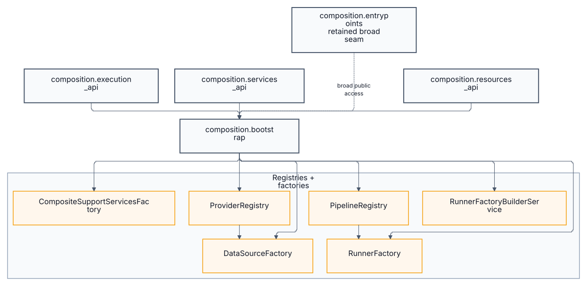

### Описание
Диаграмма «Bootstrap: Registries, Public APIs, and Factory Seams» из architecture-набора детализирует конкретный архитектурный компонент или подсистему BioETL. Она представлена в формате блок-схема потоков (flowchart) и служит ориентиром на уровне детализации «System / Component». В комментариях исходника зафиксирован фокус диаграммы: Focuses on current entrypoint/bootstrap surfaces, registries, provider wiring, and canonical factory seams.. Схема имеет плотность порядка 11 узлов и 9 связей; её удобно использовать как обзорный архитектурный срез для проверки влияния изменений, согласования интерфейсов и подготовки рефакторинга, но не как исчерпывающий каталог текущей кодовой поверхности. Ключевые блоки/подграфы: Registries + factories. Показательные узлы для быстрого чтения: composition.entrypoints run/build + service getters, composition.bootstrap lower-level seam, ProviderRegistry, PipelineRegistry, DataSourceFactory, GenericPipelineFactory / RunnerFactory.

### Метаданные
- Тип: `flowchart`
- Уровень: `System / Component`
- Дата: `2026-03-24`
- Узлы (metadata): `11`

\newpage

## 12b-bootstrap-wiring

**Bootstrap: Runtime, Control-Plane, and Admin Wiring**

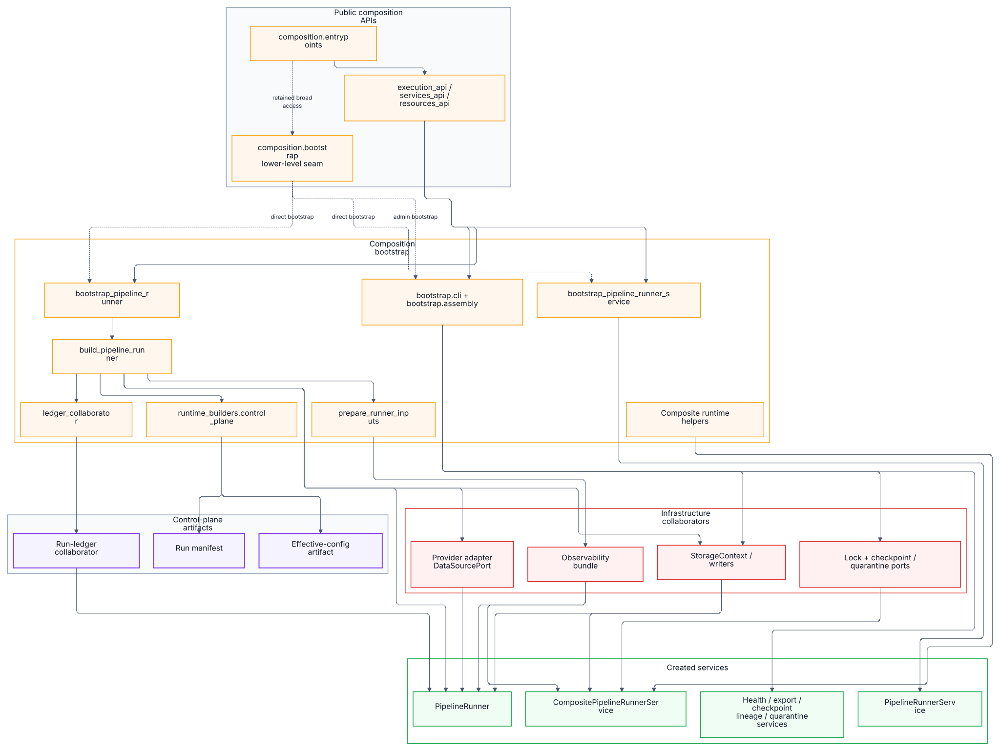

### Описание
Диаграмма «Bootstrap: Runtime, Control-Plane, and Admin Wiring» из architecture-набора детализирует конкретный архитектурный компонент или подсистему BioETL. Она представлена в формате блок-схема потоков (flowchart) и служит ориентиром на уровне детализации «System / Component». В комментариях исходника зафиксирован фокус диаграммы: Covers how current entrypoints/bootstrap seams expose runtime, control-plane, and admin assembly outputs.. Схема имеет плотность порядка 23 узлов и 31 связей; её удобно использовать как обзорный архитектурный срез для проверки влияния изменений, согласования интерфейсов и подготовки рефакторинга, но не как исчерпывающий каталог текущей кодовой поверхности. Ключевые блоки/подграфы: Public composition APIs, Composition bootstrap, Infrastructure collaborators, Created services, Control-plane artifacts. Показательные узлы для быстрого чтения: composition.entrypoints, execution_api / control_plane_api / health_api maintenance_api / resources_api, composition.bootstrap lower-level seam, bootstrap_pipeline_runner, bootstrap_pipeline_runner_service, build_pipeline_runner.

### Метаданные
- Тип: `flowchart`
- Уровень: `System / Component`
- Дата: `2026-03-28`
- Узлы (metadata): `23`

\newpage

## 13-port-protocol-contracts

**Port/Protocol Contracts (Full Map)**

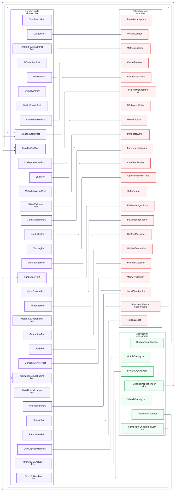

### Описание
Диаграмма «Port/Protocol Contracts (Full Map)» из architecture-набора детализирует конкретный архитектурный компонент или подсистему BioETL. Она представлена в формате блок-схема потоков (flowchart) и служит ориентиром на уровне детализации «System / Component». В комментариях исходника зафиксирован фокус диаграммы: Domain ports mapped to their current application consumers and infrastructure adapters.. Схема имеет плотность порядка 48 узлов и 6 связей; её удобно использовать как обзорный архитектурный срез для проверки влияния изменений, согласования интерфейсов и подготовки рефакторинга, но не как исчерпывающий каталог текущей кодовой поверхности. Ключевые блоки/подграфы: Domain ports (Protocols), Application consumers, Infrastructure adapters. Показательные узлы для быстрого чтения: DataSourcePort, FilterableDataSourcePort, BronzeStoragePort / SilverStoragePort GoldStoragePort / MergedStoragePort, LockPort, CheckpointPort, CompositeCheckpointPort. Примечание: Decomposed into 13a, 13b, 13c, 13d, 13e, 13f sub-diagrams.

### Метаданные
- Тип: `flowchart`
- Уровень: `System / Component`
- Дата: `2026-03-28`
- Узлы (metadata): `48`

\newpage

## 13a-data-storage-ports

**DataSource and Storage Ports**

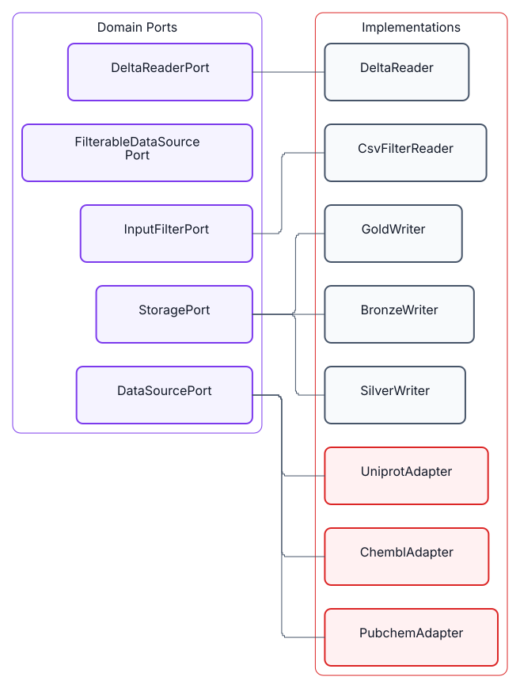

### Описание
Диаграмма «DataSource and Storage Ports» из architecture-набора детализирует конкретный архитектурный компонент или подсистему BioETL. Она представлена в формате блок-схема потоков (flowchart) и служит ориентиром на уровне детализации «System / Component». В комментариях исходника зафиксирован фокус диаграммы: All data acquisition and storage ports.. Схема имеет плотность порядка 20 узлов; её удобно использовать как обзорный архитектурный срез для проверки влияния изменений, согласования интерфейсов и подготовки рефакторинга, но не как исчерпывающий каталог текущей кодовой поверхности. Ключевые блоки/подграфы: Domain Ports, Implementations. Показательные узлы для быстрого чтения: fa:fa-plug DataSourcePort, fa:fa-filter FilterableDataSourcePort, fa:fa-database Bronze/Silver/Gold/MergedStoragePorts, fa:fa-book-open DeltaReaderPort, fa:fa-file-import InputFilterPort, ChemblAdapter.

### Метаданные
- Тип: `flowchart`
- Уровень: `System / Component`
- Дата: `2026-02-27`
- Узлы (metadata): `20`

\newpage

## 13g-port-contracts-data-sources

**Port Contracts: Data Sources**

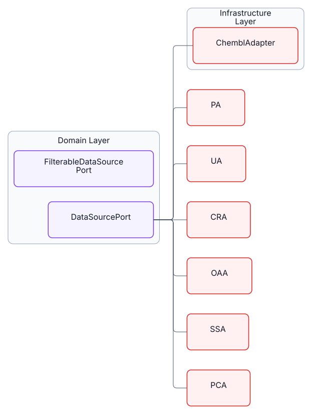

### Описание
Диаграмма «Port Contracts: Data Sources» из architecture-набора детализирует конкретный архитектурный компонент или подсистему BioETL. Она представлена в формате блок-схема потоков (flowchart) и служит ориентиром на уровне детализации «System / Component». В комментариях исходника зафиксирован фокус диаграммы: Covers DataSourcePort and FilterableDataSourcePort implementations per provider.. Схема имеет плотность порядка 9 узлов; её удобно использовать как обзорный архитектурный срез для проверки влияния изменений, согласования интерфейсов и подготовки рефакторинга, но не как исчерпывающий каталог текущей кодовой поверхности. Ключевые блоки/подграфы: Domain Layer, Infrastructure Layer. Показательные узлы для быстрого чтения: DataSourcePort, FilterableDataSourcePort, ChemblAdapter.

### Метаданные
- Тип: `flowchart`
- Уровень: `System / Component`
- Дата: `2026-02-25`
- Узлы (metadata): `9`

\newpage

## 13b-operational-ports

**Operational and Observability Ports**

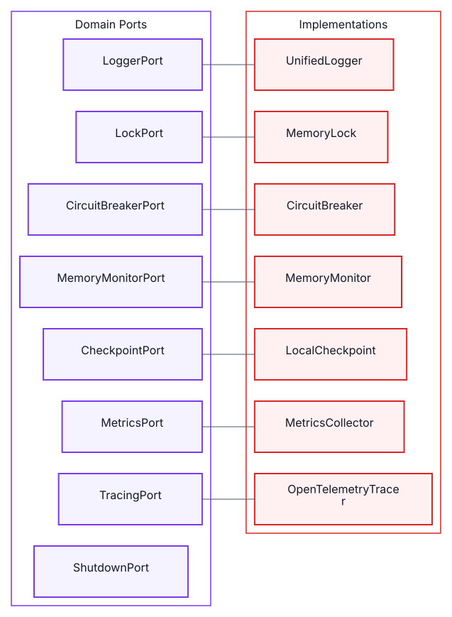

### Описание
Диаграмма «Operational and Observability Ports» из architecture-набора детализирует конкретный архитектурный компонент или подсистему BioETL. Она представлена в формате блок-схема потоков (flowchart) и служит ориентиром на уровне детализации «System / Component». В комментариях исходника зафиксирован фокус диаграммы: Monitoring, logging, and operational control ports.. Схема имеет плотность порядка 25 узлов; её удобно использовать как обзорный архитектурный срез для проверки влияния изменений, согласования интерфейсов и подготовки рефакторинга, но не как исчерпывающий каталог текущей кодовой поверхности. Ключевые блоки/подграфы: Domain Ports, Implementations. Показательные узлы для быстрого чтения: fa:fa-lock LockPort, fa:fa-flag CheckpointPort, fa:fa-list LoggerPort, fa:fa-chart-line MetricsPort, fa:fa-wave-square TracingPort, fa:fa-bolt CircuitBreakerPort. Примечание: Decomposed into 13e-operational-ports-domain, 13f-operational-ports-infra.

### Метаданные
- Тип: `flowchart`
- Уровень: `System / Component`
- Дата: `2026-02-27`
- Узлы (metadata): `25`

\newpage

## 13h-port-contracts-storage

**Port Contracts: Storage**

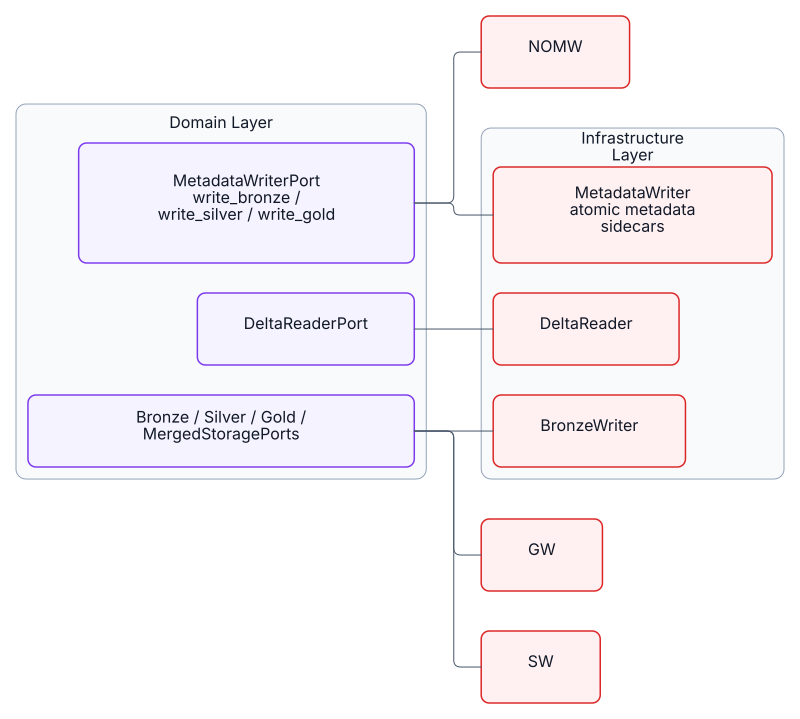

### Описание
Диаграмма «Port Contracts: Storage» из architecture-набора детализирует конкретный архитектурный компонент или подсистему BioETL. Она представлена в формате блок-схема потоков (flowchart) и служит ориентиром на уровне детализации «System / Component». В комментариях исходника зафиксирован фокус диаграммы: Covers BronzeStoragePort, SilverStoragePort, GoldStoragePort, MergedStoragePort, DeltaReaderPort, and layer-specific MetadataWriterPort implementations.. Схема имеет плотность порядка 9 узлов; её удобно использовать как обзорный архитектурный срез для проверки влияния изменений, согласования интерфейсов и подготовки рефакторинга, но не как исчерпывающий каталог текущей кодовой поверхности. Ключевые блоки/подграфы: Domain Layer, Infrastructure Layer. Показательные узлы для быстрого чтения: Bronze/Silver/Gold/MergedStoragePorts, DeltaReaderPort, MetadataWriterPort write_bronze / write_silver / write_gold, BronzeWriter, DeltaReader, MetadataWriter atomic metadata sidecars.

### Метаданные
- Тип: `flowchart`
- Уровень: `System / Component`
- Дата: `2026-03-19`
- Узлы (metadata): `9`

\newpage

## 13i-port-contracts-observability

**Port Contracts: Observability and Resilience**

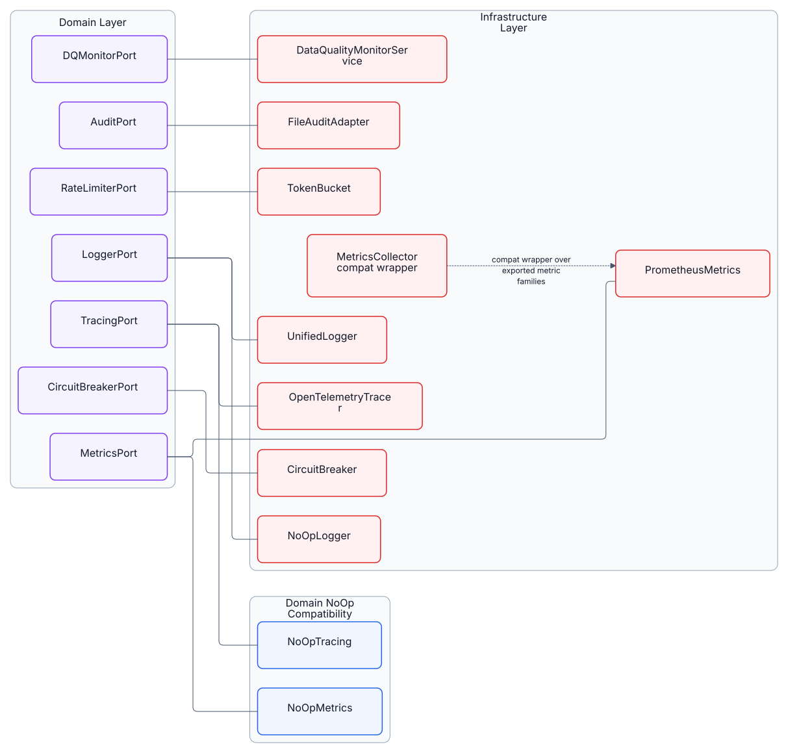

### Описание
Диаграмма «Port Contracts: Observability and Resilience» из architecture-набора детализирует конкретный архитектурный компонент или подсистему BioETL. Она представлена в формате блок-схема потоков (flowchart) и служит ориентиром на уровне детализации «System / Component». В комментариях исходника зафиксирован фокус диаграммы: Covers Logger/Metrics/Tracing ports plus resilience control ports.. Схема имеет плотность порядка 18 узлов; её удобно использовать как обзорный архитектурный срез для проверки влияния изменений, согласования интерфейсов и подготовки рефакторинга, но не как исчерпывающий каталог текущей кодовой поверхности. Ключевые блоки/подграфы: Domain Layer, Domain NoOp Compatibility, Infrastructure Layer. Показательные узлы для быстрого чтения: LoggerPort, MetricsPort, TracingPort, DQMonitorPort, AuditPort, CircuitBreakerPort.

### Метаданные
- Тип: `flowchart`
- Уровень: `System / Component`
- Дата: `2026-04-12`
- Узлы (metadata): `18`

\newpage

## 13c-validation-dq-ports

**Validation and Data Quality Ports**

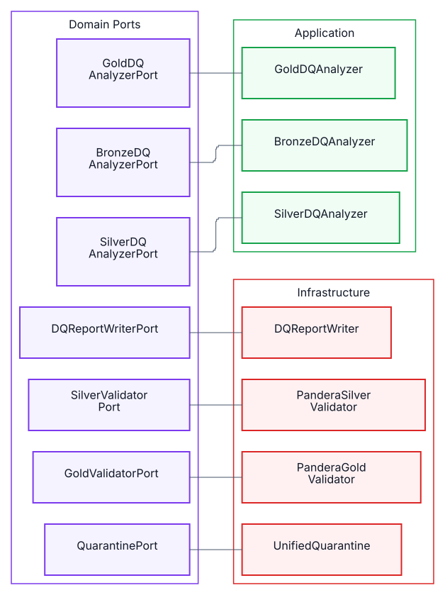

### Описание
Диаграмма «Validation and Data Quality Ports» из architecture-набора детализирует конкретный архитектурный компонент или подсистему BioETL. Она представлена в формате блок-схема потоков (flowchart) и служит ориентиром на уровне детализации «System / Component». В комментариях исходника зафиксирован фокус диаграммы: Ports for ensuring data correctness and quality reporting.. Схема имеет плотность порядка 20 узлов; её удобно использовать как обзорный архитектурный срез для проверки влияния изменений, согласования интерфейсов и подготовки рефакторинга, но не как исчерпывающий каталог текущей кодовой поверхности. Ключевые блоки/подграфы: Domain Ports, Infrastructure, Application. Показательные узлы для быстрого чтения: SilverValidatorPort, GoldValidatorPort, BronzeDQ AnalyzerPort, SilverDQ AnalyzerPort, GoldDQ AnalyzerPort, DQReportWriterPort.

### Метаданные
- Тип: `flowchart`
- Уровень: `System / Component`
- Дата: `2026-02-27`
- Узлы (metadata): `20`

\newpage

## 13d-port-contracts-services

**Port Contracts: Services and Controls**

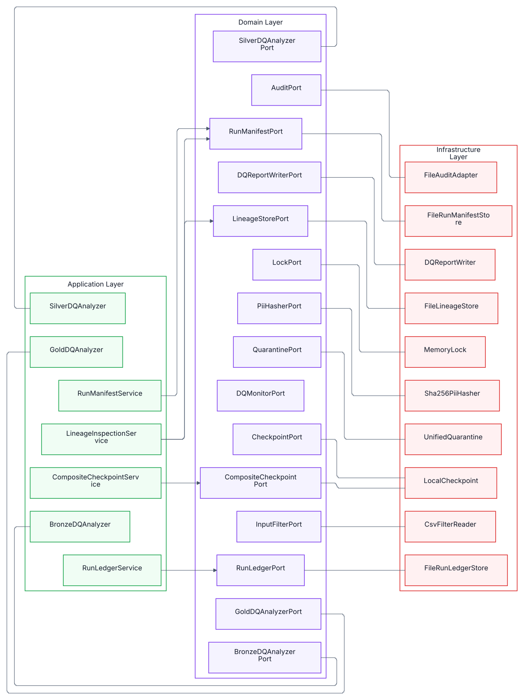

### Описание
Диаграмма «Port Contracts: Services and Controls» из architecture-набора детализирует конкретный архитектурный компонент или подсистему BioETL. Она представлена в формате блок-схема потоков (flowchart) и служит ориентиром на уровне детализации «System / Component». В комментариях исходника зафиксирован фокус диаграммы: Control-plane, checkpoint, and DQ service ports with their current consumers and adapters.. Схема имеет плотность порядка 22 узлов и 5 связей; её удобно использовать как обзорный архитектурный срез для проверки влияния изменений, согласования интерфейсов и подготовки рефакторинга, но не как исчерпывающий каталог текущей кодовой поверхности. Ключевые блоки/подграфы: Domain Layer, Infrastructure Layer, Application Layer. Показательные узлы для быстрого чтения: LockPort, CheckpointPort, CompositeCheckpointPort, QuarantinePort, AuditPort, PiiHasherPort.

### Метаданные
- Тип: `flowchart`
- Уровень: `System / Component`
- Дата: `2026-03-28`
- Узлы (metadata): `22`

\newpage

## 13e-operational-ports-domain

**Domain Operational Ports**

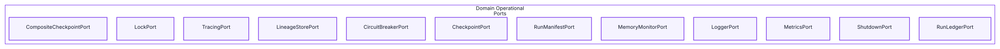

### Описание
Диаграмма «Domain Operational Ports» из architecture-набора детализирует конкретный архитектурный компонент или подсистему BioETL. Она представлена в формате блок-схема потоков (flowchart) и служит ориентиром на уровне детализации «System / Component». В комментариях исходника зафиксирован фокус диаграммы: Independent protocol definitions for operational concerns, including control-plane traceability ports.. Схема имеет плотность порядка 11 узлов; её удобно использовать как обзорный архитектурный срез для проверки влияния изменений, согласования интерфейсов и подготовки рефакторинга, но не как исчерпывающий каталог текущей кодовой поверхности. Ключевые блоки/подграфы: Domain Operational Ports. Показательные узлы для быстрого чтения: fa:fa-lock LockPort, fa:fa-flag CheckpointPort, fa:fa-layer-group CompositeCheckpointPort, fa:fa-list LoggerPort, fa:fa-chart-line MetricsPort, fa:fa-wave-square TracingPort.

### Метаданные
- Тип: `flowchart`
- Уровень: `System / Component`
- Дата: `2026-03-28`
- Узлы (metadata): `11`

\newpage

## 13f-operational-ports-infra

**Infrastructure Operational Implementations**

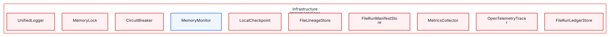

### Описание
Диаграмма «Infrastructure Operational Implementations» из architecture-набора детализирует конкретный архитектурный компонент или подсистему BioETL. Она представлена в формате блок-схема потоков (flowchart) и служит ориентиром на уровне детализации «System / Component». В комментариях исходника зафиксирован фокус диаграммы: Current adapter implementations of operational and control-plane traceability ports.. Схема имеет плотность порядка 10 узлов; её удобно использовать как обзорный архитектурный срез для проверки влияния изменений, согласования интерфейсов и подготовки рефакторинга, но не как исчерпывающий каталог текущей кодовой поверхности. Ключевые блоки/подграфы: Infrastructure Implementations. Показательные узлы для быстрого чтения: MemoryLock, LocalCheckpoint, UnifiedLogger, MetricsCollector, OpenTelemetryTracer, CircuitBreaker.

### Метаданные
- Тип: `flowchart`
- Уровень: `System / Component`
- Дата: `2026-03-28`
- Узлы (metadata): `10`

\newpage

## 14-cli-interface-layer

**CLI / Interface Layer**

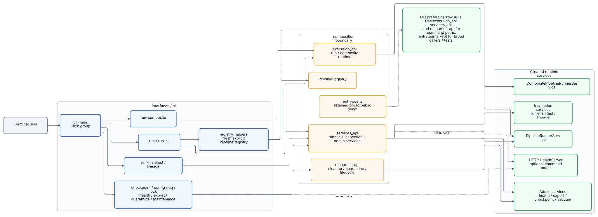

### Описание
Диаграмма «CLI / Interface Layer» из architecture-набора детализирует конкретный архитектурный компонент или подсистему BioETL. Она представлена в формате блок-схема потоков (flowchart) и служит ориентиром на уровне детализации «System / Component». В комментариях исходника зафиксирован фокус диаграммы: current CLI routing through registry helpers, narrow composition APIs, and inspection/admin services.. Схема имеет плотность порядка 18 узлов и 25 связей; её удобно использовать как обзорный архитектурный срез для проверки влияния изменений, согласования интерфейсов и подготовки рефакторинга, но не как исчерпывающий каталог текущей кодовой поверхности. Ключевые блоки/подграфы: interfaces/cli, composition boundary, Created runtime services. Показательные узлы для быстрого чтения: Terminal user, cli.main Click group, registry_helpers fresh explicit PipelineRegistry, run / run-all, run-composite, run-manifest / lineage. Примечание: Decomposed into 14a-cli-commands, 14b-cli-routing.

### Метаданные
- Тип: `flowchart`
- Уровень: `System / Component`
- Дата: `2026-03-28`
- Узлы (metadata): `18`

\newpage

## 14a-cli-commands

**CLI: Command Structure**

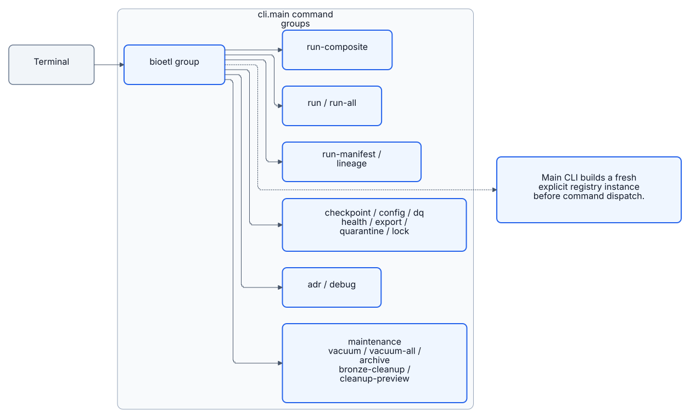

### Описание
Диаграмма «CLI: Command Structure» из architecture-набора детализирует конкретный архитектурный компонент или подсистему BioETL. Она представлена в формате блок-схема потоков (flowchart) и служит ориентиром на уровне детализации «System / Component». В комментариях исходника зафиксирован фокус диаграммы: Terminal entrypoint, main group, and the current command families registered in cli.main.. Схема имеет плотность порядка 13 узлов и 8 связей; её удобно использовать как обзорный архитектурный срез для проверки влияния изменений, согласования интерфейсов и подготовки рефакторинга, но не как исчерпывающий каталог текущей кодовой поверхности. Ключевые блоки/подграфы: cli.main command groups. Показательные узлы для быстрого чтения: Terminal, bioetl group, run / run-all, run-composite, run-manifest / lineage, checkpoint / config / dq health / export / quarantine / lock.

### Метаданные
- Тип: `flowchart`
- Уровень: `System / Component`
- Дата: `2026-03-28`
- Узлы (metadata): `13`

\newpage

## 14b-cli-routing

**CLI: Routing to Composition Boundary**

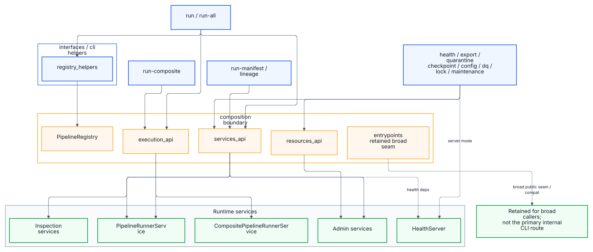

### Описание
Диаграмма «CLI: Routing to Composition Boundary» из architecture-набора детализирует конкретный архитектурный компонент или подсистему BioETL. Она представлена в формате блок-схема потоков (flowchart) и служит ориентиром на уровне детализации «System / Component». В комментариях исходника зафиксирован фокус диаграммы: how command families route through registry helpers and narrow composition APIs, while entrypoints remains a retained broad seam.. Схема имеет плотность порядка 15 узлов и 19 связей; её удобно использовать как обзорный архитектурный срез для проверки влияния изменений, согласования интерфейсов и подготовки рефакторинга, но не как исчерпывающий каталог текущей кодовой поверхности. Ключевые блоки/подграфы: interfaces/cli helpers, composition boundary, Runtime services. Показательные узлы для быстрого чтения: run / run-all, run-composite, run-manifest / lineage, health / export / quarantine checkpoint / config / dq / lock / maintenance, registry_helpers, execution_api.

### Метаданные
- Тип: `flowchart`
- Уровень: `System / Component`
- Дата: `2026-03-28`
- Узлы (metadata): `15`

\newpage

## 15-batch-executor-internals

**BatchExecutor Internal Architecture**

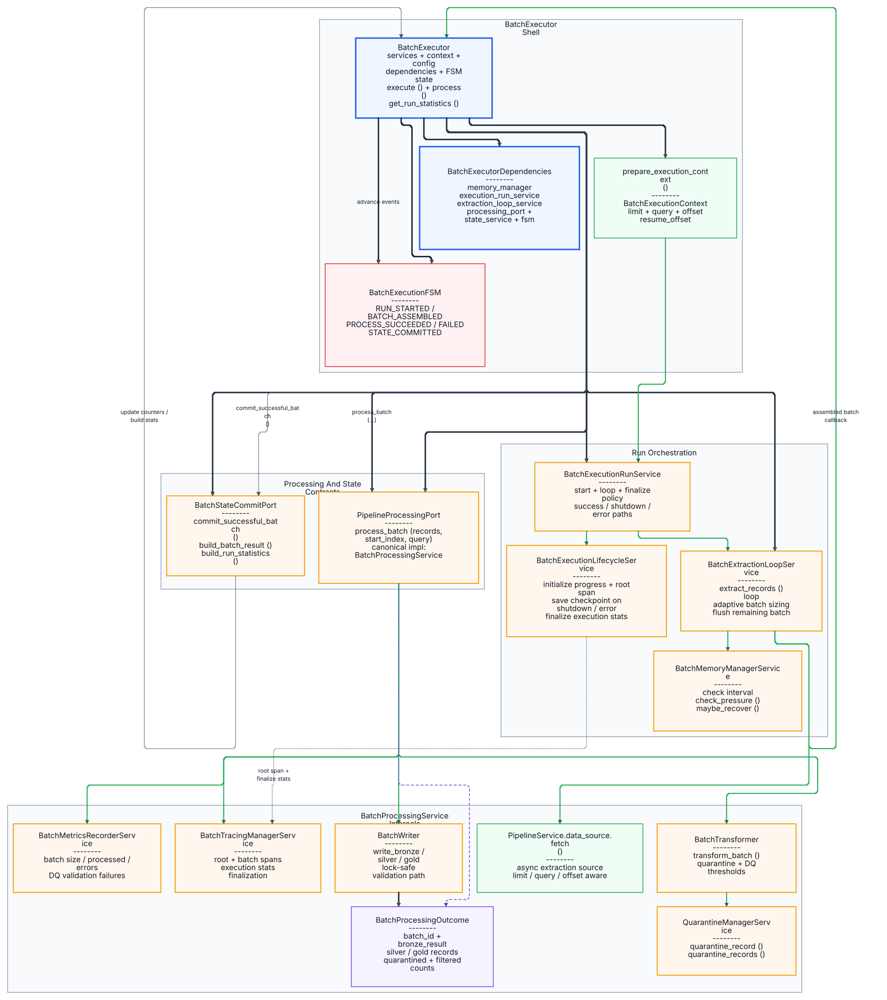

### Описание
Диаграмма «BatchExecutor Internal Architecture» из architecture-набора детализирует конкретный архитектурный компонент или подсистему BioETL. Она представлена в формате блок-схема потоков (flowchart) и служит ориентиром на уровне детализации «Component / Service». В комментариях исходника зафиксирован фокус диаграммы: the current decomposition of BatchExecutor runtime orchestration.. Схема имеет плотность порядка 16 узлов и 25 связей; её удобно использовать как обзорный архитектурный срез для проверки влияния изменений, согласования интерфейсов и подготовки рефакторинга, но не как исчерпывающий каталог текущей кодовой поверхности. Ключевые блоки/подграфы: BatchExecutor Shell, Run Orchestration, Processing And State Contracts, BatchProcessingService Internals. Показательные узлы для быстрого чтения: BatchTransformer -------- transform_batch() quarantine + DQ thresholds, BatchWriter -------- write_bronze/silver/gold lock-safe validation path, QuarantineRuntimeService -------- quarantine_record() quarantine_records().

### Метаданные
- Тип: `flowchart`
- Уровень: `Component / Service`
- Дата: `2026-03-24`
- Узлы (metadata): `16`

\newpage

## 16-transformer-hierarchy

**Transformer Hierarchy**

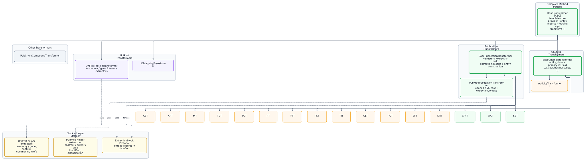

### Описание
Диаграмма «Transformer Hierarchy» из architecture-набора детализирует конкретный архитектурный компонент или подсистему BioETL. Она представлена в формате блок-схема потоков (flowchart) и служит ориентиром на уровне детализации «System / Component». В комментариях исходника зафиксирован фокус диаграммы: the Template Method pattern, declarative publication blocks, and provider-specific helper seams.. Схема имеет плотность порядка 27 узлов и 10 связей; её удобно использовать как обзорный архитектурный срез для проверки влияния изменений, согласования интерфейсов и подготовки рефакторинга, но не как исчерпывающий каталог текущей кодовой поверхности. Ключевые блоки/подграфы: Template Method Pattern, ChEMBL Transformers, Publication Transformers, UniProt Transformers, Other Transformers, Block + Helper Strategy. Показательные узлы для быстрого чтения: BaseChemblTransformer entity_class + primary_id_field _extract_business_data(), ActivityTransformer, PubMedPublicationTransformer cached XML root + extraction_blocks, UniProtProteinTransformer taxonomy/gene/feature extractors, IDMappingTransformer, PubChemCompoundTransformer. Примечание: Decomposed into 16a-transformer-base, 16b-transformer-pub-other.

### Метаданные
- Тип: `flowchart`
- Уровень: `System / Component`
- Дата: `2026-03-19`
- Узлы (metadata): `27`

\newpage

## 16a-transformer-base

**Base Transformer and ChEMBL Transformers**

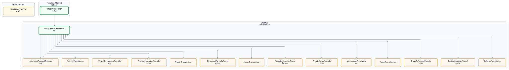

### Описание
Диаграмма «Base Transformer and ChEMBL Transformers» из architecture-набора детализирует конкретный архитектурный компонент или подсистему BioETL. Она представлена в формате блок-схема потоков (flowchart) и служит ориентиром на уровне детализации «System / Component». В комментариях исходника зафиксирован фокус диаграммы: Template Method base class, ChEMBL provider transformers, and extractor root.. Схема имеет плотность порядка 17 узлов и 2 связей; её удобно использовать как обзорный архитектурный срез для проверки влияния изменений, согласования интерфейсов и подготовки рефакторинга, но не как исчерпывающий каталог текущей кодовой поверхности. Ключевые блоки/подграфы: Template Method Pattern, ChEMBL Transformers, Extractor Root. Показательные узлы для быстрого чтения: BaseTransformer ABC, BaseChemblTransformer, ActivityTransformer, AssayTransformer, ApprovedProductTransformer, MechanismTransformer.

### Метаданные
- Тип: `flowchart`
- Уровень: `System / Component`
- Дата: `2026-02-27`
- Узлы (metadata): `17`

\newpage

## 16b-transformer-pub-other

**Publication, UniProt, Other Transformers and Blocks**

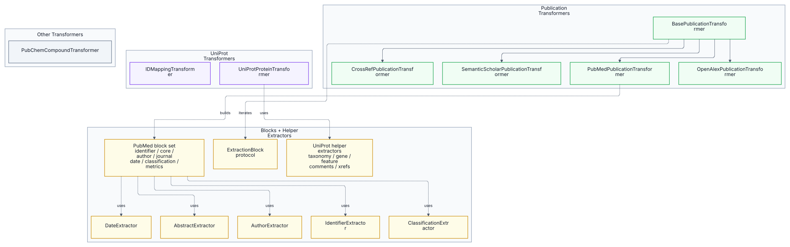

### Описание
Диаграмма «Publication, UniProt, Other Transformers and Blocks» из architecture-набора детализирует конкретный архитектурный компонент или подсистему BioETL. Она представлена в формате блок-схема потоков (flowchart) и служит ориентиром на уровне детализации «System / Component». В комментариях исходника зафиксирован фокус диаграммы: Provider-specific transformers, declarative PubMed blocks, and helper extractor seams.. Схема имеет плотность порядка 16 узлов и 5 связей; её удобно использовать как обзорный архитектурный срез для проверки влияния изменений, согласования интерфейсов и подготовки рефакторинга, но не как исчерпывающий каталог текущей кодовой поверхности. Ключевые блоки/подграфы: Publication Transformers, UniProt Transformers, Other Transformers, Blocks + Helper Extractors. Показательные узлы для быстрого чтения: BasePublicationTransformer, PubMedPublicationTransformer, CrossRefPublicationTransformer, OpenAlexPublicationTransformer, SemanticScholarPublicationTransformer, UniProtProteinTransformer.

### Метаданные
- Тип: `flowchart`
- Уровень: `System / Component`
- Дата: `2026-03-19`
- Узлы (metadata): `16`

\newpage

## 17-security-pii-audit

**Security, PII Hashing, and Audit Trail**

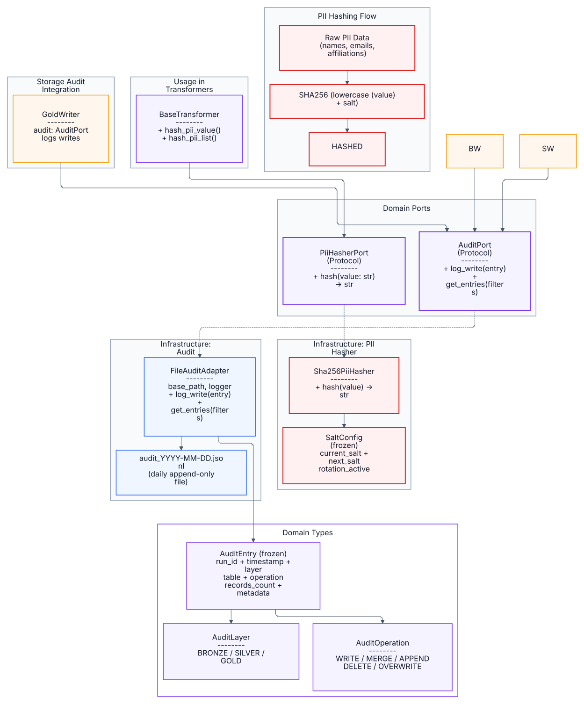

### Описание
Диаграмма «Security, PII Hashing, and Audit Trail» из architecture-набора детализирует конкретный архитектурный компонент или подсистему BioETL. Она представлена в формате блок-схема потоков (flowchart) и служит ориентиром на уровне детализации «System / Component». В комментариях исходника зафиксирован фокус диаграммы: how PII is handled and audit trail is maintained.. Схема имеет плотность порядка 16 узлов и 11 связей; её удобно использовать как обзорный архитектурный срез для проверки влияния изменений, согласования интерфейсов и подготовки рефакторинга, но не как исчерпывающий каталог текущей кодовой поверхности. Ключевые блоки/подграфы: Domain Ports, Domain Types, PII Hashing Flow, Infrastructure: PII Hasher, Infrastructure: Audit, Usage in Transformers. Показательные узлы для быстрого чтения: PiiHasherPort (Protocol) -------- + hash(value: str) -> str, AuditPort (Protocol) -------- + log_write(entry) + get_entries(filters), AuditLayer -------- BRONZE / SILVER / GOLD, AuditOperation -------- WRITE / MERGE / APPEND DELETE / OVERWRITE, Raw PII Data (names, emails, affiliations), SHA256(lowercase(value) + salt).

### Метаданные
- Тип: `flowchart`
- Уровень: `System / Component`
- Дата: `2026-02-24`
- Узлы (metadata): `16`

\newpage

## 18-lock-checkpoint-shutdown

**Locking, Checkpoint, and Graceful Shutdown**

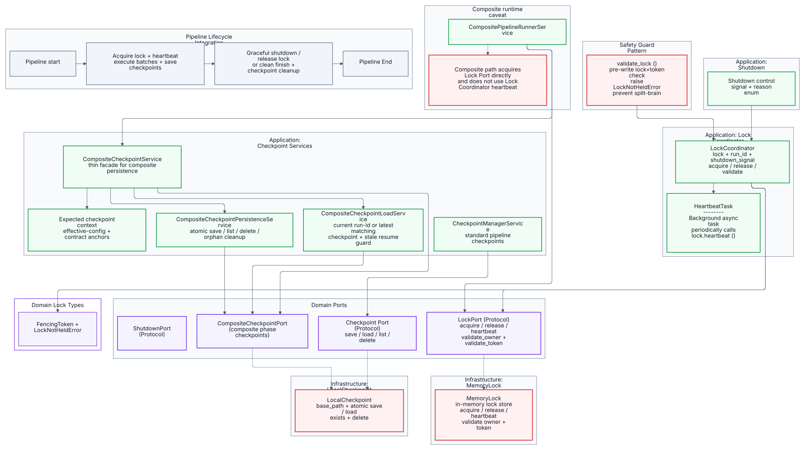

### Описание
Диаграмма «Locking, Checkpoint, and Graceful Shutdown» из architecture-набора детализирует конкретный архитектурный компонент или подсистему BioETL. Она представлена в формате блок-схема потоков (flowchart) и служит ориентиром на уровне детализации «System / Component». В комментариях исходника зафиксирован фокус диаграммы: Distinguishes general pipeline lifecycle from the newer composite checkpoint facade and resume semantics.. Схема имеет плотность порядка 22 узлов и 21 связей; её удобно использовать как обзорный архитектурный срез для проверки влияния изменений, согласования интерфейсов и подготовки рефакторинга, но не как исчерпывающий каталог текущей кодовой поверхности. Ключевые блоки/подграфы: Domain Ports, Domain Lock Types, Application: LockRuntimeService, Application: Checkpoint Services, Application: Shutdown, Infrastructure: MemoryLock. Показательные узлы для быстрого чтения: LockPort (Protocol) acquire/release/heartbeat validate_owner + validate_token, CheckpointPort (Protocol) save/load/list/delete, CompositeCheckpointPort (composite phase checkpoints), ShutdownPort (Protocol), FencingToken + LockNotHeldError, LockRuntimeService lock + run_id + shutdown_signal acquire/release/validate. Примечание: Decomposed into 18a-lock-system, 18b-checkpoint-shutdown.

### Метаданные
- Тип: `flowchart`
- Уровень: `System / Component`
- Дата: `2026-03-28`
- Узлы (metadata): `22`

\newpage

## 18a-lock-system

**Lock System**

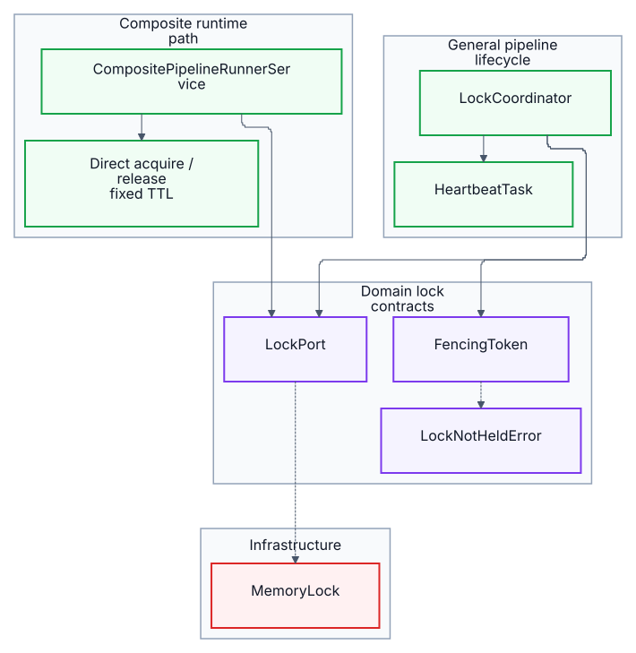

### Описание
Диаграмма «Lock System» из architecture-набора детализирует конкретный архитектурный компонент или подсистему BioETL. Она представлена в формате блок-схема потоков (flowchart) и служит ориентиром на уровне детализации «System / Component». В комментариях исходника зафиксирован фокус диаграммы: Distinguishes the general LockRuntimeService path from the composite runner's direct LockPort path.. Схема имеет плотность порядка 10 узлов и 7 связей; её удобно использовать как обзорный архитектурный срез для проверки влияния изменений, согласования интерфейсов и подготовки рефакторинга, но не как исчерпывающий каталог текущей кодовой поверхности. Ключевые блоки/подграфы: Domain lock contracts, General pipeline lifecycle, Composite runtime path, Infrastructure. Показательные узлы для быстрого чтения: LockPort, FencingToken, LockNotHeldError, LockRuntimeService, HeartbeatTask, CompositePipelineRunner.

### Метаданные
- Тип: `flowchart`
- Уровень: `System / Component`
- Дата: `2026-03-16`
- Узлы (metadata): `10`

\newpage

## 18b-checkpoint-shutdown

**Checkpoint and Shutdown System**

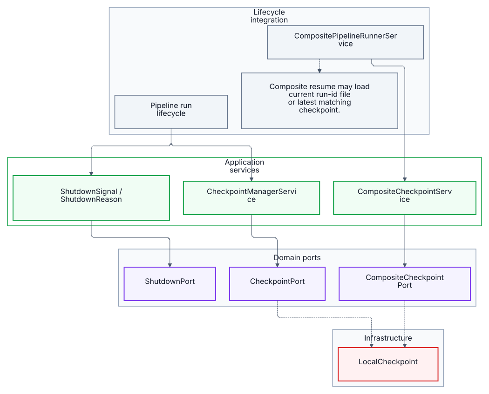

### Описание
Диаграмма «Checkpoint and Shutdown System» из architecture-набора детализирует конкретный архитектурный компонент или подсистему BioETL. Она представлена в формате блок-схема потоков (flowchart) и служит ориентиром на уровне детализации «System / Component». В комментариях исходника зафиксирован фокус диаграммы: Separates general checkpoint/shutdown services from the composite checkpoint facade and resume helpers.. Схема имеет плотность порядка 15 узлов и 14 связей; её удобно использовать как обзорный архитектурный срез для проверки влияния изменений, согласования интерфейсов и подготовки рефакторинга, но не как исчерпывающий каталог текущей кодовой поверхности. Ключевые блоки/подграфы: Domain ports, Application services, Infrastructure, Lifecycle integration. Показательные узлы для быстрого чтения: CheckpointPort, CompositeCheckpointPort, ShutdownPort, CheckpointRuntimeService, CompositeCheckpointService thin facade, CompositeCheckpointLoadService.

### Метаданные
- Тип: `flowchart`
- Уровень: `System / Component`
- Дата: `2026-03-28`
- Узлы (metadata): `15`

\newpage

## 19-control-plane-artifacts

**Control-Plane Artifacts and Traceability**

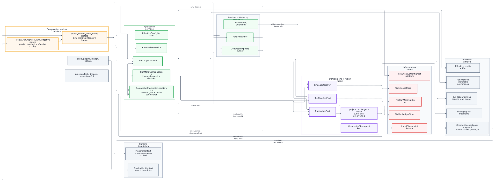

### Описание
Диаграмма «Control-Plane Artifacts and Traceability» из architecture-набора детализирует конкретный архитектурный компонент или подсистему BioETL. Она представлена в формате блок-схема потоков (flowchart) и служит ориентиром на уровне детализации «System / Component». В комментариях исходника зафиксирован фокус диаграммы: how runtime assembly publishes immutable provenance artifacts and resumes composite runs from checkpoint snapshot + ledger suffix replay.. Схема имеет плотность порядка 24 узлов и 34 связей; её удобно использовать как обзорный архитектурный срез для проверки влияния изменений, согласования интерфейсов и подготовки рефакторинга, но не как исчерпывающий каталог текущей кодовой поверхности. Ключевые блоки/подграфы: Runtime descriptors, Composition runtime builders, Application services, Domain ports + replay model, Infrastructure stores, Published artifacts. Показательные узлы для быстрого чтения: build_pipeline_runner / CLI run, run-manifest / lineage / inspection CLI, PipelineRunContext launch descriptor, PipelineContext in-run processing context, create_run_manifest_with_effective_config publish manifest + effective config, attach_control_plane_collaborators bind manifest / ledger / lineage. Примечание: Complements 12-bootstrap-di-container, 18-lock-checkpoint-shutdown, 23-reproducible-run-contract, and ADR-044.

### Метаданные
- Тип: `flowchart`
- Уровень: `System / Component`
- Дата: `2026-04-02`
- Узлы (metadata): `24`

\newpage

## 20-data-traceability-runtime

**Data Traceability Runtime Path**

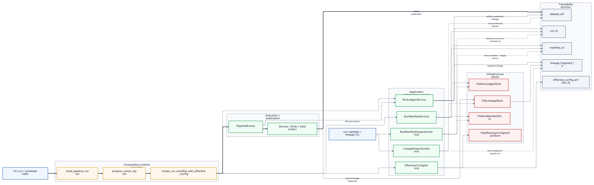

### Описание
Диаграмма «Data Traceability Runtime Path» из architecture-набора детализирует конкретный архитектурный компонент или подсистему BioETL. Она представлена в формате блок-схема потоков (flowchart) и служит ориентиром на уровне детализации «System / Runtime». В комментариях исходника зафиксирован фокус диаграммы: how one pipeline run becomes inspectable through manifest, ledger, lineage, and artifact identity anchors.. Схема имеет плотность порядка 20 узлов и 31 связей; её удобно использовать как обзорный архитектурный срез для проверки влияния изменений, согласования интерфейсов и подготовки рефакторинга, но не как исчерпывающий каталог текущей кодовой поверхности. Ключевые блоки/подграфы: Composition runtime assembly, Application control-plane services, Infrastructure stores, Execution + publication, Traceability anchors. Показательные узлы для быстрого чтения: CLI run / scheduler caller, run-manifest + lineage CLI, build_pipeline_runner, prepare_runner_inputs, create_run_manifest_with_effective_config, EffectiveConfigService. Примечание: Complements 19-control-plane-artifacts, 18-lock-checkpoint-shutdown, and 38-runtime-assembly-sequence. Связанный ADR: ADR-044.

### Метаданные
- Тип: `flowchart`
- Уровень: `System / Runtime`
- Дата: `2026-03-28`
- Узлы (metadata): `20`
- ADR: `ADR-044`

\newpage

## 21-idempotent-processing-guards

**Idempotent Processing Guards**

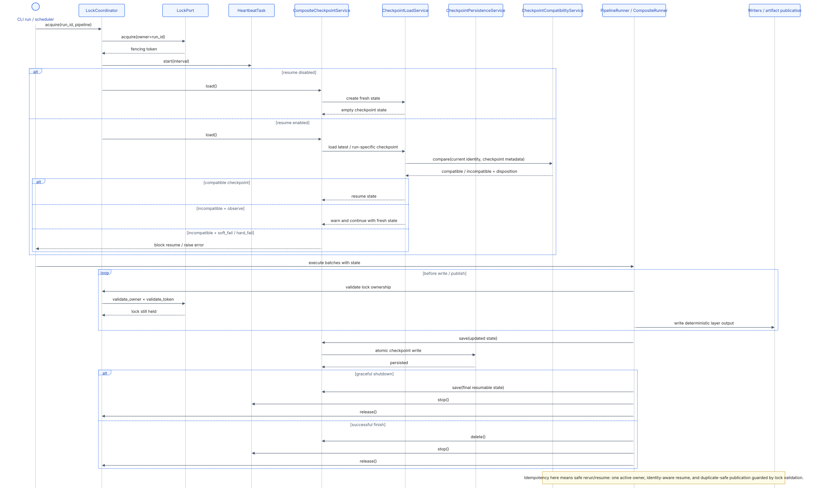

### Описание
Диаграмма «Idempotent Processing Guards» из architecture-набора детализирует конкретный архитектурный компонент или подсистему BioETL. Она представлена в формате диаграмма последовательности (sequence) и служит ориентиром на уровне детализации «Runtime / Control Plane». В комментариях исходника зафиксирован фокус диаграммы: how locks, checkpoint identity, and publication guards make reruns/resume safe.. Схема имеет плотность порядка 10 узлов и 8 связей; её удобно использовать как обзорный архитектурный срез для проверки влияния изменений, согласования интерфейсов и подготовки рефакторинга, но не как исчерпывающий каталог текущей кодовой поверхности. Примечание: Complements 18-lock-checkpoint-shutdown, 20-data-traceability-runtime, and ADR-014 deterministic writes.

### Метаданные
- Тип: `sequenceDiagram`
- Уровень: `Runtime / Control Plane`
- Дата: `2026-03-28`
- Узлы (metadata): `10`

\newpage

## 22-data-operations-observability

**Data Operations Observability**

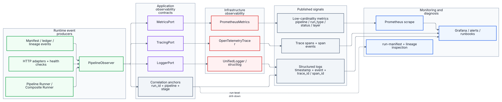

### Описание
Диаграмма «Data Operations Observability» из architecture-набора детализирует конкретный архитектурный компонент или подсистему BioETL. Она представлена в формате блок-схема потоков (flowchart) и служит ориентиром на уровне детализации «System / Runtime». В комментариях исходника зафиксирован фокус диаграммы: how logs, metrics, tracing, and control-plane signals stay correlated without high-cardinality metric labels.. Схема имеет плотность порядка 18 узлов и 19 связей; её удобно использовать как обзорный архитектурный срез для проверки влияния изменений, согласования интерфейсов и подготовки рефакторинга, но не как исчерпывающий каталог текущей кодовой поверхности. Ключевые блоки/подграфы: Runtime event producers, Application observability contracts, Infrastructure observability, Published signals, Monitoring and diagnosis. Показательные узлы для быстрого чтения: PipelineObserver, PipelineRunner / CompositeRunner, HTTP adapters + health checks, Manifest / ledger / lineage events, LoggerPort, MetricsPort. Примечание: Complements 09-observability-stack, 20-data-traceability-runtime, and observability.md.

### Метаданные
- Тип: `flowchart`
- Уровень: `System / Runtime`
- Дата: `2026-03-28`
- Узлы (metadata): `18`

\newpage

## 23-reproducible-run-contract

**Reproducible Run Contract**

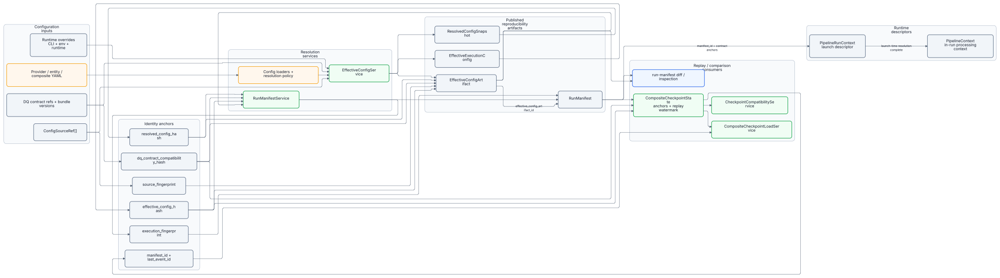

### Описание
Диаграмма «Reproducible Run Contract» из architecture-набора детализирует конкретный архитектурный компонент или подсистему BioETL. Она представлена в формате блок-схема потоков (flowchart) и служит ориентиром на уровне детализации «System / Control Plane». В комментариях исходника зафиксирован фокус диаграммы: how config resolution, runtime descriptors, and control-plane provenance define one replay/comparison identity.. Схема имеет плотность порядка 23 узлов и 35 связей; её удобно использовать как обзорный архитектурный срез для проверки влияния изменений, согласования интерфейсов и подготовки рефакторинга, но не как исчерпывающий каталог текущей кодовой поверхности. Ключевые блоки/подграфы: Configuration inputs, Resolution services, Runtime descriptors, Published reproducibility artifacts, Identity anchors, Replay / comparison consumers. Показательные узлы для быстрого чтения: Provider / entity / composite YAML, ConfigSourceRef[], Runtime overrides CLI + env + runtime, DQ contract refs + bundle versions, Config loaders + resolution policy, EffectiveConfigService. Примечание: Complements 11-configuration-system, 19-control-plane-artifacts, and config-runtime-artifacts.md.

### Метаданные
- Тип: `flowchart`
- Уровень: `System / Control Plane`
- Дата: `2026-04-02`
- Узлы (metadata): `23`

\newpage

## 24-control-plane-artifact-publication-pipeline

**Control Plane Artifact Publication Pipeline**



### Описание
Диаграмма «Control Plane Artifact Publication Pipeline» из architecture-набора детализирует конкретный архитектурный компонент или подсистему BioETL. Она представлена в формате блок-схема потоков (flowchart) и служит ориентиром на уровне детализации «System / Control Plane». В комментариях исходника зафиксирован фокус диаграммы: {init: {'theme': 'neutral', 'themeVariables': {'fontFamily': 'Inter, system-ui', 'lineWidth': '2'}}}%%. Схема имеет плотность порядка 16 узлов и 18 связей; её удобно использовать как обзорный архитектурный срез для проверки влияния изменений, согласования интерфейсов и подготовки рефакторинга, но не как исчерпывающий каталог текущей кодовой поверхности. Показательные узлы для быстрого чтения: CLI run / workflow commands, composition.bootstrap.runtime.assembly, PipelineRunner, build_postrun_service, control plane writers, RunManifest.

### Метаданные
- Тип: `flowchart`
- Уровень: `System / Control Plane`
- Дата: `2026-05-12`

\newpage

## 25-effective-execution-config-resolution-and-artifact-hashing

**Effective Execution Config Resolution And Artifact Hashing**

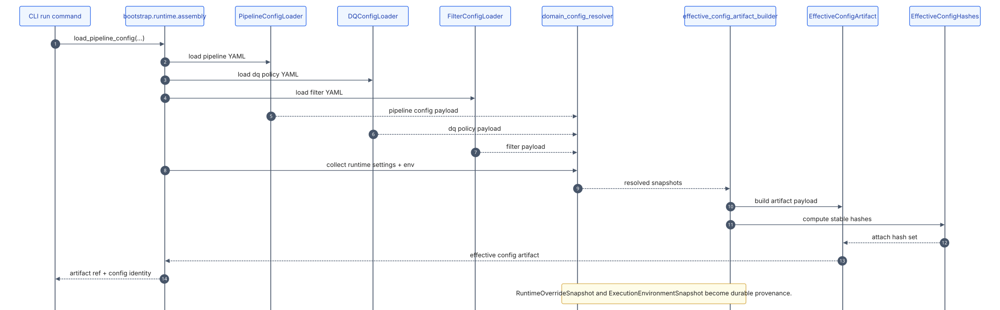

### Описание
Диаграмма «Effective Execution Config Resolution And Artifact Hashing» из architecture-набора детализирует конкретный архитектурный компонент или подсистему BioETL. Она представлена в формате диаграмма последовательности (sequence) и служит ориентиром на уровне детализации «System / Interaction». В комментариях исходника зафиксирован фокус диаграммы: {init: {'theme': 'neutral', 'themeVariables': {'fontFamily': 'Inter, system-ui', 'lineWidth': '2'}}}%%.

### Метаданные
- Тип: `sequenceDiagram`
- Уровень: `System / Interaction`
- Дата: `2026-05-12`

\newpage

## 26-reproducible-run-contract-across-manifest-ledger-and-output-metadata

**Reproducible Run Contract Across Manifest Ledger And Output Metadata**



### Описание
Диаграмма «Reproducible Run Contract Across Manifest Ledger And Output Metadata» из architecture-набора детализирует конкретный архитектурный компонент или подсистему BioETL. Она представлена в формате блок-схема потоков (flowchart) и служит ориентиром на уровне детализации «System / Control Plane». В комментариях исходника зафиксирован фокус диаграммы: {init: {'theme': 'neutral', 'themeVariables': {'fontFamily': 'Inter, system-ui', 'lineWidth': '2'}}}%%. Схема имеет плотность порядка 11 узлов и 16 связей; её удобно использовать как обзорный архитектурный срез для проверки влияния изменений, согласования интерфейсов и подготовки рефакторинга, но не как исчерпывающий каталог текущей кодовой поверхности. Показательные узлы для быстрого чтения: RunManifest, RunLedgerEntry, EffectiveConfigArtifact, run_id / manifest_id / batch_id, bronze metadata yaml, silver metadata yaml.

### Метаданные
- Тип: `flowchart`
- Уровень: `System / Control Plane`
- Дата: `2026-05-12`

\newpage

## 27-composite-preflight-field-priority-and-normalization-compatibility-resolution

**Composite Preflight Field Priority And Normalization Compatibility Resolution**

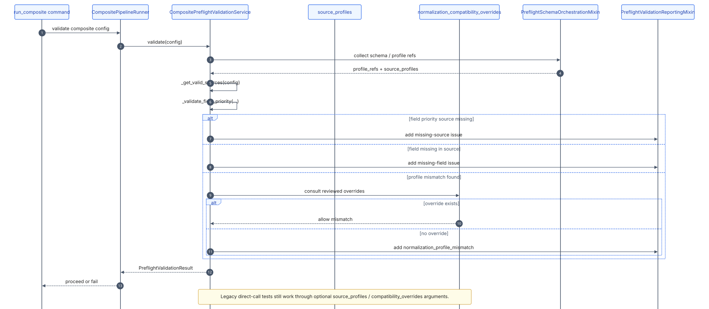

### Описание
Диаграмма «Composite Preflight Field Priority And Normalization Compatibility Resolution» из architecture-набора детализирует конкретный архитектурный компонент или подсистему BioETL. Она представлена в формате диаграмма последовательности (sequence) и служит ориентиром на уровне детализации «System / Interaction». В комментариях исходника зафиксирован фокус диаграммы: {init: {'theme': 'neutral', 'themeVariables': {'fontFamily': 'Inter, system-ui', 'lineWidth': '2'}}}%%.

### Метаданные
- Тип: `sequenceDiagram`
- Уровень: `System / Interaction`
- Дата: `2026-05-12`

\newpage

## 28-historical-replay-universe-inventory-and-closure-report

**Historical Replay Universe Inventory And Closure Report**

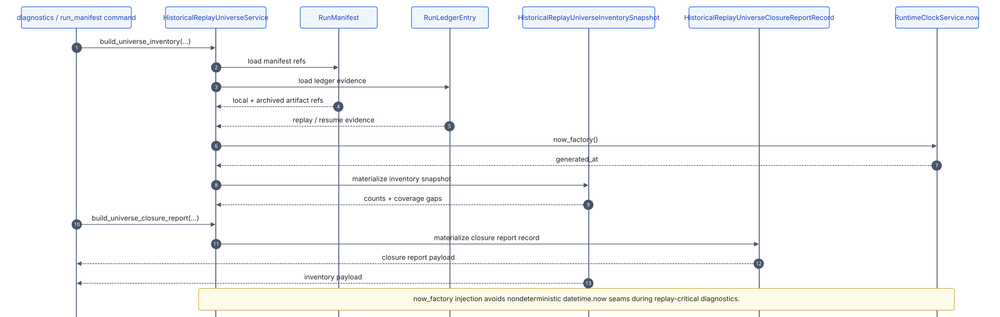

### Описание
Диаграмма «Historical Replay Universe Inventory And Closure Report» из architecture-набора детализирует конкретный архитектурный компонент или подсистему BioETL. Она представлена в формате диаграмма последовательности (sequence) и служит ориентиром на уровне детализации «System / Interaction». В комментариях исходника зафиксирован фокус диаграммы: {init: {'theme': 'neutral', 'themeVariables': {'fontFamily': 'Inter, system-ui', 'lineWidth': '2'}}}%%.

### Метаданные
- Тип: `sequenceDiagram`
- Уровень: `System / Interaction`
- Дата: `2026-05-12`

\newpage

## 29-provider-registry-loading-to-data-source-creation

**Provider Registry Loading To Data Source Creation**

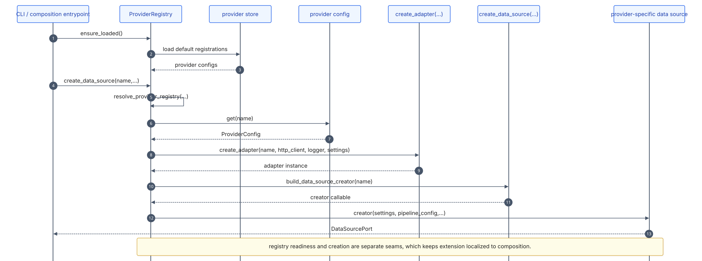

### Описание
Диаграмма «Provider Registry Loading To Data Source Creation» из architecture-набора детализирует конкретный архитектурный компонент или подсистему BioETL. Она представлена в формате диаграмма последовательности (sequence) и служит ориентиром на уровне детализации «System / Interaction». В комментариях исходника зафиксирован фокус диаграммы: {init: {'theme': 'neutral', 'themeVariables': {'fontFamily': 'Inter, system-ui', 'lineWidth': '2'}}}%%.

### Метаданные
- Тип: `sequenceDiagram`
- Уровень: `System / Interaction`
- Дата: `2026-05-12`

\newpage

## 30-postrun-retention-deduplication-and-vacuum-warning-path

**Postrun Retention Deduplication And Vacuum Warning Path**

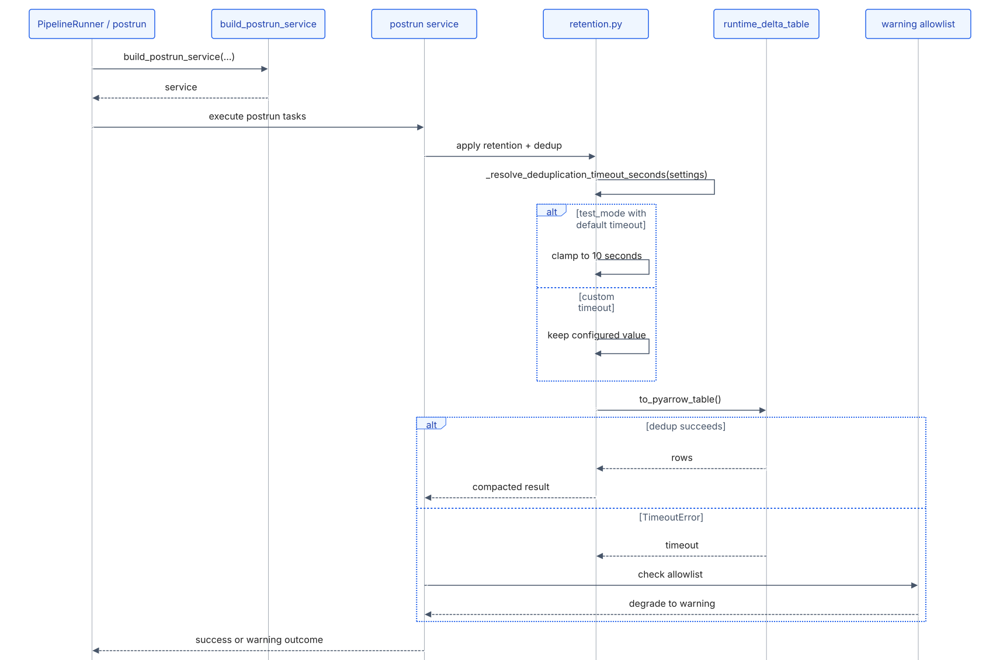

### Описание
Диаграмма «Postrun Retention Deduplication And Vacuum Warning Path» из architecture-набора детализирует конкретный архитектурный компонент или подсистему BioETL. Она представлена в формате диаграмма последовательности (sequence) и служит ориентиром на уровне детализации «System / Interaction». В комментариях исходника зафиксирован фокус диаграммы: {init: {'theme': 'neutral', 'themeVariables': {'fontFamily': 'Inter, system-ui', 'lineWidth': '2'}}}%%.

### Метаданные
- Тип: `sequenceDiagram`
- Уровень: `System / Interaction`
- Дата: `2026-05-12`

\newpage

## 31-workflow-control-plane-manifest-and-ledger-publication

**Workflow Control Plane Manifest And Ledger Publication**



### Описание
Диаграмма «Workflow Control Plane Manifest And Ledger Publication» из architecture-набора детализирует конкретный архитектурный компонент или подсистему BioETL. Она представлена в формате блок-схема потоков (flowchart) и служит ориентиром на уровне детализации «System / Control Plane». В комментариях исходника зафиксирован фокус диаграммы: {init: {'theme': 'neutral', 'themeVariables': {'fontFamily': 'Inter, system-ui', 'lineWidth': '2'}}}%%. Схема имеет плотность порядка 9 узлов и 10 связей; её удобно использовать как обзорный архитектурный срез для проверки влияния изменений, согласования интерфейсов и подготовки рефакторинга, но не как исчерпывающий каталог текущей кодовой поверхности. Показательные узлы для быстрого чтения: workflow CLI command, workflow execution state, WorkflowManifestStep, WorkflowManifest, WorkflowLedger, child run manifests.

### Метаданные
- Тип: `flowchart`
- Уровень: `System / Control Plane`
- Дата: `2026-05-12`

\newpage

## 32-lock-heartbeat-checkpoint-and-shutdown-collaboration

**Lock Heartbeat Checkpoint And Shutdown Collaboration**

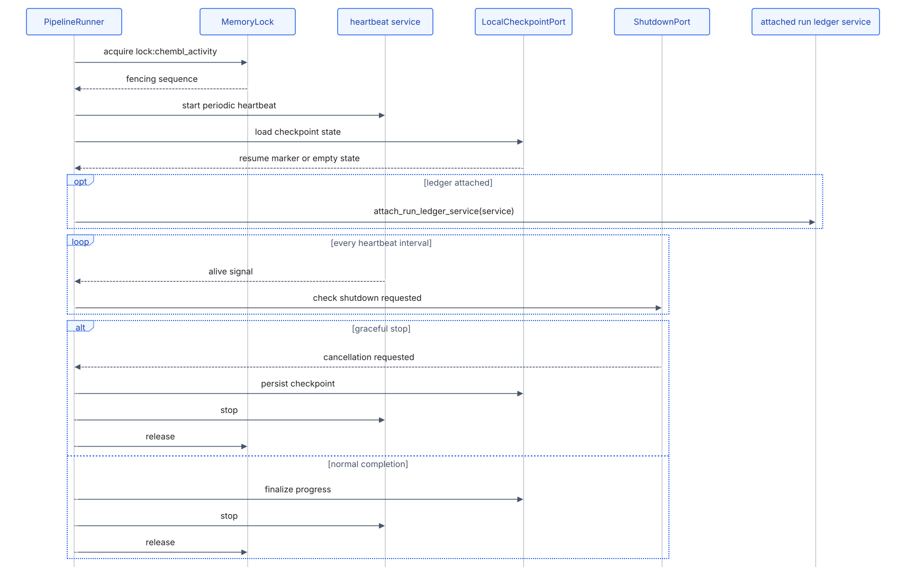

### Описание
Диаграмма «Lock Heartbeat Checkpoint And Shutdown Collaboration» из architecture-набора детализирует конкретный архитектурный компонент или подсистему BioETL. Она представлена в формате диаграмма последовательности (sequence) и служит ориентиром на уровне детализации «System / Interaction». В комментариях исходника зафиксирован фокус диаграммы: {init: {'theme': 'neutral', 'themeVariables': {'fontFamily': 'Inter, system-ui', 'lineWidth': '2'}}}%%.

### Метаданные
- Тип: `sequenceDiagram`
- Уровень: `System / Interaction`
- Дата: `2026-05-12`

\newpage

## 33-pipeline-service-bundle-and-runner-dependencies

**Pipeline Service Bundle And Runner Dependencies**

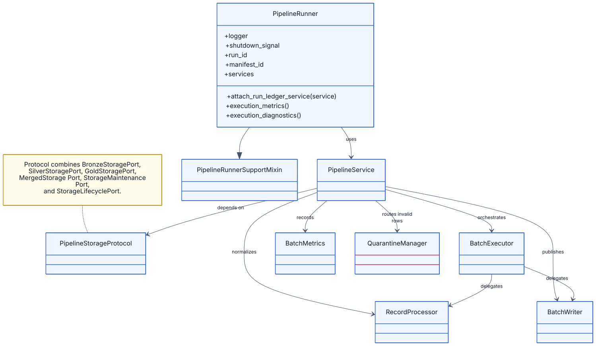

### Описание
Диаграмма «Pipeline Service Bundle And Runner Dependencies» из architecture-набора детализирует конкретный архитектурный компонент или подсистему BioETL. Она представлена в формате диаграмма классов (class diagram) и служит ориентиром на уровне детализации «Application / Component». В комментариях исходника зафиксирован фокус диаграммы: {init: {'theme': 'neutral', 'themeVariables': {'fontFamily': 'Inter, system-ui', 'lineWidth': '2'}}}%%. Схема имеет плотность порядка 9 узлов и 9 связей; её удобно использовать как обзорный архитектурный срез для проверки влияния изменений, согласования интерфейсов и подготовки рефакторинга, но не как исчерпывающий каталог текущей кодовой поверхности. Показательные узлы для быстрого чтения: PipelineRunner, PipelineService, PipelineStorageProtocol, BatchExecutor, RecordProcessor, BatchWriter.

### Метаданные
- Тип: `classDiagram`
- Уровень: `Application / Component`
- Дата: `2026-05-12`

\newpage

## 34-pipelinerun-aggregate-stage-result-and-terminal-transition-model

**PipelineRun Aggregate Stage Result And Terminal Transition Model**



### Описание
Диаграмма «PipelineRun Aggregate Stage Result And Terminal Transition Model» из architecture-набора детализирует конкретный архитектурный компонент или подсистему BioETL. Она представлена в формате диаграмма состояний (state diagram) и служит ориентиром на уровне детализации «Domain / Aggregate». В комментариях исходника зафиксирован фокус диаграммы: {init: {'theme': 'neutral', 'themeVariables': {'fontFamily': 'Inter, system-ui', 'lineWidth': '2'}}}%%.

### Метаданные
- Тип: `stateDiagram`
- Уровень: `Domain / Aggregate`
- Дата: `2026-05-12`

\newpage

## 35-batch-aggregate-seal-write-commit-failure-lifecycle

**Batch Aggregate Seal Write Commit Failure Lifecycle**

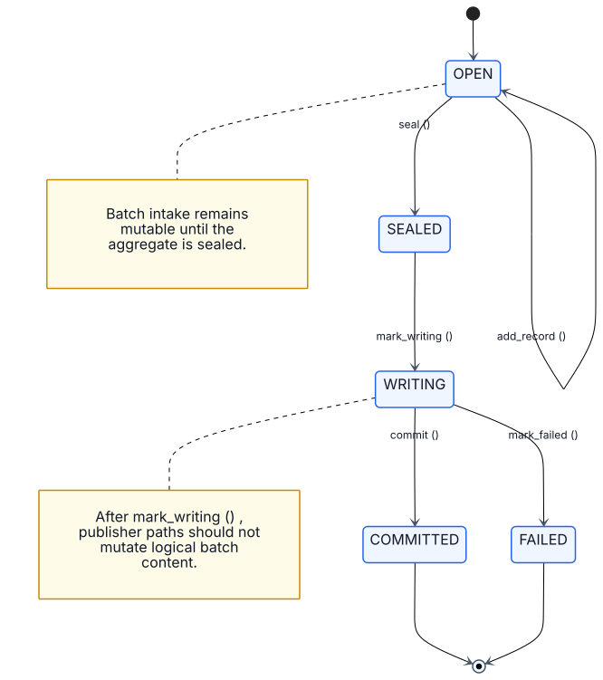

### Описание
Диаграмма «Batch Aggregate Seal Write Commit Failure Lifecycle» из architecture-набора детализирует конкретный архитектурный компонент или подсистему BioETL. Она представлена в формате диаграмма состояний (state diagram) и служит ориентиром на уровне детализации «Domain / Aggregate». В комментариях исходника зафиксирован фокус диаграммы: {init: {'theme': 'neutral', 'themeVariables': {'fontFamily': 'Inter, system-ui', 'lineWidth': '2'}}}%%.

### Метаданные
- Тип: `stateDiagram`
- Уровень: `Domain / Aggregate`
- Дата: `2026-05-12`

\newpage

## 36-quarantine-entry-review-resolution-and-discard-flow

**Quarantine Entry Review And Resolution Flow**



### Описание
Диаграмма «Quarantine Entry Review And Resolution Flow» из architecture-набора детализирует конкретный архитектурный компонент или подсистему BioETL. Она представлена в формате диаграмма состояний (state diagram) и служит ориентиром на уровне детализации «Domain / Aggregate». В комментариях исходника зафиксирован фокус диаграммы: {init: {'theme': 'neutral', 'themeVariables': {'fontFamily': 'Inter, system-ui', 'lineWidth': '2'}}}%%.

### Метаданные
- Тип: `stateDiagram`
- Уровень: `Domain / Aggregate`
- Дата: `2026-07-06`

\newpage

## 37-observability-bootstrap-bundle-from-settings-to-ports

**Observability Bootstrap Bundle From Settings To Ports**

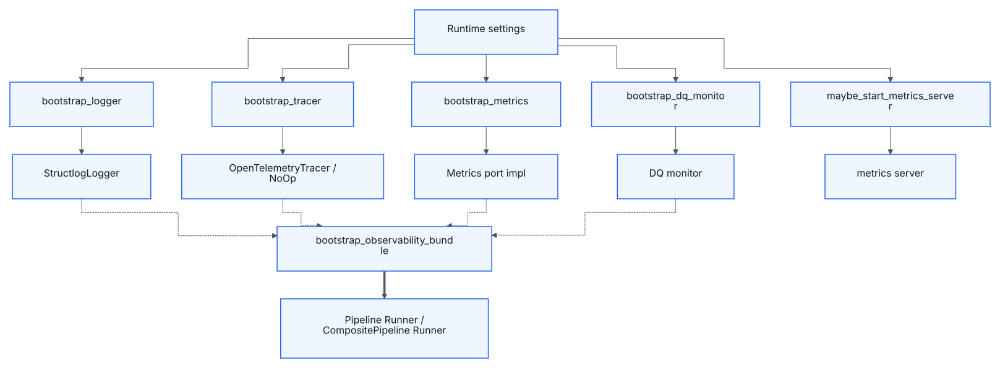

### Описание
Диаграмма «Observability Bootstrap Bundle From Settings To Ports» из architecture-набора детализирует конкретный архитектурный компонент или подсистему BioETL. Она представлена в формате блок-схема потоков (flowchart) и служит ориентиром на уровне детализации «System / Observability». В комментариях исходника зафиксирован фокус диаграммы: {init: {'theme': 'neutral', 'themeVariables': {'fontFamily': 'Inter, system-ui', 'lineWidth': '2'}}}%%. Схема имеет плотность порядка 13 узлов и 15 связей; её удобно использовать как обзорный архитектурный срез для проверки влияния изменений, согласования интерфейсов и подготовки рефакторинга, но не как исчерпывающий каталог текущей кодовой поверхности. Показательные узлы для быстрого чтения: Runtime settings, bootstrap_logger, bootstrap_tracer, bootstrap_metrics, bootstrap_dq_monitor, bootstrap_observability_bundle.

### Метаданные
- Тип: `flowchart`
- Уровень: `System / Observability`
- Дата: `2026-05-12`

\newpage

## 38-chembl-bronze-activity-extraction-to-artifact-publication

**ChEMBL Activity Extraction To Bronze Artifact Publication**

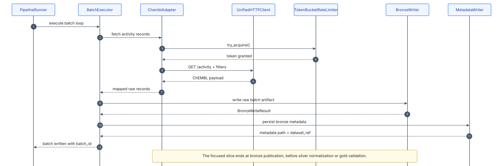

### Описание
Диаграмма «ChEMBL Activity Extraction To Bronze Artifact Publication» из architecture-набора детализирует конкретный архитектурный компонент или подсистему BioETL. Она представлена в формате диаграмма последовательности (sequence) и служит ориентиром на уровне детализации «Provider / Interaction». В комментариях исходника зафиксирован фокус диаграммы: {init: {'theme': 'neutral', 'themeVariables': {'fontFamily': 'Inter, system-ui', 'lineWidth': '2'}}}%%.

### Метаданные
- Тип: `sequenceDiagram`
- Уровень: `Provider / Interaction`
- Дата: `2026-05-12`

\newpage

## 39-crossref-search-fallback-and-batch-doi-fetch-publications

**CrossRef Publication Search Fallback And Batch DOI Fetch**

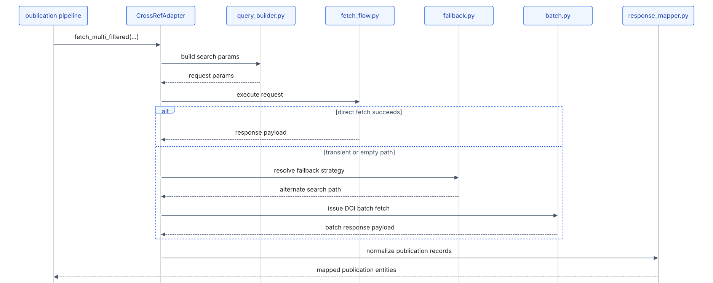

### Описание
Диаграмма «CrossRef Publication Search Fallback And Batch DOI Fetch» из architecture-набора детализирует конкретный архитектурный компонент или подсистему BioETL. Она представлена в формате диаграмма последовательности (sequence) и служит ориентиром на уровне детализации «Provider / Interaction». В комментариях исходника зафиксирован фокус диаграммы: {init: {'theme': 'neutral', 'themeVariables': {'fontFamily': 'Inter, system-ui', 'lineWidth': '2'}}}%%.

### Метаданные
- Тип: `sequenceDiagram`
- Уровень: `Provider / Interaction`
- Дата: `2026-05-12`

\newpage

## 40-pubmed-search-fetch-xml-parse-and-publication-mapping

**PubMed Search Fetch XML Parse And Publication Mapping**

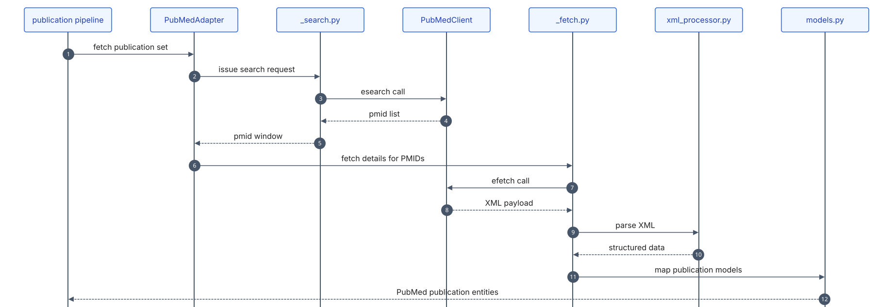

### Описание
Диаграмма «PubMed Search Fetch XML Parse And Publication Mapping» из architecture-набора детализирует конкретный архитектурный компонент или подсистему BioETL. Она представлена в формате диаграмма последовательности (sequence) и служит ориентиром на уровне детализации «Provider / Interaction». В комментариях исходника зафиксирован фокус диаграммы: {init: {'theme': 'neutral', 'themeVariables': {'fontFamily': 'Inter, system-ui', 'lineWidth': '2'}}}%%.

### Метаданные
- Тип: `sequenceDiagram`
- Уровень: `Provider / Interaction`
- Дата: `2026-05-12`

\newpage

## 41-openalex-cursor-pagination-and-response-mapping-path

**OpenAlex Cursor Pagination And Response Mapping Path**

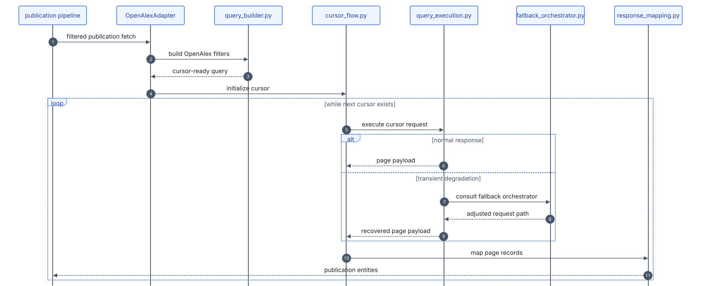

### Описание
Диаграмма «OpenAlex Cursor Pagination And Response Mapping Path» из architecture-набора детализирует конкретный архитектурный компонент или подсистему BioETL. Она представлена в формате диаграмма последовательности (sequence) и служит ориентиром на уровне детализации «Provider / Interaction». В комментариях исходника зафиксирован фокус диаграммы: {init: {'theme': 'neutral', 'themeVariables': {'fontFamily': 'Inter, system-ui', 'lineWidth': '2'}}}%%.

### Метаданные
- Тип: `sequenceDiagram`
- Уровень: `Provider / Interaction`
- Дата: `2026-05-12`

\newpage

## 42-semanticscholar-search-fallback-and-batch-request-flow

**SemanticScholar Search Fallback And Batch Request Flow**

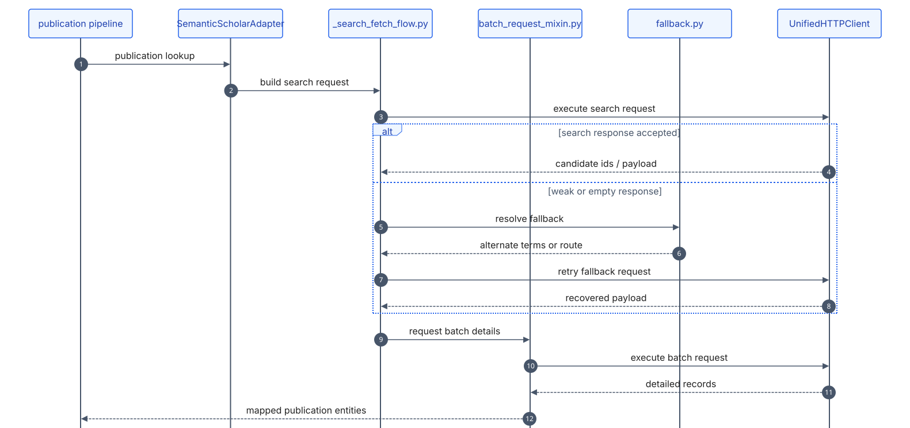

### Описание
Диаграмма «SemanticScholar Search Fallback And Batch Request Flow» из architecture-набора детализирует конкретный архитектурный компонент или подсистему BioETL. Она представлена в формате диаграмма последовательности (sequence) и служит ориентиром на уровне детализации «Provider / Interaction». В комментариях исходника зафиксирован фокус диаграммы: {init: {'theme': 'neutral', 'themeVariables': {'fontFamily': 'Inter, system-ui', 'lineWidth': '2'}}}%%.

### Метаданные
- Тип: `sequenceDiagram`
- Уровень: `Provider / Interaction`
- Дата: `2026-05-12`

\newpage

## 43-uniprot-mapping-job-to-protein-fetch-enrichment

**UniProt IDMapping To Protein Fetch Enrichment**



### Описание
Диаграмма «UniProt IDMapping To Protein Fetch Enrichment» из architecture-набора детализирует конкретный архитектурный компонент или подсистему BioETL. Она представлена в формате блок-схема потоков (flowchart) и служит ориентиром на уровне детализации «Provider / Component». В комментариях исходника зафиксирован фокус диаграммы: {init: {'theme': 'neutral', 'themeVariables': {'fontFamily': 'Inter, system-ui', 'lineWidth': '2'}}}%%. Схема имеет плотность порядка 10 узлов и 9 связей; её удобно использовать как обзорный архитектурный срез для проверки влияния изменений, согласования интерфейсов и подготовки рефакторинга, но не как исчерпывающий каталог текущей кодовой поверхности. Показательные узлы для быстрого чтения: seed ids or accessions, UniProtAdapter, UniProtIdMappingClient, start idmapping job, poll job status, mapped accession set.

### Метаданные
- Тип: `flowchart`
- Уровень: `Provider / Component`
- Дата: `2026-05-12`

\newpage

## 44-pubchem-fetch-strategy-resolution-for-compounds

**PubChem Compound Fetch Strategy Resolution**



### Описание
Диаграмма «PubChem Compound Fetch Strategy Resolution» из architecture-набора детализирует конкретный архитектурный компонент или подсистему BioETL. Она представлена в формате блок-схема потоков (flowchart) и служит ориентиром на уровне детализации «Provider / Component». В комментариях исходника зафиксирован фокус диаграммы: {init: {'theme': 'neutral', 'themeVariables': {'fontFamily': 'Inter, system-ui', 'lineWidth': '2'}}}%%. Схема имеет плотность порядка 9 узлов и 8 связей; её удобно использовать как обзорный архитектурный срез для проверки влияния изменений, согласования интерфейсов и подготовки рефакторинга, но не как исчерпывающий каталог текущей кодовой поверхности. Показательные узлы для быстрого чтения: compound request, PubChemAdapter, fetch_strategies.py, query_builder.py, fetch_flow.py, response_mapper.py.

### Метаданные
- Тип: `flowchart`
- Уровень: `Provider / Component`
- Дата: `2026-05-12`

\newpage

## 45-dq-contract-config-loading-and-policy-resolution

**DQ Contract Config Loading And Policy Resolution**

### Описание
Диаграмма «DQ Contract Config Loading And Policy Resolution» из architecture-набора детализирует конкретный архитектурный компонент или подсистему BioETL. Она представлена в формате блок-схема потоков (flowchart) и служит ориентиром на уровне детализации «Configuration / Component». В комментариях исходника зафиксирован фокус диаграммы: {init: {'theme': 'neutral', 'themeVariables': {'fontFamily': 'Inter, system-ui', 'lineWidth': '2'}}}%%. Схема имеет плотность порядка 8 узлов и 7 связей; её удобно использовать как обзорный архитектурный срез для проверки влияния изменений, согласования интерфейсов и подготовки рефакторинга, но не как исчерпывающий каталог текущей кодовой поверхности. Показательные узлы для быстрого чтения: DQ YAML policies, dq_config_loader.py, _dq_config_normalization.py, _dq_config_validation_merge.py, DQPolicySnapshot, dq_policy_resolver.py.

### Метаданные
- Тип: `flowchart`
- Уровень: `Configuration / Component`
- Дата: `2026-05-12`

\newpage

## 46-filter-config-resolution-and-column-filter-evaluation

**Filter Config Resolution And Column Filter Evaluation**



### Описание
Диаграмма «Filter Config Resolution And Column Filter Evaluation» из architecture-набора детализирует конкретный архитектурный компонент или подсистему BioETL. Она представлена в формате блок-схема потоков (flowchart) и служит ориентиром на уровне детализации «Configuration / Component». В комментариях исходника зафиксирован фокус диаграммы: {init: {'theme': 'neutral', 'themeVariables': {'fontFamily': 'Inter, system-ui', 'lineWidth': '2'}}}%%. Схема имеет плотность порядка 9 узлов и 11 связей; её удобно использовать как обзорный архитектурный срез для проверки влияния изменений, согласования интерфейсов и подготовки рефакторинга, но не как исчерпывающий каталог текущей кодовой поверхности. Показательные узлы для быстрого чтения: filter YAML, filter_config_loader.py, input_config.py, silver_config.py, gold_config.py, column_filter.py.

### Метаданные
- Тип: `flowchart`
- Уровень: `Configuration / Component`
- Дата: `2026-05-12`

\newpage

## 47-run-manifest-domain-model-and-serialization-surface

**Run Manifest Domain Model And Serialization Surface**



### Описание
Диаграмма «Run Manifest Domain Model And Serialization Surface» из architecture-набора детализирует конкретный архитектурный компонент или подсистему BioETL. Она представлена в формате диаграмма классов (class diagram) и служит ориентиром на уровне детализации «Domain / Model». В комментариях исходника зафиксирован фокус диаграммы: {init: {'theme': 'neutral', 'themeVariables': {'fontFamily': 'Inter, system-ui', 'lineWidth': '2'}}}%%. Схема имеет плотность порядка 6 узлов и 5 связей; её удобно использовать как обзорный архитектурный срез для проверки влияния изменений, согласования интерфейсов и подготовки рефакторинга, но не как исчерпывающий каталог текущей кодовой поверхности. Показательные узлы для быстрого чтения: RunManifest, ReplayCapability, RunInputSnapshotRef, RunSourceRef, RunArtifactRef, RunCodeProvenance.

### Метаданные
- Тип: `classDiagram`
- Уровень: `Domain / Model`
- Дата: `2026-05-12`

\newpage

## 48-effective-config-artifact-domain-model

**Effective Config Artifact Domain Model**



### Описание
Диаграмма «Effective Config Artifact Domain Model» из architecture-набора детализирует конкретный архитектурный компонент или подсистему BioETL. Она представлена в формате диаграмма классов (class diagram) и служит ориентиром на уровне детализации «Domain / Model». В комментариях исходника зафиксирован фокус диаграммы: {init: {'theme': 'neutral', 'themeVariables': {'fontFamily': 'Inter, system-ui', 'lineWidth': '2'}}}%%. Схема имеет плотность порядка 9 узлов и 8 связей; её удобно использовать как обзорный архитектурный срез для проверки влияния изменений, согласования интерфейсов и подготовки рефакторинга, но не как исчерпывающий каталог текущей кодовой поверхности. Показательные узлы для быстрого чтения: EffectiveConfigArtifact, EffectiveConfigHashes, ConfigSourceRef, ResolvedConfigSnapshot, RuntimeOverrideSnapshot, ExecutionEnvironmentSnapshot.

### Метаданные
- Тип: `classDiagram`
- Уровень: `Domain / Model`
- Дата: `2026-05-12`

\newpage

## 49-chembl-pipeline-activity-dataflow

**ChEMBL Activity Source To Silver And Gold**



### Описание
Диаграмма «ChEMBL Activity Source To Silver And Gold» из architecture-набора детализирует конкретный архитектурный компонент или подсистему BioETL. Она представлена в формате блок-схема потоков (flowchart) и служит ориентиром на уровне детализации «Pipeline / Dataflow». В комментариях исходника зафиксирован фокус диаграммы: Generated from the resolved chembl_activity configuration and contracts.. Схема имеет плотность порядка 14 узлов и 13 связей; её удобно использовать как обзорный архитектурный срез для проверки влияния изменений, согласования интерфейсов и подготовки рефакторинга, но не как исчерпывающий каталог текущей кодовой поверхности. Показательные узлы для быстрого чтения: ChEMBL activity API, Source query 9 criteria, Bronze records raw source payload, Input-file filter disabled, Activity Transformer Bronze to Silver, Silver structural filter 29 criteria. Связанный ADR: ADR-002, ADR-040.

### Метаданные
- Тип: `flowchart`
- Уровень: `Pipeline / Dataflow`
- Дата: `2026-07-18`
- Узлы (metadata): `14`
- ADR: `ADR-002, ADR-040`

\newpage

## 50-chembl-pipeline-activity-filter-criteria

**ChEMBL Activity Query And Filtering Criteria**

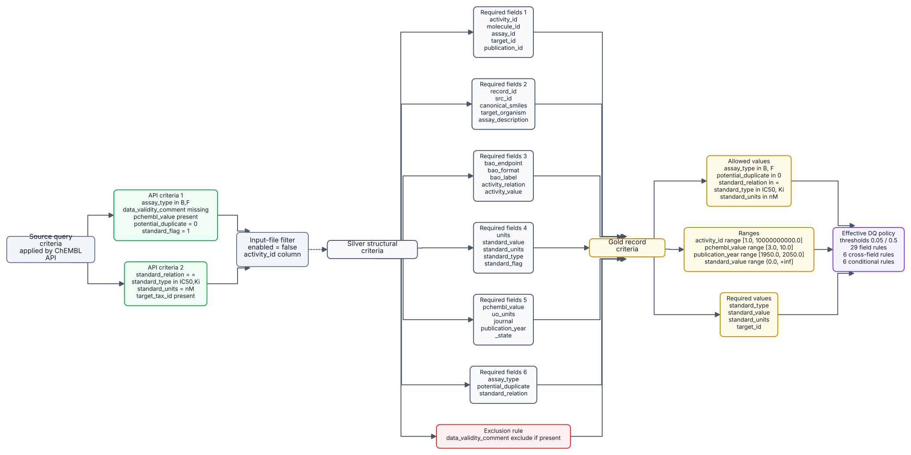

### Описание
Диаграмма «ChEMBL Activity Query And Filtering Criteria» из architecture-набора детализирует конкретный архитектурный компонент или подсистему BioETL. Она представлена в формате блок-схема потоков (flowchart) и служит ориентиром на уровне детализации «Pipeline / Rules». В комментариях исходника зафиксирован фокус диаграммы: Generated from the resolved chembl_activity configuration and contracts.. Схема имеет плотность порядка 17 узлов и 25 связей; её удобно использовать как обзорный архитектурный срез для проверки влияния изменений, согласования интерфейсов и подготовки рефакторинга, но не как исчерпывающий каталог текущей кодовой поверхности. Показательные узлы для быстрого чтения: Source query criteria applied by ChEMBL API, Input-file filter enabled = false activity_id column, Silver structural criteria, Required fields 1 activity_id molecule_id assay_id target_id publication_id, Required fields 5 pchembl_value uo_units journal publication_year _state, Required fields 6 assay_type potential_duplicate standard_relation. Связанный ADR: ADR-002, ADR-040.

### Метаданные
- Тип: `flowchart`
- Уровень: `Pipeline / Rules`
- Дата: `2026-07-18`
- Узлы (metadata): `17`
- ADR: `ADR-002, ADR-040`

\newpage

## 51a-chembl-pipeline-activity-silver-fields-1

**ChEMBL Activity Silver Output Fields 1 Of 2**

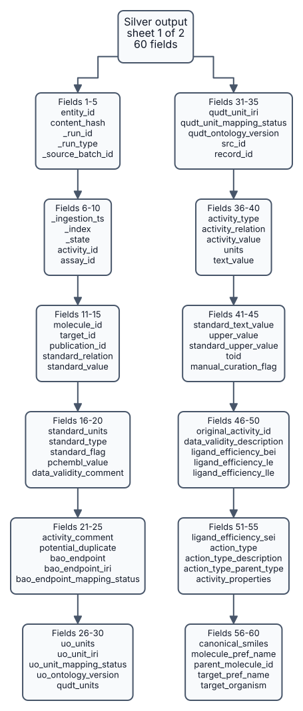

### Описание
Диаграмма «ChEMBL Activity Silver Output Fields 1 Of 2» из architecture-набора детализирует конкретный архитектурный компонент или подсистему BioETL. Она представлена в формате блок-схема потоков (flowchart) и служит ориентиром на уровне детализации «Pipeline / Silver Contract». В комментариях исходника зафиксирован фокус диаграммы: Generated from the resolved chembl_activity configuration and contracts.. Схема имеет плотность порядка 13 узлов и 12 связей; её удобно использовать как обзорный архитектурный срез для проверки влияния изменений, согласования интерфейсов и подготовки рефакторинга, но не как исчерпывающий каталог текущей кодовой поверхности. Показательные узлы для быстрого чтения: Silver output sheet 1 of 2 60 fields, Fields 1-5 entity_id content_hash _run_id _run_type _source_batch_id, Fields 6-10 _ingestion_ts _index _state activity_id assay_id, Fields 36-40 activity_type activity_relation activity_value units text_value. Связанный ADR: ADR-002, ADR-040.

### Метаданные
- Тип: `flowchart`
- Уровень: `Pipeline / Silver Contract`
- Дата: `2026-07-18`
- Узлы (metadata): `13`
- ADR: `ADR-002, ADR-040`

\newpage

## 51b-chembl-pipeline-activity-silver-fields-2

**ChEMBL Activity Silver Output Fields 2 Of 2**

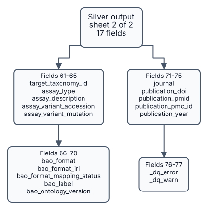

### Описание
Диаграмма «ChEMBL Activity Silver Output Fields 2 Of 2» из architecture-набора детализирует конкретный архитектурный компонент или подсистему BioETL. Она представлена в формате блок-схема потоков (flowchart) и служит ориентиром на уровне детализации «Pipeline / Silver Contract». В комментариях исходника зафиксирован фокус диаграммы: Generated from the resolved chembl_activity configuration and contracts.. Схема имеет плотность порядка 5 узлов и 4 связей; её удобно использовать как обзорный архитектурный срез для проверки влияния изменений, согласования интерфейсов и подготовки рефакторинга, но не как исчерпывающий каталог текущей кодовой поверхности. Показательные узлы для быстрого чтения: Silver output sheet 2 of 2 17 fields, Fields 76-77 _dq_error _dq_warn. Связанный ADR: ADR-002, ADR-040.

### Метаданные
- Тип: `flowchart`
- Уровень: `Pipeline / Silver Contract`
- Дата: `2026-07-18`
- Узлы (metadata): `5`
- ADR: `ADR-002, ADR-040`

\newpage

## 52a-chembl-pipeline-activity-gold-fields-1

**ChEMBL Activity Gold Output Fields 1 Of 2**

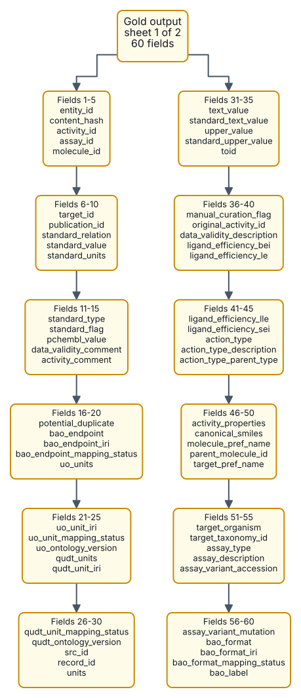

### Описание
Диаграмма «ChEMBL Activity Gold Output Fields 1 Of 2» из architecture-набора детализирует конкретный архитектурный компонент или подсистему BioETL. Она представлена в формате блок-схема потоков (flowchart) и служит ориентиром на уровне детализации «Pipeline / Gold Contract». В комментариях исходника зафиксирован фокус диаграммы: Generated from the resolved chembl_activity configuration and contracts.. Схема имеет плотность порядка 13 узлов и 12 связей; её удобно использовать как обзорный архитектурный срез для проверки влияния изменений, согласования интерфейсов и подготовки рефакторинга, но не как исчерпывающий каталог текущей кодовой поверхности. Показательные узлы для быстрого чтения: Gold output sheet 1 of 2 60 fields, Fields 1-5 entity_id content_hash activity_id assay_id molecule_id. Связанный ADR: ADR-002, ADR-040.

### Метаданные
- Тип: `flowchart`
- Уровень: `Pipeline / Gold Contract`
- Дата: `2026-07-18`
- Узлы (metadata): `13`
- ADR: `ADR-002, ADR-040`

\newpage

## 52b-chembl-pipeline-activity-gold-fields-2

**ChEMBL Activity Gold Output Fields 2 Of 2**

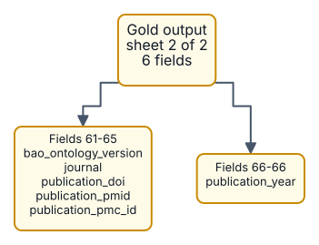

### Описание
Диаграмма «ChEMBL Activity Gold Output Fields 2 Of 2» из architecture-набора детализирует конкретный архитектурный компонент или подсистему BioETL. Она представлена в формате блок-схема потоков (flowchart) и служит ориентиром на уровне детализации «Pipeline / Gold Contract». В комментариях исходника зафиксирован фокус диаграммы: Generated from the resolved chembl_activity configuration and contracts.. Схема имеет плотность порядка 3 узлов и 2 связей; её удобно использовать как обзорный архитектурный срез для проверки влияния изменений, согласования интерфейсов и подготовки рефакторинга, но не как исчерпывающий каталог текущей кодовой поверхности. Показательные узлы для быстрого чтения: Gold output sheet 2 of 2 6 fields, Fields 66-66 publication_year. Связанный ADR: ADR-002, ADR-040.

### Метаданные
- Тип: `flowchart`
- Уровень: `Pipeline / Gold Contract`
- Дата: `2026-07-18`
- Узлы (metadata): `3`
- ADR: `ADR-002, ADR-040`
