# BioETL Class Diagrams Bundle

- Generated: 2026-08-26T21:23:35
- Diagram count: 145

## Table of Contents

- [01-domain-ports — Class Diagram: Domain Port Protocols](#01-domain-ports)
- [01a-domain-ports-method-catalog — Class Diagram: Domain Port Method Catalog (L2)](#01a-domain-ports-method-catalog)
- [02-entities-aggregates — Class Diagram: Entities & Aggregates](#02-entities-aggregates)
- [03-value-objects — Class Diagram: Value Objects](#03-value-objects)
- [04-types-enums — Class Diagram: Types & Enums](#04-types-enums)
- [05-exceptions — Class Diagram: Exception Hierarchy](#05-exceptions)
- [06-config-classes — Class Diagram: Configuration Classes](#06-config-classes)
- [07-application-core-services-frontmatter-sandbox — 07 Application Core Services Frontmatter Sandbox](#07-application-core-services-frontmatter-sandbox)
- [07-application-core-services — Class Diagram: Application Core Services](#07-application-core-services)
- [08-application-services — Class Diagram: Application Services](#08-application-services)
- [08a-application-services-operation-catalog — Class Diagram: Application Service Operation Catalog (L2)](#08a-application-services-operation-catalog)
- [09-transformers — Class Diagram: Transformers](#09-transformers)
- [10-adapters — Class Diagram: Infrastructure Adapters](#10-adapters)
- [11-storage — Class Diagram: Storage Components](#11-storage)
- [12-composite-pipeline — Class Diagram: Composite Pipeline Components](#12-composite-pipeline)
- [13-domain-services — Class Diagram: Domain Services](#13-domain-services)
- [14-observability — Class Diagram: Observability Components](#14-observability)
- [14a-observability-method-catalog — Class Diagram: Observability Method Catalog (L2)](#14a-observability-method-catalog)
- [15-extractors — Class Diagram: Field Extractors and Publication Blocks](#15-extractors)
- [16-factories-bootstrap — Class Diagram: Factories & Bootstrap](#16-factories-bootstrap)
- [90-pkg-application-composite-checkpoint — Package Family: application/composite/checkpoint](#90-pkg-application-composite-checkpoint)
- [90-pkg-application-composite-helpers — Package Family: application/composite/helpers](#90-pkg-application-composite-helpers)
- [90-pkg-application-composite-runner-pkg-part1 — Package Family: application/composite/runner_pkg (Part 1/2)](#90-pkg-application-composite-runner-pkg-part1)
- [90-pkg-application-composite-runner-pkg-part2 — Package Family: application/composite/runner_pkg (Part 2/2)](#90-pkg-application-composite-runner-pkg-part2)
- [90-pkg-application-core-base-transformer — Package Family: application/core/base_transformer](#90-pkg-application-core-base-transformer)
- [90-pkg-application-core-batch-execution — Package Family: application/core/batch_execution](#90-pkg-application-core-batch-execution)
- [90-pkg-application-core-data-sources — Package Family: application/core/data_sources](#90-pkg-application-core-data-sources)
- [90-pkg-application-core-lifecycle — Package Family: application/core/lifecycle](#90-pkg-application-core-lifecycle)
- [90-pkg-application-core-postrun — Package Family: application/core/postrun](#90-pkg-application-core-postrun)
- [90-pkg-application-core-preflight — Package Family: application/core/preflight](#90-pkg-application-core-preflight)
- [90-pkg-application-observability-control-plane-evidence — Package Family: application/observability/control_plane_evidence](#90-pkg-application-observability-control-plane-evidence)
- [90-pkg-application-observability — Package Family: application/observability](#90-pkg-application-observability)
- [90-pkg-application-pipelines-chembl-part1 — Package Family: application/pipelines/chembl (Part 1/2)](#90-pkg-application-pipelines-chembl-part1)
- [90-pkg-application-pipelines-chembl-part2 — Package Family: application/pipelines/chembl (Part 2/2)](#90-pkg-application-pipelines-chembl-part2)
- [90-pkg-application-pipelines-common — Package Family: application/pipelines/common](#90-pkg-application-pipelines-common)
- [90-pkg-application-pipelines-crossref — Package Family: application/pipelines/crossref](#90-pkg-application-pipelines-crossref)
- [90-pkg-application-pipelines-pubmed — Package Family: application/pipelines/pubmed](#90-pkg-application-pipelines-pubmed)
- [90-pkg-application-pipelines-uniprot-extractors — Package Family: application/pipelines/uniprot/extractors](#90-pkg-application-pipelines-uniprot-extractors)
- [90-pkg-application-pipelines-uniprot — Package Family: application/pipelines/uniprot](#90-pkg-application-pipelines-uniprot)
- [90-pkg-application-ports-part1 — Package Family: application/ports (Part 1/2)](#90-pkg-application-ports-part1)
- [90-pkg-application-ports-part2 — Package Family: application/ports (Part 2/2)](#90-pkg-application-ports-part2)
- [90-pkg-application-services-checkpoint — Package Family: application/services/checkpoint](#90-pkg-application-services-checkpoint)
- [90-pkg-application-services-contracts — Package Family: application/services/contracts](#90-pkg-application-services-contracts)
- [90-pkg-application-services-control-plane-ledger — Package Family: application/services/control_plane/ledger](#90-pkg-application-services-control-plane-ledger)
- [90-pkg-application-services-control-plane-manifest-diagnostics — Package Family: application/services/control_plane/manifest/diagnostics](#90-pkg-application-services-control-plane-manifest-diagnostics)
- [90-pkg-application-services-control-plane-manifest — Package Family: application/services/control_plane/manifest](#90-pkg-application-services-control-plane-manifest)
- [90-pkg-application-services-control-plane-replay — Package Family: application/services/control_plane/replay](#90-pkg-application-services-control-plane-replay)
- [90-pkg-application-services-control-plane-workflow — Package Family: application/services/control_plane/workflow](#90-pkg-application-services-control-plane-workflow)
- [90-pkg-application-services-dq — Package Family: application/services/dq](#90-pkg-application-services-dq)
- [90-pkg-application-services-execution — Package Family: application/services/execution](#90-pkg-application-services-execution)
- [90-pkg-application-services-export-lineage — Package Family: application/services/export_lineage](#90-pkg-application-services-export-lineage)
- [90-pkg-application-services-lineage — Package Family: application/services/lineage](#90-pkg-application-services-lineage)
- [90-pkg-application-services-medallion — Package Family: application/services/medallion](#90-pkg-application-services-medallion)
- [90-pkg-application-services-ops — Package Family: application/services/ops](#90-pkg-application-services-ops)
- [90-pkg-application-services-protein — Package Family: application/services/protein](#90-pkg-application-services-protein)
- [90-pkg-application-services-quality — Package Family: application/services/quality](#90-pkg-application-services-quality)
- [90-pkg-application-services-run-reports — Package Family: application/services/run_reports](#90-pkg-application-services-run-reports)
- [90-pkg-application-services-workflow-control-plane — Package Family: application/services/workflow/control_plane](#90-pkg-application-services-workflow-control-plane)
- [90-pkg-application-services-workflow — Package Family: application/services/workflow](#90-pkg-application-services-workflow)
- [90-pkg-composition-bootstrap-assembly — Package Family: composition/bootstrap/assembly](#90-pkg-composition-bootstrap-assembly)
- [90-pkg-composition-bootstrap-runtime — Package Family: composition/bootstrap/runtime](#90-pkg-composition-bootstrap-runtime)
- [90-pkg-composition-contracts — Package Family: composition/contracts](#90-pkg-composition-contracts)
- [90-pkg-composition-factories-datasource — Package Family: composition/factories/datasource](#90-pkg-composition-factories-datasource)
- [90-pkg-composition-factories-services — Package Family: composition/factories/services](#90-pkg-composition-factories-services)
- [90-pkg-composition-factories-storage — Package Family: composition/factories/storage](#90-pkg-composition-factories-storage)
- [90-pkg-composition-providers — Package Family: composition/providers](#90-pkg-composition-providers)
- [90-pkg-composition-runtime-builders — Package Family: composition/runtime_builders](#90-pkg-composition-runtime-builders)
- [90-pkg-composition — Package Family: composition](#90-pkg-composition)
- [90-pkg-domain-aggregates — Package Family: domain/aggregates](#90-pkg-domain-aggregates)
- [90-pkg-domain-behavior-part1 — Package Family: domain/behavior (Part 1/2)](#90-pkg-domain-behavior-part1)
- [90-pkg-domain-behavior-part2 — Package Family: domain/behavior (Part 2/2)](#90-pkg-domain-behavior-part2)
- [90-pkg-domain-composite-part1 — Package Family: domain/composite (Part 1/3)](#90-pkg-domain-composite-part1)
- [90-pkg-domain-composite-part2 — Package Family: domain/composite (Part 2/3)](#90-pkg-domain-composite-part2)
- [90-pkg-domain-composite-part3 — Package Family: domain/composite (Part 3/3)](#90-pkg-domain-composite-part3)
- [90-pkg-domain-contracts-gold-part1 — Package Family: domain/contracts/gold (Part 1/2)](#90-pkg-domain-contracts-gold-part1)
- [90-pkg-domain-contracts-gold-part2 — Package Family: domain/contracts/gold (Part 2/2)](#90-pkg-domain-contracts-gold-part2)
- [90-pkg-domain-control-plane-part1 — Package Family: domain/control_plane (Part 1/2)](#90-pkg-domain-control-plane-part1)
- [90-pkg-domain-control-plane-part2 — Package Family: domain/control_plane (Part 2/2)](#90-pkg-domain-control-plane-part2)
- [90-pkg-domain-exceptions-network — Package Family: domain/exceptions/network](#90-pkg-domain-exceptions-network)
- [90-pkg-domain-exceptions-storage — Package Family: domain/exceptions/storage](#90-pkg-domain-exceptions-storage)
- [90-pkg-domain-filtering — Package Family: domain/filtering](#90-pkg-domain-filtering)
- [90-pkg-domain-lineage — Package Family: domain/lineage](#90-pkg-domain-lineage)
- [90-pkg-domain-mapping — Package Family: domain/mapping](#90-pkg-domain-mapping)
- [90-pkg-domain-models-part1 — Package Family: domain/models (Part 1/2)](#90-pkg-domain-models-part1)
- [90-pkg-domain-models-part2 — Package Family: domain/models (Part 2/2)](#90-pkg-domain-models-part2)
- [90-pkg-domain-normalization-profiles — Package Family: domain/normalization/profiles](#90-pkg-domain-normalization-profiles)
- [90-pkg-domain-normalization — Package Family: domain/normalization](#90-pkg-domain-normalization)
- [90-pkg-domain-part1 — Package Family: domain (Part 1/2)](#90-pkg-domain-part1)
- [90-pkg-domain-part2 — Package Family: domain (Part 2/2)](#90-pkg-domain-part2)
- [90-pkg-domain-ports-config — Package Family: domain/ports/config](#90-pkg-domain-ports-config)
- [90-pkg-domain-ports-control-plane — Package Family: domain/ports/control_plane](#90-pkg-domain-ports-control-plane)
- [90-pkg-domain-ports-metadata — Package Family: domain/ports/metadata](#90-pkg-domain-ports-metadata)
- [90-pkg-domain-ports-noop — Package Family: domain/ports/noop](#90-pkg-domain-ports-noop)
- [90-pkg-domain-ports-observability — Package Family: domain/ports/observability](#90-pkg-domain-ports-observability)
- [90-pkg-domain-ports-quality — Package Family: domain/ports/quality](#90-pkg-domain-ports-quality)
- [90-pkg-domain-ports-runtime — Package Family: domain/ports/runtime](#90-pkg-domain-ports-runtime)
- [90-pkg-domain-ports-storage — Package Family: domain/ports/storage](#90-pkg-domain-ports-storage)
- [90-pkg-domain-registry — Package Family: domain/registry](#90-pkg-domain-registry)
- [90-pkg-domain-run-reports — Package Family: domain/run_reports](#90-pkg-domain-run-reports)
- [90-pkg-domain-schemas-chembl — Package Family: domain/schemas/chembl](#90-pkg-domain-schemas-chembl)
- [90-pkg-domain-schemas-pubchem — Package Family: domain/schemas/pubchem](#90-pkg-domain-schemas-pubchem)
- [90-pkg-domain-schemas-uniprot — Package Family: domain/schemas/uniprot](#90-pkg-domain-schemas-uniprot)
- [90-pkg-domain-workflow — Package Family: domain/workflow](#90-pkg-domain-workflow)
- [90-pkg-infrastructure-adapters-chembl-part1 — Package Family: infrastructure/adapters/chembl (Part 1/2)](#90-pkg-infrastructure-adapters-chembl-part1)
- [90-pkg-infrastructure-adapters-chembl-part2 — Package Family: infrastructure/adapters/chembl (Part 2/2)](#90-pkg-infrastructure-adapters-chembl-part2)
- [90-pkg-infrastructure-adapters-common — Package Family: infrastructure/adapters/common](#90-pkg-infrastructure-adapters-common)
- [90-pkg-infrastructure-adapters-crossref — Package Family: infrastructure/adapters/crossref](#90-pkg-infrastructure-adapters-crossref)
- [90-pkg-infrastructure-adapters-http — Package Family: infrastructure/adapters/http](#90-pkg-infrastructure-adapters-http)
- [90-pkg-infrastructure-adapters-openalex — Package Family: infrastructure/adapters/openalex](#90-pkg-infrastructure-adapters-openalex)
- [90-pkg-infrastructure-adapters-pubchem — Package Family: infrastructure/adapters/pubchem](#90-pkg-infrastructure-adapters-pubchem)
- [90-pkg-infrastructure-adapters-pubmed — Package Family: infrastructure/adapters/pubmed](#90-pkg-infrastructure-adapters-pubmed)
- [90-pkg-infrastructure-adapters-semanticscholar — Package Family: infrastructure/adapters/semanticscholar](#90-pkg-infrastructure-adapters-semanticscholar)
- [90-pkg-infrastructure-adapters-uniprot-part1 — Package Family: infrastructure/adapters/uniprot (Part 1/2)](#90-pkg-infrastructure-adapters-uniprot-part1)
- [90-pkg-infrastructure-adapters-uniprot-part2 — Package Family: infrastructure/adapters/uniprot (Part 2/2)](#90-pkg-infrastructure-adapters-uniprot-part2)
- [90-pkg-infrastructure-config-part1 — Package Family: infrastructure/config (Part 1/2)](#90-pkg-infrastructure-config-part1)
- [90-pkg-infrastructure-config-part2 — Package Family: infrastructure/config (Part 2/2)](#90-pkg-infrastructure-config-part2)
- [90-pkg-infrastructure-control-plane-part1 — Package Family: infrastructure/control_plane (Part 1/2)](#90-pkg-infrastructure-control-plane-part1)
- [90-pkg-infrastructure-control-plane-part2 — Package Family: infrastructure/control_plane (Part 2/2)](#90-pkg-infrastructure-control-plane-part2)
- [90-pkg-infrastructure-export — Package Family: infrastructure/export](#90-pkg-infrastructure-export)
- [90-pkg-infrastructure-quality — Package Family: infrastructure/quality](#90-pkg-infrastructure-quality)
- [90-pkg-infrastructure-quarantine — Package Family: infrastructure/quarantine](#90-pkg-infrastructure-quarantine)
- [90-pkg-infrastructure-schemas-part1 — Package Family: infrastructure/schemas (Part 1/4)](#90-pkg-infrastructure-schemas-part1)
- [90-pkg-infrastructure-schemas-part2 — Package Family: infrastructure/schemas (Part 2/4)](#90-pkg-infrastructure-schemas-part2)
- [90-pkg-infrastructure-schemas-part3 — Package Family: infrastructure/schemas (Part 3/4)](#90-pkg-infrastructure-schemas-part3)
- [90-pkg-infrastructure-schemas-part4 — Package Family: infrastructure/schemas (Part 4/4)](#90-pkg-infrastructure-schemas-part4)
- [90-pkg-infrastructure-storage-bronze — Package Family: infrastructure/storage/bronze](#90-pkg-infrastructure-storage-bronze)
- [90-pkg-infrastructure-storage-delta — Package Family: infrastructure/storage/delta](#90-pkg-infrastructure-storage-delta)
- [90-pkg-infrastructure-storage-gold-part1 — Package Family: infrastructure/storage/gold (Part 1/2)](#90-pkg-infrastructure-storage-gold-part1)
- [90-pkg-infrastructure-storage-gold-part2 — Package Family: infrastructure/storage/gold (Part 2/2)](#90-pkg-infrastructure-storage-gold-part2)
- [90-pkg-infrastructure-storage-metadata — Package Family: infrastructure/storage/metadata](#90-pkg-infrastructure-storage-metadata)
- [90-pkg-infrastructure-storage-silver-operations-part1 — Package Family: infrastructure/storage/silver/operations (Part 1/2)](#90-pkg-infrastructure-storage-silver-operations-part1)
- [90-pkg-infrastructure-storage-silver-operations-part2 — Package Family: infrastructure/storage/silver/operations (Part 2/2)](#90-pkg-infrastructure-storage-silver-operations-part2)
- [90-pkg-infrastructure-storage-silver-part1 — Package Family: infrastructure/storage/silver (Part 1/2)](#90-pkg-infrastructure-storage-silver-part1)
- [90-pkg-infrastructure-storage-silver-part2 — Package Family: infrastructure/storage/silver (Part 2/2)](#90-pkg-infrastructure-storage-silver-part2)
- [90-pkg-infrastructure-storage-support — Package Family: infrastructure/storage/support](#90-pkg-infrastructure-storage-support)
- [90-pkg-infrastructure-validation — Package Family: infrastructure/validation](#90-pkg-infrastructure-validation)
- [90-pkg-interfaces-cli-commands-domains-health — Package Family: interfaces/cli/commands/domains/health](#90-pkg-interfaces-cli-commands-domains-health)
- [90-pkg-interfaces-cli-commands-domains-quarantine — Package Family: interfaces/cli/commands/domains/quarantine](#90-pkg-interfaces-cli-commands-domains-quarantine)
- [90-pkg-interfaces-cli-commands-domains-run-all — Package Family: interfaces/cli/commands/domains/run_all](#90-pkg-interfaces-cli-commands-domains-run-all)
- [90-pkg-interfaces-cli-commands-domains-run — Package Family: interfaces/cli/commands/domains/run](#90-pkg-interfaces-cli-commands-domains-run)
- [90-pkg-interfaces-cli-commands-domains-shared — Package Family: interfaces/cli/commands/domains/shared](#90-pkg-interfaces-cli-commands-domains-shared)
- [90-pkg-interfaces-cli-commands — Package Family: interfaces/cli/commands](#90-pkg-interfaces-cli-commands)
- [90-pkg-interfaces-http-control-plane-identity — Package Family: interfaces/http/control_plane_identity](#90-pkg-interfaces-http-control-plane-identity)
- [90-pkg-interfaces-http-part1 — Package Family: interfaces/http (Part 1/2)](#90-pkg-interfaces-http-part1)
- [90-pkg-interfaces-http-part2 — Package Family: interfaces/http (Part 2/2)](#90-pkg-interfaces-http-part2)

\newpage

## 01-domain-ports

**Class Diagram: Domain Port Protocols**

### Описание
Диаграмма «Class Diagram: Domain Port Protocols» показывает архитектурную модель модуля и фиксирует контракты, роли и отношения между сущностями слоя. Она представлена в формате диаграмма классов (class diagram) и служит ориентиром на уровне детализации «Class / Interface». В комментариях исходника зафиксирован фокус диаграммы: Reviewed: 2026-08-14 against current lock/ports/composition/local-only/publication-merge paths (#8762). Схема имеет плотность порядка 19 узлов и 1 связей; её удобно использовать как обзорный архитектурный срез для проверки влияния изменений, согласования интерфейсов и подготовки рефакторинга, но не как исчерпывающий каталог текущей кодовой поверхности. Показательные узлы для быстрого чтения: DataSourcePort, FilterableDataSourcePort, StorageLifecyclePort, BronzeStoragePort, SilverStoragePort, GoldStoragePort.

### Метаданные
- Тип: `classDiagram`
- Уровень: `Class / Interface`
- Дата: `2026-08-14`
- Узлы (metadata): `19`

\newpage

## 01a-domain-ports-method-catalog

**Class Diagram: Domain Port Method Catalog (L2)**

### Описание
Диаграмма «Class Diagram: Domain Port Method Catalog (L2)» показывает архитектурную модель модуля и фиксирует контракты, роли и отношения между сущностями слоя. Она представлена в формате диаграмма классов (class diagram) и служит ориентиром на уровне детализации «Class / Interface». В комментариях исходника зафиксирован фокус диаграммы: Detailed method surface extracted from 01-domain-ports L1 overview.. Схема имеет плотность порядка 13 узлов и 1 связей; её удобно использовать как обзорный архитектурный срез для проверки влияния изменений, согласования интерфейсов и подготовки рефакторинга, но не как исчерпывающий каталог текущей кодовой поверхности. Показательные узлы для быстрого чтения: DataSourcePort, FilterableDataSourcePort, StorageLifecyclePort, BronzeStoragePort, SilverStoragePort, GoldStoragePort.

### Метаданные
- Тип: `classDiagram`
- Уровень: `Class / Interface`
- Дата: `2026-07-31`
- Узлы (metadata): `13`

\newpage

## 02-entities-aggregates

**Class Diagram: Entities & Aggregates**

### Описание
Диаграмма «Class Diagram: Entities & Aggregates» показывает архитектурную модель модуля и фиксирует контракты, роли и отношения между сущностями слоя. Она представлена в формате диаграмма классов (class diagram) и служит ориентиром на уровне детализации «Class / Interface». В комментариях исходника зафиксирован фокус диаграммы: Domain entities, aggregate roots, and their relationships.. Схема имеет плотность порядка 13 узлов и 9 связей; её удобно использовать как обзорный архитектурный срез для проверки влияния изменений, согласования интерфейсов и подготовки рефакторинга, но не как исчерпывающий каталог текущей кодовой поверхности. Показательные узлы для быстрого чтения: BaseEntity, Bioactivity, BioactivityState, PublicationBase, Batch, BatchRecord.

### Метаданные
- Тип: `classDiagram`
- Уровень: `Class / Interface`
- Дата: `2026-07-31`
- Узлы (metadata): `13`

\newpage

## 03-value-objects

**Class Diagram: Value Objects**

### Описание
Диаграмма «Class Diagram: Value Objects» показывает архитектурную модель модуля и фиксирует контракты, роли и отношения между сущностями слоя. Она представлена в формате диаграмма классов (class diagram) и служит ориентиром на уровне детализации «Class / Interface». В комментариях исходника зафиксирован фокус диаграммы: Immutable domain value objects.. Схема имеет плотность порядка 17 узлов и 6 связей; её удобно использовать как обзорный архитектурный срез для проверки влияния изменений, согласования интерфейсов и подготовки рефакторинга, но не как исчерпывающий каталог текущей кодовой поверхности. Показательные узлы для быстрого чтения: BronzeWriteResult, SilverWriteResult, RunContext, HealthCheckResult, FencingToken, LockContext.

### Метаданные
- Тип: `classDiagram`
- Уровень: `Class / Interface`
- Дата: `2026-07-31`
- Узлы (metadata): `17`

\newpage

## 04-types-enums

**Class Diagram: Types & Enums**

### Описание
Диаграмма «Class Diagram: Types & Enums» показывает архитектурную модель модуля и фиксирует контракты, роли и отношения между сущностями слоя. Она представлена в формате диаграмма классов (class diagram) и служит ориентиром на уровне детализации «Class / Interface». В комментариях исходника зафиксирован фокус диаграммы: All type aliases, NewTypes, and enumerations.. Схема имеет плотность порядка 19 узлов; её удобно использовать как обзорный архитектурный срез для проверки влияния изменений, согласования интерфейсов и подготовки рефакторинга, но не как исчерпывающий каталог текущей кодовой поверхности. Показательные узлы для быстрого чтения: RunID, EntityID, ContentHash, BatchID, RunType, PublicationType.

### Метаданные
- Тип: `classDiagram`
- Уровень: `Class / Interface`
- Дата: `2026-07-31`
- Узлы (metadata): `19`

\newpage

## 05-exceptions

**Class Diagram: Exception Hierarchy**

### Описание
Диаграмма «Class Diagram: Exception Hierarchy» показывает архитектурную модель модуля и фиксирует контракты, роли и отношения между сущностями слоя. Она представлена в формате диаграмма классов (class diagram) и служит ориентиром на уровне детализации «Class / Interface». В комментариях исходника зафиксирован фокус диаграммы: Domain exception tree.. Схема имеет плотность порядка 19 узлов и 16 связей; её удобно использовать как обзорный архитектурный срез для проверки влияния изменений, согласования интерфейсов и подготовки рефакторинга, но не как исчерпывающий каталог текущей кодовой поверхности. Показательные узлы для быстрого чтения: BioETLError, CriticalError, RecoverableError, DataQualityError, ValidationError, SchemaViolationError.

### Метаданные
- Тип: `classDiagram`
- Уровень: `Class / Interface`
- Дата: `2026-07-31`
- Узлы (metadata): `19`

\newpage

## 06-config-classes

**Class Diagram: Configuration Classes**

### Описание
Диаграмма «Class Diagram: Configuration Classes» показывает архитектурную модель модуля и фиксирует контракты, роли и отношения между сущностями слоя. Она представлена в формате диаграмма классов (class diagram) и служит ориентиром на уровне детализации «Class / Interface». В комментариях исходника зафиксирован фокус диаграммы: Domain and application configuration hierarchy.. Схема имеет плотность порядка 14 узлов и 10 связей; её удобно использовать как обзорный архитектурный срез для проверки влияния изменений, согласования интерфейсов и подготовки рефакторинга, но не как исчерпывающий каталог текущей кодовой поверхности. Показательные узлы для быстрого чтения: RuntimeConfig, PipelineConfig, TableConfig, DQConfig, SilverFilterConfig, GoldFilterConfig.

### Метаданные
- Тип: `classDiagram`
- Уровень: `Class / Interface`
- Дата: `2026-07-31`
- Узлы (metadata): `14`

\newpage

## 07-application-core-services-frontmatter-sandbox

**07 Application Core Services Frontmatter Sandbox**

### Описание
Диаграмма «07 Application Core Services Frontmatter Sandbox» показывает архитектурную модель модуля и фиксирует контракты, роли и отношения между сущностями слоя. Она представлена в формате диаграмма классов (class diagram). Схема имеет плотность порядка 18 узлов и 20 связей; её удобно использовать как обзорный архитектурный срез для проверки влияния изменений, согласования интерфейсов и подготовки рефакторинга, но не как исчерпывающий каталог текущей кодовой поверхности. Ключевые блоки/подграфы: Runner Core, Batch Processing, Execution Managers, Support Services. Показательные узлы для быстрого чтения: PipelineRunner, PipelineService, BatchExecutor, BatchTransformer, BatchWriter, BatchMemoryManagerService.

### Метаданные
- Тип: `classdiagram`

\newpage

## 07-application-core-services

**Class Diagram: Application Core Services**

### Описание
Диаграмма «Class Diagram: Application Core Services» показывает архитектурную модель модуля и фиксирует контракты, роли и отношения между сущностями слоя. Она представлена в формате диаграмма классов (class diagram) и служит ориентиром на уровне детализации «Class / Interface». В комментариях исходника зафиксирован фокус диаграммы: PipelineRunner, BatchExecutor, and their composition.. Схема имеет плотность порядка 18 узлов и 19 связей; её удобно использовать как обзорный архитектурный срез для проверки влияния изменений, согласования интерфейсов и подготовки рефакторинга, но не как исчерпывающий каталог текущей кодовой поверхности. Ключевые блоки/подграфы: Runner Core, Batch Processing, Execution Managers, Support Services. Показательные узлы для быстрого чтения: PipelineRunner, PipelineService, BatchExecutor, BatchTransformer, BatchWriter, BatchMemoryManagerService.

### Метаданные
- Тип: `classDiagram`
- Уровень: `Class / Interface`
- Дата: `2026-08-21`
- Узлы (metadata): `18`

\newpage

## 08-application-services

**Class Diagram: Application Services**

### Описание
Диаграмма «Class Diagram: Application Services» показывает архитектурную модель модуля и фиксирует контракты, роли и отношения между сущностями слоя. Она представлена в формате диаграмма классов (class diagram) и служит ориентиром на уровне детализации «Class / Interface». В комментариях исходника зафиксирован фокус диаграммы: High-level application services.. Схема имеет плотность порядка 19 узлов и 4 связей; её удобно использовать как обзорный архитектурный срез для проверки влияния изменений, согласования интерфейсов и подготовки рефакторинга, но не как исчерпывающий каталог текущей кодовой поверхности. Ключевые блоки/подграфы: Core Application, Operational Services, DQ Analyzers. Показательные узлы для быстрого чтения: DataQualityService, DQReportService, MedallionLifecycleService, VacuumService, PipelineObserver, LifecyclePhase.

### Метаданные
- Тип: `classDiagram`
- Уровень: `Class / Interface`
- Дата: `2026-07-31`
- Узлы (metadata): `19`

\newpage

## 08a-application-services-operation-catalog

**Class Diagram: Application Service Operation Catalog (L2)**

### Описание
Диаграмма «Class Diagram: Application Service Operation Catalog (L2)» показывает архитектурную модель модуля и фиксирует контракты, роли и отношения между сущностями слоя. Она представлена в формате диаграмма классов (class diagram) и служит ориентиром на уровне детализации «Class / Interface». В комментариях исходника зафиксирован фокус диаграммы: Detailed operational methods extracted from 08-application-services L1 overview.. Схема имеет плотность порядка 9 узлов; её удобно использовать как обзорный архитектурный срез для проверки влияния изменений, согласования интерфейсов и подготовки рефакторинга, но не как исчерпывающий каталог текущей кодовой поверхности. Показательные узлы для быстрого чтения: MedallionLifecycleService, VacuumService, PipelineObserver, CheckpointService, MetricsService, QuarantineService.

### Метаданные
- Тип: `classDiagram`
- Уровень: `Class / Interface`
- Дата: `2026-07-31`
- Узлы (metadata): `9`

\newpage

## 09-transformers

**Class Diagram: Transformers**

### Описание
Диаграмма «Class Diagram: Transformers» показывает архитектурную модель модуля и фиксирует контракты, роли и отношения между сущностями слоя. Она представлена в формате диаграмма классов (class diagram) и служит ориентиром на уровне детализации «Class / Interface». В комментариях исходника зафиксирован фокус диаграммы: BaseTransformer hierarchy and provider-specific implementations.. Схема имеет плотность порядка 20 узлов и 19 связей; её удобно использовать как обзорный архитектурный срез для проверки влияния изменений, согласования интерфейсов и подготовки рефакторинга, но не как исчерпывающий каталог текущей кодовой поверхности. Ключевые блоки/подграфы: Base Layer, ChEMBL Transformers, Publication Enrichers, Other Providers. Показательные узлы для быстрого чтения: BaseTransformer, BaseChemblTransformer, BasePublicationTransformer, ActivityTransformer, AssayTransformer, MoleculeTransformer.

### Метаданные
- Тип: `classDiagram`
- Уровень: `Class / Interface`
- Дата: `2026-08-17`
- Узлы (metadata): `20`

\newpage

## 10-adapters

**Class Diagram: Infrastructure Adapters**

### Описание
Диаграмма «Class Diagram: Infrastructure Adapters» показывает архитектурную модель модуля и фиксирует контракты, роли и отношения между сущностями слоя. Она представлена в формате диаграмма классов (class diagram) и служит ориентиром на уровне детализации «Class / Interface». В комментариях исходника зафиксирован фокус диаграммы: HTTP adapter class hierarchy with mixins.. Схема имеет плотность порядка 18 узлов и 14 связей; её удобно использовать как обзорный архитектурный срез для проверки влияния изменений, согласования интерфейсов и подготовки рефакторинга, но не как исчерпывающий каталог текущей кодовой поверхности. Показательные узлы для быстрого чтения: HealthCheckMixin, HealthCheckProviderMixin, BaseHttpAdapter, BaseSyncAdapter, UnifiedHTTPClient, ChemblAdapter.

### Метаданные
- Тип: `classDiagram`
- Уровень: `Class / Interface`
- Дата: `2026-08-10`
- Узлы (metadata): `18`

\newpage

## 11-storage

**Class Diagram: Storage Components**

### Описание
Диаграмма «Class Diagram: Storage Components» показывает архитектурную модель модуля и фиксирует контракты, роли и отношения между сущностями слоя. Она представлена в формате диаграмма классов (class diagram) и служит ориентиром на уровне детализации «Class / Interface». В комментариях исходника зафиксирован фокус диаграммы: Bronze/Silver/Gold writers and supporting classes.. Схема имеет плотность порядка 18 узлов и 20 связей; её удобно использовать как обзорный архитектурный срез для проверки влияния изменений, согласования интерфейсов и подготовки рефакторинга, но не как исчерпывающий каталог текущей кодовой поверхности. Показательные узлы для быстрого чтения: BaseDeltaWriter, BronzeWriter, SilverWriter, GoldWriter, DeltaReader, ArrowDataConverter.

### Метаданные
- Тип: `classDiagram`
- Уровень: `Class / Interface`
- Дата: `2026-08-17`
- Узлы (metadata): `18`

\newpage

## 12-composite-pipeline

**Class Diagram: Composite Pipeline Components**

### Описание
Диаграмма «Class Diagram: Composite Pipeline Components» показывает архитектурную модель модуля и фиксирует контракты, роли и отношения между сущностями слоя. Она представлена в формате диаграмма классов (class diagram) и служит ориентиром на уровне детализации «Class / Interface». В комментариях исходника зафиксирован фокус диаграммы: Runner, coordinators, merge service, and FSM.. Схема имеет плотность порядка 14 узлов и 13 связей; её удобно использовать как обзорный архитектурный срез для проверки влияния изменений, согласования интерфейсов и подготовки рефакторинга, но не как исчерпывающий каталог текущей кодовой поверхности. Показательные узлы для быстрого чтения: CompositePipelineRunner, CompositeRuntimeConfig, EnrichmentCoordinator, DependencyCoordinator, MergeService, EnricherAggregator.

### Метаданные
- Тип: `classDiagram`
- Уровень: `Class / Interface`
- Дата: `2026-07-31`
- Узлы (metadata): `14`

\newpage

## 13-domain-services

**Class Diagram: Domain Services**

### Описание
Диаграмма «Class Diagram: Domain Services» показывает архитектурную модель модуля и фиксирует контракты, роли и отношения между сущностями слоя. Она представлена в формате диаграмма классов (class diagram) и служит ориентиром на уровне детализации «Class / Interface». В комментариях исходника зафиксирован фокус диаграммы: Pure domain services without I/O.. Схема имеет плотность порядка 10 узлов; её удобно использовать как обзорный архитектурный срез для проверки влияния изменений, согласования интерфейсов и подготовки рефакторинга, но не как исчерпывающий каталог текущей кодовой поверхности. Показательные узлы для быстрого чтения: IdentityService, NormalizationService, DataNormalizationService, AuthorNormalizationService, ActivityAggregator, UnitConverter.

### Метаданные
- Тип: `classDiagram`
- Уровень: `Class / Interface`
- Дата: `2026-07-31`
- Узлы (metadata): `10`

\newpage

## 14-observability

**Class Diagram: Observability Components**

### Описание
Диаграмма «Class Diagram: Observability Components» показывает архитектурную модель модуля и фиксирует контракты, роли и отношения между сущностями слоя. Она представлена в формате диаграмма классов (class diagram) и служит ориентиром на уровне детализации «Class / Interface». В комментариях исходника зафиксирован фокус диаграммы: Logging, metrics, tracing implementations.. Схема имеет плотность порядка 19 узлов и 6 связей; её удобно использовать как обзорный архитектурный срез для проверки влияния изменений, согласования интерфейсов и подготовки рефакторинга, но не как исчерпывающий каталог текущей кодовой поверхности. Показательные узлы для быстрого чтения: LoggerPort, UnifiedLogger, StructlogLogger, NoOpLogger, MetricsPort, MetricsCollector.

### Метаданные
- Тип: `classDiagram`
- Уровень: `Class / Interface`
- Дата: `2026-07-31`
- Узлы (metadata): `19`

\newpage

## 14a-observability-method-catalog

**Class Diagram: Observability Method Catalog (L2)**

### Описание
Диаграмма «Class Diagram: Observability Method Catalog (L2)» показывает архитектурную модель модуля и фиксирует контракты, роли и отношения между сущностями слоя. Она представлена в формате диаграмма классов (class diagram) и служит ориентиром на уровне детализации «Class / Interface». В комментариях исходника зафиксирован фокус диаграммы: Detailed method surface extracted from 14-observability L1 overview.. Схема имеет плотность порядка 9 узлов; её удобно использовать как обзорный архитектурный срез для проверки влияния изменений, согласования интерфейсов и подготовки рефакторинга, но не как исчерпывающий каталог текущей кодовой поверхности. Показательные узлы для быстрого чтения: LoggerPort, UnifiedLogger, MetricsPort, MetricsCollector, PrometheusMetrics, MetricsServerAdapter.

### Метаданные
- Тип: `classDiagram`
- Уровень: `Class / Interface`
- Дата: `2026-07-31`
- Узлы (metadata): `9`

\newpage

## 15-extractors

**Class Diagram: Field Extractors and Publication Blocks**

### Описание
Диаграмма «Class Diagram: Field Extractors and Publication Blocks» показывает архитектурную модель модуля и фиксирует контракты, роли и отношения между сущностями слоя. Она представлена в формате диаграмма классов (class diagram) и служит ориентиром на уровне детализации «Class / Interface». В комментариях исходника зафиксирован фокус диаграммы: Helper extractor classes plus declarative block contract used in publication transformers.. Схема имеет плотность порядка 14 узлов и 17 связей; её удобно использовать как обзорный архитектурный срез для проверки влияния изменений, согласования интерфейсов и подготовки рефакторинга, но не как исчерпывающий каталог текущей кодовой поверхности. Ключевые блоки/подграфы: PubMedExtractors, UniProtExtractors. Показательные узлы для быстрого чтения: BaseFieldExtractor, ExtractionBlock, AbstractExtractor, AuthorExtractor, DateExtractor, ClassificationExtractor.

### Метаданные
- Тип: `classDiagram`
- Уровень: `Class / Interface`
- Дата: `2026-08-17`
- Узлы (metadata): `14`

\newpage

## 16-factories-bootstrap

**Class Diagram: Factories & Bootstrap**

### Описание
Диаграмма «Class Diagram: Factories & Bootstrap» показывает архитектурную модель модуля и фиксирует контракты, роли и отношения между сущностями слоя. Она представлена в формате диаграмма классов (class diagram) и служит ориентиром на уровне детализации «Class / Interface». В комментариях исходника зафиксирован фокус диаграммы: Reviewed: 2026-08-14 against current lock/ports/composition/local-only/publication-merge paths (#8762). Схема имеет плотность порядка 9 узлов и 8 связей; её удобно использовать как обзорный архитектурный срез для проверки влияния изменений, согласования интерфейсов и подготовки рефакторинга, но не как исчерпывающий каталог текущей кодовой поверхности. Показательные узлы для быстрого чтения: ProviderRegistry, ProviderDataSourceCatalog, DataSourceFactory, PipelineRegistry, RunnerFactory, RunnerFactoryBuilderService.

### Метаданные
- Тип: `classDiagram`
- Уровень: `Class / Interface`
- Дата: `2026-08-14`
- Узлы (metadata): `9`

\newpage

## 90-pkg-application-composite-checkpoint

**Package Family: application/composite/checkpoint**

### Описание
Диаграмма «Package Family: application/composite/checkpoint» показывает архитектурную модель модуля и фиксирует контракты, роли и отношения между сущностями слоя. Она представлена в формате диаграмма классов (class diagram) и служит ориентиром на уровне детализации «Package Family / Inventory Slice». В комментариях исходника зафиксирован фокус диаграммы: AST-derived supplemental package-family inventory for src/bioetl/application/composite/checkpoint; modules: load_service, service, _anchor_context, persistence_service, state.. Схема имеет плотность порядка 7 узлов; её удобно использовать как обзорный архитектурный срез для проверки влияния изменений, согласования интерфейсов и подготовки рефакторинга, но не как исчерпывающий каталог текущей кодовой поверхности. Ключевые блоки/подграфы: load service, service, anchor context, persistence service, state. Показательные узлы для быстрого чтения: CompositeCheckpointLoadParams, CompositeCheckpointLoadService, CompositeCheckpointService, CompositeCheckpointServiceContext, ExpectedCheckpointContext, CompositeCheckpointPersistenceService. Примечание: Generated supplemental package-family diagram. Curated class-summary remains narrative-only..

### Метаданные
- Тип: `classDiagram`
- Уровень: `Package Family / Inventory Slice`
- Дата: `2026-08-26`
- Узлы (metadata): `7`

\newpage

## 90-pkg-application-composite-helpers

**Package Family: application/composite/helpers**

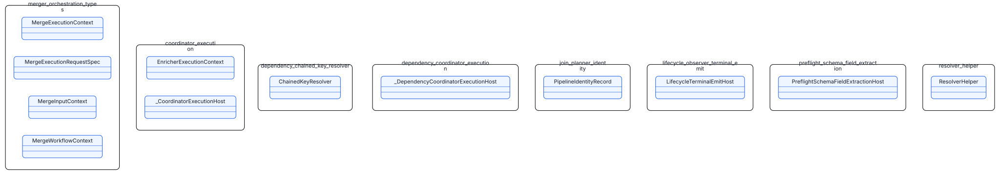

### Описание
Диаграмма «Package Family: application/composite/helpers» показывает архитектурную модель модуля и фиксирует контракты, роли и отношения между сущностями слоя. Она представлена в формате диаграмма классов (class diagram) и служит ориентиром на уровне детализации «Package Family / Inventory Slice». В комментариях исходника зафиксирован фокус диаграммы: AST-derived supplemental package-family inventory for src/bioetl/application/composite/helpers; modules: merger_orchestration_types, coordinator_execution, dependency_chained_key_resolver, dependency_coordinator_execution, join_planner_identity, lifecycle_observer_terminal_emit.. Схема имеет плотность порядка 12 узлов; её удобно использовать как обзорный архитектурный срез для проверки влияния изменений, согласования интерфейсов и подготовки рефакторинга, но не как исчерпывающий каталог текущей кодовой поверхности. Ключевые блоки/подграфы: merger orchestration types, coordinator execution, dependency chained key resolver, dependency coordinator execution, join planner identity, lifecycle observer terminal emit. Показательные узлы для быстрого чтения: MergeExecutionContext, MergeExecutionRequestSpec, MergeInputContext, MergeWorkflowContext, EnricherExecutionContext, _CoordinatorExecutionHost. Примечание: Generated supplemental package-family diagram. Curated class-summary remains narrative-only..

### Метаданные
- Тип: `classDiagram`
- Уровень: `Package Family / Inventory Slice`
- Дата: `2026-08-26`
- Узлы (metadata): `12`

\newpage

## 90-pkg-application-composite-runner-pkg-part1

**Package Family: application/composite/runner_pkg (Part 1/2)**

### Описание
Диаграмма «Package Family: application/composite/runner_pkg (Part 1/2)» показывает архитектурную модель модуля и фиксирует контракты, роли и отношения между сущностями слоя. Она представлена в формате диаграмма классов (class diagram) и служит ориентиром на уровне детализации «Package Family / Inventory Slice». В комментариях исходника зафиксирован фокус диаграммы: AST-derived supplemental package-family inventory slice for src/bioetl/application/composite/runner_pkg; part 1/2; modules: runner_execution_orchestrator, runner_runtime_helpers, runner_completion_helpers, runner_control_plane_mixin, runner_stage_types, runner_key_flow.. Схема имеет плотность порядка 30 узлов и 3 связей; её удобно использовать как обзорный архитектурный срез для проверки влияния изменений, согласования интерфейсов и подготовки рефакторинга, но не как исчерпывающий каталог текущей кодовой поверхности. Ключевые блоки/подграфы: runner execution orchestrator, runner runtime helpers, runner completion helpers, runner control plane mixin, runner stage types, runner key flow. Показательные узлы для быстрого чтения: CompositeLockedExecutionContext, CompositeLockedExecutionResult, CompositeRunPhaseService, _CompositeLockedExecutionHostProtocol, _CompositePreMergeExecutionResult, ManagedCompositeLockContext. Примечание: Generated supplemental package-family slice used to keep node density within the class-diagram readability budget (<= 30)..

### Метаданные
- Тип: `classDiagram`
- Уровень: `Package Family / Inventory Slice`
- Дата: `2026-08-26`
- Узлы (metadata): `30`

\newpage

## 90-pkg-application-composite-runner-pkg-part2

**Package Family: application/composite/runner_pkg (Part 2/2)**

### Описание
Диаграмма «Package Family: application/composite/runner_pkg (Part 2/2)» показывает архитектурную модель модуля и фиксирует контракты, роли и отношения между сущностями слоя. Она представлена в формате диаграмма классов (class diagram) и служит ориентиром на уровне детализации «Package Family / Inventory Slice». В комментариях исходника зафиксирован фокус диаграммы: AST-derived supplemental package-family inventory slice for src/bioetl/application/composite/runner_pkg; part 2/2; modules: runner_lifecycle_flow, runner_merge_request_flow, runner_merge_stage_mixin, runner_observability_helpers, runner_observability_mixin, runner_stage_enrichment_mixin.. Схема имеет плотность порядка 12 узлов и 4 связей; её удобно использовать как обзорный архитектурный срез для проверки влияния изменений, согласования интерфейсов и подготовки рефакторинга, но не как исчерпывающий каталог текущей кодовой поверхности. Ключевые блоки/подграфы: runner lifecycle flow, runner merge request flow, runner merge stage mixin, runner observability helpers, runner observability mixin, runner stage enrichment mixin. Показательные узлы для быстрого чтения: _RunnerLifecycleHost, _MergerProtocol, CompositeRunnerMergeStageMixin, CompositeRunnerObservabilityHostProtocol, CompositeRunnerObservabilityMixin, _CompositeRunnerStageEnrichmentMixin. Примечание: Generated supplemental package-family slice used to keep node density within the class-diagram readability budget (<= 30)..

### Метаданные
- Тип: `classDiagram`
- Уровень: `Package Family / Inventory Slice`
- Дата: `2026-08-26`
- Узлы (metadata): `12`

\newpage

## 90-pkg-application-core-base-transformer

**Package Family: application/core/base_transformer**

### Описание
Диаграмма «Package Family: application/core/base_transformer» показывает архитектурную модель модуля и фиксирует контракты, роли и отношения между сущностями слоя. Она представлена в формате диаграмма классов (class diagram) и служит ориентиром на уровне детализации «Package Family / Inventory Slice». В комментариях исходника зафиксирован фокус диаграммы: AST-derived supplemental package-family inventory for src/bioetl/application/core/base_transformer; modules: _structural_policy_types, field_policy, _structural_policy_support, errors, optionality, types.. Схема имеет плотность порядка 17 узлов и 2 связей; её удобно использовать как обзорный архитектурный срез для проверки влияния изменений, согласования интерфейсов и подготовки рефакторинга, но не как исчерпывающий каталог текущей кодовой поверхности. Ключевые блоки/подграфы: structural policy types, field policy, structural policy support, errors, optionality, types. Показательные узлы для быстрого чтения: StructuralFieldSpec, StructuralPolicyOutcome, StructuralPolicyProtocol, StructuralPolicySignal, FieldPolicyResolver, FieldPolicySpec. Примечание: Generated supplemental package-family diagram. Curated class-summary remains narrative-only..

### Метаданные
- Тип: `classDiagram`
- Уровень: `Package Family / Inventory Slice`
- Дата: `2026-08-26`
- Узлы (metadata): `17`

\newpage

## 90-pkg-application-core-batch-execution

**Package Family: application/core/batch_execution**

### Описание
Диаграмма «Package Family: application/core/batch_execution» показывает архитектурную модель модуля и фиксирует контракты, роли и отношения между сущностями слоя. Она представлена в формате диаграмма классов (class diagram) и служит ориентиром на уровне детализации «Package Family / Inventory Slice». В комментариях исходника зафиксирован фокус диаграммы: AST-derived supplemental package-family inventory for src/bioetl/application/core/batch_execution; modules: lifecycle, contracts, run_service, state_service.. Схема имеет плотность порядка 15 узлов и 2 связей; её удобно использовать как обзорный архитектурный срез для проверки влияния изменений, согласования интерфейсов и подготовки рефакторинга, но не как исчерпывающий каталог текущей кодовой поверхности. Ключевые блоки/подграфы: lifecycle, contracts, run service, state service. Показательные узлы для быстрого чтения: BatchExecutionContext, BatchExecutionFinalizationContext, BatchExecutionLifecycleContext, BatchExecutionLifecycleService, _BatchCheckpointRecoveryLifecycleProtocol, _BatchProgressInitializerProtocol. Примечание: Generated supplemental package-family diagram. Curated class-summary remains narrative-only..

### Метаданные
- Тип: `classDiagram`
- Уровень: `Package Family / Inventory Slice`
- Дата: `2026-08-26`
- Узлы (metadata): `15`

\newpage

## 90-pkg-application-core-data-sources

**Package Family: application/core/data_sources**

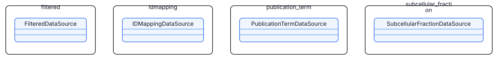

### Описание
Диаграмма «Package Family: application/core/data_sources» показывает архитектурную модель модуля и фиксирует контракты, роли и отношения между сущностями слоя. Она представлена в формате диаграмма классов (class diagram) и служит ориентиром на уровне детализации «Package Family / Inventory Slice». В комментариях исходника зафиксирован фокус диаграммы: AST-derived supplemental package-family inventory for src/bioetl/application/core/data_sources; modules: filtered, idmapping, publication_term, subcellular_fraction.. Схема имеет плотность порядка 4 узлов; её удобно использовать как обзорный архитектурный срез для проверки влияния изменений, согласования интерфейсов и подготовки рефакторинга, но не как исчерпывающий каталог текущей кодовой поверхности. Ключевые блоки/подграфы: filtered, idmapping, publication term, subcellular fraction. Показательные узлы для быстрого чтения: FilteredDataSource, IDMappingDataSource, PublicationTermDataSource, SubcellularFractionDataSource. Примечание: Generated supplemental package-family diagram. Curated class-summary remains narrative-only..

### Метаданные
- Тип: `classDiagram`
- Уровень: `Package Family / Inventory Slice`
- Дата: `2026-08-26`
- Узлы (metadata): `4`

\newpage

## 90-pkg-application-core-lifecycle

**Package Family: application/core/lifecycle**

### Описание
Диаграмма «Package Family: application/core/lifecycle» показывает архитектурную модель модуля и фиксирует контракты, роли и отношения между сущностями слоя. Она представлена в формате диаграмма классов (class diagram) и служит ориентиром на уровне детализации «Package Family / Inventory Slice». В комментариях исходника зафиксирован фокус диаграммы: AST-derived supplemental package-family inventory for src/bioetl/application/core/lifecycle; modules: batch_fsm, cleanup_service, checkpoint_identity_overrides, checkpoint_manager, lock_runtime_service, _checkpoint_types.. Схема имеет плотность порядка 22 узлов; её удобно использовать как обзорный архитектурный срез для проверки влияния изменений, согласования интерфейсов и подготовки рефакторинга, но не как исчерпывающий каталог текущей кодовой поверхности. Ключевые блоки/подграфы: batch fsm, cleanup service, checkpoint identity overrides, checkpoint manager, lock runtime service, checkpoint types. Показательные узлы для быстрого чтения: BatchExecutionCommandTask, BatchExecutionCoordinator, BatchExecutionEventSignal, BatchExecutionState, BatchExecutionTransitionResult, IllegalStateTransitionError. Примечание: Generated supplemental package-family diagram. Curated class-summary remains narrative-only..

### Метаданные
- Тип: `classDiagram`
- Уровень: `Package Family / Inventory Slice`
- Дата: `2026-08-26`
- Узлы (metadata): `22`

\newpage

## 90-pkg-application-core-postrun

**Package Family: application/core/postrun**

### Описание
Диаграмма «Package Family: application/core/postrun» показывает архитектурную модель модуля и фиксирует контракты, роли и отношения между сущностями слоя. Она представлена в формате диаграмма классов (class diagram) и служит ориентиром на уровне детализации «Package Family / Inventory Slice». В комментариях исходника зафиксирован фокус диаграммы: AST-derived supplemental package-family inventory for src/bioetl/application/core/postrun; modules: _failure_policy, _service_support, service, _phase_descriptions, compact_orchestrator, _service_collaborators.. Схема имеет плотность порядка 18 узлов и 5 связей; её удобно использовать как обзорный архитектурный срез для проверки влияния изменений, согласования интерфейсов и подготовки рефакторинга, но не как исчерпывающий каталог текущей кодовой поверхности. Ключевые блоки/подграфы: failure policy, service support, service, phase descriptions, compact orchestrator, service collaborators. Показательные узлы для быстрого чтения: PostrunFailureHandlingMixin, PostrunFailurePolicySpec, PostrunStrictValidationMixin, PostrunServiceSupportMixin, _PostrunHostAttrSurface, _PostrunSupportHost. Примечание: Generated supplemental package-family diagram. Curated class-summary remains narrative-only..

### Метаданные
- Тип: `classDiagram`
- Уровень: `Package Family / Inventory Slice`
- Дата: `2026-08-26`
- Узлы (metadata): `18`

\newpage

## 90-pkg-application-core-preflight

**Package Family: application/core/preflight**

### Описание
Диаграмма «Package Family: application/core/preflight» показывает архитектурную модель модуля и фиксирует контракты, роли и отношения между сущностями слоя. Она представлена в формате диаграмма классов (class diagram) и служит ориентиром на уровне детализации «Package Family / Inventory Slice». В комментариях исходника зафиксирован фокус диаграммы: AST-derived supplemental package-family inventory for src/bioetl/application/core/preflight; modules: service, _observability, health_aggregator, medallion_validator.. Схема имеет плотность порядка 5 узлов; её удобно использовать как обзорный архитектурный срез для проверки влияния изменений, согласования интерфейсов и подготовки рефакторинга, но не как исчерпывающий каталог текущей кодовой поверхности. Ключевые блоки/подграфы: service, observability, health aggregator, medallion validator. Показательные узлы для быстрого чтения: PreflightService, _PreflightExecutionHostProtocol, _PreflightObservabilityHostProtocol, HealthAggregator, MedallionConfigValidator. Примечание: Generated supplemental package-family diagram. Curated class-summary remains narrative-only..

### Метаданные
- Тип: `classDiagram`
- Уровень: `Package Family / Inventory Slice`
- Дата: `2026-08-26`
- Узлы (metadata): `5`

\newpage

## 90-pkg-application-observability-control-plane-evidence

**Package Family: application/observability/control_plane_evidence**

### Описание
Диаграмма «Package Family: application/observability/control_plane_evidence» показывает архитектурную модель модуля и фиксирует контракты, роли и отношения между сущностями слоя. Она представлена в формате диаграмма классов (class diagram) и служит ориентиром на уровне детализации «Package Family / Inventory Slice». В комментариях исходника зафиксирован фокус диаграммы: AST-derived supplemental package-family inventory for src/bioetl/application/observability/control_plane_evidence; modules: checks, retention, service, service_support.. Схема имеет плотность порядка 4 узлов; её удобно использовать как обзорный архитектурный срез для проверки влияния изменений, согласования интерфейсов и подготовки рефакторинга, но не как исчерпывающий каталог текущей кодовой поверхности. Ключевые блоки/подграфы: checks, retention, service, service support. Показательные узлы для быстрого чтения: EvidenceCheckResult, ControlPlaneLifecyclePlanner, ControlPlaneEvidenceService, EvidenceScopeContext. Примечание: Generated supplemental package-family diagram. Curated class-summary remains narrative-only..

### Метаданные
- Тип: `classDiagram`
- Уровень: `Package Family / Inventory Slice`
- Дата: `2026-08-26`
- Узлы (metadata): `4`

\newpage

## 90-pkg-application-observability

**Package Family: application/observability**

### Описание
Диаграмма «Package Family: application/observability» показывает архитектурную модель модуля и фиксирует контракты, роли и отношения между сущностями слоя. Она представлена в формате диаграмма классов (class diagram) и служит ориентиром на уровне детализации «Package Family / Inventory Slice». В комментариях исходника зафиксирован фокус диаграммы: AST-derived supplemental package-family inventory for src/bioetl/application/observability; modules: observer, pipeline_metrics, control_plane_integrity_metrics, current_metrics_rehydrate, current_metrics_reconciliation, domain_event_emitter.. Схема имеет плотность порядка 18 узлов и 6 связей; её удобно использовать как обзорный архитектурный срез для проверки влияния изменений, согласования интерфейсов и подготовки рефакторинга, но не как исчерпывающий каталог текущей кодовой поверхности. Ключевые блоки/подграфы: observer, pipeline metrics, control plane integrity metrics, current metrics rehydrate, current metrics reconciliation, domain event emitter. Показательные узлы для быстрого чтения: PipelineObserver, PipelineObserverParams, _ObserverLifecycleEmissionMixin, PipelineMetricsRecorder, _CompositePhaseMetricsRecorderMixin, _PipelineMetricsRecorderCore. Примечание: Generated supplemental package-family diagram. Curated class-summary remains narrative-only..

### Метаданные
- Тип: `classDiagram`
- Уровень: `Package Family / Inventory Slice`
- Дата: `2026-08-26`
- Узлы (metadata): `18`

\newpage

## 90-pkg-application-pipelines-chembl-part1

**Package Family: application/pipelines/chembl (Part 1/2)**

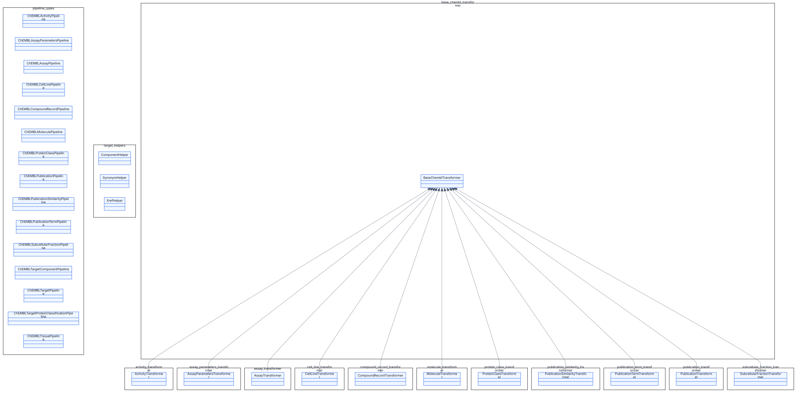

### Описание
Диаграмма «Package Family: application/pipelines/chembl (Part 1/2)» показывает архитектурную модель модуля и фиксирует контракты, роли и отношения между сущностями слоя. Она представлена в формате диаграмма классов (class diagram) и служит ориентиром на уровне детализации «Package Family / Inventory Slice». В комментариях исходника зафиксирован фокус диаграммы: AST-derived supplemental package-family inventory slice for src/bioetl/application/pipelines/chembl; part 1/2; modules: pipeline_types, target_helpers, activity_transformer, assay_parameters_transformer, assay_transformer, base_chembl_transformer.. Схема имеет плотность порядка 30 узлов и 11 связей; её удобно использовать как обзорный архитектурный срез для проверки влияния изменений, согласования интерфейсов и подготовки рефакторинга, но не как исчерпывающий каталог текущей кодовой поверхности. Ключевые блоки/подграфы: pipeline types, target helpers, activity transformer, assay parameters transformer, assay transformer, base chembl transformer. Показательные узлы для быстрого чтения: ChEMBLActivityPipeline, ChEMBLAssayParametersPipeline, ChEMBLAssayPipeline, ChEMBLCellLinePipeline, ChEMBLCompoundRecordPipeline, ChEMBLMoleculePipeline. Примечание: Generated supplemental package-family slice used to keep node density within the class-diagram readability budget (<= 30)..

### Метаданные
- Тип: `classDiagram`
- Уровень: `Package Family / Inventory Slice`
- Дата: `2026-08-26`
- Узлы (metadata): `30`

\newpage

## 90-pkg-application-pipelines-chembl-part2

**Package Family: application/pipelines/chembl (Part 2/2)**

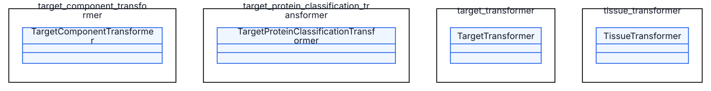

### Описание
Диаграмма «Package Family: application/pipelines/chembl (Part 2/2)» показывает архитектурную модель модуля и фиксирует контракты, роли и отношения между сущностями слоя. Она представлена в формате диаграмма классов (class diagram) и служит ориентиром на уровне детализации «Package Family / Inventory Slice». В комментариях исходника зафиксирован фокус диаграммы: AST-derived supplemental package-family inventory slice for src/bioetl/application/pipelines/chembl; part 2/2; modules: target_component_transformer, target_protein_classification_transformer, target_transformer, tissue_transformer.. Схема имеет плотность порядка 4 узлов; её удобно использовать как обзорный архитектурный срез для проверки влияния изменений, согласования интерфейсов и подготовки рефакторинга, но не как исчерпывающий каталог текущей кодовой поверхности. Ключевые блоки/подграфы: target component transformer, target protein classification transformer, target transformer, tissue transformer. Показательные узлы для быстрого чтения: TargetComponentTransformer, TargetProteinClassificationTransformer, TargetTransformer, TissueTransformer. Примечание: Generated supplemental package-family slice used to keep node density within the class-diagram readability budget (<= 30)..

### Метаданные
- Тип: `classDiagram`
- Уровень: `Package Family / Inventory Slice`
- Дата: `2026-08-26`
- Узлы (metadata): `4`

\newpage

## 90-pkg-application-pipelines-common

**Package Family: application/pipelines/common**

### Описание
Диаграмма «Package Family: application/pipelines/common» показывает архитектурную модель модуля и фиксирует контракты, роли и отношения между сущностями слоя. Она представлена в формате диаграмма классов (class diagram) и служит ориентиром на уровне детализации «Package Family / Inventory Slice». В комментариях исходника зафиксирован фокус диаграммы: AST-derived supplemental package-family inventory for src/bioetl/application/pipelines/common; modules: publication_assembly, base_publication_transformer, publication_blocks, publication_transformer_context, publication_transformer_hooks_mixin.. Схема имеет плотность порядка 11 узлов и 1 связей; её удобно использовать как обзорный архитектурный срез для проверки влияния изменений, согласования интерфейсов и подготовки рефакторинга, но не как исчерпывающий каталог текущей кодовой поверхности. Ключевые блоки/подграфы: publication assembly, base publication transformer, publication blocks, publication transformer context, publication transformer hooks mixin. Показательные узлы для быстрого чтения: PreparedPublicationOutcome, PublicationAssemblyTransformer, _PublicationDataExtractor, _PublicationIdentifierResolver, _PublicationMetadataStrategy, _PublicationRecordNormalizer. Примечание: Generated supplemental package-family diagram. Curated class-summary remains narrative-only..

### Метаданные
- Тип: `classDiagram`
- Уровень: `Package Family / Inventory Slice`
- Дата: `2026-08-26`
- Узлы (metadata): `11`

\newpage

## 90-pkg-application-pipelines-crossref

**Package Family: application/pipelines/crossref**

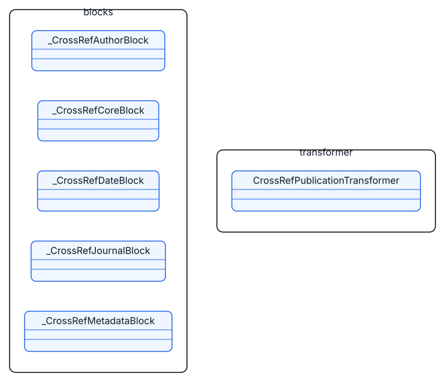

### Описание
Диаграмма «Package Family: application/pipelines/crossref» показывает архитектурную модель модуля и фиксирует контракты, роли и отношения между сущностями слоя. Она представлена в формате диаграмма классов (class diagram) и служит ориентиром на уровне детализации «Package Family / Inventory Slice». В комментариях исходника зафиксирован фокус диаграммы: AST-derived supplemental package-family inventory for src/bioetl/application/pipelines/crossref; modules: blocks, transformer.. Схема имеет плотность порядка 6 узлов; её удобно использовать как обзорный архитектурный срез для проверки влияния изменений, согласования интерфейсов и подготовки рефакторинга, но не как исчерпывающий каталог текущей кодовой поверхности. Ключевые блоки/подграфы: blocks, transformer. Показательные узлы для быстрого чтения: _CrossRefAuthorBlock, _CrossRefCoreBlock, _CrossRefDateBlock, _CrossRefJournalBlock, _CrossRefMetadataBlock, CrossRefPublicationTransformer. Примечание: Generated supplemental package-family diagram. Curated class-summary remains narrative-only..

### Метаданные
- Тип: `classDiagram`
- Уровень: `Package Family / Inventory Slice`
- Дата: `2026-08-26`
- Узлы (metadata): `6`

\newpage

## 90-pkg-application-pipelines-pubmed

**Package Family: application/pipelines/pubmed**

### Описание
Диаграмма «Package Family: application/pipelines/pubmed» показывает архитектурную модель модуля и фиксирует контракты, роли и отношения между сущностями слоя. Она представлена в формате диаграмма классов (class diagram) и служит ориентиром на уровне детализации «Package Family / Inventory Slice». В комментариях исходника зафиксирован фокус диаграммы: AST-derived supplemental package-family inventory for src/bioetl/application/pipelines/pubmed; modules: _block_definitions_analytics, _block_definitions_edition, _block_definitions_identifiers, __init__, _block_definitions_base, transformer.. Схема имеет плотность порядка 10 узлов и 7 связей; её удобно использовать как обзорный архитектурный срез для проверки влияния изменений, согласования интерфейсов и подготовки рефакторинга, но не как исчерпывающий каталог текущей кодовой поверхности. Ключевые блоки/подграфы: block definitions analytics, block definitions edition, block definitions identifiers, init, block definitions base, transformer. Показательные узлы для быстрого чтения: _PubMedClassificationBlock, _PubMedDateBlock, _PubMedMetricsBlock, _PubMedAuthorBlock, _PubMedJournalBlock, _PubMedCoreBlock. Примечание: Generated supplemental package-family diagram. Curated class-summary remains narrative-only..

### Метаданные
- Тип: `classDiagram`
- Уровень: `Package Family / Inventory Slice`
- Дата: `2026-08-26`
- Узлы (metadata): `10`

\newpage

## 90-pkg-application-pipelines-uniprot-extractors

**Package Family: application/pipelines/uniprot/extractors**

### Описание
Диаграмма «Package Family: application/pipelines/uniprot/extractors» показывает архитектурную модель модуля и фиксирует контракты, роли и отношения между сущностями слоя. Она представлена в формате диаграмма классов (class diagram) и служит ориентиром на уровне детализации «Package Family / Inventory Slice». В комментариях исходника зафиксирован фокус диаграммы: AST-derived supplemental package-family inventory for src/bioetl/application/pipelines/uniprot/extractors; modules: _feature_wrappers_mixin, comments, crossrefs, extractor_helpers, features, genes.. Схема имеет плотность порядка 8 узлов и 1 связей; её удобно использовать как обзорный архитектурный срез для проверки влияния изменений, согласования интерфейсов и подготовки рефакторинга, но не как исчерпывающий каталог текущей кодовой поверхности. Ключевые блоки/подграфы: feature wrappers mixin, comments, crossrefs, extractor helpers, features, genes. Показательные узлы для быстрого чтения: FeatureExtractionWrappersMixin, _FeatureExtractorProtocol, CommentExtractor, CrossRefExtractor, ExtractorHelper, FeatureExtractor. Примечание: Generated supplemental package-family diagram. Curated class-summary remains narrative-only..

### Метаданные
- Тип: `classDiagram`
- Уровень: `Package Family / Inventory Slice`
- Дата: `2026-08-26`
- Узлы (metadata): `8`

\newpage

## 90-pkg-application-pipelines-uniprot

**Package Family: application/pipelines/uniprot**

### Описание
Диаграмма «Package Family: application/pipelines/uniprot» показывает архитектурную модель модуля и фиксирует контракты, роли и отношения между сущностями слоя. Она представлена в формате диаграмма классов (class diagram) и служит ориентиром на уровне детализации «Package Family / Inventory Slice». В комментариях исходника зафиксирован фокус диаграммы: AST-derived supplemental package-family inventory for src/bioetl/application/pipelines/uniprot; modules: __init__, idmapping_transformer, transformer, transformer_business_data_mixin.. Схема имеет плотность порядка 4 узлов и 1 связей; её удобно использовать как обзорный архитектурный срез для проверки влияния изменений, согласования интерфейсов и подготовки рефакторинга, но не как исчерпывающий каталог текущей кодовой поверхности. Ключевые блоки/подграфы: init, idmapping transformer, transformer, transformer business data mixin. Показательные узлы для быстрого чтения: UniProtProteinPipeline, IDMappingTransformer, UniProtProteinTransformer, UniProtBusinessDataMixin. Примечание: Generated supplemental package-family diagram. Curated class-summary remains narrative-only..

### Метаданные
- Тип: `classDiagram`
- Уровень: `Package Family / Inventory Slice`
- Дата: `2026-08-26`
- Узлы (metadata): `4`

\newpage

## 90-pkg-application-ports-part1

**Package Family: application/ports (Part 1/2)**

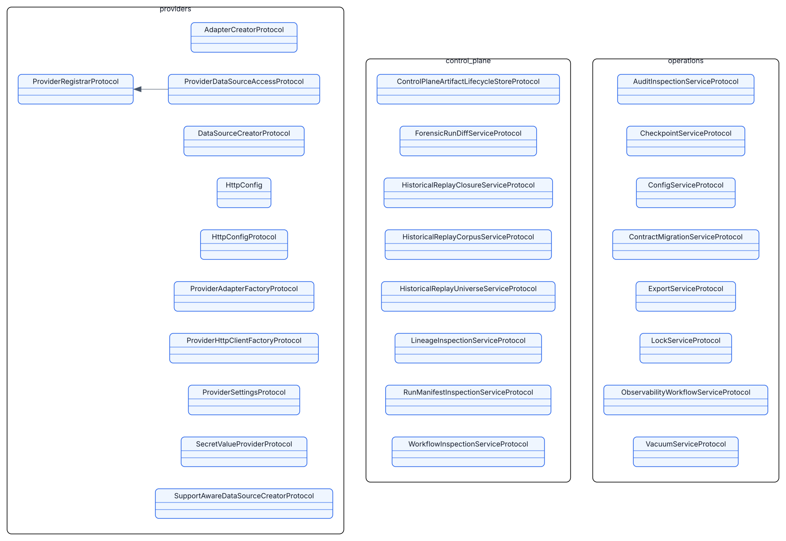

### Описание
Диаграмма «Package Family: application/ports (Part 1/2)» показывает архитектурную модель модуля и фиксирует контракты, роли и отношения между сущностями слоя. Она представлена в формате диаграмма классов (class diagram) и служит ориентиром на уровне детализации «Package Family / Inventory Slice». В комментариях исходника зафиксирован фокус диаграммы: AST-derived supplemental package-family inventory slice for src/bioetl/application/ports; part 1/2; modules: providers, control_plane, operations.. Схема имеет плотность порядка 27 узлов и 1 связей; её удобно использовать как обзорный архитектурный срез для проверки влияния изменений, согласования интерфейсов и подготовки рефакторинга, но не как исчерпывающий каталог текущей кодовой поверхности. Ключевые блоки/подграфы: providers, control plane, operations. Показательные узлы для быстрого чтения: AdapterCreatorProtocol, DataSourceCreatorProtocol, HttpConfig, HttpConfigProtocol, ProviderAdapterFactoryProtocol, ProviderDataSourceAccessProtocol. Примечание: Generated supplemental package-family slice used to keep node density within the class-diagram readability budget (<= 30)..

### Метаданные
- Тип: `classDiagram`
- Уровень: `Package Family / Inventory Slice`
- Дата: `2026-08-26`
- Узлы (metadata): `27`

\newpage

## 90-pkg-application-ports-part2

**Package Family: application/ports (Part 2/2)**

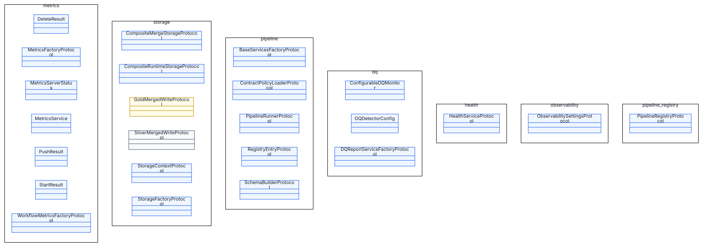

### Описание
Диаграмма «Package Family: application/ports (Part 2/2)» показывает архитектурную модель модуля и фиксирует контракты, роли и отношения между сущностями слоя. Она представлена в формате диаграмма классов (class diagram) и служит ориентиром на уровне детализации «Package Family / Inventory Slice». В комментариях исходника зафиксирован фокус диаграммы: AST-derived supplemental package-family inventory slice for src/bioetl/application/ports; part 2/2; modules: metrics, storage, pipeline, dq, health, observability.. Схема имеет плотность порядка 24 узлов; её удобно использовать как обзорный архитектурный срез для проверки влияния изменений, согласования интерфейсов и подготовки рефакторинга, но не как исчерпывающий каталог текущей кодовой поверхности. Ключевые блоки/подграфы: metrics, storage, pipeline, dq, health, observability. Показательные узлы для быстрого чтения: DeleteResult, MetricsFactoryProtocol, MetricsServerStatus, MetricsService, PushResult, StartResult. Примечание: Generated supplemental package-family slice used to keep node density within the class-diagram readability budget (<= 30)..

### Метаданные
- Тип: `classDiagram`
- Уровень: `Package Family / Inventory Slice`
- Дата: `2026-08-26`
- Узлы (metadata): `24`

\newpage

## 90-pkg-application-services-checkpoint

**Package Family: application/services/checkpoint**

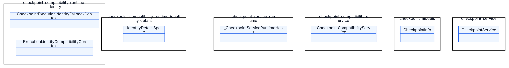

### Описание
Диаграмма «Package Family: application/services/checkpoint» показывает архитектурную модель модуля и фиксирует контракты, роли и отношения между сущностями слоя. Она представлена в формате диаграмма классов (class diagram) и служит ориентиром на уровне детализации «Package Family / Inventory Slice». В комментариях исходника зафиксирован фокус диаграммы: AST-derived supplemental package-family inventory for src/bioetl/application/services/checkpoint; modules: _checkpoint_compatibility_runtime_identity, _checkpoint_compatibility_runtime_identity_details, _checkpoint_service_runtime, checkpoint_compatibility_service, checkpoint_models, checkpoint_service.. Схема имеет плотность порядка 7 узлов; её удобно использовать как обзорный архитектурный срез для проверки влияния изменений, согласования интерфейсов и подготовки рефакторинга, но не как исчерпывающий каталог текущей кодовой поверхности. Ключевые блоки/подграфы: checkpoint compatibility runtime identity, checkpoint compatibility runtime identity details, checkpoint service runtime, checkpoint compatibility service, checkpoint models, checkpoint service. Показательные узлы для быстрого чтения: CheckpointExecutionIdentityFallbackContext, ExecutionIdentityCompatibilityContext, IdentityDetailsSpec, _CheckpointServiceRuntimeHost, CheckpointCompatibilityService, CheckpointInfo. Примечание: Generated supplemental package-family diagram. Curated class-summary remains narrative-only..

### Метаданные
- Тип: `classDiagram`
- Уровень: `Package Family / Inventory Slice`
- Дата: `2026-08-26`
- Узлы (metadata): `7`

\newpage

## 90-pkg-application-services-contracts

**Package Family: application/services/contracts**

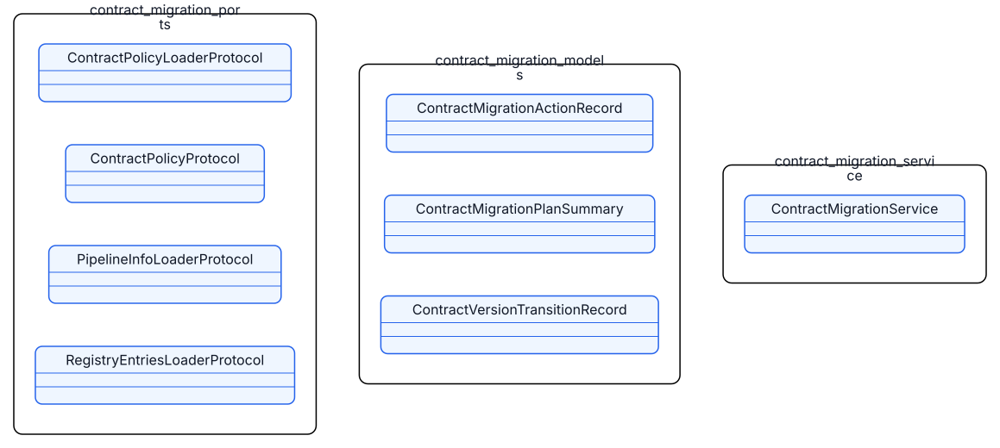

### Описание
Диаграмма «Package Family: application/services/contracts» показывает архитектурную модель модуля и фиксирует контракты, роли и отношения между сущностями слоя. Она представлена в формате диаграмма классов (class diagram) и служит ориентиром на уровне детализации «Package Family / Inventory Slice». В комментариях исходника зафиксирован фокус диаграммы: AST-derived supplemental package-family inventory for src/bioetl/application/services/contracts; modules: contract_migration_ports, contract_migration_models, contract_migration_service.. Схема имеет плотность порядка 8 узлов; её удобно использовать как обзорный архитектурный срез для проверки влияния изменений, согласования интерфейсов и подготовки рефакторинга, но не как исчерпывающий каталог текущей кодовой поверхности. Ключевые блоки/подграфы: contract migration ports, contract migration models, contract migration service. Показательные узлы для быстрого чтения: ContractPolicyLoaderProtocol, ContractPolicyProtocol, PipelineInfoLoaderProtocol, RegistryEntriesLoaderProtocol, ContractMigrationActionRecord, ContractMigrationPlanSummary. Примечание: Generated supplemental package-family diagram. Curated class-summary remains narrative-only..

### Метаданные
- Тип: `classDiagram`
- Уровень: `Package Family / Inventory Slice`
- Дата: `2026-08-26`
- Узлы (metadata): `8`

\newpage

## 90-pkg-application-services-control-plane-ledger

**Package Family: application/services/control_plane/ledger**

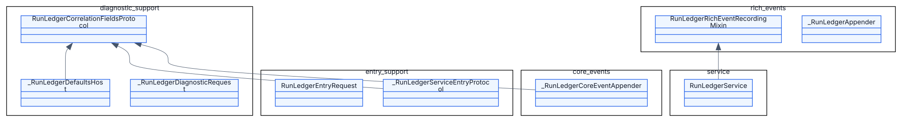

### Описание
Диаграмма «Package Family: application/services/control_plane/ledger» показывает архитектурную модель модуля и фиксирует контракты, роли и отношения между сущностями слоя. Она представлена в формате диаграмма классов (class diagram) и служит ориентиром на уровне детализации «Package Family / Inventory Slice». В комментариях исходника зафиксирован фокус диаграммы: AST-derived supplemental package-family inventory for src/bioetl/application/services/control_plane/ledger; modules: diagnostic_support, entry_support, rich_events, core_events, service.. Схема имеет плотность порядка 9 узлов и 4 связей; её удобно использовать как обзорный архитектурный срез для проверки влияния изменений, согласования интерфейсов и подготовки рефакторинга, но не как исчерпывающий каталог текущей кодовой поверхности. Ключевые блоки/подграфы: diagnostic support, entry support, rich events, core events, service. Показательные узлы для быстрого чтения: RunLedgerCorrelationFieldsProtocol, _RunLedgerDefaultsHost, _RunLedgerDiagnosticRequest, RunLedgerEntryRequest, _RunLedgerServiceEntryProtocol, RunLedgerRichEventRecordingMixin. Примечание: Generated supplemental package-family diagram. Curated class-summary remains narrative-only..

### Метаданные
- Тип: `classDiagram`
- Уровень: `Package Family / Inventory Slice`
- Дата: `2026-08-26`
- Узлы (metadata): `9`

\newpage

## 90-pkg-application-services-control-plane-manifest-diagnostics

**Package Family: application/services/control_plane/manifest/diagnostics**

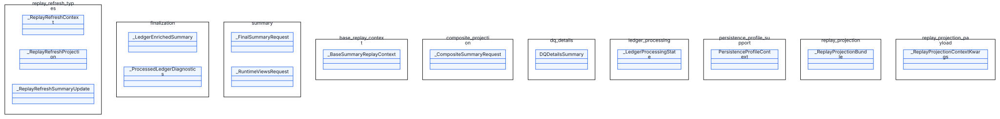

### Описание
Диаграмма «Package Family: application/services/control_plane/manifest/diagnostics» показывает архитектурную модель модуля и фиксирует контракты, роли и отношения между сущностями слоя. Она представлена в формате диаграмма классов (class diagram) и служит ориентиром на уровне детализации «Package Family / Inventory Slice». В комментариях исходника зафиксирован фокус диаграммы: AST-derived supplemental package-family inventory for src/bioetl/application/services/control_plane/manifest/diagnostics; modules: replay_refresh_types, finalization, summary, base_replay_context, composite_projection, dq_details.. Схема имеет плотность порядка 14 узлов; её удобно использовать как обзорный архитектурный срез для проверки влияния изменений, согласования интерфейсов и подготовки рефакторинга, но не как исчерпывающий каталог текущей кодовой поверхности. Ключевые блоки/подграфы: replay refresh types, finalization, summary, base replay context, composite projection, dq details. Показательные узлы для быстрого чтения: _ReplayRefreshContext, _ReplayRefreshProjection, _ReplayRefreshSummaryUpdate, _LedgerEnrichedSummary, _ProcessedLedgerDiagnostics, _FinalSummaryRequest. Примечание: Generated supplemental package-family diagram. Curated class-summary remains narrative-only..

### Метаданные
- Тип: `classDiagram`
- Уровень: `Package Family / Inventory Slice`
- Дата: `2026-08-26`
- Узлы (metadata): `14`

\newpage

## 90-pkg-application-services-control-plane-manifest

**Package Family: application/services/control_plane/manifest**

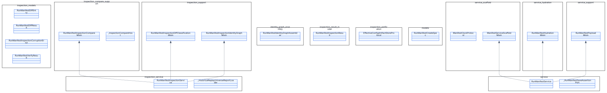

### Описание
Диаграмма «Package Family: application/services/control_plane/manifest» показывает архитектурную модель модуля и фиксирует контракты, роли и отношения между сущностями слоя. Она представлена в формате диаграмма классов (class diagram) и служит ориентиром на уровне детализации «Package Family / Inventory Slice». В комментариях исходника зафиксирован фокус диаграммы: AST-derived supplemental package-family inventory for src/bioetl/application/services/control_plane/manifest; modules: inspection_models, _inspection_compare_support, _inspection_support, inspection_service, service, service_scaffold.. Схема имеет плотность порядка 20 узлов и 6 связей; её удобно использовать как обзорный архитектурный срез для проверки влияния изменений, согласования интерфейсов и подготовки рефакторинга, но не как исчерпывающий каталог текущей кодовой поверхности. Ключевые блоки/подграфы: inspection models, inspection compare support, inspection support, inspection service, service, service scaffold. Показательные узлы для быстрого чтения: RunManifestDiffEntry, RunManifestDiffResult, RunManifestInspectionCorruptionError, RunManifestVerifyResult, RunManifestInspectionCompareMixin, _InspectionCompareHost. Примечание: Generated supplemental package-family diagram. Curated class-summary remains narrative-only..

### Метаданные
- Тип: `classDiagram`
- Уровень: `Package Family / Inventory Slice`
- Дата: `2026-08-26`
- Узлы (metadata): `20`

\newpage

## 90-pkg-application-services-control-plane-replay

**Package Family: application/services/control_plane/replay**

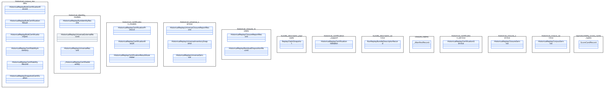

### Описание
Диаграмма «Package Family: application/services/control_plane/replay» показывает архитектурную модель модуля и фиксирует контракты, роли и отношения между сущностями слоя. Она представлена в формате диаграмма классов (class diagram) и служит ориентиром на уровне детализации «Package Family / Inventory Slice». В комментариях исходника зафиксирован фокус диаграммы: AST-derived supplemental package-family inventory for src/bioetl/application/services/control_plane/replay; modules: historical_corpus_models, historical_identity_models, _historical_certification_models, historical_universe_service, historical_closure_models, _bundle_descriptor_payloads.. Схема имеет плотность порядка 26 узлов; её удобно использовать как обзорный архитектурный срез для проверки влияния изменений, согласования интерфейсов и подготовки рефакторинга, но не как исчерпывающий каталог текущей кодовой поверхности. Ключевые блоки/подграфы: historical corpus models, historical identity models, historical certification models, historical universe service, historical closure models, bundle descriptor payloads. Показательные узлы для быстрого чтения: HistoricalReplayBulkCertificationRecord, HistoricalReplayBulkCertificationResult, HistoricalReplayBulkCertificationSpec, HistoricalReplayCertifiabilityInventory, HistoricalReplayCertifiabilityRecord, HistoricalReplaySnapshotCertification. Примечание: Generated supplemental package-family diagram. Curated class-summary remains narrative-only..

### Метаданные
- Тип: `classDiagram`
- Уровень: `Package Family / Inventory Slice`
- Дата: `2026-08-26`
- Узлы (metadata): `26`

\newpage

## 90-pkg-application-services-control-plane-workflow

**Package Family: application/services/control_plane/workflow**

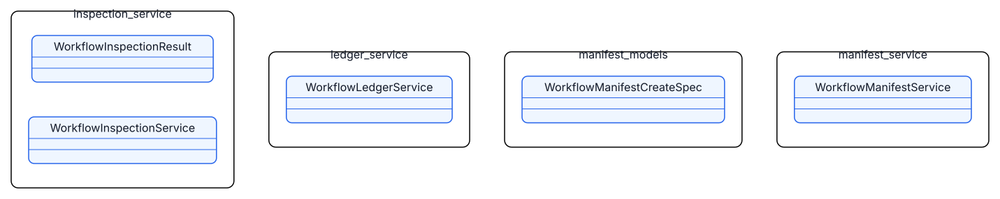

### Описание
Диаграмма «Package Family: application/services/control_plane/workflow» показывает архитектурную модель модуля и фиксирует контракты, роли и отношения между сущностями слоя. Она представлена в формате диаграмма классов (class diagram) и служит ориентиром на уровне детализации «Package Family / Inventory Slice». В комментариях исходника зафиксирован фокус диаграммы: AST-derived supplemental package-family inventory for src/bioetl/application/services/control_plane/workflow; modules: inspection_service, ledger_service, manifest_models, manifest_service.. Схема имеет плотность порядка 5 узлов; её удобно использовать как обзорный архитектурный срез для проверки влияния изменений, согласования интерфейсов и подготовки рефакторинга, но не как исчерпывающий каталог текущей кодовой поверхности. Ключевые блоки/подграфы: inspection service, ledger service, manifest models, manifest service. Показательные узлы для быстрого чтения: WorkflowInspectionResult, WorkflowInspectionService, WorkflowLedgerService, WorkflowManifestCreateSpec, WorkflowManifestService. Примечание: Generated supplemental package-family diagram. Curated class-summary remains narrative-only..

### Метаданные
- Тип: `classDiagram`
- Уровень: `Package Family / Inventory Slice`
- Дата: `2026-08-26`
- Узлы (metadata): `5`

\newpage

## 90-pkg-application-services-dq

**Package Family: application/services/dq**

### Описание
Диаграмма «Package Family: application/services/dq» показывает архитектурную модель модуля и фиксирует контракты, роли и отношения между сущностями слоя. Она представлена в формате диаграмма классов (class diagram) и служит ориентиром на уровне детализации «Package Family / Inventory Slice». В комментариях исходника зафиксирован фокус диаграммы: AST-derived supplemental package-family inventory for src/bioetl/application/services/dq; modules: bronze_analyzer, dq_report_builders, gold_analyzer, silver_analyzer, silver_check_executor, silver_statistics.. Схема имеет плотность порядка 7 узлов; её удобно использовать как обзорный архитектурный срез для проверки влияния изменений, согласования интерфейсов и подготовки рефакторинга, но не как исчерпывающий каталог текущей кодовой поверхности. Ключевые блоки/подграфы: bronze analyzer, dq report builders, gold analyzer, silver analyzer, silver check executor, silver statistics. Показательные узлы для быстрого чтения: BronzeDQAnalyzer, _HasDQStatus, GoldDQAnalyzer, SilverDQAnalyzer, SilverCheckExecutor, SilverStatisticsCalculator. Примечание: Generated supplemental package-family diagram. Curated class-summary remains narrative-only..

### Метаданные
- Тип: `classDiagram`
- Уровень: `Package Family / Inventory Slice`
- Дата: `2026-08-26`
- Узлы (metadata): `7`

\newpage

## 90-pkg-application-services-execution

**Package Family: application/services/execution**

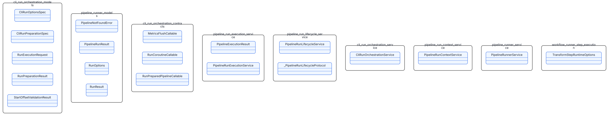

### Описание
Диаграмма «Package Family: application/services/execution» показывает архитектурную модель модуля и фиксирует контракты, роли и отношения между сущностями слоя. Она представлена в формате диаграмма классов (class diagram) и служит ориентиром на уровне детализации «Package Family / Inventory Slice». В комментариях исходника зафиксирован фокус диаграммы: AST-derived supplemental package-family inventory for src/bioetl/application/services/execution; modules: cli_run_orchestration_models, pipeline_runner_models, cli_run_orchestration_contracts, pipeline_run_execution_service, pipeline_run_lifecycle_service, cli_run_orchestration_service.. Схема имеет плотность порядка 20 узлов; её удобно использовать как обзорный архитектурный срез для проверки влияния изменений, согласования интерфейсов и подготовки рефакторинга, но не как исчерпывающий каталог текущей кодовой поверхности. Ключевые блоки/подграфы: cli run orchestration models, pipeline runner models, cli run orchestration contracts, pipeline run execution service, pipeline run lifecycle service, cli run orchestration service. Показательные узлы для быстрого чтения: CliRunOptionsSpec, CliRunPreparationSpec, RunExecutionRequest, RunPreparationResult, StartOffsetValidationResult, PipelineNotFoundError. Примечание: Generated supplemental package-family diagram. Curated class-summary remains narrative-only..

### Метаданные
- Тип: `classDiagram`
- Уровень: `Package Family / Inventory Slice`
- Дата: `2026-08-26`
- Узлы (metadata): `20`

\newpage

## 90-pkg-application-services-export-lineage

**Package Family: application/services/export_lineage**

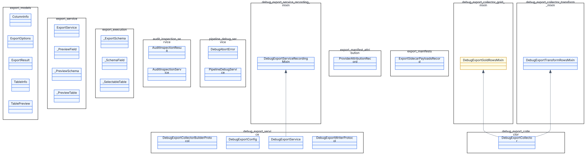

### Описание
Диаграмма «Package Family: application/services/export_lineage» показывает архитектурную модель модуля и фиксирует контракты, роли и отношения между сущностями слоя. Она представлена в формате диаграмма классов (class diagram) и служит ориентиром на уровне детализации «Package Family / Inventory Slice». В комментариях исходника зафиксирован фокус диаграммы: AST-derived supplemental package-family inventory for src/bioetl/application/services/export_lineage; modules: export_models, debug_export_service, export_service, export_execution, audit_inspection_service, pipeline_debug_service.. Схема имеет плотность порядка 26 узлов и 3 связей; её удобно использовать как обзорный архитектурный срез для проверки влияния изменений, согласования интерфейсов и подготовки рефакторинга, но не как исчерпывающий каталог текущей кодовой поверхности. Ключевые блоки/подграфы: export models, debug export service, export service, export execution, audit inspection service, pipeline debug service. Показательные узлы для быстрого чтения: ColumnInfo, ExportOptions, ExportResult, TableInfo, TablePreview, DebugExportCollectorBuilderProtocol. Примечание: Generated supplemental package-family diagram. Curated class-summary remains narrative-only..

### Метаданные
- Тип: `classDiagram`
- Уровень: `Package Family / Inventory Slice`
- Дата: `2026-08-26`
- Узлы (metadata): `26`

\newpage

## 90-pkg-application-services-lineage

**Package Family: application/services/lineage**

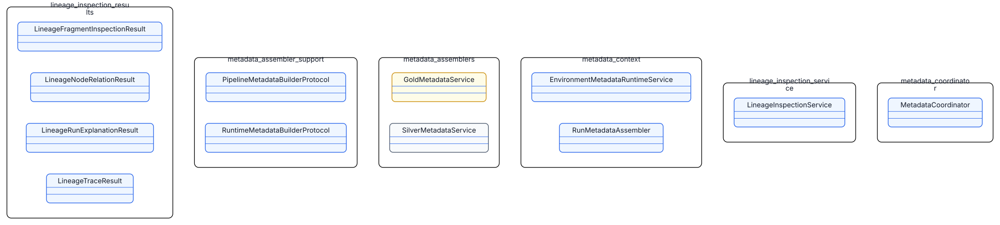

### Описание
Диаграмма «Package Family: application/services/lineage» показывает архитектурную модель модуля и фиксирует контракты, роли и отношения между сущностями слоя. Она представлена в формате диаграмма классов (class diagram) и служит ориентиром на уровне детализации «Package Family / Inventory Slice». В комментариях исходника зафиксирован фокус диаграммы: AST-derived supplemental package-family inventory for src/bioetl/application/services/lineage; modules: lineage_inspection_results, metadata_assembler_support, metadata_assemblers, metadata_context, lineage_inspection_service, metadata_coordinator.. Схема имеет плотность порядка 12 узлов; её удобно использовать как обзорный архитектурный срез для проверки влияния изменений, согласования интерфейсов и подготовки рефакторинга, но не как исчерпывающий каталог текущей кодовой поверхности. Ключевые блоки/подграфы: lineage inspection results, metadata assembler support, metadata assemblers, metadata context, lineage inspection service, metadata coordinator. Показательные узлы для быстрого чтения: LineageFragmentInspectionResult, LineageNodeRelationResult, LineageRunExplanationResult, LineageTraceResult, PipelineMetadataBuilderProtocol, RuntimeMetadataBuilderProtocol. Примечание: Generated supplemental package-family diagram. Curated class-summary remains narrative-only..

### Метаданные
- Тип: `classDiagram`
- Уровень: `Package Family / Inventory Slice`
- Дата: `2026-08-26`
- Узлы (metadata): `12`

\newpage

## 90-pkg-application-services-medallion

**Package Family: application/services/medallion**

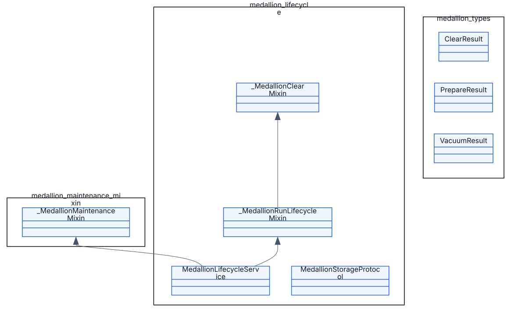

### Описание
Диаграмма «Package Family: application/services/medallion» показывает архитектурную модель модуля и фиксирует контракты, роли и отношения между сущностями слоя. Она представлена в формате диаграмма классов (class diagram) и служит ориентиром на уровне детализации «Package Family / Inventory Slice». В комментариях исходника зафиксирован фокус диаграммы: AST-derived supplemental package-family inventory for src/bioetl/application/services/medallion; modules: medallion_lifecycle, medallion_types, medallion_maintenance_mixin.. Схема имеет плотность порядка 8 узлов и 3 связей; её удобно использовать как обзорный архитектурный срез для проверки влияния изменений, согласования интерфейсов и подготовки рефакторинга, но не как исчерпывающий каталог текущей кодовой поверхности. Ключевые блоки/подграфы: medallion lifecycle, medallion types, medallion maintenance mixin. Показательные узлы для быстрого чтения: MedallionLifecycleService, MedallionStorageProtocol, _MedallionClearMixin, _MedallionRunLifecycleMixin, ClearResult, PrepareResult. Примечание: Generated supplemental package-family diagram. Curated class-summary remains narrative-only..

### Метаданные
- Тип: `classDiagram`
- Уровень: `Package Family / Inventory Slice`
- Дата: `2026-08-26`
- Узлы (metadata): `8`

\newpage

## 90-pkg-application-services-ops

**Package Family: application/services/ops**

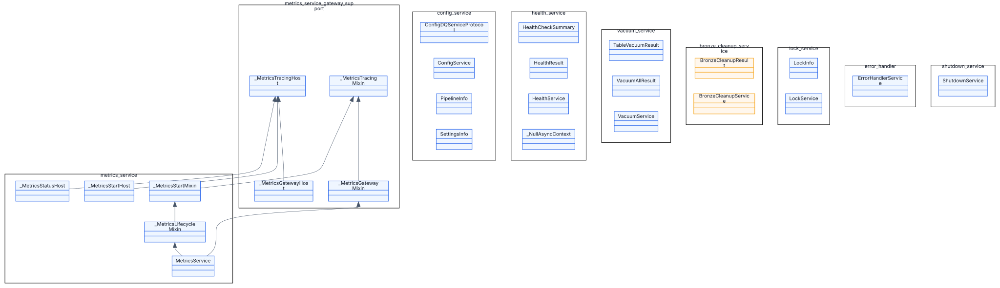

### Описание
Диаграмма «Package Family: application/services/ops» показывает архитектурную модель модуля и фиксирует контракты, роли и отношения между сущностями слоя. Она представлена в формате диаграмма классов (class diagram) и служит ориентиром на уровне детализации «Package Family / Inventory Slice». В комментариях исходника зафиксирован фокус диаграммы: AST-derived supplemental package-family inventory for src/bioetl/application/services/ops; modules: metrics_service, _metrics_service_gateway_support, config_service, health_service, vacuum_service, bronze_cleanup_service.. Схема имеет плотность порядка 26 узлов и 8 связей; её удобно использовать как обзорный архитектурный срез для проверки влияния изменений, согласования интерфейсов и подготовки рефакторинга, но не как исчерпывающий каталог текущей кодовой поверхности. Ключевые блоки/подграфы: metrics service, metrics service gateway support, config service, health service, vacuum service, bronze cleanup service. Показательные узлы для быстрого чтения: MetricsService, _MetricsLifecycleMixin, _MetricsStartHost, _MetricsStartMixin, _MetricsStatusHost, _MetricsGatewayHost. Примечание: Generated supplemental package-family diagram. Curated class-summary remains narrative-only..

### Метаданные
- Тип: `classDiagram`
- Уровень: `Package Family / Inventory Slice`
- Дата: `2026-08-26`
- Узлы (metadata): `26`

\newpage

## 90-pkg-application-services-protein

**Package Family: application/services/protein**

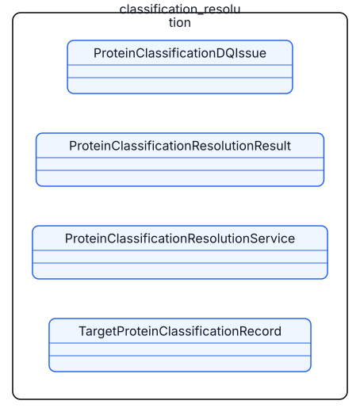

### Описание
Диаграмма «Package Family: application/services/protein» показывает архитектурную модель модуля и фиксирует контракты, роли и отношения между сущностями слоя. Она представлена в формате диаграмма классов (class diagram) и служит ориентиром на уровне детализации «Package Family / Inventory Slice». В комментариях исходника зафиксирован фокус диаграммы: AST-derived supplemental package-family inventory for src/bioetl/application/services/protein; modules: classification_resolution.. Схема имеет плотность порядка 4 узлов; её удобно использовать как обзорный архитектурный срез для проверки влияния изменений, согласования интерфейсов и подготовки рефакторинга, но не как исчерпывающий каталог текущей кодовой поверхности. Ключевые блоки/подграфы: classification resolution. Показательные узлы для быстрого чтения: ProteinClassificationDQIssue, ProteinClassificationResolutionResult, ProteinClassificationResolutionService, TargetProteinClassificationRecord. Примечание: Generated supplemental package-family diagram. Curated class-summary remains narrative-only..

### Метаданные
- Тип: `classDiagram`
- Уровень: `Package Family / Inventory Slice`
- Дата: `2026-08-26`
- Узлы (metadata): `4`

\newpage

## 90-pkg-application-services-quality

**Package Family: application/services/quality**

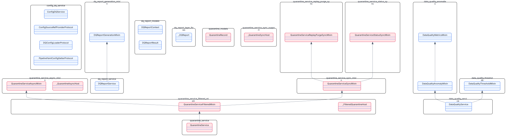

### Описание
Диаграмма «Package Family: application/services/quality» показывает архитектурную модель модуля и фиксирует контракты, роли и отношения между сущностями слоя. Она представлена в формате диаграмма классов (class diagram) и служит ориентиром на уровне детализации «Package Family / Inventory Slice». В комментариях исходника зафиксирован фокус диаграммы: AST-derived supplemental package-family inventory for src/bioetl/application/services/quality; modules: config_dq_service, _quarantine_service_async_mixin, _quarantine_service_filtered_mixin, data_quality_anomalies, dq_report_models, _dq_report_layer_flows.. Схема имеет плотность порядка 23 узлов и 9 связей; её удобно использовать как обзорный архитектурный срез для проверки влияния изменений, согласования интерфейсов и подготовки рефакторинга, но не как исчерпывающий каталог текущей кодовой поверхности. Ключевые блоки/подграфы: config dq service, quarantine service async mixin, quarantine service filtered mixin, data quality anomalies, dq report models, dq report layer flows. Показательные узлы для быстрого чтения: ConfigDQService, ConfigSourceRefProviderProtocol, DQConfigLoaderProtocol, PipelineYamlConfigGetterProtocol, QuarantineServiceAsyncMixin, _QuarantineAsyncHost. Примечание: Generated supplemental package-family diagram. Curated class-summary remains narrative-only..

### Метаданные
- Тип: `classDiagram`
- Уровень: `Package Family / Inventory Slice`
- Дата: `2026-08-26`
- Узлы (metadata): `23`

\newpage

## 90-pkg-application-services-run-reports

**Package Family: application/services/run_reports**

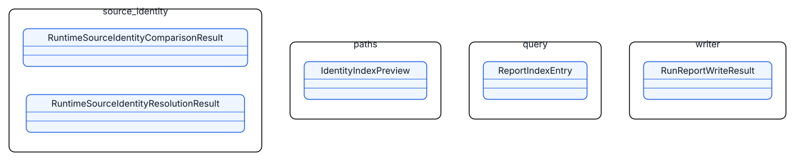

### Описание
Диаграмма «Package Family: application/services/run_reports» показывает архитектурную модель модуля и фиксирует контракты, роли и отношения между сущностями слоя. Она представлена в формате диаграмма классов (class diagram) и служит ориентиром на уровне детализации «Package Family / Inventory Slice». В комментариях исходника зафиксирован фокус диаграммы: AST-derived supplemental package-family inventory for src/bioetl/application/services/run_reports; modules: source_identity, paths, query, writer.. Схема имеет плотность порядка 5 узлов; её удобно использовать как обзорный архитектурный срез для проверки влияния изменений, согласования интерфейсов и подготовки рефакторинга, но не как исчерпывающий каталог текущей кодовой поверхности. Ключевые блоки/подграфы: source identity, paths, query, writer. Показательные узлы для быстрого чтения: RuntimeSourceIdentityComparisonResult, RuntimeSourceIdentityResolutionResult, IdentityIndexPreview, ReportIndexEntry, RunReportWriteResult. Примечание: Generated supplemental package-family diagram. Curated class-summary remains narrative-only..

### Метаданные
- Тип: `classDiagram`
- Уровень: `Package Family / Inventory Slice`
- Дата: `2026-08-26`
- Узлы (metadata): `5`

\newpage

## 90-pkg-application-services-workflow-control-plane

**Package Family: application/services/workflow/control_plane**

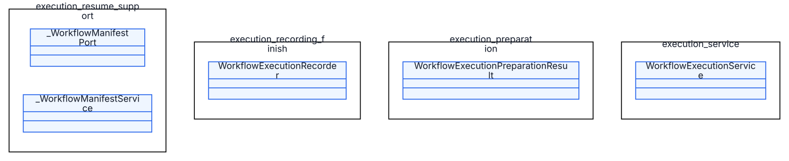

### Описание
Диаграмма «Package Family: application/services/workflow/control_plane» показывает архитектурную модель модуля и фиксирует контракты, роли и отношения между сущностями слоя. Она представлена в формате диаграмма классов (class diagram) и служит ориентиром на уровне детализации «Package Family / Inventory Slice». В комментариях исходника зафиксирован фокус диаграммы: AST-derived supplemental package-family inventory for src/bioetl/application/services/workflow/control_plane; modules: _execution_resume_support, _execution_recording_finish, execution_preparation, execution_service.. Схема имеет плотность порядка 5 узлов; её удобно использовать как обзорный архитектурный срез для проверки влияния изменений, согласования интерфейсов и подготовки рефакторинга, но не как исчерпывающий каталог текущей кодовой поверхности. Ключевые блоки/подграфы: execution resume support, execution recording finish, execution preparation, execution service. Показательные узлы для быстрого чтения: _WorkflowManifestPort, _WorkflowManifestService, WorkflowExecutionRecorder, WorkflowExecutionPreparationResult, WorkflowExecutionService. Примечание: Generated supplemental package-family diagram. Curated class-summary remains narrative-only..

### Метаданные
- Тип: `classDiagram`
- Уровень: `Package Family / Inventory Slice`
- Дата: `2026-08-26`
- Узлы (metadata): `5`

\newpage

## 90-pkg-application-services-workflow

**Package Family: application/services/workflow**

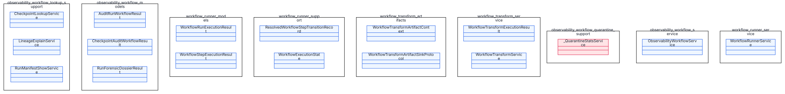

### Описание
Диаграмма «Package Family: application/services/workflow» показывает архитектурную модель модуля и фиксирует контракты, роли и отношения между сущностями слоя. Она представлена в формате диаграмма классов (class diagram) и служит ориентиром на уровне детализации «Package Family / Inventory Slice». В комментариях исходника зафиксирован фокус диаграммы: AST-derived supplemental package-family inventory for src/bioetl/application/services/workflow; modules: _observability_workflow_lookup_support, _observability_workflow_models, workflow_runner_models, workflow_runner_support, workflow_transform_artifacts, workflow_transform_service.. Схема имеет плотность порядка 17 узлов; её удобно использовать как обзорный архитектурный срез для проверки влияния изменений, согласования интерфейсов и подготовки рефакторинга, но не как исчерпывающий каталог текущей кодовой поверхности. Ключевые блоки/подграфы: observability workflow lookup support, observability workflow models, workflow runner models, workflow runner support, workflow transform artifacts, workflow transform service. Показательные узлы для быстрого чтения: CheckpointLookupService, LineageExplainService, RunManifestShowService, AuditRunWorkflowResult, CheckpointAuditWorkflowResult, RunForensicDossierResult. Примечание: Generated supplemental package-family diagram. Curated class-summary remains narrative-only..

### Метаданные
- Тип: `classDiagram`
- Уровень: `Package Family / Inventory Slice`
- Дата: `2026-08-26`
- Узлы (metadata): `17`

\newpage

## 90-pkg-composition-bootstrap-assembly

**Package Family: composition/bootstrap/assembly**

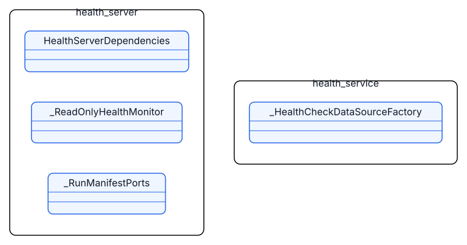

### Описание
Диаграмма «Package Family: composition/bootstrap/assembly» показывает архитектурную модель модуля и фиксирует контракты, роли и отношения между сущностями слоя. Она представлена в формате диаграмма классов (class diagram) и служит ориентиром на уровне детализации «Package Family / Inventory Slice». В комментариях исходника зафиксирован фокус диаграммы: AST-derived supplemental package-family inventory for src/bioetl/composition/bootstrap/assembly; modules: health_server, health_service.. Схема имеет плотность порядка 4 узлов; её удобно использовать как обзорный архитектурный срез для проверки влияния изменений, согласования интерфейсов и подготовки рефакторинга, но не как исчерпывающий каталог текущей кодовой поверхности. Ключевые блоки/подграфы: health server, health service. Показательные узлы для быстрого чтения: HealthServerDependencies, _ReadOnlyHealthMonitor, _RunManifestPorts, _HealthCheckDataSourceFactory. Примечание: Generated supplemental package-family diagram. Curated class-summary remains narrative-only..

### Метаданные
- Тип: `classDiagram`
- Уровень: `Package Family / Inventory Slice`
- Дата: `2026-08-26`
- Узлы (metadata): `4`

\newpage

## 90-pkg-composition-bootstrap-runtime

**Package Family: composition/bootstrap/runtime**

### Описание
Диаграмма «Package Family: composition/bootstrap/runtime» показывает архитектурную модель модуля и фиксирует контракты, роли и отношения между сущностями слоя. Она представлена в формате диаграмма классов (class diagram) и служит ориентиром на уровне детализации «Package Family / Inventory Slice». В комментариях исходника зафиксирован фокус диаграммы: AST-derived supplemental package-family inventory for src/bioetl/composition/bootstrap/runtime; modules: _observability_bundle_support, composite_support_services_factory, runner_factory_builder_service, _composite_control_plane_builder_support, _composite_plan_runtime_support, _composite_plan_support.. Схема имеет плотность порядка 17 узлов; её удобно использовать как обзорный архитектурный срез для проверки влияния изменений, согласования интерфейсов и подготовки рефакторинга, но не как исчерпывающий каталог текущей кодовой поверхности. Ключевые блоки/подграфы: observability bundle support, composite support services factory, runner factory builder service, composite control plane builder support, composite plan runtime support, composite plan support. Показательные узлы для быстрого чтения: ObservabilityBootstrappers, ObservabilityComponents, CompositeSupportServices, CompositeSupportServicesFactory, BronzeRunOptions, RunnerFactoryBuilder. Примечание: Generated supplemental package-family diagram. Curated class-summary remains narrative-only..

### Метаданные
- Тип: `classDiagram`
- Уровень: `Package Family / Inventory Slice`
- Дата: `2026-08-26`
- Узлы (metadata): `17`

\newpage

## 90-pkg-composition-contracts

**Package Family: composition/contracts**

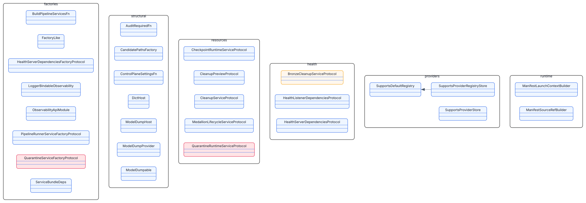

### Описание
Диаграмма «Package Family: composition/contracts» показывает архитектурную модель модуля и фиксирует контракты, роли и отношения между сущностями слоя. Она представлена в формате диаграмма классов (class diagram) и служит ориентиром на уровне детализации «Package Family / Inventory Slice». В комментариях исходника зафиксирован фокус диаграммы: AST-derived supplemental package-family inventory for src/bioetl/composition/contracts; modules: factories, structural, resources, health, providers, runtime.. Схема имеет плотность порядка 28 узлов и 1 связей; её удобно использовать как обзорный архитектурный срез для проверки влияния изменений, согласования интерфейсов и подготовки рефакторинга, но не как исчерпывающий каталог текущей кодовой поверхности. Ключевые блоки/подграфы: factories, structural, resources, health, providers, runtime. Показательные узлы для быстрого чтения: BuildPipelineServicesFn, FactoryLike, HealthServerDependenciesFactoryProtocol, LoggerBindableObservability, ObservabilityApiModule, PipelineRunnerServiceFactoryProtocol. Примечание: Generated supplemental package-family diagram. Curated class-summary remains narrative-only..

### Метаданные
- Тип: `classDiagram`
- Уровень: `Package Family / Inventory Slice`
- Дата: `2026-08-26`
- Узлы (metadata): `28`

\newpage

## 90-pkg-composition-factories-datasource

**Package Family: composition/factories/datasource**

### Описание
Диаграмма «Package Family: composition/factories/datasource» показывает архитектурную модель модуля и фиксирует контракты, роли и отношения между сущностями слоя. Она представлена в формате диаграмма классов (class diagram) и служит ориентиром на уровне детализации «Package Family / Inventory Slice». В комментариях исходника зафиксирован фокус диаграммы: AST-derived supplemental package-family inventory for src/bioetl/composition/factories/datasource; modules: adapter_helpers, http_client, _crossref_support, data_source_factory, pubchem.. Схема имеет плотность порядка 8 узлов; её удобно использовать как обзорный архитектурный срез для проверки влияния изменений, согласования интерфейсов и подготовки рефакторинга, но не как исчерпывающий каталог текущей кодовой поверхности. Ключевые блоки/подграфы: adapter helpers, http client, crossref support, data source factory, pubchem. Показательные узлы для быстрого чтения: AdapterHelperServices, AdapterHelpersFactory, SyncAdapterHelperServices, HttpClientFactory, ResolvedHttpConfig, CrossRefAdapterComponents. Примечание: Generated supplemental package-family diagram. Curated class-summary remains narrative-only..

### Метаданные
- Тип: `classDiagram`
- Уровень: `Package Family / Inventory Slice`
- Дата: `2026-08-26`
- Узлы (metadata): `8`

\newpage

## 90-pkg-composition-factories-services

**Package Family: composition/factories/services**

### Описание
Диаграмма «Package Family: composition/factories/services» показывает архитектурную модель модуля и фиксирует контракты, роли и отношения между сущностями слоя. Она представлена в формате диаграмма классов (class diagram) и служит ориентиром на уровне детализации «Package Family / Inventory Slice». В комментариях исходника зафиксирован фокус диаграммы: AST-derived supplemental package-family inventory for src/bioetl/composition/factories/services; modules: common_service_wiring, _bundle_support, _builder_record_processor_support, _pipeline_batch_executor_types, builder, bundle.. Схема имеет плотность порядка 11 узлов; её удобно использовать как обзорный архитектурный срез для проверки влияния изменений, согласования интерфейсов и подготовки рефакторинга, но не как исчерпывающий каталог текущей кодовой поверхности. Ключевые блоки/подграфы: common service wiring, bundle support, builder record processor support, pipeline batch executor types, builder, bundle. Показательные узлы для быстрого чтения: CommonServicePorts, CommonServicePortsRequest, _LazyStorageFactory, ServiceBundleDependencies, _PipelineCreationIdentity, _RecordProcessorBuildRequest. Примечание: Generated supplemental package-family diagram. Curated class-summary remains narrative-only..

### Метаданные
- Тип: `classDiagram`
- Уровень: `Package Family / Inventory Slice`
- Дата: `2026-08-26`
- Узлы (metadata): `11`

\newpage

## 90-pkg-composition-factories-storage

**Package Family: composition/factories/storage**

### Описание
Диаграмма «Package Family: composition/factories/storage» показывает архитектурную модель модуля и фиксирует контракты, роли и отношения между сущностями слоя. Она представлена в формате диаграмма классов (class diagram) и служит ориентиром на уровне детализации «Package Family / Inventory Slice». В комментариях исходника зафиксирован фокус диаграммы: AST-derived supplemental package-family inventory for src/bioetl/composition/factories/storage; modules: factory, _context_resolution, _layer_writers, _silver, bundle, clear_mixin.. Схема имеет плотность порядка 11 узлов и 5 связей; её удобно использовать как обзорный архитектурный срез для проверки влияния изменений, согласования интерфейсов и подготовки рефакторинга, но не как исчерпывающий каталог текущей кодовой поверхности. Ключевые блоки/подграфы: factory, context resolution, layer writers, silver, bundle, clear mixin. Показательные узлы для быстрого чтения: StorageContext, StorageFactory, StorageCreationContext, _SilverLayerWriterSupport, CreateSilverWriterRequest, StorageBundle. Примечание: Generated supplemental package-family diagram. Curated class-summary remains narrative-only..

### Метаданные
- Тип: `classDiagram`
- Уровень: `Package Family / Inventory Slice`
- Дата: `2026-08-26`
- Узлы (metadata): `11`

\newpage

## 90-pkg-composition-providers

**Package Family: composition/providers**

### Описание
Диаграмма «Package Family: composition/providers» показывает архитектурную модель модуля и фиксирует контракты, роли и отношения между сущностями слоя. Она представлена в формате диаграмма классов (class diagram) и служит ориентиром на уровне детализации «Package Family / Inventory Slice». В комментариях исходника зафиксирован фокус диаграммы: AST-derived supplemental package-family inventory for src/bioetl/composition/providers; modules: _registration_biblio_profiles, _creation, _default_registry, _registration_contracts, _chembl_target_protein_classification_data_source, _models.. Схема имеет плотность порядка 14 узлов; её удобно использовать как обзорный архитектурный срез для проверки влияния изменений, согласования интерфейсов и подготовки рефакторинга, но не как исчерпывающий каталог текущей кодовой поверхности. Ключевые блоки/подграфы: registration biblio profiles, creation, default registry, registration contracts, chembl target protein classification data source, models. Показательные узлы для быстрого чтения: MailtoBatchProfile, OpenAlexRequestProfile, PubMedRequestProfile, SemanticScholarRequestProfile, ProviderCreator, ProviderDataSourceCreationRequest. Примечание: Generated supplemental package-family diagram. Curated class-summary remains narrative-only..

### Метаданные
- Тип: `classDiagram`
- Уровень: `Package Family / Inventory Slice`
- Дата: `2026-08-26`
- Узлы (metadata): `14`

\newpage

## 90-pkg-composition-runtime-builders

**Package Family: composition/runtime_builders**

### Описание
Диаграмма «Package Family: composition/runtime_builders» показывает архитектурную модель модуля и фиксирует контракты, роли и отношения между сущностями слоя. Она представлена в формате диаграмма классов (class diagram) и служит ориентиром на уровне детализации «Package Family / Inventory Slice». В комментариях исходника зафиксирован фокус диаграммы: AST-derived supplemental package-family inventory for src/bioetl/composition/runtime_builders; modules: runner_builder_wiring, _manifest_publication_context_support, _runner_input_preparation, _run_manifest_builder_policy, _run_manifest_context_updates, _run_manifest_creation_support_helpers.. Схема имеет плотность порядка 22 узлов; её удобно использовать как обзорный архитектурный срез для проверки влияния изменений, согласования интерфейсов и подготовки рефакторинга, но не как исчерпывающий каталог текущей кодовой поверхности. Ключевые блоки/подграфы: runner builder wiring, manifest publication context support, runner input preparation, run manifest builder policy, run manifest context updates, run manifest creation support helpers. Показательные узлы для быстрого чтения: LegacyRunnerBuilderOverrides, RunnerBuilderWiring, RunnerFactoryWiring, RunnerInputWiring, ManifestPublicationIdentityKwargs, ResolvedManifestPublicationContext. Примечание: Generated supplemental package-family diagram. Curated class-summary remains narrative-only..

### Метаданные
- Тип: `classDiagram`
- Уровень: `Package Family / Inventory Slice`
- Дата: `2026-08-26`
- Узлы (metadata): `22`

\newpage

## 90-pkg-composition

**Package Family: composition**

### Описание
Диаграмма «Package Family: composition» показывает архитектурную модель модуля и фиксирует контракты, роли и отношения между сущностями слоя. Она представлена в формате диаграмма классов (class diagram) и служит ориентиром на уровне детализации «Package Family / Inventory Slice». В комментариях исходника зафиксирован фокус диаграммы: AST-derived supplemental package-family inventory for src/bioetl/composition; modules: bootstrap_contexts, _service_registry, _pipeline_execution, observability, observability_runtime, pipeline_runner_request.. Схема имеет плотность порядка 18 узлов; её удобно использовать как обзорный архитектурный срез для проверки влияния изменений, согласования интерфейсов и подготовки рефакторинга, но не как исчерпывающий каталог текущей кодовой поверхности. Ключевые блоки/подграфы: bootstrap contexts, service registry, pipeline execution, observability, observability runtime, pipeline runner request. Показательные узлы для быстрого чтения: DQConfigsContext, DQOutputPathsContext, PipelineCallbacksContext, RateLimitContext, _LazyContextualFactory, _LazyServiceFactory. Примечание: Generated supplemental package-family diagram. Curated class-summary remains narrative-only..

### Метаданные
- Тип: `classDiagram`
- Уровень: `Package Family / Inventory Slice`
- Дата: `2026-08-26`
- Узлы (metadata): `18`

\newpage

## 90-pkg-domain-aggregates

**Package Family: domain/aggregates**

### Описание
Диаграмма «Package Family: domain/aggregates» показывает архитектурную модель модуля и фиксирует контракты, роли и отношения между сущностями слоя. Она представлена в формате диаграмма классов (class diagram) и служит ориентиром на уровне детализации «Package Family / Inventory Slice». В комментариях исходника зафиксирован фокус диаграммы: AST-derived supplemental package-family inventory for src/bioetl/domain/aggregates; modules: events, _quarantine_value_objects, batch, pipeline_run_stage_result, _batch_mixins, _pipeline_run_mixins.. Схема имеет плотность порядка 29 узлов и 19 связей; её удобно использовать как обзорный архитектурный срез для проверки влияния изменений, согласования интерфейсов и подготовки рефакторинга, но не как исчерпывающий каталог текущей кодовой поверхности. Ключевые блоки/подграфы: events, quarantine value objects, batch, pipeline run stage result, batch mixins, pipeline run mixins. Показательные узлы для быстрого чтения: BatchCreated, BatchFailed, BatchSealed, BatchWritten, DomainEvent, PipelineCompleted. Примечание: Generated supplemental package-family diagram. Curated class-summary remains narrative-only..

### Метаданные
- Тип: `classDiagram`
- Уровень: `Package Family / Inventory Slice`
- Дата: `2026-08-26`
- Узлы (metadata): `29`

\newpage

## 90-pkg-domain-behavior-part1

**Package Family: domain/behavior (Part 1/2)**

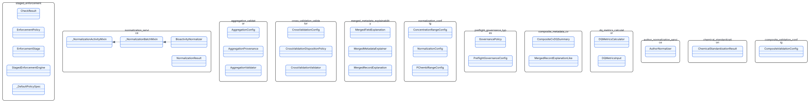

### Описание
Диаграмма «Package Family: domain/behavior (Part 1/2)» показывает архитектурную модель модуля и фиксирует контракты, роли и отношения между сущностями слоя. Она представлена в формате диаграмма классов (class diagram) и служит ориентиром на уровне детализации «Package Family / Inventory Slice». В комментариях исходника зафиксирован фокус диаграммы: AST-derived supplemental package-family inventory slice for src/bioetl/domain/behavior; part 1/2; modules: staged_enforcement, normalization_service, aggregation_validator, cross_validation_validator, merged_metadata_explainability, normalization_config.. Схема имеет плотность порядка 30 узлов и 2 связей; её удобно использовать как обзорный архитектурный срез для проверки влияния изменений, согласования интерфейсов и подготовки рефакторинга, но не как исчерпывающий каталог текущей кодовой поверхности. Ключевые блоки/подграфы: staged enforcement, normalization service, aggregation validator, cross validation validator, merged metadata explainability, normalization config. Показательные узлы для быстрого чтения: CheckResult, EnforcementPolicy, EnforcementStage, StagedEnforcementEngine, _DefaultPolicySpec, BioactivityNormalizer. Примечание: Generated supplemental package-family slice used to keep node density within the class-diagram readability budget (<= 30)..

### Метаданные
- Тип: `classDiagram`
- Уровень: `Package Family / Inventory Slice`
- Дата: `2026-08-26`
- Узлы (metadata): `30`

\newpage

## 90-pkg-domain-behavior-part2

**Package Family: domain/behavior (Part 2/2)**

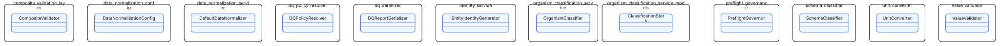

### Описание
Диаграмма «Package Family: domain/behavior (Part 2/2)» показывает архитектурную модель модуля и фиксирует контракты, роли и отношения между сущностями слоя. Она представлена в формате диаграмма классов (class diagram) и служит ориентиром на уровне детализации «Package Family / Inventory Slice». В комментариях исходника зафиксирован фокус диаграммы: AST-derived supplemental package-family inventory slice for src/bioetl/domain/behavior; part 2/2; modules: composite_validation_layer, data_normalization_config, data_normalization_service, dq_policy_resolver, dq_serializer, identity_service.. Схема имеет плотность порядка 12 узлов; её удобно использовать как обзорный архитектурный срез для проверки влияния изменений, согласования интерфейсов и подготовки рефакторинга, но не как исчерпывающий каталог текущей кодовой поверхности. Ключевые блоки/подграфы: composite validation layer, data normalization config, data normalization service, dq policy resolver, dq serializer, identity service. Показательные узлы для быстрого чтения: CompositeValidator, DataNormalizationConfig, DefaultDataNormalizer, DQPolicyResolver, DQReportSerializer, EntityIdentityGenerator. Примечание: Generated supplemental package-family slice used to keep node density within the class-diagram readability budget (<= 30)..

### Метаданные
- Тип: `classDiagram`
- Уровень: `Package Family / Inventory Slice`
- Дата: `2026-08-26`
- Узлы (metadata): `12`

\newpage

## 90-pkg-domain-composite-part1

**Package Family: domain/composite (Part 1/3)**

### Описание
Диаграмма «Package Family: domain/composite (Part 1/3)» показывает архитектурную модель модуля и фиксирует контракты, роли и отношения между сущностями слоя. Она представлена в формате диаграмма классов (class diagram) и служит ориентиром на уровне детализации «Package Family / Inventory Slice». В комментариях исходника зафиксирован фокус диаграммы: AST-derived supplemental package-family inventory slice for src/bioetl/domain/composite; part 1/3; modules: config_composite_protocols, cross_validation, aggregation.. Схема имеет плотность порядка 27 узлов; её удобно использовать как обзорный архитектурный срез для проверки влияния изменений, согласования интерфейсов и подготовки рефакторинга, но не как исчерпывающий каталог текущей кодовой поверхности. Ключевые блоки/подграфы: config composite protocols, cross validation, aggregation. Показательные узлы для быстрого чтения: CompositeConfigProtocol, _AggregationConfigProtocol, _AggregationFieldProtocol, _ColumnGroupProtocol, _CrossValidationConfigProtocol, _DQConfigProtocol. Примечание: Generated supplemental package-family slice used to keep node density within the class-diagram readability budget (<= 30)..

### Метаданные
- Тип: `classDiagram`
- Уровень: `Package Family / Inventory Slice`
- Дата: `2026-08-26`
- Узлы (metadata): `27`

\newpage

## 90-pkg-domain-composite-part2

**Package Family: domain/composite (Part 2/3)**

### Описание
Диаграмма «Package Family: domain/composite (Part 2/3)» показывает архитектурную модель модуля и фиксирует контракты, роли и отношения между сущностями слоя. Она представлена в формате диаграмма классов (class diagram) и служит ориентиром на уровне детализации «Package Family / Inventory Slice». В комментариях исходника зафиксирован фокус диаграммы: AST-derived supplemental package-family inventory slice for src/bioetl/domain/composite; part 2/3; modules: config_composite_validation, config_models, lineage, result_seed_dependency, strategy, config_dq.. Схема имеет плотность порядка 30 узлов; её удобно использовать как обзорный архитектурный срез для проверки влияния изменений, согласования интерфейсов и подготовки рефакторинга, но не как исчерпывающий каталог текущей кодовой поверхности. Ключевые блоки/подграфы: config composite validation, config models, lineage, result seed dependency, strategy, config dq. Показательные узлы для быстрого чтения: CompositeConfigProtocol, _DependencyConfigProtocol, _EnricherConfigProtocol, _SeedConfigProtocol, CompositeConfig, DependencyConfig. Примечание: Generated supplemental package-family slice used to keep node density within the class-diagram readability budget (<= 30)..

### Метаданные
- Тип: `classDiagram`
- Уровень: `Package Family / Inventory Slice`
- Дата: `2026-08-26`
- Узлы (metadata): `30`

\newpage

## 90-pkg-domain-composite-part3

**Package Family: domain/composite (Part 3/3)**

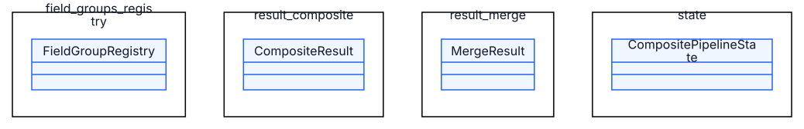

### Описание
Диаграмма «Package Family: domain/composite (Part 3/3)» показывает архитектурную модель модуля и фиксирует контракты, роли и отношения между сущностями слоя. Она представлена в формате диаграмма классов (class diagram) и служит ориентиром на уровне детализации «Package Family / Inventory Slice». В комментариях исходника зафиксирован фокус диаграммы: AST-derived supplemental package-family inventory slice for src/bioetl/domain/composite; part 3/3; modules: field_groups_registry, result_composite, result_merge, state.. Схема имеет плотность порядка 4 узлов; её удобно использовать как обзорный архитектурный срез для проверки влияния изменений, согласования интерфейсов и подготовки рефакторинга, но не как исчерпывающий каталог текущей кодовой поверхности. Ключевые блоки/подграфы: field groups registry, result composite, result merge, state. Показательные узлы для быстрого чтения: FieldGroupRegistry, CompositeResult, MergeResult, CompositePipelineState. Примечание: Generated supplemental package-family slice used to keep node density within the class-diagram readability budget (<= 30)..

### Метаданные
- Тип: `classDiagram`
- Уровень: `Package Family / Inventory Slice`
- Дата: `2026-08-26`
- Узлы (metadata): `4`

\newpage

## 90-pkg-domain-contracts-gold-part1

**Package Family: domain/contracts/gold (Part 1/2)**

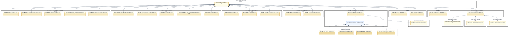

### Описание
Диаграмма «Package Family: domain/contracts/gold (Part 1/2)» показывает архитектурную модель модуля и фиксирует контракты, роли и отношения между сущностями слоя. Она представлена в формате диаграмма классов (class diagram) и служит ориентиром на уровне детализации «Package Family / Inventory Slice». В комментариях исходника зафиксирован фокус диаграммы: AST-derived supplemental package-family inventory slice for src/bioetl/domain/contracts/gold; part 1/2; modules: _chembl_reference_publication_schemas, _chembl_target_lookup_schemas, _chembl_activity_assay_schemas, composite_bioassay, _chembl_molecule_protein_schemas, _composite_gold_common_schema.. Схема имеет плотность порядка 30 узлов и 29 связей; её удобно использовать как обзорный архитектурный срез для проверки влияния изменений, согласования интерфейсов и подготовки рефакторинга, но не как исчерпывающий каталог текущей кодовой поверхности. Ключевые блоки/подграфы: chembl reference publication schemas, chembl target lookup schemas, chembl activity assay schemas, composite bioassay, chembl molecule protein schemas, composite gold common schema. Показательные узлы для быстрого чтения: ChEMBLCellLineGoldSchema, ChEMBLCompoundRecordGoldSchema, ChEMBLPublicationGoldSchema, ChEMBLPublicationSimilarityGoldSchema, ChEMBLPublicationTermGoldSchema, ChEMBLSubcellularFractionGoldSchema. Примечание: Generated supplemental package-family slice used to keep node density within the class-diagram readability budget (<= 30)..

### Метаданные
- Тип: `classDiagram`
- Уровень: `Package Family / Inventory Slice`
- Дата: `2026-08-26`
- Узлы (metadata): `30`

\newpage

## 90-pkg-domain-contracts-gold-part2

**Package Family: domain/contracts/gold (Part 2/2)**

### Описание
Диаграмма «Package Family: domain/contracts/gold (Part 2/2)» показывает архитектурную модель модуля и фиксирует контракты, роли и отношения между сущностями слоя. Она представлена в формате диаграмма классов (class diagram) и служит ориентиром на уровне детализации «Package Family / Inventory Slice». В комментариях исходника зафиксирован фокус диаграммы: AST-derived supplemental package-family inventory slice for src/bioetl/domain/contracts/gold; part 2/2; modules: publications_semanticscholar.. Схема имеет плотность порядка 1 узлов; её удобно использовать как обзорный архитектурный срез для проверки влияния изменений, согласования интерфейсов и подготовки рефакторинга, но не как исчерпывающий каталог текущей кодовой поверхности. Ключевые блоки/подграфы: publications semanticscholar. Показательные узлы для быстрого чтения: SemanticScholarPublicationGoldSchema. Примечание: Generated supplemental package-family slice used to keep node density within the class-diagram readability budget (<= 30)..

### Метаданные
- Тип: `classDiagram`
- Уровень: `Package Family / Inventory Slice`
- Дата: `2026-08-26`
- Узлы (metadata): `1`

\newpage

## 90-pkg-domain-control-plane-part1

**Package Family: domain/control_plane (Part 1/2)**

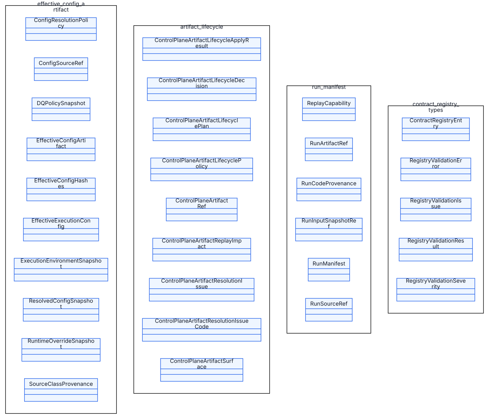

### Описание
Диаграмма «Package Family: domain/control_plane (Part 1/2)» показывает архитектурную модель модуля и фиксирует контракты, роли и отношения между сущностями слоя. Она представлена в формате диаграмма классов (class diagram) и служит ориентиром на уровне детализации «Package Family / Inventory Slice». В комментариях исходника зафиксирован фокус диаграммы: AST-derived supplemental package-family inventory slice for src/bioetl/domain/control_plane; part 1/2; modules: effective_config_artifact, artifact_lifecycle, run_manifest, contract_registry_types.. Схема имеет плотность порядка 30 узлов; её удобно использовать как обзорный архитектурный срез для проверки влияния изменений, согласования интерфейсов и подготовки рефакторинга, но не как исчерпывающий каталог текущей кодовой поверхности. Ключевые блоки/подграфы: effective config artifact, artifact lifecycle, run manifest, contract registry types. Показательные узлы для быстрого чтения: ConfigResolutionPolicy, ConfigSourceRef, DQPolicySnapshot, EffectiveConfigArtifact, EffectiveConfigHashes, EffectiveExecutionConfig. Примечание: Generated supplemental package-family slice used to keep node density within the class-diagram readability budget (<= 30)..

### Метаданные
- Тип: `classDiagram`
- Уровень: `Package Family / Inventory Slice`
- Дата: `2026-08-26`
- Узлы (metadata): `30`

\newpage

## 90-pkg-domain-control-plane-part2

**Package Family: domain/control_plane (Part 2/2)**

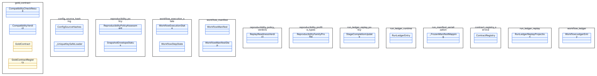

### Описание
Диаграмма «Package Family: domain/control_plane (Part 2/2)» показывает архитектурную модель модуля и фиксирует контракты, роли и отношения между сущностями слоя. Она представлена в формате диаграмма классов (class diagram) и служит ориентиром на уровне детализации «Package Family / Inventory Slice». В комментариях исходника зафиксирован фокус диаграммы: AST-derived supplemental package-family inventory slice for src/bioetl/domain/control_plane; part 2/2; modules: gold_contract, config_source_hashing, reproducibility_policy, workflow_execution_state, workflow_manifest, _reproducibility_policy_verdicts.. Схема имеет плотность порядка 20 узлов; её удобно использовать как обзорный архитектурный срез для проверки влияния изменений, согласования интерфейсов и подготовки рефакторинга, но не как исчерпывающий каталог текущей кодовой поверхности. Ключевые блоки/подграфы: gold contract, config source hashing, reproducibility policy, workflow execution state, workflow manifest, reproducibility policy verdicts. Показательные узлы для быстрого чтения: CompatibilityCheckResult, CompatibilityVerdict, GoldContract, GoldContractRegistry, ConfigSourceHashes, _UniqueKeySafeLoader. Примечание: Generated supplemental package-family slice used to keep node density within the class-diagram readability budget (<= 30)..

### Метаданные
- Тип: `classDiagram`
- Уровень: `Package Family / Inventory Slice`
- Дата: `2026-08-26`
- Узлы (metadata): `20`

\newpage

## 90-pkg-domain-exceptions-network

**Package Family: domain/exceptions/network**

### Описание
Диаграмма «Package Family: domain/exceptions/network» показывает архитектурную модель модуля и фиксирует контракты, роли и отношения между сущностями слоя. Она представлена в формате диаграмма классов (class diagram) и служит ориентиром на уровне детализации «Package Family / Inventory Slice». В комментариях исходника зафиксирован фокус диаграммы: AST-derived supplemental package-family inventory for src/bioetl/domain/exceptions/network; modules: service, connection, timeout.. Схема имеет плотность порядка 10 узлов и 4 связей; её удобно использовать как обзорный архитектурный срез для проверки влияния изменений, согласования интерфейсов и подготовки рефакторинга, но не как исчерпывающий каталог текущей кодовой поверхности. Ключевые блоки/подграфы: service, connection, timeout. Показательные узлы для быстрого чтения: ApiError, DataValidationError, ExternalServiceError, RateLimitError, ServiceAuthenticationError, ServiceUnavailableError. Примечание: Generated supplemental package-family diagram. Curated class-summary remains narrative-only..

### Метаданные
- Тип: `classDiagram`
- Уровень: `Package Family / Inventory Slice`
- Дата: `2026-08-26`
- Узлы (metadata): `10`

\newpage

## 90-pkg-domain-exceptions-storage

**Package Family: domain/exceptions/storage**

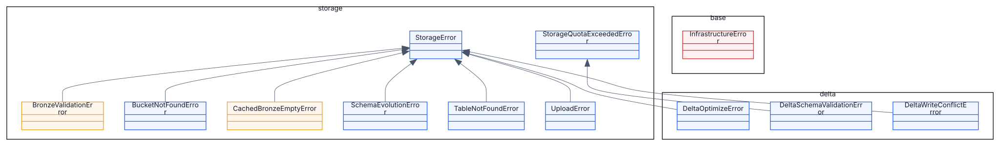

### Описание
Диаграмма «Package Family: domain/exceptions/storage» показывает архитектурную модель модуля и фиксирует контракты, роли и отношения между сущностями слоя. Она представлена в формате диаграмма классов (class diagram) и служит ориентиром на уровне детализации «Package Family / Inventory Slice». В комментариях исходника зафиксирован фокус диаграммы: AST-derived supplemental package-family inventory for src/bioetl/domain/exceptions/storage; modules: _storage, _delta, _base.. Схема имеет плотность порядка 12 узлов и 9 связей; её удобно использовать как обзорный архитектурный срез для проверки влияния изменений, согласования интерфейсов и подготовки рефакторинга, но не как исчерпывающий каталог текущей кодовой поверхности. Ключевые блоки/подграфы: storage, delta, base. Показательные узлы для быстрого чтения: BronzeValidationError, BucketNotFoundError, CachedBronzeEmptyError, SchemaEvolutionError, StorageError, StorageQuotaExceededError. Примечание: Generated supplemental package-family diagram. Curated class-summary remains narrative-only..

### Метаданные
- Тип: `classDiagram`
- Уровень: `Package Family / Inventory Slice`
- Дата: `2026-08-26`
- Узлы (metadata): `12`

\newpage

## 90-pkg-domain-filtering

**Package Family: domain/filtering**

### Описание
Диаграмма «Package Family: domain/filtering» показывает архитектурную модель модуля и фиксирует контракты, роли и отношения между сущностями слоя. Она представлена в формате диаграмма классов (class diagram) и служит ориентиром на уровне детализации «Package Family / Inventory Slice». В комментариях исходника зафиксирован фокус диаграммы: AST-derived supplemental package-family inventory for src/bioetl/domain/filtering; modules: column_filter, input_config, list_filters, _base_filter_config, _filter_decision, gold_config.. Схема имеет плотность порядка 12 узлов и 2 связей; её удобно использовать как обзорный архитектурный срез для проверки влияния изменений, согласования интерфейсов и подготовки рефакторинга, но не как исчерпывающий каталог текущей кодовой поверхности. Ключевые блоки/подграфы: column filter, input config, list filters, base filter config, filter decision, gold config. Показательные узлы для быстрого чтения: FilterOperator, GoldColumnFilter, FilterColumn, InputFilterConfig, GoldListContainsFilter, GoldListLengthFilter. Примечание: Generated supplemental package-family diagram. Curated class-summary remains narrative-only..

### Метаданные
- Тип: `classDiagram`
- Уровень: `Package Family / Inventory Slice`
- Дата: `2026-08-26`
- Узлы (metadata): `12`

\newpage

## 90-pkg-domain-lineage

**Package Family: domain/lineage**

### Описание
Диаграмма «Package Family: domain/lineage» показывает архитектурную модель модуля и фиксирует контракты, роли и отношения между сущностями слоя. Она представлена в формате диаграмма классов (class diagram) и служит ориентиром на уровне детализации «Package Family / Inventory Slice». В комментариях исходника зафиксирован фокус диаграммы: AST-derived supplemental package-family inventory for src/bioetl/domain/lineage; modules: refs, graph, metadata_bundle.. Схема имеет плотность порядка 9 узлов; её удобно использовать как обзорный архитектурный срез для проверки влияния изменений, согласования интерфейсов и подготовки рефакторинга, но не как исчерпывающий каталог текущей кодовой поверхности. Ключевые блоки/подграфы: refs, graph, metadata bundle. Показательные узлы для быстрого чтения: DatasetRef, LineageNodeRef, LineageNodeType, SchemaRef, TransformRef, LineageEdge. Примечание: Generated supplemental package-family diagram. Curated class-summary remains narrative-only..

### Метаданные
- Тип: `classDiagram`
- Уровень: `Package Family / Inventory Slice`
- Дата: `2026-08-26`
- Узлы (metadata): `9`

\newpage

## 90-pkg-domain-mapping

**Package Family: domain/mapping**

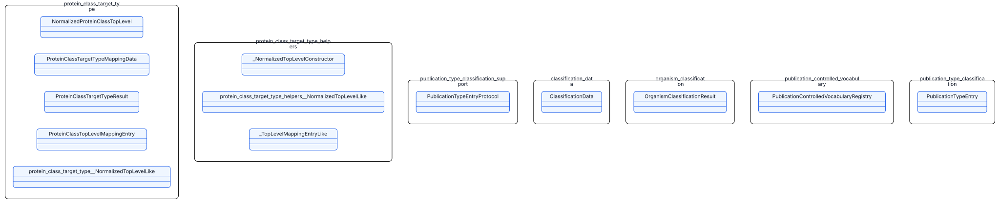

### Описание
Диаграмма «Package Family: domain/mapping» показывает архитектурную модель модуля и фиксирует контракты, роли и отношения между сущностями слоя. Она представлена в формате диаграмма классов (class diagram) и служит ориентиром на уровне детализации «Package Family / Inventory Slice». В комментариях исходника зафиксирован фокус диаграммы: AST-derived supplemental package-family inventory for src/bioetl/domain/mapping; modules: protein_class_target_type, protein_class_target_type_helpers, _publication_type_classification_support, classification_data, organism_classification, publication_controlled_vocabulary.. Схема имеет плотность порядка 13 узлов; её удобно использовать как обзорный архитектурный срез для проверки влияния изменений, согласования интерфейсов и подготовки рефакторинга, но не как исчерпывающий каталог текущей кодовой поверхности. Ключевые блоки/подграфы: protein class target type, protein class target type helpers, publication type classification support, classification data, organism classification, publication controlled vocabulary. Показательные узлы для быстрого чтения: NormalizedProteinClassTopLevel, ProteinClassTargetTypeMappingData, ProteinClassTargetTypeResult, ProteinClassTopLevelMappingEntry, protein_class_target_type__NormalizedTopLevelLike, _NormalizedTopLevelConstructor. Примечание: Generated supplemental package-family diagram. Curated class-summary remains narrative-only..

### Метаданные
- Тип: `classDiagram`
- Уровень: `Package Family / Inventory Slice`
- Дата: `2026-08-26`
- Узлы (metadata): `13`

\newpage

## 90-pkg-domain-models-part1

**Package Family: domain/models (Part 1/2)**

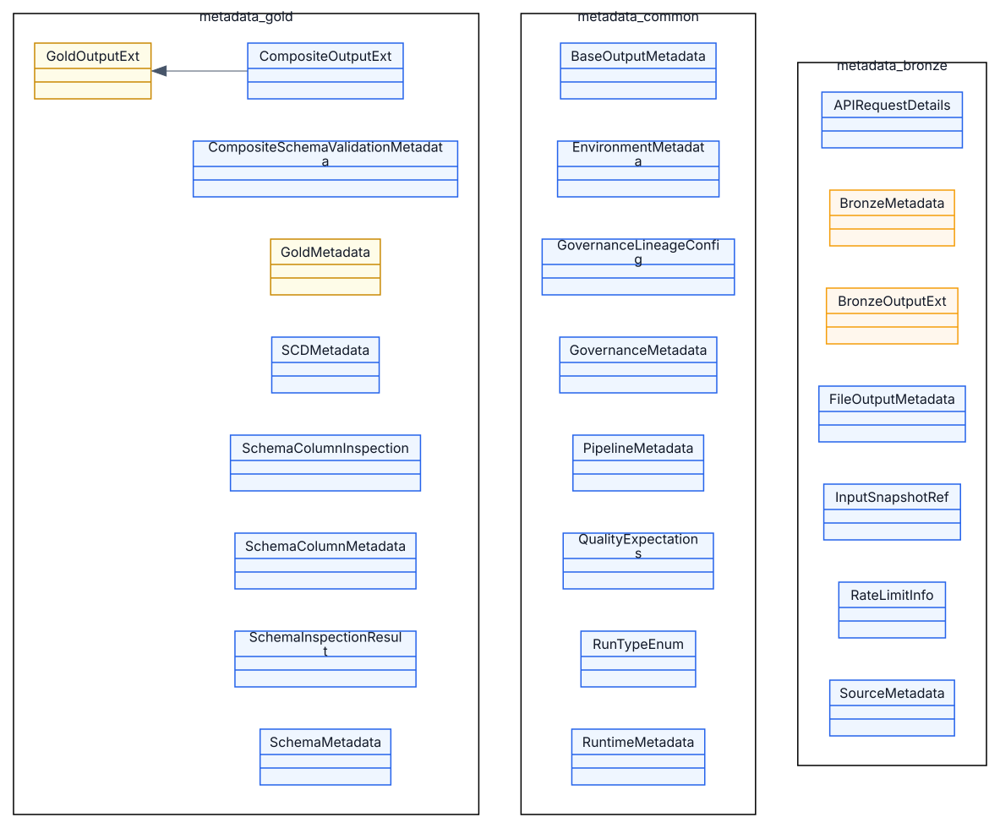

### Описание
Диаграмма «Package Family: domain/models (Part 1/2)» показывает архитектурную модель модуля и фиксирует контракты, роли и отношения между сущностями слоя. Она представлена в формате диаграмма классов (class diagram) и служит ориентиром на уровне детализации «Package Family / Inventory Slice». В комментариях исходника зафиксирован фокус диаграммы: AST-derived supplemental package-family inventory slice for src/bioetl/domain/models; part 1/2; modules: _metadata_gold, _metadata_common, _metadata_bronze.. Схема имеет плотность порядка 24 узлов и 1 связей; её удобно использовать как обзорный архитектурный срез для проверки влияния изменений, согласования интерфейсов и подготовки рефакторинга, но не как исчерпывающий каталог текущей кодовой поверхности. Ключевые блоки/подграфы: metadata gold, metadata common, metadata bronze. Показательные узлы для быстрого чтения: CompositeOutputExt, CompositeSchemaValidationMetadata, GoldMetadata, GoldOutputExt, SCDMetadata, SchemaColumnInspection. Примечание: Generated supplemental package-family slice used to keep node density within the class-diagram readability budget (<= 30)..

### Метаданные
- Тип: `classDiagram`
- Уровень: `Package Family / Inventory Slice`
- Дата: `2026-08-26`
- Узлы (metadata): `24`

\newpage

## 90-pkg-domain-models-part2

**Package Family: domain/models (Part 2/2)**

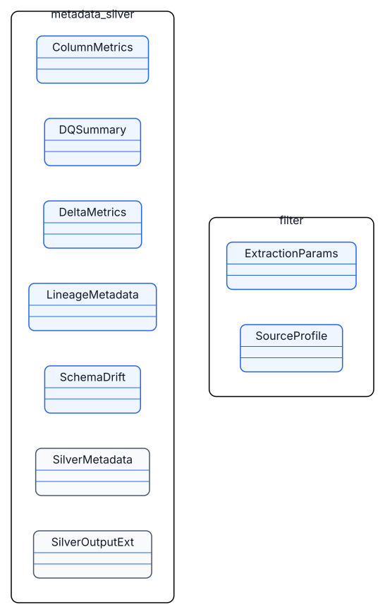

### Описание
Диаграмма «Package Family: domain/models (Part 2/2)» показывает архитектурную модель модуля и фиксирует контракты, роли и отношения между сущностями слоя. Она представлена в формате диаграмма классов (class diagram) и служит ориентиром на уровне детализации «Package Family / Inventory Slice». В комментариях исходника зафиксирован фокус диаграммы: AST-derived supplemental package-family inventory slice for src/bioetl/domain/models; part 2/2; modules: _metadata_silver, filter.. Схема имеет плотность порядка 9 узлов; её удобно использовать как обзорный архитектурный срез для проверки влияния изменений, согласования интерфейсов и подготовки рефакторинга, но не как исчерпывающий каталог текущей кодовой поверхности. Ключевые блоки/подграфы: metadata silver, filter. Показательные узлы для быстрого чтения: ColumnMetrics, DQSummary, DeltaMetrics, LineageMetadata, SchemaDrift, SilverMetadata. Примечание: Generated supplemental package-family slice used to keep node density within the class-diagram readability budget (<= 30)..

### Метаданные
- Тип: `classDiagram`
- Уровень: `Package Family / Inventory Slice`
- Дата: `2026-08-26`
- Узлы (metadata): `9`

\newpage

## 90-pkg-domain-normalization-profiles

**Package Family: domain/normalization/profiles**

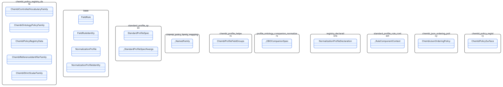

### Описание
Диаграмма «Package Family: domain/normalization/profiles» показывает архитектурную модель модуля и фиксирует контракты, роли и отношения между сущностями слоя. Она представлена в формате диаграмма классов (class diagram) и служит ориентиром на уровне детализации «Package Family / Inventory Slice». В комментариях исходника зафиксирован фокус диаграммы: AST-derived supplemental package-family inventory for src/bioetl/domain/normalization/profiles; modules: chembl_policy_registry_data, base, _standard_profile_spec, _chembl_policy_family_mapping, _chembl_profile_helpers, _profile_ontology_companion_normalizers.. Схема имеет плотность порядка 18 узлов; её удобно использовать как обзорный архитектурный срез для проверки влияния изменений, согласования интерфейсов и подготовки рефакторинга, но не как исчерпывающий каталог текущей кодовой поверхности. Ключевые блоки/подграфы: chembl policy registry data, base, standard profile spec, chembl policy family mapping, chembl profile helpers, profile ontology companion normalizers. Показательные узлы для быстрого чтения: ChemblControlledVocabularyFamily, ChemblOntologyPolicyFamily, ChemblPolicyRegistryData, ChemblReferenceIdentifierFamily, ChemblStrictScalarFamily, FieldRule. Примечание: Generated supplemental package-family diagram. Curated class-summary remains narrative-only..

### Метаданные
- Тип: `classDiagram`
- Уровень: `Package Family / Inventory Slice`
- Дата: `2026-08-26`
- Узлы (metadata): `18`

\newpage

## 90-pkg-domain-normalization

**Package Family: domain/normalization**

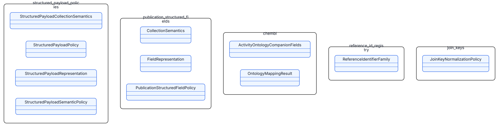

### Описание
Диаграмма «Package Family: domain/normalization» показывает архитектурную модель модуля и фиксирует контракты, роли и отношения между сущностями слоя. Она представлена в формате диаграмма классов (class diagram) и служит ориентиром на уровне детализации «Package Family / Inventory Slice». В комментариях исходника зафиксирован фокус диаграммы: AST-derived supplemental package-family inventory for src/bioetl/domain/normalization; modules: structured_payload_policies, publication_structured_fields, chembl, _reference_id_registry, join_keys.. Схема имеет плотность порядка 11 узлов; её удобно использовать как обзорный архитектурный срез для проверки влияния изменений, согласования интерфейсов и подготовки рефакторинга, но не как исчерпывающий каталог текущей кодовой поверхности. Ключевые блоки/подграфы: structured payload policies, publication structured fields, chembl, reference id registry, join keys. Показательные узлы для быстрого чтения: StructuredPayloadCollectionSemantics, StructuredPayloadPolicy, StructuredPayloadRepresentation, StructuredPayloadSemanticPolicy, CollectionSemantics, FieldRepresentation. Примечание: Generated supplemental package-family diagram. Curated class-summary remains narrative-only..

### Метаданные
- Тип: `classDiagram`
- Уровень: `Package Family / Inventory Slice`
- Дата: `2026-08-26`
- Узлы (metadata): `11`

\newpage

## 90-pkg-domain-part1

**Package Family: domain (Part 1/2)**

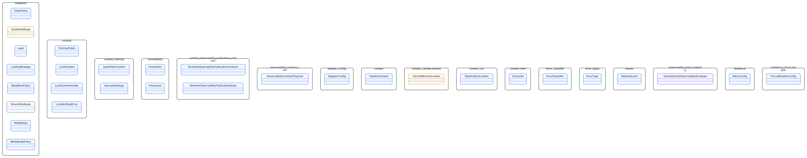

### Описание
Диаграмма «Package Family: domain (Part 1/2)» показывает архитектурную модель модуля и фиксирует контракты, роли и отношения между сущностями слоя. Она представлена в формате диаграмма классов (class diagram) и служит ориентиром на уровне детализации «Package Family / Inventory Slice». В комментариях исходника зафиксирован фокус диаграммы: AST-derived supplemental package-family inventory slice for src/bioetl/domain; part 1/2; modules: medallion, locking, context_filtering, immutability, runtime_observability_publication_contract, _observability_contract_core.. Схема имеет плотность порядка 30 узлов; её удобно использовать как обзорный архитектурный срез для проверки влияния изменений, согласования интерфейсов и подготовки рефакторинга, но не как исчерпывающий каталог текущей кодовой поверхности. Ключевые блоки/подграфы: medallion, locking, context filtering, immutability, runtime observability publication contract, observability contract core. Показательные узлы для быстрого чтения: ClearPolicy, GoldWriteMode, Layer, LoadingStrategy, MedallionPolicy, SilverWriteMode. Примечание: Generated supplemental package-family slice used to keep node density within the class-diagram readability budget (<= 30)..

### Метаданные
- Тип: `classDiagram`
- Уровень: `Package Family / Inventory Slice`
- Дата: `2026-08-26`
- Узлы (metadata): `30`

\newpage

## 90-pkg-domain-part2

**Package Family: domain (Part 2/2)**

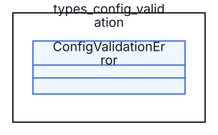

### Описание
Диаграмма «Package Family: domain (Part 2/2)» показывает архитектурную модель модуля и фиксирует контракты, роли и отношения между сущностями слоя. Она представлена в формате диаграмма классов (class diagram) и служит ориентиром на уровне детализации «Package Family / Inventory Slice». В комментариях исходника зафиксирован фокус диаграммы: AST-derived supplemental package-family inventory slice for src/bioetl/domain; part 2/2; modules: types_config_validation.. Схема имеет плотность порядка 1 узлов; её удобно использовать как обзорный архитектурный срез для проверки влияния изменений, согласования интерфейсов и подготовки рефакторинга, но не как исчерпывающий каталог текущей кодовой поверхности. Ключевые блоки/подграфы: types config validation. Показательные узлы для быстрого чтения: ConfigValidationError. Примечание: Generated supplemental package-family slice used to keep node density within the class-diagram readability budget (<= 30)..

### Метаданные
- Тип: `classDiagram`
- Уровень: `Package Family / Inventory Slice`
- Дата: `2026-08-26`
- Узлы (metadata): `1`

\newpage

## 90-pkg-domain-ports-config

**Package Family: domain/ports/config**

### Описание
Диаграмма «Package Family: domain/ports/config» показывает архитектурную модель модуля и фиксирует контракты, роли и отношения между сущностями слоя. Она представлена в формате диаграмма классов (class diagram) и служит ориентиром на уровне детализации «Package Family / Inventory Slice». В комментариях исходника зафиксирован фокус диаграммы: AST-derived supplemental package-family inventory for src/bioetl/domain/ports/config; modules: config_loader_port, config_port, publication_vocabulary_port.. Схема имеет плотность порядка 7 узлов; её удобно использовать как обзорный архитектурный срез для проверки влияния изменений, согласования интерфейсов и подготовки рефакторинга, но не как исчерпывающий каталог текущей кодовой поверхности. Ключевые блоки/подграфы: config loader port, config port, publication vocabulary port. Показательные узлы для быстрого чтения: DomainConfigMapperPort, PipelineConfigLoaderPort, SettingsLoaderPort, PipelineSettingsPort, PipelineYamlConfigPort, SettingsPort. Примечание: Generated supplemental package-family diagram. Curated class-summary remains narrative-only..

### Метаданные
- Тип: `classDiagram`
- Уровень: `Package Family / Inventory Slice`
- Дата: `2026-08-26`
- Узлы (metadata): `7`

\newpage

## 90-pkg-domain-ports-control-plane

**Package Family: domain/ports/control_plane**

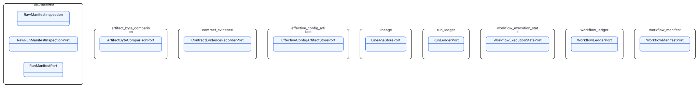

### Описание
Диаграмма «Package Family: domain/ports/control_plane» показывает архитектурную модель модуля и фиксирует контракты, роли и отношения между сущностями слоя. Она представлена в формате диаграмма классов (class diagram) и служит ориентиром на уровне детализации «Package Family / Inventory Slice». В комментариях исходника зафиксирован фокус диаграммы: AST-derived supplemental package-family inventory for src/bioetl/domain/ports/control_plane; modules: run_manifest, artifact_byte_comparison, contract_evidence, effective_config_artifact, lineage, run_ledger.. Схема имеет плотность порядка 11 узлов; её удобно использовать как обзорный архитектурный срез для проверки влияния изменений, согласования интерфейсов и подготовки рефакторинга, но не как исчерпывающий каталог текущей кодовой поверхности. Ключевые блоки/подграфы: run manifest, artifact byte comparison, contract evidence, effective config artifact, lineage, run ledger. Показательные узлы для быстрого чтения: RawManifestInspection, RawRunManifestInspectionPort, RunManifestPort, ArtifactByteComparisonPort, ContractEvidenceRecorderPort, EffectiveConfigArtifactStorePort. Примечание: Generated supplemental package-family diagram. Curated class-summary remains narrative-only..

### Метаданные
- Тип: `classDiagram`
- Уровень: `Package Family / Inventory Slice`
- Дата: `2026-08-26`
- Узлы (metadata): `11`

\newpage

## 90-pkg-domain-ports-metadata

**Package Family: domain/ports/metadata**

### Описание
Диаграмма «Package Family: domain/ports/metadata» показывает архитектурную модель модуля и фиксирует контракты, роли и отношения между сущностями слоя. Она представлена в формате диаграмма классов (class diagram) и служит ориентиром на уровне детализации «Package Family / Inventory Slice». В комментариях исходника зафиксирован фокус диаграммы: AST-derived supplemental package-family inventory for src/bioetl/domain/ports/metadata; modules: coordinator, writer.. Схема имеет плотность порядка 6 узлов; её удобно использовать как обзорный архитектурный срез для проверки влияния изменений, согласования интерфейсов и подготовки рефакторинга, но не как исчерпывающий каталог текущей кодовой поверхности. Ключевые блоки/подграфы: coordinator, writer. Показательные узлы для быстрого чтения: BronzeMetadataInput, GoldMetadataInput, MetadataCoordinatorPort, SilverMetadataInput, SilverRef, MetadataWriterPort. Примечание: Generated supplemental package-family diagram. Curated class-summary remains narrative-only..

### Метаданные
- Тип: `classDiagram`
- Уровень: `Package Family / Inventory Slice`
- Дата: `2026-08-26`
- Узлы (metadata): `6`

\newpage

## 90-pkg-domain-ports-noop

**Package Family: domain/ports/noop**

### Описание
Диаграмма «Package Family: domain/ports/noop» показывает архитектурную модель модуля и фиксирует контракты, роли и отношения между сущностями слоя. Она представлена в формате диаграмма классов (class diagram) и служит ориентиром на уровне детализации «Package Family / Inventory Slice». В комментариях исходника зафиксирован фокус диаграммы: AST-derived supplemental package-family inventory for src/bioetl/domain/ports/noop; modules: _tracing, _audit_pii, _memory_metadata, _async_boundary, _debug, _metrics.. Схема имеет плотность порядка 10 узлов; её удобно использовать как обзорный архитектурный срез для проверки влияния изменений, согласования интерфейсов и подготовки рефакторинга, но не как исчерпывающий каталог текущей кодовой поверхности. Ключевые блоки/подграфы: tracing, audit pii, memory metadata, async boundary, debug, metrics. Показательные узлы для быстрого чтения: NoOpTracing, _NoOpOtelTracer, _NoOpSpan, NoOpAudit, NoOpPiiHasher, NoOpMemoryMonitor. Примечание: Generated supplemental package-family diagram. Curated class-summary remains narrative-only..

### Метаданные
- Тип: `classDiagram`
- Уровень: `Package Family / Inventory Slice`
- Дата: `2026-08-26`
- Узлы (metadata): `10`

\newpage

## 90-pkg-domain-ports-observability

**Package Family: domain/ports/observability**

### Описание
Диаграмма «Package Family: domain/ports/observability» показывает архитектурную модель модуля и фиксирует контракты, роли и отношения между сущностями слоя. Она представлена в формате диаграмма классов (class diagram) и служит ориентиром на уровне детализации «Package Family / Inventory Slice». В комментариях исходника зафиксирован фокус диаграммы: AST-derived supplemental package-family inventory for src/bioetl/domain/ports/observability; modules: metrics, tracing, dq_monitor, logging.. Схема имеет плотность порядка 11 узлов; её удобно использовать как обзорный архитектурный срез для проверки влияния изменений, согласования интерфейсов и подготовки рефакторинга, но не как исчерпывающий каталог текущей кодовой поверхности. Ключевые блоки/подграфы: metrics, tracing, dq monitor, logging. Показательные узлы для быстрого чтения: ExecutorMetricsPort, HealthMetricsExpositionPort, MetricsPort, MetricsPublisherPort, MetricsServerPort, MetricsServerRuntimeStatus. Примечание: Generated supplemental package-family diagram. Curated class-summary remains narrative-only..

### Метаданные
- Тип: `classDiagram`
- Уровень: `Package Family / Inventory Slice`
- Дата: `2026-08-26`
- Узлы (metadata): `11`

\newpage

## 90-pkg-domain-ports-quality

**Package Family: domain/ports/quality**

### Описание
Диаграмма «Package Family: domain/ports/quality» показывает архитектурную модель модуля и фиксирует контракты, роли и отношения между сущностями слоя. Она представлена в формате диаграмма классов (class diagram) и служит ориентиром на уровне детализации «Package Family / Inventory Slice». В комментариях исходника зафиксирован фокус диаграммы: AST-derived supplemental package-family inventory for src/bioetl/domain/ports/quality; modules: dq_report, dq_config, quarantine, validation, contract_policy, error_classifier.. Схема имеет плотность порядка 16 узлов; её удобно использовать как обзорный архитектурный срез для проверки влияния изменений, согласования интерфейсов и подготовки рефакторинга, но не как исчерпывающий каталог текущей кодовой поверхности. Ключевые блоки/подграфы: dq report, dq config, quarantine, validation, contract policy, error classifier. Показательные узлы для быстрого чтения: BronzeDQAnalyzerPort, DQReportWriterPort, GoldDQAnalyzerPort, SilverDQAnalyzerPort, BronzeDQConfigPort, GoldDQConfigPort. Примечание: Generated supplemental package-family diagram. Curated class-summary remains narrative-only..

### Метаданные
- Тип: `classDiagram`
- Уровень: `Package Family / Inventory Slice`
- Дата: `2026-08-26`
- Узлы (metadata): `16`

\newpage

## 90-pkg-domain-ports-runtime

**Package Family: domain/ports/runtime**

### Описание
Диаграмма «Package Family: domain/ports/runtime» показывает архитектурную модель модуля и фиксирует контракты, роли и отношения между сущностями слоя. Она представлена в формате диаграмма классов (class diagram) и служит ориентиром на уровне детализации «Package Family / Inventory Slice». В комментариях исходника зафиксирован фокус диаграммы: AST-derived supplemental package-family inventory for src/bioetl/domain/ports/runtime; modules: runner, pipeline_debug, memory, registry_port, batch_id, checkpoint.. Схема имеет плотность порядка 26 узлов и 2 связей; её удобно использовать как обзорный архитектурный срез для проверки влияния изменений, согласования интерфейсов и подготовки рефакторинга, но не как исчерпывающий каталог текущей кодовой поверхности. Ключевые блоки/подграфы: runner, pipeline debug, memory, registry port, batch id, checkpoint. Показательные узлы для быстрого чтения: ExecutionMetricsReadablePort, ExecutionMetricsRunnerPort, ExecutionObservabilityPort, MetricsExtractorPort, PipelineControlPlaneArtifacts, PipelineCreateRunnerRequest. Примечание: Generated supplemental package-family diagram. Curated class-summary remains narrative-only..

### Метаданные
- Тип: `classDiagram`
- Уровень: `Package Family / Inventory Slice`
- Дата: `2026-08-26`
- Узлы (metadata): `26`

\newpage

## 90-pkg-domain-ports-storage

**Package Family: domain/ports/storage**

### Описание
Диаграмма «Package Family: domain/ports/storage» показывает архитектурную модель модуля и фиксирует контракты, роли и отношения между сущностями слоя. Она представлена в формате диаграмма классов (class diagram) и служит ориентиром на уровне детализации «Package Family / Inventory Slice». В комментариях исходника зафиксирован фокус диаграммы: AST-derived supplemental package-family inventory for src/bioetl/domain/ports/storage; modules: silver_port, bronze_port, gold_port, lifecycle_port, merged_port, run_report_store.. Схема имеет плотность порядка 7 узлов; её удобно использовать как обзорный архитектурный срез для проверки влияния изменений, согласования интерфейсов и подготовки рефакторинга, но не как исчерпывающий каталог текущей кодовой поверхности. Ключевые блоки/подграфы: silver port, bronze port, gold port, lifecycle port, merged port, run report store. Показательные узлы для быстрого чтения: SilverStoragePort, SilverWriteRequest, BronzeStoragePort, GoldStoragePort, StorageLifecyclePort, MergedStoragePort. Примечание: Generated supplemental package-family diagram. Curated class-summary remains narrative-only..

### Метаданные
- Тип: `classDiagram`
- Уровень: `Package Family / Inventory Slice`
- Дата: `2026-08-26`
- Узлы (metadata): `7`

\newpage

## 90-pkg-domain-registry

**Package Family: domain/registry**

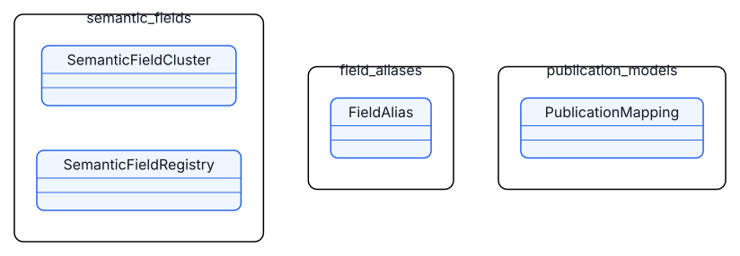

### Описание
Диаграмма «Package Family: domain/registry» показывает архитектурную модель модуля и фиксирует контракты, роли и отношения между сущностями слоя. Она представлена в формате диаграмма классов (class diagram) и служит ориентиром на уровне детализации «Package Family / Inventory Slice». В комментариях исходника зафиксирован фокус диаграммы: AST-derived supplemental package-family inventory for src/bioetl/domain/registry; modules: semantic_fields, field_aliases, publication_models.. Схема имеет плотность порядка 4 узлов; её удобно использовать как обзорный архитектурный срез для проверки влияния изменений, согласования интерфейсов и подготовки рефакторинга, но не как исчерпывающий каталог текущей кодовой поверхности. Ключевые блоки/подграфы: semantic fields, field aliases, publication models. Показательные узлы для быстрого чтения: SemanticFieldCluster, SemanticFieldRegistry, FieldAlias, PublicationMapping. Примечание: Generated supplemental package-family diagram. Curated class-summary remains narrative-only..

### Метаданные
- Тип: `classDiagram`
- Уровень: `Package Family / Inventory Slice`
- Дата: `2026-08-26`
- Узлы (metadata): `4`

\newpage

## 90-pkg-domain-run-reports

**Package Family: domain/run_reports**

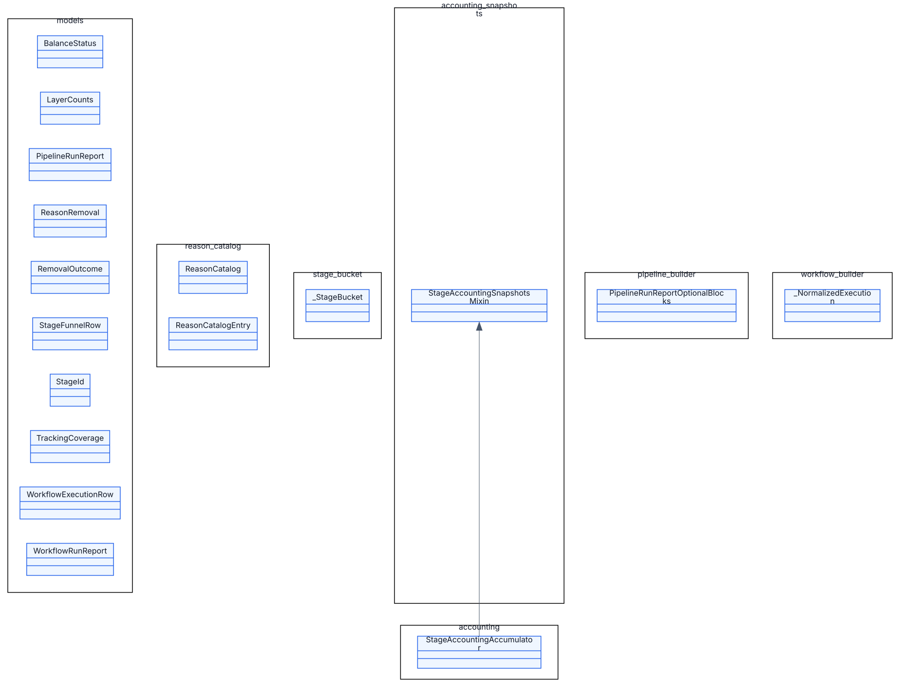

### Описание
Диаграмма «Package Family: domain/run_reports» показывает архитектурную модель модуля и фиксирует контракты, роли и отношения между сущностями слоя. Она представлена в формате диаграмма классов (class diagram) и служит ориентиром на уровне детализации «Package Family / Inventory Slice». В комментариях исходника зафиксирован фокус диаграммы: AST-derived supplemental package-family inventory for src/bioetl/domain/run_reports; modules: models, reason_catalog, _stage_bucket, accounting, accounting_snapshots, pipeline_builder.. Схема имеет плотность порядка 17 узлов и 1 связей; её удобно использовать как обзорный архитектурный срез для проверки влияния изменений, согласования интерфейсов и подготовки рефакторинга, но не как исчерпывающий каталог текущей кодовой поверхности. Ключевые блоки/подграфы: models, reason catalog, stage bucket, accounting, accounting snapshots, pipeline builder. Показательные узлы для быстрого чтения: BalanceStatus, LayerCounts, PipelineRunReport, ReasonRemoval, RemovalOutcome, StageFunnelRow. Примечание: Generated supplemental package-family diagram. Curated class-summary remains narrative-only..

### Метаданные
- Тип: `classDiagram`
- Уровень: `Package Family / Inventory Slice`
- Дата: `2026-08-26`
- Узлы (metadata): `17`

\newpage

## 90-pkg-domain-schemas-chembl

**Package Family: domain/schemas/chembl**

### Описание
Диаграмма «Package Family: domain/schemas/chembl» показывает архитектурную модель модуля и фиксирует контракты, роли и отношения между сущностями слоя. Она представлена в формате диаграмма классов (class diagram) и служит ориентиром на уровне детализации «Package Family / Inventory Slice». В комментариях исходника зафиксирован фокус диаграммы: AST-derived supplemental package-family inventory for src/bioetl/domain/schemas/chembl; modules: activity, assay, assay_parameters, cell_line, compound_record, molecule.. Схема имеет плотность порядка 15 узлов; её удобно использовать как обзорный архитектурный срез для проверки влияния изменений, согласования интерфейсов и подготовки рефакторинга, но не как исчерпывающий каталог текущей кодовой поверхности. Ключевые блоки/подграфы: activity, assay, assay parameters, cell line, compound record, molecule. Показательные узлы для быстрого чтения: ActivitySchema, AssaySchema, AssayParametersSchema, CellLineSchema, CompoundRecordSchema, MoleculeSchema. Примечание: Generated supplemental package-family diagram. Curated class-summary remains narrative-only..

### Метаданные
- Тип: `classDiagram`
- Уровень: `Package Family / Inventory Slice`
- Дата: `2026-08-26`
- Узлы (metadata): `15`

\newpage

## 90-pkg-domain-schemas-pubchem

**Package Family: domain/schemas/pubchem**

### Описание
Диаграмма «Package Family: domain/schemas/pubchem» показывает архитектурную модель модуля и фиксирует контракты, роли и отношения между сущностями слоя. Она представлена в формате диаграмма классов (class diagram) и служит ориентиром на уровне детализации «Package Family / Inventory Slice». В комментариях исходника зафиксирован фокус диаграммы: AST-derived supplemental package-family inventory for src/bioetl/domain/schemas/pubchem; modules: _identifiers, _physchem, _stereo, _three_d, compound.. Схема имеет плотность порядка 5 узлов и 4 связей; её удобно использовать как обзорный архитектурный срез для проверки влияния изменений, согласования интерфейсов и подготовки рефакторинга, но не как исчерпывающий каталог текущей кодовой поверхности. Ключевые блоки/подграфы: identifiers, physchem, stereo, three d, compound. Показательные узлы для быстрого чтения: PubchemIdentitySchema, PubchemPhysChemSchema, PubchemStereoSchema, PubchemThreeDSchema, PubchemMoleculeSchema. Примечание: Generated supplemental package-family diagram. Curated class-summary remains narrative-only..

### Метаданные
- Тип: `classDiagram`
- Уровень: `Package Family / Inventory Slice`
- Дата: `2026-08-26`
- Узлы (metadata): `5`

\newpage

## 90-pkg-domain-schemas-uniprot

**Package Family: domain/schemas/uniprot**

### Описание
Диаграмма «Package Family: domain/schemas/uniprot» показывает архитектурную модель модуля и фиксирует контракты, роли и отношения между сущностями слоя. Она представлена в формате диаграмма классов (class diagram) и служит ориентиром на уровне детализации «Package Family / Inventory Slice». В комментариях исходника зафиксирован фокус диаграммы: AST-derived supplemental package-family inventory for src/bioetl/domain/schemas/uniprot; modules: _annotations, _core, _features, _xrefs, idmapping, protein.. Схема имеет плотность порядка 6 узлов и 4 связей; её удобно использовать как обзорный архитектурный срез для проверки влияния изменений, согласования интерфейсов и подготовки рефакторинга, но не как исчерпывающий каталог текущей кодовой поверхности. Ключевые блоки/подграфы: annotations, core, features, xrefs, idmapping, protein. Показательные узлы для быстрого чтения: UniprotAnnotationSchema, UniprotCoreSchema, UniprotFeatureSchema, UniprotXrefSchema, IDMappingSchema, UniprotTargetSchema. Примечание: Generated supplemental package-family diagram. Curated class-summary remains narrative-only..

### Метаданные
- Тип: `classDiagram`
- Уровень: `Package Family / Inventory Slice`
- Дата: `2026-08-26`
- Узлы (metadata): `6`

\newpage

## 90-pkg-domain-workflow

**Package Family: domain/workflow**

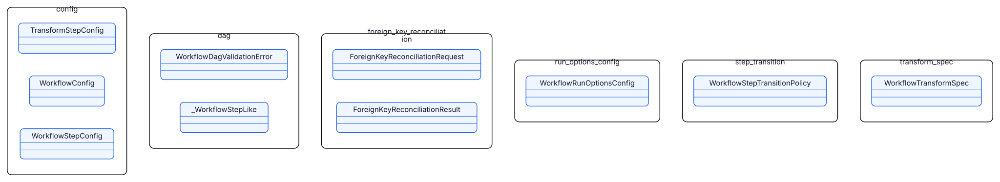

### Описание
Диаграмма «Package Family: domain/workflow» показывает архитектурную модель модуля и фиксирует контракты, роли и отношения между сущностями слоя. Она представлена в формате диаграмма классов (class diagram) и служит ориентиром на уровне детализации «Package Family / Inventory Slice». В комментариях исходника зафиксирован фокус диаграммы: AST-derived supplemental package-family inventory for src/bioetl/domain/workflow; modules: config, dag, foreign_key_reconciliation, _run_options_config, step_transition, transform_spec.. Схема имеет плотность порядка 10 узлов; её удобно использовать как обзорный архитектурный срез для проверки влияния изменений, согласования интерфейсов и подготовки рефакторинга, но не как исчерпывающий каталог текущей кодовой поверхности. Ключевые блоки/подграфы: config, dag, foreign key reconciliation, run options config, step transition, transform spec. Показательные узлы для быстрого чтения: TransformStepConfig, WorkflowConfig, WorkflowStepConfig, WorkflowDagValidationError, _WorkflowStepLike, ForeignKeyReconciliationRequest. Примечание: Generated supplemental package-family diagram. Curated class-summary remains narrative-only..

### Метаданные
- Тип: `classDiagram`
- Уровень: `Package Family / Inventory Slice`
- Дата: `2026-08-26`
- Узлы (metadata): `10`

\newpage

## 90-pkg-infrastructure-adapters-chembl-part1

**Package Family: infrastructure/adapters/chembl (Part 1/2)**

### Описание
Диаграмма «Package Family: infrastructure/adapters/chembl (Part 1/2)» показывает архитектурную модель модуля и фиксирует контракты, роли и отношения между сущностями слоя. Она представлена в формате диаграмма классов (class diagram) и служит ориентиром на уровне детализации «Package Family / Inventory Slice». В комментариях исходника зафиксирован фокус диаграммы: AST-derived supplemental package-family inventory slice for src/bioetl/infrastructure/adapters/chembl; part 1/2; modules: models_additional, models_common, models_compound, _models_common_extra, models_activity, _fetch_paging_filtered.. Схема имеет плотность порядка 30 узлов; её удобно использовать как обзорный архитектурный срез для проверки влияния изменений, согласования интерфейсов и подготовки рефакторинга, но не как исчерпывающий каталог текущей кодовой поверхности. Ключевые блоки/подграфы: models additional, models common, models compound, models common extra, models activity, fetch paging filtered. Показательные узлы для быстрого чтения: ChemblCompoundRecordApiRecord, ChemblCompoundRecordResponse, ChemblProteinClassApiRecord, ChemblProteinClassResponse, ChemblPublicationSimilarityApiRecord, ChemblPublicationSimilarityResponse. Примечание: Generated supplemental package-family slice used to keep node density within the class-diagram readability budget (<= 30)..

### Метаданные
- Тип: `classDiagram`
- Уровень: `Package Family / Inventory Slice`
- Дата: `2026-08-26`
- Узлы (metadata): `30`

\newpage

## 90-pkg-infrastructure-adapters-chembl-part2

**Package Family: infrastructure/adapters/chembl (Part 2/2)**

### Описание
Диаграмма «Package Family: infrastructure/adapters/chembl (Part 2/2)» показывает архитектурную модель модуля и фиксирует контракты, роли и отношения между сущностями слоя. Она представлена в формате диаграмма классов (class diagram) и служит ориентиром на уровне детализации «Package Family / Inventory Slice». В комментариях исходника зафиксирован фокус диаграммы: AST-derived supplemental package-family inventory slice for src/bioetl/infrastructure/adapters/chembl; part 2/2; modules: _models_common_page, _protein_classification_node, client, entity_mapper, fetch_adapter_mixin, fetch_multi_filter_mixin.. Схема имеет плотность порядка 11 узлов и 6 связей; её удобно использовать как обзорный архитектурный срез для проверки влияния изменений, согласования интерфейсов и подготовки рефакторинга, но не как исчерпывающий каталог текущей кодовой поверхности. Ключевые блоки/подграфы: models common page, protein classification node, client, entity mapper, fetch adapter mixin, fetch multi filter mixin. Показательные узлы для быстрого чтения: ChemblPageMeta, ProteinClassificationNode, ChemblAdapter, ChemblEntityMapper, ChemblFetchAdapterMixin, ChemblFetchMultiFilterMixin. Примечание: Generated supplemental package-family slice used to keep node density within the class-diagram readability budget (<= 30)..

### Метаданные
- Тип: `classDiagram`
- Уровень: `Package Family / Inventory Slice`
- Дата: `2026-08-26`
- Узлы (metadata): `11`

\newpage

## 90-pkg-infrastructure-adapters-common

**Package Family: infrastructure/adapters/common**

### Описание
Диаграмма «Package Family: infrastructure/adapters/common» показывает архитектурную модель модуля и фиксирует контракты, роли и отношения между сущностями слоя. Она представлена в формате диаграмма классов (class diagram) и служит ориентиром на уровне детализации «Package Family / Inventory Slice». В комментариях исходника зафиксирован фокус диаграммы: AST-derived supplemental package-family inventory for src/bioetl/infrastructure/adapters/common; modules: fallback_fetch_service, composable_fallback, dependency_context, _fetch_resilience_host, _title_fallback_flow, api_request_collector.. Схема имеет плотность порядка 19 узлов; её удобно использовать как обзорный архитектурный срез для проверки влияния изменений, согласования интерфейсов и подготовки рефакторинга, но не как исчерпывающий каталог текущей кодовой поверхности. Ключевые блоки/подграфы: fallback fetch service, composable fallback, dependency context, fetch resilience host, title fallback flow, api request collector. Показательные узлы для быстрого чтения: DefaultFallbackExecution, ExtractRecordIdProtocol, FallbackExecutionProtocol, FallbackFetchOrchestrator, FallbackFetchRequest, NormalizeIdProtocol. Примечание: Generated supplemental package-family diagram. Curated class-summary remains narrative-only..

### Метаданные
- Тип: `classDiagram`
- Уровень: `Package Family / Inventory Slice`
- Дата: `2026-08-26`
- Узлы (metadata): `19`

\newpage

## 90-pkg-infrastructure-adapters-crossref

**Package Family: infrastructure/adapters/crossref**

### Описание
Диаграмма «Package Family: infrastructure/adapters/crossref» показывает архитектурную модель модуля и фиксирует контракты, роли и отношения между сущностями слоя. Она представлена в формате диаграмма классов (class diagram) и служит ориентиром на уровне детализации «Package Family / Inventory Slice». В комментариях исходника зафиксирован фокус диаграммы: AST-derived supplemental package-family inventory for src/bioetl/infrastructure/adapters/crossref; modules: models_shared, _batch_support, _response_models, response_mapper, types, _client_fallback_policy.. Схема имеет плотность порядка 29 узлов и 2 связей; её удобно использовать как обзорный архитектурный срез для проверки влияния изменений, согласования интерфейсов и подготовки рефакторинга, но не как исчерпывающий каталог текущей кодовой поверхности. Ключевые блоки/подграфы: models shared, batch support, response models, response mapper, types, client fallback policy. Показательные узлы для быстрого чтения: CrossRefAssertion, CrossRefAuthor, CrossRefClinicalTrial, CrossRefDateParts, CrossRefFunder, CrossRefLicense. Примечание: Generated supplemental package-family diagram. Curated class-summary remains narrative-only..

### Метаданные
- Тип: `classDiagram`
- Уровень: `Package Family / Inventory Slice`
- Дата: `2026-08-26`
- Узлы (metadata): `29`

\newpage

## 90-pkg-infrastructure-adapters-http

**Package Family: infrastructure/adapters/http**

### Описание
Диаграмма «Package Family: infrastructure/adapters/http» показывает архитектурную модель модуля и фиксирует контракты, роли и отношения между сущностями слоя. Она представлена в формате диаграмма классов (class diagram) и служит ориентиром на уровне детализации «Package Family / Inventory Slice». В комментариях исходника зафиксирован фокус диаграммы: AST-derived supplemental package-family inventory for src/bioetl/infrastructure/adapters/http; modules: _client_retry_flow, client_retry_observability, _health_monitor_models, _client_retry_models, client_request_methods_mixin, health_monitor.. Схема имеет плотность порядка 27 узлов и 3 связей; её удобно использовать как обзорный архитектурный срез для проверки влияния изменений, согласования интерфейсов и подготовки рефакторинга, но не как исчерпывающий каталог текущей кодовой поверхности. Ключевые блоки/подграфы: client retry flow, client retry observability, health monitor models, client retry models, client request methods mixin, health monitor. Показательные узлы для быстрого чтения: _CanRetryCheck, _RetryBudgetRecorder, _RetryDelayHandler, _RetryLogger, _RetryableErrorCheck, _StatusCodeResolver. Примечание: Generated supplemental package-family diagram. Curated class-summary remains narrative-only..

### Метаданные
- Тип: `classDiagram`
- Уровень: `Package Family / Inventory Slice`
- Дата: `2026-08-26`
- Узлы (metadata): `27`

\newpage

## 90-pkg-infrastructure-adapters-openalex

**Package Family: infrastructure/adapters/openalex**

### Описание
Диаграмма «Package Family: infrastructure/adapters/openalex» показывает архитектурную модель модуля и фиксирует контракты, роли и отношения между сущностями слоя. Она представлена в формате диаграмма классов (class diagram) и служит ориентиром на уровне детализации «Package Family / Inventory Slice». В комментариях исходника зафиксирован фокус диаграммы: AST-derived supplemental package-family inventory for src/bioetl/infrastructure/adapters/openalex; modules: _filter_fetch_requests, health_adapter_mixin, _client_runtime_request, _filter_fetch_flow, client, client_helpers_adapter_mixin.. Схема имеет плотность порядка 17 узлов и 3 связей; её удобно использовать как обзорный архитектурный срез для проверки влияния изменений, согласования интерфейсов и подготовки рефакторинга, но не как исчерпывающий каталог текущей кодовой поверхности. Ключевые блоки/подграфы: filter fetch requests, health adapter mixin, client runtime request, filter fetch flow, client, client helpers adapter mixin. Показательные узлы для быстрого чтения: _FallbackFetchRequest, _FetchRequest, _FilteredFetchRequest, _OpenAlexRequestHost, OpenAlexAdapterHealthMixin, _OpenAlexHealthHost. Примечание: Generated supplemental package-family diagram. Curated class-summary remains narrative-only..

### Метаданные
- Тип: `classDiagram`
- Уровень: `Package Family / Inventory Slice`
- Дата: `2026-08-26`
- Узлы (metadata): `17`

\newpage

## 90-pkg-infrastructure-adapters-pubchem

**Package Family: infrastructure/adapters/pubchem**

### Описание
Диаграмма «Package Family: infrastructure/adapters/pubchem» показывает архитектурную модель модуля и фиксирует контракты, роли и отношения между сущностями слоя. Она представлена в формате диаграмма классов (class diagram) и служит ориентиром на уровне детализации «Package Family / Inventory Slice». В комментариях исходника зафиксирован фокус диаграммы: AST-derived supplemental package-family inventory for src/bioetl/infrastructure/adapters/pubchem; modules: models, _detail_models, fetch_flow, _client_fetch_surface, _fetch_strategy_identifiers, _fetch_strategy_search.. Схема имеет плотность порядка 15 узлов и 4 связей; её удобно использовать как обзорный архитектурный срез для проверки влияния изменений, согласования интерфейсов и подготовки рефакторинга, но не как исчерпывающий каталог текущей кодовой поверхности. Ключевые блоки/подграфы: models, detail models, fetch flow, client fetch surface, fetch strategy identifiers, fetch strategy search. Показательные узлы для быстрого чтения: PubChemAssayRecord, PubChemSubstanceRecord, PubchemMoleculeApiRecord, PubChemBioactivityRecord, PubchemMoleculeDetailRecord, PubChemFetchFlow. Примечание: Generated supplemental package-family diagram. Curated class-summary remains narrative-only..

### Метаданные
- Тип: `classDiagram`
- Уровень: `Package Family / Inventory Slice`
- Дата: `2026-08-26`
- Узлы (metadata): `15`

\newpage

## 90-pkg-infrastructure-adapters-pubmed

**Package Family: infrastructure/adapters/pubmed**

### Описание
Диаграмма «Package Family: infrastructure/adapters/pubmed» показывает архитектурную модель модуля и фиксирует контракты, роли и отношения между сущностями слоя. Она представлена в формате диаграмма классов (class diagram) и служит ориентиром на уровне детализации «Package Family / Inventory Slice». В комментариях исходника зафиксирован фокус диаграммы: AST-derived supplemental package-family inventory for src/bioetl/infrastructure/adapters/pubmed; modules: _article_components, _search_models, _client_fallback_policy, _extended_record, _fetch, _filter_fetch_support.. Схема имеет плотность порядка 22 узлов и 8 связей; её удобно использовать как обзорный архитектурный срез для проверки влияния изменений, согласования интерфейсов и подготовки рефакторинга, но не как исчерпывающий каталог текущей кодовой поверхности. Ключевые блоки/подграфы: article components, search models, client fallback policy, extended record, fetch, filter fetch support. Показательные узлы для быстрого чтения: PubMedArticleId, PubMedAuthor, PubMedChemical, PubMedGrant, PubMedJournal, PubMedMeshHeading. Примечание: Generated supplemental package-family diagram. Curated class-summary remains narrative-only..

### Метаданные
- Тип: `classDiagram`
- Уровень: `Package Family / Inventory Slice`
- Дата: `2026-08-26`
- Узлы (metadata): `22`

\newpage

## 90-pkg-infrastructure-adapters-semanticscholar

**Package Family: infrastructure/adapters/semanticscholar**

### Описание
Диаграмма «Package Family: infrastructure/adapters/semanticscholar» показывает архитектурную модель модуля и фиксирует контракты, роли и отношения между сущностями слоя. Она представлена в формате диаграмма классов (class diagram) и служит ориентиром на уровне детализации «Package Family / Inventory Slice». В комментариях исходника зафиксирован фокус диаграммы: AST-derived supplemental package-family inventory for src/bioetl/infrastructure/adapters/semanticscholar; modules: health_metadata_mixin, _client_fallback_policy, _search_fetch_flow, adapter, batch_request_mixin, fallback.. Схема имеет плотность порядка 14 узлов и 6 связей; её удобно использовать как обзорный архитектурный срез для проверки влияния изменений, согласования интерфейсов и подготовки рефакторинга, но не как исчерпывающий каталог текущей кодовой поверхности. Ключевые блоки/подграфы: health metadata mixin, client fallback policy, search fetch flow, adapter, batch request mixin, fallback. Показательные узлы для быстрого чтения: SemanticScholarAdapterMetricsProtocol, SemanticScholarHTTPClientProtocol, SemanticScholarHTTPResponseProtocol, SemanticScholarHealthMetadataDependencies, SemanticScholarHealthMetadataMixin, SemanticScholarHealthMetadataMixinABC. Примечание: Generated supplemental package-family diagram. Curated class-summary remains narrative-only..

### Метаданные
- Тип: `classDiagram`
- Уровень: `Package Family / Inventory Slice`
- Дата: `2026-08-26`
- Узлы (metadata): `14`

\newpage

## 90-pkg-infrastructure-adapters-uniprot-part1

**Package Family: infrastructure/adapters/uniprot (Part 1/2)**

### Описание
Диаграмма «Package Family: infrastructure/adapters/uniprot (Part 1/2)» показывает архитектурную модель модуля и фиксирует контракты, роли и отношения между сущностями слоя. Она представлена в формате диаграмма классов (class diagram) и служит ориентиром на уровне детализации «Package Family / Inventory Slice». В комментариях исходника зафиксирован фокус диаграммы: AST-derived supplemental package-family inventory slice for src/bioetl/infrastructure/adapters/uniprot; part 1/2; modules: _uniprot_model_annotations, _uniprot_model_structures, _uniprot_model_records, _idmapping_errors, _idmapping_health, _idmapping_retry.. Схема имеет плотность порядка 30 узлов; её удобно использовать как обзорный архитектурный срез для проверки влияния изменений, согласования интерфейсов и подготовки рефакторинга, но не как исчерпывающий каталог текущей кодовой поверхности. Ключевые блоки/подграфы: uniprot model annotations, uniprot model structures, uniprot model records, idmapping errors, idmapping health, idmapping retry. Показательные узлы для быстрого чтения: UniProtComment, UniProtEcNumber, UniProtEvidence, UniProtFullName, UniProtGene, UniProtIsoform. Примечание: Generated supplemental package-family slice used to keep node density within the class-diagram readability budget (<= 30)..

### Метаданные
- Тип: `classDiagram`
- Уровень: `Package Family / Inventory Slice`
- Дата: `2026-08-26`
- Узлы (metadata): `30`

\newpage

## 90-pkg-infrastructure-adapters-uniprot-part2

**Package Family: infrastructure/adapters/uniprot (Part 2/2)**

### Описание
Диаграмма «Package Family: infrastructure/adapters/uniprot (Part 2/2)» показывает архитектурную модель модуля и фиксирует контракты, роли и отношения между сущностями слоя. Она представлена в формате диаграмма классов (class diagram) и служит ориентиром на уровне детализации «Package Family / Inventory Slice». В комментариях исходника зафиксирован фокус диаграммы: AST-derived supplemental package-family inventory slice for src/bioetl/infrastructure/adapters/uniprot; part 2/2; modules: _idmapping_transport, _idmapping_parser, client, fallback_policy, fasta_parser, feature_sequence_adapter_mixin.. Схема имеет плотность порядка 11 узлов и 6 связей; её удобно использовать как обзорный архитектурный срез для проверки влияния изменений, согласования интерфейсов и подготовки рефакторинга, но не как исчерпывающий каталог текущей кодовой поверхности. Ключевые блоки/подграфы: idmapping transport, idmapping parser, client, fallback policy, fasta parser, feature sequence adapter mixin. Показательные узлы для быстрого чтения: IDMappingTransportDependencies, IDMappingTransportMixin, IDMappingParserMixin, UniProtAdapter, UniProtFallbackPolicy, FastaParser. Примечание: Generated supplemental package-family slice used to keep node density within the class-diagram readability budget (<= 30)..

### Метаданные
- Тип: `classDiagram`
- Уровень: `Package Family / Inventory Slice`
- Дата: `2026-08-26`
- Узлы (metadata): `11`

\newpage

## 90-pkg-infrastructure-config-part1

**Package Family: infrastructure/config (Part 1/2)**

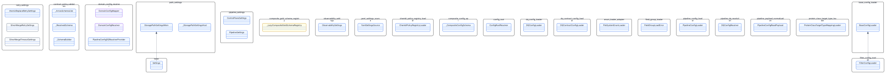

### Описание
Диаграмма «Package Family: infrastructure/config (Part 1/2)» показывает архитектурную модель модуля и фиксирует контракты, роли и отношения между сущностями слоя. Она представлена в формате диаграмма классов (class diagram) и служит ориентиром на уровне детализации «Package Family / Inventory Slice». В комментариях исходника зафиксирован фокус диаграммы: AST-derived supplemental package-family inventory slice for src/bioetl/infrastructure/config; part 1/2; modules: _retry_settings, contract_policy_validation, domain_config_resolver, _path_settings, _pipeline_settings, _base.. Схема имеет плотность порядка 30 узлов и 2 связей; её удобно использовать как обзорный архитектурный срез для проверки влияния изменений, согласования интерфейсов и подготовки рефакторинга, но не как исчерпывающий каталог текущей кодовой поверхности. Ключевые блоки/подграфы: retry settings, contract policy validation, domain config resolver, path settings, pipeline settings, base. Показательные узлы для быстрого чтения: AtomicReplaceRetrySettings, SilverMergeRetrySettings, SilverMergeTimeoutSettings, _ArrowSchemaLike, _ResolvedSchema, _SchemaBuilder. Примечание: Generated supplemental package-family slice used to keep node density within the class-diagram readability budget (<= 30)..

### Метаданные
- Тип: `classDiagram`
- Уровень: `Package Family / Inventory Slice`
- Дата: `2026-08-26`
- Узлы (metadata): `30`

\newpage

## 90-pkg-infrastructure-config-part2

**Package Family: infrastructure/config (Part 2/2)**

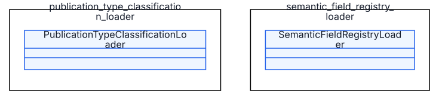

### Описание
Диаграмма «Package Family: infrastructure/config (Part 2/2)» показывает архитектурную модель модуля и фиксирует контракты, роли и отношения между сущностями слоя. Она представлена в формате диаграмма классов (class diagram) и служит ориентиром на уровне детализации «Package Family / Inventory Slice». В комментариях исходника зафиксирован фокус диаграммы: AST-derived supplemental package-family inventory slice for src/bioetl/infrastructure/config; part 2/2; modules: publication_controlled_vocabulary_loader, publication_type_classification_loader, semantic_field_registry_loader.. Схема имеет плотность порядка 3 узлов; её удобно использовать как обзорный архитектурный срез для проверки влияния изменений, согласования интерфейсов и подготовки рефакторинга, но не как исчерпывающий каталог текущей кодовой поверхности. Ключевые блоки/подграфы: publication controlled vocabulary loader, publication type classification loader, semantic field registry loader. Показательные узлы для быстрого чтения: PublicationControlledVocabularyLoader, PublicationTypeClassificationLoader, SemanticFieldRegistryLoader. Примечание: Generated supplemental package-family slice used to keep node density within the class-diagram readability budget (<= 30)..

### Метаданные
- Тип: `classDiagram`
- Уровень: `Package Family / Inventory Slice`
- Дата: `2026-08-26`
- Узлы (metadata): `3`

\newpage

## 90-pkg-infrastructure-control-plane-part1

**Package Family: infrastructure/control_plane (Part 1/2)**

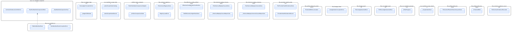

### Описание
Диаграмма «Package Family: infrastructure/control_plane (Part 1/2)» показывает архитектурную модель модуля и фиксирует контракты, роли и отношения между сущностями слоя. Она представлена в формате диаграмма классов (class diagram) и служит ориентиром на уровне детализации «Package Family / Inventory Slice». В комментариях исходника зафиксирован фокус диаграммы: AST-derived supplemental package-family inventory slice for src/bioetl/infrastructure/control_plane; part 1/2; modules: _raw_run_manifest_inspection, _file_run_ledger_helpers, _run_manifest_scope_index, artifact_byte_comparison, file_contract_registry_store, file_effective_config_artifact_store.. Схема имеет плотность порядка 30 узлов и 1 связей; её удобно использовать как обзорный архитектурный срез для проверки влияния изменений, согласования интерфейсов и подготовки рефакторинга, но не как исчерпывающий каталог текущей кодовой поверхности. Ключевые блоки/подграфы: raw run manifest inspection, file run ledger helpers, run manifest scope index, artifact byte comparison, file contract registry store, file effective config artifact store. Показательные узлы для быстрого чтения: ContractEvidenceConflictError, RawRunManifestInspectionMixin, _RawManifestInspectionHost, RunLedgerCorruptionError, _LedgerOSModule, LatestScopeIndexCatalog. Примечание: Generated supplemental package-family slice used to keep node density within the class-diagram readability budget (<= 30)..

### Метаданные
- Тип: `classDiagram`
- Уровень: `Package Family / Inventory Slice`
- Дата: `2026-08-26`
- Узлы (metadata): `30`

\newpage

## 90-pkg-infrastructure-control-plane-part2

**Package Family: infrastructure/control_plane (Part 2/2)**

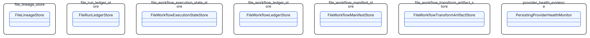

### Описание
Диаграмма «Package Family: infrastructure/control_plane (Part 2/2)» показывает архитектурную модель модуля и фиксирует контракты, роли и отношения между сущностями слоя. Она представлена в формате диаграмма классов (class diagram) и служит ориентиром на уровне детализации «Package Family / Inventory Slice». В комментариях исходника зафиксирован фокус диаграммы: AST-derived supplemental package-family inventory slice for src/bioetl/infrastructure/control_plane; part 2/2; modules: file_lineage_store, file_run_ledger_store, file_workflow_execution_state_store, file_workflow_ledger_store, file_workflow_manifest_store, file_workflow_transform_artifact_store.. Схема имеет плотность порядка 7 узлов; её удобно использовать как обзорный архитектурный срез для проверки влияния изменений, согласования интерфейсов и подготовки рефакторинга, но не как исчерпывающий каталог текущей кодовой поверхности. Ключевые блоки/подграфы: file lineage store, file run ledger store, file workflow execution state store, file workflow ledger store, file workflow manifest store, file workflow transform artifact store. Показательные узлы для быстрого чтения: FileLineageStore, FileRunLedgerStore, FileWorkflowExecutionStateStore, FileWorkflowLedgerStore, FileWorkflowManifestStore, FileWorkflowTransformArtifactStore. Примечание: Generated supplemental package-family slice used to keep node density within the class-diagram readability budget (<= 30)..

### Метаданные
- Тип: `classDiagram`
- Уровень: `Package Family / Inventory Slice`
- Дата: `2026-08-26`
- Узлы (metadata): `7`

\newpage

## 90-pkg-infrastructure-export

**Package Family: infrastructure/export**

### Описание
Диаграмма «Package Family: infrastructure/export» показывает архитектурную модель модуля и фиксирует контракты, роли и отношения между сущностями слоя. Она представлена в формате диаграмма классов (class diagram) и служит ориентиром на уровне детализации «Package Family / Inventory Slice». В комментариях исходника зафиксирован фокус диаграммы: AST-derived supplemental package-family inventory for src/bioetl/infrastructure/export; modules: csv_exporter, csv_exporter_contract, debug_export_adapter, dq_report_writer, export_catalog_adapter, export_writer_adapter.. Схема имеет плотность порядка 6 узлов; её удобно использовать как обзорный архитектурный срез для проверки влияния изменений, согласования интерфейсов и подготовки рефакторинга, но не как исчерпывающий каталог текущей кодовой поверхности. Ключевые блоки/подграфы: csv exporter, csv exporter contract, debug export adapter, dq report writer, export catalog adapter, export writer adapter. Показательные узлы для быстрого чтения: CsvExporter, CsvExporterProtocol, DebugExportAdapter, DQReportWriter, ExportCatalogAdapter, ExportWriterAdapter. Примечание: Generated supplemental package-family diagram. Curated class-summary remains narrative-only..

### Метаданные
- Тип: `classDiagram`
- Уровень: `Package Family / Inventory Slice`
- Дата: `2026-08-26`
- Узлы (metadata): `6`

\newpage

## 90-pkg-infrastructure-quality

**Package Family: infrastructure/quality**

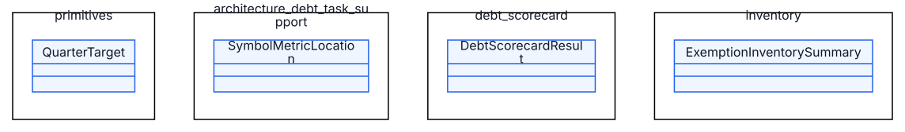

### Описание
Диаграмма «Package Family: infrastructure/quality» показывает архитектурную модель модуля и фиксирует контракты, роли и отношения между сущностями слоя. Она представлена в формате диаграмма классов (class diagram) и служит ориентиром на уровне детализации «Package Family / Inventory Slice». В комментариях исходника зафиксирован фокус диаграммы: AST-derived supplemental package-family inventory for src/bioetl/infrastructure/quality; modules: _primitives, architecture_debt_task_support, debt_scorecard, inventory.. Схема имеет плотность порядка 4 узлов; её удобно использовать как обзорный архитектурный срез для проверки влияния изменений, согласования интерфейсов и подготовки рефакторинга, но не как исчерпывающий каталог текущей кодовой поверхности. Ключевые блоки/подграфы: primitives, architecture debt task support, debt scorecard, inventory. Показательные узлы для быстрого чтения: QuarterTarget, SymbolMetricLocation, DebtScorecardResult, ExemptionInventorySummary. Примечание: Generated supplemental package-family diagram. Curated class-summary remains narrative-only..

### Метаданные
- Тип: `classDiagram`
- Уровень: `Package Family / Inventory Slice`
- Дата: `2026-08-26`
- Узлы (metadata): `4`

\newpage

## 90-pkg-infrastructure-quarantine

**Package Family: infrastructure/quarantine**

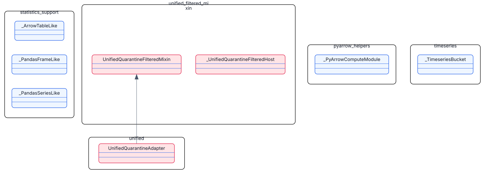

### Описание
Диаграмма «Package Family: infrastructure/quarantine» показывает архитектурную модель модуля и фиксирует контракты, роли и отношения между сущностями слоя. Она представлена в формате диаграмма классов (class diagram) и служит ориентиром на уровне детализации «Package Family / Inventory Slice». В комментариях исходника зафиксирован фокус диаграммы: AST-derived supplemental package-family inventory for src/bioetl/infrastructure/quarantine; modules: statistics_support, _unified_filtered_mixin, _pyarrow_helpers, _timeseries, unified.. Схема имеет плотность порядка 8 узлов и 1 связей; её удобно использовать как обзорный архитектурный срез для проверки влияния изменений, согласования интерфейсов и подготовки рефакторинга, но не как исчерпывающий каталог текущей кодовой поверхности. Ключевые блоки/подграфы: statistics support, unified filtered mixin, pyarrow helpers, timeseries, unified. Показательные узлы для быстрого чтения: _ArrowTableLike, _PandasFrameLike, _PandasSeriesLike, UnifiedQuarantineFilteredMixin, _UnifiedQuarantineFilteredHost, _PyArrowComputeModule. Примечание: Generated supplemental package-family diagram. Curated class-summary remains narrative-only..

### Метаданные
- Тип: `classDiagram`
- Уровень: `Package Family / Inventory Slice`
- Дата: `2026-08-26`
- Узлы (metadata): `8`

\newpage

## 90-pkg-infrastructure-schemas-part1

**Package Family: infrastructure/schemas (Part 1/4)**

### Описание
Диаграмма «Package Family: infrastructure/schemas (Part 1/4)» показывает архитектурную модель модуля и фиксирует контракты, роли и отношения между сущностями слоя. Она представлена в формате диаграмма классов (class diagram) и служит ориентиром на уровне детализации «Package Family / Inventory Slice». В комментариях исходника зафиксирован фокус диаграммы: AST-derived supplemental package-family inventory slice for src/bioetl/infrastructure/schemas; part 1/4; modules: pipeline_config_common_schemas, base_schemas_chembl.. Схема имеет плотность порядка 29 узлов и 2 связей; её удобно использовать как обзорный архитектурный срез для проверки влияния изменений, согласования интерфейсов и подготовки рефакторинга, но не как исчерпывающий каталог текущей кодовой поверхности. Ключевые блоки/подграфы: pipeline config common schemas, base schemas chembl. Показательные узлы для быстрого чтения: AuthoritativeContentHashPolicyConfig, AuthoritativeContentHashPolicyContractConfig, AuthoritativeContentHashPolicyNormalizationConfig, ContentHashConfig, FilterColumnSchema, GoldColumnFilterConfig. Примечание: Generated supplemental package-family slice used to keep node density within the class-diagram readability budget (<= 30)..

### Метаданные
- Тип: `classDiagram`
- Уровень: `Package Family / Inventory Slice`
- Дата: `2026-08-26`
- Узлы (metadata): `29`

\newpage

## 90-pkg-infrastructure-schemas-part2

**Package Family: infrastructure/schemas (Part 2/4)**

### Описание
Диаграмма «Package Family: infrastructure/schemas (Part 2/4)» показывает архитектурную модель модуля и фиксирует контракты, роли и отношения между сущностями слоя. Она представлена в формате диаграмма классов (class diagram) и служит ориентиром на уровне детализации «Package Family / Inventory Slice». В комментариях исходника зафиксирован фокус диаграммы: AST-derived supplemental package-family inventory slice for src/bioetl/infrastructure/schemas; part 2/4; modules: composite_validation, workflow_config, base_schemas_pubchem, pipeline_config_common.. Схема имеет плотность порядка 30 узлов; её удобно использовать как обзорный архитектурный срез для проверки влияния изменений, согласования интерфейсов и подготовки рефакторинга, но не как исчерпывающий каталог текущей кодовой поверхности. Ключевые блоки/подграфы: composite validation, workflow config, base schemas pubchem, pipeline config common. Показательные узлы для быстрого чтения: CompositeDQSchema, CrossValidationSchema, DQOverrideSchema, EnricherFieldPairingSchema, ExecutionSchema, FieldComparisonSpecSchema. Примечание: Generated supplemental package-family slice used to keep node density within the class-diagram readability budget (<= 30)..

### Метаданные
- Тип: `classDiagram`
- Уровень: `Package Family / Inventory Slice`
- Дата: `2026-08-26`
- Узлы (metadata): `30`

\newpage

## 90-pkg-infrastructure-schemas-part3

**Package Family: infrastructure/schemas (Part 3/4)**

### Описание
Диаграмма «Package Family: infrastructure/schemas (Part 3/4)» показывает архитектурную модель модуля и фиксирует контракты, роли и отношения между сущностями слоя. Она представлена в формате диаграмма классов (class diagram) и служит ориентиром на уровне детализации «Package Family / Inventory Slice». В комментариях исходника зафиксирован фокус диаграммы: AST-derived supplemental package-family inventory slice for src/bioetl/infrastructure/schemas; part 3/4; modules: dq_report_config, source_config, _composite_config_merge_schema, composite_config_base, filter_config, dq_config.. Схема имеет плотность порядка 29 узлов; её удобно использовать как обзорный архитектурный срез для проверки влияния изменений, согласования интерфейсов и подготовки рефакторинга, но не как исчерпывающий каталог текущей кодовой поверхности. Ключевые блоки/подграфы: dq report config, source config, composite config merge schema, composite config base, filter config, dq config. Показательные узлы для быстрого чтения: BronzeDQReportConfig, BronzeSinkConfig, GoldDQReportConfig, GoldSinkConfig, SilverDQReportConfig, SilverSinkConfig. Примечание: Generated supplemental package-family slice used to keep node density within the class-diagram readability budget (<= 30)..

### Метаданные
- Тип: `classDiagram`
- Уровень: `Package Family / Inventory Slice`
- Дата: `2026-08-26`
- Узлы (metadata): `29`

\newpage

## 90-pkg-infrastructure-schemas-part4

**Package Family: infrastructure/schemas (Part 4/4)**

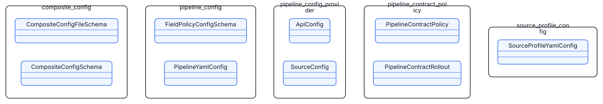

### Описание
Диаграмма «Package Family: infrastructure/schemas (Part 4/4)» показывает архитектурную модель модуля и фиксирует контракты, роли и отношения между сущностями слоя. Она представлена в формате диаграмма классов (class diagram) и служит ориентиром на уровне детализации «Package Family / Inventory Slice». В комментариях исходника зафиксирован фокус диаграммы: AST-derived supplemental package-family inventory slice for src/bioetl/infrastructure/schemas; part 4/4; modules: composite_config, pipeline_config, pipeline_config_provider, pipeline_contract_policy, source_profile_config.. Схема имеет плотность порядка 9 узлов; её удобно использовать как обзорный архитектурный срез для проверки влияния изменений, согласования интерфейсов и подготовки рефакторинга, но не как исчерпывающий каталог текущей кодовой поверхности. Ключевые блоки/подграфы: composite config, pipeline config, pipeline config provider, pipeline contract policy, source profile config. Показательные узлы для быстрого чтения: CompositeConfigFileSchema, CompositeConfigSchema, FieldPolicyConfigSchema, PipelineYamlConfig, ApiConfig, SourceConfig. Примечание: Generated supplemental package-family slice used to keep node density within the class-diagram readability budget (<= 30)..

### Метаданные
- Тип: `classDiagram`
- Уровень: `Package Family / Inventory Slice`
- Дата: `2026-08-26`
- Узлы (metadata): `9`

\newpage

## 90-pkg-infrastructure-storage-bronze

**Package Family: infrastructure/storage/bronze**

### Описание
Диаграмма «Package Family: infrastructure/storage/bronze» показывает архитектурную модель модуля и фиксирует контракты, роли и отношения между сущностями слоя. Она представлена в формате диаграмма классов (class diagram) и служит ориентиром на уровне детализации «Package Family / Inventory Slice». В комментариях исходника зафиксирован фокус диаграммы: AST-derived supplemental package-family inventory for src/bioetl/infrastructure/storage/bronze; modules: pipeline_helpers, metadata_operations, metadata_builders, metrics_mixin, reporting_helpers, facade_contracts.. Схема имеет плотность порядка 22 узлов и 1 связей; её удобно использовать как обзорный архитектурный срез для проверки влияния изменений, согласования интерфейсов и подготовки рефакторинга, но не как исчерпывающий каталог текущей кодовой поверхности. Ключевые блоки/подграфы: pipeline helpers, metadata operations, metadata builders, metrics mixin, reporting helpers, facade contracts. Показательные узлы для быстрого чтения: BronzeWriteArtifacts, BronzeWritePostwriteContext, BronzeWritePrepared, BronzeWriteRequest, _BronzeWritePreparationHostProtocol, BronzeMetadataWriteRequest. Примечание: Generated supplemental package-family diagram. Curated class-summary remains narrative-only..

### Метаданные
- Тип: `classDiagram`
- Уровень: `Package Family / Inventory Slice`
- Дата: `2026-08-26`
- Узлы (metadata): `22`

\newpage

## 90-pkg-infrastructure-storage-delta

**Package Family: infrastructure/storage/delta**

### Описание
Диаграмма «Package Family: infrastructure/storage/delta» показывает архитектурную модель модуля и фиксирует контракты, роли и отношения между сущностями слоя. Она представлена в формате диаграмма классов (class diagram) и служит ориентиром на уровне детализации «Package Family / Inventory Slice». В комментариях исходника зафиксирован фокус диаграммы: AST-derived supplemental package-family inventory for src/bioetl/infrastructure/storage/delta; modules: arrow_converter, resilience.. Схема имеет плотность порядка 4 узлов; её удобно использовать как обзорный архитектурный срез для проверки влияния изменений, согласования интерфейсов и подготовки рефакторинга, но не как исчерпывающий каталог текущей кодовой поверхности. Ключевые блоки/подграфы: arrow converter, resilience. Показательные узлы для быстрого чтения: ArrowDataConverter, ArrowSchemaPreparationContext, AdaptiveRetryPolicy, SilverMergeResiliencePolicy. Примечание: Generated supplemental package-family diagram. Curated class-summary remains narrative-only..

### Метаданные
- Тип: `classDiagram`
- Уровень: `Package Family / Inventory Slice`
- Дата: `2026-08-26`
- Узлы (metadata): `4`

\newpage

## 90-pkg-infrastructure-storage-gold-part1

**Package Family: infrastructure/storage/gold (Part 1/2)**

### Описание
Диаграмма «Package Family: infrastructure/storage/gold (Part 1/2)» показывает архитектурную модель модуля и фиксирует контракты, роли и отношения между сущностями слоя. Она представлена в формате диаграмма классов (class diagram) и служит ориентиром на уровне детализации «Package Family / Inventory Slice». В комментариях исходника зафиксирован фокус диаграммы: AST-derived supplemental package-family inventory slice for src/bioetl/infrastructure/storage/gold; part 1/2; modules: pipeline_helpers, io_delta_protocols, metadata_operations, io_delta_mixins, io_delta_runtime, io_protocols.. Схема имеет плотность порядка 30 узлов и 8 связей; её удобно использовать как обзорный архитектурный срез для проверки влияния изменений, согласования интерфейсов и подготовки рефакторинга, но не как исчерпывающий каталог текущей кодовой поверхности. Ключевые блоки/подграфы: pipeline helpers, io delta protocols, metadata operations, io delta mixins, io delta runtime, io protocols. Показательные узлы для быстрого чтения: GoldWriteDispatchContext, GoldWritePostwriteContext, GoldWriteRequest, PreparedGoldWriteContext, _GoldWritePostwriteHostProtocol, _GoldWritePreparationHostProtocol. Примечание: Generated supplemental package-family slice used to keep node density within the class-diagram readability budget (<= 30)..

### Метаданные
- Тип: `classDiagram`
- Уровень: `Package Family / Inventory Slice`
- Дата: `2026-08-26`
- Узлы (metadata): `30`

\newpage

## 90-pkg-infrastructure-storage-gold-part2

**Package Family: infrastructure/storage/gold (Part 2/2)**

### Описание
Диаграмма «Package Family: infrastructure/storage/gold (Part 2/2)» показывает архитектурную модель модуля и фиксирует контракты, роли и отношения между сущностями слоя. Она представлена в формате диаграмма классов (class diagram) и служит ориентиром на уровне детализации «Package Family / Inventory Slice». В комментариях исходника зафиксирован фокус диаграммы: AST-derived supplemental package-family inventory slice for src/bioetl/infrastructure/storage/gold; part 2/2; modules: io_preparation, metadata_audit, validation_mixin, io_helpers, metadata_mixin, read_cleanup_mixin.. Схема имеет плотность порядка 10 узлов; её удобно использовать как обзорный архитектурный срез для проверки влияния изменений, согласования интерфейсов и подготовки рефакторинга, но не как исчерпывающий каталог текущей кодовой поверхности. Ключевые блоки/подграфы: io preparation, metadata audit, validation mixin, io helpers, metadata mixin, read cleanup mixin. Показательные узлы для быстрого чтения: _GoldMergedWriteRequest, _PreparedGoldMergedWrite, _GoldAuditWriteRequest, _GoldMetadataAuditHostProtocol, GoldWriterValidationMixin, _RunInExecutorHost. Примечание: Generated supplemental package-family slice used to keep node density within the class-diagram readability budget (<= 30)..

### Метаданные
- Тип: `classDiagram`
- Уровень: `Package Family / Inventory Slice`
- Дата: `2026-08-26`
- Узлы (metadata): `10`

\newpage

## 90-pkg-infrastructure-storage-metadata

**Package Family: infrastructure/storage/metadata**

### Описание
Диаграмма «Package Family: infrastructure/storage/metadata» показывает архитектурную модель модуля и фиксирует контракты, роли и отношения между сущностями слоя. Она представлена в формате диаграмма классов (class diagram) и служит ориентиром на уровне детализации «Package Family / Inventory Slice». В комментариях исходника зафиксирован фокус диаграммы: AST-derived supplemental package-family inventory for src/bioetl/infrastructure/storage/metadata; modules: writer_operations, builder_base.. Схема имеет плотность порядка 8 узлов; её удобно использовать как обзорный архитектурный срез для проверки влияния изменений, согласования интерфейсов и подготовки рефакторинга, но не как исчерпывающий каталог текущей кодовой поверхности. Ключевые блоки/подграфы: writer operations, builder base. Показательные узлы для быстрого чтения: _MetadataWriteFinalTelemetry, _MetadataWriteRequest, _MetadataWriteRetryState, _MetadataWriteTelemetryContext, _PreparedMetadataWrite, _PreparedMetadataWriteOperation. Примечание: Generated supplemental package-family diagram. Curated class-summary remains narrative-only..

### Метаданные
- Тип: `classDiagram`
- Уровень: `Package Family / Inventory Slice`
- Дата: `2026-08-26`
- Узлы (metadata): `8`

\newpage

## 90-pkg-infrastructure-storage-silver-operations-part1

**Package Family: infrastructure/storage/silver/operations (Part 1/2)**

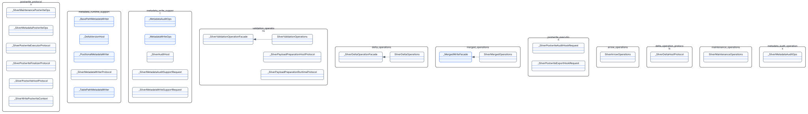

### Описание
Диаграмма «Package Family: infrastructure/storage/silver/operations (Part 1/2)» показывает архитектурную модель модуля и фиксирует контракты, роли и отношения между сущностями слоя. Она представлена в формате диаграмма классов (class diagram) и служит ориентиром на уровне детализации «Package Family / Inventory Slice». В комментариях исходника зафиксирован фокус диаграммы: AST-derived supplemental package-family inventory slice for src/bioetl/infrastructure/storage/silver/operations; part 1/2; modules: postwrite_protocols, metadata_runtime_support, metadata_write_support, validation_operations, delta_operations, merged_operations.. Схема имеет плотность порядка 30 узлов и 3 связей; её удобно использовать как обзорный архитектурный срез для проверки влияния изменений, согласования интерфейсов и подготовки рефакторинга, но не как исчерпывающий каталог текущей кодовой поверхности. Ключевые блоки/подграфы: postwrite protocols, metadata runtime support, metadata write support, validation operations, delta operations, merged operations. Показательные узлы для быстрого чтения: _SilverMaintenancePostwriteOps, _SilverMetadataPostwriteOps, _SilverPostwriteExecutorProtocol, _SilverPostwriteFinalizerProtocol, _SilverPostwriteHostProtocol, _SilverWritePostwriteContext. Примечание: Generated supplemental package-family slice used to keep node density within the class-diagram readability budget (<= 30)..

### Метаданные
- Тип: `classDiagram`
- Уровень: `Package Family / Inventory Slice`
- Дата: `2026-08-26`
- Узлы (metadata): `30`

\newpage

## 90-pkg-infrastructure-storage-silver-operations-part2

**Package Family: infrastructure/storage/silver/operations (Part 2/2)**

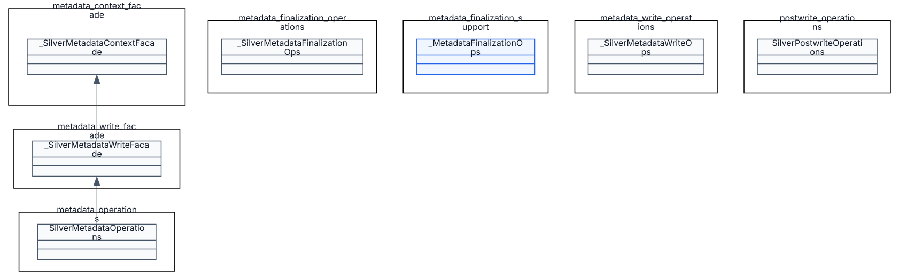

### Описание
Диаграмма «Package Family: infrastructure/storage/silver/operations (Part 2/2)» показывает архитектурную модель модуля и фиксирует контракты, роли и отношения между сущностями слоя. Она представлена в формате диаграмма классов (class diagram) и служит ориентиром на уровне детализации «Package Family / Inventory Slice». В комментариях исходника зафиксирован фокус диаграммы: AST-derived supplemental package-family inventory slice for src/bioetl/infrastructure/storage/silver/operations; part 2/2; modules: metadata_context_facade, metadata_finalization_operations, metadata_finalization_support, metadata_operations, metadata_write_facade, metadata_write_operations.. Схема имеет плотность порядка 7 узлов и 2 связей; её удобно использовать как обзорный архитектурный срез для проверки влияния изменений, согласования интерфейсов и подготовки рефакторинга, но не как исчерпывающий каталог текущей кодовой поверхности. Ключевые блоки/подграфы: metadata context facade, metadata finalization operations, metadata finalization support, metadata operations, metadata write facade, metadata write operations. Показательные узлы для быстрого чтения: _SilverMetadataContextFacade, _SilverMetadataFinalizationOps, _MetadataFinalizationOps, SilverMetadataOperations, _SilverMetadataWriteFacade, _SilverMetadataWriteOps. Примечание: Generated supplemental package-family slice used to keep node density within the class-diagram readability budget (<= 30)..

### Метаданные
- Тип: `classDiagram`
- Уровень: `Package Family / Inventory Slice`
- Дата: `2026-08-26`
- Узлы (metadata): `7`

\newpage

## 90-pkg-infrastructure-storage-silver-part1

**Package Family: infrastructure/storage/silver (Part 1/2)**

### Описание
Диаграмма «Package Family: infrastructure/storage/silver (Part 1/2)» показывает архитектурную модель модуля и фиксирует контракты, роли и отношения между сущностями слоя. Она представлена в формате диаграмма классов (class diagram) и служит ориентиром на уровне детализации «Package Family / Inventory Slice». В комментариях исходника зафиксирован фокус диаграммы: AST-derived supplemental package-family inventory slice for src/bioetl/infrastructure/storage/silver; part 1/2; modules: pipeline_helpers, merged_operations, validation_operations, prepared_operation_models, audit_operations, delta_merge_helpers.. Схема имеет плотность порядка 30 узлов и 1 связей; её удобно использовать как обзорный архитектурный срез для проверки влияния изменений, согласования интерфейсов и подготовки рефакторинга, но не как исчерпывающий каталог текущей кодовой поверхности. Ключевые блоки/подграфы: pipeline helpers, merged operations, validation operations, prepared operation models, audit operations, delta merge helpers. Показательные узлы для быстрого чтения: _PreparedSilverWriteDispatcher, _PreparedSilverWritePayloadBuilder, _SilverWriteExecutionContext, _SilverWriteInvocation, _SilverWritePipelineCompleter, _SilverWritePipelineRunner. Примечание: Generated supplemental package-family slice used to keep node density within the class-diagram readability budget (<= 30)..

### Метаданные
- Тип: `classDiagram`
- Уровень: `Package Family / Inventory Slice`
- Дата: `2026-08-26`
- Узлы (metadata): `30`

\newpage

## 90-pkg-infrastructure-storage-silver-part2

**Package Family: infrastructure/storage/silver (Part 2/2)**

### Описание
Диаграмма «Package Family: infrastructure/storage/silver (Part 2/2)» показывает архитектурную модель модуля и фиксирует контракты, роли и отношения между сущностями слоя. Она представлена в формате диаграмма классов (class diagram) и служит ориентиром на уровне детализации «Package Family / Inventory Slice». В комментариях исходника зафиксирован фокус диаграммы: AST-derived supplemental package-family inventory slice for src/bioetl/infrastructure/storage/silver; part 2/2; modules: postwrite_mixin, runtime_helpers, schema_drift_operations, delta_mixin, delta_write_execution, maintenance_mixin.. Схема имеет плотность порядка 19 узлов и 2 связей; её удобно использовать как обзорный архитектурный срез для проверки влияния изменений, согласования интерфейсов и подготовки рефакторинга, но не как исчерпывающий каталог текущей кодовой поверхности. Ключевые блоки/подграфы: postwrite mixin, runtime helpers, schema drift operations, delta mixin, delta write execution, maintenance mixin. Показательные узлы для быстрого чтения: SilverWriterPostwriteMixin, _SilverWriterPostwriteSelf, SilverWriterRuntimeServices, SilverWriterRuntimeServicesRequest, _SchemaDriftHostProtocol, _SilverSchemaDriftDiff. Примечание: Generated supplemental package-family slice used to keep node density within the class-diagram readability budget (<= 30)..

### Метаданные
- Тип: `classDiagram`
- Уровень: `Package Family / Inventory Slice`
- Дата: `2026-08-26`
- Узлы (metadata): `19`

\newpage

## 90-pkg-infrastructure-storage-support

**Package Family: infrastructure/storage/support**

### Описание
Диаграмма «Package Family: infrastructure/storage/support» показывает архитектурную модель модуля и фиксирует контракты, роли и отношения между сущностями слоя. Она представлена в формате диаграмма классов (class diagram) и служит ориентиром на уровне детализации «Package Family / Inventory Slice». В комментариях исходника зафиксирован фокус диаграммы: AST-derived supplemental package-family inventory for src/bioetl/infrastructure/storage/support; modules: checkpoint_writer, _atomic_replace, atomic_group, retention.. Схема имеет плотность порядка 6 узлов; её удобно использовать как обзорный архитектурный срез для проверки влияния изменений, согласования интерфейсов и подготовки рефакторинга, но не как исчерпывающий каталог текущей кодовой поверхности. Ключевые блоки/подграфы: checkpoint writer, atomic replace, atomic group, retention. Показательные узлы для быстрого чтения: CheckpointPathError, CheckpointSizeError, FileCompositeCheckpointWriter, AtomicWriteError, AtomicWriteGroup, RetentionPolicy. Примечание: Generated supplemental package-family diagram. Curated class-summary remains narrative-only..

### Метаданные
- Тип: `classDiagram`
- Уровень: `Package Family / Inventory Slice`
- Дата: `2026-08-26`
- Узлы (metadata): `6`

\newpage

## 90-pkg-infrastructure-validation

**Package Family: infrastructure/validation**

### Описание
Диаграмма «Package Family: infrastructure/validation» показывает архитектурную модель модуля и фиксирует контракты, роли и отношения между сущностями слоя. Она представлена в формате диаграмма классов (class diagram) и служит ориентиром на уровне детализации «Package Family / Inventory Slice». В комментариях исходника зафиксирован фокус диаграммы: AST-derived supplemental package-family inventory for src/bioetl/infrastructure/validation; modules: pandera_validator, contract_validator.. Схема имеет плотность порядка 6 узлов и 4 связей; её удобно использовать как обзорный архитектурный срез для проверки влияния изменений, согласования интерфейсов и подготовки рефакторинга, но не как исчерпывающий каталог текущей кодовой поверхности. Ключевые блоки/подграфы: pandera validator, contract validator. Показательные узлы для быстрого чтения: BasePanderaValidator, NoOpValidator, PanderaGoldValidator, PanderaSilverValidator, ContractAwareGoldValidator, ContractAwareSilverValidator. Примечание: Generated supplemental package-family diagram. Curated class-summary remains narrative-only..

### Метаданные
- Тип: `classDiagram`
- Уровень: `Package Family / Inventory Slice`
- Дата: `2026-08-26`
- Узлы (metadata): `6`

\newpage

## 90-pkg-interfaces-cli-commands-domains-health

**Package Family: interfaces/cli/commands/domains/health**

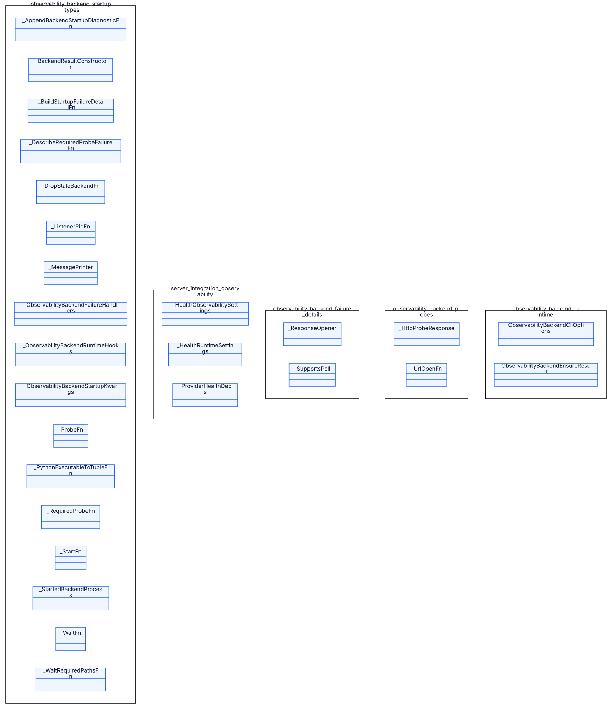

### Описание
Диаграмма «Package Family: interfaces/cli/commands/domains/health» показывает архитектурную модель модуля и фиксирует контракты, роли и отношения между сущностями слоя. Она представлена в формате диаграмма классов (class diagram) и служит ориентиром на уровне детализации «Package Family / Inventory Slice». В комментариях исходника зафиксирован фокус диаграммы: AST-derived supplemental package-family inventory for src/bioetl/interfaces/cli/commands/domains/health; modules: _observability_backend_startup_types, server_integration_observability, observability_backend_failure_details, observability_backend_probes, observability_backend_runtime.. Схема имеет плотность порядка 26 узлов; её удобно использовать как обзорный архитектурный срез для проверки влияния изменений, согласования интерфейсов и подготовки рефакторинга, но не как исчерпывающий каталог текущей кодовой поверхности. Ключевые блоки/подграфы: observability backend startup types, server integration observability, observability backend failure details, observability backend probes, observability backend runtime. Показательные узлы для быстрого чтения: _AppendBackendStartupDiagnosticFn, _BackendResultConstructor, _BuildStartupFailureDetailFn, _DescribeRequiredProbeFailureFn, _DropStaleBackendFn, _ListenerPidFn. Примечание: Generated supplemental package-family diagram. Curated class-summary remains narrative-only..

### Метаданные
- Тип: `classDiagram`
- Уровень: `Package Family / Inventory Slice`
- Дата: `2026-08-26`
- Узлы (metadata): `26`

\newpage

## 90-pkg-interfaces-cli-commands-domains-quarantine

**Package Family: interfaces/cli/commands/domains/quarantine**

### Описание
Диаграмма «Package Family: interfaces/cli/commands/domains/quarantine» показывает архитектурную модель модуля и фиксирует контракты, роли и отношения между сущностями слоя. Она представлена в формате диаграмма классов (class diagram) и служит ориентиром на уровне детализации «Package Family / Inventory Slice». В комментариях исходника зафиксирован фокус диаграммы: AST-derived supplemental package-family inventory for src/bioetl/interfaces/cli/commands/domains/quarantine; modules: support, _run_scope_stats, execution.. Схема имеет плотность порядка 6 узлов; её удобно использовать как обзорный архитектурный срез для проверки влияния изменений, согласования интерфейсов и подготовки рефакторинга, но не как исчерпывающий каталог текущей кодовой поверхности. Ключевые блоки/подграфы: support, run scope stats, execution. Показательные узлы для быстрого чтения: _QuarantineCommandContext, _QuarantineRuntimeService, _QuarantineService, RunManifestInspectionResultProtocol, RunManifestInspectionServiceProtocol, QuarantineExecutionPolicy. Примечание: Generated supplemental package-family diagram. Curated class-summary remains narrative-only..

### Метаданные
- Тип: `classDiagram`
- Уровень: `Package Family / Inventory Slice`
- Дата: `2026-08-26`
- Узлы (metadata): `6`

\newpage

## 90-pkg-interfaces-cli-commands-domains-run-all

**Package Family: interfaces/cli/commands/domains/run_all**

### Описание
Диаграмма «Package Family: interfaces/cli/commands/domains/run_all» показывает архитектурную модель модуля и фиксирует контракты, роли и отношения между сущностями слоя. Она представлена в формате диаграмма классов (class diagram) и служит ориентиром на уровне детализации «Package Family / Inventory Slice». В комментариях исходника зафиксирован фокус диаграммы: AST-derived supplemental package-family inventory for src/bioetl/interfaces/cli/commands/domains/run_all; modules: command_policy, public_runtime_deps, support, execution, command_entrypoint.. Схема имеет плотность порядка 21 узлов; её удобно использовать как обзорный архитектурный срез для проверки влияния изменений, согласования интерфейсов и подготовки рефакторинга, но не как исчерпывающий каталог текущей кодовой поверхности. Ключевые блоки/подграфы: command policy, public runtime deps, support, execution, command entrypoint. Показательные узлы для быстрого чтения: BatchExecutorCallable, BatchExitCodeCallable, BatchSummaryPresenterCallable, DestructiveConfirmationCallable, ExitCallable, HealthInfoPresenterCallable. Примечание: Generated supplemental package-family diagram. Curated class-summary remains narrative-only..

### Метаданные
- Тип: `classDiagram`
- Уровень: `Package Family / Inventory Slice`
- Дата: `2026-08-26`
- Узлы (metadata): `21`

\newpage

## 90-pkg-interfaces-cli-commands-domains-run

**Package Family: interfaces/cli/commands/domains/run**

### Описание
Диаграмма «Package Family: interfaces/cli/commands/domains/run» показывает архитектурную модель модуля и фиксирует контракты, роли и отношения между сущностями слоя. Она представлена в формате диаграмма классов (class diagram) и служит ориентиром на уровне детализации «Package Family / Inventory Slice». В комментариях исходника зафиксирован фокус диаграммы: AST-derived supplemental package-family inventory for src/bioetl/interfaces/cli/commands/domains/run; modules: command_policy, command_entrypoint, runtime_helpers.. Схема имеет плотность порядка 8 узлов; её удобно использовать как обзорный архитектурный срез для проверки влияния изменений, согласования интерфейсов и подготовки рефакторинга, но не как исчерпывающий каталог текущей кодовой поверхности. Ключевые блоки/подграфы: command policy, command entrypoint, runtime helpers. Показательные узлы для быстрого чтения: ExitCallable, HealthInfoPresenterCallable, ResultFinalizerCallable, ResultPresenterCallable, RunCommandInput, RunExecutorCallable. Примечание: Generated supplemental package-family diagram. Curated class-summary remains narrative-only..

### Метаданные
- Тип: `classDiagram`
- Уровень: `Package Family / Inventory Slice`
- Дата: `2026-08-26`
- Узлы (metadata): `8`

\newpage

## 90-pkg-interfaces-cli-commands-domains-shared

**Package Family: interfaces/cli/commands/domains/shared**

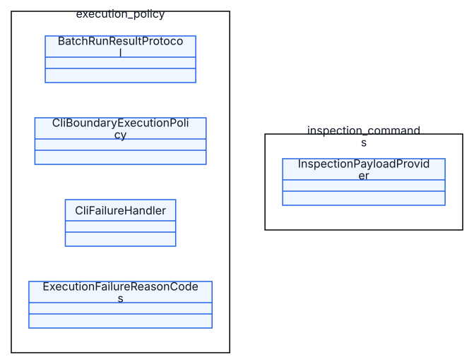

### Описание
Диаграмма «Package Family: interfaces/cli/commands/domains/shared» показывает архитектурную модель модуля и фиксирует контракты, роли и отношения между сущностями слоя. Она представлена в формате диаграмма классов (class diagram) и служит ориентиром на уровне детализации «Package Family / Inventory Slice». В комментариях исходника зафиксирован фокус диаграммы: AST-derived supplemental package-family inventory for src/bioetl/interfaces/cli/commands/domains/shared; modules: execution_policy, inspection_commands.. Схема имеет плотность порядка 5 узлов; её удобно использовать как обзорный архитектурный срез для проверки влияния изменений, согласования интерфейсов и подготовки рефакторинга, но не как исчерпывающий каталог текущей кодовой поверхности. Ключевые блоки/подграфы: execution policy, inspection commands. Показательные узлы для быстрого чтения: BatchRunResultProtocol, CliBoundaryExecutionPolicy, CliFailureHandler, ExecutionFailureReasonCodes, InspectionPayloadProvider. Примечание: Generated supplemental package-family diagram. Curated class-summary remains narrative-only..

### Метаданные
- Тип: `classDiagram`
- Уровень: `Package Family / Inventory Slice`
- Дата: `2026-08-26`
- Узлы (metadata): `5`

\newpage

## 90-pkg-interfaces-cli-commands

**Package Family: interfaces/cli/commands**

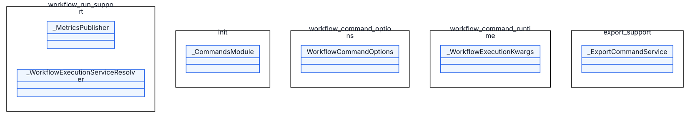

### Описание
Диаграмма «Package Family: interfaces/cli/commands» показывает архитектурную модель модуля и фиксирует контракты, роли и отношения между сущностями слоя. Она представлена в формате диаграмма классов (class diagram) и служит ориентиром на уровне детализации «Package Family / Inventory Slice». В комментариях исходника зафиксирован фокус диаграммы: AST-derived supplemental package-family inventory for src/bioetl/interfaces/cli/commands; modules: _workflow_run_support, __init__, _workflow_command_options, _workflow_command_runtime, export_support.. Схема имеет плотность порядка 6 узлов; её удобно использовать как обзорный архитектурный срез для проверки влияния изменений, согласования интерфейсов и подготовки рефакторинга, но не как исчерпывающий каталог текущей кодовой поверхности. Ключевые блоки/подграфы: workflow run support, init, workflow command options, workflow command runtime, export support. Показательные узлы для быстрого чтения: _MetricsPublisher, _WorkflowExecutionServiceResolver, _CommandsModule, WorkflowCommandOptions, _WorkflowExecutionKwargs, _ExportCommandService. Примечание: Generated supplemental package-family diagram. Curated class-summary remains narrative-only..

### Метаданные
- Тип: `classDiagram`
- Уровень: `Package Family / Inventory Slice`
- Дата: `2026-08-26`
- Узлы (metadata): `6`

\newpage

## 90-pkg-interfaces-http-control-plane-identity

**Package Family: interfaces/http/control_plane_identity**

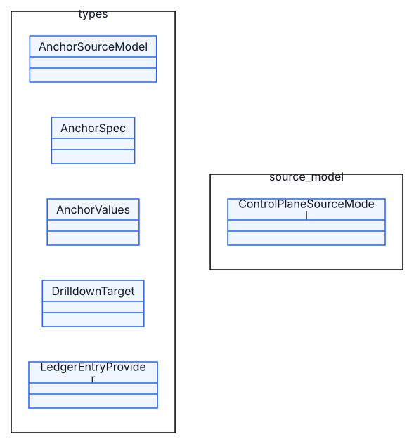

### Описание
Диаграмма «Package Family: interfaces/http/control_plane_identity» показывает архитектурную модель модуля и фиксирует контракты, роли и отношения между сущностями слоя. Она представлена в формате диаграмма классов (class diagram) и служит ориентиром на уровне детализации «Package Family / Inventory Slice». В комментариях исходника зафиксирован фокус диаграммы: AST-derived supplemental package-family inventory for src/bioetl/interfaces/http/control_plane_identity; modules: types, source_model.. Схема имеет плотность порядка 6 узлов; её удобно использовать как обзорный архитектурный срез для проверки влияния изменений, согласования интерфейсов и подготовки рефакторинга, но не как исчерпывающий каталог текущей кодовой поверхности. Ключевые блоки/подграфы: types, source model. Показательные узлы для быстрого чтения: AnchorSourceModel, AnchorSpec, AnchorValues, DrilldownTarget, LedgerEntryProvider, ControlPlaneSourceModel. Примечание: Generated supplemental package-family diagram. Curated class-summary remains narrative-only..

### Метаданные
- Тип: `classDiagram`
- Уровень: `Package Family / Inventory Slice`
- Дата: `2026-08-26`
- Узлы (metadata): `6`

\newpage

## 90-pkg-interfaces-http-part1

**Package Family: interfaces/http (Part 1/2)**

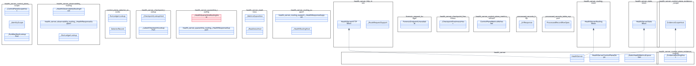

### Описание
Диаграмма «Package Family: interfaces/http (Part 1/2)» показывает архитектурную модель модуля и фиксирует контракты, роли и отношения между сущностями слоя. Она представлена в формате диаграмма классов (class diagram) и служит ориентиром на уровне детализации «Package Family / Inventory Slice». В комментариях исходника зафиксирован фокус диаграммы: AST-derived supplemental package-family inventory slice for src/bioetl/interfaces/http; part 1/2; modules: _health_server_control_plane_scope, _health_server_observability_routing, health_server, _control_plane_selector_records, _health_server_checkpoint_lookup, _health_server_quarantine_routing.. Схема имеет плотность порядка 30 узлов и 4 связей; её удобно использовать как обзорный архитектурный срез для проверки влияния изменений, согласования интерфейсов и подготовки рефакторинга, но не как исчерпывающий каталог текущей кодовой поверхности. Ключевые блоки/подграфы: health server control plane scope, health server observability routing, health server, control plane selector records, health server checkpoint lookup, health server quarantine routing. Показательные узлы для быстрого чтения: _ControlPlaneScopeHost, _IdentityScope, _RunManifestLookupPort, _HealthObservabilityRoutingHost, health_server_observability_routing__HealthResponseSupport, _RunLedgerLookup. Примечание: Generated supplemental package-family slice used to keep node density within the class-diagram readability budget (<= 30)..

### Метаданные
- Тип: `classDiagram`
- Уровень: `Package Family / Inventory Slice`
- Дата: `2026-08-26`
- Узлы (metadata): `30`

\newpage

## 90-pkg-interfaces-http-part2

**Package Family: interfaces/http (Part 2/2)**

### Описание
Диаграмма «Package Family: interfaces/http (Part 2/2)» показывает архитектурную модель модуля и фиксирует контракты, роли и отношения между сущностями слоя. Она представлена в формате диаграмма классов (class diagram) и служит ориентиром на уровне детализации «Package Family / Inventory Slice». В комментариях исходника зафиксирован фокус диаграммы: AST-derived supplemental package-family inventory slice for src/bioetl/interfaces/http; part 2/2; modules: types.. Схема имеет плотность порядка 1 узлов; её удобно использовать как обзорный архитектурный срез для проверки влияния изменений, согласования интерфейсов и подготовки рефакторинга, но не как исчерпывающий каталог текущей кодовой поверхности. Ключевые блоки/подграфы: types. Показательные узлы для быстрого чтения: HealthResponse. Примечание: Generated supplemental package-family slice used to keep node density within the class-diagram readability budget (<= 30)..

### Метаданные
- Тип: `classDiagram`
- Уровень: `Package Family / Inventory Slice`
- Дата: `2026-08-26`
- Узлы (metadata): `1`
