# BioETL Views Diagrams Bundle

- Generated: 2026-07-06T11:30:20
- Diagram count: 165

## Table of Contents

- [00-legend — 00 Legend](#00-legend)
- [01-full-system-component — Full System Component Diagram](#01-full-system-component-full) — 5 views: data-flow, domain-focus, full, infrastructure-mapping, overview
- [01-high-level — High-Level System Architecture](#01-high-level-full) — 5 views: data-flow, domain-focus, full, infrastructure-mapping, overview
- [02-medallion — Medallion Architecture Layers](#02-medallion-full) — 5 views: data-flow, domain-focus, full, infrastructure-mapping, overview
- [03-medallion-data-flow — 03 Medallion Data Flow](#03-medallion-data-flow-full) — 2 views: full, overview
- [04-domain-layer-class-diagram — Domain Layer Class Diagram](#04-domain-layer-class-diagram-full) — 5 views: data-flow, domain-focus, full, infrastructure-mapping, overview
- [05-layers-interaction — Layer Interaction — Hexagonal Runtime Topology](#05-layers-interaction-full) — 5 views: dataflow, domain, full, infra, overview
- [05-pipeline-lifecycle-states — Pipeline Lifecycle State Machine](#05-pipeline-lifecycle-states-full) — 5 views: data-flow, domain-focus, full, infrastructure-mapping, overview
- [06-application-layer-class-diagram — Application Layer Class Diagram](#06-application-layer-class-diagram-full) — 5 views: data-flow, domain-focus, full, infrastructure-mapping, overview
- [07-circuit-breaker-states — Circuit Breaker State Machine](#07-circuit-breaker-states-full) — 5 views: data-flow, domain-focus, full, infrastructure-mapping, overview
- [08-complete-etl-workflow — Complete ETL Workflow (6 Phases)](#08-complete-etl-workflow-full) — 5 views: dataflow, domain, full, infra, overview
- [08-domain-ddd — Domain Layer — DDD Components](#08-domain-ddd-full) — 5 views: data-flow, domain-focus, full, infrastructure-mapping, overview
- [10-infrastructure-layer-class-diagram — Infrastructure Layer Class Diagram](#10-infrastructure-layer-class-diagram-full) — 5 views: data-flow, domain-focus, full, infrastructure-mapping, overview
- [12-local-deployment-architecture — Local Deployment Architecture](#12-local-deployment-architecture-full) — 5 views: data-flow, domain-focus, full, infrastructure-mapping, overview
- [13-port-protocol-contracts — 13 Port Protocol Contracts](#13-port-protocol-contracts-full) — 2 views: full, overview
- [14-provider-health-states — Provider Health State Machine](#14-provider-health-states-full) — 5 views: data-flow, domain-focus, full, infrastructure-mapping, overview
- [15-dq-check-workflow — Data Quality Check Workflow](#15-dq-check-workflow-full) — 5 views: data-flow, domain-focus, full, infrastructure-mapping, overview
- [16-transformer-hierarchy — 16 Transformer Hierarchy](#16-transformer-hierarchy-full) — 2 views: full, overview
- [21-activity-entity-data-flow — Activity Entity Data Flow (Extract → Transform → Load)](#21-activity-entity-data-flow-full) — 5 views: data-flow, domain-focus, full, infrastructure-mapping, overview
- [21-idempotent-processing-guards-overview — 21 Idempotent Processing Guards](#21-idempotent-processing-guards-overview)
- [23-reproducible-run-contract-overview — 23 Reproducible Run Contract](#23-reproducible-run-contract-overview)
- [24-data-runtime-quality-map-overview — 24 Data Runtime Quality Map](#24-data-runtime-quality-map-overview)
- [26-hexagonal-ports-adapters — Hexagonal Architecture — Ports and Adapters Overview](#26-hexagonal-ports-adapters-full) — 5 views: data-flow, domain-focus, full, infrastructure-mapping, overview
- [28-composition-root-di-graph — Composition Root Wiring — Full DI Graph](#28-composition-root-di-graph-full) — 5 views: data-flow, domain-focus, full, infrastructure-mapping, overview
- [29-composite-pipeline-workflow — Composite Pipeline Full Workflow — Seed to Gold (ADR-026)](#29-composite-pipeline-workflow-full) — 5 views: data-flow, domain-focus, full, infrastructure-mapping, overview
- [30-port-adapter-mapping — Port-to-Adapter Mapping Table Diagram](#30-port-adapter-mapping-full) — 5 views: data-flow, domain-focus, full, infrastructure-mapping, overview
- [31-pipeline-run-lifecycle — Pipeline Run Lifecycle — From Config to Completion](#31-pipeline-run-lifecycle-full) — 5 views: data-flow, domain-focus, full, infrastructure-mapping, overview
- [32-single-record-journey — Record Processing Pipeline — Single Record Journey](#32-single-record-journey-full) — 5 views: data-flow, domain-focus, full, infrastructure-mapping, overview
- [33-cli-run-interaction — CLI Run Command → PipelineRunner Full Interaction](#33-cli-run-interaction-full) — 5 views: data-flow, domain-focus, full, infrastructure-mapping, overview
- [34-batch-processing-flow — Batch Processing Flow — BatchProcessingService choreography](#34-batch-processing-flow-full) — 5 views: data-flow, domain-focus, full, infrastructure-mapping, overview
- [35-bootstrap-sequence — Composition Layer Bootstrap Sequence](#35-bootstrap-sequence-full) — 5 views: data-flow, domain-focus, full, infrastructure-mapping, overview
- [36-architecture-principles-mindmap — Architecture Principles Mind Map](#36-architecture-principles-mindmap-full) — 5 views: data-flow, domain-focus, full, infrastructure-mapping, overview
- [39-medallion-invariants — Medallion Architecture Invariants (ARCH-007)](#39-medallion-invariants-full) — 5 views: data-flow, domain-focus, full, infrastructure-mapping, overview
- [41-error-classification-tree — Error Classification Decision Tree — Full Logic](#41-error-classification-tree-full) — 5 views: data-flow, domain-focus, full, infrastructure-mapping, overview
- [44-cross-provider-enrichment — Cross-Provider Data Enrichment Flow — Publication](#44-cross-provider-enrichment-full) — 5 views: data-flow, domain-focus, full, infrastructure-mapping, overview
- [46-yaml-config-resolution — YAML Configuration Resolution Chain](#46-yaml-config-resolution-full) — 5 views: data-flow, domain-focus, full, infrastructure-mapping, overview
- [48-composite-phase-lifecycle — Composite Pipeline Phase Lifecycle (FSM)](#48-composite-phase-lifecycle-full) — 5 views: data-flow, domain-focus, full, infrastructure-mapping, overview
- [50-exception-hierarchy — Exception Hierarchy — Full Tree](#50-exception-hierarchy-full) — 5 views: data-flow, domain-focus, full, infrastructure-mapping, overview

\newpage

## 00-legend

**00 Legend**

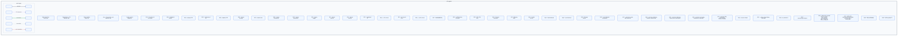

### Описание
Диаграмма «00 Legend» из views-набора представляет фокусированный срез родительской диаграммы для точечного анализа. Она представлена в формате блок-схема потоков (flowchart). Тип представления: Legend. Родительская диаграмма: `(root)`. В комментариях исходника зафиксирован фокус диаграммы: Shared legend for coded edge labels and link weights. Схема имеет плотность порядка 43 узлов и 5 связей; её удобно использовать как обзорный архитектурный срез для проверки влияния изменений, согласования интерфейсов и подготовки рефакторинга, но не как исчерпывающий каталог текущей кодовой поверхности. Ключевые блоки/подграфы: 📋 Legend, Link Types. Показательные узлы для быстрого чтения: Main data flow: solid, 4px, Dependency/DI: dashed, 2px, Observability: gray, 1px, Error/Quarantine: red dashed, 2px, Codes used in diagrams, K01 = Transform & normalize.

### Метаданные
- Тип: `flowchart`
- Представление: `Legend`

\newpage

## 01-full-system-component-dataflow

**01 Full System Component**

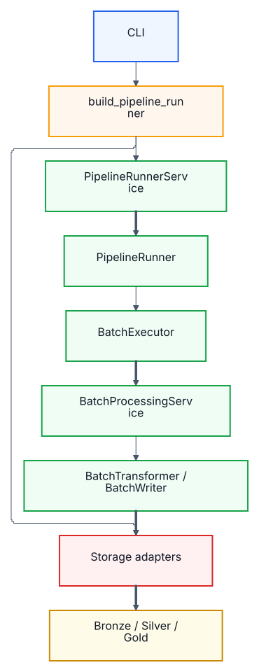

### Описание
Диаграмма «01 Full System Component» из views-набора представляет фокусированный срез родительской диаграммы для точечного анализа. Она представлена в формате блок-схема потоков (flowchart). Тип представления: Data-Flow. Родительская диаграмма: `01-full-system-component-full.mermaid`. В комментариях исходника зафиксирован фокус диаграммы: {init: {'layout':'elk','theme':'base','flowchart':{'defaultRenderer':'elk'},'elk':{'mergeEdges':true,'edgeRouting':'ORTHOGONAL','nodePlacementStrategy':'BRANDES_KOEPF'}}}%%. Схема имеет плотность порядка 9 узлов и 9 связей; её удобно использовать как обзорный архитектурный срез для проверки влияния изменений, согласования интерфейсов и подготовки рефакторинга, но не как исчерпывающий каталог текущей кодовой поверхности. Показательные узлы для быстрого чтения: CLI, build_pipeline_runner, PipelineRunnerService, PipelineRunner, BatchExecutor, BatchProcessingService.

### Метаданные
- Тип: `flowchart`
- Представление: `Data-Flow`

\newpage

## 01-full-system-component-domain

**01 Full System Component**

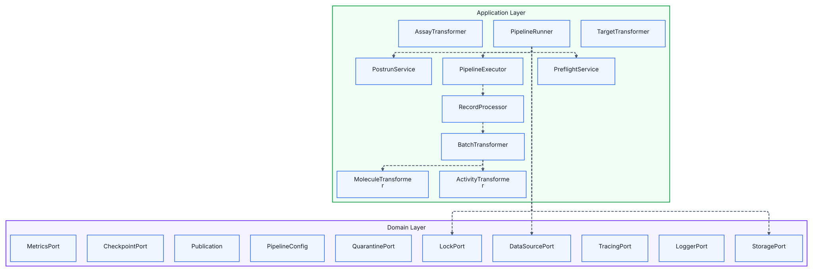

### Описание
Диаграмма «01 Full System Component» из views-набора представляет фокусированный срез родительской диаграммы для точечного анализа. Она представлена в формате блок-схема потоков (flowchart). Тип представления: Domain-Focus. Родительская диаграмма: `01-full-system-component-full.mermaid`. В комментариях исходника зафиксирован фокус диаграммы: {init: {'layout':'elk','theme':'base','flowchart':{'defaultRenderer':'elk'},'elk':{'mergeEdges':true,'edgeRouting':'ORTHOGONAL','nodePlacementStrategy':'BRANDES_KOEPF'}}}%%. Схема имеет плотность порядка 9 узлов и 7 связей; её удобно использовать как обзорный архитектурный срез для проверки влияния изменений, согласования интерфейсов и подготовки рефакторинга, но не как исчерпывающий каталог текущей кодовой поверхности. Ключевые блоки/подграфы: Domain Layer, Application Layer. Показательные узлы для быстрого чтения: Port facades, Entities / value objects, Pipeline + runtime config, Errors / events, PipelineRunner, PipelineService.

### Метаданные
- Тип: `flowchart`
- Представление: `Domain-Focus`

\newpage

## 01-full-system-component-full

**Full System Component Diagram**

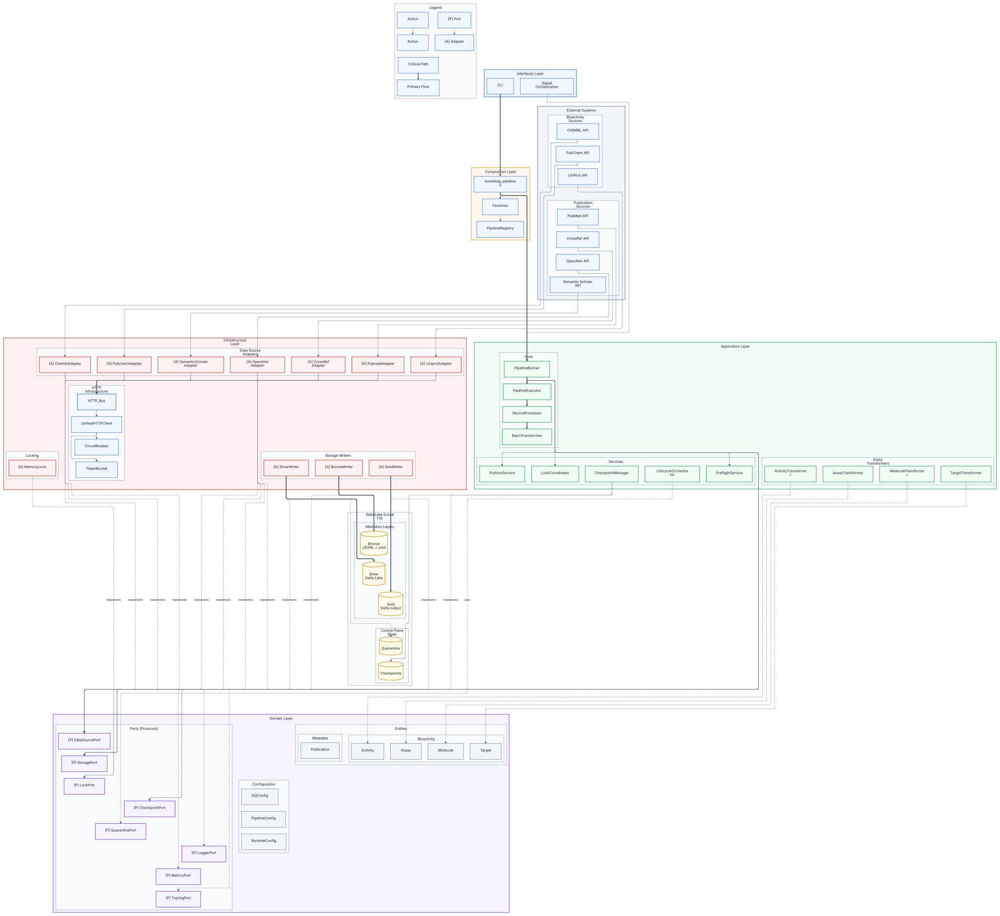

### Описание
Диаграмма «Full System Component Diagram» из views-набора представляет фокусированный срез родительской диаграммы для точечного анализа. Она представлена в формате блок-схема потоков (flowchart) и служит ориентиром на уровне детализации «Mixed (System / Component / Class)». Тип представления: Full. Родительская диаграмма: `(root)`. В комментариях исходника зафиксирован фокус диаграммы: RULES.md §1.1 (Five-Layer Architecture), §1.2 (Ports & Adapters), composition/runtime_builders, application/core. Схема имеет плотность порядка 31 узлов и 38 связей; её удобно использовать как обзорный архитектурный срез для проверки влияния изменений, согласования интерфейсов и подготовки рефакторинга, но не как исчерпывающий каталог текущей кодовой поверхности. Ключевые блоки/подграфы: External Systems, Interfaces Layer, Composition Layer, Application Layer, Domain Layer, Infrastructure Layer. Показательные узлы для быстрого чтения: Bioactivity APIs, Publication APIs, CLI run / health / debug, Signal orchestration, build_pipeline_runner, PipelineRegistry. Связанный ADR: ADR-040.

### Метаданные
- Тип: `flowchart`
- Уровень: `Mixed (System / Component / Class)`
- Дата: `2026-03-24`
- Представление: `Full`
- ADR: `ADR-040`

\newpage

## 01-full-system-component-infra

**01 Full System Component**

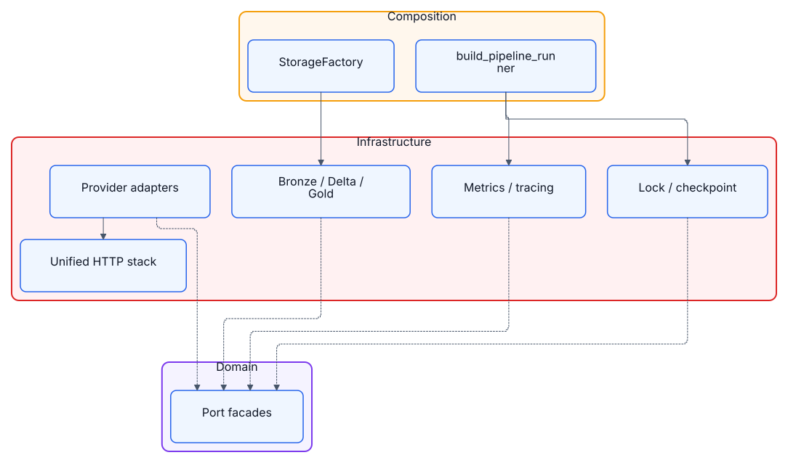

### Описание
Диаграмма «01 Full System Component» из views-набора представляет фокусированный срез родительской диаграммы для точечного анализа. Она представлена в формате блок-схема потоков (flowchart). Тип представления: Infrastructure-Mapping. Родительская диаграмма: `01-full-system-component-full.mermaid`. В комментариях исходника зафиксирован фокус диаграммы: {init: {'layout':'elk','theme':'base','flowchart':{'defaultRenderer':'elk'},'elk':{'mergeEdges':true,'edgeRouting':'ORTHOGONAL','nodePlacementStrategy':'BRANDES_KOEPF'}}}%%. Схема имеет плотность порядка 8 узлов и 8 связей; её удобно использовать как обзорный архитектурный срез для проверки влияния изменений, согласования интерфейсов и подготовки рефакторинга, но не как исчерпывающий каталог текущей кодовой поверхности. Ключевые блоки/подграфы: Composition, Infrastructure, Domain. Показательные узлы для быстрого чтения: build_pipeline_runner, StorageFactory, Provider adapters, Unified HTTP stack, Bronze / Delta / Gold, Lock / checkpoint.

### Метаданные
- Тип: `flowchart`
- Представление: `Infrastructure-Mapping`

\newpage

## 01-full-system-component-overview

**01 Full System Component**

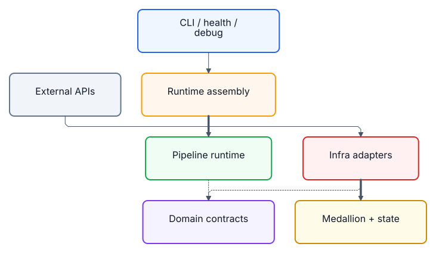

### Описание
Диаграмма «01 Full System Component» из views-набора представляет фокусированный срез родительской диаграммы для точечного анализа. Она представлена в формате блок-схема потоков (flowchart). Тип представления: Overview. Родительская диаграмма: `01-full-system-component-full.mermaid`. В комментариях исходника зафиксирован фокус диаграммы: Decomposed overview for fast architectural reading.. Схема имеет плотность порядка 7 узлов и 6 связей; её удобно использовать как обзорный архитектурный срез для проверки влияния изменений, согласования интерфейсов и подготовки рефакторинга, но не как исчерпывающий каталог текущей кодовой поверхности. Показательные узлы для быстрого чтения: External APIs, CLI / health / debug, Runtime assembly, Pipeline runtime, Domain contracts, Infra adapters.

### Метаданные
- Тип: `flowchart`
- Представление: `Overview`

\newpage

## 01-high-level-dataflow

**01 High Level**

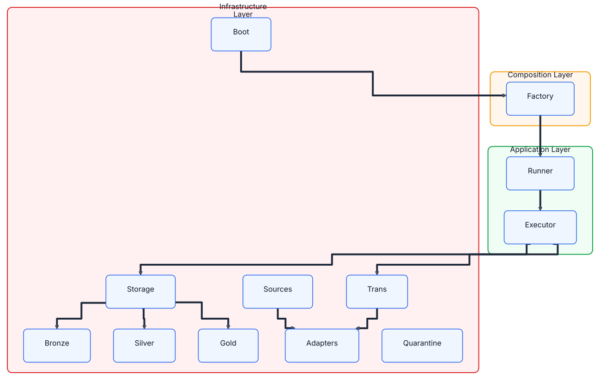

### Описание
Диаграмма «01 High Level» из views-набора представляет фокусированный срез родительской диаграммы для точечного анализа. Она представлена в формате блок-схема потоков (flowchart). Тип представления: Data-Flow. Родительская диаграмма: `01-high-level-full.mermaid`. Схема имеет плотность порядка 12 узлов и 10 связей; её удобно использовать как обзорный архитектурный срез для проверки влияния изменений, согласования интерфейсов и подготовки рефакторинга, но не как исчерпывающий каталог текущей кодовой поверхности. Ключевые блоки/подграфы: Application Layer, Infrastructure Layer, Composition Layer. Показательные узлы для быстрого чтения: Executor, Runner, Bronze, Silver, Gold, Sources.

### Метаданные
- Тип: `flowchart`
- Представление: `Data-Flow`

\newpage

## 01-high-level-domain

**01 High Level**

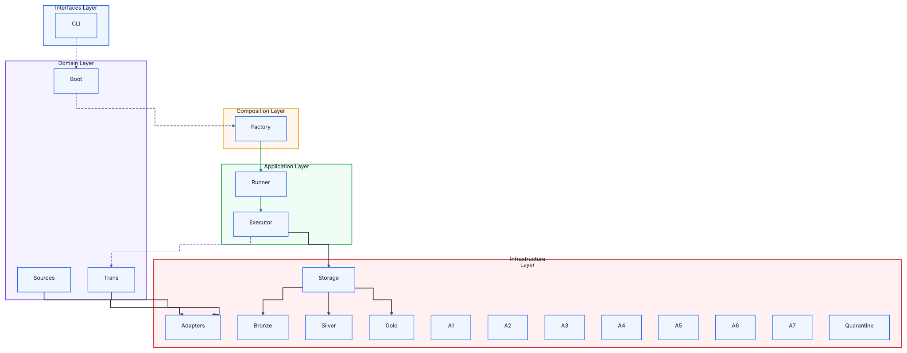

### Описание
Диаграмма «01 High Level» из views-набора представляет фокусированный срез родительской диаграммы для точечного анализа. Она представлена в формате блок-схема потоков (flowchart). Тип представления: Domain-Focus. Родительская диаграмма: `01-high-level-full.mermaid`. Схема имеет плотность порядка 20 узлов и 11 связей; её удобно использовать как обзорный архитектурный срез для проверки влияния изменений, согласования интерфейсов и подготовки рефакторинга, но не как исчерпывающий каталог текущей кодовой поверхности. Ключевые блоки/подграфы: Domain Layer, Application Layer, Infrastructure Layer, Composition Layer, Interfaces Layer. Показательные узлы для быстрого чтения: Boot, Trans, Sources, Runner, Executor, Adapters.

### Метаданные
- Тип: `flowchart`
- Представление: `Domain-Focus`

\newpage

## 01-high-level-full

**High-Level System Architecture**

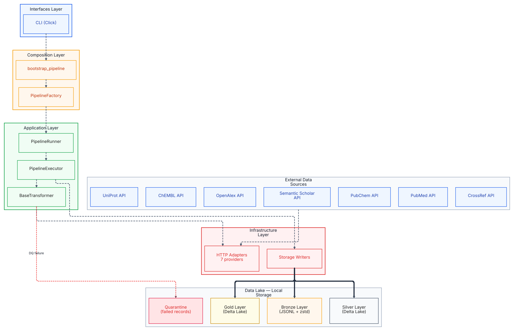

### Описание
Диаграмма «High-Level System Architecture» из views-набора представляет фокусированный срез родительской диаграммы для точечного анализа. Она представлена в формате блок-схема потоков (flowchart) и служит ориентиром на уровне детализации «Mixed (System / Component / Class)». Тип представления: Full. Родительская диаграмма: `(root)`. В комментариях исходника зафиксирован фокус диаграммы: RULES.md §1.1 (Five-Layer Architecture). Схема имеет плотность порядка 19 узлов и 12 связей; её удобно использовать как обзорный архитектурный срез для проверки влияния изменений, согласования интерфейсов и подготовки рефакторинга, но не как исчерпывающий каталог текущей кодовой поверхности. Ключевые блоки/подграфы: External Data Sources, Interfaces Layer, Composition Layer, Application Layer, Infrastructure Layer, Data Lake — Local Storage. Показательные узлы для быстрого чтения: ChEMBL API, PubChem API, UniProt API, PubMed API, CrossRef API, OpenAlex API.

### Метаданные
- Тип: `flowchart`
- Уровень: `Mixed (System / Component / Class)`
- Дата: `2026-02-24`
- Представление: `Full`

\newpage

## 01-high-level-infra

**01 High Level**

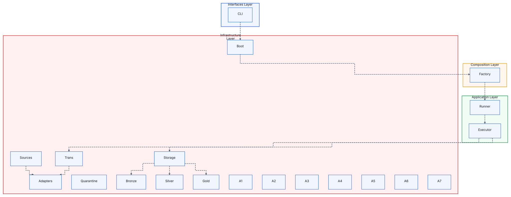

### Описание
Диаграмма «01 High Level» из views-набора представляет фокусированный срез родительской диаграммы для точечного анализа. Она представлена в формате блок-схема потоков (flowchart). Тип представления: Infrastructure-Mapping. Родительская диаграмма: `01-high-level-full.mermaid`. Схема имеет плотность порядка 20 узлов и 11 связей; её удобно использовать как обзорный архитектурный срез для проверки влияния изменений, согласования интерфейсов и подготовки рефакторинга, но не как исчерпывающий каталог текущей кодовой поверхности. Ключевые блоки/подграфы: Application Layer, Infrastructure Layer, Composition Layer, Interfaces Layer. Показательные узлы для быстрого чтения: Executor, Runner, Storage, Adapters, Quarantine, Boot.

### Метаданные
- Тип: `flowchart`
- Представление: `Infrastructure-Mapping`

\newpage

## 01-high-level-overview

**01 High Level**

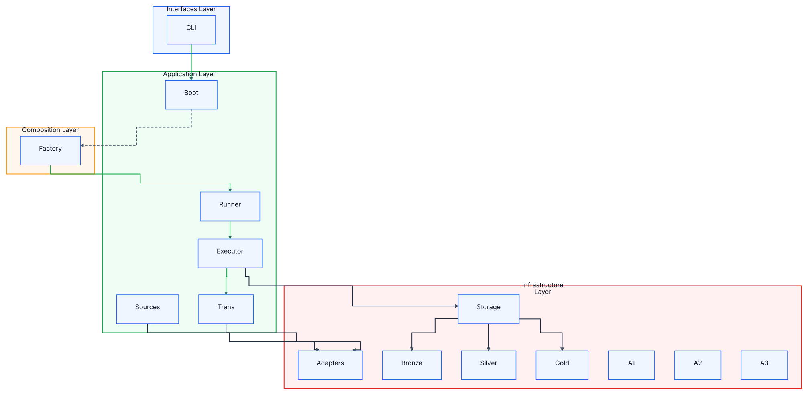

### Описание
Диаграмма «01 High Level» из views-набора представляет фокусированный срез родительской диаграммы для точечного анализа. Она представлена в формате блок-схема потоков (flowchart). Тип представления: Overview. Родительская диаграмма: `01-high-level-full.mermaid`. Схема имеет плотность порядка 15 узлов и 11 связей; её удобно использовать как обзорный архитектурный срез для проверки влияния изменений, согласования интерфейсов и подготовки рефакторинга, но не как исчерпывающий каталог текущей кодовой поверхности. Ключевые блоки/подграфы: Application Layer, Infrastructure Layer, Composition Layer, Interfaces Layer. Показательные узлы для быстрого чтения: Executor, Runner, Trans, Boot, Sources, Adapters.

### Метаданные
- Тип: `flowchart`
- Представление: `Overview`

\newpage

## 02-medallion-dataflow

**02 Medallion**

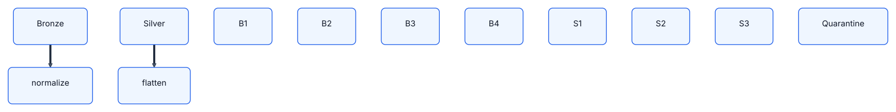

### Описание
Диаграмма «02 Medallion» из views-набора представляет фокусированный срез родительской диаграммы для точечного анализа. Она представлена в формате блок-схема потоков (flowchart). Тип представления: Data-Flow. Родительская диаграмма: `02-medallion-full.mermaid`. Схема имеет плотность порядка 12 узлов и 2 связей; её удобно использовать как обзорный архитектурный срез для проверки влияния изменений, согласования интерфейсов и подготовки рефакторинга, но не как исчерпывающий каталог текущей кодовой поверхности. Показательные узлы для быстрого чтения: Bronze, Silver, normalize, flatten, B1, B2.

### Метаданные
- Тип: `flowchart`
- Представление: `Data-Flow`

\newpage

## 02-medallion-domain

**02 Medallion**

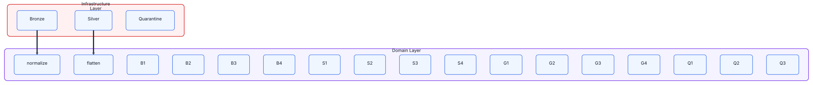

### Описание
Диаграмма «02 Medallion» из views-набора представляет фокусированный срез родительской диаграммы для точечного анализа. Она представлена в формате блок-схема потоков (flowchart). Тип представления: Domain-Focus. Родительская диаграмма: `02-medallion-full.mermaid`. Схема имеет плотность порядка 20 узлов и 2 связей; её удобно использовать как обзорный архитектурный срез для проверки влияния изменений, согласования интерфейсов и подготовки рефакторинга, но не как исчерпывающий каталог текущей кодовой поверхности. Ключевые блоки/подграфы: Domain Layer, Infrastructure Layer. Показательные узлы для быстрого чтения: normalize, flatten, B1, B2, B3, B4.

### Метаданные
- Тип: `flowchart`
- Представление: `Domain-Focus`

\newpage

## 02-medallion-full

**Medallion Architecture Layers**

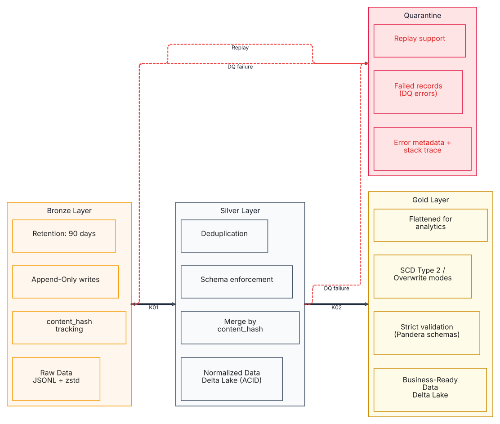

### Описание
Диаграмма «Medallion Architecture Layers» из views-набора представляет фокусированный срез родительской диаграммы для точечного анализа. Она представлена в формате блок-схема потоков (flowchart) и служит ориентиром на уровне детализации «Mixed (System / Component / Class)». Тип представления: Full. Родительская диаграмма: `(root)`. В комментариях исходника зафиксирован фокус диаграммы: RULES.md §2.1 (Bronze/Silver/Gold), §2.3 (Quarantine). Схема имеет плотность порядка 15 узлов и 5 связей; её удобно использовать как обзорный архитектурный срез для проверки влияния изменений, согласования интерфейсов и подготовки рефакторинга, но не как исчерпывающий каталог текущей кодовой поверхности. Ключевые блоки/подграфы: Bronze Layer, Silver Layer, Gold Layer, Quarantine. Показательные узлы для быстрого чтения: Raw Data JSONL + zstd, Append-Only writes, Retention: 90 days, content_hash tracking, Normalized Data Delta Lake (ACID), Merge by content_hash.

### Метаданные
- Тип: `flowchart`
- Уровень: `Mixed (System / Component / Class)`
- Дата: `2026-02-24`
- Представление: `Full`

\newpage

## 02-medallion-infra

**02 Medallion**

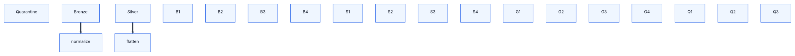

### Описание
Диаграмма «02 Medallion» из views-набора представляет фокусированный срез родительской диаграммы для точечного анализа. Она представлена в формате блок-схема потоков (flowchart). Тип представления: Infrastructure-Mapping. Родительская диаграмма: `02-medallion-full.mermaid`. Схема имеет плотность порядка 20 узлов и 2 связей; её удобно использовать как обзорный архитектурный срез для проверки влияния изменений, согласования интерфейсов и подготовки рефакторинга, но не как исчерпывающий каталог текущей кодовой поверхности. Показательные узлы для быстрого чтения: Quarantine, Bronze, normalize, Silver, flatten, B1.

### Метаданные
- Тип: `flowchart`
- Представление: `Infrastructure-Mapping`

\newpage

## 02-medallion-overview

**02 Medallion**

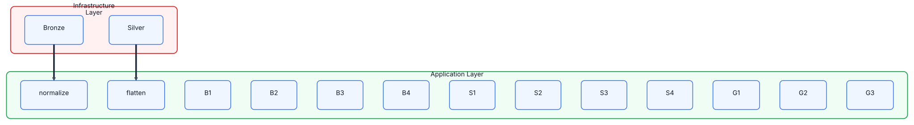

### Описание
Диаграмма «02 Medallion» из views-набора представляет фокусированный срез родительской диаграммы для точечного анализа. Она представлена в формате блок-схема потоков (flowchart). Тип представления: Overview. Родительская диаграмма: `02-medallion-full.mermaid`. Схема имеет плотность порядка 15 узлов и 2 связей; её удобно использовать как обзорный архитектурный срез для проверки влияния изменений, согласования интерфейсов и подготовки рефакторинга, но не как исчерпывающий каталог текущей кодовой поверхности. Ключевые блоки/подграфы: Application Layer, Infrastructure Layer. Показательные узлы для быстрого чтения: normalize, flatten, B1, B2, B3, B4.

### Метаданные
- Тип: `flowchart`
- Представление: `Overview`

\newpage

## 03-medallion-data-flow-full

**03 Medallion Data Flow**

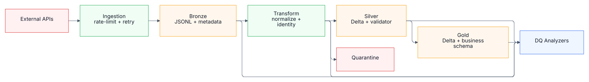

### Описание
Диаграмма «03 Medallion Data Flow» из views-набора представляет фокусированный срез родительской диаграммы для точечного анализа. Она представлена в формате блок-схема потоков (flowchart). Тип представления: Full. Родительская диаграмма: `03-medallion-data-flow.mmd`. В комментариях исходника зафиксирован фокус диаграммы: Full reference diagram retained after decomposition.. Схема имеет плотность порядка 8 узлов и 10 связей; её удобно использовать как обзорный архитектурный срез для проверки влияния изменений, согласования интерфейсов и подготовки рефакторинга, но не как исчерпывающий каталог текущей кодовой поверхности. Показательные узлы для быстрого чтения: External APIs, Ingestion rate-limit + retry, Bronze JSONL + metadata, Transform normalize + identity, Silver Delta + validator, Gold Delta + business schema.

### Метаданные
- Тип: `flowchart`
- Представление: `Full`

\newpage

## 03-medallion-data-flow-overview

**03 Medallion Data Flow**

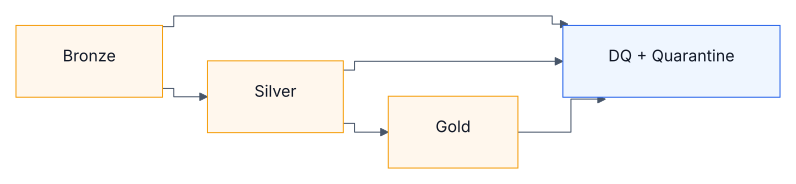

### Описание
Диаграмма «03 Medallion Data Flow» из views-набора представляет фокусированный срез родительской диаграммы для точечного анализа. Она представлена в формате блок-схема потоков (flowchart). Тип представления: Overview. Родительская диаграмма: `03-medallion-data-flow.mmd`. Схема имеет плотность порядка 4 узлов и 5 связей; её удобно использовать как обзорный архитектурный срез для проверки влияния изменений, согласования интерфейсов и подготовки рефакторинга, но не как исчерпывающий каталог текущей кодовой поверхности. Показательные узлы для быстрого чтения: Bronze, Silver, Gold, DQ + Quarantine.

### Метаданные
- Тип: `flowchart`
- Представление: `Overview`

\newpage

## 04-domain-layer-class-diagram-dataflow

**04 Domain Layer Class Diagram**

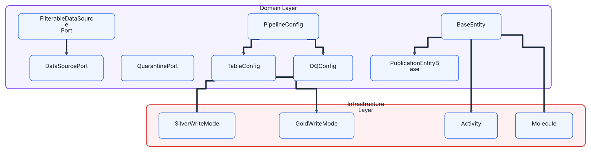

### Описание
Диаграмма «04 Domain Layer Class Diagram» из views-набора представляет фокусированный срез родительской диаграммы для точечного анализа. Она представлена в формате блок-схема потоков (flowchart). Тип представления: Data-Flow. Родительская диаграмма: `04-domain-layer-class-diagram-full.mermaid`. Схема имеет плотность порядка 12 узлов и 8 связей; её удобно использовать как обзорный архитектурный срез для проверки влияния изменений, согласования интерфейсов и подготовки рефакторинга, но не как исчерпывающий каталог текущей кодовой поверхности. Ключевые блоки/подграфы: Domain Layer, Infrastructure Layer. Показательные узлы для быстрого чтения: PipelineConfig, DataSourcePort, FilterableDataSourcePort, QuarantinePort, TableConfig, DQConfig.

### Метаданные
- Тип: `flowchart`
- Представление: `Data-Flow`

\newpage

## 04-domain-layer-class-diagram-domain

**04 Domain Layer Class Diagram**

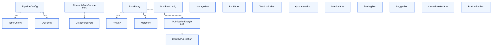

### Описание
Диаграмма «04 Domain Layer Class Diagram» из views-набора представляет фокусированный срез родительской диаграммы для точечного анализа. Она представлена в формате блок-схема потоков (flowchart). Тип представления: Domain-Focus. Родительская диаграмма: `04-domain-layer-class-diagram-full.mermaid`. Схема имеет плотность порядка 20 узлов и 7 связей; её удобно использовать как обзорный архитектурный срез для проверки влияния изменений, согласования интерфейсов и подготовки рефакторинга, но не как исчерпывающий каталог текущей кодовой поверхности. Показательные узлы для быстрого чтения: BaseEntity, TableConfig, PublicationEntityBase, PipelineConfig, DataSourcePort, FilterableDataSourcePort.

### Метаданные
- Тип: `flowchart`
- Представление: `Domain-Focus`

\newpage

## 04-domain-layer-class-diagram-full

**Domain Layer Class Diagram**

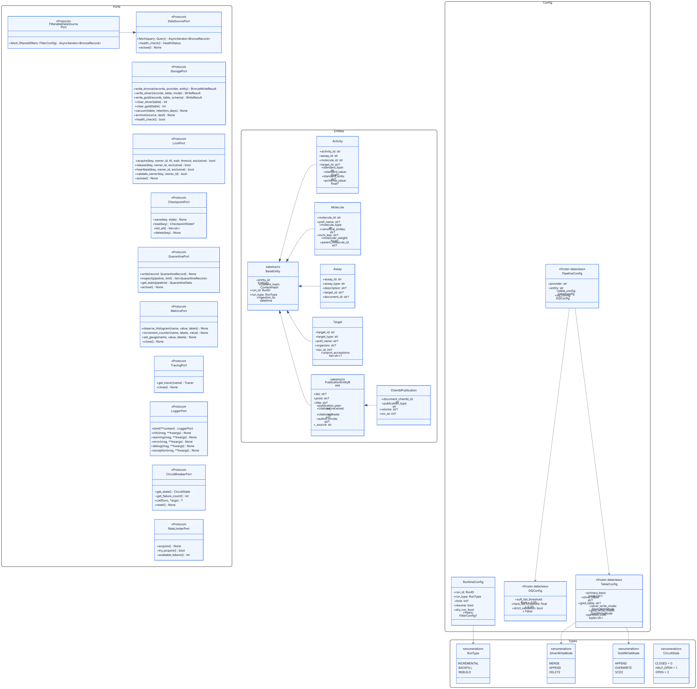

### Описание
Диаграмма «Domain Layer Class Diagram» из views-набора представляет фокусированный срез родительской диаграммы для точечного анализа. Она представлена в формате диаграмма классов (class diagram) и служит ориентиром на уровне детализации «Mixed (System / Component / Class)». Тип представления: Full. Родительская диаграмма: `(root)`. В комментариях исходника зафиксирован фокус диаграммы: RULES.md §1.1 (Domain Layer), §1.2 (Ports), §1.3 (Entities). Схема имеет плотность порядка 30 узлов и 11 связей; её удобно использовать как обзорный архитектурный срез для проверки влияния изменений, согласования интерфейсов и подготовки рефакторинга, но не как исчерпывающий каталог текущей кодовой поверхности. Ключевые блоки/подграфы: Ports, Entities, Config, Types. Показательные узлы для быстрого чтения: DataSourcePort, FilterableDataSourcePort, StorageLifecyclePort, BronzeStoragePort, SilverStoragePort, GoldStoragePort.

### Метаданные
- Тип: `classDiagram`
- Уровень: `Mixed (System / Component / Class)`
- Дата: `2026-02-24`
- Представление: `Full`

\newpage

## 04-domain-layer-class-diagram-infra

**04 Domain Layer Class Diagram**

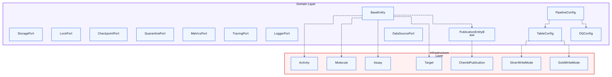

### Описание
Диаграмма «04 Domain Layer Class Diagram» из views-набора представляет фокусированный срез родительской диаграммы для точечного анализа. Она представлена в формате блок-схема потоков (flowchart). Тип представления: Infrastructure-Mapping. Родительская диаграмма: `04-domain-layer-class-diagram-full.mermaid`. Схема имеет плотность порядка 20 узлов и 10 связей; её удобно использовать как обзорный архитектурный срез для проверки влияния изменений, согласования интерфейсов и подготовки рефакторинга, но не как исчерпывающий каталог текущей кодовой поверхности. Ключевые блоки/подграфы: Domain Layer, Infrastructure Layer. Показательные узлы для быстрого чтения: Bronze/Silver/Gold/MergedStoragePorts, LockPort, CheckpointPort, QuarantinePort, MetricsPort, TracingPort.

### Метаданные
- Тип: `flowchart`
- Представление: `Infrastructure-Mapping`

\newpage

## 04-domain-layer-class-diagram-overview

**04 Domain Layer Class Diagram**

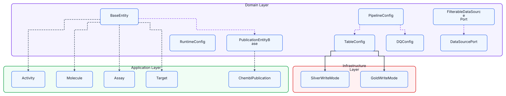

### Описание
Диаграмма «04 Domain Layer Class Diagram» из views-набора представляет фокусированный срез родительской диаграммы для точечного анализа. Она представлена в формате блок-схема потоков (flowchart). Тип представления: Overview. Родительская диаграмма: `04-domain-layer-class-diagram-full.mermaid`. Схема имеет плотность порядка 15 узлов и 11 связей; её удобно использовать как обзорный архитектурный срез для проверки влияния изменений, согласования интерфейсов и подготовки рефакторинга, но не как исчерпывающий каталог текущей кодовой поверхности. Ключевые блоки/подграфы: Domain Layer, Application Layer, Infrastructure Layer. Показательные узлы для быстрого чтения: BaseEntity, PublicationEntityBase, PipelineConfig, TableConfig, DQConfig, FilterableDataSourcePort.

### Метаданные
- Тип: `flowchart`
- Представление: `Overview`

\newpage

## 05-layers-interaction-dataflow

**05 Layers Interaction**

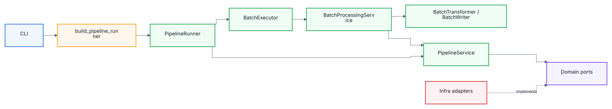

### Описание
Диаграмма «05 Layers Interaction» из views-набора представляет фокусированный срез родительской диаграммы для точечного анализа. Она представлена в формате блок-схема потоков (flowchart). Тип представления: Dataflow. Родительская диаграмма: `05-layers-interaction-full.mermaid`. Схема имеет плотность порядка 9 узлов и 9 связей; её удобно использовать как обзорный архитектурный срез для проверки влияния изменений, согласования интерфейсов и подготовки рефакторинга, но не как исчерпывающий каталог текущей кодовой поверхности. Показательные узлы для быстрого чтения: CLI, build_pipeline_runner, PipelineRunner, BatchExecutor, BatchProcessingService, BatchTransformer / BatchWriter.

### Метаданные
- Тип: `flowchart`
- Представление: `Dataflow`

\newpage

## 05-layers-interaction-domain

**05 Layers Interaction**

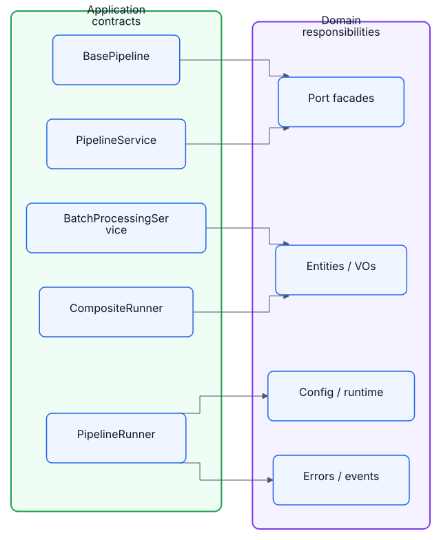

### Описание
Диаграмма «05 Layers Interaction» из views-набора представляет фокусированный срез родительской диаграммы для точечного анализа. Она представлена в формате блок-схема потоков (flowchart). Тип представления: Domain. Родительская диаграмма: `05-layers-interaction-full.mermaid`. Схема имеет плотность порядка 9 узлов и 6 связей; её удобно использовать как обзорный архитектурный срез для проверки влияния изменений, согласования интерфейсов и подготовки рефакторинга, но не как исчерпывающий каталог текущей кодовой поверхности. Ключевые блоки/подграфы: Application contracts, Domain responsibilities. Показательные узлы для быстрого чтения: BasePipeline, PipelineRunner, PipelineService, BatchProcessingService, CompositeRunner, Port facades.

### Метаданные
- Тип: `flowchart`
- Представление: `Domain`

\newpage

## 05-layers-interaction-full

**Layer Interaction — Hexagonal Runtime Topology**

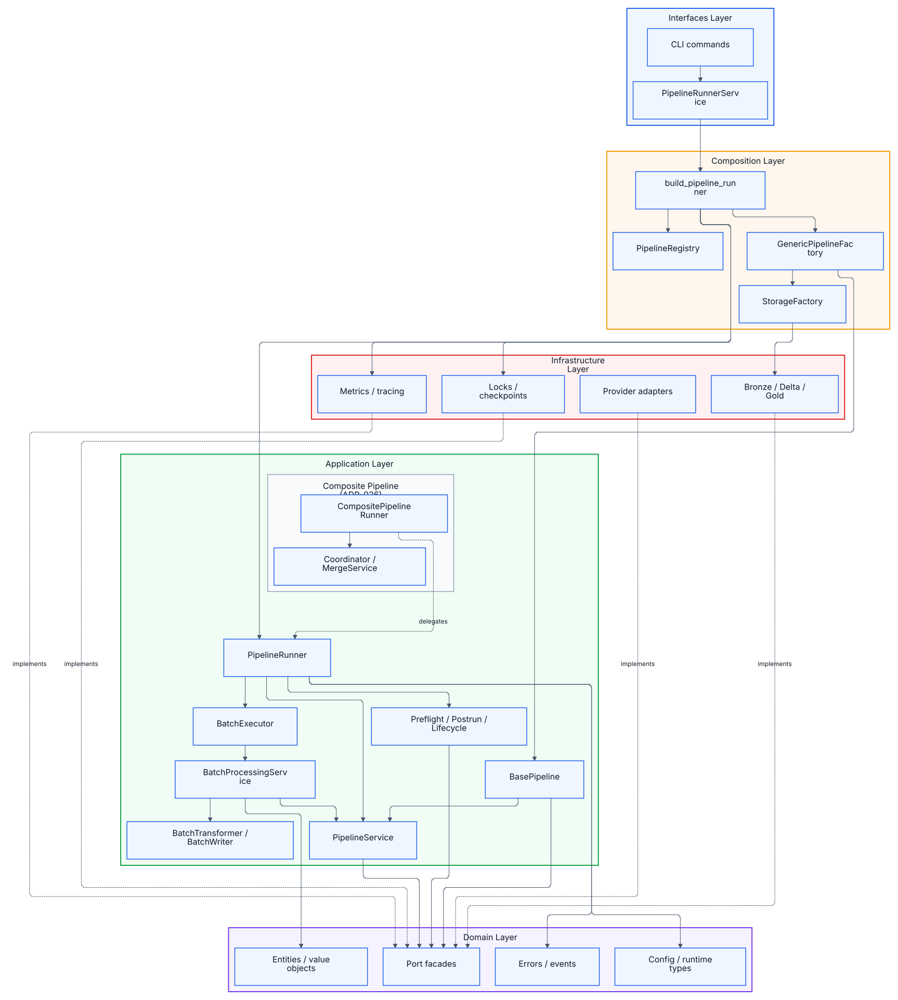

### Описание
Диаграмма «Layer Interaction — Hexagonal Runtime Topology» из views-набора представляет фокусированный срез родительской диаграммы для точечного анализа. Она представлена в формате блок-схема потоков (flowchart) и служит ориентиром на уровне детализации «Component / Class». Тип представления: Full. Родительская диаграмма: `(root)`. В комментариях исходника зафиксирован фокус диаграммы: RULES.md §1.1 (Layers), §1.2 (Ports & Adapters), composition/runtime_builders, application/core. Схема имеет плотность порядка 23 узлов и 29 связей; её удобно использовать как обзорный архитектурный срез для проверки влияния изменений, согласования интерфейсов и подготовки рефакторинга, но не как исчерпывающий каталог текущей кодовой поверхности. Ключевые блоки/подграфы: Interfaces Layer, Composition Layer, Application Layer, Composite Pipeline (ADR-026), Domain Layer, Infrastructure Layer. Показательные узлы для быстрого чтения: CLI commands, PipelineRunnerService, build_pipeline_runner, PipelineRegistry, GenericPipelineFactory, StorageFactory.

### Метаданные
- Тип: `flowchart`
- Уровень: `Component / Class`
- Дата: `2026-03-24`
- Представление: `Full`

\newpage

## 05-layers-interaction-infra

**05 Layers Interaction**

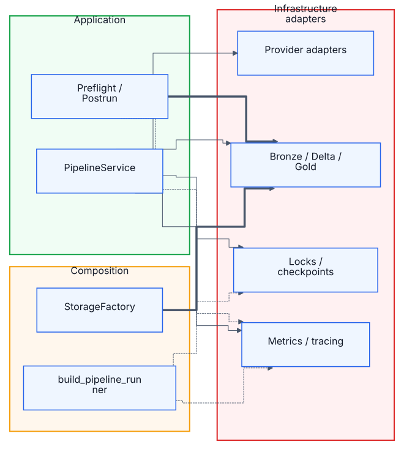

### Описание
Диаграмма «05 Layers Interaction» из views-набора представляет фокусированный срез родительской диаграммы для точечного анализа. Она представлена в формате блок-схема потоков (flowchart). Тип представления: Infra. Родительская диаграмма: `05-layers-interaction-full.mermaid`. Схема имеет плотность порядка 8 узлов и 9 связей; её удобно использовать как обзорный архитектурный срез для проверки влияния изменений, согласования интерфейсов и подготовки рефакторинга, но не как исчерпывающий каталог текущей кодовой поверхности. Ключевые блоки/подграфы: Composition, Application, Infrastructure adapters. Показательные узлы для быстрого чтения: build_pipeline_runner, StorageFactory, PipelineService, Preflight / Postrun, Provider adapters, Bronze / Delta / Gold.

### Метаданные
- Тип: `flowchart`
- Представление: `Infra`

\newpage

## 05-layers-interaction-overview

**05 Layers Interaction**

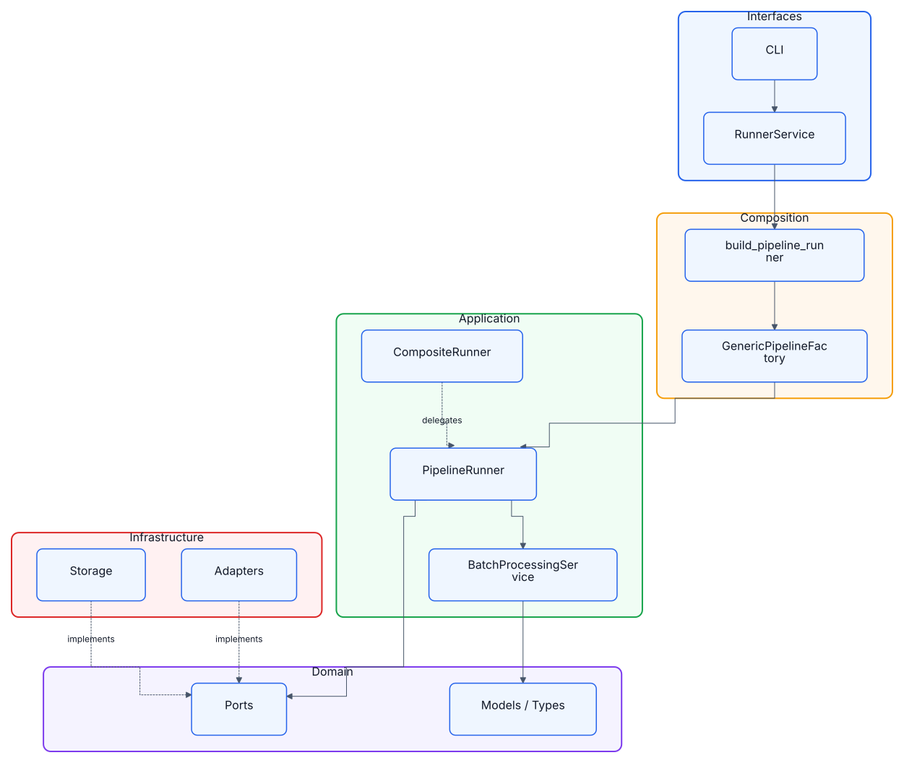

### Описание
Диаграмма «05 Layers Interaction» из views-набора представляет фокусированный срез родительской диаграммы для точечного анализа. Она представлена в формате блок-схема потоков (flowchart). Тип представления: Overview. Родительская диаграмма: `05-layers-interaction-full.mermaid`. Схема имеет плотность порядка 11 узлов и 10 связей; её удобно использовать как обзорный архитектурный срез для проверки влияния изменений, согласования интерфейсов и подготовки рефакторинга, но не как исчерпывающий каталог текущей кодовой поверхности. Ключевые блоки/подграфы: Interfaces, Composition, Application, Domain, Infrastructure. Показательные узлы для быстрого чтения: CLI, RunnerService, build_pipeline_runner, GenericPipelineFactory, PipelineRunner, BatchProcessingService.

### Метаданные
- Тип: `flowchart`
- Представление: `Overview`

\newpage

## 05-pipeline-lifecycle-states-dataflow

**05 Pipeline Lifecycle States**

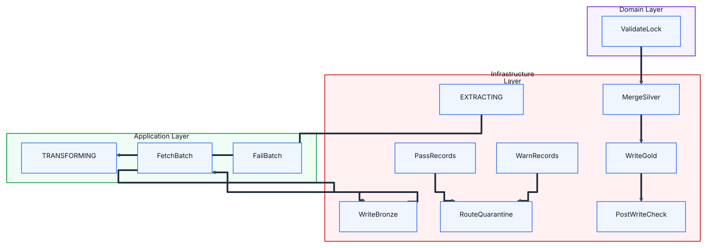

### Описание
Диаграмма «05 Pipeline Lifecycle States» из views-набора представляет фокусированный срез родительской диаграммы для точечного анализа. Она представлена в формате блок-схема потоков (flowchart). Тип представления: Data-Flow. Родительская диаграмма: `05-pipeline-lifecycle-states-full.mermaid`. Схема имеет плотность порядка 12 узлов и 8 связей; её удобно использовать как обзорный архитектурный срез для проверки влияния изменений, согласования интерфейсов и подготовки рефакторинга, но не как исчерпывающий каталог текущей кодовой поверхности. Ключевые блоки/подграфы: Domain Layer, Application Layer, Infrastructure Layer. Показательные узлы для быстрого чтения: ValidateLock, TRANSFORMING, FetchBatch, FailBatch, EXTRACTING, WriteBronze.

### Метаданные
- Тип: `flowchart`
- Представление: `Data-Flow`

\newpage

## 05-pipeline-lifecycle-states-domain

**05 Pipeline Lifecycle States**

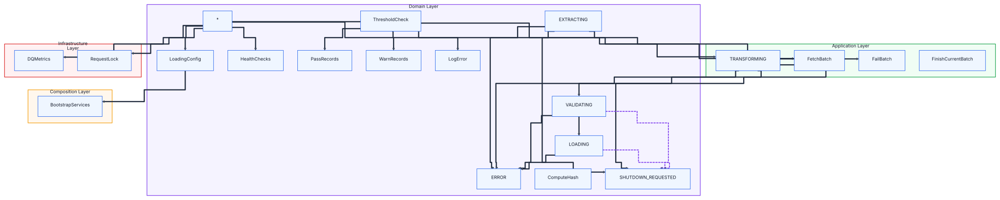

### Описание
Диаграмма «05 Pipeline Lifecycle States» из views-набора представляет фокусированный срез родительской диаграммы для точечного анализа. Она представлена в формате блок-схема потоков (flowchart). Тип представления: Domain-Focus. Родительская диаграмма: `05-pipeline-lifecycle-states-full.mermaid`. Схема имеет плотность порядка 20 узлов и 21 связей; её удобно использовать как обзорный архитектурный срез для проверки влияния изменений, согласования интерфейсов и подготовки рефакторинга, но не как исчерпывающий каталог текущей кодовой поверхности. Ключевые блоки/подграфы: Domain Layer, Application Layer, Infrastructure Layer, Composition Layer. Показательные узлы для быстрого чтения: ERROR, LoadingConfig, HealthChecks, PassRecords, WarnRecords, LogError.

### Метаданные
- Тип: `flowchart`
- Представление: `Domain-Focus`

\newpage

## 05-pipeline-lifecycle-states-full

**Pipeline Lifecycle State Machine**

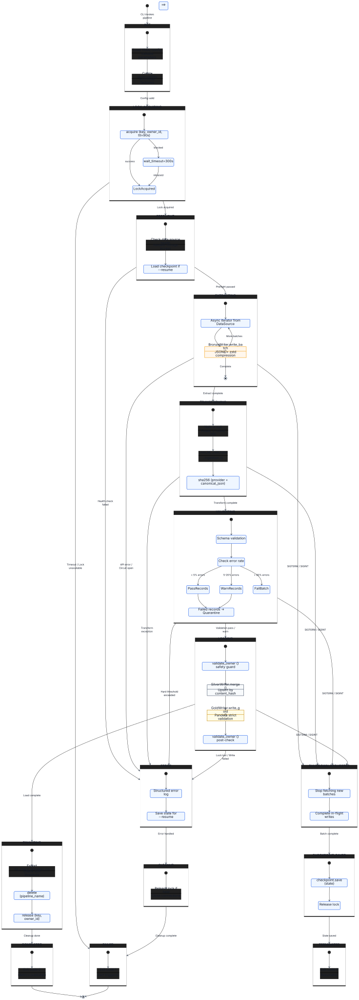

### Описание
Диаграмма «Pipeline Lifecycle State Machine» из views-набора представляет фокусированный срез родительской диаграммы для точечного анализа. Она представлена в формате диаграмма состояний (state diagram) и служит ориентиром на уровне детализации «Mixed (System / Component / Class)». Тип представления: Full. Родительская диаграмма: `(root)`. В комментариях исходника зафиксирован фокус диаграммы: RULES.md §3 (Pipeline Execution), §3.5 (Graceful Shutdown).

### Метаданные
- Тип: `stateDiagram`
- Уровень: `Mixed (System / Component / Class)`
- Дата: `2026-02-24`
- Представление: `Full`

\newpage

## 05-pipeline-lifecycle-states-infra

**05 Pipeline Lifecycle States**

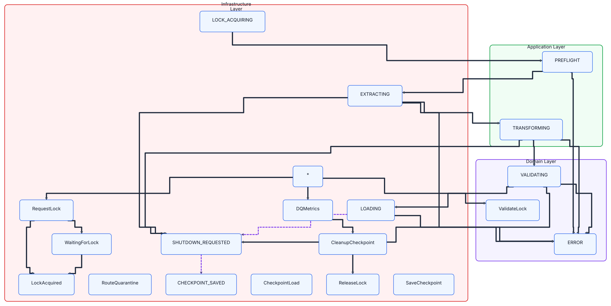

### Описание
Диаграмма «05 Pipeline Lifecycle States» из views-набора представляет фокусированный срез родительской диаграммы для точечного анализа. Она представлена в формате блок-схема потоков (flowchart). Тип представления: Infrastructure-Mapping. Родительская диаграмма: `05-pipeline-lifecycle-states-full.mermaid`. Схема имеет плотность порядка 20 узлов и 23 связей; её удобно использовать как обзорный архитектурный срез для проверки влияния изменений, согласования интерфейсов и подготовки рефакторинга, но не как исчерпывающий каталог текущей кодовой поверхности. Ключевые блоки/подграфы: Domain Layer, Application Layer, Infrastructure Layer. Показательные узлы для быстрого чтения: ERROR, ValidateLock, VALIDATING, PREFLIGHT, TRANSFORMING, LOCK_ACQUIRING.

### Метаданные
- Тип: `flowchart`
- Представление: `Infrastructure-Mapping`

\newpage

## 05-pipeline-lifecycle-states-overview

**05 Pipeline Lifecycle States**

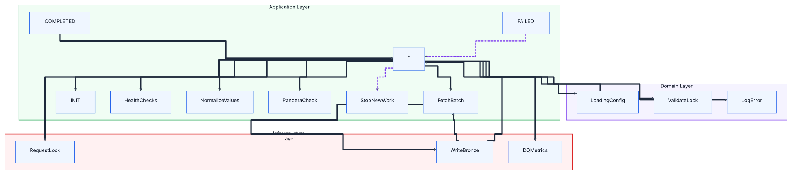

### Описание
Диаграмма «05 Pipeline Lifecycle States» из views-набора представляет фокусированный срез родительской диаграммы для точечного анализа. Она представлена в формате блок-схема потоков (flowchart). Тип представления: Overview. Родительская диаграмма: `05-pipeline-lifecycle-states-full.mermaid`. Схема имеет плотность порядка 15 узлов и 16 связей; её удобно использовать как обзорный архитектурный срез для проверки влияния изменений, согласования интерфейсов и подготовки рефакторинга, но не как исчерпывающий каталог текущей кодовой поверхности. Ключевые блоки/подграфы: Domain Layer, Application Layer, Infrastructure Layer. Показательные узлы для быстрого чтения: LoadingConfig, ValidateLock, LogError, *, FetchBatch, FAILED.

### Метаданные
- Тип: `flowchart`
- Представление: `Overview`

\newpage

## 06-application-layer-class-diagram-dataflow

**06 Application Layer Class Diagram**

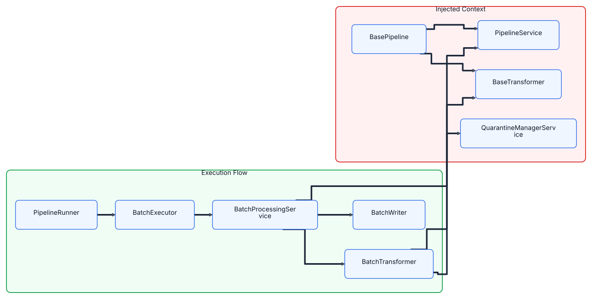

### Описание
Диаграмма «06 Application Layer Class Diagram» из views-набора представляет фокусированный срез родительской диаграммы для точечного анализа. Она представлена в формате блок-схема потоков (flowchart). Тип представления: Data-Flow. Родительская диаграмма: `06-application-layer-class-diagram-full.mermaid`. Схема имеет плотность порядка 9 узлов и 9 связей; её удобно использовать как обзорный архитектурный срез для проверки влияния изменений, согласования интерфейсов и подготовки рефакторинга, но не как исчерпывающий каталог текущей кодовой поверхности. Ключевые блоки/подграфы: Execution Flow, Injected Context. Показательные узлы для быстрого чтения: PipelineRunner, BatchExecutor, BatchProcessingService, BatchTransformer, BatchWriter, BasePipeline.

### Метаданные
- Тип: `flowchart`
- Представление: `Data-Flow`

\newpage

## 06-application-layer-class-diagram-domain

**06 Application Layer Class Diagram**

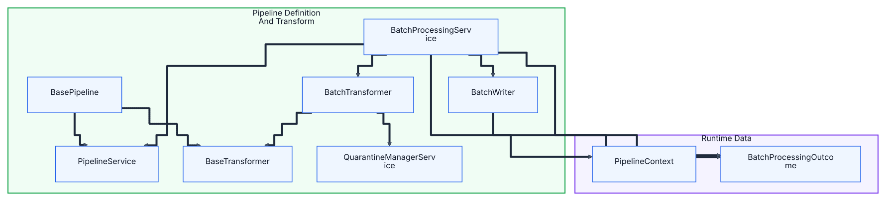

### Описание
Диаграмма «06 Application Layer Class Diagram» из views-набора представляет фокусированный срез родительской диаграммы для точечного анализа. Она представлена в формате блок-схема потоков (flowchart). Тип представления: Domain-Focus. Родительская диаграмма: `06-application-layer-class-diagram-full.mermaid`. Схема имеет плотность порядка 9 узлов и 10 связей; её удобно использовать как обзорный архитектурный срез для проверки влияния изменений, согласования интерфейсов и подготовки рефакторинга, но не как исчерпывающий каталог текущей кодовой поверхности. Ключевые блоки/подграфы: Pipeline Definition And Transform, Runtime Data. Показательные узлы для быстрого чтения: BasePipeline, PipelineService, BaseTransformer, BatchTransformer, BatchProcessingService, BatchWriter.

### Метаданные
- Тип: `flowchart`
- Представление: `Domain-Focus`

\newpage

## 06-application-layer-class-diagram-full

**Application Layer Class Diagram**

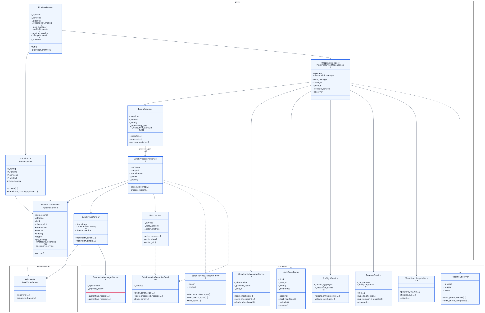

### Описание
Диаграмма «Application Layer Class Diagram» из views-набора представляет фокусированный срез родительской диаграммы для точечного анализа. Она представлена в формате диаграмма классов (class diagram) и служит ориентиром на уровне детализации «Component / Class». Тип представления: Full. Родительская диаграмма: `(root)`. В комментариях исходника зафиксирован фокус диаграммы: RULES.md §1.1 (Application Layer), application/core/, application/services/, application/observability/. Схема имеет плотность порядка 18 узлов и 21 связей; её удобно использовать как обзорный архитектурный срез для проверки влияния изменений, согласования интерфейсов и подготовки рефакторинга, но не как исчерпывающий каталог текущей кодовой поверхности. Ключевые блоки/подграфы: Core, Services, Transformers. Показательные узлы для быстрого чтения: BasePipeline, PipelineRunner, PipelineRunnerDependencies, BatchExecutor, BatchProcessingService, BatchTransformer.

### Метаданные
- Тип: `classDiagram`
- Уровень: `Component / Class`
- Дата: `2026-03-24`
- Представление: `Full`

\newpage

## 06-application-layer-class-diagram-infra

**06 Application Layer Class Diagram**

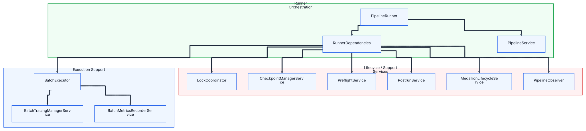

### Описание
Диаграмма «06 Application Layer Class Diagram» из views-набора представляет фокусированный срез родительской диаграммы для точечного анализа. Она представлена в формате блок-схема потоков (flowchart). Тип представления: Infrastructure-Mapping. Родительская диаграмма: `06-application-layer-class-diagram-full.mermaid`. Схема имеет плотность порядка 12 узлов и 11 связей; её удобно использовать как обзорный архитектурный срез для проверки влияния изменений, согласования интерфейсов и подготовки рефакторинга, но не как исчерпывающий каталог текущей кодовой поверхности. Ключевые блоки/подграфы: Runner Orchestration, Lifecycle / Support Services, Execution Support. Показательные узлы для быстрого чтения: PipelineRunner, RunnerDependencies, PipelineService, LockRuntimeService, CheckpointRuntimeService, PreflightService.

### Метаданные
- Тип: `flowchart`
- Представление: `Infrastructure-Mapping`

\newpage

## 06-application-layer-class-diagram-overview

**06 Application Layer Class Diagram**

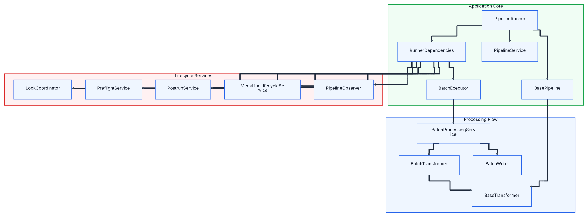

### Описание
Диаграмма «06 Application Layer Class Diagram» из views-набора представляет фокусированный срез родительской диаграммы для точечного анализа. Она представлена в формате блок-схема потоков (flowchart). Тип представления: Overview. Родительская диаграмма: `06-application-layer-class-diagram-full.mermaid`. Схема имеет плотность порядка 14 узлов и 14 связей; её удобно использовать как обзорный архитектурный срез для проверки влияния изменений, согласования интерфейсов и подготовки рефакторинга, но не как исчерпывающий каталог текущей кодовой поверхности. Ключевые блоки/подграфы: Application Core, Processing Flow, Lifecycle Services. Показательные узлы для быстрого чтения: BasePipeline, PipelineRunner, RunnerDependencies, BatchExecutor, PipelineService, BatchProcessingService.

### Метаданные
- Тип: `flowchart`
- Представление: `Overview`

\newpage

## 07-circuit-breaker-states-dataflow

**07 Circuit Breaker States**

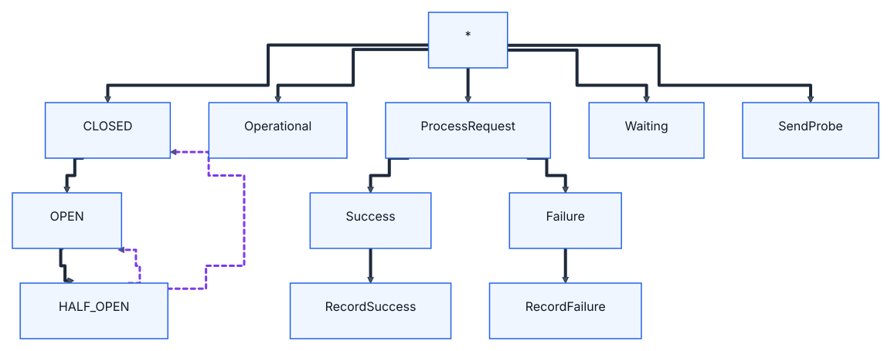

### Описание
Диаграмма «07 Circuit Breaker States» из views-набора представляет фокусированный срез родительской диаграммы для точечного анализа. Она представлена в формате блок-схема потоков (flowchart). Тип представления: Data-Flow. Родительская диаграмма: `07-circuit-breaker-states-full.mermaid`. Схема имеет плотность порядка 12 узлов и 13 связей; её удобно использовать как обзорный архитектурный срез для проверки влияния изменений, согласования интерфейсов и подготовки рефакторинга, но не как исчерпывающий каталог текущей кодовой поверхности. Показательные узлы для быстрого чтения: RecordSuccess, RecordFailure, Success, ProcessRequest, *, CLOSED.

### Метаданные
- Тип: `flowchart`
- Представление: `Data-Flow`

\newpage

## 07-circuit-breaker-states-domain

**07 Circuit Breaker States**

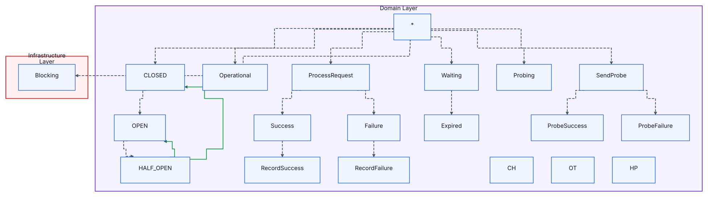

### Описание
Диаграмма «07 Circuit Breaker States» из views-набора представляет фокусированный срез родительской диаграммы для точечного анализа. Она представлена в формате блок-схема потоков (flowchart). Тип представления: Domain-Focus. Родительская диаграмма: `07-circuit-breaker-states-full.mermaid`. Схема имеет плотность порядка 20 узлов и 18 связей; её удобно использовать как обзорный архитектурный срез для проверки влияния изменений, согласования интерфейсов и подготовки рефакторинга, но не как исчерпывающий каталог текущей кодовой поверхности. Ключевые блоки/подграфы: Domain Layer, Infrastructure Layer. Показательные узлы для быстрого чтения: RecordSuccess, RecordFailure, Success, ProcessRequest, *, CLOSED.

### Метаданные
- Тип: `flowchart`
- Представление: `Domain-Focus`

\newpage

## 07-circuit-breaker-states-full

**Circuit Breaker State Machine**

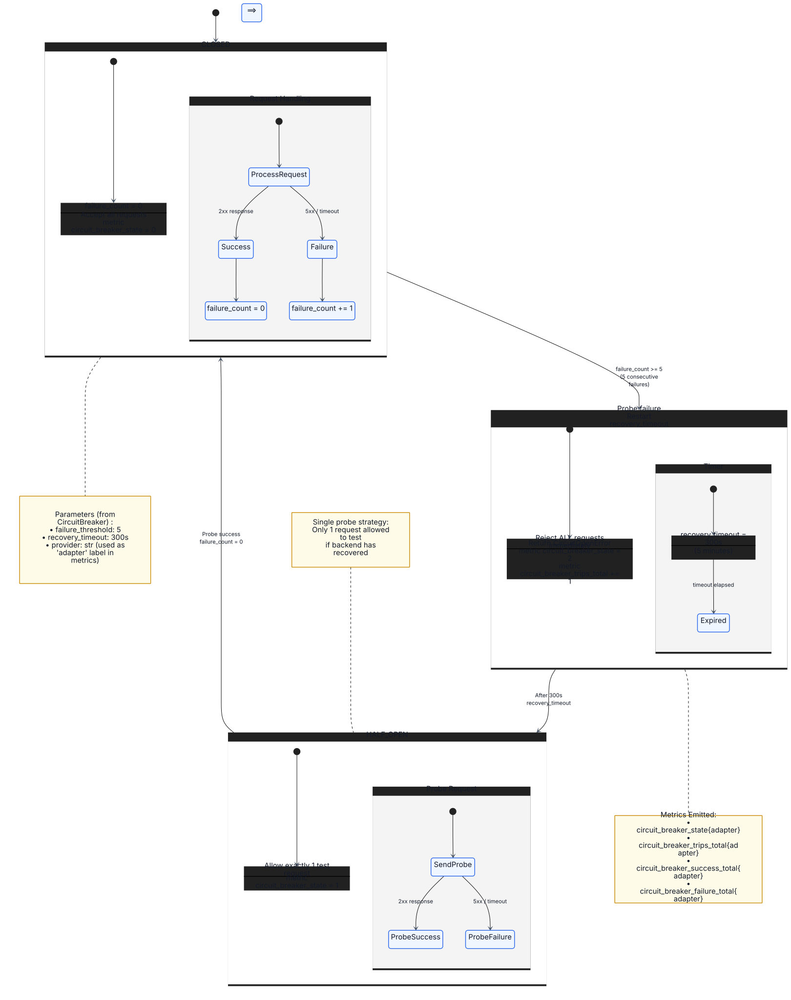

### Описание
Диаграмма «Circuit Breaker State Machine» из views-набора представляет фокусированный срез родительской диаграммы для точечного анализа. Она представлена в формате диаграмма состояний (state diagram) и служит ориентиром на уровне детализации «Mixed (System / Component / Class)». Тип представления: Full. Родительская диаграмма: `(root)`. В комментариях исходника зафиксирован фокус диаграммы: RULES.md §3.6 (Resilience), ADR-007.

### Метаданные
- Тип: `stateDiagram`
- Уровень: `Mixed (System / Component / Class)`
- Дата: `2026-02-24`
- Представление: `Full`

\newpage

## 07-circuit-breaker-states-infra

**07 Circuit Breaker States**

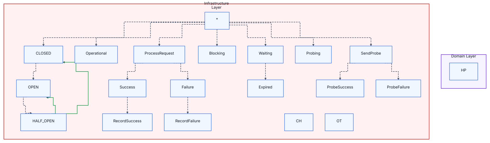

### Описание
Диаграмма «07 Circuit Breaker States» из views-набора представляет фокусированный срез родительской диаграммы для точечного анализа. Она представлена в формате блок-схема потоков (flowchart). Тип представления: Infrastructure-Mapping. Родительская диаграмма: `07-circuit-breaker-states-full.mermaid`. Схема имеет плотность порядка 20 узлов и 18 связей; её удобно использовать как обзорный архитектурный срез для проверки влияния изменений, согласования интерфейсов и подготовки рефакторинга, но не как исчерпывающий каталог текущей кодовой поверхности. Ключевые блоки/подграфы: Domain Layer, Infrastructure Layer. Показательные узлы для быстрого чтения: HP, Blocking, *, CLOSED, ProcessRequest, OPEN.

### Метаданные
- Тип: `flowchart`
- Представление: `Infrastructure-Mapping`

\newpage

## 07-circuit-breaker-states-overview

**07 Circuit Breaker States**

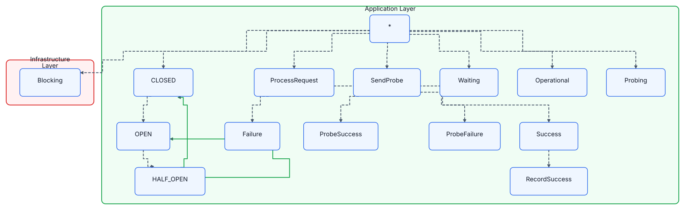

### Описание
Диаграмма «07 Circuit Breaker States» из views-набора представляет фокусированный срез родительской диаграммы для точечного анализа. Она представлена в формате блок-схема потоков (flowchart). Тип представления: Overview. Родительская диаграмма: `07-circuit-breaker-states-full.mermaid`. Схема имеет плотность порядка 15 узлов и 16 связей; её удобно использовать как обзорный архитектурный срез для проверки влияния изменений, согласования интерфейсов и подготовки рефакторинга, но не как исчерпывающий каталог текущей кодовой поверхности. Ключевые блоки/подграфы: Application Layer, Infrastructure Layer. Показательные узлы для быстрого чтения: *, CLOSED, ProcessRequest, SendProbe, Waiting, Operational.

### Метаданные
- Тип: `flowchart`
- Представление: `Overview`

\newpage

## 08-complete-etl-workflow-dataflow

**08 Complete Etl Workflow**

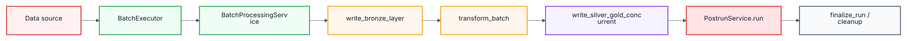

### Описание
Диаграмма «08 Complete Etl Workflow» из views-набора представляет фокусированный срез родительской диаграммы для точечного анализа. Она представлена в формате блок-схема потоков (flowchart). Тип представления: Dataflow. Родительская диаграмма: `08-complete-etl-workflow-full.mermaid`. Схема имеет плотность порядка 8 узлов и 7 связей; её удобно использовать как обзорный архитектурный срез для проверки влияния изменений, согласования интерфейсов и подготовки рефакторинга, но не как исчерпывающий каталог текущей кодовой поверхности. Показательные узлы для быстрого чтения: Data source, BatchExecutor, BatchProcessingService, write_bronze_layer, transform_batch, write_silver_gold_concurrent.

### Метаданные
- Тип: `flowchart`
- Представление: `Dataflow`

\newpage

## 08-complete-etl-workflow-domain

**08 Complete Etl Workflow**

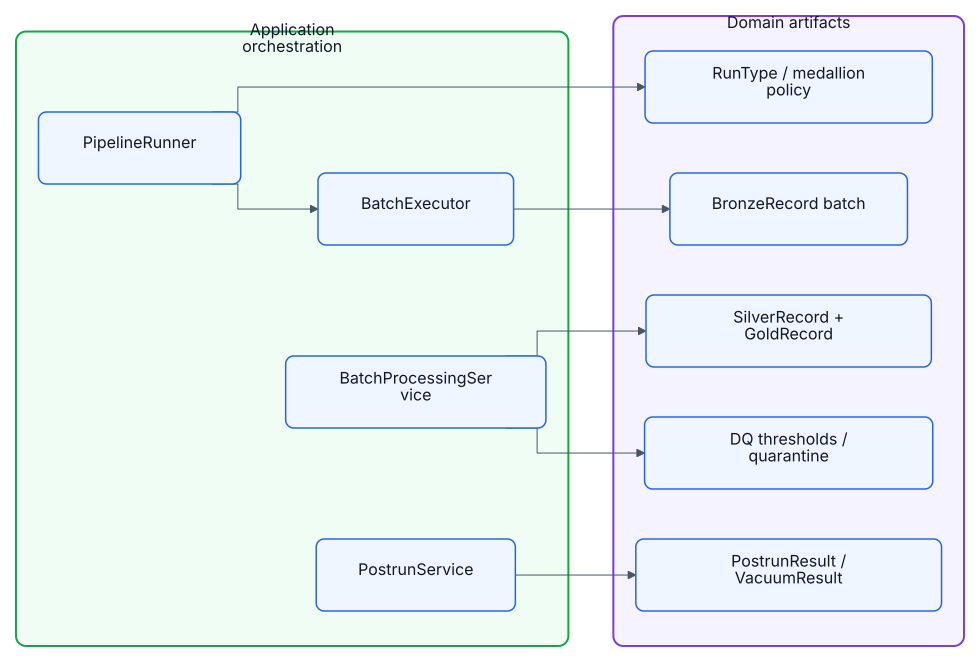

### Описание
Диаграмма «08 Complete Etl Workflow» из views-набора представляет фокусированный срез родительской диаграммы для точечного анализа. Она представлена в формате блок-схема потоков (flowchart). Тип представления: Domain. Родительская диаграмма: `08-complete-etl-workflow-full.mermaid`. Схема имеет плотность порядка 9 узлов и 6 связей; её удобно использовать как обзорный архитектурный срез для проверки влияния изменений, согласования интерфейсов и подготовки рефакторинга, но не как исчерпывающий каталог текущей кодовой поверхности. Ключевые блоки/подграфы: Application orchestration, Domain artifacts. Показательные узлы для быстрого чтения: PipelineRunner, BatchExecutor, BatchProcessingService, PostrunService, RunType / medallion policy, BronzeRecord batch.

### Метаданные
- Тип: `flowchart`
- Представление: `Domain`

\newpage

## 08-complete-etl-workflow-full

**Complete ETL Workflow (6 Phases)**

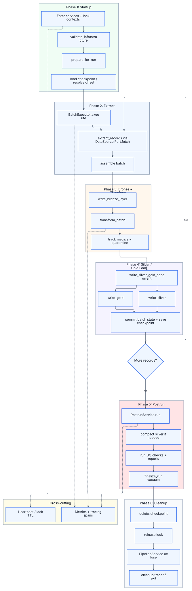

### Описание
Диаграмма «Complete ETL Workflow (6 Phases)» из views-набора представляет фокусированный срез родительской диаграммы для точечного анализа. Она представлена в формате блок-схема потоков (flowchart) и служит ориентиром на уровне детализации «Component / Class». Тип представления: Full. Родительская диаграмма: `(root)`. В комментариях исходника зафиксирован фокус диаграммы: application/core/{runner,batch_executor,batch_processing_service,postrun/service}.py, application/services/medallion_lifecycle.py. Схема имеет плотность порядка 24 узлов и 28 связей; её удобно использовать как обзорный архитектурный срез для проверки влияния изменений, согласования интерфейсов и подготовки рефакторинга, но не как исчерпывающий каталог текущей кодовой поверхности. Ключевые блоки/подграфы: Phase 1: Startup, Phase 2: Extract, Phase 3: Bronze + Transform, Phase 4: Silver / Gold Load, Phase 5: Postrun, Phase 6: Cleanup. Показательные узлы для быстрого чтения: Enter services + lock contexts, validate_infrastructure, prepare_for_run, load checkpoint / resolve offset, BatchExecutor.execute, extract_records via DataSourcePort.fetch.

### Метаданные
- Тип: `flowchart`
- Уровень: `Component / Class`
- Дата: `2026-03-24`
- Представление: `Full`

\newpage

## 08-complete-etl-workflow-infra

**08 Complete Etl Workflow**

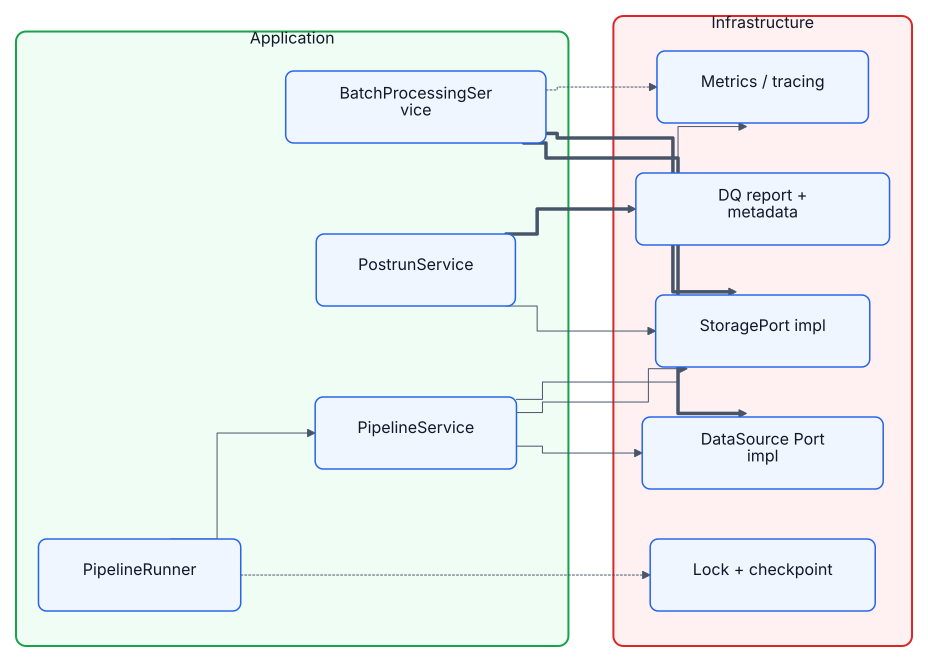

### Описание
Диаграмма «08 Complete Etl Workflow» из views-набора представляет фокусированный срез родительской диаграммы для точечного анализа. Она представлена в формате блок-схема потоков (flowchart). Тип представления: Infra. Родительская диаграмма: `08-complete-etl-workflow-full.mermaid`. Схема имеет плотность порядка 9 узлов и 10 связей; её удобно использовать как обзорный архитектурный срез для проверки влияния изменений, согласования интерфейсов и подготовки рефакторинга, но не как исчерпывающий каталог текущей кодовой поверхности. Ключевые блоки/подграфы: Application, Infrastructure. Показательные узлы для быстрого чтения: PipelineRunner, BatchProcessingService, PostrunService, PipelineService, DataSourcePort impl, Bronze/Silver/Gold/Merged storage adapters.

### Метаданные
- Тип: `flowchart`
- Представление: `Infra`

\newpage

## 08-complete-etl-workflow-overview

**08 Complete Etl Workflow**

### Описание
Диаграмма «08 Complete Etl Workflow» из views-набора представляет фокусированный срез родительской диаграммы для точечного анализа. Она представлена в формате блок-схема потоков (flowchart). Тип представления: Overview. Родительская диаграмма: `08-complete-etl-workflow-full.mermaid`. Схема имеет плотность порядка 6 узлов и 5 связей; её удобно использовать как обзорный архитектурный срез для проверки влияния изменений, согласования интерфейсов и подготовки рефакторинга, но не как исчерпывающий каталог текущей кодовой поверхности. Показательные узлы для быстрого чтения: Startup, Extract, Bronze + Transform, Silver / Gold, Postrun, Cleanup.

### Метаданные
- Тип: `flowchart`
- Представление: `Overview`

\newpage

## 08-domain-ddd-dataflow

**08 Domain Ddd**

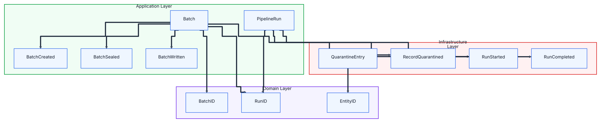

### Описание
Диаграмма «08 Domain Ddd» из views-набора представляет фокусированный срез родительской диаграммы для точечного анализа. Она представлена в формате блок-схема потоков (flowchart). Тип представления: Data-Flow. Родительская диаграмма: `08-domain-ddd-full.mermaid`. Схема имеет плотность порядка 12 узлов и 10 связей; её удобно использовать как обзорный архитектурный срез для проверки влияния изменений, согласования интерфейсов и подготовки рефакторинга, но не как исчерпывающий каталог текущей кодовой поверхности. Ключевые блоки/подграфы: Domain Layer, Application Layer, Infrastructure Layer. Показательные узлы для быстрого чтения: BatchID, RunID, EntityID, Batch, PipelineRun, BatchCreated.

### Метаданные
- Тип: `flowchart`
- Представление: `Data-Flow`

\newpage

## 08-domain-ddd-domain

**08 Domain Ddd**

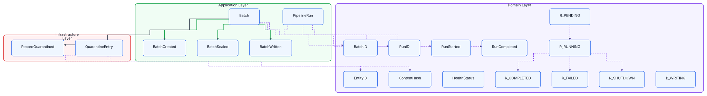

### Описание
Диаграмма «08 Domain Ddd» из views-набора представляет фокусированный срез родительской диаграммы для точечного анализа. Она представлена в формате блок-схема потоков (flowchart). Тип представления: Domain-Focus. Родительская диаграмма: `08-domain-ddd-full.mermaid`. Схема имеет плотность порядка 20 узлов и 15 связей; её удобно использовать как обзорный архитектурный срез для проверки влияния изменений, согласования интерфейсов и подготовки рефакторинга, но не как исчерпывающий каталог текущей кодовой поверхности. Ключевые блоки/подграфы: Domain Layer, Application Layer, Infrastructure Layer. Показательные узлы для быстрого чтения: BatchID, EntityID, ContentHash, HealthStatus, RunID, RunStarted.

### Метаданные
- Тип: `flowchart`
- Представление: `Domain-Focus`

\newpage

## 08-domain-ddd-full

**Domain Layer — DDD Components**

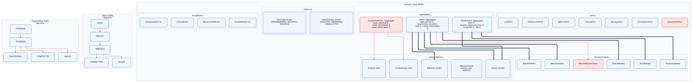

### Описание
Диаграмма «Domain Layer — DDD Components» из views-набора представляет фокусированный срез родительской диаграммы для точечного анализа. Она представлена в формате блок-схема потоков (flowchart) и служит ориентиром на уровне детализации «Mixed (System / Component / Class)». Тип представления: Full. Родительская диаграмма: `(root)`. В комментариях исходника зафиксирован фокус диаграммы: RULES.md §1.1 (Domain Layer), §1.3 (DDD Aggregates), ADR-021. Схема имеет плотность порядка 11 узлов и 19 связей; её удобно использовать как обзорный архитектурный срез для проверки влияния изменений, согласования интерфейсов и подготовки рефакторинга, но не как исчерпывающий каталог текущей кодовой поверхности. Ключевые блоки/подграфы: Domain Layer (DDD), ports/, aggregates/, Domain Events, value_objects/, types.py. Показательные узлы для быстрого чтения: Batch Aggregate add_record(), quarantine_record() seal(), mark_committed(), PipelineRun Aggregate start(), record_stage_success() complete(), fail(), RunID (UUID), BatchID (UUID), EntityID (str), ContentHash (str).

### Метаданные
- Тип: `flowchart`
- Уровень: `Mixed (System / Component / Class)`
- Дата: `2026-02-24`
- Представление: `Full`

\newpage

## 08-domain-ddd-infra

**08 Domain Ddd**

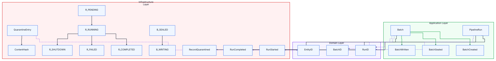

### Описание
Диаграмма «08 Domain Ddd» из views-набора представляет фокусированный срез родительской диаграммы для точечного анализа. Она представлена в формате блок-схема потоков (flowchart). Тип представления: Infrastructure-Mapping. Родительская диаграмма: `08-domain-ddd-full.mermaid`. Схема имеет плотность порядка 20 узлов и 16 связей; её удобно использовать как обзорный архитектурный срез для проверки влияния изменений, согласования интерфейсов и подготовки рефакторинга, но не как исчерпывающий каталог текущей кодовой поверхности. Ключевые блоки/подграфы: Domain Layer, Application Layer, Infrastructure Layer. Показательные узлы для быстрого чтения: RunID, BatchID, EntityID, Batch, PipelineRun, BatchCreated.

### Метаданные
- Тип: `flowchart`
- Представление: `Infrastructure-Mapping`

\newpage

## 08-domain-ddd-overview

**08 Domain Ddd**

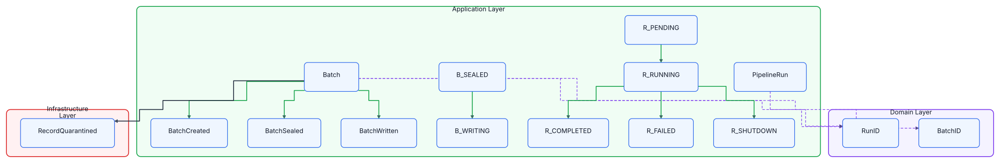

### Описание
Диаграмма «08 Domain Ddd» из views-набора представляет фокусированный срез родительской диаграммы для точечного анализа. Она представлена в формате блок-схема потоков (flowchart). Тип представления: Overview. Родительская диаграмма: `08-domain-ddd-full.mermaid`. Схема имеет плотность порядка 15 узлов и 12 связей; её удобно использовать как обзорный архитектурный срез для проверки влияния изменений, согласования интерфейсов и подготовки рефакторинга, но не как исчерпывающий каталог текущей кодовой поверхности. Ключевые блоки/подграфы: Domain Layer, Application Layer, Infrastructure Layer. Показательные узлы для быстрого чтения: RunID, BatchID, Batch, BatchCreated, BatchSealed, BatchWritten.

### Метаданные
- Тип: `flowchart`
- Представление: `Overview`

\newpage

## 10-infrastructure-layer-class-diagram-dataflow

**10 Infrastructure Layer Class Diagram**

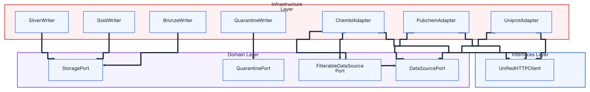

### Описание
Диаграмма «10 Infrastructure Layer Class Diagram» из views-набора представляет фокусированный срез родительской диаграммы для точечного анализа. Она представлена в формате блок-схема потоков (flowchart). Тип представления: Data-Flow. Родительская диаграмма: `10-infrastructure-layer-class-diagram-full.mermaid`. Схема имеет плотность порядка 12 узлов и 11 связей; её удобно использовать как обзорный архитектурный срез для проверки влияния изменений, согласования интерфейсов и подготовки рефакторинга, но не как исчерпывающий каталог текущей кодовой поверхности. Ключевые блоки/подграфы: Domain Layer, Infrastructure Layer, Interfaces Layer. Показательные узлы для быстрого чтения: DataSourcePort, FilterableDataSourcePort, QuarantinePort, Bronze/Silver/GoldStoragePorts, SilverWriter, GoldWriter.

### Метаданные
- Тип: `flowchart`
- Представление: `Data-Flow`

\newpage

## 10-infrastructure-layer-class-diagram-domain

**10 Infrastructure Layer Class Diagram**

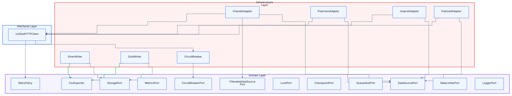

### Описание
Диаграмма «10 Infrastructure Layer Class Diagram» из views-набора представляет фокусированный срез родительской диаграммы для точечного анализа. Она представлена в формате блок-схема потоков (flowchart). Тип представления: Domain-Focus. Родительская диаграмма: `10-infrastructure-layer-class-diagram-full.mermaid`. Схема имеет плотность порядка 20 узлов и 16 связей; её удобно использовать как обзорный архитектурный срез для проверки влияния изменений, согласования интерфейсов и подготовки рефакторинга, но не как исчерпывающий каталог текущей кодовой поверхности. Ключевые блоки/подграфы: Domain Layer, Infrastructure Layer, Interfaces Layer. Показательные узлы для быстрого чтения: DataSourcePort, Bronze/Silver/GoldStoragePorts, CsvExporter, MetricsPort, RetryPolicy, FilterableDataSourcePort.

### Метаданные
- Тип: `flowchart`
- Представление: `Domain-Focus`

\newpage

## 10-infrastructure-layer-class-diagram-full

**Infrastructure Layer Class Diagram**

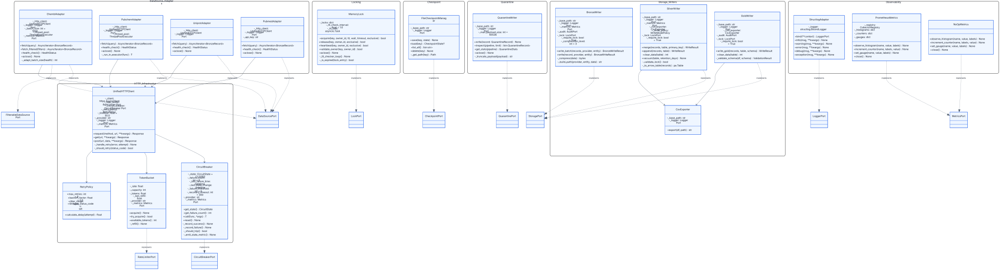

### Описание
Диаграмма «Infrastructure Layer Class Diagram» из views-набора представляет фокусированный срез родительской диаграммы для точечного анализа. Она представлена в формате диаграмма классов (class diagram) и служит ориентиром на уровне детализации «Mixed (System / Component / Class)». Тип представления: Full. Родительская диаграмма: `(root)`. В комментариях исходника зафиксирован фокус диаграммы: RULES.md §1.1 (Infrastructure Layer), §3.6 (Resilience). Схема имеет плотность порядка 18 узлов и 25 связей; её удобно использовать как обзорный архитектурный срез для проверки влияния изменений, согласования интерфейсов и подготовки рефакторинга, но не как исчерпывающий каталог текущей кодовой поверхности. Ключевые блоки/подграфы: HTTP Infrastructure, DataSource Adapters, Storage Writers, Locking, Quarantine, Checkpoint. Показательные узлы для быстрого чтения: UnifiedHTTPClient, CircuitBreaker, TokenBucket, RetryPolicy, ChemblAdapter, PubchemAdapter.

### Метаданные
- Тип: `classDiagram`
- Уровень: `Mixed (System / Component / Class)`
- Дата: `2026-02-24`
- Представление: `Full`

\newpage

## 10-infrastructure-layer-class-diagram-infra

**10 Infrastructure Layer Class Diagram**

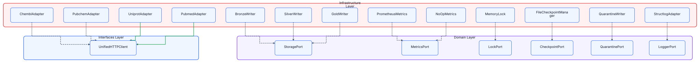

### Описание
Диаграмма «10 Infrastructure Layer Class Diagram» из views-набора представляет фокусированный срез родительской диаграммы для точечного анализа. Она представлена в формате блок-схема потоков (flowchart). Тип представления: Infrastructure-Mapping. Родительская диаграмма: `10-infrastructure-layer-class-diagram-full.mermaid`. Схема имеет плотность порядка 20 узлов и 13 связей; её удобно использовать как обзорный архитектурный срез для проверки влияния изменений, согласования интерфейсов и подготовки рефакторинга, но не как исчерпывающий каталог текущей кодовой поверхности. Ключевые блоки/подграфы: Domain Layer, Infrastructure Layer, Interfaces Layer. Показательные узлы для быстрого чтения: Bronze/Silver/GoldStoragePorts, MetricsPort, LockPort, CheckpointPort, QuarantinePort, LoggerPort.

### Метаданные
- Тип: `flowchart`
- Представление: `Infrastructure-Mapping`

\newpage

## 10-infrastructure-layer-class-diagram-overview

**10 Infrastructure Layer Class Diagram**

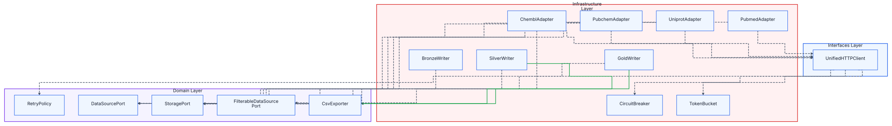

### Описание
Диаграмма «10 Infrastructure Layer Class Diagram» из views-набора представляет фокусированный срез родительской диаграммы для точечного анализа. Она представлена в формате блок-схема потоков (flowchart). Тип представления: Overview. Родительская диаграмма: `10-infrastructure-layer-class-diagram-full.mermaid`. Схема имеет плотность порядка 15 узлов и 17 связей; её удобно использовать как обзорный архитектурный срез для проверки влияния изменений, согласования интерфейсов и подготовки рефакторинга, но не как исчерпывающий каталог текущей кодовой поверхности. Ключевые блоки/подграфы: Domain Layer, Infrastructure Layer, Interfaces Layer. Показательные узлы для быстрого чтения: RetryPolicy, DataSourcePort, Bronze/Silver/GoldStoragePorts, FilterableDataSourcePort, CsvExporter, ChemblAdapter.

### Метаданные
- Тип: `flowchart`
- Представление: `Overview`

\newpage

## 12-local-deployment-architecture-dataflow

**12 Local Deployment Architecture**

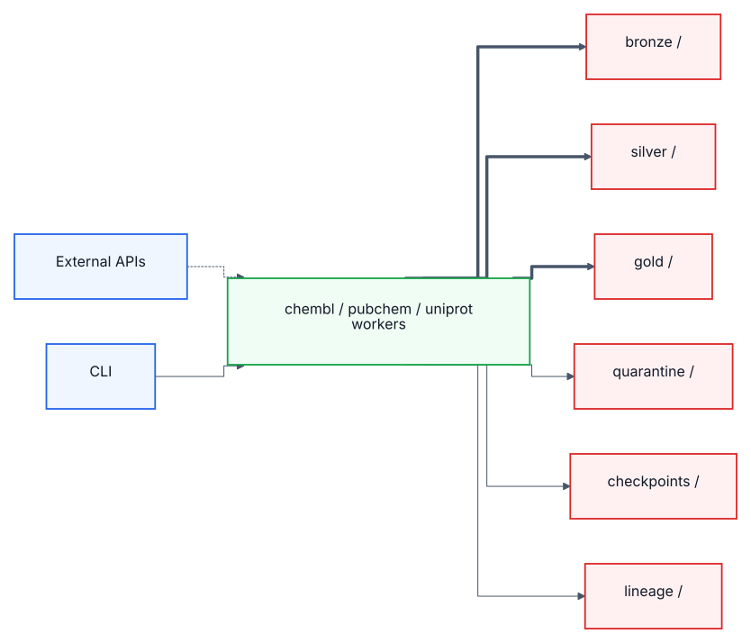

### Описание
Диаграмма «12 Local Deployment Architecture» из views-набора представляет фокусированный срез родительской диаграммы для точечного анализа. Она представлена в формате блок-схема потоков (flowchart). Тип представления: Data-Flow. Родительская диаграмма: `12-local-deployment-architecture-full.mermaid`. Схема имеет плотность порядка 2 узлов и 8 связей; её удобно использовать как обзорный архитектурный срез для проверки влияния изменений, согласования интерфейсов и подготовки рефакторинга, но не как исчерпывающий каталог текущей кодовой поверхности. Показательные узлы для быстрого чтения: External APIs, CLI.

### Метаданные
- Тип: `flowchart`
- Представление: `Data-Flow`

\newpage

## 12-local-deployment-architecture-domain

**12 Local Deployment Architecture**

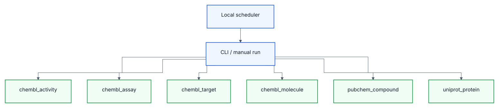

### Описание
Диаграмма «12 Local Deployment Architecture» из views-набора представляет фокусированный срез родительской диаграммы для точечного анализа. Она представлена в формате блок-схема потоков (flowchart). Тип представления: Domain-Focus. Родительская диаграмма: `12-local-deployment-architecture-full.mermaid`. Схема имеет плотность порядка 1 узлов и 7 связей; её удобно использовать как обзорный архитектурный срез для проверки влияния изменений, согласования интерфейсов и подготовки рефакторинга, но не как исчерпывающий каталог текущей кодовой поверхности. Показательные узлы для быстрого чтения: Local scheduler.

### Метаданные
- Тип: `flowchart`
- Представление: `Domain-Focus`

\newpage

## 12-local-deployment-architecture-full

**Local Deployment Architecture**

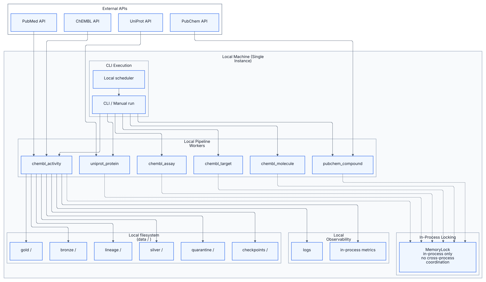

### Описание
Диаграмма «Local Deployment Architecture» из views-набора представляет фокусированный срез родительской диаграммы для точечного анализа. Она представлена в формате блок-схема потоков (flowchart) и служит ориентиром на уровне детализации «Mixed (System / Component / Class)». Тип представления: Full. Родительская диаграмма: `(root)`. В комментариях исходника зафиксирован фокус диаграммы: local-only runtime, in-process locking, local filesystem outputs. Схема имеет плотность порядка 21 узлов и 25 связей; её удобно использовать как обзорный архитектурный срез для проверки влияния изменений, согласования интерфейсов и подготовки рефакторинга, но не как исчерпывающий каталог текущей кодовой поверхности. Ключевые блоки/подграфы: External APIs, Local Machine (Single Instance), CLI Execution, Local Pipeline Workers, In-Process Locking, Local filesystem (data/). Показательные узлы для быстрого чтения: ChEMBL API, PubChem API, UniProt API, PubMed API, CLI / Manual run, Local scheduler.

### Метаданные
- Тип: `flowchart`
- Уровень: `Mixed (System / Component / Class)`
- Дата: `2026-03-16`
- Представление: `Full`

\newpage

## 12-local-deployment-architecture-infra

**12 Local Deployment Architecture**

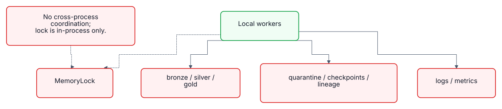

### Описание
Диаграмма «12 Local Deployment Architecture» из views-набора представляет фокусированный срез родительской диаграммы для точечного анализа. Она представлена в формате блок-схема потоков (flowchart). Тип представления: Infrastructure-Mapping. Родительская диаграмма: `12-local-deployment-architecture-full.mermaid`. Схема имеет плотность порядка 2 узлов и 5 связей; её удобно использовать как обзорный архитектурный срез для проверки влияния изменений, согласования интерфейсов и подготовки рефакторинга, но не как исчерпывающий каталог текущей кодовой поверхности. Показательные узлы для быстрого чтения: Local workers, No cross-process coordination; lock is in-process only..

### Метаданные
- Тип: `flowchart`
- Представление: `Infrastructure-Mapping`

\newpage

## 12-local-deployment-architecture-overview

**12 Local Deployment Architecture**

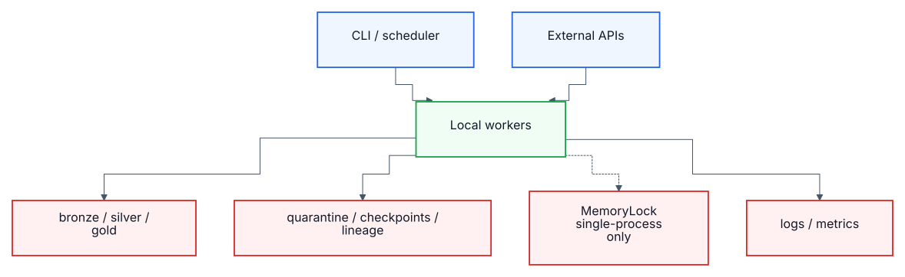

### Описание
Диаграмма «12 Local Deployment Architecture» из views-набора представляет фокусированный срез родительской диаграммы для точечного анализа. Она представлена в формате блок-схема потоков (flowchart). Тип представления: Overview. Родительская диаграмма: `12-local-deployment-architecture-full.mermaid`. Схема имеет плотность порядка 2 узлов и 6 связей; её удобно использовать как обзорный архитектурный срез для проверки влияния изменений, согласования интерфейсов и подготовки рефакторинга, но не как исчерпывающий каталог текущей кодовой поверхности. Показательные узлы для быстрого чтения: CLI / scheduler, External APIs.

### Метаданные
- Тип: `flowchart`
- Представление: `Overview`

\newpage

## 13-port-protocol-contracts-full

**13 Port Protocol Contracts**

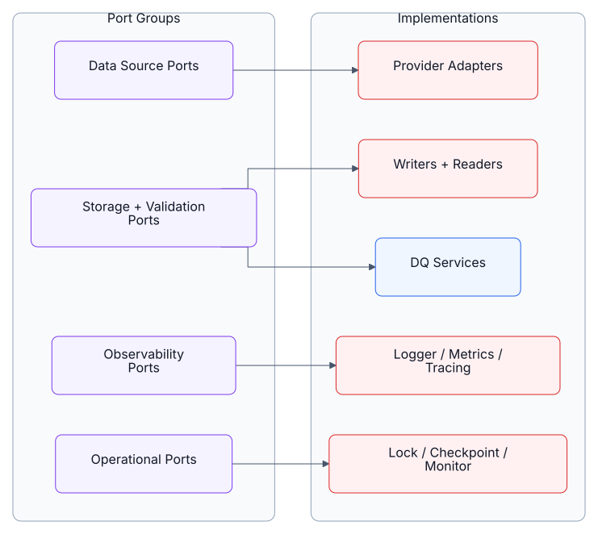

### Описание
Диаграмма «13 Port Protocol Contracts» из views-набора представляет фокусированный срез родительской диаграммы для точечного анализа. Она представлена в формате блок-схема потоков (flowchart). Тип представления: Full. Родительская диаграмма: `13-port-protocol-contracts.mmd`. В комментариях исходника зафиксирован фокус диаграммы: Full reference diagram retained after decomposition.. Схема имеет плотность порядка 9 узлов и 5 связей; её удобно использовать как обзорный архитектурный срез для проверки влияния изменений, согласования интерфейсов и подготовки рефакторинга, но не как исчерпывающий каталог текущей кодовой поверхности. Ключевые блоки/подграфы: Port Groups, Implementations. Показательные узлы для быстрого чтения: Data Source Ports, Storage + Validation Ports, Observability Ports, Operational Ports, Provider Adapters, Writers + Readers.

### Метаданные
- Тип: `flowchart`
- Представление: `Full`

\newpage

## 13-port-protocol-contracts-overview

**13 Port Protocol Contracts**

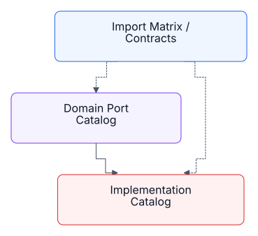

### Описание
Диаграмма «13 Port Protocol Contracts» из views-набора представляет фокусированный срез родительской диаграммы для точечного анализа. Она представлена в формате блок-схема потоков (flowchart). Тип представления: Overview. Родительская диаграмма: `13-port-protocol-contracts.mmd`. Схема имеет плотность порядка 3 узлов и 3 связей; её удобно использовать как обзорный архитектурный срез для проверки влияния изменений, согласования интерфейсов и подготовки рефакторинга, но не как исчерпывающий каталог текущей кодовой поверхности. Показательные узлы для быстрого чтения: Domain Port Catalog, Implementation Catalog, Import Matrix / Contracts.

### Метаданные
- Тип: `flowchart`
- Представление: `Overview`

\newpage

## 14-provider-health-states-dataflow

**14 Provider Health States**

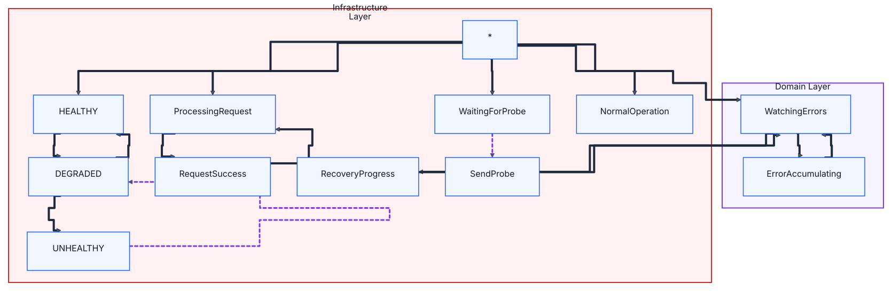

### Описание
Диаграмма «14 Provider Health States» из views-набора представляет фокусированный срез родительской диаграммы для точечного анализа. Она представлена в формате блок-схема потоков (flowchart). Тип представления: Data-Flow. Родительская диаграмма: `14-provider-health-states-full.mermaid`. Схема имеет плотность порядка 12 узлов и 16 связей; её удобно использовать как обзорный архитектурный срез для проверки влияния изменений, согласования интерфейсов и подготовки рефакторинга, но не как исчерпывающий каталог текущей кодовой поверхности. Ключевые блоки/подграфы: Domain Layer, Infrastructure Layer. Показательные узлы для быстрого чтения: WatchingErrors, ErrorAccumulating, *, ProcessingRequest, HEALTHY, DEGRADED.

### Метаданные
- Тип: `flowchart`
- Представление: `Data-Flow`

\newpage

## 14-provider-health-states-domain

**14 Provider Health States**

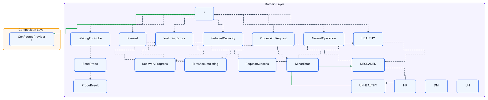

### Описание
Диаграмма «14 Provider Health States» из views-набора представляет фокусированный срез родительской диаграммы для точечного анализа. Она представлена в формате блок-схема потоков (flowchart). Тип представления: Domain-Focus. Родительская диаграмма: `14-provider-health-states-full.mermaid`. Схема имеет плотность порядка 20 узлов и 21 связей; её удобно использовать как обзорный архитектурный срез для проверки влияния изменений, согласования интерфейсов и подготовки рефакторинга, но не как исчерпывающий каталог текущей кодовой поверхности. Ключевые блоки/подграфы: Domain Layer, Composition Layer. Показательные узлы для быстрого чтения: WatchingErrors, HEALTHY, ErrorAccumulating, UNHEALTHY, MinorError, *.

### Метаданные
- Тип: `flowchart`
- Представление: `Domain-Focus`

\newpage

## 14-provider-health-states-full

**Provider Health State Machine**

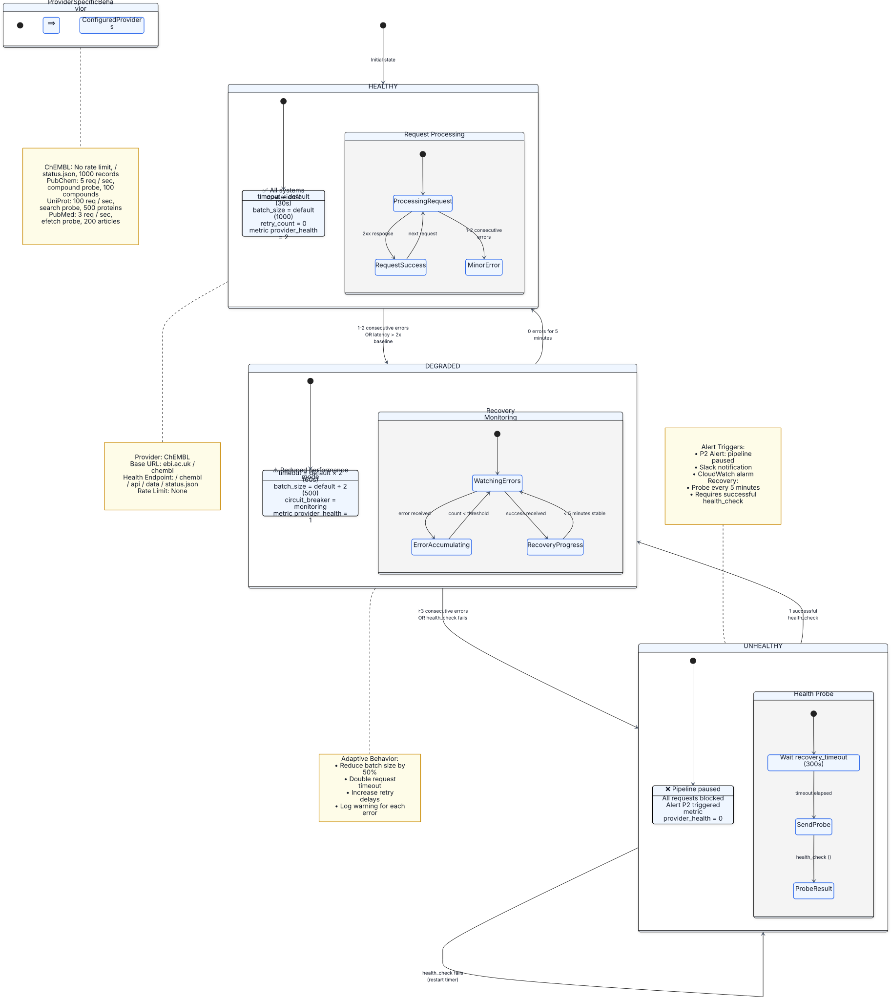

### Описание
Диаграмма «Provider Health State Machine» из views-набора представляет фокусированный срез родительской диаграммы для точечного анализа. Она представлена в формате диаграмма состояний (state diagram) и служит ориентиром на уровне детализации «Mixed (System / Component / Class)». Тип представления: Full. Родительская диаграмма: `(root)`. В комментариях исходника зафиксирован фокус диаграммы: RULES.md §3.6 (Resilience), §4 (Provider Specifications).

### Метаданные
- Тип: `stateDiagram`
- Уровень: `Mixed (System / Component / Class)`
- Дата: `2026-02-24`
- Представление: `Full`

\newpage

## 14-provider-health-states-infra

**14 Provider Health States**

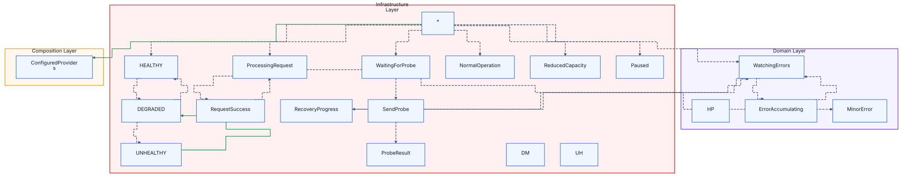

### Описание
Диаграмма «14 Provider Health States» из views-набора представляет фокусированный срез родительской диаграммы для точечного анализа. Она представлена в формате блок-схема потоков (flowchart). Тип представления: Infrastructure-Mapping. Родительская диаграмма: `14-provider-health-states-full.mermaid`. Схема имеет плотность порядка 20 узлов и 21 связей; её удобно использовать как обзорный архитектурный срез для проверки влияния изменений, согласования интерфейсов и подготовки рефакторинга, но не как исчерпывающий каталог текущей кодовой поверхности. Ключевые блоки/подграфы: Domain Layer, Infrastructure Layer, Composition Layer. Показательные узлы для быстрого чтения: HP, WatchingErrors, ErrorAccumulating, MinorError, *, ProcessingRequest.

### Метаданные
- Тип: `flowchart`
- Представление: `Infrastructure-Mapping`

\newpage

## 14-provider-health-states-overview

**14 Provider Health States**

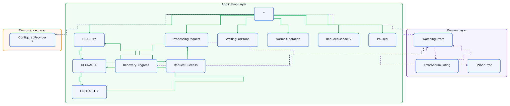

### Описание
Диаграмма «14 Provider Health States» из views-набора представляет фокусированный срез родительской диаграммы для точечного анализа. Она представлена в формате блок-схема потоков (flowchart). Тип представления: Overview. Родительская диаграмма: `14-provider-health-states-full.mermaid`. Схема имеет плотность порядка 15 узлов и 19 связей; её удобно использовать как обзорный архитектурный срез для проверки влияния изменений, согласования интерфейсов и подготовки рефакторинга, но не как исчерпывающий каталог текущей кодовой поверхности. Ключевые блоки/подграфы: Domain Layer, Application Layer, Composition Layer. Показательные узлы для быстрого чтения: WatchingErrors, ErrorAccumulating, MinorError, *, ProcessingRequest, HEALTHY.

### Метаданные
- Тип: `flowchart`
- Представление: `Overview`

\newpage

## 15-dq-check-workflow-dataflow

**15 Dq Check Workflow**

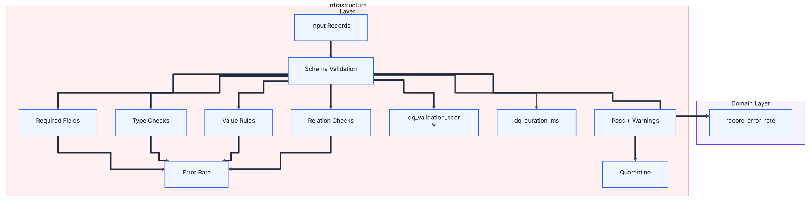

### Описание
Диаграмма «15 Dq Check Workflow» из views-набора представляет фокусированный срез родительской диаграммы для точечного анализа. Она представлена в формате блок-схема потоков (flowchart). Тип представления: Data-Flow. Родительская диаграмма: `15-dq-check-workflow-full.mermaid`. Схема имеет плотность порядка 12 узлов и 13 связей; её удобно использовать как обзорный архитектурный срез для проверки влияния изменений, согласования интерфейсов и подготовки рефакторинга, но не как исчерпывающий каталог текущей кодовой поверхности. Ключевые блоки/подграфы: Domain Layer, Infrastructure Layer. Показательные узлы для быстрого чтения: record_error_rate, Schema Validation, Required Fields, Error Rate, Type Checks, Value Rules.

### Метаданные
- Тип: `flowchart`
- Представление: `Data-Flow`

\newpage

## 15-dq-check-workflow-domain

**15 Dq Check Workflow**

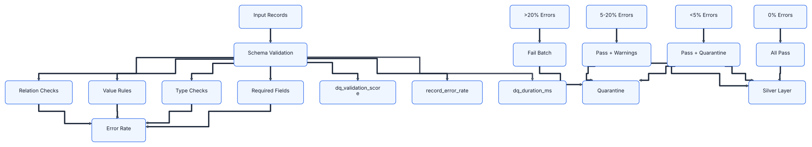

### Описание
Диаграмма «15 Dq Check Workflow» из views-набора представляет фокусированный срез родительской диаграммы для точечного анализа. Она представлена в формате блок-схема потоков (flowchart). Тип представления: Domain-Focus. Родительская диаграмма: `15-dq-check-workflow-full.mermaid`. Схема имеет плотность порядка 20 узлов и 22 связей; её удобно использовать как обзорный архитектурный срез для проверки влияния изменений, согласования интерфейсов и подготовки рефакторинга, но не как исчерпывающий каталог текущей кодовой поверхности. Показательные узлы для быстрого чтения: Schema Validation, Required Fields, Error Rate, Type Checks, Value Rules, Relation Checks.

### Метаданные
- Тип: `flowchart`
- Представление: `Domain-Focus`

\newpage

## 15-dq-check-workflow-full

**Data Quality Check Workflow**

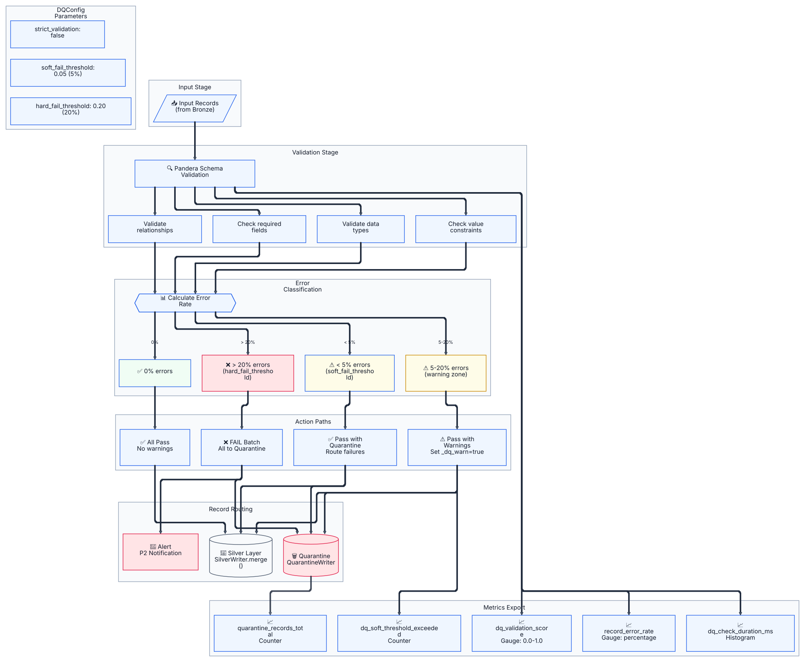

### Описание
Диаграмма «Data Quality Check Workflow» из views-набора представляет фокусированный срез родительской диаграммы для точечного анализа. Она представлена в формате блок-схема потоков (flowchart) и служит ориентиром на уровне детализации «Mixed (System / Component / Class)». Тип представления: Full. Родительская диаграмма: `(root)`. В комментариях исходника зафиксирован фокус диаграммы: RULES.md §3.1 (DQ Checks), §2.3 (Quarantine). Схема имеет плотность порядка 25 узлов и 29 связей; её удобно использовать как обзорный архитектурный срез для проверки влияния изменений, согласования интерфейсов и подготовки рефакторинга, но не как исчерпывающий каталог текущей кодовой поверхности. Ключевые блоки/подграфы: Input Stage, Validation Stage, Error Classification, Action Paths, Record Routing, Metrics Export. Показательные узлы для быстрого чтения: /"📥 Input Records (from Bronze)"/, 🔍 Pandera Schema Validation, Check required fields, Validate data types, Check value constraints, Validate relationships.

### Метаданные
- Тип: `flowchart`
- Уровень: `Mixed (System / Component / Class)`
- Дата: `2026-02-24`
- Представление: `Full`

\newpage

## 15-dq-check-workflow-infra

**15 Dq Check Workflow**

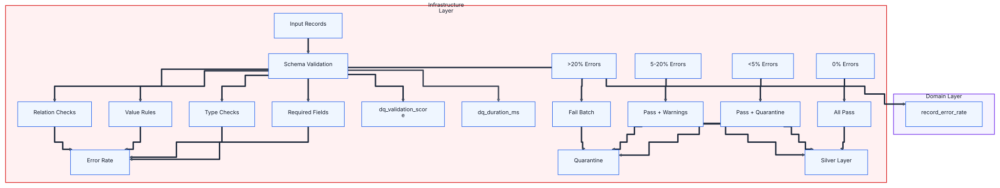

### Описание
Диаграмма «15 Dq Check Workflow» из views-набора представляет фокусированный срез родительской диаграммы для точечного анализа. Она представлена в формате блок-схема потоков (flowchart). Тип представления: Infrastructure-Mapping. Родительская диаграмма: `15-dq-check-workflow-full.mermaid`. Схема имеет плотность порядка 20 узлов и 22 связей; её удобно использовать как обзорный архитектурный срез для проверки влияния изменений, согласования интерфейсов и подготовки рефакторинга, но не как исчерпывающий каталог текущей кодовой поверхности. Ключевые блоки/подграфы: Domain Layer, Infrastructure Layer. Показательные узлы для быстрого чтения: record_error_rate, Schema Validation, Required Fields, Error Rate, Type Checks, Value Rules.

### Метаданные
- Тип: `flowchart`
- Представление: `Infrastructure-Mapping`

\newpage

## 15-dq-check-workflow-overview

**15 Dq Check Workflow**

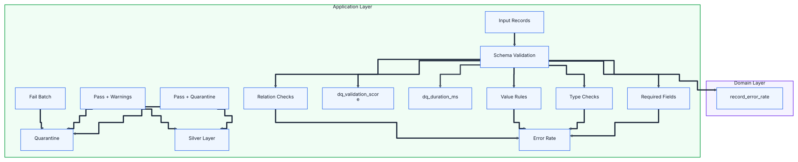

### Описание
Диаграмма «15 Dq Check Workflow» из views-набора представляет фокусированный срез родительской диаграммы для точечного анализа. Она представлена в формате блок-схема потоков (flowchart). Тип представления: Overview. Родительская диаграмма: `15-dq-check-workflow-full.mermaid`. Схема имеет плотность порядка 15 узлов и 17 связей; её удобно использовать как обзорный архитектурный срез для проверки влияния изменений, согласования интерфейсов и подготовки рефакторинга, но не как исчерпывающий каталог текущей кодовой поверхности. Ключевые блоки/подграфы: Domain Layer, Application Layer. Показательные узлы для быстрого чтения: record_error_rate, Schema Validation, Required Fields, Type Checks, Value Rules, Relation Checks.

### Метаданные
- Тип: `flowchart`
- Представление: `Overview`

\newpage

## 16-transformer-hierarchy-full

**16 Transformer Hierarchy**

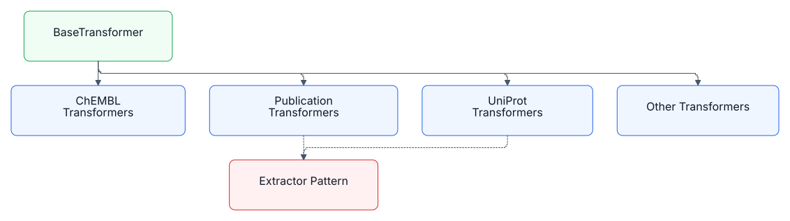

### Описание
Диаграмма «16 Transformer Hierarchy» из views-набора представляет фокусированный срез родительской диаграммы для точечного анализа. Она представлена в формате блок-схема потоков (flowchart). Тип представления: Full. Родительская диаграмма: `16-transformer-hierarchy.mmd`. В комментариях исходника зафиксирован фокус диаграммы: Full reference diagram retained after decomposition.. Схема имеет плотность порядка 6 узлов и 6 связей; её удобно использовать как обзорный архитектурный срез для проверки влияния изменений, согласования интерфейсов и подготовки рефакторинга, но не как исчерпывающий каталог текущей кодовой поверхности. Показательные узлы для быстрого чтения: BaseTransformer, ChEMBL Transformers, Publication Transformers, UniProt Transformers, Other Transformers, Extractor Pattern.

### Метаданные
- Тип: `flowchart`
- Представление: `Full`

\newpage

## 16-transformer-hierarchy-overview

**16 Transformer Hierarchy**

### Описание
Диаграмма «16 Transformer Hierarchy» из views-набора представляет фокусированный срез родительской диаграммы для точечного анализа. Она представлена в формате блок-схема потоков (flowchart). Тип представления: Overview. Родительская диаграмма: `16-transformer-hierarchy.mmd`. Схема имеет плотность порядка 3 узлов и 2 связей; её удобно использовать как обзорный архитектурный срез для проверки влияния изменений, согласования интерфейсов и подготовки рефакторинга, но не как исчерпывающий каталог текущей кодовой поверхности. Показательные узлы для быстрого чтения: Template Method, Transformer Families, Reusable Extractors.

### Метаданные
- Тип: `flowchart`
- Представление: `Overview`

\newpage

## 21-activity-entity-data-flow-dataflow

**21 Activity Entity Data Flow**

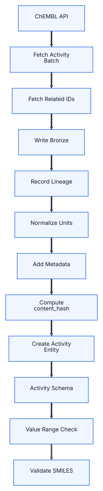

### Описание
Диаграмма «21 Activity Entity Data Flow» из views-набора представляет фокусированный срез родительской диаграммы для точечного анализа. Она представлена в формате блок-схема потоков (flowchart). Тип представления: Data-Flow. Родительская диаграмма: `21-activity-entity-data-flow-full.mermaid`. Схема имеет плотность порядка 12 узлов и 11 связей; её удобно использовать как обзорный архитектурный срез для проверки влияния изменений, согласования интерфейсов и подготовки рефакторинга, но не как исчерпывающий каталог текущей кодовой поверхности. Показательные узлы для быстрого чтения: Fetch Activity Batch, Fetch Related IDs, Write Bronze, Record Lineage, Normalize Units, Add Metadata.

### Метаданные
- Тип: `flowchart`
- Представление: `Data-Flow`

\newpage

## 21-activity-entity-data-flow-domain

**21 Activity Entity Data Flow**

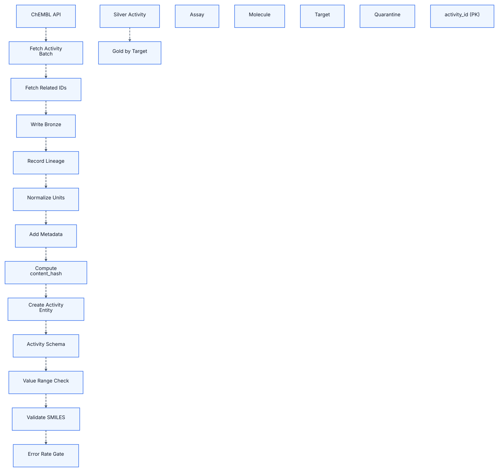

### Описание
Диаграмма «21 Activity Entity Data Flow» из views-набора представляет фокусированный срез родительской диаграммы для точечного анализа. Она представлена в формате блок-схема потоков (flowchart). Тип представления: Domain-Focus. Родительская диаграмма: `21-activity-entity-data-flow-full.mermaid`. Схема имеет плотность порядка 20 узлов и 13 связей; её удобно использовать как обзорный архитектурный срез для проверки влияния изменений, согласования интерфейсов и подготовки рефакторинга, но не как исчерпывающий каталог текущей кодовой поверхности. Показательные узлы для быстрого чтения: Fetch Activity Batch, Fetch Related IDs, Write Bronze, Record Lineage, Normalize Units, Add Metadata.

### Метаданные
- Тип: `flowchart`
- Представление: `Domain-Focus`

\newpage

## 21-activity-entity-data-flow-full

**Activity Entity Data Flow (Extract → Transform → Load)**

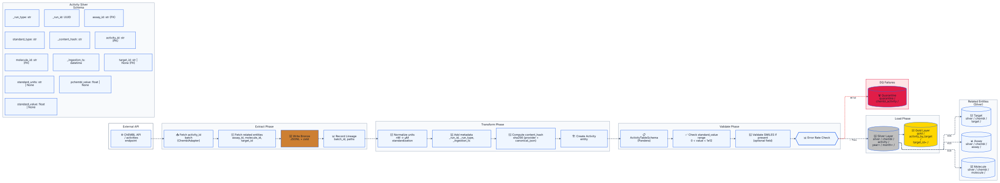

### Описание
Диаграмма «Activity Entity Data Flow (Extract → Transform → Load)» из views-набора представляет фокусированный срез родительской диаграммы для точечного анализа. Она представлена в формате блок-схема потоков (flowchart) и служит ориентиром на уровне детализации «Mixed (System / Component / Class)». Тип представления: Full. Родительская диаграмма: `(root)`. В комментариях исходника зафиксирован фокус диаграммы: RULES.md §2.8 (Transformation), §4.1 (ChEMBL Activity). Схема имеет плотность порядка 30 узлов и 18 связей; её удобно использовать как обзорный архитектурный срез для проверки влияния изменений, согласования интерфейсов и подготовки рефакторинга, но не как исчерпывающий каталог текущей кодовой поверхности. Ключевые блоки/подграфы: External API, Extract Phase, Transform Phase, Validate Phase, Load Phase, Related Entities (Silver). Показательные узлы для быстрого чтения: 🌐 ChEMBL API /activities endpoint, 📥 Fetch activity_id batch (ChemblAdapter), 🔗 Fetch related entities assay_id, molecule_id, target_id, 💾 Write Bronze JSONL + zstd, 📊 Record Lineage batch_id, paths, 🔧 Normalize units nM → μM standardization.

### Метаданные
- Тип: `flowchart`
- Уровень: `Mixed (System / Component / Class)`
- Дата: `2026-02-24`
- Представление: `Full`

\newpage

## 21-activity-entity-data-flow-infra

**21 Activity Entity Data Flow**

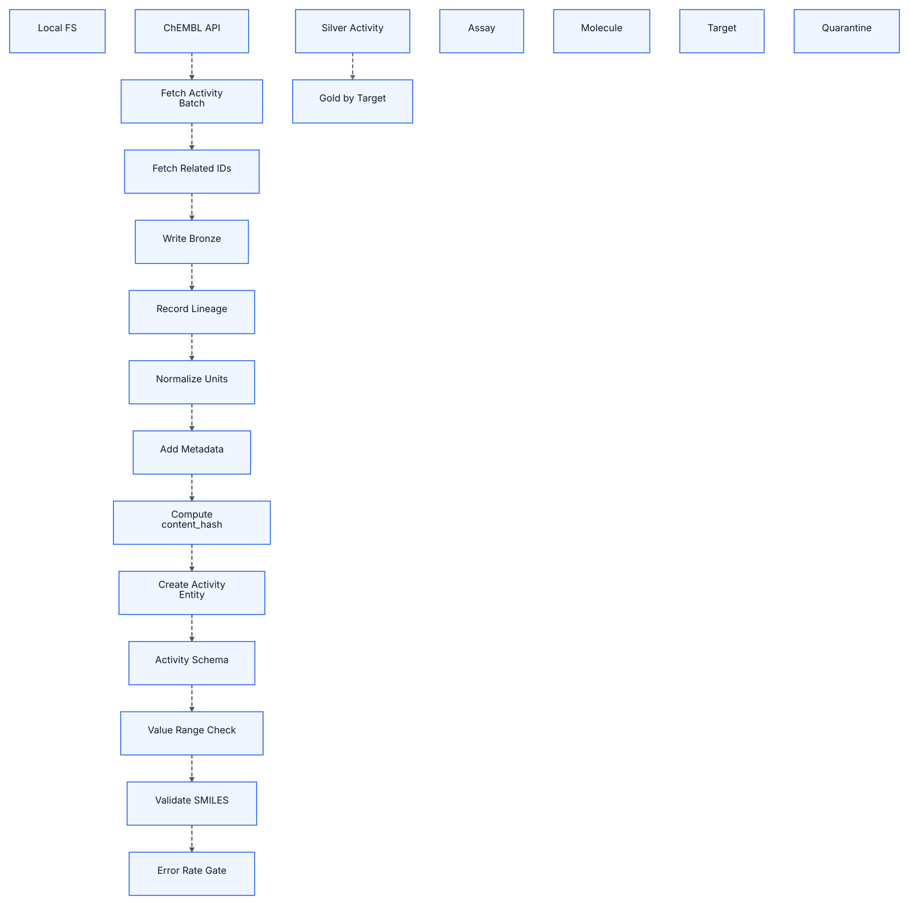

### Описание
Диаграмма «21 Activity Entity Data Flow» из views-набора представляет фокусированный срез родительской диаграммы для точечного анализа. Она представлена в формате блок-схема потоков (flowchart). Тип представления: Infrastructure-Mapping. Родительская диаграмма: `21-activity-entity-data-flow-full.mermaid`. Схема имеет плотность порядка 20 узлов и 13 связей; её удобно использовать как обзорный архитектурный срез для проверки влияния изменений, согласования интерфейсов и подготовки рефакторинга, но не как исчерпывающий каталог текущей кодовой поверхности. Показательные узлы для быстрого чтения: Local FS, Fetch Activity Batch, Fetch Related IDs, Write Bronze, Record Lineage, Normalize Units.

### Метаданные
- Тип: `flowchart`
- Представление: `Infrastructure-Mapping`

\newpage

## 21-activity-entity-data-flow-overview

**21 Activity Entity Data Flow**

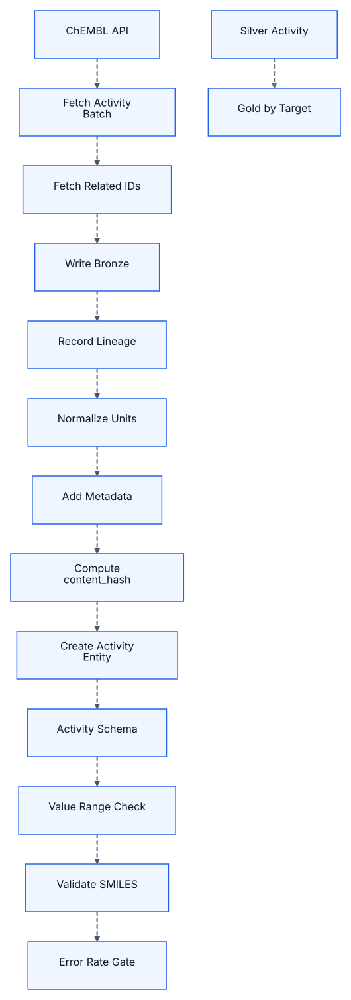

### Описание
Диаграмма «21 Activity Entity Data Flow» из views-набора представляет фокусированный срез родительской диаграммы для точечного анализа. Она представлена в формате блок-схема потоков (flowchart). Тип представления: Overview. Родительская диаграмма: `21-activity-entity-data-flow-full.mermaid`. Схема имеет плотность порядка 15 узлов и 13 связей; её удобно использовать как обзорный архитектурный срез для проверки влияния изменений, согласования интерфейсов и подготовки рефакторинга, но не как исчерпывающий каталог текущей кодовой поверхности. Показательные узлы для быстрого чтения: Fetch Activity Batch, Fetch Related IDs, Write Bronze, Record Lineage, Normalize Units, Add Metadata.

### Метаданные
- Тип: `flowchart`
- Представление: `Overview`

\newpage

## 21-idempotent-processing-guards-overview

**21 Idempotent Processing Guards**

### Описание
Диаграмма «21 Idempotent Processing Guards» из views-набора представляет фокусированный срез родительской диаграммы для точечного анализа. Она представлена в формате блок-схема потоков (flowchart). Тип представления: Overview. Родительская диаграмма: `../architecture/21-idempotent-processing-guards.mmd`. Схема имеет плотность порядка 1 узлов и 6 связей; её удобно использовать как обзорный архитектурный срез для проверки влияния изменений, согласования интерфейсов и подготовки рефакторинга, но не как исчерпывающий каталог текущей кодовой поверхности. Показательные узлы для быстрого чтения: Run / resume request.

### Метаданные
- Тип: `flowchart`
- Представление: `Overview`

\newpage

## 23-reproducible-run-contract-overview

**23 Reproducible Run Contract**

### Описание
Диаграмма «23 Reproducible Run Contract» из views-набора представляет фокусированный срез родительской диаграммы для точечного анализа. Она представлена в формате блок-схема потоков (flowchart). Тип представления: Overview. Родительская диаграмма: `../architecture/23-reproducible-run-contract.mmd`. Схема имеет плотность порядка 1 узлов и 6 связей; её удобно использовать как обзорный архитектурный срез для проверки влияния изменений, согласования интерфейсов и подготовки рефакторинга, но не как исчерпывающий каталог текущей кодовой поверхности. Показательные узлы для быстрого чтения: Config inputs + source refs.

### Метаданные
- Тип: `flowchart`
- Представление: `Overview`

\newpage

## 24-data-runtime-quality-map-overview

**24 Data Runtime Quality Map**

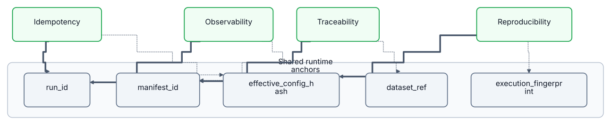

### Описание
Диаграмма «24 Data Runtime Quality Map» из views-набора представляет фокусированный срез родительской диаграммы для точечного анализа. Она представлена в формате блок-схема потоков (flowchart). Тип представления: Overview. Родительская диаграмма: `quality-runtime-views`. Схема имеет плотность порядка 9 узлов и 8 связей; её удобно использовать как обзорный архитектурный срез для проверки влияния изменений, согласования интерфейсов и подготовки рефакторинга, но не как исчерпывающий каталог текущей кодовой поверхности. Ключевые блоки/подграфы: Shared runtime anchors. Показательные узлы для быстрого чтения: run_id, manifest_id, effective_config_hash, execution_fingerprint, dataset_ref, Traceability.

### Метаданные
- Тип: `flowchart`
- Представление: `Overview`

\newpage

## 26-hexagonal-ports-adapters-dataflow

**26 Hexagonal Ports Adapters**

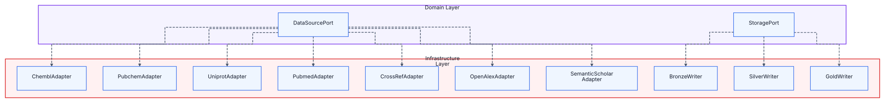

### Описание
Диаграмма «26 Hexagonal Ports Adapters» из views-набора представляет фокусированный срез родительской диаграммы для точечного анализа. Она представлена в формате блок-схема потоков (flowchart). Тип представления: Data-Flow. Родительская диаграмма: `26-hexagonal-ports-adapters-full.mermaid`. Схема имеет плотность порядка 12 узлов и 10 связей; её удобно использовать как обзорный архитектурный срез для проверки влияния изменений, согласования интерфейсов и подготовки рефакторинга, но не как исчерпывающий каталог текущей кодовой поверхности. Ключевые блоки/подграфы: Domain Layer, Infrastructure Layer. Показательные узлы для быстрого чтения: DataSourcePort, Bronze/Silver/GoldStoragePorts, ChemblAdapter, PubchemAdapter, UniprotAdapter, PubmedAdapter.

### Метаданные
- Тип: `flowchart`
- Представление: `Data-Flow`

\newpage

## 26-hexagonal-ports-adapters-domain

**26 Hexagonal Ports Adapters**

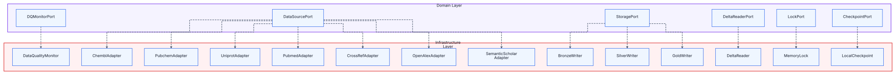

### Описание
Диаграмма «26 Hexagonal Ports Adapters» из views-набора представляет фокусированный срез родительской диаграммы для точечного анализа. Она представлена в формате блок-схема потоков (flowchart). Тип представления: Domain-Focus. Родительская диаграмма: `26-hexagonal-ports-adapters-full.mermaid`. Схема имеет плотность порядка 20 узлов и 14 связей; её удобно использовать как обзорный архитектурный срез для проверки влияния изменений, согласования интерфейсов и подготовки рефакторинга, но не как исчерпывающий каталог текущей кодовой поверхности. Ключевые блоки/подграфы: Domain Layer, Infrastructure Layer. Показательные узлы для быстрого чтения: DQMonitorPort, DataSourcePort, Bronze/Silver/Gold/MergedStoragePorts, DeltaReaderPort, LockPort, CheckpointPort.

### Метаданные
- Тип: `flowchart`
- Представление: `Domain-Focus`

\newpage

## 26-hexagonal-ports-adapters-full

**Hexagonal Architecture — Ports and Adapters Overview**

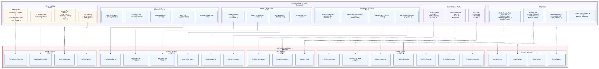

### Описание
Диаграмма «Hexagonal Architecture — Ports and Adapters Overview» из views-набора представляет фокусированный срез родительской диаграммы для точечного анализа. Она представлена в формате блок-схема потоков (flowchart) и служит ориентиром на уровне детализации «Mixed (System / Component / Class)». Тип представления: Full. Родительская диаграмма: `(root)`. В комментариях исходника зафиксирован фокус диаграммы: RULES.md §1.2 (Ports & Adapters), §1.1 (Five-Layer Architecture). Схема имеет плотность порядка 47 узлов и 16 связей; её удобно использовать как обзорный архитектурный срез для проверки влияния изменений, согласования интерфейсов и подготовки рефакторинга, но не как исчерпывающий каталог текущей кодовой поверхности. Ключевые блоки/подграфы: Domain Layer — Ports (Protocol), Data Ports, Coordination Ports, Observability Ports, Quality & Security Ports, Metadata & Config Ports. Показательные узлы для быстрого чтения: DataSourcePort • fetch() → AsyncIterator • health_check() → HealthStatus, FilterableDataSourcePort • fetch_filtered(), DeltaReaderPort • read_table() • get_schema(), LockPort • acquire() • release() • renew(), CheckpointPort • save() • load() • delete(), QuarantinePort • write() • read_sample() • purge().

### Метаданные
- Тип: `flowchart`
- Уровень: `Mixed (System / Component / Class)`
- Дата: `2026-02-24`
- Представление: `Full`

\newpage

## 26-hexagonal-ports-adapters-infra

**26 Hexagonal Ports Adapters**

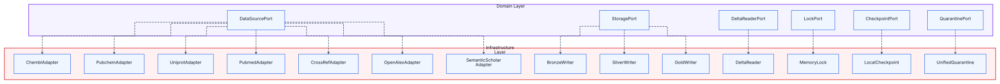

### Описание
Диаграмма «26 Hexagonal Ports Adapters» из views-набора представляет фокусированный срез родительской диаграммы для точечного анализа. Она представлена в формате блок-схема потоков (flowchart). Тип представления: Infrastructure-Mapping. Родительская диаграмма: `26-hexagonal-ports-adapters-full.mermaid`. Схема имеет плотность порядка 20 узлов и 14 связей; её удобно использовать как обзорный архитектурный срез для проверки влияния изменений, согласования интерфейсов и подготовки рефакторинга, но не как исчерпывающий каталог текущей кодовой поверхности. Ключевые блоки/подграфы: Domain Layer, Infrastructure Layer. Показательные узлы для быстрого чтения: DataSourcePort, Bronze/Silver/GoldStoragePorts, DeltaReaderPort, LockPort, CheckpointPort, QuarantinePort.

### Метаданные
- Тип: `flowchart`
- Представление: `Infrastructure-Mapping`

\newpage

## 26-hexagonal-ports-adapters-overview

**26 Hexagonal Ports Adapters**

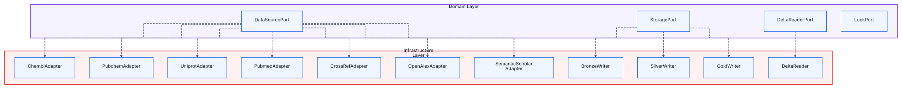

### Описание
Диаграмма «26 Hexagonal Ports Adapters» из views-набора представляет фокусированный срез родительской диаграммы для точечного анализа. Она представлена в формате блок-схема потоков (flowchart). Тип представления: Overview. Родительская диаграмма: `26-hexagonal-ports-adapters-full.mermaid`. Схема имеет плотность порядка 15 узлов и 11 связей; её удобно использовать как обзорный архитектурный срез для проверки влияния изменений, согласования интерфейсов и подготовки рефакторинга, но не как исчерпывающий каталог текущей кодовой поверхности. Ключевые блоки/подграфы: Domain Layer, Infrastructure Layer. Показательные узлы для быстрого чтения: DataSourcePort, Bronze/Silver/GoldStoragePorts, DeltaReaderPort, LockPort, ChemblAdapter, PubchemAdapter.

### Метаданные
- Тип: `flowchart`
- Представление: `Overview`

\newpage

## 28-composition-root-di-graph-dataflow

**28 Composition Root Di Graph**

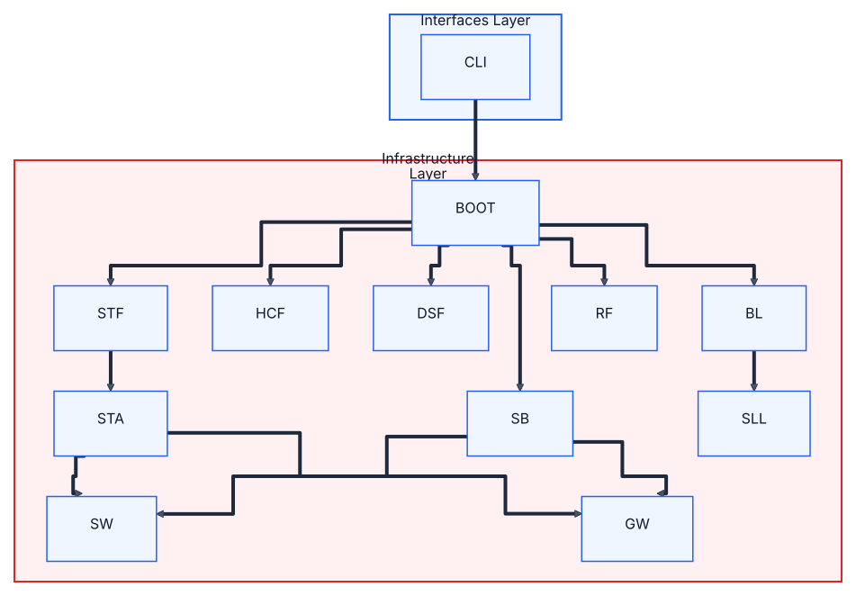

### Описание
Диаграмма «28 Composition Root Di Graph» из views-набора представляет фокусированный срез родительской диаграммы для точечного анализа. Она представлена в формате блок-схема потоков (flowchart). Тип представления: Data-Flow. Родительская диаграмма: `28-composition-root-di-graph-full.mermaid`. Схема имеет плотность порядка 12 узлов и 13 связей; её удобно использовать как обзорный архитектурный срез для проверки влияния изменений, согласования интерфейсов и подготовки рефакторинга, но не как исчерпывающий каталог текущей кодовой поверхности. Ключевые блоки/подграфы: Infrastructure Layer, Interfaces Layer. Показательные узлы для быстрого чтения: BOOT, SB, BL, HCF, DSF, STF.

### Метаданные
- Тип: `flowchart`
- Представление: `Data-Flow`

\newpage

## 28-composition-root-di-graph-domain

**28 Composition Root Di Graph**

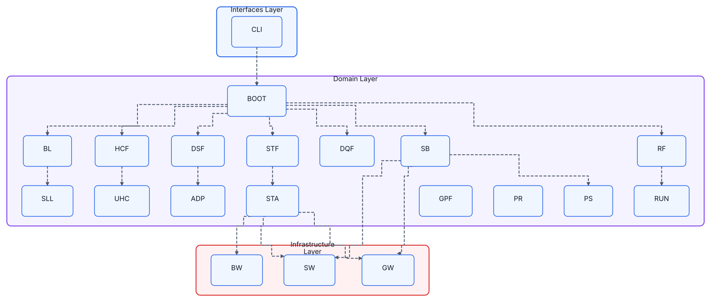

### Описание
Диаграмма «28 Composition Root Di Graph» из views-набора представляет фокусированный срез родительской диаграммы для точечного анализа. Она представлена в формате блок-схема потоков (flowchart). Тип представления: Domain-Focus. Родительская диаграмма: `28-composition-root-di-graph-full.mermaid`. Схема имеет плотность порядка 20 узлов и 19 связей; её удобно использовать как обзорный архитектурный срез для проверки влияния изменений, согласования интерфейсов и подготовки рефакторинга, но не как исчерпывающий каталог текущей кодовой поверхности. Ключевые блоки/подграфы: Domain Layer, Infrastructure Layer, Interfaces Layer. Показательные узлы для быстрого чтения: DQF, BOOT, SB, BL, HCF, DSF.

### Метаданные
- Тип: `flowchart`
- Представление: `Domain-Focus`

\newpage

## 28-composition-root-di-graph-full

**Composition Root Wiring — Full DI Graph**

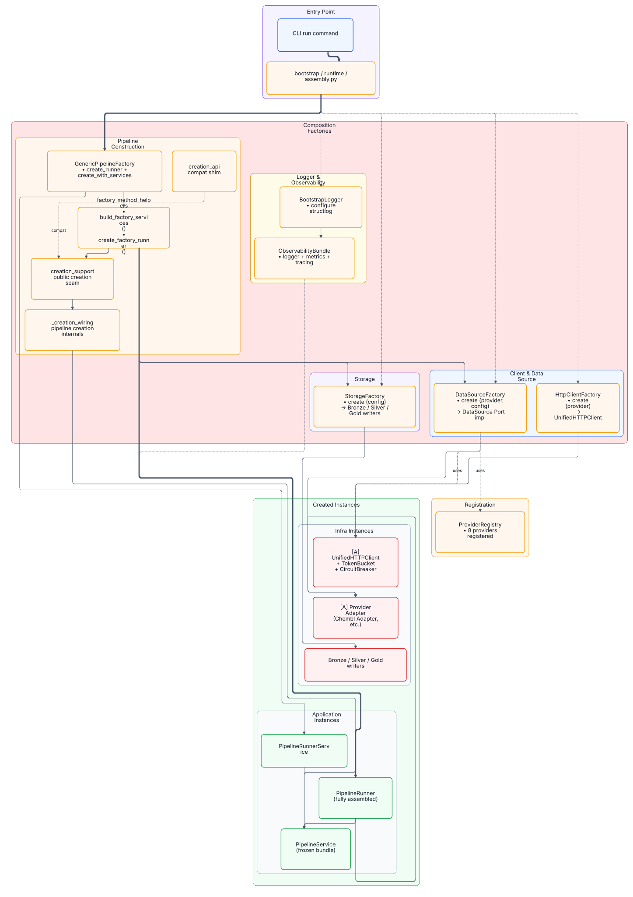

### Описание
Диаграмма «Composition Root Wiring — Full DI Graph» из views-набора представляет фокусированный срез родительской диаграммы для точечного анализа. Она представлена в формате блок-схема потоков (flowchart) и служит ориентиром на уровне детализации «Mixed (System / Component / Class)». Тип представления: Full. Родительская диаграмма: `(root)`. В комментариях исходника зафиксирован фокус диаграммы: RULES.md §1.1 (Composition Layer), ADR-005. Схема имеет плотность порядка 19 узлов и 31 связей; её удобно использовать как обзорный архитектурный срез для проверки влияния изменений, согласования интерфейсов и подготовки рефакторинга, но не как исчерпывающий каталог текущей кодовой поверхности. Ключевые блоки/подграфы: Entry Point, Composition Factories, Logger & Observability, Client & Data Source, Storage, Pipeline Construction. Показательные узлы для быстрого чтения: CLI run command, bootstrap/runtime/assembly.py, BootstrapLogger • configure structlog, ObservabilityBundle • logger + metrics + tracing, HttpClientFactory • create(provider) → UnifiedHTTPClient, DataSourceFactory • create(provider, config) → DataSourcePort impl.

### Метаданные
- Тип: `flowchart`
- Уровень: `Mixed (System / Component / Class)`
- Дата: `2026-03-24`
- Представление: `Full`

\newpage

## 28-composition-root-di-graph-infra

**28 Composition Root Di Graph**

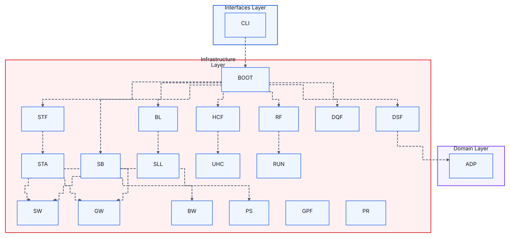

### Описание
Диаграмма «28 Composition Root Di Graph» из views-набора представляет фокусированный срез родительской диаграммы для точечного анализа. Она представлена в формате блок-схема потоков (flowchart). Тип представления: Infrastructure-Mapping. Родительская диаграмма: `28-composition-root-di-graph-full.mermaid`. Схема имеет плотность порядка 20 узлов и 19 связей; её удобно использовать как обзорный архитектурный срез для проверки влияния изменений, согласования интерфейсов и подготовки рефакторинга, но не как исчерпывающий каталог текущей кодовой поверхности. Ключевые блоки/подграфы: Domain Layer, Infrastructure Layer, Interfaces Layer. Показательные узлы для быстрого чтения: ADP, BOOT, SB, BL, HCF, DSF.

### Метаданные
- Тип: `flowchart`
- Представление: `Infrastructure-Mapping`

\newpage

## 28-composition-root-di-graph-overview

**28 Composition Root Di Graph**

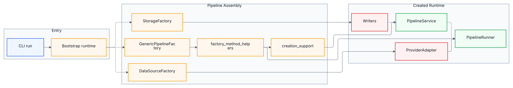

### Описание
Диаграмма «28 Composition Root Di Graph» из views-набора представляет фокусированный срез родительской диаграммы для точечного анализа. Она представлена в формате блок-схема потоков (flowchart). Тип представления: Overview. Родительская диаграмма: `28-composition-root-di-graph-full.mermaid`. В комментариях исходника зафиксирован фокус диаграммы: Decomposed overview for DI assembly path.. Схема имеет плотность порядка 11 узлов и 13 связей; её удобно использовать как обзорный архитектурный срез для проверки влияния изменений, согласования интерфейсов и подготовки рефакторинга, но не как исчерпывающий каталог текущей кодовой поверхности. Ключевые блоки/подграфы: Entry, Pipeline Assembly, Created Runtime. Показательные узлы для быстрого чтения: CLI run, Bootstrap runtime, GenericPipelineFactory, factory_method_helpers, creation_support, DataSourceFactory.

### Метаданные
- Тип: `flowchart`
- Представление: `Overview`

\newpage

## 29-composite-pipeline-workflow-dataflow

**29 Composite Pipeline Workflow**

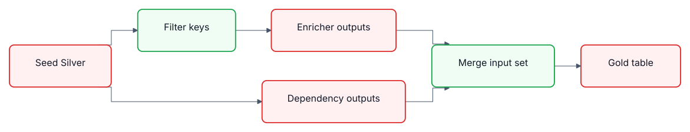

### Описание
Диаграмма «29 Composite Pipeline Workflow» из views-набора представляет фокусированный срез родительской диаграммы для точечного анализа. Она представлена в формате блок-схема потоков (flowchart). Тип представления: Data-Flow. Родительская диаграмма: `29-composite-pipeline-workflow-full.mermaid`. Схема имеет плотность порядка 1 узлов и 6 связей; её удобно использовать как обзорный архитектурный срез для проверки влияния изменений, согласования интерфейсов и подготовки рефакторинга, но не как исчерпывающий каталог текущей кодовой поверхности. Показательные узлы для быстрого чтения: Seed Silver.

### Метаданные
- Тип: `flowchart`
- Представление: `Data-Flow`

\newpage

## 29-composite-pipeline-workflow-domain

**29 Composite Pipeline Workflow**

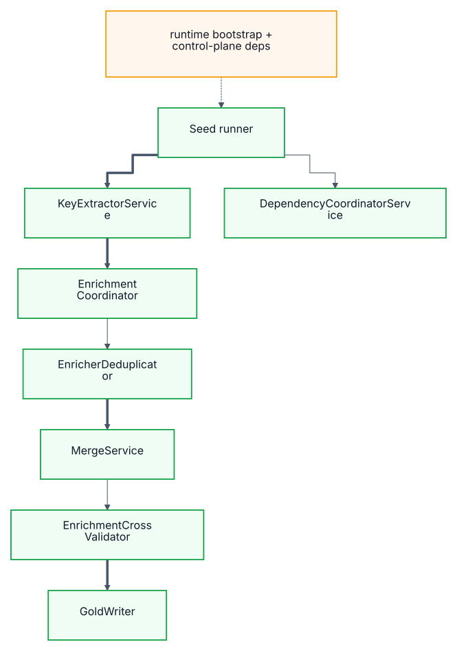

### Описание
Диаграмма «29 Composite Pipeline Workflow» из views-набора представляет фокусированный срез родительской диаграммы для точечного анализа. Она представлена в формате блок-схема потоков (flowchart). Тип представления: Domain-Focus. Родительская диаграмма: `29-composite-pipeline-workflow-full.mermaid`. Схема имеет плотность порядка 1 узлов и 8 связей; её удобно использовать как обзорный архитектурный срез для проверки влияния изменений, согласования интерфейсов и подготовки рефакторинга, но не как исчерпывающий каталог текущей кодовой поверхности. Показательные узлы для быстрого чтения: runtime bootstrap + control-plane deps.

### Метаданные
- Тип: `flowchart`
- Представление: `Domain-Focus`

\newpage

## 29-composite-pipeline-workflow-full

**Composite Pipeline Full Workflow — Seed to Gold (ADR-026)**

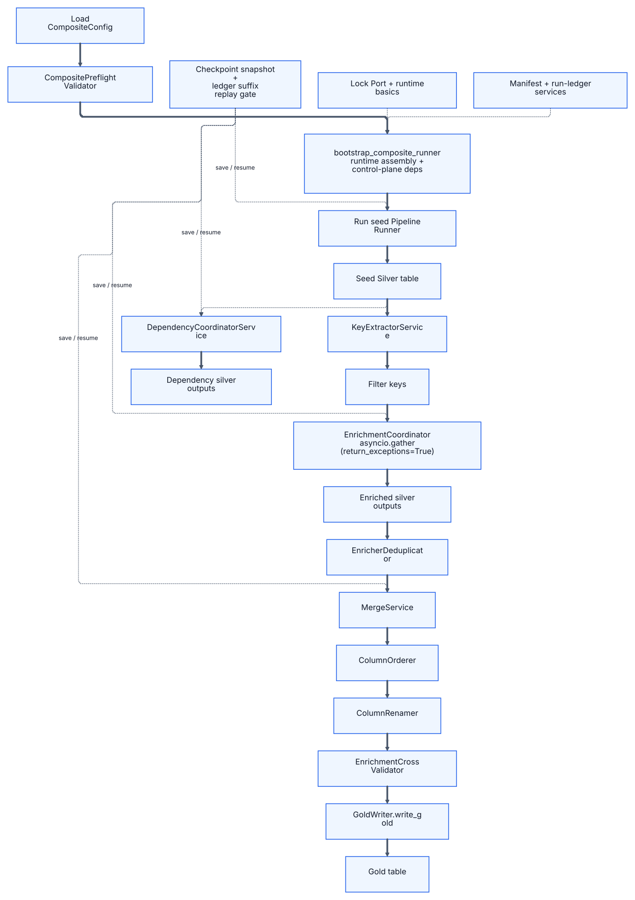

### Описание
Диаграмма «Composite Pipeline Full Workflow — Seed to Gold (ADR-026)» из views-набора представляет фокусированный срез родительской диаграммы для точечного анализа. Она представлена в формате блок-схема потоков (flowchart) и служит ориентиром на уровне детализации «Mixed (System / Component / Class)». Тип представления: Full. Родительская диаграмма: `(root)`. В комментариях исходника зафиксирован фокус диаграммы: application/composite runner, checkpoint snapshot + ledger replay, runtime bootstrap. Схема имеет плотность порядка 4 узлов и 23 связей; её удобно использовать как обзорный архитектурный срез для проверки влияния изменений, согласования интерфейсов и подготовки рефакторинга, но не как исчерпывающий каталог текущей кодовой поверхности. Показательные узлы для быстрого чтения: Load CompositeConfig, Checkpoint snapshot + ledger suffix replay gate, LockPort + runtime basics, Manifest + run-ledger services.

### Метаданные
- Тип: `flowchart`
- Уровень: `Mixed (System / Component / Class)`
- Дата: `2026-04-02`
- Представление: `Full`

\newpage

## 29-composite-pipeline-workflow-infra

**29 Composite Pipeline Workflow**

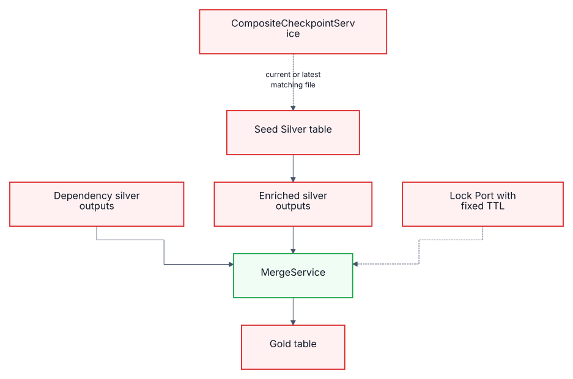

### Описание
Диаграмма «29 Composite Pipeline Workflow» из views-набора представляет фокусированный срез родительской диаграммы для точечного анализа. Она представлена в формате блок-схема потоков (flowchart). Тип представления: Infrastructure-Mapping. Родительская диаграмма: `29-composite-pipeline-workflow-full.mermaid`. Схема имеет плотность порядка 4 узлов и 6 связей; её удобно использовать как обзорный архитектурный срез для проверки влияния изменений, согласования интерфейсов и подготовки рефакторинга, но не как исчерпывающий каталог текущей кодовой поверхности. Показательные узлы для быстрого чтения: Seed Silver table, Dependency silver outputs, CompositeCheckpointService, LockPort with fixed TTL.

### Метаданные
- Тип: `flowchart`
- Представление: `Infrastructure-Mapping`

\newpage

## 29-composite-pipeline-workflow-overview

**29 Composite Pipeline Workflow**

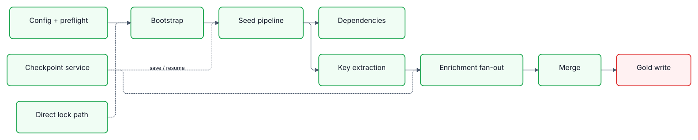

### Описание
Диаграмма «29 Composite Pipeline Workflow» из views-набора представляет фокусированный срез родительской диаграммы для точечного анализа. Она представлена в формате блок-схема потоков (flowchart). Тип представления: Overview. Родительская диаграмма: `29-composite-pipeline-workflow-full.mermaid`. В комментариях исходника зафиксирован фокус диаграммы: Decomposed overview for the current composite workflow.. Схема имеет плотность порядка 3 узлов и 10 связей; её удобно использовать как обзорный архитектурный срез для проверки влияния изменений, согласования интерфейсов и подготовки рефакторинга, но не как исчерпывающий каталог текущей кодовой поверхности. Показательные узлы для быстрого чтения: Config + preflight, Checkpoint service, Direct lock path.

### Метаданные
- Тип: `flowchart`
- Представление: `Overview`

\newpage

## 30-port-adapter-mapping-dataflow

**30 Port Adapter Mapping**

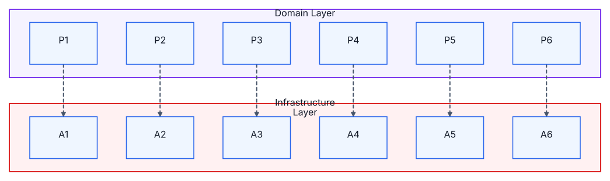

### Описание
Диаграмма «30 Port Adapter Mapping» из views-набора представляет фокусированный срез родительской диаграммы для точечного анализа. Она представлена в формате блок-схема потоков (flowchart). Тип представления: Data-Flow. Родительская диаграмма: `30-port-adapter-mapping-full.mermaid`. Схема имеет плотность порядка 12 узлов и 6 связей; её удобно использовать как обзорный архитектурный срез для проверки влияния изменений, согласования интерфейсов и подготовки рефакторинга, но не как исчерпывающий каталог текущей кодовой поверхности. Ключевые блоки/подграфы: Domain Layer, Infrastructure Layer. Показательные узлы для быстрого чтения: P1, P2, P3, P4, P5, P6.

### Метаданные
- Тип: `flowchart`
- Представление: `Data-Flow`

\newpage

## 30-port-adapter-mapping-domain

**30 Port Adapter Mapping**

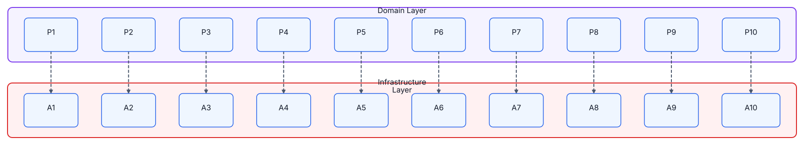

### Описание
Диаграмма «30 Port Adapter Mapping» из views-набора представляет фокусированный срез родительской диаграммы для точечного анализа. Она представлена в формате блок-схема потоков (flowchart). Тип представления: Domain-Focus. Родительская диаграмма: `30-port-adapter-mapping-full.mermaid`. Схема имеет плотность порядка 20 узлов и 10 связей; её удобно использовать как обзорный архитектурный срез для проверки влияния изменений, согласования интерфейсов и подготовки рефакторинга, но не как исчерпывающий каталог текущей кодовой поверхности. Ключевые блоки/подграфы: Domain Layer, Infrastructure Layer. Показательные узлы для быстрого чтения: P1, P2, P3, P4, P5, P6.

### Метаданные
- Тип: `flowchart`
- Представление: `Domain-Focus`

\newpage

## 30-port-adapter-mapping-full

**Port-to-Adapter Mapping Table Diagram**

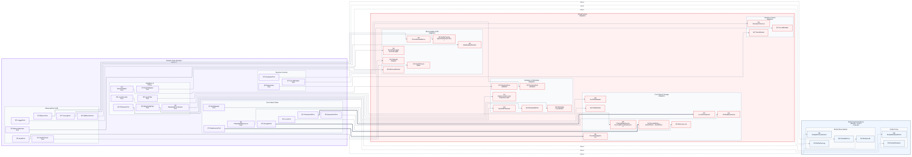

### Описание
Диаграмма «Port-to-Adapter Mapping Table Diagram» из views-набора представляет фокусированный срез родительской диаграммы для точечного анализа. Она представлена в формате блок-схема потоков (flowchart) и служит ориентиром на уровне детализации «Mixed (System / Component / Class)». Тип представления: Full. Родительская диаграмма: `(root)`. В комментариях исходника зафиксирован фокус диаграммы: RULES.md §1.2 (Ports & Adapters), ARCH-008 (Single Source). Схема имеет плотность порядка 54 узлов и 79 связей; её удобно использовать как обзорный архитектурный срез для проверки влияния изменений, согласования интерфейсов и подготовки рефакторинга, но не как исчерпывающий каталог текущей кодовой поверхности. Ключевые блоки/подграфы: Domain Ports (domain/ports/), Core Data & State, Observability & DQ, Validation & Policy, Runtime Controls, Infrastructure Adapters. Показательные узлы для быстрого чтения: [P] DataSourcePort, [P] FilterableDataSourcePort, [P] Bronze/Silver/Gold/MergedStoragePorts, [P] LockPort, [P] CheckpointPort, [P] QuarantinePort.

### Метаданные
- Тип: `flowchart`
- Уровень: `Mixed (System / Component / Class)`
- Дата: `2026-02-27`
- Представление: `Full`

\newpage

## 30-port-adapter-mapping-infra

**30 Port Adapter Mapping**

### Описание
Диаграмма «30 Port Adapter Mapping» из views-набора представляет фокусированный срез родительской диаграммы для точечного анализа. Она представлена в формате блок-схема потоков (flowchart). Тип представления: Infrastructure-Mapping. Родительская диаграмма: `30-port-adapter-mapping-full.mermaid`. Схема имеет плотность порядка 20 узлов и 10 связей; её удобно использовать как обзорный архитектурный срез для проверки влияния изменений, согласования интерфейсов и подготовки рефакторинга, но не как исчерпывающий каталог текущей кодовой поверхности. Ключевые блоки/подграфы: Domain Layer, Infrastructure Layer. Показательные узлы для быстрого чтения: P1, P2, P3, P4, P5, P6.

### Метаданные
- Тип: `flowchart`
- Представление: `Infrastructure-Mapping`

\newpage

## 30-port-adapter-mapping-overview

**30 Port Adapter Mapping**

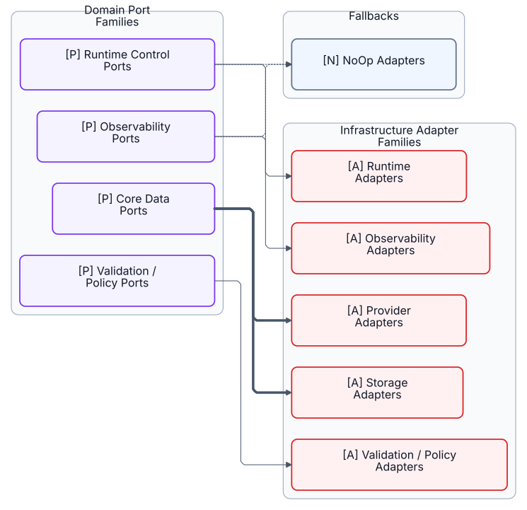

### Описание
Диаграмма «30 Port Adapter Mapping» из views-набора представляет фокусированный срез родительской диаграммы для точечного анализа. Она представлена в формате блок-схема потоков (flowchart). Тип представления: Overview. Родительская диаграмма: `30-port-adapter-mapping-full.mermaid`. В комментариях исходника зафиксирован фокус диаграммы: Decomposed overview of port families and adapter families.. Схема имеет плотность порядка 10 узлов и 7 связей; её удобно использовать как обзорный архитектурный срез для проверки влияния изменений, согласования интерфейсов и подготовки рефакторинга, но не как исчерпывающий каталог текущей кодовой поверхности. Ключевые блоки/подграфы: Domain Port Families, Infrastructure Adapter Families, Fallbacks. Показательные узлы для быстрого чтения: [P] Core Data Ports, [P] Observability Ports, [P] Validation/Policy Ports, [P] Runtime Control Ports, [A] Provider Adapters, [A] Storage Adapters.

### Метаданные
- Тип: `flowchart`
- Представление: `Overview`

\newpage

## 31-pipeline-run-lifecycle-dataflow

**31 Pipeline Run Lifecycle**

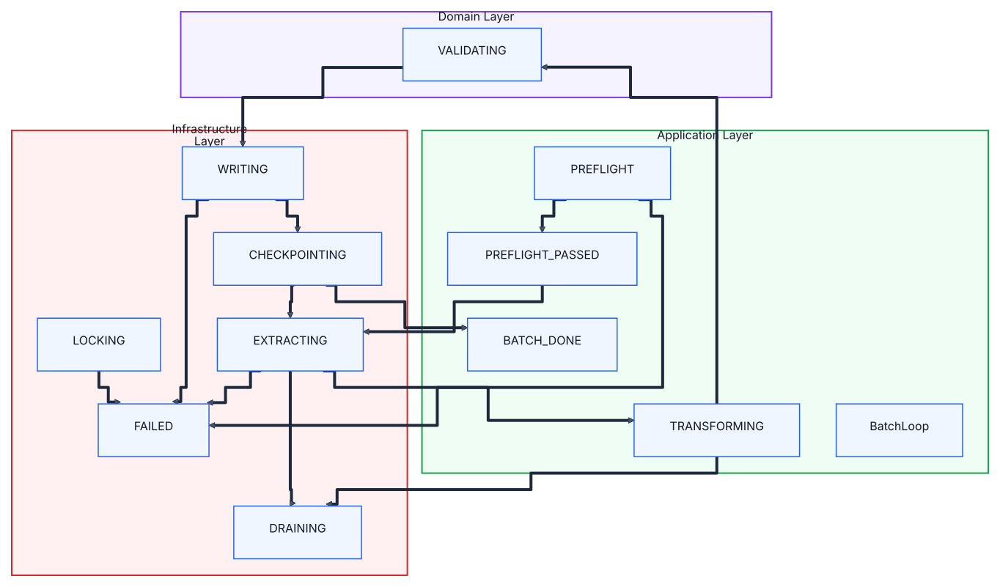

### Описание
Диаграмма «31 Pipeline Run Lifecycle» из views-набора представляет фокусированный срез родительской диаграммы для точечного анализа. Она представлена в формате блок-схема потоков (flowchart). Тип представления: Data-Flow. Родительская диаграмма: `31-pipeline-run-lifecycle-full.mermaid`. Схема имеет плотность порядка 12 узлов и 14 связей; её удобно использовать как обзорный архитектурный срез для проверки влияния изменений, согласования интерфейсов и подготовки рефакторинга, но не как исчерпывающий каталог текущей кодовой поверхности. Ключевые блоки/подграфы: Domain Layer, Application Layer, Infrastructure Layer. Показательные узлы для быстрого чтения: VALIDATING, PREFLIGHT, TRANSFORMING, BATCH_DONE, BatchLoop, PREFLIGHT_PASSED.

### Метаданные
- Тип: `flowchart`
- Представление: `Data-Flow`

\newpage

## 31-pipeline-run-lifecycle-domain

**31 Pipeline Run Lifecycle**

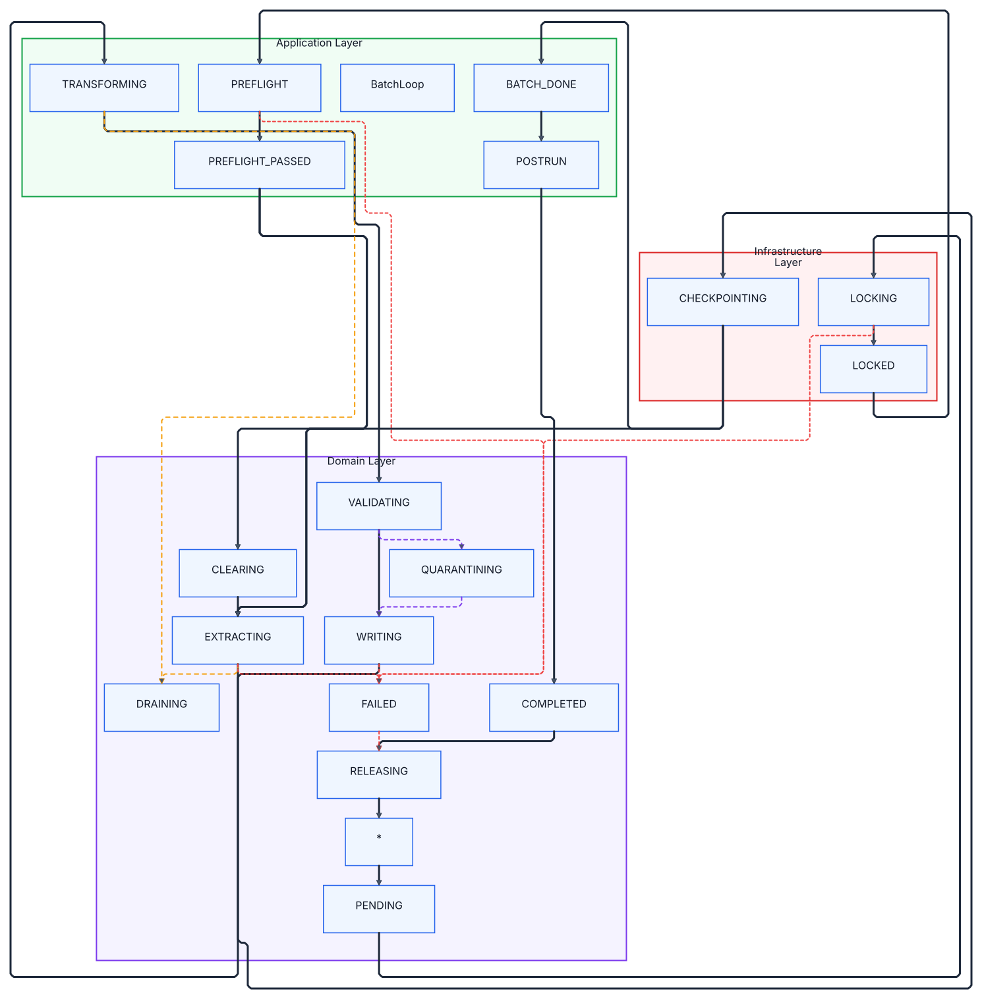

### Описание
Диаграмма «31 Pipeline Run Lifecycle» из views-набора представляет фокусированный срез родительской диаграммы для точечного анализа. Она представлена в формате блок-схема потоков (flowchart). Тип представления: Domain-Focus. Родительская диаграмма: `31-pipeline-run-lifecycle-full.mermaid`. В комментариях исходника зафиксирован фокус диаграммы: {init: {'theme': 'neutral', 'flowchart': {'defaultRenderer': 'elk'},'layout':'elk','flowchart':{'curve':'linear'},'elk':{'nodePlacementStrategy':'BRANDES_KOEPF','mergeEdges':true,'edgeRouting':'ORTHOGONAL'}}}%%. Схема имеет плотность порядка 20 узлов и 27 связей; её удобно использовать как обзорный архитектурный срез для проверки влияния изменений, согласования интерфейсов и подготовки рефакторинга, но не как исчерпывающий каталог текущей кодовой поверхности. Ключевые блоки/подграфы: Domain Layer, Application Layer, Infrastructure Layer. Показательные узлы для быстрого чтения: EXTRACTING, FAILED, WRITING, VALIDATING, DRAINING, RELEASING.

### Метаданные
- Тип: `flowchart`
- Представление: `Domain-Focus`

\newpage

## 31-pipeline-run-lifecycle-full

**Pipeline Run Lifecycle — From Config to Completion**

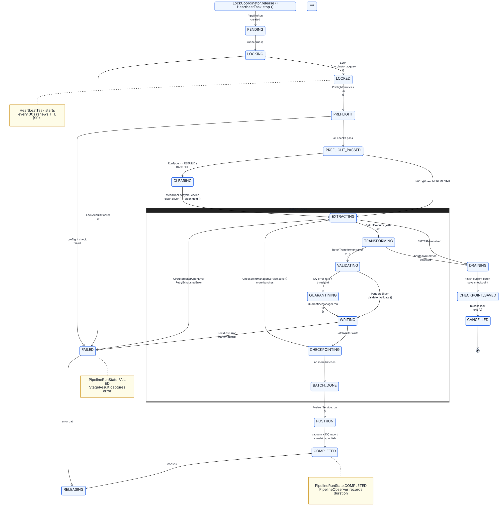

### Описание
Диаграмма «Pipeline Run Lifecycle — From Config to Completion» из views-набора представляет фокусированный срез родительской диаграммы для точечного анализа. Она представлена в формате диаграмма состояний (state diagram) и служит ориентиром на уровне детализации «Mixed (System / Component / Class)». Тип представления: Full. Родительская диаграмма: `(root)`. В комментариях исходника зафиксирован фокус диаграммы: RULES.md §3 (Execution), domain/aggregates/pipeline_run.py.

### Метаданные
- Тип: `stateDiagram`
- Уровень: `Mixed (System / Component / Class)`
- Дата: `2026-02-24`
- Представление: `Full`

\newpage

## 31-pipeline-run-lifecycle-infra

**31 Pipeline Run Lifecycle**

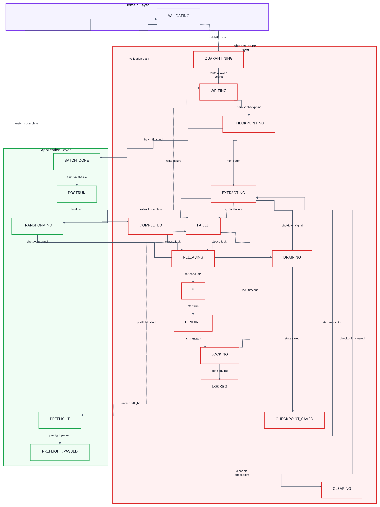

### Описание
Диаграмма «31 Pipeline Run Lifecycle» из views-набора представляет фокусированный срез родительской диаграммы для точечного анализа. Она представлена в формате блок-схема потоков (flowchart). Тип представления: Infrastructure-Mapping. Родительская диаграмма: `31-pipeline-run-lifecycle-full.mermaid`. В комментариях исходника зафиксирован фокус диаграммы: 'layout': 'elk',. Схема имеет плотность порядка 20 узлов и 36 связей; её удобно использовать как обзорный архитектурный срез для проверки влияния изменений, согласования интерфейсов и подготовки рефакторинга, но не как исчерпывающий каталог текущей кодовой поверхности. Ключевые блоки/подграфы: Domain Layer, Application Layer, Infrastructure Layer. Показательные узлы для быстрого чтения: VALIDATING, PREFLIGHT, POSTRUN, PREFLIGHT_PASSED, TRANSFORMING, BATCH_DONE.

### Метаданные
- Тип: `flowchart`
- Представление: `Infrastructure-Mapping`

\newpage

## 31-pipeline-run-lifecycle-overview

**31 Pipeline Run Lifecycle**

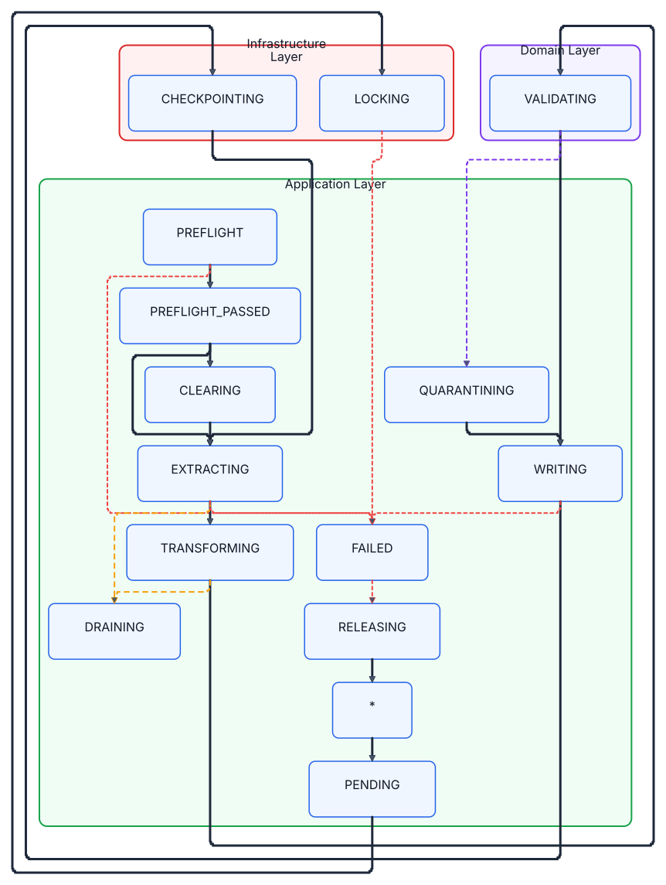

### Описание
Диаграмма «31 Pipeline Run Lifecycle» из views-набора представляет фокусированный срез родительской диаграммы для точечного анализа. Она представлена в формате блок-схема потоков (flowchart). Тип представления: Overview. Родительская диаграмма: `31-pipeline-run-lifecycle-full.mermaid`. В комментариях исходника зафиксирован фокус диаграммы: {init: {'theme': 'neutral', 'flowchart': {'defaultRenderer': 'elk'}}}%%. Схема имеет плотность порядка 15 узлов и 21 связей; её удобно использовать как обзорный архитектурный срез для проверки влияния изменений, согласования интерфейсов и подготовки рефакторинга, но не как исчерпывающий каталог текущей кодовой поверхности. Ключевые блоки/подграфы: Domain Layer, Application Layer, Infrastructure Layer. Показательные узлы для быстрого чтения: VALIDATING, EXTRACTING, FAILED, PREFLIGHT_PASSED, TRANSFORMING, DRAINING.

### Метаданные
- Тип: `flowchart`
- Представление: `Overview`

\newpage

## 32-single-record-journey-dataflow

**32 Single Record Journey**

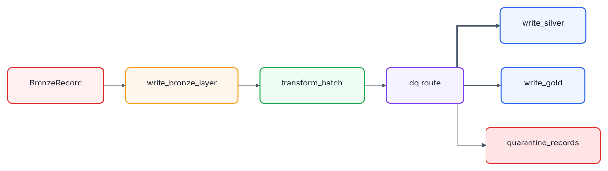

### Описание
Диаграмма «32 Single Record Journey» из views-набора представляет фокусированный срез родительской диаграммы для точечного анализа. Она представлена в формате блок-схема потоков (flowchart). Тип представления: Data-Flow. Родительская диаграмма: `32-single-record-journey-full.mermaid`. Схема имеет плотность порядка 7 узлов и 6 связей; её удобно использовать как обзорный архитектурный срез для проверки влияния изменений, согласования интерфейсов и подготовки рефакторинга, но не как исчерпывающий каталог текущей кодовой поверхности. Показательные узлы для быстрого чтения: BronzeRecord, write_bronze_layer, transform_batch, dq route, write_silver, write_gold.

### Метаданные
- Тип: `flowchart`
- Представление: `Data-Flow`

\newpage

## 32-single-record-journey-domain

**32 Single Record Journey**

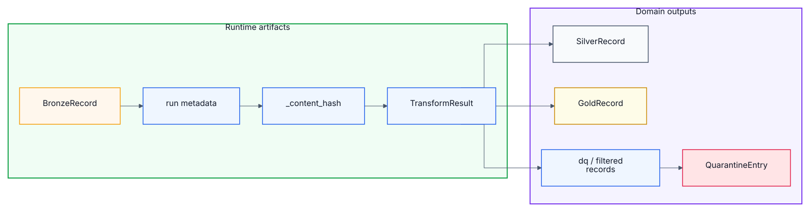

### Описание
Диаграмма «32 Single Record Journey» из views-набора представляет фокусированный срез родительской диаграммы для точечного анализа. Она представлена в формате блок-схема потоков (flowchart). Тип представления: Domain-Focus. Родительская диаграмма: `32-single-record-journey-full.mermaid`. Схема имеет плотность порядка 8 узлов и 7 связей; её удобно использовать как обзорный архитектурный срез для проверки влияния изменений, согласования интерфейсов и подготовки рефакторинга, но не как исчерпывающий каталог текущей кодовой поверхности. Ключевые блоки/подграфы: Runtime artifacts, Domain outputs. Показательные узлы для быстрого чтения: BronzeRecord, run metadata, _content_hash, TransformResult, SilverRecord, GoldRecord.

### Метаданные
- Тип: `flowchart`
- Представление: `Domain-Focus`

\newpage

## 32-single-record-journey-full

**Record Processing Pipeline — Single Record Journey**

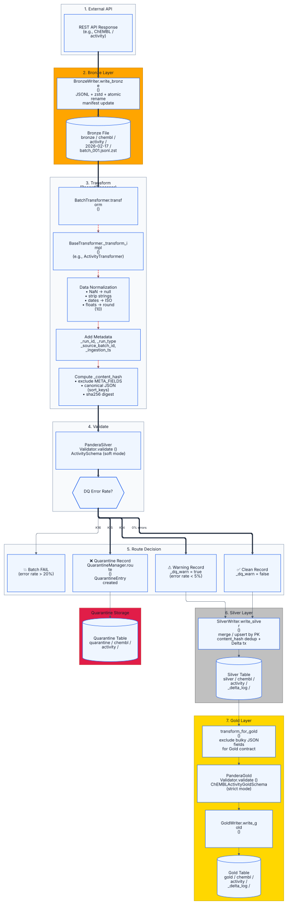

### Описание
Диаграмма «Record Processing Pipeline — Single Record Journey» из views-набора представляет фокусированный срез родительской диаграммы для точечного анализа. Она представлена в формате блок-схема потоков (flowchart) и служит ориентиром на уровне детализации «Component / Class». Тип представления: Full. Родительская диаграмма: `(root)`. В комментариях исходника зафиксирован фокус диаграммы: application/core/{batch_processing_service,batch_processing_support,batch_transformer,batch_writer}.py. Схема имеет плотность порядка 19 узлов и 18 связей; её удобно использовать как обзорный архитектурный срез для проверки влияния изменений, согласования интерфейсов и подготовки рефакторинга, но не как исчерпывающий каталог текущей кодовой поверхности. Ключевые блоки/подграфы: 1. Source Record, 2. Bronze Capture, 3. Transform Record, 4. DQ + Route, 5. Persist Outputs. Показательные узлы для быстрого чтения: Provider response raw BronzeRecord bytes, DataSourcePort.fetch() yield BronzeRecord, BatchProcessingService.process_batch() batch_id + source metadata, write_bronze_layer() BatchWriter.write_bronze(), ("Bronze file / manifest bronze/.../batch_*.jsonl.zst"), BatchTransformer.transform_batch().

### Метаданные
- Тип: `flowchart`
- Уровень: `Component / Class`
- Дата: `2026-03-24`
- Представление: `Full`

\newpage

## 32-single-record-journey-infra

**32 Single Record Journey**

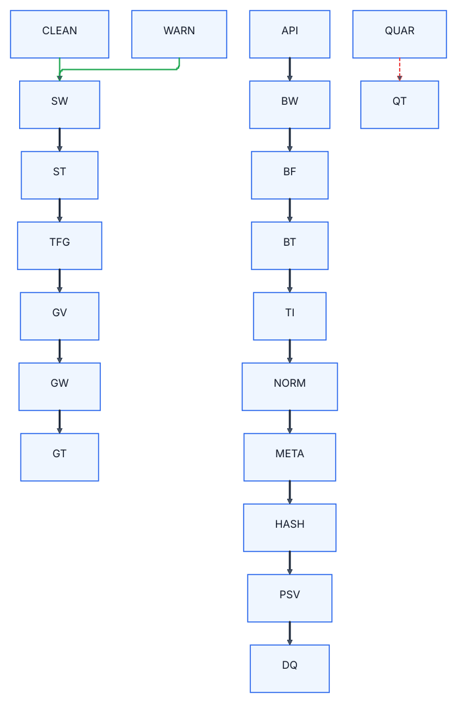

### Описание
Диаграмма «32 Single Record Journey» из views-набора представляет фокусированный срез родительской диаграммы для точечного анализа. Она представлена в формате блок-схема потоков (flowchart). Тип представления: Infrastructure-Mapping. Родительская диаграмма: `32-single-record-journey-full.mermaid`. Схема имеет плотность порядка 9 узлов и 5 связей; её удобно использовать как обзорный архитектурный срез для проверки влияния изменений, согласования интерфейсов и подготовки рефакторинга, но не как исчерпывающий каталог текущей кодовой поверхности. Ключевые блоки/подграфы: Application, Infrastructure. Показательные узлы для быстрого чтения: DataSourcePort.fetch(), write_bronze_layer(), write_silver_gold_concurrent(), quarantine_records(), Provider adapter, Bronze file / manifest.

### Метаданные
- Тип: `flowchart`
- Представление: `Infrastructure-Mapping`

\newpage

## 32-single-record-journey-overview

**32 Single Record Journey**

### Описание
Диаграмма «32 Single Record Journey» из views-набора представляет фокусированный срез родительской диаграммы для точечного анализа. Она представлена в формате блок-схема потоков (flowchart). Тип представления: Overview. Родительская диаграмма: `32-single-record-journey-full.mermaid`. Схема имеет плотность порядка 5 узлов и 4 связей; её удобно использовать как обзорный архитектурный срез для проверки влияния изменений, согласования интерфейсов и подготовки рефакторинга, но не как исчерпывающий каталог текущей кодовой поверхности. Показательные узлы для быстрого чтения: Source, Bronze capture, Transform, DQ route, Persist outputs.

### Метаданные
- Тип: `flowchart`
- Представление: `Overview`

\newpage

## 33-cli-run-interaction-dataflow

**33 Cli Run Interaction**

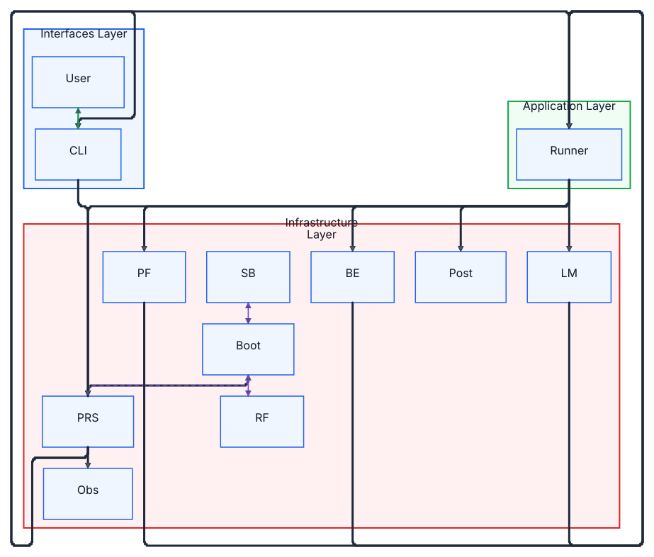

### Описание
Диаграмма «33 Cli Run Interaction» из views-набора представляет фокусированный срез родительской диаграммы для точечного анализа. Она представлена в формате блок-схема потоков (flowchart). Тип представления: Data-Flow. Родительская диаграмма: `33-cli-run-interaction-full.mermaid`. В комментариях исходника зафиксирован фокус диаграммы: {init: {'theme': 'neutral', 'flowchart': {'defaultRenderer': 'elk'}}}%%. Схема имеет плотность порядка 12 узлов и 20 связей; её удобно использовать как обзорный архитектурный срез для проверки влияния изменений, согласования интерфейсов и подготовки рефакторинга, но не как исчерпывающий каталог текущей кодовой поверхности. Ключевые блоки/подграфы: Application Layer, Infrastructure Layer, Interfaces Layer. Показательные узлы для быстрого чтения: Runner, PRS, Boot, PF, LM, BE.

### Метаданные
- Тип: `flowchart`
- Представление: `Data-Flow`

\newpage

## 33-cli-run-interaction-domain

**33 Cli Run Interaction**

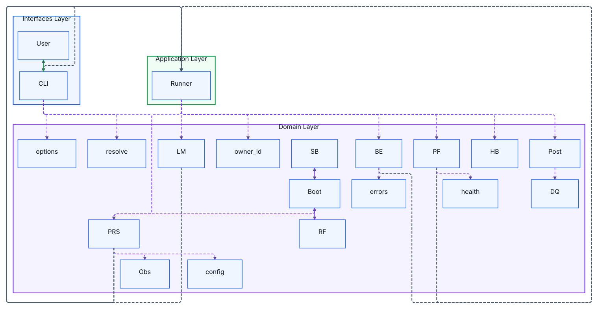

### Описание
Диаграмма «33 Cli Run Interaction» из views-набора представляет фокусированный срез родительской диаграммы для точечного анализа. Она представлена в формате блок-схема потоков (flowchart). Тип представления: Domain-Focus. Родительская диаграмма: `33-cli-run-interaction-full.mermaid`. В комментариях исходника зафиксирован фокус диаграммы: {init: {'theme': 'neutral', 'flowchart': {'defaultRenderer': 'elk'},'layout':'elk','flowchart':{'curve':'linear'},'elk':{'nodePlacementStrategy':'BRANDES_KOEPF','mergeEdges':true,'edgeRouting':'ORTHOGONAL'}}}%%. Схема имеет плотность порядка 20 узлов и 28 связей; её удобно использовать как обзорный архитектурный срез для проверки влияния изменений, согласования интерфейсов и подготовки рефакторинга, но не как исчерпывающий каталог текущей кодовой поверхности. Ключевые блоки/подграфы: Domain Layer, Application Layer, Interfaces Layer. Показательные узлы для быстрого чтения: config, health, errors, DQ, PRS, Boot.

### Метаданные
- Тип: `flowchart`
- Представление: `Domain-Focus`

\newpage

## 33-cli-run-interaction-full

**CLI Run Command → PipelineRunner Full Interaction**

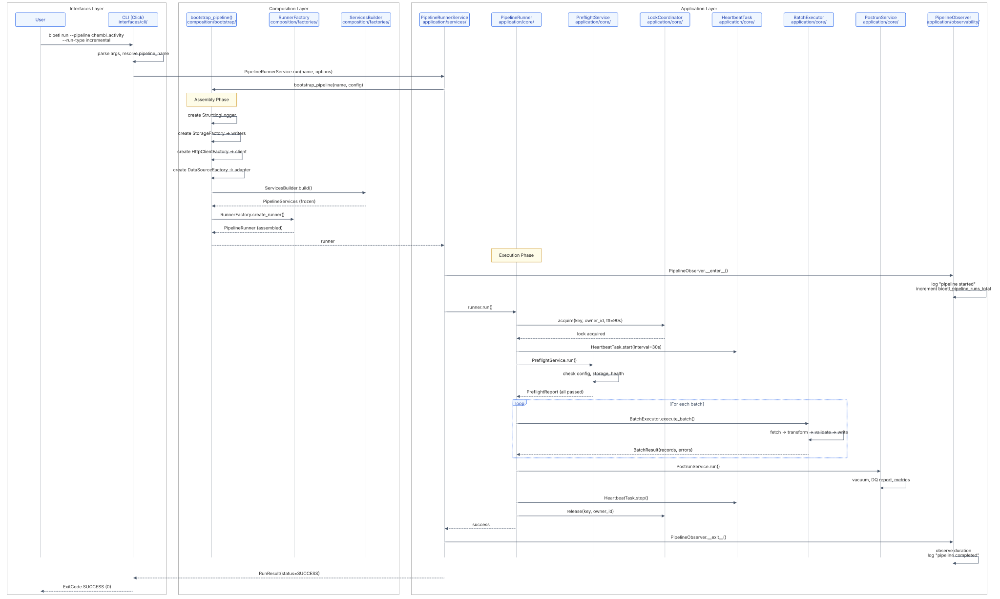

### Описание
Диаграмма «CLI Run Command → PipelineRunner Full Interaction» из views-набора представляет фокусированный срез родительской диаграммы для точечного анализа. Она представлена в формате диаграмма последовательности (sequence) и служит ориентиром на уровне детализации «Mixed (System / Component / Class)». Тип представления: Full. Родительская диаграмма: `(root)`. В комментариях исходника зафиксирован фокус диаграммы: RULES.md §1.1 (Interfaces → Composition → Application).

### Метаданные
- Тип: `sequenceDiagram`
- Уровень: `Mixed (System / Component / Class)`
- Дата: `2026-02-24`
- Представление: `Full`

\newpage

## 33-cli-run-interaction-infra

**33 Cli Run Interaction**

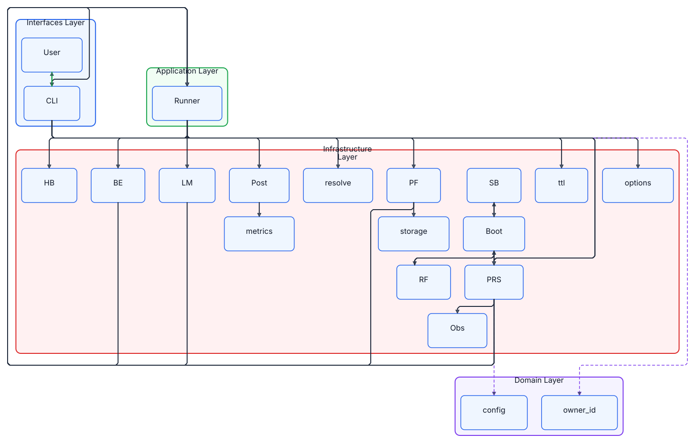

### Описание
Диаграмма «33 Cli Run Interaction» из views-набора представляет фокусированный срез родительской диаграммы для точечного анализа. Она представлена в формате блок-схема потоков (flowchart). Тип представления: Infrastructure-Mapping. Родительская диаграмма: `33-cli-run-interaction-full.mermaid`. В комментариях исходника зафиксирован фокус диаграммы: {init: {'theme': 'neutral', 'flowchart': {'defaultRenderer': 'elk'},'layout':'elk','flowchart':{'curve':'linear'},'elk':{'nodePlacementStrategy':'BRANDES_KOEPF','mergeEdges':true,'edgeRouting':'ORTHOGONAL'}}}%%. Схема имеет плотность порядка 20 узлов и 28 связей; её удобно использовать как обзорный архитектурный срез для проверки влияния изменений, согласования интерфейсов и подготовки рефакторинга, но не как исчерпывающий каталог текущей кодовой поверхности. Ключевые блоки/подграфы: Domain Layer, Application Layer, Infrastructure Layer, Interfaces Layer. Показательные узлы для быстрого чтения: config, owner_id, Runner, storage, metrics, PF.

### Метаданные
- Тип: `flowchart`
- Представление: `Infrastructure-Mapping`

\newpage

## 33-cli-run-interaction-overview

**33 Cli Run Interaction**

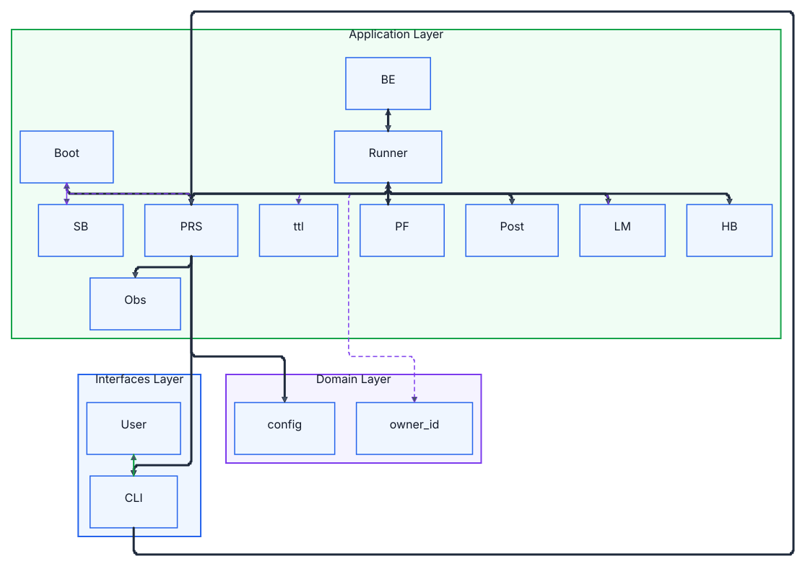

### Описание
Диаграмма «33 Cli Run Interaction» из views-набора представляет фокусированный срез родительской диаграммы для точечного анализа. Она представлена в формате блок-схема потоков (flowchart). Тип представления: Overview. Родительская диаграмма: `33-cli-run-interaction-full.mermaid`. В комментариях исходника зафиксирован фокус диаграммы: {init: {'theme': 'neutral', 'flowchart': {'defaultRenderer': 'elk'}}}%%. Схема имеет плотность порядка 15 узлов и 22 связей; её удобно использовать как обзорный архитектурный срез для проверки влияния изменений, согласования интерфейсов и подготовки рефакторинга, но не как исчерпывающий каталог текущей кодовой поверхности. Ключевые блоки/подграфы: Domain Layer, Application Layer, Interfaces Layer. Показательные узлы для быстрого чтения: config, owner_id, PRS, Runner, PF, LM.

### Метаданные
- Тип: `flowchart`
- Представление: `Overview`

\newpage

## 34-batch-processing-flow-dataflow

**34 Batch Processing Flow**

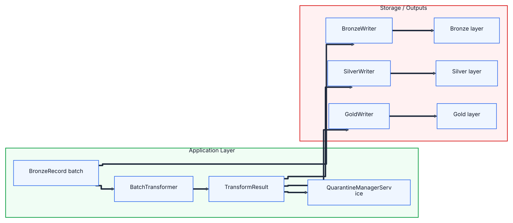

### Описание
Диаграмма «34 Batch Processing Flow» из views-набора представляет фокусированный срез родительской диаграммы для точечного анализа. Она представлена в формате блок-схема потоков (flowchart). Тип представления: Data-Flow. Родительская диаграмма: `34-batch-processing-flow-full.mermaid`. Схема имеет плотность порядка 10 узлов и 9 связей; её удобно использовать как обзорный архитектурный срез для проверки влияния изменений, согласования интерфейсов и подготовки рефакторинга, но не как исчерпывающий каталог текущей кодовой поверхности. Ключевые блоки/подграфы: Application Layer, Storage / Outputs. Показательные узлы для быстрого чтения: BronzeRecord batch, BatchTransformer, TransformResult, QuarantineRuntimeService, BronzeWriter, SilverWriter.

### Метаданные
- Тип: `flowchart`
- Представление: `Data-Flow`

\newpage

## 34-batch-processing-flow-domain

**34 Batch Processing Flow**

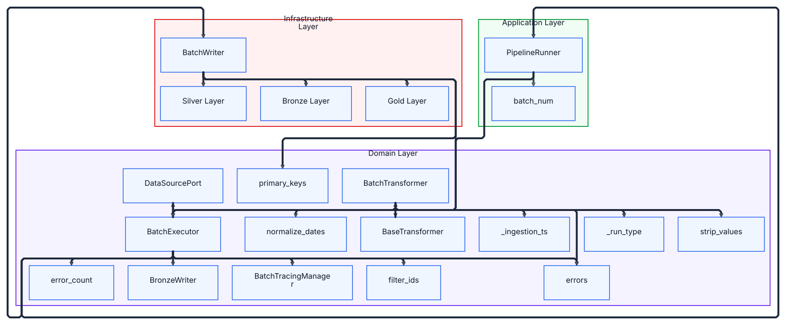

### Описание
Диаграмма «34 Batch Processing Flow» из views-набора представляет фокусированный срез родительской диаграммы для точечного анализа. Она представлена в формате блок-схема потоков (flowchart). Тип представления: Domain-Focus. Родительская диаграмма: `34-batch-processing-flow-full.mermaid`. В комментариях исходника зафиксирован фокус диаграммы: {init: {'theme':'base','layout':'elk','flowchart':{'curve':'linear'},'elk':{'nodePlacementStrategy':'BRANDES_KOEPF','mergeEdges':true,'edgeRouting':'ORTHOGONAL'}}}%%. Схема имеет плотность порядка 13 узлов и 13 связей; её удобно использовать как обзорный архитектурный срез для проверки влияния изменений, согласования интерфейсов и подготовки рефакторинга, но не как исчерпывающий каталог текущей кодовой поверхности. Ключевые блоки/подграфы: Domain / Data Objects, Application Layer, Infrastructure Layer. Показательные узлы для быстрого чтения: BronzeRecord batch, SourceMetadata, TransformResult, BatchProcessingOutcome, BatchProcessingService, SupportService.

### Метаданные
- Тип: `flowchart`
- Представление: `Domain-Focus`

\newpage

## 34-batch-processing-flow-full

**Batch Processing Flow — BatchProcessingService choreography**

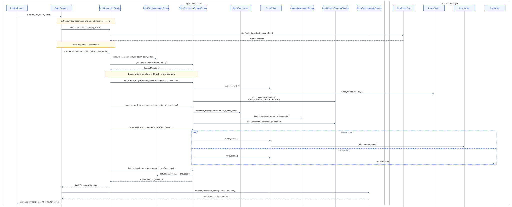

### Описание
Диаграмма «Batch Processing Flow — BatchProcessingService choreography» из views-набора представляет фокусированный срез родительской диаграммы для точечного анализа. Она представлена в формате диаграмма последовательности (sequence) и служит ориентиром на уровне детализации «Component / Class». Тип представления: Full. Родительская диаграмма: `(root)`. В комментариях исходника зафиксирован фокус диаграммы: RULES.md §2.1 (Data Flow), application/core/{batch_executor,batch_processing_service,batch_processing_support}.py.

### Метаданные
- Тип: `sequenceDiagram`
- Уровень: `Component / Class`
- Дата: `2026-03-24`
- Представление: `Full`

\newpage

## 34-batch-processing-flow-infra

**34 Batch Processing Flow**

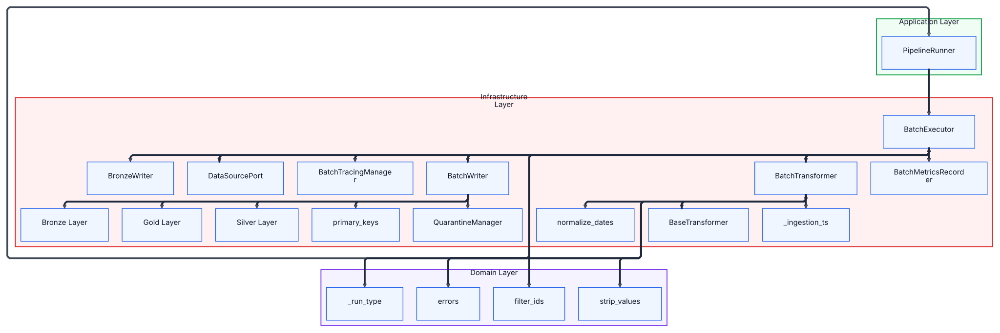

### Описание
Диаграмма «34 Batch Processing Flow» из views-набора представляет фокусированный срез родительской диаграммы для точечного анализа. Она представлена в формате блок-схема потоков (flowchart). Тип представления: Infrastructure-Mapping. Родительская диаграмма: `34-batch-processing-flow-full.mermaid`. В комментариях исходника зафиксирован фокус диаграммы: {init: {'theme':'base','layout':'elk','flowchart':{'curve':'linear'},'elk':{'nodePlacementStrategy':'BRANDES_KOEPF','mergeEdges':true,'edgeRouting':'ORTHOGONAL'}}}%%. Схема имеет плотность порядка 11 узлов и 10 связей; её удобно использовать как обзорный архитектурный срез для проверки влияния изменений, согласования интерфейсов и подготовки рефакторинга, но не как исчерпывающий каталог текущей кодовой поверхности. Ключевые блоки/подграфы: Application Layer, Infrastructure Layer. Показательные узлы для быстрого чтения: BatchProcessingService, SupportService, BatchWriter, BatchTracingManagerService, BatchMetricsRecorderService, QuarantineRuntimeService.

### Метаданные
- Тип: `flowchart`
- Представление: `Infrastructure-Mapping`

\newpage

## 34-batch-processing-flow-overview

**34 Batch Processing Flow**

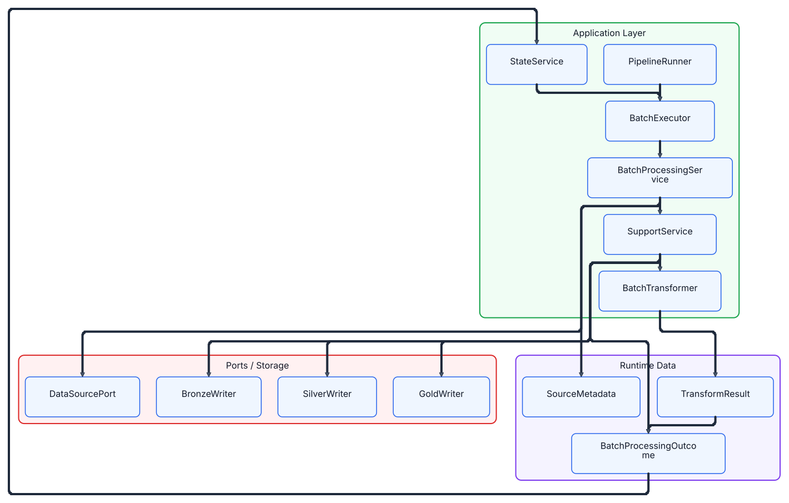

### Описание
Диаграмма «34 Batch Processing Flow» из views-набора представляет фокусированный срез родительской диаграммы для точечного анализа. Она представлена в формате блок-схема потоков (flowchart). Тип представления: Overview. Родительская диаграмма: `34-batch-processing-flow-full.mermaid`. Схема имеет плотность порядка 13 узлов и 14 связей; её удобно использовать как обзорный архитектурный срез для проверки влияния изменений, согласования интерфейсов и подготовки рефакторинга, но не как исчерпывающий каталог текущей кодовой поверхности. Ключевые блоки/подграфы: Runtime Data, Application Layer, Ports / Storage. Показательные узлы для быстрого чтения: SourceMetadata, TransformResult, BatchProcessingOutcome, PipelineRunner, BatchExecutor, BatchProcessingService.

### Метаданные
- Тип: `flowchart`
- Представление: `Overview`

\newpage

## 35-bootstrap-sequence-dataflow

**35 Bootstrap Sequence**

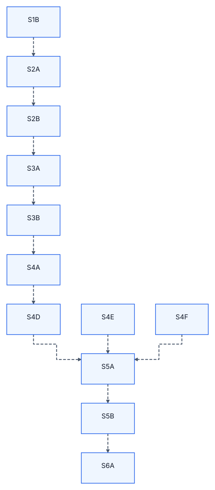

### Описание
Диаграмма «35 Bootstrap Sequence» из views-набора представляет фокусированный срез родительской диаграммы для точечного анализа. Она представлена в формате блок-схема потоков (flowchart). Тип представления: Data-Flow. Родительская диаграмма: `35-bootstrap-sequence-full.mermaid`. Схема имеет плотность порядка 12 узлов и 11 связей; её удобно использовать как обзорный архитектурный срез для проверки влияния изменений, согласования интерфейсов и подготовки рефакторинга, но не как исчерпывающий каталог текущей кодовой поверхности. Показательные узлы для быстрого чтения: S2A, S1B, S2B, S3A, S3B, S4A.

### Метаданные
- Тип: `flowchart`
- Представление: `Data-Flow`

\newpage

## 35-bootstrap-sequence-domain

**35 Bootstrap Sequence**

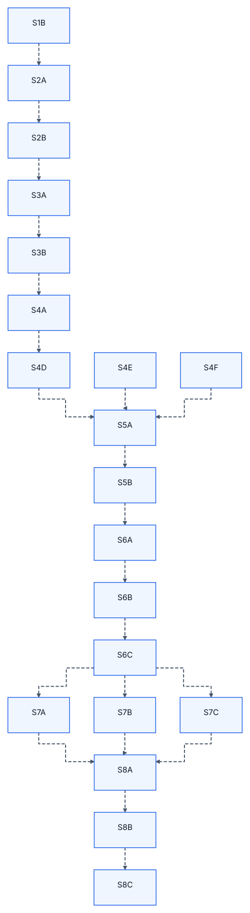

### Описание
Диаграмма «35 Bootstrap Sequence» из views-набора представляет фокусированный срез родительской диаграммы для точечного анализа. Она представлена в формате блок-схема потоков (flowchart). Тип представления: Domain-Focus. Родительская диаграмма: `35-bootstrap-sequence-full.mermaid`. Схема имеет плотность порядка 20 узлов и 21 связей; её удобно использовать как обзорный архитектурный срез для проверки влияния изменений, согласования интерфейсов и подготовки рефакторинга, но не как исчерпывающий каталог текущей кодовой поверхности. Показательные узлы для быстрого чтения: S2A, S1B, S2B, S3A, S3B, S4A.

### Метаданные
- Тип: `flowchart`
- Представление: `Domain-Focus`

\newpage

## 35-bootstrap-sequence-full

**Composition Layer Bootstrap Sequence**

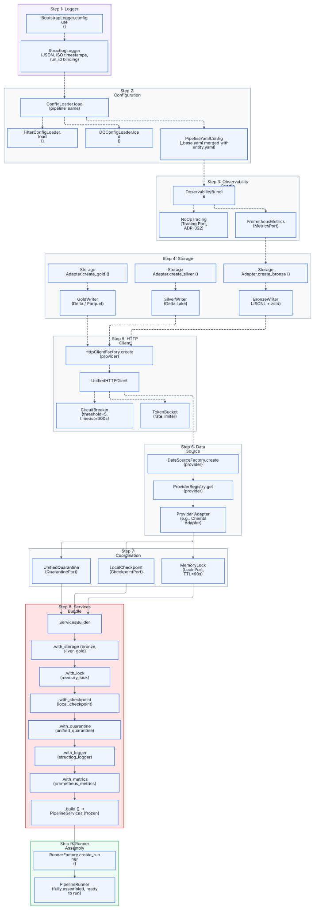

### Описание
Диаграмма «Composition Layer Bootstrap Sequence» из views-набора представляет фокусированный срез родительской диаграммы для точечного анализа. Она представлена в формате блок-схема потоков (flowchart) и служит ориентиром на уровне детализации «Mixed (System / Component / Class)». Тип представления: Full. Родительская диаграмма: `(root)`. В комментариях исходника зафиксирован фокус диаграммы: RULES.md §1.1 (Composition Root), composition/bootstrap/runtime/. Схема имеет плотность порядка 28 узлов и 25 связей; её удобно использовать как обзорный архитектурный срез для проверки влияния изменений, согласования интерфейсов и подготовки рефакторинга, но не как исчерпывающий каталог текущей кодовой поверхности. Ключевые блоки/подграфы: Step 1: Logger, Step 2: Configuration, Step 3: Observability Bundle, Step 4: Storage, Step 5: HTTP Client, Step 6: Data Source. Показательные узлы для быстрого чтения: BootstrapLogger.configure(), StructlogLogger (JSON, ISO timestamps, run_id binding), ConfigLoader.load(pipeline_name), PipelineYamlConfig (base defaults merged with entity.yaml), DQ + Filter config loaders, ObservabilityBundle.

### Метаданные
- Тип: `flowchart`
- Уровень: `Mixed (System / Component / Class)`
- Дата: `2026-03-24`
- Представление: `Full`

\newpage

## 35-bootstrap-sequence-infra

**35 Bootstrap Sequence**

### Описание
Диаграмма «35 Bootstrap Sequence» из views-набора представляет фокусированный срез родительской диаграммы для точечного анализа. Она представлена в формате блок-схема потоков (flowchart). Тип представления: Infrastructure-Mapping. Родительская диаграмма: `35-bootstrap-sequence-full.mermaid`. Схема имеет плотность порядка 20 узлов и 21 связей; её удобно использовать как обзорный архитектурный срез для проверки влияния изменений, согласования интерфейсов и подготовки рефакторинга, но не как исчерпывающий каталог текущей кодовой поверхности. Показательные узлы для быстрого чтения: S2A, S1B, S2B, S3A, S3B, S4A.

### Метаданные
- Тип: `flowchart`
- Представление: `Infrastructure-Mapping`

\newpage

## 35-bootstrap-sequence-overview

**35 Bootstrap Sequence**

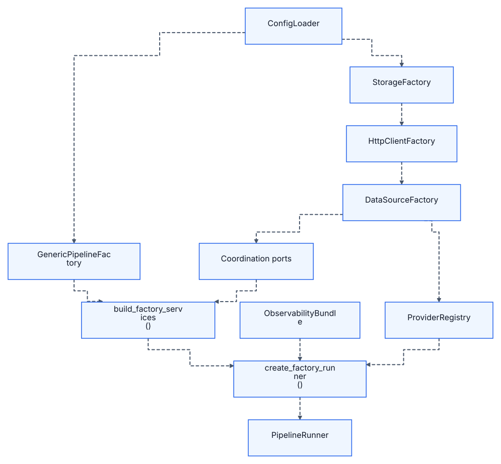

### Описание
Диаграмма «35 Bootstrap Sequence» из views-набора представляет фокусированный срез родительской диаграммы для точечного анализа. Она представлена в формате блок-схема потоков (flowchart). Тип представления: Overview. Родительская диаграмма: `35-bootstrap-sequence-full.mermaid`. Схема имеет плотность порядка 11 узлов и 12 связей; её удобно использовать как обзорный архитектурный срез для проверки влияния изменений, согласования интерфейсов и подготовки рефакторинга, но не как исчерпывающий каталог текущей кодовой поверхности. Показательные узлы для быстрого чтения: ConfigLoader, StorageFactory, HttpClientFactory, DataSourceFactory, ProviderRegistry, Coordination ports.

### Метаданные
- Тип: `flowchart`
- Представление: `Overview`

\newpage

## 36-architecture-principles-mindmap-dataflow

**36 Architecture Principles Mindmap**

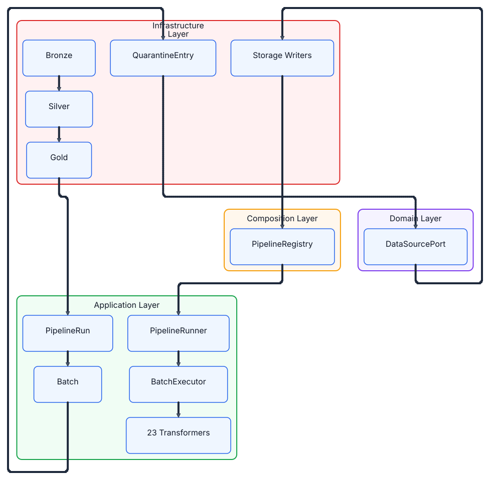

### Описание
Диаграмма «36 Architecture Principles Mindmap» из views-набора представляет фокусированный срез родительской диаграммы для точечного анализа. Она представлена в формате блок-схема потоков (flowchart). Тип представления: Data-Flow. Родительская диаграмма: `36-architecture-principles-mindmap-full.mermaid`. Схема имеет плотность порядка 12 узлов и 11 связей; её удобно использовать как обзорный архитектурный срез для проверки влияния изменений, согласования интерфейсов и подготовки рефакторинга, но не как исчерпывающий каталог текущей кодовой поверхности. Ключевые блоки/подграфы: Domain Layer, Application Layer, Infrastructure Layer, Composition Layer. Показательные узлы для быстрого чтения: DataSourcePort, Batch, PipelineRun, PipelineRunner, BatchExecutor, 23 Transformers.

### Метаданные
- Тип: `flowchart`
- Представление: `Data-Flow`

\newpage

## 36-architecture-principles-mindmap-domain

**36 Architecture Principles Mindmap**

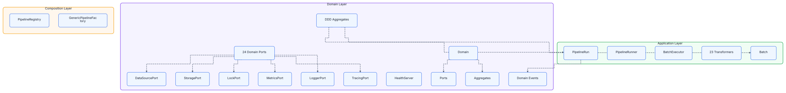

### Описание
Диаграмма «36 Architecture Principles Mindmap» из views-набора представляет фокусированный срез родительской диаграммы для точечного анализа. Она представлена в формате блок-схема потоков (flowchart). Тип представления: Domain-Focus. Родительская диаграмма: `36-architecture-principles-mindmap-full.mermaid`. Схема имеет плотность порядка 20 узлов и 11 связей; её удобно использовать как обзорный архитектурный срез для проверки влияния изменений, согласования интерфейсов и подготовки рефакторинга, но не как исчерпывающий каталог текущей кодовой поверхности. Ключевые блоки/подграфы: Domain Layer, Application Layer, Composition Layer. Показательные узлы для быстрого чтения: 24 Domain Ports, Domain, DDD Aggregates, DataSourcePort, Bronze/Silver/Gold/MergedStoragePorts, LockPort.

### Метаданные
- Тип: `flowchart`
- Представление: `Domain-Focus`

\newpage

## 36-architecture-principles-mindmap-full

**Architecture Principles Mind Map**

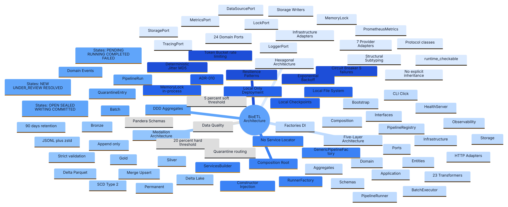

### Описание
Диаграмма «Architecture Principles Mind Map» из views-набора представляет фокусированный срез родительской диаграммы для точечного анализа. Она представлена в формате интеллект-карта (mindmap) и служит ориентиром на уровне детализации «Mixed (System / Component / Class)». Тип представления: Full. Родительская диаграмма: `(root)`. В комментариях исходника зафиксирован фокус диаграммы: RULES.md §1 (Architecture), all ADRs.

### Метаданные
- Тип: `mindmap`
- Уровень: `Mixed (System / Component / Class)`
- Дата: `2026-02-24`
- Представление: `Full`

\newpage

## 36-architecture-principles-mindmap-infra

**36 Architecture Principles Mindmap**

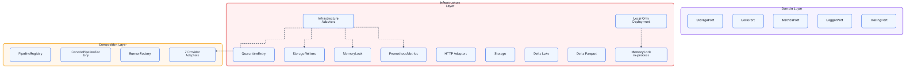

### Описание
Диаграмма «36 Architecture Principles Mindmap» из views-набора представляет фокусированный срез родительской диаграммы для точечного анализа. Она представлена в формате блок-схема потоков (flowchart). Тип представления: Infrastructure-Mapping. Родительская диаграмма: `36-architecture-principles-mindmap-full.mermaid`. Схема имеет плотность порядка 20 узлов и 5 связей; её удобно использовать как обзорный архитектурный срез для проверки влияния изменений, согласования интерфейсов и подготовки рефакторинга, но не как исчерпывающий каталог текущей кодовой поверхности. Ключевые блоки/подграфы: Domain Layer, Infrastructure Layer, Composition Layer. Показательные узлы для быстрого чтения: Bronze/Silver/Gold/MergedStoragePorts, LockPort, MetricsPort, LoggerPort, TracingPort, Infrastructure Adapters.

### Метаданные
- Тип: `flowchart`
- Представление: `Infrastructure-Mapping`

\newpage

## 36-architecture-principles-mindmap-overview

**36 Architecture Principles Mindmap**

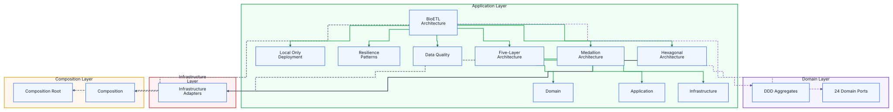

### Описание
Диаграмма «36 Architecture Principles Mindmap» из views-набора представляет фокусированный срез родительской диаграммы для точечного анализа. Она представлена в формате блок-схема потоков (flowchart). Тип представления: Overview. Родительская диаграмма: `36-architecture-principles-mindmap-full.mermaid`. Схема имеет плотность порядка 15 узлов и 14 связей; её удобно использовать как обзорный архитектурный срез для проверки влияния изменений, согласования интерфейсов и подготовки рефакторинга, но не как исчерпывающий каталог текущей кодовой поверхности. Ключевые блоки/подграфы: Domain Layer, Application Layer, Infrastructure Layer, Composition Layer. Показательные узлы для быстрого чтения: DDD Aggregates, 24 Domain Ports, BioETL Architecture, Five-Layer Architecture, Local Only Deployment, Resilience Patterns.

### Метаданные
- Тип: `flowchart`
- Представление: `Overview`

\newpage

## 39-medallion-invariants-dataflow

**39 Medallion Invariants**

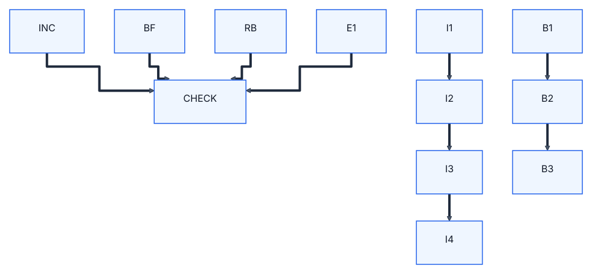

### Описание
Диаграмма «39 Medallion Invariants» из views-набора представляет фокусированный срез родительской диаграммы для точечного анализа. Она представлена в формате блок-схема потоков (flowchart). Тип представления: Data-Flow. Родительская диаграмма: `39-medallion-invariants-full.mermaid`. Схема имеет плотность порядка 12 узлов и 9 связей; её удобно использовать как обзорный архитектурный срез для проверки влияния изменений, согласования интерфейсов и подготовки рефакторинга, но не как исчерпывающий каталог текущей кодовой поверхности. Показательные узлы для быстрого чтения: CHECK, INC, BF, RB, E1, I2.

### Метаданные
- Тип: `flowchart`
- Представление: `Data-Flow`

\newpage

## 39-medallion-invariants-domain

**39 Medallion Invariants**

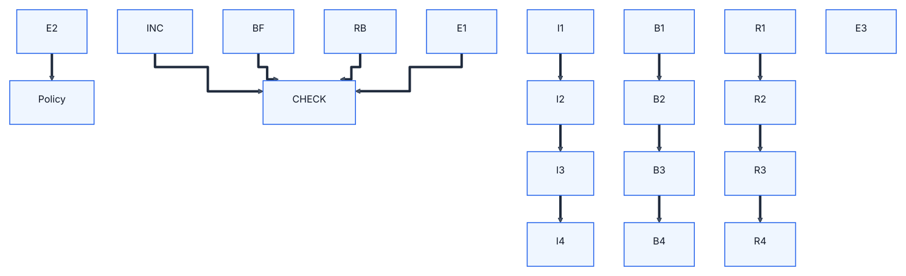

### Описание
Диаграмма «39 Medallion Invariants» из views-набора представляет фокусированный срез родительской диаграммы для точечного анализа. Она представлена в формате блок-схема потоков (flowchart). Тип представления: Domain-Focus. Родительская диаграмма: `39-medallion-invariants-full.mermaid`. Схема имеет плотность порядка 20 узлов и 14 связей; её удобно использовать как обзорный архитектурный срез для проверки влияния изменений, согласования интерфейсов и подготовки рефакторинга, но не как исчерпывающий каталог текущей кодовой поверхности. Показательные узлы для быстрого чтения: Policy, E2, CHECK, INC, BF, RB.

### Метаданные
- Тип: `flowchart`
- Представление: `Domain-Focus`

\newpage

## 39-medallion-invariants-full

**Medallion Architecture Invariants (ARCH-007)**

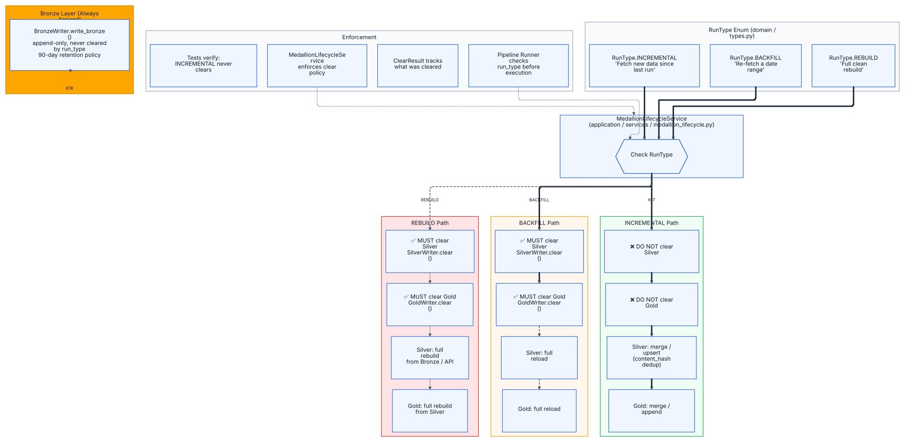

### Описание
Диаграмма «Medallion Architecture Invariants (ARCH-007)» из views-набора представляет фокусированный срез родительской диаграммы для точечного анализа. Она представлена в формате блок-схема потоков (flowchart) и служит ориентиром на уровне детализации «Mixed (System / Component / Class)». Тип представления: Full. Родительская диаграмма: `(root)`. В комментариях исходника зафиксирован фокус диаграммы: RULES.md §2.1 (Medallion), ARCH-007 clear policy. Схема имеет плотность порядка 19 узлов и 18 связей; её удобно использовать как обзорный архитектурный срез для проверки влияния изменений, согласования интерфейсов и подготовки рефакторинга, но не как исчерпывающий каталог текущей кодовой поверхности. Ключевые блоки/подграфы: RunType Enum (domain/types.py), MedallionLifecycleService\n(application/services/medallion_lifecycle.py), INCREMENTAL Path, BACKFILL Path, REBUILD Path, Enforcement. Показательные узлы для быстрого чтения: RunType.INCREMENTAL 'Fetch new data since last run', RunType.BACKFILL 'Re-fetch a date range', RunType.REBUILD 'Full clean rebuild', ❌ DO NOT clear Silver, ❌ DO NOT clear Gold, Silver: merge/upsert (content_hash dedup).

### Метаданные
- Тип: `flowchart`
- Уровень: `Mixed (System / Component / Class)`
- Дата: `2026-02-24`
- Представление: `Full`

\newpage

## 39-medallion-invariants-infra

**39 Medallion Invariants**

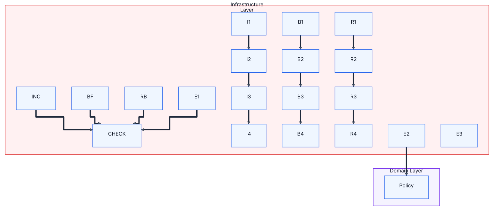

### Описание
Диаграмма «39 Medallion Invariants» из views-набора представляет фокусированный срез родительской диаграммы для точечного анализа. Она представлена в формате блок-схема потоков (flowchart). Тип представления: Infrastructure-Mapping. Родительская диаграмма: `39-medallion-invariants-full.mermaid`. Схема имеет плотность порядка 20 узлов и 14 связей; её удобно использовать как обзорный архитектурный срез для проверки влияния изменений, согласования интерфейсов и подготовки рефакторинга, но не как исчерпывающий каталог текущей кодовой поверхности. Ключевые блоки/подграфы: Domain Layer, Infrastructure Layer. Показательные узлы для быстрого чтения: Policy, CHECK, INC, BF, RB, E1.

### Метаданные
- Тип: `flowchart`
- Представление: `Infrastructure-Mapping`

\newpage

## 39-medallion-invariants-overview

**39 Medallion Invariants**

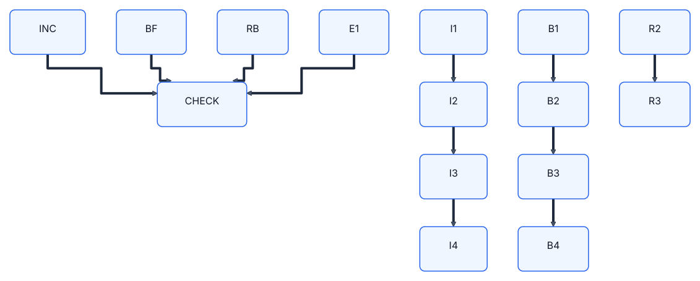

### Описание
Диаграмма «39 Medallion Invariants» из views-набора представляет фокусированный срез родительской диаграммы для точечного анализа. Она представлена в формате блок-схема потоков (flowchart). Тип представления: Overview. Родительская диаграмма: `39-medallion-invariants-full.mermaid`. Схема имеет плотность порядка 15 узлов и 11 связей; её удобно использовать как обзорный архитектурный срез для проверки влияния изменений, согласования интерфейсов и подготовки рефакторинга, но не как исчерпывающий каталог текущей кодовой поверхности. Показательные узлы для быстрого чтения: INC, CHECK, BF, RB, E1, I2.

### Метаданные
- Тип: `flowchart`
- Представление: `Overview`

\newpage

## 41-error-classification-tree-dataflow

**41 Error Classification Tree**

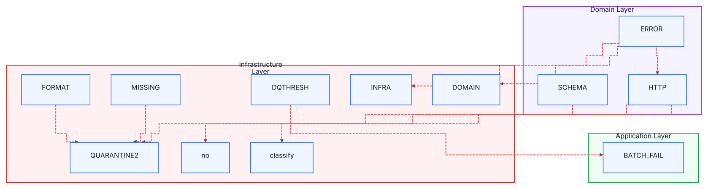

### Описание
Диаграмма «41 Error Classification Tree» из views-набора представляет фокусированный срез родительской диаграммы для точечного анализа. Она представлена в формате блок-схема потоков (flowchart). Тип представления: Data-Flow. Родительская диаграмма: `41-error-classification-tree-full.mermaid`. Схема имеет плотность порядка 12 узлов и 9 связей; её удобно использовать как обзорный архитектурный срез для проверки влияния изменений, согласования интерфейсов и подготовки рефакторинга, но не как исчерпывающий каталог текущей кодовой поверхности. Ключевые блоки/подграфы: Domain Layer, Application Layer, Infrastructure Layer. Показательные узлы для быстрого чтения: SCHEMA, HTTP, ERROR, BATCH_FAIL, QUARANTINE2, MISSING.

### Метаданные
- Тип: `flowchart`
- Представление: `Data-Flow`

\newpage

## 41-error-classification-tree-domain

**41 Error Classification Tree**

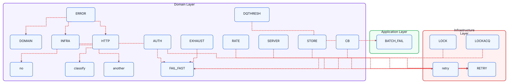

### Описание
Диаграмма «41 Error Classification Tree» из views-набора представляет фокусированный срез родительской диаграммы для точечного анализа. Она представлена в формате блок-схема потоков (flowchart). Тип представления: Domain-Focus. Родительская диаграмма: `41-error-classification-tree-full.mermaid`. Схема имеет плотность порядка 20 узлов и 16 связей; её удобно использовать как обзорный архитектурный срез для проверки влияния изменений, согласования интерфейсов и подготовки рефакторинга, но не как исчерпывающий каталог текущей кодовой поверхности. Ключевые блоки/подграфы: Domain Layer, Application Layer, Infrastructure Layer. Показательные узлы для быстрого чтения: ERROR, DOMAIN, DQTHRESH, INFRA, no, classify.

### Метаданные
- Тип: `flowchart`
- Представление: `Domain-Focus`

\newpage

## 41-error-classification-tree-full

**Error Classification Decision Tree — Full Logic**

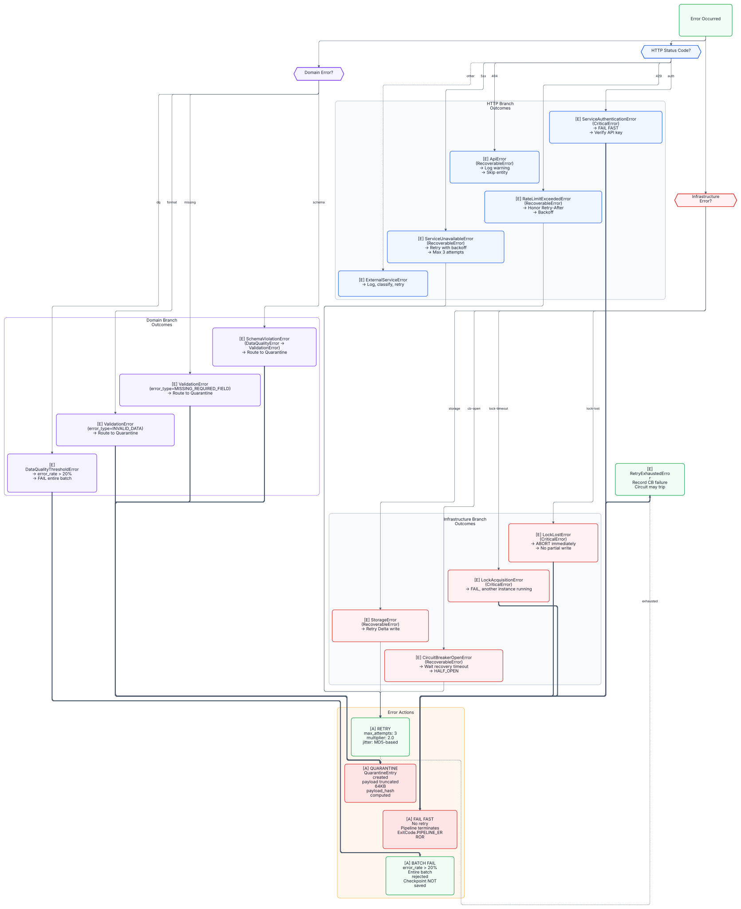

### Описание
Диаграмма «Error Classification Decision Tree — Full Logic» из views-набора представляет фокусированный срез родительской диаграммы для точечного анализа. Она представлена в формате блок-схема потоков (flowchart) и служит ориентиром на уровне детализации «Mixed (System / Component / Class)». Тип представления: Full. Родительская диаграмма: `(root)`. В комментариях исходника зафиксирован фокус диаграммы: RULES.md §3.1 (Error Handling), domain/exceptions/. Схема имеет плотность порядка 4 узлов и 44 связей; её удобно использовать как обзорный архитектурный срез для проверки влияния изменений, согласования интерфейсов и подготовки рефакторинга, но не как исчерпывающий каталог текущей кодовой поверхности. Ключевые блоки/подграфы: HTTP Branch Outcomes, Domain Branch Outcomes, Infrastructure Branch Outcomes, Error Actions. Показательные узлы для быстрого чтения: Error Occurred, [A] RETRY max_attempts: 3 multiplier: 2.0 jitter: MD5-based, [A] FAIL FAST No retry Pipeline terminates ExitCode.PIPELINE_ERROR, [A] BATCH FAIL error_rate > 20% Entire batch rejected Checkpoint NOT saved.

### Метаданные
- Тип: `flowchart`
- Уровень: `Mixed (System / Component / Class)`
- Дата: `2026-02-24`
- Представление: `Full`

\newpage

## 41-error-classification-tree-infra

**41 Error Classification Tree**

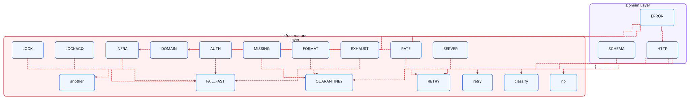

### Описание
Диаграмма «41 Error Classification Tree» из views-набора представляет фокусированный срез родительской диаграммы для точечного анализа. Она представлена в формате блок-схема потоков (flowchart). Тип представления: Infrastructure-Mapping. Родительская диаграмма: `41-error-classification-tree-full.mermaid`. Схема имеет плотность порядка 20 узлов и 16 связей; её удобно использовать как обзорный архитектурный срез для проверки влияния изменений, согласования интерфейсов и подготовки рефакторинга, но не как исчерпывающий каталог текущей кодовой поверхности. Ключевые блоки/подграфы: Domain Layer, Infrastructure Layer. Показательные узлы для быстрого чтения: SCHEMA, HTTP, ERROR, QUARANTINE2, LOCK, LOCKACQ.

### Метаданные
- Тип: `flowchart`
- Представление: `Infrastructure-Mapping`

\newpage

## 41-error-classification-tree-overview

**41 Error Classification Tree**

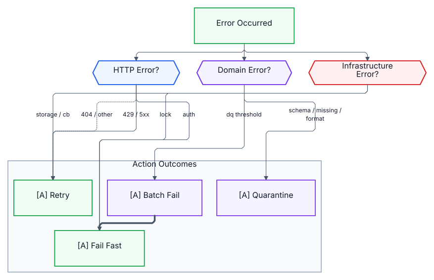

### Описание
Диаграмма «41 Error Classification Tree» из views-набора представляет фокусированный срез родительской диаграммы для точечного анализа. Она представлена в формате блок-схема потоков (flowchart). Тип представления: Overview. Родительская диаграмма: `41-error-classification-tree-full.mermaid`. В комментариях исходника зафиксирован фокус диаграммы: Decomposed overview for error routing actions.. Схема имеет плотность порядка 5 узлов и 11 связей; её удобно использовать как обзорный архитектурный срез для проверки влияния изменений, согласования интерфейсов и подготовки рефакторинга, но не как исчерпывающий каталог текущей кодовой поверхности. Ключевые блоки/подграфы: Action Outcomes. Показательные узлы для быстрого чтения: Error Occurred, [A] Retry, [A] Quarantine, [A] Batch Fail, [A] Fail Fast.

### Метаданные
- Тип: `flowchart`
- Представление: `Overview`

\newpage

## 44-cross-provider-enrichment-dataflow

**44 Cross Provider Enrichment**

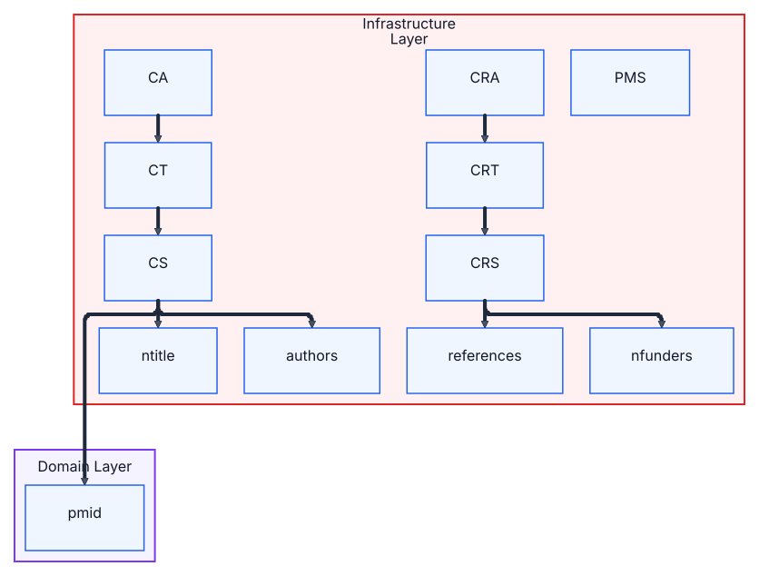

### Описание
Диаграмма «44 Cross Provider Enrichment» из views-набора представляет фокусированный срез родительской диаграммы для точечного анализа. Она представлена в формате блок-схема потоков (flowchart). Тип представления: Data-Flow. Родительская диаграмма: `44-cross-provider-enrichment-full.mermaid`. Схема имеет плотность порядка 12 узлов и 9 связей; её удобно использовать как обзорный архитектурный срез для проверки влияния изменений, согласования интерфейсов и подготовки рефакторинга, но не как исчерпывающий каталог текущей кодовой поверхности. Ключевые блоки/подграфы: Domain Layer, Infrastructure Layer. Показательные узлы для быстрого чтения: pmid, CS, CT, CA, ntitle, authors.

### Метаданные
- Тип: `flowchart`
- Представление: `Data-Flow`

\newpage

## 44-cross-provider-enrichment-domain

**44 Cross Provider Enrichment**

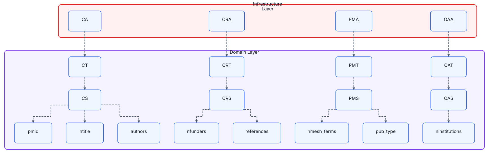

### Описание
Диаграмма «44 Cross Provider Enrichment» из views-набора представляет фокусированный срез родительской диаграммы для точечного анализа. Она представлена в формате блок-схема потоков (flowchart). Тип представления: Domain-Focus. Родительская диаграмма: `44-cross-provider-enrichment-full.mermaid`. Схема имеет плотность порядка 20 узлов и 16 связей; её удобно использовать как обзорный архитектурный срез для проверки влияния изменений, согласования интерфейсов и подготовки рефакторинга, но не как исчерпывающий каталог текущей кодовой поверхности. Ключевые блоки/подграфы: Domain Layer, Infrastructure Layer. Показательные узлы для быстрого чтения: CS, CT, pmid, ntitle, authors, CRS.

### Метаданные
- Тип: `flowchart`
- Представление: `Domain-Focus`

\newpage

## 44-cross-provider-enrichment-full

**Cross-Provider Data Enrichment Flow — Publication**

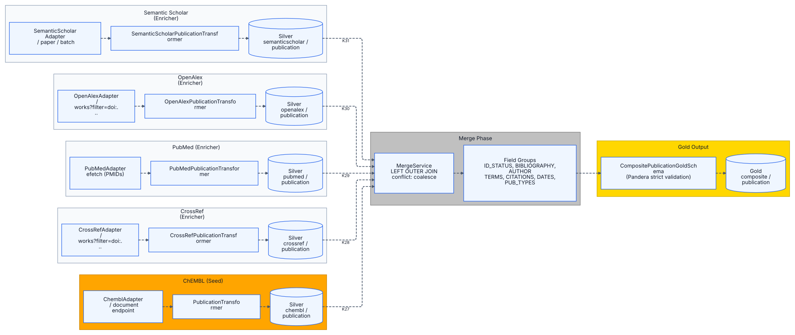

### Описание
Диаграмма «Cross-Provider Data Enrichment Flow — Publication» из views-набора представляет фокусированный срез родительской диаграммы для точечного анализа. Она представлена в формате блок-схема потоков (flowchart) и служит ориентиром на уровне детализации «Mixed (System / Component / Class)». Тип представления: Full. Родительская диаграмма: `(root)`. В комментариях исходника зафиксирован фокус диаграммы: ADR-026 (Composite), publication composite pipeline config. Схема имеет плотность порядка 19 узлов и 18 связей; её удобно использовать как обзорный архитектурный срез для проверки влияния изменений, согласования интерфейсов и подготовки рефакторинга, но не как исчерпывающий каталог текущей кодовой поверхности. Ключевые блоки/подграфы: ChEMBL (Seed), CrossRef (Enricher), PubMed (Enricher), OpenAlex (Enricher), Semantic Scholar (Enricher), Merge Phase. Показательные узлы для быстрого чтения: ChemblAdapter /document endpoint, PublicationTransformer, ("Silver chembl/publication"), CrossRefAdapter /works?filter=doi:..., CrossRefPublicationTransformer, ("Silver crossref/publication").

### Метаданные
- Тип: `flowchart`
- Уровень: `Mixed (System / Component / Class)`
- Дата: `2026-02-24`
- Представление: `Full`

\newpage

## 44-cross-provider-enrichment-infra

**44 Cross Provider Enrichment**

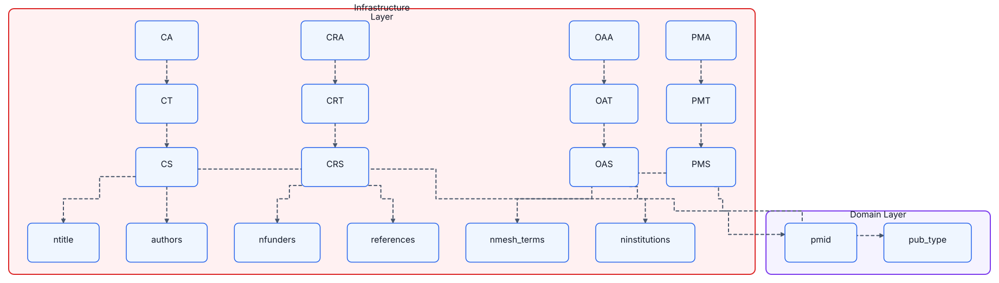

### Описание
Диаграмма «44 Cross Provider Enrichment» из views-набора представляет фокусированный срез родительской диаграммы для точечного анализа. Она представлена в формате блок-схема потоков (flowchart). Тип представления: Infrastructure-Mapping. Родительская диаграмма: `44-cross-provider-enrichment-full.mermaid`. Схема имеет плотность порядка 20 узлов и 16 связей; её удобно использовать как обзорный архитектурный срез для проверки влияния изменений, согласования интерфейсов и подготовки рефакторинга, но не как исчерпывающий каталог текущей кодовой поверхности. Ключевые блоки/подграфы: Domain Layer, Infrastructure Layer. Показательные узлы для быстрого чтения: pmid, pub_type, CS, CT, CA, ntitle.

### Метаданные
- Тип: `flowchart`
- Представление: `Infrastructure-Mapping`

\newpage

## 44-cross-provider-enrichment-overview

**44 Cross Provider Enrichment**

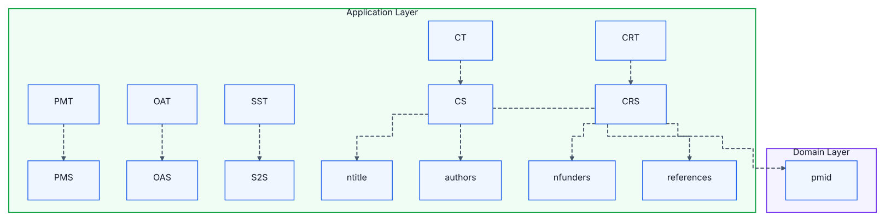

### Описание
Диаграмма «44 Cross Provider Enrichment» из views-набора представляет фокусированный срез родительской диаграммы для точечного анализа. Она представлена в формате блок-схема потоков (flowchart). Тип представления: Overview. Родительская диаграмма: `44-cross-provider-enrichment-full.mermaid`. Схема имеет плотность порядка 15 узлов и 10 связей; её удобно использовать как обзорный архитектурный срез для проверки влияния изменений, согласования интерфейсов и подготовки рефакторинга, но не как исчерпывающий каталог текущей кодовой поверхности. Ключевые блоки/подграфы: Domain Layer, Application Layer. Показательные узлы для быстрого чтения: pmid, CT, CS, CRT, CRS, PMT.

### Метаданные
- Тип: `flowchart`
- Представление: `Overview`

\newpage

## 46-yaml-config-resolution-dataflow

**46 Yaml Config Resolution**

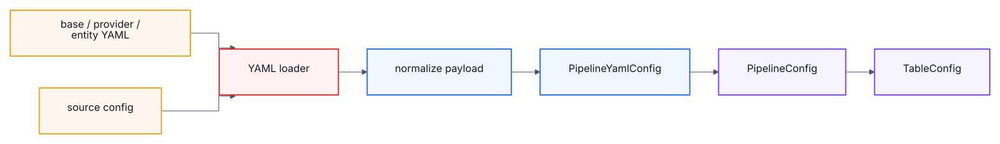

### Описание
Диаграмма «46 Yaml Config Resolution» из views-набора представляет фокусированный срез родительской диаграммы для точечного анализа. Она представлена в формате блок-схема потоков (flowchart). Тип представления: Data-Flow. Родительская диаграмма: `46-yaml-config-resolution-full.mermaid`. Схема имеет плотность порядка 2 узлов и 6 связей; её удобно использовать как обзорный архитектурный срез для проверки влияния изменений, согласования интерфейсов и подготовки рефакторинга, но не как исчерпывающий каталог текущей кодовой поверхности. Показательные узлы для быстрого чтения: base/provider/entity YAML, source config.

### Метаданные
- Тип: `flowchart`
- Представление: `Data-Flow`

\newpage

## 46-yaml-config-resolution-domain

**46 Yaml Config Resolution**

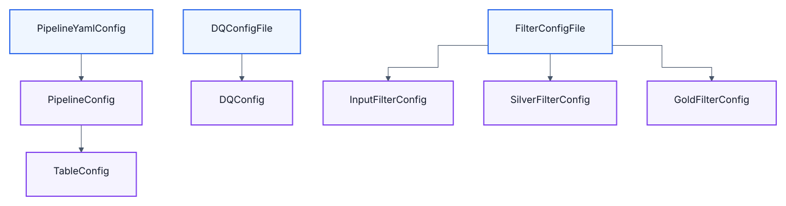

### Описание
Диаграмма «46 Yaml Config Resolution» из views-набора представляет фокусированный срез родительской диаграммы для точечного анализа. Она представлена в формате блок-схема потоков (flowchart). Тип представления: Domain-Focus. Родительская диаграмма: `46-yaml-config-resolution-full.mermaid`. Схема имеет плотность порядка 3 узлов и 6 связей; её удобно использовать как обзорный архитектурный срез для проверки влияния изменений, согласования интерфейсов и подготовки рефакторинга, но не как исчерпывающий каталог текущей кодовой поверхности. Показательные узлы для быстрого чтения: PipelineYamlConfig, DQConfigFile, FilterConfigFile.

### Метаданные
- Тип: `flowchart`
- Представление: `Domain-Focus`

\newpage

## 46-yaml-config-resolution-full

**YAML Configuration Resolution Chain**

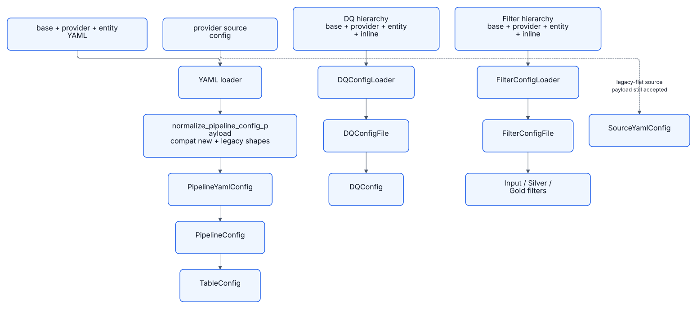

### Описание
Диаграмма «YAML Configuration Resolution Chain» из views-набора представляет фокусированный срез родительской диаграммы для точечного анализа. Она представлена в формате блок-схема потоков (flowchart) и служит ориентиром на уровне детализации «Mixed (System / Component / Class)». Тип представления: Full. Родительская диаграмма: `(root)`. В комментариях исходника зафиксирован фокус диаграммы: unified config path plus still-active normalization compatibility. Схема имеет плотность порядка 4 узлов и 13 связей; её удобно использовать как обзорный архитектурный срез для проверки влияния изменений, согласования интерфейсов и подготовки рефакторинга, но не как исчерпывающий каталог текущей кодовой поверхности. Показательные узлы для быстрого чтения: base + provider + entity YAML, provider source config, DQ hierarchy base + provider + entity + inline, Filter hierarchy base + provider + entity + inline.

### Метаданные
- Тип: `flowchart`
- Уровень: `Mixed (System / Component / Class)`
- Дата: `2026-03-16`
- Представление: `Full`

\newpage

## 46-yaml-config-resolution-infra

**46 Yaml Config Resolution**

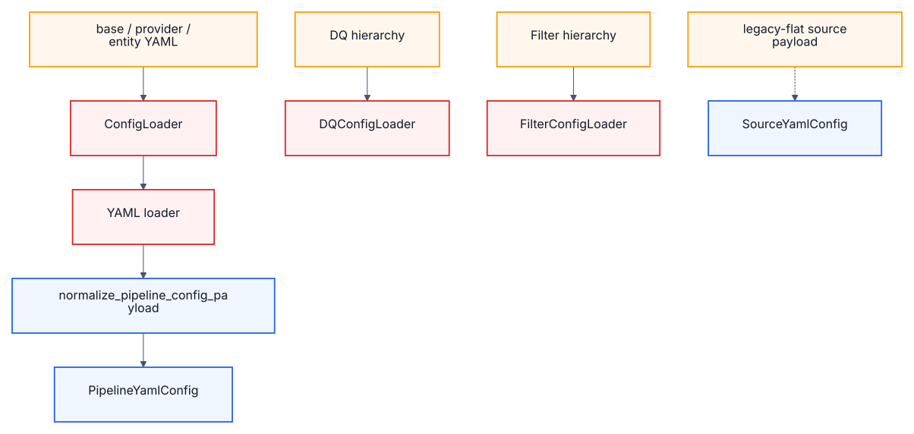

### Описание
Диаграмма «46 Yaml Config Resolution» из views-набора представляет фокусированный срез родительской диаграммы для точечного анализа. Она представлена в формате блок-схема потоков (flowchart). Тип представления: Infrastructure-Mapping. Родительская диаграмма: `46-yaml-config-resolution-full.mermaid`. Схема имеет плотность порядка 4 узлов и 7 связей; её удобно использовать как обзорный архитектурный срез для проверки влияния изменений, согласования интерфейсов и подготовки рефакторинга, но не как исчерпывающий каталог текущей кодовой поверхности. Показательные узлы для быстрого чтения: base / provider / entity YAML, DQ hierarchy, Filter hierarchy, legacy-flat source payload.

### Метаданные
- Тип: `flowchart`
- Представление: `Infrastructure-Mapping`

\newpage

## 46-yaml-config-resolution-overview

**46 Yaml Config Resolution**

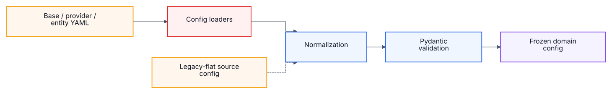

### Описание
Диаграмма «46 Yaml Config Resolution» из views-набора представляет фокусированный срез родительской диаграммы для точечного анализа. Она представлена в формате блок-схема потоков (flowchart). Тип представления: Overview. Родительская диаграмма: `46-yaml-config-resolution-full.mermaid`. Схема имеет плотность порядка 2 узлов и 5 связей; её удобно использовать как обзорный архитектурный срез для проверки влияния изменений, согласования интерфейсов и подготовки рефакторинга, но не как исчерпывающий каталог текущей кодовой поверхности. Показательные узлы для быстрого чтения: Base / provider / entity YAML, Legacy-flat source config.

### Метаданные
- Тип: `flowchart`
- Представление: `Overview`

\newpage

## 48-composite-phase-lifecycle-dataflow

**48 Composite Phase Lifecycle**

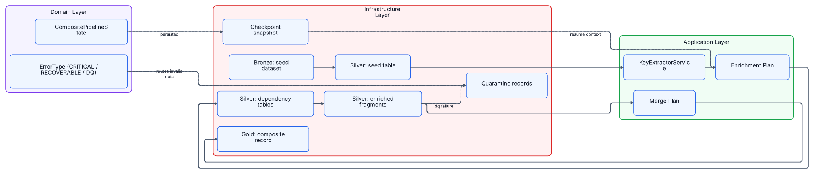

### Описание
Диаграмма «48 Composite Phase Lifecycle» из views-набора представляет фокусированный срез родительской диаграммы для точечного анализа. Она представлена в формате блок-схема потоков (flowchart). Тип представления: Data-Flow. Родительская диаграмма: `48-composite-phase-lifecycle-full.mermaid`. Схема имеет плотность порядка 12 узлов и 7 связей; её удобно использовать как обзорный архитектурный срез для проверки влияния изменений, согласования интерфейсов и подготовки рефакторинга, но не как исчерпывающий каталог текущей кодовой поверхности. Ключевые блоки/подграфы: Domain Layer, Application Layer, Infrastructure Layer. Показательные узлы для быстрого чтения: CompositePipelineState, ErrorType (CRITICAL/RECOVERABLE/DQ), KeyExtractorService, Enrichment Plan, Merge Plan, Bronze: seed dataset.

### Метаданные
- Тип: `flowchart`
- Представление: `Data-Flow`

\newpage

## 48-composite-phase-lifecycle-domain

**48 Composite Phase Lifecycle**

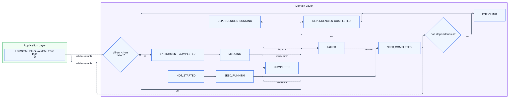

### Описание
Диаграмма «48 Composite Phase Lifecycle» из views-набора представляет фокусированный срез родительской диаграммы для точечного анализа. Она представлена в формате блок-схема потоков (flowchart). Тип представления: Domain-Focus. Родительская диаграмма: `48-composite-phase-lifecycle-full.mermaid`. Схема имеет плотность порядка 11 узлов и 12 связей; её удобно использовать как обзорный архитектурный срез для проверки влияния изменений, согласования интерфейсов и подготовки рефакторинга, но не как исчерпывающий каталог текущей кодовой поверхности. Ключевые блоки/подграфы: Domain Layer, Application Layer. Показательные узлы для быстрого чтения: NOT_STARTED, SEED_RUNNING, SEED_COMPLETED, DEPENDENCIES_RUNNING, DEPENDENCIES_COMPLETED, ENRICHING.

### Метаданные
- Тип: `flowchart`
- Представление: `Domain-Focus`

\newpage

## 48-composite-phase-lifecycle-full

**Composite Pipeline Phase Lifecycle (FSM)**

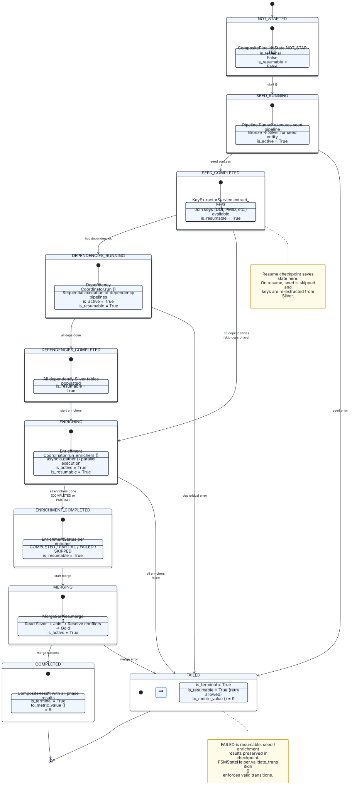

### Описание
Диаграмма «Composite Pipeline Phase Lifecycle (FSM)» из views-набора представляет фокусированный срез родительской диаграммы для точечного анализа. Она представлена в формате диаграмма состояний (state diagram) и служит ориентиром на уровне детализации «Mixed (System / Component / Class)». Тип представления: Full. Родительская диаграмма: `(root)`. В комментариях исходника зафиксирован фокус диаграммы: domain/composite/state.py, application/composite/fsm_helper.py.

### Метаданные
- Тип: `stateDiagram`
- Уровень: `Mixed (System / Component / Class)`
- Дата: `2026-02-24`
- Представление: `Full`

\newpage

## 48-composite-phase-lifecycle-infra

**48 Composite Phase Lifecycle**

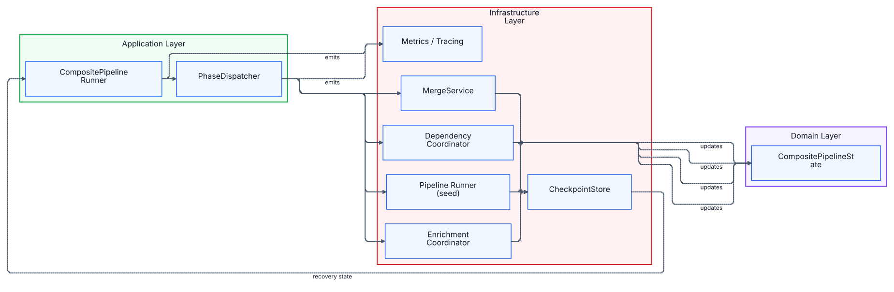

### Описание
Диаграмма «48 Composite Phase Lifecycle» из views-набора представляет фокусированный срез родительской диаграммы для точечного анализа. Она представлена в формате блок-схема потоков (flowchart). Тип представления: Infrastructure-Mapping. Родительская диаграмма: `48-composite-phase-lifecycle-full.mermaid`. Схема имеет плотность порядка 9 узлов и 9 связей; её удобно использовать как обзорный архитектурный срез для проверки влияния изменений, согласования интерфейсов и подготовки рефакторинга, но не как исчерпывающий каталог текущей кодовой поверхности. Ключевые блоки/подграфы: Domain Layer, Application Layer, Infrastructure Layer. Показательные узлы для быстрого чтения: CompositePipelineState, CompositePipelineRunner, PhaseDispatcher, PipelineRunner (seed), DependencyCoordinator, EnrichmentCoordinator.

### Метаданные
- Тип: `flowchart`
- Представление: `Infrastructure-Mapping`

\newpage

## 48-composite-phase-lifecycle-overview

**48 Composite Phase Lifecycle**

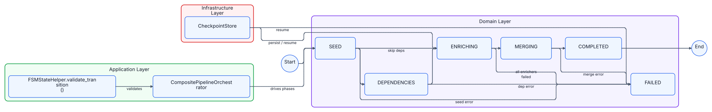

### Описание
Диаграмма «48 Composite Phase Lifecycle» из views-набора представляет фокусированный срез родительской диаграммы для точечного анализа. Она представлена в формате блок-схема потоков (flowchart). Тип представления: Overview. Родительская диаграмма: `48-composite-phase-lifecycle-full.mermaid`. Схема имеет плотность порядка 9 узлов и 7 связей; её удобно использовать как обзорный архитектурный срез для проверки влияния изменений, согласования интерфейсов и подготовки рефакторинга, но не как исчерпывающий каталог текущей кодовой поверхности. Ключевые блоки/подграфы: Domain Layer, Application Layer, Infrastructure Layer. Показательные узлы для быстрого чтения: SEED, DEPENDENCIES, ENRICHING, MERGING, COMPLETED, FAILED.

### Метаданные
- Тип: `flowchart`
- Представление: `Overview`

\newpage

## 50-exception-hierarchy-dataflow

**50 Exception Hierarchy**

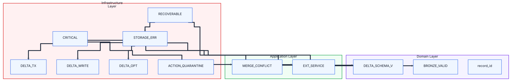

### Описание
Диаграмма «50 Exception Hierarchy» из views-набора представляет фокусированный срез родительской диаграммы для точечного анализа. Она представлена в формате блок-схема потоков (flowchart). Тип представления: Data-Flow. Родительская диаграмма: `50-exception-hierarchy-full.mermaid`. Схема имеет плотность порядка 12 узлов и 8 связей; её удобно использовать как обзорный архитектурный срез для проверки влияния изменений, согласования интерфейсов и подготовки рефакторинга, но не как исчерпывающий каталог текущей кодовой поверхности. Ключевые блоки/подграфы: Domain Layer, Application Layer, Infrastructure Layer. Показательные узлы для быстрого чтения: DELTA_SCHEMA_V, BRONZE_VALID, record_id, MERGE_CONFLICT, EXT_SERVICE, DELTA_TX.

### Метаданные
- Тип: `flowchart`
- Представление: `Data-Flow`

\newpage

## 50-exception-hierarchy-domain

**50 Exception Hierarchy**

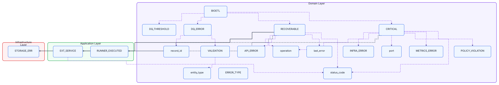

### Описание
Диаграмма «50 Exception Hierarchy» из views-набора представляет фокусированный срез родительской диаграммы для точечного анализа. Она представлена в формате блок-схема потоков (flowchart). Тип представления: Domain-Focus. Родительская диаграмма: `50-exception-hierarchy-full.mermaid`. Схема имеет плотность порядка 20 узлов и 21 связей; её удобно использовать как обзорный архитектурный срез для проверки влияния изменений, согласования интерфейсов и подготовки рефакторинга, но не как исчерпывающий каталог текущей кодовой поверхности. Ключевые блоки/подграфы: Domain Layer, Application Layer, Infrastructure Layer. Показательные узлы для быстрого чтения: DQ_ERROR, POLICY_VIOLATION, METRICS_ERROR, port, INFRA_ERROR, last_error.

### Метаданные
- Тип: `flowchart`
- Представление: `Domain-Focus`

\newpage

## 50-exception-hierarchy-full

**Exception Hierarchy — Full Tree**

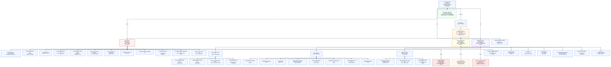

### Описание
Диаграмма «Exception Hierarchy — Full Tree» из views-набора представляет фокусированный срез родительской диаграммы для точечного анализа. Она представлена в формате блок-схема потоков (flowchart) и служит ориентиром на уровне детализации «Mixed (System / Component / Class)». Тип представления: Full. Родительская диаграмма: `(root)`. В комментариях исходника зафиксирован фокус диаграммы: domain/exceptions/ (base, network, validation, internal, infrastructure, data_quality). Схема имеет плотность порядка 6 узлов и 48 связей; её удобно использовать как обзорный архитектурный срез для проверки влияния изменений, согласования интерфейсов и подготовки рефакторинга, но не как исчерпывающий каталог текущей кодовой поверхности. Показательные узлы для быстрого чтения: Exception (Python built-in), BioETLError domain/exceptions/base.py error_type: ErrorType context: dict, ErrorClassifier domain/error_classifier.py .classify(error) → ErrorType, Action: ABORT Pipeline stops immediately PipelineRunState → FAILED, Action: RETRY Exponential backoff Max retries from AdapterConfig, Action: QUARANTINE Record → QuarantineEntry Pipeline continues.

### Метаданные
- Тип: `flowchart`
- Уровень: `Mixed (System / Component / Class)`
- Дата: `2026-02-24`
- Представление: `Full`

\newpage

## 50-exception-hierarchy-infra

**50 Exception Hierarchy**

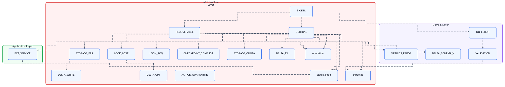

### Описание
Диаграмма «50 Exception Hierarchy» из views-набора представляет фокусированный срез родительской диаграммы для точечного анализа. Она представлена в формате блок-схема потоков (flowchart). Тип представления: Infrastructure-Mapping. Родительская диаграмма: `50-exception-hierarchy-full.mermaid`. Схема имеет плотность порядка 20 узлов и 22 связей; её удобно использовать как обзорный архитектурный срез для проверки влияния изменений, согласования интерфейсов и подготовки рефакторинга, но не как исчерпывающий каталог текущей кодовой поверхности. Ключевые блоки/подграфы: Domain Layer, Application Layer, Infrastructure Layer. Показательные узлы для быстрого чтения: METRICS_ERROR, DELTA_SCHEMA_V, DQ_ERROR, VALIDATION, EXT_SERVICE, STORAGE_ERR.

### Метаданные
- Тип: `flowchart`
- Представление: `Infrastructure-Mapping`

\newpage

## 50-exception-hierarchy-overview

**50 Exception Hierarchy**

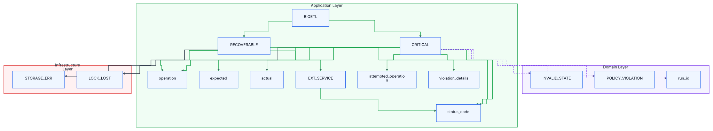

### Описание
Диаграмма «50 Exception Hierarchy» из views-набора представляет фокусированный срез родительской диаграммы для точечного анализа. Она представлена в формате блок-схема потоков (flowchart). Тип представления: Overview. Родительская диаграмма: `50-exception-hierarchy-full.mermaid`. Схема имеет плотность порядка 15 узлов и 17 связей; её удобно использовать как обзорный архитектурный срез для проверки влияния изменений, согласования интерфейсов и подготовки рефакторинга, но не как исчерпывающий каталог текущей кодовой поверхности. Ключевые блоки/подграфы: Domain Layer, Application Layer, Infrastructure Layer. Показательные узлы для быстрого чтения: INVALID_STATE, POLICY_VIOLATION, run_id, BIOETL, CRITICAL, RECOVERABLE.

### Метаданные
- Тип: `flowchart`
- Представление: `Overview`
