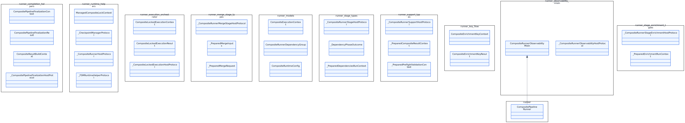
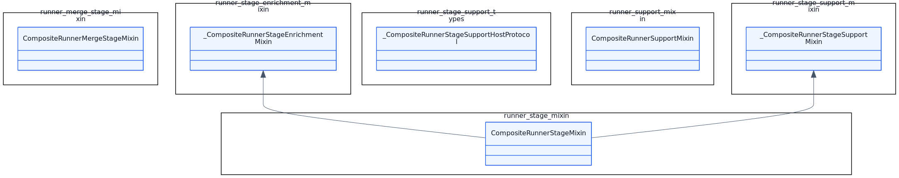
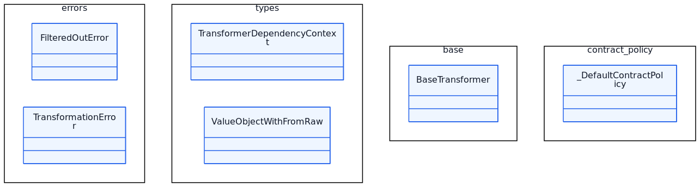
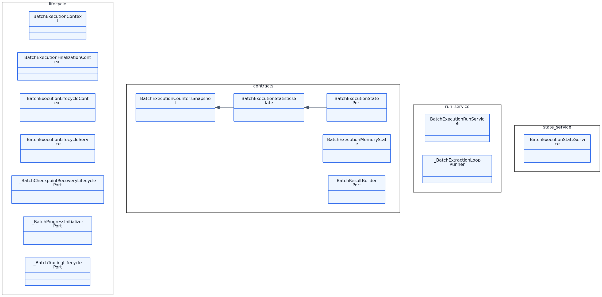
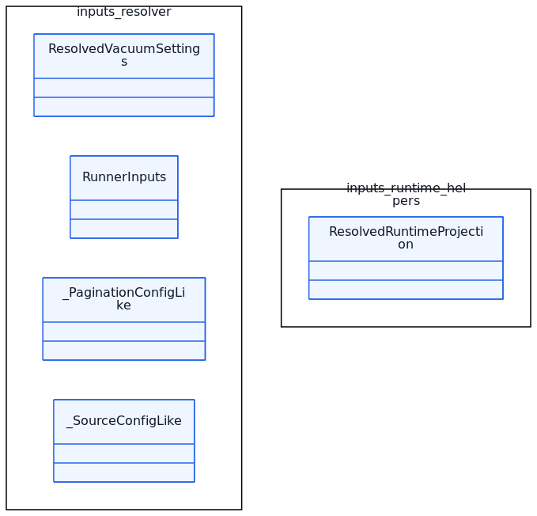
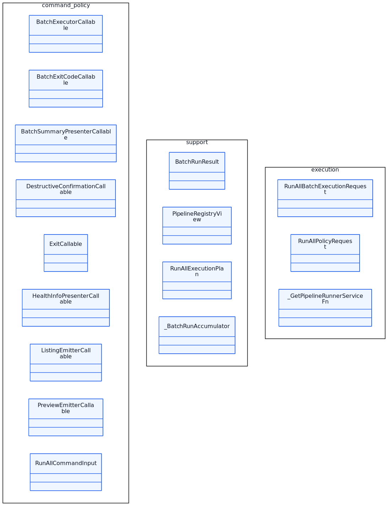

# BioETL Diagrams — PNG Index

_Generated: 2026-04-20T22:01:03+03:00_

## Domain Ports

______________________________________________________________________

## 01adomain Ports Method Catalog

______________________________________________________________________

## Entities Aggregates

______________________________________________________________________

## Value Objects

______________________________________________________________________

## Types Enums

______________________________________________________________________

## Exceptions

______________________________________________________________________

## Config Classes

______________________________________________________________________

## Application Core Services Frontmatter Sandbox

______________________________________________________________________

## Application Core Services

______________________________________________________________________

## Application Services

______________________________________________________________________

## 08aapplication Services Operation Catalog

______________________________________________________________________

## Transformers

______________________________________________________________________

## Adapters

______________________________________________________________________

## Storage

______________________________________________________________________

## Composite Pipeline

______________________________________________________________________

## Domain Services

______________________________________________________________________

## Observability

______________________________________________________________________

## 14aobservability Method Catalog

______________________________________________________________________

## Extractors

______________________________________________________________________

## Factories Bootstrap

______________________________________________________________________

## Pkg Application Composite Checkpoint

______________________________________________________________________

## Pkg Application Composite Runner Pkg Part1

______________________________________________________________________

## Pkg Application Composite Runner Pkg Part2

______________________________________________________________________

## Pkg Application Composite Runner_pkg Part1

______________________________________________________________________

## Pkg Application Composite Runner_pkg Part2

______________________________________________________________________

## Pkg Application Core Base Transformer

______________________________________________________________________

## Pkg Application Core Base_transformer

______________________________________________________________________

## Pkg Application Core Batch Execution

______________________________________________________________________

## Pkg Application Core Batch_execution

______________________________________________________________________

## Pkg Application Core Lifecycle

______________________________________________________________________

## Pkg Application Core Postrun

______________________________________________________________________

## Pkg Application Core Preflight

______________________________________________________________________

## Pkg Application Observability

______________________________________________________________________

## Pkg Application Pipelines Chembl

______________________________________________________________________

## Pkg Application Pipelines Common

______________________________________________________________________

## Pkg Application Pipelines Pubmed

______________________________________________________________________

## Pkg Application Pipelines Uniprot Extractors

______________________________________________________________________

## Pkg Application Pipelines Uniprot

______________________________________________________________________

## Pkg Application Services Dq

______________________________________________________________________

## Pkg Composition Bootstrap Runtime

______________________________________________________________________

## Pkg Composition Factories Datasource

______________________________________________________________________

## Pkg Composition Factories Services

______________________________________________________________________

## Pkg Composition Factories Storage

______________________________________________________________________

## Pkg Composition Providers

______________________________________________________________________

## Pkg Composition Runtime Builders

______________________________________________________________________

## Pkg Composition Runtime_builders

______________________________________________________________________

## Pkg Composition

______________________________________________________________________

## Pkg Domain Aggregates

______________________________________________________________________

## Pkg Domain Composite Part1

______________________________________________________________________

## Pkg Domain Composite Part2

______________________________________________________________________

## Pkg Domain Contracts Gold

______________________________________________________________________

## Pkg Domain Control Plane

______________________________________________________________________

## Pkg Domain Exceptions Infrastructure

______________________________________________________________________

## Pkg Domain Exceptions Network

______________________________________________________________________

## Pkg Domain Filtering

______________________________________________________________________

## Pkg Domain Lineage

______________________________________________________________________

## Pkg Domain Models

______________________________________________________________________

## Pkg Domain Ports Config

______________________________________________________________________

## Pkg Domain Ports Metadata

______________________________________________________________________

## Pkg Domain Ports Noop

______________________________________________________________________

## Pkg Domain Ports Observability

______________________________________________________________________

## Pkg Domain Ports Quality

______________________________________________________________________

## Pkg Domain Ports Runtime

______________________________________________________________________

## Pkg Domain Ports Storage

______________________________________________________________________

## Pkg Domain Schemas Chembl

______________________________________________________________________

## Pkg Domain Schemas Pubchem

______________________________________________________________________

## Pkg Domain Schemas Uniprot

______________________________________________________________________

## Pkg Domain

______________________________________________________________________

## Pkg Infrastructure Adapters Chembl Part1

______________________________________________________________________

## Pkg Infrastructure Adapters Chembl Part2

______________________________________________________________________

## Pkg Infrastructure Adapters Common

______________________________________________________________________

## Pkg Infrastructure Adapters Crossref

______________________________________________________________________

## Pkg Infrastructure Adapters Http

______________________________________________________________________

## Pkg Infrastructure Adapters Openalex

______________________________________________________________________

## Pkg Infrastructure Adapters Pubchem

______________________________________________________________________

## Pkg Infrastructure Adapters Pubmed

______________________________________________________________________

## Pkg Infrastructure Adapters Semanticscholar

______________________________________________________________________

## Pkg Infrastructure Adapters Uniprot Part1

______________________________________________________________________

## Pkg Infrastructure Adapters Uniprot Part2

______________________________________________________________________

## Pkg Infrastructure Config

______________________________________________________________________

## Pkg Infrastructure Control Plane

______________________________________________________________________

## Pkg Infrastructure Export

______________________________________________________________________

## Pkg Infrastructure Observability Anomaly

______________________________________________________________________

## Pkg Infrastructure Schemas Part1

______________________________________________________________________

## Pkg Infrastructure Schemas Part2

______________________________________________________________________

## Pkg Infrastructure Schemas Part3

______________________________________________________________________

## Pkg Infrastructure Storage Bronze

______________________________________________________________________

## Pkg Infrastructure Storage Delta

______________________________________________________________________

## Pkg Infrastructure Storage Gold Part1

______________________________________________________________________

## Pkg Infrastructure Storage Gold Part2

______________________________________________________________________

## Pkg Infrastructure Storage Metadata

______________________________________________________________________

## Pkg Infrastructure Storage Silver Part1

______________________________________________________________________

## Pkg Infrastructure Storage Silver Part2

______________________________________________________________________

## Pkg Infrastructure Storage Support

______________________________________________________________________

## Pkg Infrastructure Validation

______________________________________________________________________

## Pkg Interfaces Cli Commands Domains Quarantine

______________________________________________________________________

## Pkg Interfaces Cli Commands Domains Run All

______________________________________________________________________

## Pkg Interfaces Cli Commands Domains Run

______________________________________________________________________

## Pkg Interfaces Cli Commands Domains Run_all

______________________________________________________________________

## Pkg Interfaces Http

______________________________________________________________________
