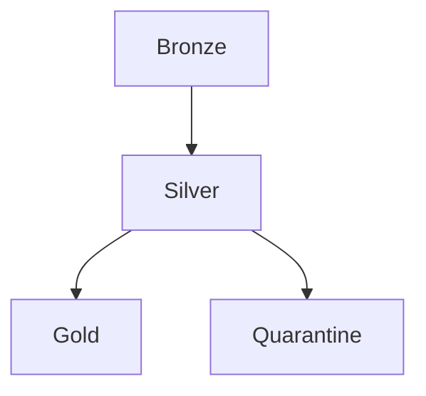
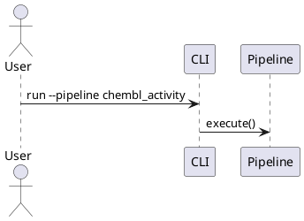
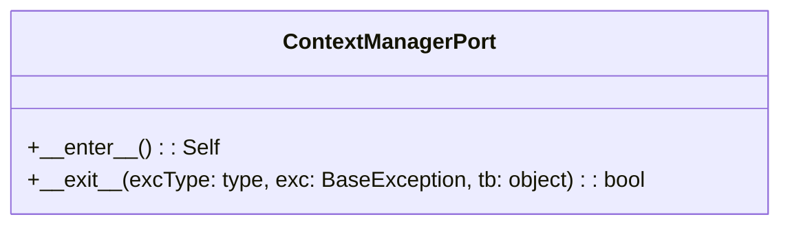
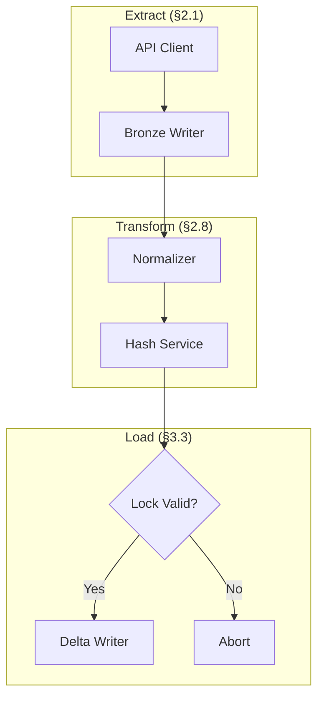
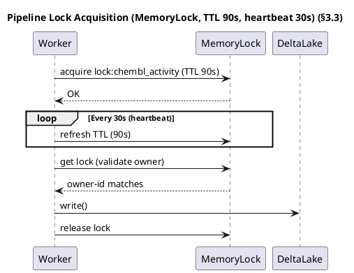

______________________________________________________________________

Version: 1.0.0
Status: active
Class: published
Owner: BioETL Team
Reviewers:

- BioETL Team
  Last verified: '2026-03-29'

______________________________________________________________________

# Historical Diagramming Policy

*Synced with RULES.md v6.1.3 (2026-04-29)*

> **Canonical policy:** [`docs/02-architecture/diagrams/governance/policy.md`](policy.md) (POL-LLM-DIAGRAMS-001).
> **Canonical diagrams:** [`docs/02-architecture/diagrams/`](../README.md).
> This file is kept for historical reference. All new diagram work should follow the canonical policy.
> **Historical note:** examples below are preserved for context; prefer canonical `.mmd` paths from `diagrams/`.

## Overview

This document defines standards for creating, maintaining, and versioning architecture diagrams in the BioETL project.

______________________________________________________________________

## 1. General Principles

### 1.1 Text-First Approach (MUST)

- **Primary format**: Mermaid or PlantUML (text-based)
- **Rationale**: Version control friendly, diff-able, reviewable in PRs
- **Binary images**: Rendered via `render.sh`, gitignored (regenerated on demand)

### 1.2 Single Responsibility (MUST)

- **One diagram per file**
- **One concept per diagram** (avoid overloading)
- **Clear scope** defined in diagram title

### 1.3 Consistency (SHOULD)

- Use consistent notation across all diagrams
- Follow naming conventions from RULES.md §2
- Reference RULES.md sections where applicable

______________________________________________________________________

## 2. File Organization

### 2.1 Directory Structure

```
docs/02-architecture/diagrams/     # Единый корень диаграмм
├── architecture/*.mmd                 # System/component diagrams
├── class-diagrams/*.mmd               # Class structure diagrams
├── foundation/*.mmd                   # Historical + TOP-25
├── views/*.mermaid                    # Decomposed views (156 файлов)
├── governance/                        # Diagram governance + inventories
│   ├── 00-diagramming-policy.md       # Historical policy/context
│   ├── policy.md                      # Canonical policy
│   ├── diagrams-index.md              # Index of all diagrams
│   └── ...
├── theme/                             # Render theme (CSS + config)
├── tooling/render.sh                  # Unified render script
└── README.md                          # Main diagram catalog
```

### 2.2 Naming Convention (MUST)

- Format: `NN-<topic>.mmd` (canonical) or `NN-<topic>.mermaid` (historical)
- Examples:
  - `01-high-level.mmd`
  - `03-pipeline-execution-happy-path.mmd`
- Prefix `NN-` for ordering
- Topic in kebab-case
- Extension: `.mmd` (canonical standardized extension)

### 2.3 Diagram Definition of Done (MUST)

Новая или обновлённая диаграмма считается готовой только когда:

- есть исходник `.mmd` в `diagrams/` (или `.mermaid` в `views/` для decomposed);
- rendered PNG/SVG генерируются через `render.sh` (gitignored);
- есть запись в `diagrams-index.md` или `README.md`;
- есть контекстный абзац со ссылкой в `docs/02-architecture/*.md`.

______________________________________________________________________

## 3. Format Standards

### 3.1 Mermaid (Preferred)

Use for:

- Flowcharts
- Sequence diagrams (simple)
- Class diagrams
- State diagrams



### 3.2 PlantUML

Use for:

- Complex sequence diagrams
- Component diagrams
- Deployment diagrams



### 3.3 ASCII Art

Use for:

- Inline documentation in markdown
- Quick sketches
- README visualizations

```
┌─────────┐     ┌─────────┐     ┌─────────┐
│ Bronze  │────►│ Silver  │────►│  Gold   │
└─────────┘     └─────────┘     └─────────┘
```

______________________________________________________________________

## 4. Content Guidelines

### 4.1 Required Elements

Every diagram MUST include:

- **Title**: Clear description of what's shown
- **Legend**: If using custom symbols or colors
- **RULES.md reference**: Link to relevant sections

### 4.2 Labeling (MUST)

- Use consistent terminology from Glossary (RULES.md)
- Include RULES.md section references where applicable
- Example: `Lock Acquire (§3.3)`

### 4.3 Colors (SHOULD)

Recommended color scheme:

| Element          | Color  | Hex     |
| ---------------- | ------ | ------- |
| Bronze Layer     | Orange | #FFA500 |
| Silver Layer     | Silver | #C0C0C0 |
| Gold Layer       | Gold   | #FFD700 |
| Error/Quarantine | Red    | #e11d48 |
| Success          | Green  | #4CAF50 |
| External         | Blue   | #2563eb |

### 4.4 Class Diagram Method Signatures (MUST for `class-diagrams/`)

Чтобы методы стабильно рендерились в SVG/PDF и не теряли символы:

- Экранируйте dunder-методы: `__enter__`, `__exit__`, `__aenter__`, `__aexit__`
  - Пишите как `+\\_\\_enter\\_\\_()`, `+\\_\\_aexit\\_\\_()`
  - Неэкранированная форма может терять `_` в финальном рендере
- Используйте единый стиль return-нотации в рамках одной диаграммы
  - Предпочтительный стиль: `+method(arg: Type): ReturnType`
  - Не смешивайте с альтернативой `+method(arg: Type) ReturnType`
- Ограничивайте длину сигнатуры метода
  - Рекомендуемый soft-limit: до 88 символов на строку
  - Длинные сигнатуры переносите через упрощение параметров или вынос деталей в notes
- Избегайте тяжёлых generic-сигнатур в одном методе
  - Вместо `Result[dict[str, list[tuple[str, int]]], ValidationError]` используйте алиас типа в комментарии/легенде
- После изменения class-diagram запускайте проверки:
  - `python scripts/diagrams/lint_diagrams.py <diagram.mmd>`
  - `python scripts/diagrams/check_class_method_render_integrity.py --source-dir docs/02-architecture/diagrams/class-diagrams --svg-dir docs/02-architecture/diagrams/class-diagrams/svg`

Пример (корректно):



______________________________________________________________________

## 5. Maintenance

### 5.1 Update Triggers (MUST)

Update diagrams when:

- Architecture changes (new layers, components)
- Pipeline flow modifications
- New error handling patterns
- Infrastructure changes
- Breaking changes (§7.1)

### 5.2 Review Process (SHOULD)

- Include diagram updates in same PR as code changes
- Reviewer verifies diagram accuracy
- Check RULES.md compliance

### 5.3 Staleness Detection

- Review all diagrams quarterly
- Mark outdated diagrams with `<!-- NEEDS UPDATE -->`
- Track in `../../00-map.md`

______________________________________________________________________

## 6. Tools

### 6.1 Recommended Editors

| Tool                        | Format   | Notes                              |
| --------------------------- | -------- | ---------------------------------- |
| VS Code + Mermaid Extension | Mermaid  | Live preview                       |
| PlantUML Server             | PlantUML | Docker: `plantuml/plantuml-server` |
| Mermaid Live Editor         | Mermaid  | https://mermaid.live               |

### 6.2 CI Integration (SHOULD)

```yaml
# .github/workflows/docs.yml
- name: Validate Mermaid
  run: npx @mermaid-js/mermaid-cli -i docs/**/*.mmd
```

______________________________________________________________________

## 7. Diagram Catalog

| ID  | Name                    | Format   | Covers            |
| --- | ----------------------- | -------- | ----------------- |
| 01  | High-Level Architecture | Mermaid  | §1.1 Layers       |
| 02  | Medallion Flow          | Mermaid  | §2.1 Data Flow    |
| 03  | Pipeline Sequence       | PlantUML | §3 Execution      |
| 04  | Error Handling          | Mermaid  | §3.1 Errors       |
| 05  | Locking                 | PlantUML | §3.3 Concurrency  |
| 06  | Class Diagram           | Mermaid  | Domain Objects    |
| 07  | Deployment              | Mermaid  | §5.6 Environments |

______________________________________________________________________

## 8. Examples

### 8.1 Mermaid Flowchart



### 8.2 PlantUML Sequence



______________________________________________________________________

## Related Documents

- [RULES.md](../../../00-project/RULES.md) - Project rules
- [00-map.md](../../../00-project/00-map.md) - Project navigator
