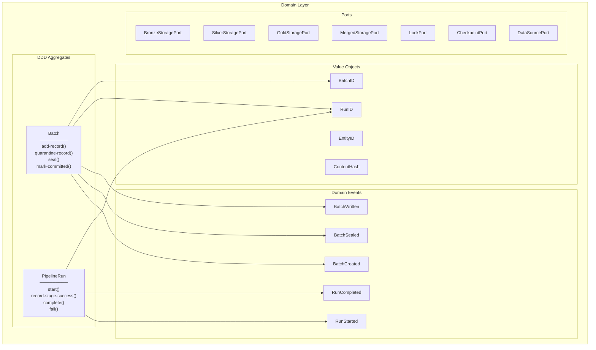
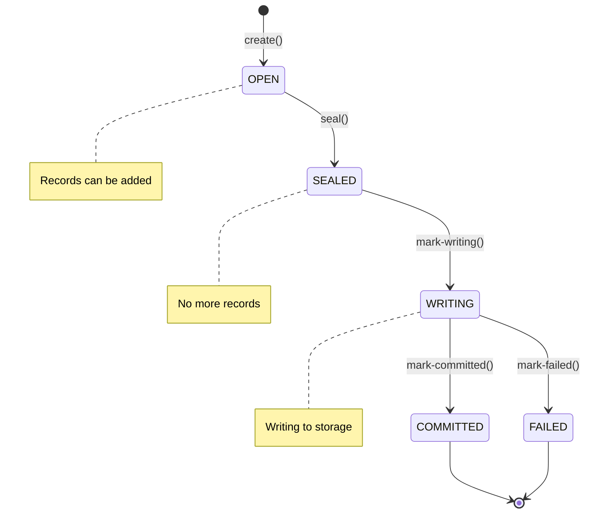
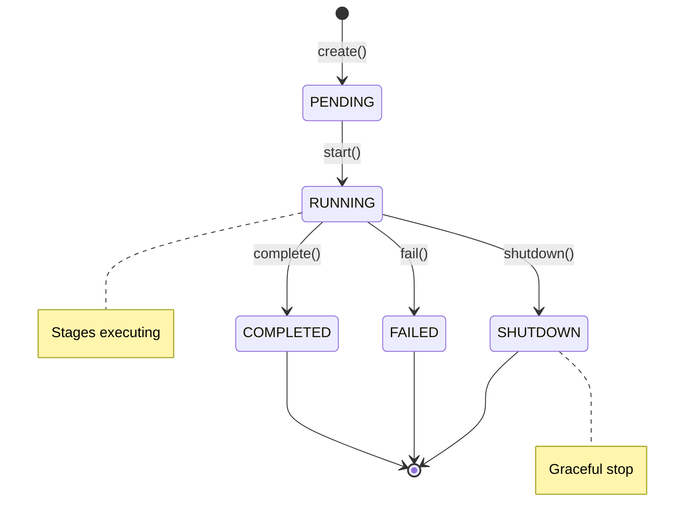

______________________________________________________________________

Version: 1.0.0
Status: active
Class: published
Owner: BioETL Team
Reviewers:

- BioETL Team
  Last verified: '2026-03-29'

______________________________________________________________________

# Diagrams

## High-Level Architecture

> **Diagram:** See [`01-high-level-hexagonal.mmd`](../architecture/01-high-level-hexagonal.mmd)

## Medallion Architecture

> **Diagram:** See [`03-medallion-data-flow.mmd`](../architecture/03-medallion-data-flow.mmd)

## Class Diagram

> **Diagram:** See [`07-application-core-services.mmd`](../class-diagrams/07-application-core-services.mmd)

## Layer Interaction

Shows how BioETL layers communicate following Hexagonal Architecture:

> **Diagram:** See [`02-layer-dependency-matrix.mmd`](../architecture/02-layer-dependency-matrix.mmd)

## Pipeline Execution Sequence

Shows the complete execution flow from CLI to data storage:

> **Diagram:** See [`04-pipeline-execution-flow.mmd`](../architecture/04-pipeline-execution-flow.mmd)

## Medallion Data Flow

Shows data transformation through Bronze → Silver → Gold layers:

> **Diagram:** See [`03-medallion-data-flow.mmd`](../architecture/03-medallion-data-flow.mmd)
> *(detailed version with DQ and quarantine)*

## Domain Layer (DDD)

Shows the DDD components in the domain layer:

See [ADR-021: DDD Aggregates Adoption](../../decisions/ADR-021-ddd-aggregates-adoption.md) for details.

## Batch State Machine

## PipelineRun State Machine

## C4 Container Diagram

For a more detailed look at the runtime instances and interactions between the services, see the C4 Container Diagram.

- **[C4: Диаграмма Контейнеров](container-reference.md)**
