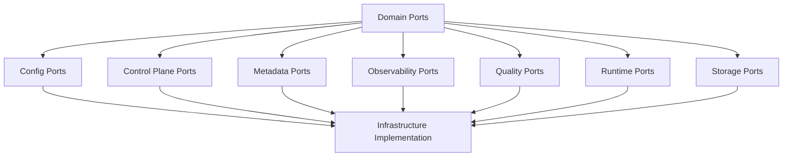

# Domain Ports Catalog

## Overview

Domain Ports определяют интерфейсы между Domain слоем и внешним миром. Они реализуют паттерн Ports & Adapters (Hexagonal Architecture).

**Total Ports:** 115+ interfaces organised across 7 categories.

## Port Categories

### 1. Config Ports (`config/`)

Порты для конфигурации системы:

- `ConfigLoader` - Загрузка конфигурации
- `ConfigValidator` - Валидация конфигурации
- `ConfigProvider` - Провайдер конфигурации

**Implementation:** `src/bioetl/infrastructure/config/`

### 2. Control Plane Ports (`control_plane/`)

Порты для Control Plane артефактов (RunManifest, RunLedger, WorkflowManifest, WorkflowLedger):

- `RunManifestRepository` - Репозиторий RunManifest
- `RunLedgerWriter` - Запись событий в RunLedger
- `WorkflowManifestRepository` - Репозиторий WorkflowManifest
- `WorkflowLedgerWriter` - Запись событий в WorkflowLedger
- `CheckpointStorage` - Хранение checkpoint
- `CheckpointReader` - Чтение checkpoint
- `RunStateStore` - Хранение состояния запуска
- `WorkflowStateStore` - Хранение состояния workflow

**Implementation:** `src/bioetl/infrastructure/control_plane/`

### 3. Metadata Ports (`metadata/`)

Порты для метаданных:

- `MetadataFetcher` - Fetch метаданных
- `MetadataEnricher` - Enrichment метаданных
- `MetadataValidator` - Валидация метаданных
- `MetadataCache` - Кэш метаданных
- `MetadataRepository` - Репозиторий метаданных

**Implementation:** `src/bioetl/infrastructure/adapters/metadata/`

### 4. Observability Ports (`observability/`)

Порты для observability:

- `MetricsPublisher` - Публикация метрик
- `Logger` - Logging
- `Tracer` - Distributed tracing
- `AlertPublisher` - Публикация алертов
- `HealthChecker` - Health checks
- `PerformanceMonitor` - Мониторинг производительности
- `AuditLogger` - Audit logging
- `TelemetryCollector` - Сбор телеметрии

**Implementation:** `src/bioetl/infrastructure/observability/`

### 5. Quality Ports (`quality/`)

Порты для Data Quality:

- `DataValidator` - Валидация данных
- `QualityChecker` - Проверка качества
- `QuarantineHandler` - Обработка карантина
- `QualityReporter` - Отчёт о качестве
- `SchemaValidator` - Валидация схем
- `CrossFieldValidator` - Cross-field валидация
- `QualityMetricsCalculator` - Расчёт метрик качества
- `QualityThresholdEnforcer` - Enforcing порогов качества
- `QualityRuleEngine` - Engine правил качества
- `QualityAnomalyDetector` - Детекция аномалий
- `QualityProfiler` - Профилирование качества
- `QualityTrendAnalyzer` - Анализ трендов
- `QualityReporter` - Генерация отчётов

**Implementation:** `src/bioetl/infrastructure/adapters/quality/`

### 6. Runtime Ports (`runtime/`)

Порты для runtime операций:

- `PipelineExecutor` - Исполнение pipeline
- `PipelineScheduler` - Планирование pipeline
- `PipelineMonitor` - Мониторинг pipeline
- `PipelineController` - Контроль pipeline
- `BatchProcessor` - Обработка батчей
- `RecordProcessor` - Обработка записей
- `Transformer` - Трансформация данных
- `StorageReader` - Чтение из storage
- `StorageWriter` - Запись в storage
- `StorageDeleter` - Удаление из storage
- `LockManager` - Управление блокировками
- `RetryPolicy` - Политика retry
- `CircuitBreaker` - Circuit breaker
- `RateLimiter` - Rate limiting
- `TimeoutManager` - Управление timeout
- `AsyncExecutor` - Асинхронное выполнение
- `ResourcePool` - Пул ресурсов
- `TaskQueue` - Очередь задач

**Implementation:** `src/bioetl/infrastructure/adapters/runtime/`, `src/bioetl/infrastructure/storage/`

### 7. Storage Ports (`storage/`)

Порты для storage:

- `StorageAdapter` - Базовый интерфейс storage
- `BronzeStorage` - Storage для Bronze слоя
- `SilverStorage` - Storage для Silver слоя
- `GoldStorage` - Storage для Gold слоя
- `QuarantineStorage` - Storage для карантина
- `CheckpointStorage` - Storage для checkpoint
- `StorageCleaner` - Очистка storage

**Implementation:** `src/bioetl/infrastructure/storage/`

## Dependency Diagram

## Implementation Pattern

Каждый порт:
1. Определён как abstract interface в `domain/ports/`
2. Реализован в `infrastructure/` соответствующем модуле
3. Инжектируется через composition layer

## Best Practices

1. Ports должны быть domain-agnostic
2. Implementation details скрыты в infrastructure
3. Dependency injection через composition root
4. Минимизация dependencies между портами