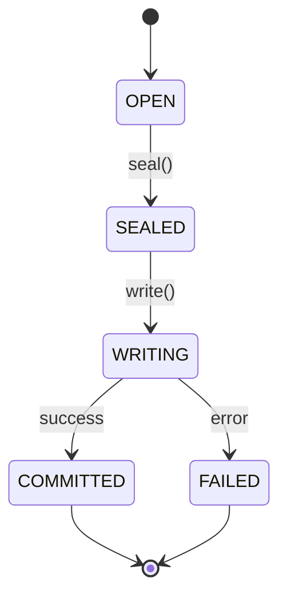
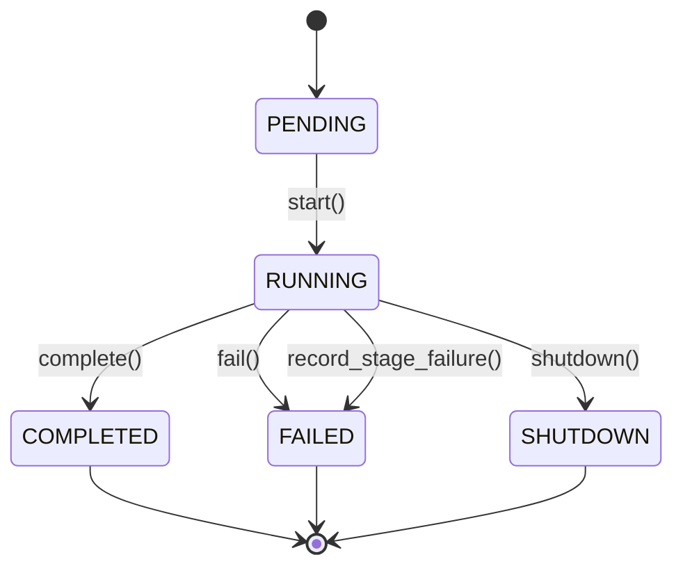
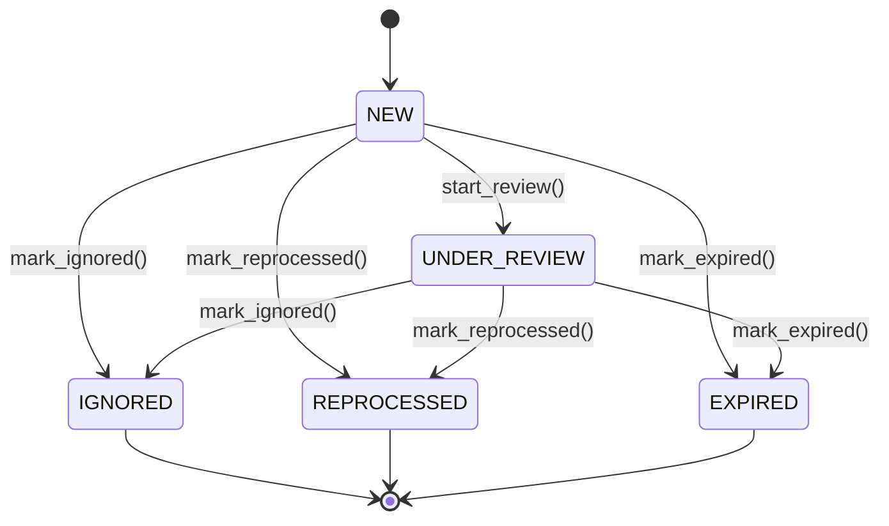

# Aggregate Invariants

This document provides architecture-level canonical documentation for BioETL aggregate invariants and lifecycle rules. For detailed reference documentation with examples, see [Domain Invariants](../../04-reference/domain/invariants.md) in the published reference surfaces.

## Overview

BioETL uses Domain-Driven Design (DDD) with three core aggregates:

1. **Batch** - Atomic write unit for Delta Lake operations
2. **PipelineRun** - Orchestrates pipeline execution and state tracking
3. **QuarantineEntry** - Manages failed records and resolution workflow

## Architecture-Level Invariants

### Batch Aggregate

**State Machine:**

**Valid Transitions:**
- `OPEN` → `SEALED` (seal the batch for writing)
- `SEALED` → `WRITING` (begin writing records)
- `WRITING` → `COMMITTED` (successfully complete)
- `WRITING` → `FAILED` (write operation failed)

**Invalid Transitions:**
- `COMMITTED` → `OPEN` (cannot reopen committed batch)
- `FAILED` → `OPEN` (cannot reopen failed batch)
- `SEALED` → `COMMITTED` (must go through WRITING)
- `OPEN` → `WRITING` (must seal first)

**Key Invariants:**
1. **Content Hash Immutability**: The `content_hash` is immutable after `SEALED` state
2. **No Records After Sealed**: Records cannot be added after the batch is `SEALED`
3. **One-Way State Transitions**: States only move forward; no rollback to previous states
4. **Atomic Commit**: All records are committed atomically or not at all
5. **Write-Once**: A batch can only be written once; subsequent writes are rejected

**Runtime Location:**
- Source: `src/bioetl/domain/aggregates/batch.py`
- Reference: [Domain Invariants - Batch](../../04-reference/domain/invariants.md#aggregate-invariants)

### PipelineRun Aggregate

**State Machine:**

**Valid Transitions:**
- `PENDING` → `RUNNING` (start execution)
- `RUNNING` → `COMPLETED` (successful completion)
- `RUNNING` → `FAILED` (execution failed or stage failure)
- `RUNNING` → `SHUTDOWN` (shutdown initiated)

**Invalid Transitions:**
- `COMPLETED` → `RUNNING` (cannot restart completed run)
- `FAILED` → `RUNNING` (cannot restart failed run without new instance)
- `SHUTDOWN` → `RUNNING` (cannot restart shutdown run)
- `PENDING` → `COMPLETED` (must go through RUNNING)

**Key Invariants:**
1. **Immutable Manifest**: The run manifest is immutable after `PENDING` state
2. **Append-Only Ledger**: All state changes are recorded in an append-only ledger
3. **Deterministic ID**: Each run has a unique, deterministic identifier
4. **No State Reversion**: Terminal states (`COMPLETED`, `FAILED`, `SHUTDOWN`) are final
5. **Provenance Preservation**: All inputs and outputs are tracked for reproducibility
6. **Stage Evidence**: Stage-level evidence is recorded while aggregate remains `RUNNING`

**Runtime Location:**
- Source: `src/bioetl/domain/aggregates/pipeline_run.py`
- Reference: [Domain Invariants - PipelineRun](../../04-reference/domain/invariants.md#aggregate-invariants)

### QuarantineEntry Aggregate

**State Machine:**

**Valid Transitions:**
- `NEW` → `UNDER_REVIEW` (start review process)
- `NEW` → `IGNORED` (mark as ignored)
- `NEW` → `REPROCESSED` (mark as reprocessed with new record ID)
- `NEW` → `EXPIRED` (mark as expired)
- `UNDER_REVIEW` → `IGNORED` (mark as ignored during review)
- `UNDER_REVIEW` → `REPROCESSED` (mark as reprocessed during review)
- `UNDER_REVIEW` → `EXPIRED` (mark as expired during review)

**Invalid Transitions:**
- `IGNORED` → `UNDER_REVIEW` (cannot re-review ignored entries)
- `REPROCESSED` → `UNDER_REVIEW` (cannot re-review reprocessed entries)
- `EXPIRED` → `UNDER_REVIEW` (cannot re-review expired entries)
- `UNDER_REVIEW` → `NEW` (cannot return to NEW state)

**Key Invariants:**
1. **Immutable Root Cause**: The original failure reason is immutable
2. **Resolution Tracking**: All resolution actions are recorded
3. **One-Time Resolution**: Each entry can only be resolved once
4. **Exclusion Rationale**: Permanent exclusions require documented justification
5. **Audit Trail**: All state changes are logged for compliance
6. **Reprocessing Requires New ID**: `mark_reprocessed()` requires a non-empty `new_record_id`

**Runtime Location:**
- Source: `src/bioetl/domain/aggregates/quarantine_entry.py`
- Reference: [Domain Invariants - QuarantineEntry](../../04-reference/domain/invariants.md#aggregate-invariants)

## Cross-Aggregate Invariants

### Replay and Reproducibility
- All aggregates support deterministic replay through immutable state snapshots
- Provenance anchors (run_id, manifest_id, content_hash) are preserved across aggregate boundaries
- No silent state mutations during replay operations

### Error Handling Consistency
- Invalid state transitions raise `InvalidStateTransitionError` across all aggregates
- Error context is preserved in append-only ledgers for audit trails
- Terminal states are final and require new aggregate instances for retry

## Related Documentation

- [Domain Invariants (Reference)](../../04-reference/domain/invariants.md) - Detailed invariants with examples
- [Aggregate State Machines](../../04-reference/domain/aggregate-state-machines.md) - Formal FSM transition tables
- [Aggregates Overview](../../04-reference/domain/aggregates.md) - Aggregate boundaries and responsibilities
- [Domain Layer](../01-domain-layer.md) - Domain layer architecture overview
- [ADR-021: DDD Aggregates Adoption](../decisions/ADR-021-ddd-aggregates-adoption.md) - Architecture decision on DDD aggregates
