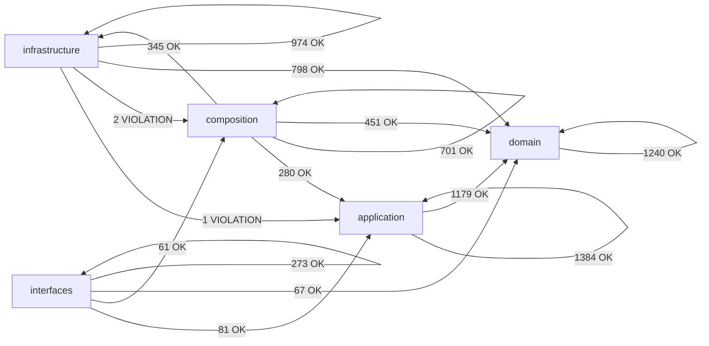

# Module Dependency Map (Auto-Generated)

> Generated by `scripts/engineering/qa/generate_architecture_dependency_map.py`. Do not edit manually.
> This artifact is a layer-policy and coarse topology snapshot only. It is not a hotspot, duplication, size, or churn scorecard.

## Summary

- Scanned modules: `1979`
- Internal import edges (raw): `7837`
- Aggregated layer edges: `15`
- Layer policy violations: `2`
- Cross-layer module-group edges (total): `331`
- Cross-layer module-group edges (top 60): `60`

## Layer Dependency Graph

## Layer Edge Table

| From             | To               | Imports | Policy    |
| ---------------- | ---------------- | ------: | --------- |
| `application`    | `application`    |    1384 | allowed   |
| `application`    | `domain`         |    1179 | allowed   |
| `composition`    | `application`    |     280 | allowed   |
| `composition`    | `composition`    |     701 | allowed   |
| `composition`    | `domain`         |     451 | allowed   |
| `composition`    | `infrastructure` |     345 | allowed   |
| `domain`         | `domain`         |    1240 | allowed   |
| `infrastructure` | `application`    |       1 | violation |
| `infrastructure` | `composition`    |       2 | violation |
| `infrastructure` | `domain`         |     798 | allowed   |
| `infrastructure` | `infrastructure` |     974 | allowed   |
| `interfaces`     | `application`    |      81 | allowed   |
| `interfaces`     | `composition`    |      61 | allowed   |
| `interfaces`     | `domain`         |      67 | allowed   |
| `interfaces`     | `interfaces`     |     273 | allowed   |

## Cross-Layer Module-Group Edges (Compact)

| From Group                     | To Group                        | Imports |
| ------------------------------ | ------------------------------- | ------: |
| `application.composite`        | `domain.composite`              |     117 |
| `infrastructure.adapters`      | `domain.types`                  |     111 |
| `application.core`             | `domain.types`                  |     109 |
| `infrastructure.adapters`      | `domain.ports`                  |      89 |
| `application.pipelines`        | `domain.types`                  |      84 |
| `application.services`         | `domain.control_plane`          |      82 |
| `application.core`             | `domain.ports`                  |      79 |
| `application.composite`        | `domain.ports`                  |      74 |
| `application.services`         | `domain.ports`                  |      74 |
| `application.services`         | `domain.types`                  |      74 |
| `infrastructure.storage`       | `domain.types`                  |      70 |
| `composition.factories`        | `application.core`              |      68 |
| `infrastructure.storage`       | `domain.ports`                  |      67 |
| `interfaces.cli`               | `application.services`          |      66 |
| `composition.factories`        | `domain.ports`                  |      62 |
| `composition.bootstrap`        | `application.services`          |      61 |
| `composition.bootstrap`        | `domain.ports`                  |      52 |
| `composition.bootstrap`        | `application.composite`         |      46 |
| `infrastructure.storage`       | `domain.value_objects`          |      46 |
| `composition.factories`        | `infrastructure.config`         |      40 |
| `application.core`             | `domain.context`                |      38 |
| `composition.factories`        | `infrastructure.storage`        |      38 |
| `composition.bootstrap`        | `infrastructure.config`         |      36 |
| `composition.factories`        | `domain.types`                  |      35 |
| `infrastructure.adapters`      | `domain.exceptions`             |      34 |
| `application.services`         | `domain.value_objects`          |      33 |
| `infrastructure.storage`       | `domain.models`                 |      32 |
| `composition.factories`        | `infrastructure.adapters`       |      31 |
| `composition.runtime_builders` | `domain.context`                |      29 |
| `composition.bootstrap`        | `domain.composite`              |      28 |
| `composition.factories`        | `infrastructure.schemas`        |      28 |
| `application.composite`        | `domain.exceptions`             |      27 |
| `application.pipelines`        | `domain.entities`               |      27 |
| `infrastructure.storage`       | `domain.medallion`              |      27 |
| `composition.factories`        | `application.services`          |      24 |
| `composition.runtime_builders` | `infrastructure.config`         |      24 |
| `infrastructure.config`        | `domain.types`                  |      24 |
| `composition.runtime_builders` | `domain.control_plane`          |      23 |
| `composition.factories`        | `domain.schemas`                |      22 |
| `composition.providers`        | `infrastructure.adapters`       |      21 |
| `composition._services`        | `application.services`          |      20 |
| `interfaces.cli`               | `composition.control_plane_api` |      20 |
| `application.core`             | `domain.config`                 |      19 |
| `application.pipelines`        | `domain.value_objects`          |      18 |
| `application.services`         | `domain.exceptions`             |      18 |
| `interfaces.http`              | `domain.control_plane`          |      18 |
| `application.core`             | `domain.normalization`          |      17 |
| `application.core`             | `domain.value_objects`          |      17 |
| `application.pipelines`        | `domain.context`                |      17 |
| `infrastructure.schemas`       | `domain.config`                 |      17 |
| `application.pipelines`        | `domain.ports`                  |      16 |
| `composition.bootstrap`        | `infrastructure.observability`  |      16 |
| `composition.factories`        | `domain.config`                 |      16 |
| `infrastructure.control_plane` | `domain.control_plane`          |      15 |
| `infrastructure.observability` | `domain.ports`                  |      15 |
| `infrastructure.quality`       | `domain.types`                  |      15 |
| `composition.factories`        | `domain.behavior`               |      14 |
| `interfaces.cli`               | `composition.registry_api`      |      14 |
| `application.services`         | `domain.behavior`               |      13 |
| `application.services`         | `domain.normalization`          |      13 |

## Policy Violations

- `infrastructure -> application` (imports: 1)
- `infrastructure -> composition` (imports: 2)
