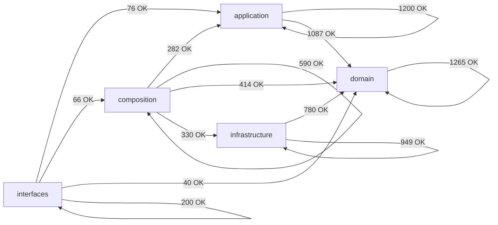

# Module Dependency Map (Auto-Generated)

> Generated by `scripts/engineering/qa/generate_architecture_dependency_map.py`. Do not edit manually.
> This artifact is a layer-policy and coarse topology snapshot only. It is not a hotspot, duplication, size, or churn scorecard.

## Summary

- Scanned modules: `1828`
- Internal import edges (raw): `7279`
- Aggregated layer edges: `13`
- Layer policy violations: `0`
- Cross-layer module-group edges (total): `322`
- Cross-layer module-group edges (top 60): `60`

## Layer Dependency Graph

## Layer Edge Table

| From             | To               | Imports | Policy  |
| ---------------- | ---------------- | ------: | ------- |
| `application`    | `application`    |    1200 | allowed |
| `application`    | `domain`         |    1087 | allowed |
| `composition`    | `application`    |     282 | allowed |
| `composition`    | `composition`    |     590 | allowed |
| `composition`    | `domain`         |     414 | allowed |
| `composition`    | `infrastructure` |     330 | allowed |
| `domain`         | `domain`         |    1265 | allowed |
| `infrastructure` | `domain`         |     780 | allowed |
| `infrastructure` | `infrastructure` |     949 | allowed |
| `interfaces`     | `application`    |      76 | allowed |
| `interfaces`     | `composition`    |      66 | allowed |
| `interfaces`     | `domain`         |      40 | allowed |
| `interfaces`     | `interfaces`     |     200 | allowed |

## Cross-Layer Module-Group Edges (Compact)

| From Group                      | To Group                        | Imports |
| ------------------------------- | ------------------------------- | ------: |
| `application.composite`         | `domain.composite`              |     112 |
| `infrastructure.adapters`       | `domain.types`                  |     110 |
| `application.core`              | `domain.types`                  |     106 |
| `infrastructure.adapters`       | `domain.ports`                  |      87 |
| `application.pipelines`         | `domain.types`                  |      79 |
| `application.core`              | `domain.ports`                  |      72 |
| `application.composite`         | `domain.ports`                  |      71 |
| `composition.factories`         | `application.core`              |      71 |
| `infrastructure.storage`        | `domain.types`                  |      71 |
| `application.services`          | `domain.ports`                  |      69 |
| `infrastructure.storage`        | `domain.ports`                  |      66 |
| `composition.factories`         | `domain.ports`                  |      63 |
| `application.services`          | `domain.types`                  |      62 |
| `interfaces.cli`                | `application.services`          |      62 |
| `composition.bootstrap`         | `application.services`          |      57 |
| `application.services`          | `domain.control_plane`          |      53 |
| `infrastructure.storage`        | `domain.value_objects`          |      48 |
| `composition.bootstrap`         | `domain.ports`                  |      47 |
| `composition.bootstrap`         | `application.composite`         |      43 |
| `composition.bootstrap`         | `infrastructure.config`         |      42 |
| `composition.factories`         | `infrastructure.config`         |      39 |
| `composition.factories`         | `infrastructure.storage`        |      38 |
| `application.core`              | `domain.context`                |      36 |
| `composition.factories`         | `domain.types`                  |      36 |
| `infrastructure.adapters`       | `domain.exceptions`             |      34 |
| `infrastructure.storage`        | `domain.models`                 |      32 |
| `composition.factories`         | `infrastructure.adapters`       |      31 |
| `application.services`          | `domain.value_objects`          |      29 |
| `composition.factories`         | `infrastructure.schemas`        |      28 |
| `infrastructure.storage`        | `domain.medallion`              |      27 |
| `application.composite`         | `domain.exceptions`             |      26 |
| `application.pipelines`         | `domain.entities`               |      26 |
| `composition.bootstrap`         | `domain.composite`              |      25 |
| `composition.factories`         | `application.services`          |      21 |
| `composition.factories`         | `domain.schemas`                |      21 |
| `infrastructure.config`         | `domain.types`                  |      21 |
| `composition.providers`         | `infrastructure.adapters`       |      20 |
| `composition.runtime_builders`  | `domain.context`                |      20 |
| `composition.runtime_builders`  | `domain.control_plane`          |      20 |
| `interfaces.cli`                | `composition.control_plane_api` |      20 |
| `application.core`              | `domain.config`                 |      18 |
| `application.pipelines`         | `domain.value_objects`          |      18 |
| `application.services`          | `domain.exceptions`             |      18 |
| `application.core`              | `domain.value_objects`          |      17 |
| `composition._services`         | `application.services`          |      17 |
| `composition.factories`         | `domain.config`                 |      16 |
| `application.pipelines`         | `domain.ports`                  |      15 |
| `composition.bootstrap`         | `infrastructure.observability`  |      15 |
| `infrastructure.control_plane`  | `domain.control_plane`          |      15 |
| `infrastructure.observability`  | `domain.ports`                  |      15 |
| `infrastructure.quality`        | `domain.types`                  |      15 |
| `composition.runtime_builders`  | `infrastructure.config`         |      14 |
| `infrastructure.schemas`        | `domain.config`                 |      14 |
| `application.core`              | `domain.normalization`          |      13 |
| `application.pipelines`         | `domain.context`                |      13 |
| `application.services`          | `domain.lineage`                |      13 |
| `composition.factories`         | `domain.behavior`               |      13 |
| `interfaces.cli`                | `composition.registry_api`      |      13 |
| `application.services`          | `domain.behavior`               |      12 |
| `composition.control_plane_api` | `application.services`          |      12 |

## Policy Violations

- None.
