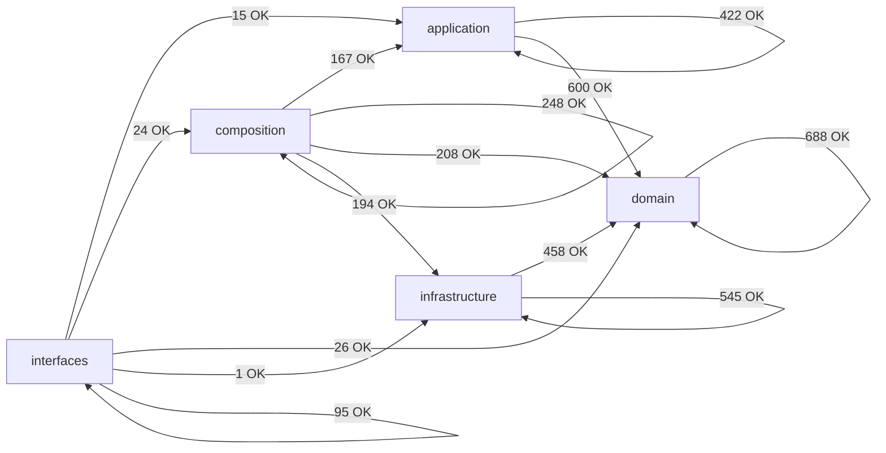

# Module Dependency Map (Auto-Generated)

> Generated by `scripts/generate_architecture_dependency_map.py`. Do not edit manually.

## Summary

- Scanned modules: `1003`
- Internal import edges (raw): `3691`
- Aggregated layer edges: `14`
- Layer policy violations: `0`
- Cross-layer module-group edges (total): `235`
- Cross-layer module-group edges (top 60): `60`

## Layer Dependency Graph

## Layer Edge Table

| From | To | Imports | Policy |
|---|---|---:|---|
| `application` | `application` | 422 | allowed |
| `application` | `domain` | 600 | allowed |
| `composition` | `application` | 167 | allowed |
| `composition` | `composition` | 248 | allowed |
| `composition` | `domain` | 208 | allowed |
| `composition` | `infrastructure` | 194 | allowed |
| `domain` | `domain` | 688 | allowed |
| `infrastructure` | `domain` | 458 | allowed |
| `infrastructure` | `infrastructure` | 545 | allowed |
| `interfaces` | `application` | 15 | allowed |
| `interfaces` | `composition` | 24 | allowed |
| `interfaces` | `domain` | 26 | allowed |
| `interfaces` | `infrastructure` | 1 | allowed |
| `interfaces` | `interfaces` | 95 | allowed |

## Cross-Layer Module-Group Edges (Compact)

| From Group | To Group | Imports |
|---|---|---:|
| `infrastructure.adapters` | `domain.types` | 82 |
| `application.composite` | `domain.composite` | 72 |
| `infrastructure.adapters` | `domain.ports` | 71 |
| `application.pipelines` | `domain.types` | 70 |
| `composition.factories` | `application.core` | 62 |
| `application.core` | `domain.types` | 47 |
| `application.core` | `domain.ports` | 45 |
| `composition.bootstrap` | `application.composite` | 35 |
| `composition.factories` | `infrastructure.storage` | 35 |
| `application.composite` | `domain.ports` | 34 |
| `composition.factories` | `domain.ports` | 34 |
| `infrastructure.storage` | `domain.ports` | 31 |
| `application.services` | `domain.ports` | 29 |
| `infrastructure.storage` | `domain.types` | 28 |
| `infrastructure.adapters` | `domain.exceptions` | 27 |
| `application.pipelines` | `domain.entities` | 24 |
| `composition.factories` | `application.pipelines` | 23 |
| `composition.factories` | `infrastructure.config` | 23 |
| `application.services` | `domain.types` | 22 |
| `composition.bootstrap` | `domain.ports` | 22 |
| `infrastructure.storage` | `domain.models` | 22 |
| `composition.bootstrap` | `infrastructure.config` | 21 |
| `composition.factories` | `domain.schemas` | 19 |
| `interfaces.cli` | `composition.entrypoints` | 19 |
| `application.services` | `domain.value_objects` | 18 |
| `composition.factories` | `infrastructure.schemas` | 17 |
| `application.core` | `domain.context` | 16 |
| `composition.bootstrap` | `application.services` | 16 |
| `composition.factories` | `domain.types` | 16 |
| `application.pipelines` | `domain.context` | 15 |
| `composition.providers` | `infrastructure.adapters` | 15 |
| `application.composite` | `domain.exceptions` | 14 |
| `application.core` | `domain.exceptions` | 14 |
| `application.pipelines` | `domain.value_objects` | 14 |
| `infrastructure.schemas` | `domain.config` | 14 |
| `application.pipelines` | `domain.ports` | 13 |
| `composition.bootstrap` | `domain.composite` | 13 |
| `infrastructure.config` | `domain.types` | 13 |
| `infrastructure.quality` | `domain.types` | 13 |
| `infrastructure.storage` | `domain.medallion` | 13 |
| `infrastructure.storage` | `domain.value_objects` | 13 |
| `composition.bootstrap` | `infrastructure.observability` | 12 |
| `application.services` | `domain.exceptions` | 11 |
| `composition.factories` | `infrastructure.adapters` | 11 |
| `interfaces.cli` | `application.services` | 11 |
| `interfaces.cli` | `domain.exceptions` | 11 |
| `application.pipelines` | `domain.services` | 10 |
| `composition.factories` | `domain.config` | 10 |
| `infrastructure.adapters` | `domain.models` | 10 |
| `application.pipelines` | `domain.filtering` | 9 |
| `application.pipelines` | `domain.transformations` | 9 |
| `composition.bootstrap` | `application.core` | 9 |
| `application.core` | `domain.config` | 8 |
| `composition.factories` | `domain.context` | 8 |
| `infrastructure.observability` | `domain.ports` | 8 |
| `infrastructure.schemas` | `domain.composite` | 8 |
| `application.core` | `domain.value_objects` | 7 |
| `application.pipelines` | `domain.mapping` | 7 |
| `composition.bootstrap` | `domain.context` | 7 |
| `composition.factories` | `domain.filtering` | 7 |

## Policy Violations

- None.
