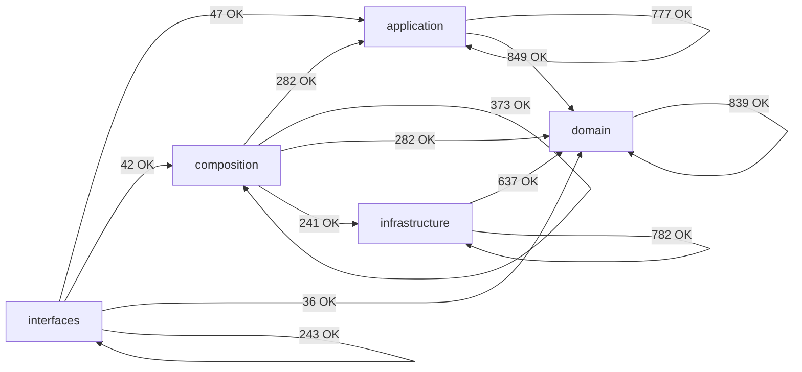

# Module Dependency Map (Auto-Generated)

> Generated by `scripts/qa/generate_architecture_dependency_map.py`. Do not edit manually.
> This artifact is a layer-policy and coarse topology snapshot only. It is not a hotspot, duplication, size, or churn scorecard.

## Summary

- Scanned modules: `1415`
- Internal import edges (raw): `5430`
- Aggregated layer edges: `13`
- Layer policy violations: `0`
- Cross-layer module-group edges (total): `261`
- Cross-layer module-group edges (top 60): `60`

## Layer Dependency Graph

## Layer Edge Table

| From | To | Imports | Policy |
|---|---|---:|---|
| `application` | `application` | 777 | allowed |
| `application` | `domain` | 849 | allowed |
| `composition` | `application` | 282 | allowed |
| `composition` | `composition` | 373 | allowed |
| `composition` | `domain` | 282 | allowed |
| `composition` | `infrastructure` | 241 | allowed |
| `domain` | `domain` | 839 | allowed |
| `infrastructure` | `domain` | 637 | allowed |
| `infrastructure` | `infrastructure` | 782 | allowed |
| `interfaces` | `application` | 47 | allowed |
| `interfaces` | `composition` | 42 | allowed |
| `interfaces` | `domain` | 36 | allowed |
| `interfaces` | `interfaces` | 243 | allowed |

## Cross-Layer Module-Group Edges (Compact)

| From Group | To Group | Imports |
|---|---|---:|
| `application.composite` | `domain.composite` | 114 |
| `composition.factories` | `application.core` | 111 |
| `infrastructure.adapters` | `domain.types` | 106 |
| `infrastructure.adapters` | `domain.ports` | 89 |
| `application.core` | `domain.types` | 85 |
| `application.pipelines` | `domain.types` | 76 |
| `composition.bootstrap` | `application.composite` | 66 |
| `application.core` | `domain.ports` | 62 |
| `application.composite` | `domain.ports` | 57 |
| `composition.factories` | `domain.ports` | 51 |
| `infrastructure.storage` | `domain.ports` | 48 |
| `infrastructure.storage` | `domain.types` | 47 |
| `application.services` | `domain.ports` | 44 |
| `application.services` | `domain.types` | 39 |
| `interfaces.cli` | `application.services` | 37 |
| `composition.factories` | `infrastructure.storage` | 35 |
| `composition.bootstrap` | `infrastructure.config` | 34 |
| `infrastructure.adapters` | `domain.exceptions` | 34 |
| `composition.bootstrap` | `domain.ports` | 32 |
| `infrastructure.storage` | `domain.models` | 30 |
| `application.core` | `domain.context` | 28 |
| `composition.bootstrap` | `application.services` | 28 |
| `composition.factories` | `domain.types` | 28 |
| `composition.factories` | `infrastructure.config` | 28 |
| `application.composite` | `domain.exceptions` | 24 |
| `application.pipelines` | `domain.entities` | 24 |
| `application.services` | `domain.value_objects` | 24 |
| `composition.factories` | `application.pipelines` | 23 |
| `infrastructure.storage` | `domain.value_objects` | 23 |
| `composition.factories` | `domain.schemas` | 21 |
| `composition.factories` | `infrastructure.schemas` | 21 |
| `infrastructure.storage` | `domain.medallion` | 21 |
| `infrastructure.config` | `domain.types` | 20 |
| `composition.factories` | `infrastructure.adapters` | 19 |
| `composition.providers` | `infrastructure.adapters` | 19 |
| `application.core` | `domain.config` | 18 |
| `interfaces.cli` | `composition.services_api` | 18 |
| `composition.bootstrap` | `domain.composite` | 17 |
| `composition.factories` | `application.services` | 17 |
| `composition.factories` | `domain.config` | 15 |
| `infrastructure.quality` | `domain.types` | 15 |
| `application.pipelines` | `domain.ports` | 14 |
| `application.pipelines` | `domain.value_objects` | 14 |
| `infrastructure.schemas` | `domain.config` | 14 |
| `interfaces.cli` | `domain.exceptions` | 13 |
| `composition.bootstrap` | `infrastructure.observability` | 12 |
| `composition.factories` | `domain.services` | 12 |
| `infrastructure.adapters` | `domain.models` | 12 |
| `application.core` | `domain.value_objects` | 11 |
| `application.pipelines` | `domain.services` | 11 |
| `application.services` | `domain.exceptions` | 11 |
| `application.services` | `domain.services` | 11 |
| `application.pipelines` | `domain.context` | 10 |
| `application.pipelines` | `domain.filtering` | 10 |
| `application.pipelines` | `domain.normalization` | 10 |
| `infrastructure.storage` | `domain.exceptions` | 10 |
| `application.composite` | `domain.types` | 9 |
| `application.core` | `domain.exceptions` | 9 |
| `application.pipelines` | `domain.transformations` | 9 |
| `application.services` | `domain.lineage` | 9 |

## Policy Violations

- None.
