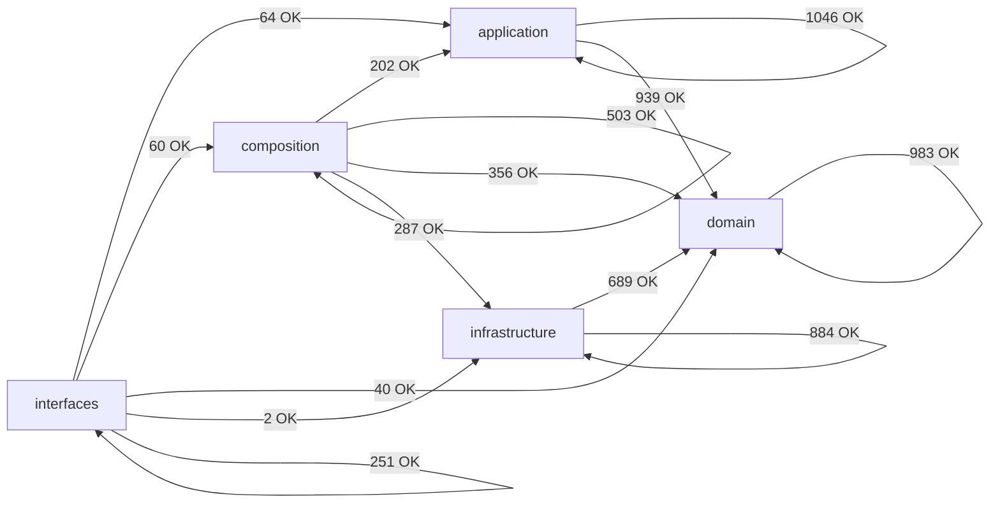

# Module Dependency Map (Auto-Generated)

> Generated by `scripts/engineering/qa/generate_architecture_dependency_map.py`. Do not edit manually.
> This artifact is a layer-policy and coarse topology snapshot only. It is not a hotspot, duplication, size, or churn scorecard.

## Summary

- Scanned modules: `1642`
- Internal import edges (raw): `6306`
- Aggregated layer edges: `14`
- Layer policy violations: `0`
- Cross-layer module-group edges (total): `287`
- Cross-layer module-group edges (top 60): `60`

## Layer Dependency Graph

## Layer Edge Table

| From             | To               | Imports | Policy  |
| ---------------- | ---------------- | ------: | ------- |
| `application`    | `application`    |    1046 | allowed |
| `application`    | `domain`         |     939 | allowed |
| `composition`    | `application`    |     202 | allowed |
| `composition`    | `composition`    |     503 | allowed |
| `composition`    | `domain`         |     356 | allowed |
| `composition`    | `infrastructure` |     287 | allowed |
| `domain`         | `domain`         |     983 | allowed |
| `infrastructure` | `domain`         |     689 | allowed |
| `infrastructure` | `infrastructure` |     884 | allowed |
| `interfaces`     | `application`    |      64 | allowed |
| `interfaces`     | `composition`    |      60 | allowed |
| `interfaces`     | `domain`         |      40 | allowed |
| `interfaces`     | `infrastructure` |       2 | allowed |
| `interfaces`     | `interfaces`     |     251 | allowed |

## Cross-Layer Module-Group Edges (Compact)

| From Group                     | To Group                        | Imports |
| ------------------------------ | ------------------------------- | ------: |
| `application.composite`        | `domain.composite`              |     111 |
| `infrastructure.adapters`      | `domain.types`                  |     109 |
| `application.core`             | `domain.types`                  |      98 |
| `infrastructure.adapters`      | `domain.ports`                  |      85 |
| `application.pipelines`        | `domain.types`                  |      78 |
| `application.core`             | `domain.ports`                  |      67 |
| `composition.factories`        | `application.core`              |      65 |
| `application.composite`        | `domain.ports`                  |      63 |
| `composition.factories`        | `domain.ports`                  |      60 |
| `infrastructure.storage`       | `domain.ports`                  |      58 |
| `infrastructure.storage`       | `domain.types`                  |      56 |
| `application.services`         | `domain.ports`                  |      52 |
| `application.services`         | `domain.types`                  |      50 |
| `interfaces.cli`               | `application.services`          |      44 |
| `composition.bootstrap`        | `application.composite`         |      43 |
| `composition.factories`        | `domain.types`                  |      40 |
| `composition.bootstrap`        | `application.services`          |      38 |
| `composition.bootstrap`        | `domain.ports`                  |      38 |
| `composition.factories`        | `infrastructure.config`         |      38 |
| `composition.factories`        | `infrastructure.storage`        |      38 |
| `composition.bootstrap`        | `infrastructure.config`         |      37 |
| `infrastructure.storage`       | `domain.value_objects`          |      36 |
| `infrastructure.adapters`      | `domain.exceptions`             |      34 |
| `composition.factories`        | `infrastructure.adapters`       |      31 |
| `application.core`             | `domain.context`                |      29 |
| `infrastructure.storage`       | `domain.models`                 |      29 |
| `composition.factories`        | `infrastructure.schemas`        |      28 |
| `application.pipelines`        | `domain.entities`               |      26 |
| `application.composite`        | `domain.exceptions`             |      25 |
| `application.services`         | `domain.value_objects`          |      25 |
| `composition.bootstrap`        | `domain.composite`              |      22 |
| `composition.factories`        | `domain.config`                 |      21 |
| `composition.factories`        | `domain.schemas`                |      21 |
| `infrastructure.config`        | `domain.types`                  |      21 |
| `infrastructure.storage`       | `domain.medallion`              |      21 |
| `composition.factories`        | `application.services`          |      19 |
| `composition.providers`        | `infrastructure.adapters`       |      19 |
| `application.core`             | `domain.config`                 |      17 |
| `application.pipelines`        | `domain.ports`                  |      16 |
| `application.services`         | `domain.exceptions`             |      15 |
| `infrastructure.quality`       | `domain.types`                  |      15 |
| `application.core`             | `domain.value_objects`          |      14 |
| `application.pipelines`        | `domain.value_objects`          |      14 |
| `application.services`         | `domain.control_plane`          |      14 |
| `composition.factories`        | `domain.context`                |      14 |
| `infrastructure.schemas`       | `domain.config`                 |      14 |
| `interfaces.observability`     | `composition.observability_api` |      14 |
| `application.pipelines`        | `domain.context`                |      13 |
| `composition.bootstrap`        | `infrastructure.observability`  |      13 |
| `interfaces.cli`               | `domain.exceptions`             |      13 |
| `composition.factories`        | `domain.services`               |      12 |
| `composition.runtime_builders` | `domain.context`                |      12 |
| `infrastructure.adapters`      | `domain.models`                 |      12 |
| `application.pipelines`        | `domain.services`               |      11 |
| `application.services`         | `domain.lineage`                |      11 |
| `application.services`         | `domain.services`               |      11 |
| `interfaces.cli`               | `composition.registry_api`      |      11 |
| `application.core`             | `domain.exceptions`             |      10 |
| `application.core`             | `domain.normalization`          |      10 |
| `application.pipelines`        | `domain.filtering`              |      10 |

## Policy Violations

- None.
