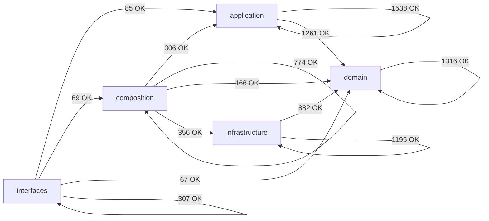

# Module Dependency Map (Auto-Generated)

> Generated by `scripts/engineering/qa/generate_architecture_dependency_map.py`. Do not edit manually.
> This artifact is a layer-policy and coarse topology snapshot only. It is not a hotspot, duplication, size, or churn scorecard.

## Summary

- Scanned modules: `2178`
- Internal import edges (raw): `8622`
- Aggregated layer edges: `13`
- Layer policy violations: `0`
- Cross-layer module-group edges (total): `343`
- Cross-layer module-group edges (top 60): `60`

## Layer Dependency Graph

## Layer Edge Table

| From             | To               | Imports | Policy  |
| ---------------- | ---------------- | ------: | ------- |
| `application`    | `application`    |    1538 | allowed |
| `application`    | `domain`         |    1261 | allowed |
| `composition`    | `application`    |     306 | allowed |
| `composition`    | `composition`    |     774 | allowed |
| `composition`    | `domain`         |     466 | allowed |
| `composition`    | `infrastructure` |     356 | allowed |
| `domain`         | `domain`         |    1316 | allowed |
| `infrastructure` | `domain`         |     882 | allowed |
| `infrastructure` | `infrastructure` |    1195 | allowed |
| `interfaces`     | `application`    |      85 | allowed |
| `interfaces`     | `composition`    |      69 | allowed |
| `interfaces`     | `domain`         |      67 | allowed |
| `interfaces`     | `interfaces`     |     307 | allowed |

## Cross-Layer Module-Group Edges (Compact)

| From Group                     | To Group                                   | Imports |
| ------------------------------ | ------------------------------------------ | ------: |
| `application.core`             | `domain.types`                             |     126 |
| `application.composite`        | `domain.composite`                         |     120 |
| `infrastructure.adapters`      | `domain.types`                             |     111 |
| `application.services`         | `domain.control_plane`                     |     100 |
| `infrastructure.adapters`      | `domain.ports`                             |      89 |
| `application.pipelines`        | `domain.types`                             |      87 |
| `application.core`             | `domain.ports`                             |      86 |
| `infrastructure.storage`       | `domain.types`                             |      83 |
| `application.services`         | `domain.ports`                             |      79 |
| `application.services`         | `domain.types`                             |      78 |
| `infrastructure.storage`       | `domain.ports`                             |      75 |
| `application.composite`        | `domain.ports`                             |      74 |
| `composition.factories`        | `application.core`                         |      68 |
| `interfaces.cli`               | `application.services`                     |      68 |
| `composition.factories`        | `domain.ports`                             |      63 |
| `composition.bootstrap`        | `application.services`                     |      60 |
| `composition.bootstrap`        | `domain.ports`                             |      53 |
| `infrastructure.storage`       | `domain.value_objects`                     |      51 |
| `composition.bootstrap`        | `application.composite`                    |      48 |
| `composition.factories`        | `infrastructure.config`                    |      41 |
| `infrastructure.storage`       | `domain.models`                            |      41 |
| `application.core`             | `domain.context`                           |      39 |
| `composition.factories`        | `infrastructure.storage`                   |      38 |
| `application.services`         | `domain.value_objects`                     |      36 |
| `composition.bootstrap`        | `infrastructure.config`                    |      36 |
| `composition.factories`        | `domain.types`                             |      35 |
| `infrastructure.adapters`      | `domain.exceptions`                        |      34 |
| `infrastructure.storage`       | `domain.medallion`                         |      32 |
| `composition.factories`        | `infrastructure.adapters`                  |      31 |
| `composition.factories`        | `application.services`                     |      29 |
| `composition.factories`        | `infrastructure.schemas`                   |      29 |
| `composition.runtime_builders` | `infrastructure.config`                    |      29 |
| `composition.runtime_builders` | `domain.context`                           |      28 |
| `application.composite`        | `domain.exceptions`                        |      27 |
| `composition.bootstrap`        | `domain.composite`                         |      27 |
| `composition.runtime_builders` | `domain.control_plane`                     |      27 |
| `application.pipelines`        | `domain.entities`                          |      26 |
| `infrastructure.config`        | `domain.types`                             |      25 |
| `application.core`             | `domain.normalization`                     |      24 |
| `application.core`             | `domain.config`                            |      22 |
| `composition.factories`        | `domain.schemas`                           |      22 |
| `composition.providers`        | `infrastructure.adapters`                  |      22 |
| `infrastructure.control_plane` | `domain.control_plane`                     |      22 |
| `interfaces.cli`               | `composition.control_plane_service_access` |      21 |
| `composition._services`        | `application.services`                     |      20 |
| `infrastructure.observability` | `domain.ports`                             |      20 |
| `interfaces.http`              | `domain.control_plane`                     |      19 |
| `application.pipelines`        | `domain.value_objects`                     |      18 |
| `application.services`         | `domain.exceptions`                        |      18 |
| `application.core`             | `domain.value_objects`                     |      17 |
| `application.services`         | `domain.lineage`                           |      17 |
| `composition.factories`        | `domain.config`                            |      17 |
| `infrastructure.schemas`       | `domain.config`                            |      17 |
| `interfaces.cli`               | `composition.registry_api`                 |      17 |
| `application.pipelines`        | `domain.ports`                             |      16 |
| `application.pipelines`        | `domain.context`                           |      15 |
| `infrastructure.quality`       | `domain.types`                             |      15 |
| `infrastructure.storage`       | `domain.exceptions`                        |      15 |
| `composition.factories`        | `domain.behavior`                          |      14 |
| `infrastructure.schemas`       | `domain.filtering`                         |      14 |

## Policy Violations

- None.
