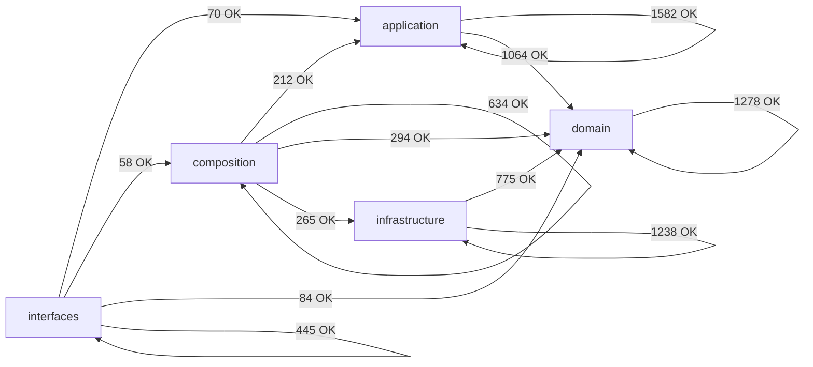

# Module Dependency Map (Auto-Generated)

> Generated by `scripts/engineering/qa/generate_architecture_dependency_map.py`. Do not edit manually.
> This artifact is a layer-policy and coarse topology snapshot only. It is not a hotspot, duplication, size, or churn scorecard.

## Summary

- Scanned modules: `2539`
- Internal import edges (raw): `7999`
- Aggregated layer edges: `13`
- Layer policy violations: `0`
- Cross-layer module-group edges (total): `340`
- Cross-layer module-group edges (top 55): `55`

## Layer Dependency Graph

```mermaid
flowchart LR
    domain[domain]
    application[application]
    infrastructure[infrastructure]
    composition[composition]
    interfaces[interfaces]
    application -->|1582 OK| application
    application -->|1064 OK| domain
    composition -->|212 OK| application
    composition -->|634 OK| composition
    composition -->|294 OK| domain
    composition -->|265 OK| infrastructure
    domain -->|1278 OK| domain
    infrastructure -->|775 OK| domain
    infrastructure -->|1238 OK| infrastructure
    interfaces -->|70 OK| application
    interfaces -->|58 OK| composition
    interfaces -->|84 OK| domain
    interfaces -->|445 OK| interfaces
```

## Layer Edge Table

| From             | To               | Imports | Policy  |
| ---------------- | ---------------- | ------: | ------- |
| `application`    | `application`    |    1582 | allowed |
| `application`    | `domain`         |    1064 | allowed |
| `composition`    | `application`    |     212 | allowed |
| `composition`    | `composition`    |     634 | allowed |
| `composition`    | `domain`         |     294 | allowed |
| `composition`    | `infrastructure` |     265 | allowed |
| `domain`         | `domain`         |    1278 | allowed |
| `infrastructure` | `domain`         |     775 | allowed |
| `infrastructure` | `infrastructure` |    1238 | allowed |
| `interfaces`     | `application`    |      70 | allowed |
| `interfaces`     | `composition`    |      58 | allowed |
| `interfaces`     | `domain`         |      84 | allowed |
| `interfaces`     | `interfaces`     |     445 | allowed |

## Cross-Layer Module-Group Edges (Compact)

| From Group                     | To Group                                   | Imports |
| ------------------------------ | ------------------------------------------ | ------: |
| `application.services`         | `domain.control_plane`                     |     141 |
| `infrastructure.adapters`      | `domain.types`                             |     123 |
| `application.composite`        | `domain.composite`                         |     113 |
| `application.core`             | `domain.types`                             |      93 |
| `application.services`         | `domain.types`                             |      84 |
| `infrastructure.storage`       | `domain.types`                             |      72 |
| `infrastructure.storage`       | `domain.ports`                             |      62 |
| `application.pipelines`        | `domain.types`                             |      57 |
| `application.composite`        | `domain.ports`                             |      55 |
| `application.services`         | `domain.ports`                             |      53 |
| `composition.factories`        | `application.core`                         |      47 |
| `infrastructure.storage`       | `domain.value_objects`                     |      43 |
| `composition.bootstrap`        | `application.services`                     |      39 |
| `composition.factories`        | `domain.ports`                             |      35 |
| `application.composite`        | `domain.exceptions`                        |      34 |
| `infrastructure.storage`       | `domain.models`                            |      34 |
| `application.core`             | `domain.ports`                             |      31 |
| `composition.runtime_builders` | `domain.control_plane`                     |      31 |
| `infrastructure.storage`       | `domain.medallion`                         |      31 |
| `interfaces.cli`               | `application.services`                     |      31 |
| `infrastructure.control_plane` | `domain.control_plane`                     |      30 |
| `composition.bootstrap`        | `domain.ports`                             |      28 |
| `composition.factories`        | `infrastructure.adapters`                  |      26 |
| `application.services`         | `domain.value_objects`                     |      25 |
| `infrastructure.adapters`      | `domain.ports`                             |      25 |
| `infrastructure.config`        | `domain.types`                             |      25 |
| `composition.factories`        | `infrastructure.config`                    |      24 |
| `infrastructure.adapters`      | `domain.exceptions`                        |      24 |
| `composition.bootstrap`        | `infrastructure.control_plane`             |      23 |
| `application.pipelines`        | `domain.entities`                          |      22 |
| `composition.factories`        | `domain.schemas`                           |      22 |
| `interfaces.http`              | `domain.control_plane`                     |      22 |
| `composition.bootstrap`        | `application.composite`                    |      21 |
| `composition.runtime_builders` | `infrastructure.config`                    |      21 |
| `interfaces.cli`               | `composition.control_plane_service_access` |      21 |
| `application.core`             | `domain.normalization`                     |      20 |
| `application.services`         | `domain.normalization`                     |      20 |
| `application.services`         | `domain.exceptions`                        |      19 |
| `composition.factories`        | `application.services`                     |      18 |
| `composition.factories`        | `domain.types`                             |      18 |
| `application.observability`    | `domain.control_plane`                     |      17 |
| `application.pipelines`        | `domain.value_objects`                     |      17 |
| `application.services`         | `domain.lineage`                           |      17 |
| `composition.factories`        | `infrastructure.storage`                   |      17 |
| `infrastructure.schemas`       | `domain.config`                            |      17 |
| `application.core`             | `domain.exceptions`                        |      16 |
| `interfaces.http`              | `domain.ports`                             |      16 |
| `application.services`         | `domain.run_reports`                       |      15 |
| `composition.bootstrap`        | `infrastructure.config`                    |      15 |
| `composition.factories`        | `application.ports`                        |      15 |
| `composition.providers`        | `infrastructure.adapters`                  |      15 |
| `infrastructure.control_plane` | `domain.types`                             |      15 |
| `infrastructure.quality`       | `domain.types`                             |      15 |
| `infrastructure.storage`       | `domain.exceptions`                        |      15 |
| `composition.bootstrap`        | `infrastructure.observability`             |      14 |

## Policy Violations

- None.
