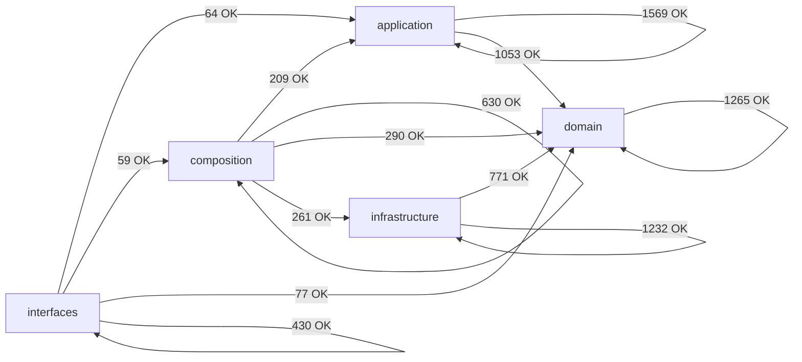

# Module Dependency Map (Auto-Generated)

> Generated by `scripts/engineering/qa/generate_architecture_dependency_map.py`. Do not edit manually.
> This artifact is a layer-policy and coarse topology snapshot only. It is not a hotspot, duplication, size, or churn scorecard.

## Summary

- Scanned modules: `2518`
- Internal import edges (raw): `7910`
- Aggregated layer edges: `13`
- Layer policy violations: `0`
- Cross-layer module-group edges (total): `336`
- Cross-layer module-group edges (top 55): `55`

## Layer Dependency Graph

```mermaid
flowchart LR
    domain[domain]
    application[application]
    infrastructure[infrastructure]
    composition[composition]
    interfaces[interfaces]
    application -->|1569 OK| application
    application -->|1053 OK| domain
    composition -->|209 OK| application
    composition -->|630 OK| composition
    composition -->|290 OK| domain
    composition -->|261 OK| infrastructure
    domain -->|1265 OK| domain
    infrastructure -->|771 OK| domain
    infrastructure -->|1232 OK| infrastructure
    interfaces -->|64 OK| application
    interfaces -->|59 OK| composition
    interfaces -->|77 OK| domain
    interfaces -->|430 OK| interfaces
```

## Layer Edge Table

| From             | To               | Imports | Policy  |
| ---------------- | ---------------- | ------: | ------- |
| `application`    | `application`    |    1569 | allowed |
| `application`    | `domain`         |    1053 | allowed |
| `composition`    | `application`    |     209 | allowed |
| `composition`    | `composition`    |     630 | allowed |
| `composition`    | `domain`         |     290 | allowed |
| `composition`    | `infrastructure` |     261 | allowed |
| `domain`         | `domain`         |    1265 | allowed |
| `infrastructure` | `domain`         |     771 | allowed |
| `infrastructure` | `infrastructure` |    1232 | allowed |
| `interfaces`     | `application`    |      64 | allowed |
| `interfaces`     | `composition`    |      59 | allowed |
| `interfaces`     | `domain`         |      77 | allowed |
| `interfaces`     | `interfaces`     |     430 | allowed |

## Cross-Layer Module-Group Edges (Compact)

| From Group                     | To Group                                   | Imports |
| ------------------------------ | ------------------------------------------ | ------: |
| `application.services`         | `domain.control_plane`                     |     137 |
| `infrastructure.adapters`      | `domain.types`                             |     122 |
| `application.composite`        | `domain.composite`                         |     113 |
| `application.core`             | `domain.types`                             |      91 |
| `application.services`         | `domain.types`                             |      83 |
| `infrastructure.storage`       | `domain.types`                             |      72 |
| `infrastructure.storage`       | `domain.ports`                             |      63 |
| `application.pipelines`        | `domain.types`                             |      57 |
| `application.composite`        | `domain.ports`                             |      56 |
| `application.services`         | `domain.ports`                             |      51 |
| `composition.factories`        | `application.core`                         |      47 |
| `infrastructure.storage`       | `domain.value_objects`                     |      43 |
| `composition.bootstrap`        | `application.services`                     |      39 |
| `composition.factories`        | `domain.ports`                             |      35 |
| `application.composite`        | `domain.exceptions`                        |      34 |
| `infrastructure.storage`       | `domain.models`                            |      34 |
| `application.core`             | `domain.ports`                             |      31 |
| `infrastructure.storage`       | `domain.medallion`                         |      31 |
| `composition.runtime_builders` | `domain.control_plane`                     |      30 |
| `interfaces.cli`               | `application.services`                     |      30 |
| `composition.bootstrap`        | `domain.ports`                             |      28 |
| `infrastructure.control_plane` | `domain.control_plane`                     |      28 |
| `composition.factories`        | `infrastructure.adapters`                  |      26 |
| `application.services`         | `domain.value_objects`                     |      25 |
| `infrastructure.config`        | `domain.types`                             |      25 |
| `composition.factories`        | `infrastructure.config`                    |      24 |
| `infrastructure.adapters`      | `domain.exceptions`                        |      24 |
| `infrastructure.adapters`      | `domain.ports`                             |      24 |
| `application.pipelines`        | `domain.entities`                          |      22 |
| `composition.factories`        | `domain.schemas`                           |      22 |
| `interfaces.http`              | `domain.control_plane`                     |      22 |
| `composition.bootstrap`        | `application.composite`                    |      21 |
| `composition.bootstrap`        | `infrastructure.control_plane`             |      21 |
| `composition.runtime_builders` | `infrastructure.config`                    |      21 |
| `interfaces.cli`               | `composition.control_plane_service_access` |      21 |
| `application.core`             | `domain.normalization`                     |      20 |
| `application.services`         | `domain.normalization`                     |      20 |
| `application.services`         | `domain.exceptions`                        |      19 |
| `composition.factories`        | `application.services`                     |      18 |
| `composition.factories`        | `domain.types`                             |      18 |
| `application.observability`    | `domain.control_plane`                     |      17 |
| `application.pipelines`        | `domain.value_objects`                     |      17 |
| `application.services`         | `domain.lineage`                           |      17 |
| `composition.factories`        | `infrastructure.storage`                   |      17 |
| `infrastructure.schemas`       | `domain.config`                            |      17 |
| `application.core`             | `domain.exceptions`                        |      16 |
| `application.services`         | `domain.run_reports`                       |      15 |
| `composition.bootstrap`        | `infrastructure.config`                    |      15 |
| `composition.factories`        | `application.ports`                        |      15 |
| `infrastructure.control_plane` | `domain.types`                             |      15 |
| `infrastructure.quality`       | `domain.types`                             |      15 |
| `infrastructure.storage`       | `domain.exceptions`                        |      15 |
| `composition.bootstrap`        | `infrastructure.observability`             |      14 |
| `infrastructure.observability` | `domain.ports`                             |      14 |
| `application.services`         | `domain.behavior`                          |      13 |

## Policy Violations

- None.
