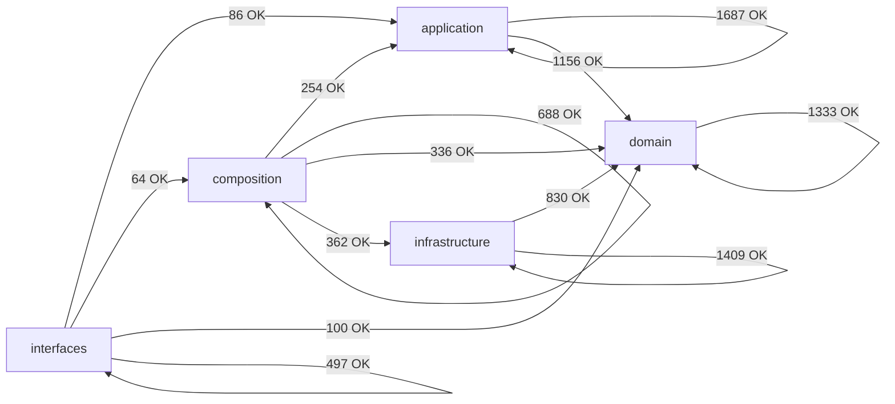

# Module Dependency Map (Auto-Generated)

> Generated by `scripts/engineering/qa/generate_architecture_dependency_map.py`. Do not edit manually.
> This artifact is a layer-policy and coarse topology snapshot only. It is not a hotspot, duplication, size, or churn scorecard.

## Summary

- Scanned modules: `2657`
- Internal import edges (raw): `8802`
- Aggregated layer edges: `13`
- Layer policy violations: `0`
- Cross-layer module-group edges (total): `330`
- Cross-layer module-group edges (top 55): `55`

## Layer Dependency Graph

```mermaid
flowchart LR
    domain[domain]
    application[application]
    infrastructure[infrastructure]
    composition[composition]
    interfaces[interfaces]
    application -->|1687 OK| application
    application -->|1156 OK| domain
    composition -->|254 OK| application
    composition -->|688 OK| composition
    composition -->|336 OK| domain
    composition -->|362 OK| infrastructure
    domain -->|1333 OK| domain
    infrastructure -->|830 OK| domain
    infrastructure -->|1409 OK| infrastructure
    interfaces -->|86 OK| application
    interfaces -->|64 OK| composition
    interfaces -->|100 OK| domain
    interfaces -->|497 OK| interfaces
```

## Layer Edge Table

| From             | To               | Imports | Policy  |
| ---------------- | ---------------- | ------: | ------- |
| `application`    | `application`    |    1687 | allowed |
| `application`    | `domain`         |    1156 | allowed |
| `composition`    | `application`    |     254 | allowed |
| `composition`    | `composition`    |     688 | allowed |
| `composition`    | `domain`         |     336 | allowed |
| `composition`    | `infrastructure` |     362 | allowed |
| `domain`         | `domain`         |    1333 | allowed |
| `infrastructure` | `domain`         |     830 | allowed |
| `infrastructure` | `infrastructure` |    1409 | allowed |
| `interfaces`     | `application`    |      86 | allowed |
| `interfaces`     | `composition`    |      64 | allowed |
| `interfaces`     | `domain`         |     100 | allowed |
| `interfaces`     | `interfaces`     |     497 | allowed |

## Cross-Layer Module-Group Edges (Compact)

| From Group                     | To Group                       | Imports |
| ------------------------------ | ------------------------------ | ------: |
| `application.services`         | `domain.control_plane`         |     160 |
| `infrastructure.adapters`      | `domain.types`                 |     125 |
| `application.composite`        | `domain.composite`             |     116 |
| `application.core`             | `domain.types`                 |     107 |
| `application.services`         | `domain.types`                 |      89 |
| `infrastructure.storage`       | `domain.types`                 |      83 |
| `infrastructure.storage`       | `domain.ports`                 |      68 |
| `application.services`         | `domain.ports`                 |      59 |
| `application.pipelines`        | `domain.types`                 |      58 |
| `composition.bootstrap`        | `application.services`         |      57 |
| `application.composite`        | `domain.ports`                 |      55 |
| `composition.factories`        | `application.core`             |      50 |
| `infrastructure.storage`       | `domain.value_objects`         |      44 |
| `composition.runtime_builders` | `domain.control_plane`         |      42 |
| `composition.bootstrap`        | `domain.ports`                 |      37 |
| `composition.factories`        | `domain.ports`                 |      37 |
| `application.composite`        | `domain.exceptions`            |      36 |
| `composition.bootstrap`        | `infrastructure.config`        |      36 |
| `infrastructure.storage`       | `domain.models`                |      36 |
| `infrastructure.control_plane` | `domain.control_plane`         |      35 |
| `composition.bootstrap`        | `infrastructure.storage`       |      34 |
| `composition.factories`        | `infrastructure.config`        |      34 |
| `interfaces.cli`               | `application.services`         |      33 |
| `application.core`             | `domain.ports`                 |      32 |
| `interfaces.http`              | `domain.control_plane`         |      32 |
| `infrastructure.storage`       | `domain.medallion`             |      31 |
| `composition.bootstrap`        | `infrastructure.control_plane` |      29 |
| `composition.factories`        | `infrastructure.adapters`      |      27 |
| `infrastructure.adapters`      | `domain.ports`                 |      26 |
| `infrastructure.config`        | `domain.types`                 |      26 |
| `application.services`         | `domain.value_objects`         |      25 |
| `interfaces.http`              | `application.services`         |      25 |
| `composition.runtime_builders` | `infrastructure.config`        |      24 |
| `infrastructure.adapters`      | `domain.exceptions`            |      24 |
| `application.pipelines`        | `domain.entities`              |      23 |
| `application.services`         | `domain.exceptions`            |      23 |
| `interfaces.cli`               | `composition.runtime_builders` |      23 |
| `application.core`             | `domain.normalization`         |      22 |
| `application.services`         | `domain.normalization`         |      22 |
| `composition.bootstrap`        | `application.composite`        |      22 |
| `composition.factories`        | `domain.schemas`               |      22 |
| `composition.factories`        | `infrastructure.storage`       |      22 |
| `composition.factories`        | `application.services`         |      21 |
| `composition.factories`        | `domain.types`                 |      20 |
| `composition.runtime_builders` | `application.services`         |      20 |
| `application.core`             | `domain.exceptions`            |      19 |
| `infrastructure.schemas`       | `domain.config`                |      19 |
| `application.observability`    | `domain.control_plane`         |      17 |
| `application.pipelines`        | `domain.value_objects`         |      17 |
| `application.services`         | `domain.lineage`               |      17 |
| `application.services`         | `domain.run_reports`           |      17 |
| `application.services`         | `domain.workflow`              |      17 |
| `infrastructure.storage`       | `domain.exceptions`            |      17 |
| `interfaces.http`              | `domain.ports`                 |      17 |
| `infrastructure.control_plane` | `domain.types`                 |      16 |

## Policy Violations

- None.
