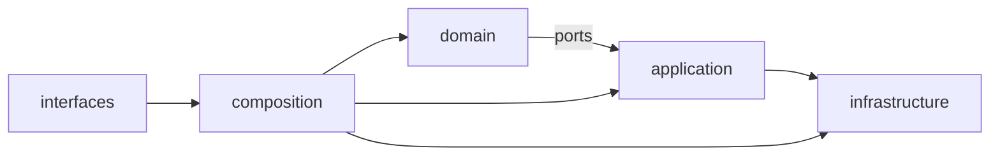
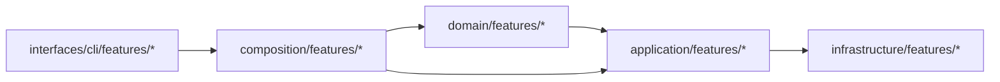

______________________________________________________________________

Version: 1.0.0
Status: Draft (обязательные критерии для RFC/ADR и implementation plan).
Class: published
Owner: BioETL Team
Reviewers:

- BioETL Team
  Last verified: '2026-03-29'

______________________________________________________________________

# Требования к плану консолидации модулей BioETL

*Область: `src/bioetl/**`.*

## 1) Обязательная карта перемещения модулей по каждому варианту

Для каждого варианта (`3-layer`, `2-layer`, `hybrid`) план **MUST** содержать явную карту:

- исходный путь `src/bioetl/...`
- целевой путь
- тип изменения (`move`, `split`, `merge`, `re-export shim`)
- критерий готовности (тест/линт/арх-тест)

### 1.1 Вариант A — 3-layer (core / adapters / entrypoints)

| Source (`src/bioetl/...`) | Target (`src/bioetl/...`)    | Change type        | Done when                   |
| ------------------------- | ---------------------------- | ------------------ | --------------------------- |
| `domain/**`               | `core/domain/**`             | move               | architecture tests pass     |
| `application/**`          | `core/application/**`        | move               | unit + integration pass     |
| `infrastructure/**`       | `adapters/infrastructure/**` | move               | adapter contract tests pass |
| `composition/**`          | `entrypoints/composition/**` | move               | bootstrap smoke tests pass  |
| `interfaces/**`           | `entrypoints/interfaces/**`  | move               | CLI e2e pass                |
| `domain/ports/**`         | `core/ports/**`              | split (stable API) | Protocol imports updated    |

### 1.2 Вариант B — 2-layer (core / runtime)

| Source (`src/bioetl/...`) | Target (`src/bioetl/...`)   | Change type | Done when                      |
| ------------------------- | --------------------------- | ----------- | ------------------------------ |
| `domain/**`               | `core/domain/**`            | move        | domain purity tests pass       |
| `application/**`          | `core/usecases/**`          | move+rename | pipeline tests pass            |
| `infrastructure/**`       | `runtime/infrastructure/**` | move        | storage+adapter tests pass     |
| `composition/**`          | `runtime/bootstrap/**`      | merge       | DI tests pass                  |
| `interfaces/**`           | `runtime/interfaces/**`     | move        | CLI + orchestration tests pass |
| `domain/ports/**`         | `core/contracts/**`         | rename      | Protocol/ABC count stable      |

### 1.3 Вариант C — hybrid (сохранить 5 слоёв, но укрупнить feature-пакеты)

| Source (`src/bioetl/...`)               | Target (`src/bioetl/...`)                         | Change type | Done when                  |
| --------------------------------------- | ------------------------------------------------- | ----------- | -------------------------- |
| `application/pipelines/{provider}/**`   | `application/features/{provider}/**`              | move        | provider e2e tests pass    |
| `infrastructure/adapters/{provider}/**` | `infrastructure/features/{provider}/adapters/**`  | move        | contract tests pass        |
| `domain/schemas/{provider}/**`          | `domain/features/{provider}/schemas/**`           | move        | schema contract tests pass |
| `composition/providers/**`              | `composition/features/{provider}/registration/**` | split       | registry tests pass        |
| `interfaces/cli/commands/**`            | `interfaces/cli/features/{provider}/**`           | move        | CLI command tests pass     |

> Примечание: для каждого перемещения MUST быть временный compatibility re-export (не более 1 релизного цикла).

______________________________________________________________________

## 2) Обязательный стартовый набор leaf-модулей

Каждый вариант консолидации MUST начинаться с листьев графа зависимостей (leaf modules), чтобы минимизировать blast radius.

### Required leaf-модули (Wave 0)

1. `src/bioetl/domain/value-objects/**`
1. `src/bioetl/domain/exceptions/**`
1. `src/bioetl/domain/contracts/gold/**`
1. `src/bioetl/domain/schemas/common/**`
1. `src/bioetl/infrastructure/serialization/**`
1. `src/bioetl/infrastructure/security/**`
1. `src/bioetl/interfaces/cli/commands/health.py`
1. `src/bioetl/application/observability/**`

**Правило запуска миграции:**

- До перехода к Wave 1 (provider pipelines) все leaf-модули из списка выше должны быть перемещены и покрыты regression-тестами.

______________________________________________________________________

## 3) Rollback strategy (обязательная)

Для каждого этапа миграции MUST быть:

1. **Отдельная ветка:** `refactor/consolidation-stage-{N}-{slug}`
1. **Тег до этапа:** `pre-consolidation-stage-{N}`
1. **Тег после этапа:** `post-consolidation-stage-{N}`
1. **Документ rollback-команд:**
   - `git checkout pre-consolidation-stage-{N}`
   - `git revert <stage-commit-range>`
   - `git checkout -b rollback/stage-{N}`

### Stage template

| Stage                    | Branch                                       | Pre-tag                     | Post-tag                     | Rollback owner   |
| ------------------------ | -------------------------------------------- | --------------------------- | ---------------------------- | ---------------- |
| 0 (leaf modules)         | `refactor/consolidation-stage-0-leaf`        | `pre-consolidation-stage-0` | `post-consolidation-stage-0` | Tech Lead        |
| 1 (provider features)    | `refactor/consolidation-stage-1-features`    | `pre-consolidation-stage-1` | `post-consolidation-stage-1` | Module Owner     |
| 2 (bootstrap/interfaces) | `refactor/consolidation-stage-2-entrypoints` | `pre-consolidation-stage-2` | `post-consolidation-stage-2` | Release Engineer |

______________________________________________________________________

## 4) Метрики успеха (обязательные KPI)

План MUST фиксировать baseline и target по метрикам:

1. **Число слоёв** (`layer-count`)
1. **Число интерфейсов** (`protocol-abc-count`, суммарно `typing.Protocol` + `ABC`)
1. **Coupling между слоями** (`cross-layer-imports-count`)

### Метрики и пороги

| Metric                      | Baseline |          Target | Rule                                   |
| --------------------------- | -------: | --------------: | -------------------------------------- |
| `layer-count`               |  current | option-specific | не увеличивать вне выбранного варианта |
| `protocol-abc-count`        |  current |     >= baseline | нельзя терять контракты без ADR        |
| `cross-layer-imports-count` |  current |    -20% minimum | снижение связанности между слоями      |

### Минимальные команды сбора

```bash
# Layer count (по верхнеуровневым пакетам выбранного варианта)
find src/bioetl -maxdepth 2 -type d

# Protocol + ABC count
rg -n "class .*\(Protocol\)|class .*\(ABC\)" src/bioetl

# Coupling (межслойные импорты, затем вручную классифицировать)
rg -n "^from bioetl\.|^import bioetl\." src/bioetl
```

______________________________________________________________________

## 5) Диаграммы “до/после” в Mermaid (обязательно)

Для каждого варианта MUST быть две диаграммы:

1. **AS-IS** (до)
1. **TO-BE** (после)

Минимум — dependency view на уровне слоёв/крупных пакетов.

### Mermaid шаблон (AS-IS)



### Mermaid шаблон (TO-BE, пример hybrid)



______________________________________________________________________

## 6) Definition of Done для RFC/ADR по консолидации

RFC/ADR считается неполным, если отсутствует хотя бы один артефакт:

- [ ] Карты перемещения модулей для всех 3 вариантов
- [ ] Mandatory leaf-модули для Wave 0
- [ ] Stage-based rollback strategy (branch + pre/post tags)
- [ ] KPI baseline/target по слоям, Protocol/ABC, coupling
- [ ] Mermaid диаграммы AS-IS/TO-BE для каждого варианта
