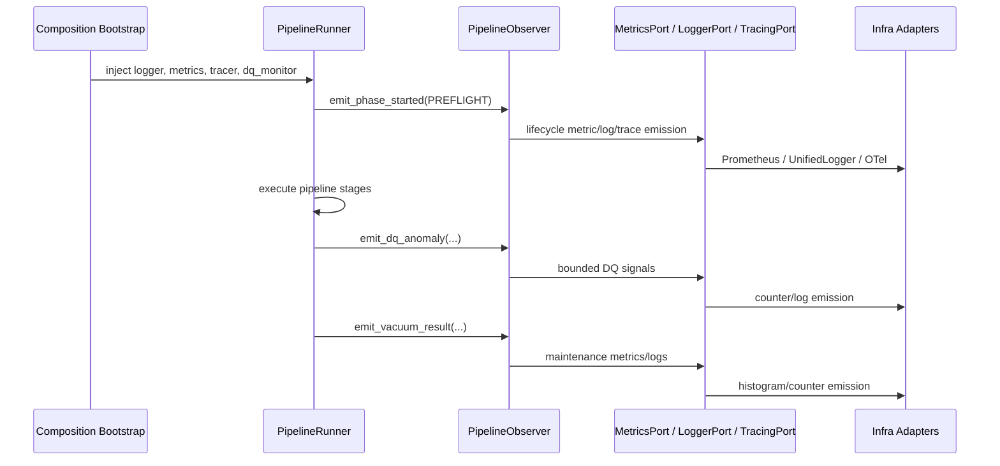

# Observability Layers Architecture

## Overview

BioETL keeps observability inside the Ports & Adapters model:

- domain defines observability contracts and value objects
- application emits lifecycle, DQ, and postrun signals through those contracts
- infrastructure implements concrete logging, metrics, tracing, and anomaly-monitoring adapters
- composition owns the single supported runtime wiring path

The design goal is twofold:

- keep `run_id`-level correlation in logs, traces, and control-plane artifacts
- keep Prometheus metrics low-cardinality and aggregated by bounded labels only

## Domain Layer

The domain layer defines the observability contracts:

- `LoggerPort`
- `MetricsPort`
- `TracingPort`
- `DQMonitorPort`
- `AuditPort`

The domain layer also owns typed DQ anomaly value objects used across the port
boundary:

- `DQAnomaly`
- `DQAnomalyType`
- `DQAnomalySeverity`

The domain layer does not import concrete logging libraries, Prometheus client
types, or OpenTelemetry implementations.

## Application Layer

The application layer is responsible for emitting execution signals, not for
choosing where they are stored.

### Pipeline lifecycle

`PipelineObserver` is the canonical lifecycle emitter for ordinary pipeline
runs. The runner orchestration uses it to emit:

- phase start and completion events
- phase duration metrics
- structured lifecycle logs
- preflight health-check results
- DQ anomaly signals
- vacuum results

Current ordinary-run phase mapping:

- `preflight` -> `PREFLIGHT`
- `prepare_medallion_layers` -> `LIFECYCLE_CLEAR`
- `execute_pipeline` -> `EXECUTION`
- `postrun` -> `POSTRUN`
- `checkpoint_finalize` -> `CLEANUP`

### Postrun tracing

`PostrunService` emits a top-level `postrun.run` span and nested spans for the
major postrun phases:

- `postrun.compaction`
- `postrun.dq_evaluation`
- `postrun.dq_reports`
- `postrun.vacuum`
- `postrun.final_metadata`

This keeps postrun diagnostics correlated without pushing high-cardinality
identifiers into metric labels.

### DQ contract use

`DataQualityService` consumes typed `DQAnomaly` objects from `DQMonitorPort`
rather than infrastructure-specific anomaly payloads.

`DataQualityService` also publishes `bioetl_data_freshness_seconds` as the
timestamp of the latest successful DQ/postrun freshness publication. Current
dashboards and alerts derive operational lag as `time() - metric`; this is a
runtime staleness proxy, not an immutable provider-ingestion anchor.

## Infrastructure Layer

The infrastructure layer provides concrete adapters for the domain ports.

### Logging

- `UnifiedLogger` is the canonical `LoggerPort` implementation
- `structlog` remains an implementation detail behind `UnifiedLogger`
- flat top-level structured fields are canonical
- nested `extra={...}` payloads are flattened as a compatibility behavior, with
  explicit top-level kwargs taking precedence

### Metrics

- `PrometheusMetrics` implements `MetricsPort`
- metric export names are defined centrally in
  `src/bioetl/infrastructure/observability/prometheus_metric_registries.py`
- the current exported catalog size is **86 metrics**
- provider health-check latency is standardized on seconds-based metric families
  (`bioetl_health_check_latency_seconds`,
  `bioetl_health_check_mode_latency_seconds`)

### Tracing

- `OpenTelemetryTracer` implements `TracingPort` when tracing is enabled
- `NoOpTracing` is the valid null-object fallback in non-tracing contexts
- `UnifiedLogger` enriches logs with `trace_id` and `span_id` when an active
  span exists

### Additional operator signals

Infrastructure and application wiring now expose bounded operator metrics for
quarantine actions:

- `bioetl_quarantine_operator_operations_total`
- `bioetl_quarantine_operator_duration_seconds`

These metrics are intended for operational diagnosis of inspect/replay/purge and
related workflows, not for per-record drill-down.

### Audit traceability

- `AuditPort` is part of the observability/traceability contract surface
- Bronze/Silver/Gold runtime wiring injects audit adapters from composition
- file-backed audit persistence is an infrastructure concern hidden behind the
  port boundary

## Composition Layer

The composition layer owns runtime observability assembly.

The supported runtime path is the bootstrap bundle under
`src/bioetl/composition/bootstrap/runtime/`. This path is responsible for:

- creating logger, metrics, tracing, and optional DQ-monitor dependencies
- enforcing production observability policy
- failing closed in `prod` when metrics or tracing resolve to no-op
  implementations, unless an explicit override is configured

Compatibility wrappers may exist for older builder entrypoints, but they must
delegate back to the canonical bootstrap path rather than reimplementing
assembly logic.

## Interaction Diagram

## Observability Standards

All shipped observability must follow these rules:

- metric names use the `bioetl_` prefix
- metric labels stay low-cardinality
- `run_id`, `manifest_id`, payload hashes, filesystem paths, and other
  per-run/per-record identifiers must not appear in Prometheus labels
- logs keep `run_id`, `pipeline`, and `stage` for correlation
- traces keep `bioetl.run_id` and phase-specific attributes

See [observability.md](../04-reference/contracts/observability.md) for the
canonical runtime contract and [sli-slo-baseline.md](../05-operations/sli-slo-baseline.md)
for the operational baseline built on top of those signals.
