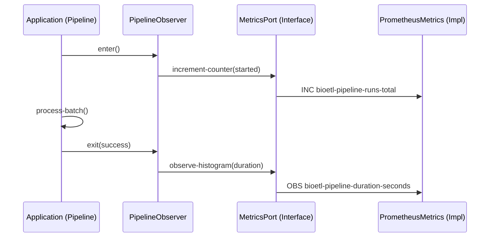

# Observability Layers Architecture

## Overview

BioETL implements a layered approach to observability, separating the **Definition** of what to observe from the **Implementation** of how to store/transmit it.

## Application Layer (src/bioetl/application/observability/)

This layer focuses on **Domain Events** and **Pipeline Lifecycle**.

*   **PipelineObserver**: A context manager that wraps pipeline execution.
    *   *Role*: Captures Start/Success/Failure events.
    *   *Metrics*: Duration, Status.
    *   *Logs*: Structured lifecycle logs.

## Infrastructure Layer (src/bioetl/infrastructure/observability/)

This layer provides the concrete **Adapters** for observability ports.

*   **PrometheusMetrics**: Implements `MetricsPort`.
    *   *Role*: Exposes metrics via HTTP endpoint.
*   **Structlog**: Implements `LoggerPort` (implicitly via duck typing).
*   **OpenTelemetry**: (Optional) Implements `TracingPort`.

## Interaction Diagram

## Metrics Standards

All metrics MUST follow these naming conventions:

*   Prefix: `bioetl_` (underscores in Prometheus, hyphens in documentation)
*   Common Labels: `pipeline`, `run_type`, `stage`, `provider`, `adapter`
*   **47 metrics** registered across 12 categories: Pipeline Core, Pipeline Lifecycle, Circuit Breaker, Data Quality, Health Checks, Preflight, Transformer, Storage (Bronze/Silver/VACUUM), Adapter/HTTP, Rate Limiter, Shutdown, Input Filters

See `docs/04-reference/contracts/observability.md` for the full catalog (v2.0.0).
