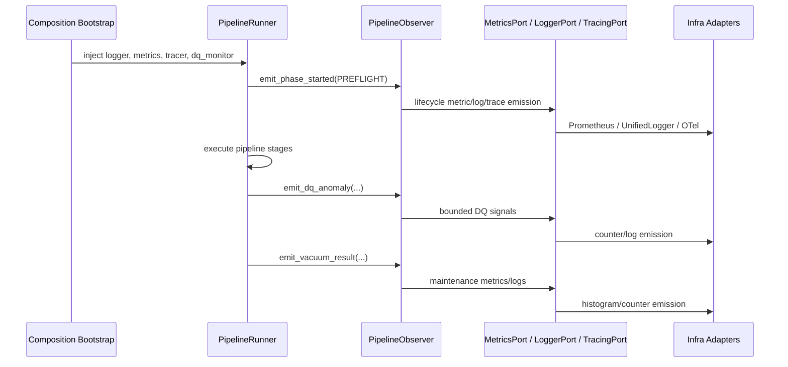

# Observability Layers Architecture

## Overview

BioETL keeps observability inside the Ports & Adapters model:

- domain defines observability contracts and value objects
- application emits lifecycle, DQ, and postrun signals through those contracts
- infrastructure implements concrete logging, metrics, tracing, and anomaly-monitoring adapters
- composition owns the single supported runtime wiring path

The design goal is twofold:

- keep `run_id`-level correlation in logs, traces, and control-plane artifacts
- keep Prometheus metrics low-cardinality and aggregated by bounded labels only

## Domain Layer

The domain layer defines the observability contracts:

- `LoggerPort`
- `MetricsPort`
- `TracingPort`
- `DQMonitorPort`
- `AuditPort`

The domain layer also owns typed DQ anomaly value objects used across the port
boundary:

- `DQAnomaly`
- `DQAnomalyType`
- `DQAnomalySeverity`

The domain layer does not import concrete logging libraries, Prometheus client
types, or OpenTelemetry implementations.

## Application Layer

The application layer is responsible for emitting execution signals, not for
choosing where they are stored.

### Pipeline lifecycle

`PipelineObserver` is the canonical lifecycle emitter for ordinary pipeline
runs. The runner orchestration uses it to emit:

- phase start and completion events
- phase duration metrics
- structured lifecycle logs
- preflight health-check results
- preflight health summary metrics/logs
- DQ anomaly signals
- vacuum results

Composite runtime uses `CompositeLifecycleObserverService` as the sanctioned
counterpart for composite lifecycle publication. Composition injects
`LoggerPort`, `MetricsPort`, and `TracingPort` into that service so composite
runs do not fall back to logger-only lifecycle publication. When tracing is
enabled it creates one bounded run span and one bounded phase span per active
composite phase while keeping metric labels low-cardinality.

`PreflightService` and `HealthAggregator` may still compute typed preflight
reports/results, but they are not a parallel runtime publication path. For
ordinary pipeline runs, `runner_execution_flow` owns the handoff from those
reports into `PipelineObserver`.

Current ordinary-run phase mapping:

- `preflight` -> `PREFLIGHT`
- `prepare_medallion_layers` -> `LIFECYCLE_CLEAR`
- `execute_pipeline` -> `EXECUTION`
- `postrun` -> `POSTRUN`
- `checkpoint_finalize` -> `CLEANUP`

### Postrun tracing

`PostrunService` emits a top-level `postrun.run` span and nested spans for the
major postrun phases:

- `postrun.compaction`
- `postrun.dq_evaluation`
- `postrun.dq_reports`
- `postrun.vacuum`
- `postrun.final_metadata`

This keeps postrun diagnostics correlated without pushing high-cardinality
identifiers into metric labels.

Operator-facing postrun telemetry also exposes bounded low-cardinality signals
for the same subphases through:

- `bioetl_postrun_phase_events_total`
- `bioetl_postrun_phase_duration_seconds`

### DQ contract use

`DataQualityService` consumes typed `DQAnomaly` objects from `DQMonitorPort`
rather than infrastructure-specific anomaly payloads.

Pipeline-specific metrics vocabulary is now owned in the application layer via
an explicit facade/helper path. `MetricsPort` remains the generic transport
contract for histogram/counter/gauge dispatch only.

`DataQualityService` also publishes `bioetl_data_freshness_seconds` from the
ingestion anchor supplied by the application runtime (currently
`PipelineContext.started_at`, mirrored into `_ingestion_ts` defaults during
writes). Current dashboards and alerts derive operational lag as
`time() - metric`.

That same application-owned freshness anchor is the canonical timestamp source
for `DQMonitorPort.check_quality(...)` and
`DQMonitorPort.update_baseline_from_metrics(...)`. DQ anomaly timestamps and
baseline-update decisions must therefore be reproducible from the runtime
anchor rather than chosen ad hoc inside infrastructure adapters.

## Infrastructure Layer

The infrastructure layer provides concrete adapters for the domain ports.

### Logging

- `UnifiedLogger` is the canonical `LoggerPort` implementation
- `structlog` remains an implementation detail behind `UnifiedLogger`
- flat top-level structured fields are canonical
- nested `extra={...}` payloads are flattened as a compatibility behavior, with
  explicit top-level kwargs taking precedence

### Metrics

- `PrometheusMetrics` implements `MetricsPort`
- metric export names are defined centrally in
  `src/bioetl/infrastructure/observability/prometheus_metric_registries.py`
- the public metric inventory is derived from
  `REGISTERED_PROMETHEUS_METRIC_NAMES` in
  `src/bioetl/infrastructure/observability/prometheus_metric_registries.py`
- docs/rules/dashboard drift must be reconciled with
  `python -m scripts.engineering.qa report-observability-metric-inventory --json`
- provider health-check latency is standardized on seconds-based metric families
  (`bioetl_health_check_latency_seconds`,
  `bioetl_health_check_mode_latency_seconds`)

### Tracing

- `OpenTelemetryTracer` implements `TracingPort` when tracing is enabled
- `NoOpTracing` is the valid null-object fallback in non-tracing contexts
- `UnifiedLogger` enriches logs with `trace_id` and `span_id` when an active
  span exists

### Additional operator signals

Infrastructure and application wiring now expose bounded operator metrics for
quarantine actions:

- `bioetl_quarantine_operator_operations_total`
- `bioetl_quarantine_operator_duration_seconds`

These metrics are intended for operational diagnosis of inspect/replay/purge and
related workflows, not for per-record drill-down.

### Operator tracing

Selected operator/admin workflows now participate in tracing through
`TracingPort` at the application-service layer:

- `MetricsService.start`
- `MetricsService.get_status`
- `MetricsService.push_to_gateway`
- `quarantine.inspect` (`QuarantineService.inspect`)
- `quarantine.get_stats` (`QuarantineService.get_stats`)
- `quarantine.replay` (`QuarantineService.replay`)
- `quarantine.mark_reprocessed`
- `quarantine.purge` (`QuarantineService.purge`)
- `quarantine.update_status` (`QuarantineService.update_status`)
- `ObservabilityWorkflowService.inspect_audit_run`
- `ObservabilityWorkflowService.inspect_checkpoint_workflow`

These spans must remain bounded and summary-oriented. They may include low-cardinality
attributes such as operation names, pipeline names, boolean filter presence, and
aggregate counts.

Intentional exclusions:

- record-level quarantine explorer/detail lookups remain metric/log-only for now
- filtered quarantine explorer helpers remain metric/log-only for now:
  `list_filtered_records`, `get_filtered_record`, `get_filtered_stats`,
  `get_filtered_filter_options`
- CLI commands remain thin adapters and must not start infrastructure-specific tracing directly

### Audit traceability

- `AuditPort` is part of the observability/traceability contract surface
- Bronze/Silver/Gold runtime wiring injects audit adapters from composition
- file-backed audit persistence is an infrastructure concern hidden behind the
  port boundary
- `FileAuditAdapter` publishes bounded audit metrics for write/query workflows:
  - `bioetl_audit_write_events_total`
  - `bioetl_audit_write_duration_seconds`
  - `bioetl_audit_query_events_total`
  - `bioetl_audit_query_duration_seconds`
- audit inspection and persistence also participate in tracing through
  `TracingPort`; spans stay summary-oriented and avoid high-cardinality
  identifiers such as `run_id`, table names, and filesystem paths

## Composition Layer

The composition layer owns runtime observability assembly.

The supported runtime path is the bootstrap bundle under
`src/bioetl/composition/bootstrap/runtime/`. This path is responsible for:

- creating logger, metrics, tracing, and optional DQ-monitor dependencies
- enforcing production observability policy
- failing closed in `prod` when metrics or tracing resolve to no-op
  implementations, unless an explicit override is configured

Compatibility wrappers may exist for older builder entrypoints, but they must
delegate back to the canonical bootstrap path rather than reimplementing
assembly logic.

Composition also owns the sanctioned fallback-resolution module for
observability ports:

- `bioetl.composition.observability_resolution`
- exported helpers: `resolve_metrics_port(...)` and `resolve_tracing_port(...)`

Null-object fallback selection (`NoOpMetrics`, `NoOpTracing`) must happen in
these composition-owned seams rather than in application or infrastructure
runtime code.

Metrics server lifecycle and Pushgateway-style publication are exposed through
the composition-owned `MetricsService` path. Public call sites should use
`bioetl.composition.observability_api` rather than importing infra publication
helpers directly.

Remaining explicit compatibility layers:

- `bioetl.interfaces.observability` stays as an interface-layer facade over
  `bioetl.composition.observability_api`
- `UnifiedLogger` accepts `extra={...}` compatibility input, but runtime emits
  flat top-level fields and canonical `timestamp`
- downstream log normalization may still accept `ts`, but `ts` is not a
  canonical emitted field name

Terminal typed Domain Events now publish through the canonical observer route
for ordinary pipeline outcomes:

- `PipelineFailed`
- `PipelineShutdown`
- `PipelineCompleted`

These events are mapped by `bioetl.domain.observability_event_mapping` and are
emitted via `PipelineObserver.emit_domain_event(...)` as part of ordinary run
teardown, not as a replacement for the lifecycle log/metric emitter.

Terminal event timestamps are derived deterministically from
`wall_start_time + monotonic_duration`. Missing `wall_start_time` is treated as
an observer invariant violation rather than a reason to fall back to a fresh
wall-clock timestamp.

The same rule applies to replay-facing composite/admin/public execution
results: `completed_at` must be derived from the captured `started_at` anchor
plus monotonic duration, rather than sampled again from a later wall clock.

## Interaction Diagram

## Observability Standards

All shipped observability must follow these rules:

- metric names use the `bioetl_` prefix
- metric labels stay low-cardinality
- `run_id`, `manifest_id`, payload hashes, filesystem paths, and other
  per-run/per-record identifiers must not appear in Prometheus labels
- logs keep `run_id`, `pipeline`, and `stage` for correlation
- traces keep the canonical run-correlation attribute defined by the
  observability contract together with phase-specific attributes

See [observability.md](../04-reference/contracts/observability.md) for the
canonical runtime contract and [sli-slo-baseline.md](../05-operations/sli-slo-baseline.md)
for the operational baseline built on top of those signals.
