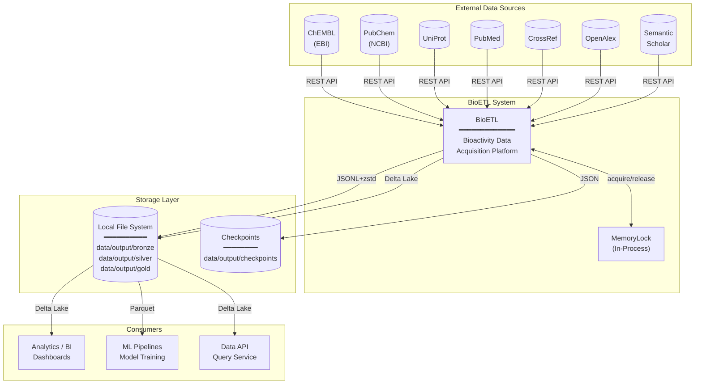

______________________________________________________________________

Version: 1.0.0
Status: active
Class: published
Owner: BioETL Team
Reviewers:

- BioETL Team
  Last verified: '2026-03-29'

______________________________________________________________________

# System Context

*Aligned with RULES.md v6.1.2 (Local-Only Deployment)*

## Overview

C4 System Context diagram показывает BioETL как центральную систему и её взаимодействие с внешними системами.

> **Note**: Текущая поддерживаемая реализация — **Local-Only** (ADR-010).
> Активные архитектурные документы описывают только локальный runtime:
> локальную файловую систему, локальные checkpoints и `MemoryLock`.

______________________________________________________________________

## System Context Diagram (Local-Only)



______________________________________________________________________

## System Boundaries

### Inside BioETL (§1.1)

| Component       | Layer          | Responsibility                  |
| --------------- | -------------- | ------------------------------- |
| CLI             | Interfaces     | User commands, scheduling       |
| Pipelines       | Application    | Orchestration, DAG execution    |
| Domain Services | Domain         | Hash, Validation, Normalization |
| Adapters        | Infrastructure | API clients, Storage writers    |

### External Systems

| System               | Role                     | Protocol        | Status              |
| -------------------- | ------------------------ | --------------- | ------------------- |
| **ChEMBL**           | Bioactivity data source  | REST API (EBI)  | Active              |
| **PubChem**          | Chemical compound data   | REST API (NCBI) | Active              |
| **UniProt**          | Protein/target data      | REST API        | Active              |
| **PubMed**           | Publication metadata     | REST API (NCBI) | Active              |
| **CrossRef**         | Publication metadata     | REST API        | Active              |
| **OpenAlex**         | Academic knowledge graph | REST API        | Active              |
| **Semantic Scholar** | Publication metadata     | REST API (AI2)  | Active              |
| **Local FS**         | Medallion layers storage | File I/O        | Active (Local-Only) |

______________________________________________________________________

## Data Flow Summary (Local-Only)

```
┌─────────────────┐     ┌─────────────────┐     ┌─────────────────┐
│  Data Sources   │────►│     BioETL      │────►│   Consumers     │
│  (ChEMBL, etc.) │     │  ETL Platform   │     │  (BI, ML, API)  │
└─────────────────┘     └────────┬────────┘     └─────────────────┘
                                │
                                ▼
                       ┌─────────────────┐
                       │  Storage Layer  │
                       │  (Local FS)     │
                       └─────────────────┘
```

______________________________________________________________________

## Architecture Style

BioETL использует **Ports & Adapters** (Hexagonal Architecture):

- **Ports**: Protocol interfaces в Domain layer (`DataSourcePort`, `StoragePort`, `LockPort`)
- **Adapters**: Infrastructure implementations
  - **Local-Only runtime**: `ChemblClient`, `SilverWriter`, `BronzeWriter`, `GoldWriter`, `MemoryLock`

Это обеспечивает:

- Независимость Domain от I/O
- Тестируемость через mock-адаптеры
- Расширяемость для новых провайдеров
- Явное разделение между доменными портами и локальными инфраструктурными реализациями

______________________________________________________________________

## Related Documents

- **Data Flow**: [data-flow.md](diagrams/guide/data-flow-reference.md)
- **Architecture Diagrams**: [diagram catalog](diagrams/README.md)
- **Local-Only ADR**: [ADR-010](decisions/ADR-010-local-only-deployment.md)
