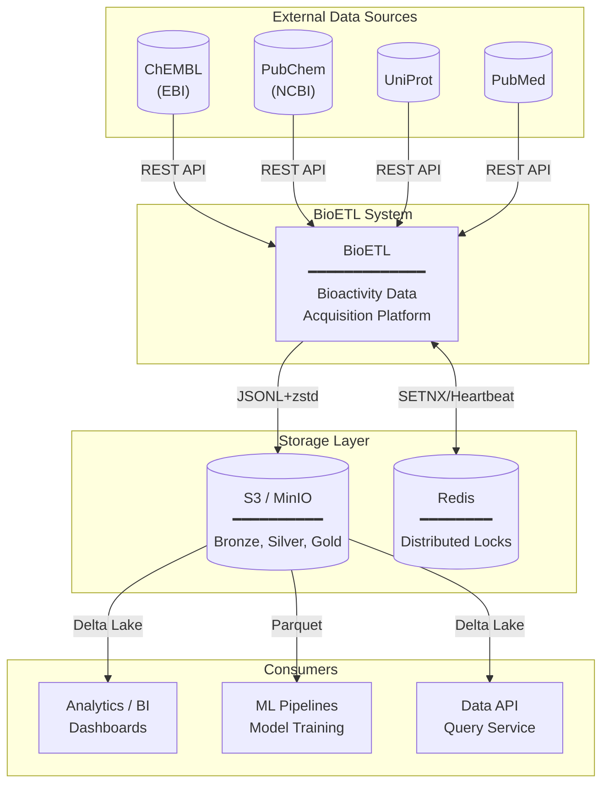

# System Context
*Aligned with RULES.md v5.0*

## Overview

C4 System Context diagram показывает BioETL как центральную систему и её взаимодействие с внешними системами.

---

## System Context Diagram



---

## System Boundaries

### Inside BioETL (§1.1)

| Component | Layer | Responsibility |
|-----------|-------|----------------|
| CLI | Interfaces | User commands, scheduling |
| Pipelines | Application | Orchestration, DAG execution |
| Domain Services | Domain | Hash, Validation, Normalization |
| Adapters | Infrastructure | API clients, Storage writers |

### External Systems

| System | Role | Protocol |
|--------|------|----------|
| **ChEMBL** | Bioactivity data source | REST API (EBI) |
| **PubChem** | Chemical compound data | REST API (NCBI) |
| **UniProt** | Protein/target data | REST API |
| **PubMed** | Publication metadata | REST API (NCBI) |
| **S3/MinIO** | Object storage (Medallion layers) | S3 API |
| **Redis** | Distributed locking | Redis protocol |

---

## Data Flow Summary

```
┌─────────────────┐     ┌─────────────────┐     ┌─────────────────┐
│  Data Sources   │────►│     BioETL      │────►│   Consumers     │
│  (ChEMBL, etc.) │     │  ETL Platform   │     │  (BI, ML, API)  │
└─────────────────┘     └────────┬────────┘     └─────────────────┘
                                 │
                                 ▼
                        ┌─────────────────┐
                        │  Storage Layer  │
                        │  (S3 + Redis)   │
                        └─────────────────┘
```

---

## Architecture Style

BioETL использует **Ports & Adapters** (Hexagonal Architecture):

- **Ports**: Protocol interfaces в Domain layer (`DataSourcePort`, `SinkPort`, `LockPort`)
- **Adapters**: Infrastructure implementations (`ChemblClient`, `DeltaLakeWriter`, `RedisLock`)

Это обеспечивает:
- Независимость Domain от I/O
- Тестируемость через mock-адаптеры
- Расширяемость для новых провайдеров

---

## Related Documents

- **ETL Layers**: [02-etl-layers.md](../01-architecture/02-etl-layers.md)
- **Data Flow**: [data-flow.md](data-flow.md)
- **Architecture Diagrams**: [06-architecture-diagrams.md](../01-architecture/06-architecture-diagrams.md)
