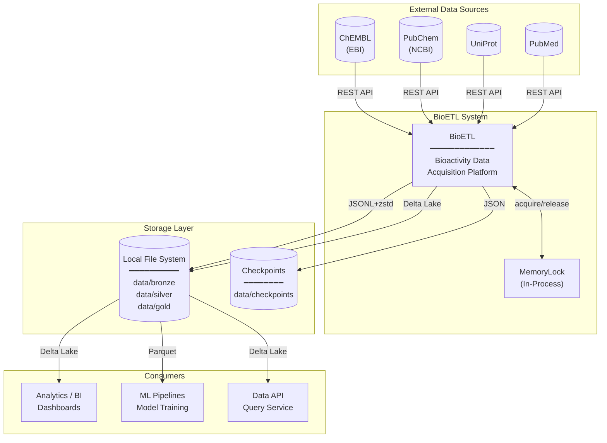

# System Context
*Aligned with RULES.md v5.2 (Local-Only Deployment)*

## Overview

C4 System Context diagram показывает BioETL как центральную систему и её взаимодействие с внешними системами.

> **Note**: Текущая реализация — **Local-Only** (ADR-010). Redis и S3 отложены для будущего распределённого развёртывания.

---

## System Context Diagram (Local-Only)



---

## System Boundaries

### Inside BioETL (§1.1)

| Component | Layer | Responsibility |
|-----------|-------|----------------|
| CLI | Interfaces | User commands, scheduling |
| Pipelines | Application | Orchestration, DAG execution |
| Domain Services | Domain | Hash, Validation, Normalization |
| Adapters | Infrastructure | API clients, Storage writers |

### External Systems

| System | Role | Protocol | Status |
|--------|------|----------|--------|
| **ChEMBL** | Bioactivity data source | REST API (EBI) | Active |
| **PubChem** | Chemical compound data | REST API (NCBI) | Active |
| **UniProt** | Protein/target data | REST API | Active |
| **PubMed** | Publication metadata | REST API (NCBI) | Active |
| **Local FS** | Medallion layers storage | File I/O | Active (Local-Only) |
| **S3/MinIO** | Object storage | S3 API | Future (Distributed) |
| **Redis** | Distributed locking | Redis protocol | Future (Distributed) |

---

## Data Flow Summary (Local-Only)

```
┌─────────────────┐     ┌─────────────────┐     ┌─────────────────┐
│  Data Sources   │────►│     BioETL      │────►│   Consumers     │
│  (ChEMBL, etc.) │     │  ETL Platform   │     │  (BI, ML, API)  │
└─────────────────┘     └────────┬────────┘     └─────────────────┘
                                │
                                ▼
                       ┌─────────────────┐
                       │  Storage Layer  │
                       │  (Local FS)     │
                       └─────────────────┘
```

---

## Architecture Style

BioETL использует **Ports & Adapters** (Hexagonal Architecture):

- **Ports**: Protocol interfaces в Domain layer (`DataSourcePort`, `StoragePort`, `LockPort`)
- **Adapters**: Infrastructure implementations
  - **Local-Only**: `ChemblClient`, `LocalDeltaWriter`, `MemoryLock`
  - **Distributed (Future)**: `S3Writer`, `RedisLock`

Это обеспечивает:
- Независимость Domain от I/O
- Тестируемость через mock-адаптеры
- Расширяемость для новых провайдеров
- Лёгкий переход между Local-Only и Distributed deployment

---

## Related Documents

- **Data Flow**: [data-flow.md](data-flow.md)
- **Architecture Diagrams**: [diagrams/00-diagramming-policy.md](diagrams/00-diagramming-policy.md)
- **Local-Only ADR**: [ADR-010](decisions/ADR-010-local-only-deployment.md)
