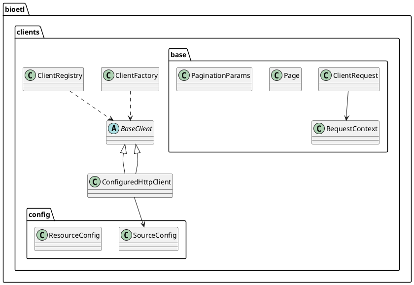
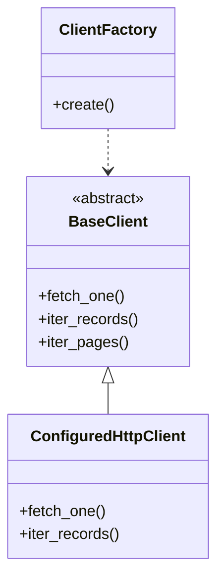

# 08 Clients Diagrams

## Быстрый старт

### Через CLI (рекомендуется)

Для генерации диаграмм используйте команду CLI:

```bash
# Генерация для всех пакетов
bioetl tools generate-diagrams

# Генерация только для пакета clients
bioetl tools generate-diagrams --package bioetl.clients

# С указанием выходной директории
bioetl tools generate-diagrams --package bioetl.clients --output-dir ./my_diagrams
```

### Через скрипт

Альтернативно можно использовать скрипт напрямую:

```bash
python tools/generate_diagrams.py
```

Скрипт автоматически найдет все пакеты `bioetl.*`, включая `bioetl.clients`, и сгенерирует диаграммы.

## Результаты

Диаграммы сохраняются в `diagrams/`:

```text
diagrams/
├── dot/clients/          # Исходные и очищенные .dot файлы
│   ├── classes_bioetl_clients.dot
│   └── bioetl_clients.classes.clean.dot
├── svg/clients/          # SVG диаграммы
│   ├── bioetl_clients_classes.svg
│   └── bioetl_clients_packages.svg
└── png/clients/          # PNG диаграммы
    ├── bioetl_clients_classes.png
    └── bioetl_clients_packages.png
```

## Требования

1. **pyreverse** (из пакета `pylint`):

   ```bash
   pip install pylint
   ```

2. **Graphviz** (для рендеринга .dot в SVG/PNG):
   - Windows: скачать с [graphviz.org](https://graphviz.org/download/)
   - Убедиться, что `dot` доступен в PATH

## Генерация только для clients

### Через CLI

```bash
bioetl tools generate-diagrams --package bioetl.clients
```

### Через pyreverse напрямую

Если нужно использовать `pyreverse` напрямую:

```bash
# Из корня репозитория
pyreverse -o dot -p bioetl_clients -AS bioetl.clients

# Рендеринг в SVG
dot -Tsvg -Gdpi=300 -Grankdir=LR classes_bioetl_clients.dot -o clients_classes.svg

# Рендеринг в PNG
dot -Tpng -Gdpi=300 -Grankdir=LR classes_bioetl_clients.dot -o clients_classes.png
```

## Что показывают диаграммы

### Диаграмма классов (`*_classes.*`)

Отображает:

- **Классы и их атрибуты** (с опцией `-A`)
- **Связи между классами** (с опцией `-S`)
- **Наследование** (стрелки `empty`)
- **Композицию/агрегацию** (другие типы связей)

Основные объекты пакета `clients`:

- `BaseClient` — абстрактный базовый класс
- `ConfiguredHttpClient` — реализация клиента
- `ClientFactory`, `ClientRegistry` — фабрики
- `SourceConfig`, `ResourceConfig` — модели конфигурации
- `ClientRequest`, `RequestContext` — объекты запросов
- `Page`, `PaginationParams` — утилиты пагинации
- Конкретные клиенты: `ChemblClient`, `PubChemClient`, и т.д.

### Диаграмма пакетов (`*_packages.*`)

Отображает структуру модулей и их зависимости:

- `bioetl.clients`
- `bioetl.clients.base`
- `bioetl.clients.config`
- `bioetl.clients.chembl`
- `bioetl.clients.pubchem`
- и т.д.

## Параметры pyreverse

- `-o dot` — формат вывода (DOT для Graphviz)
- `-p <project>` — префикс имен файлов
- `-A` — показать атрибуты классов
- `-S` — показать связи (associations)
- `-k` — показать только классы (без пакетов)
- `-a <num>` — показать только классы с числом атрибутов >= num

## Очистка диаграмм

Скрипт `generate_diagrams.py` автоматически:

- Удаляет приватные классы (начинающиеся с `_`)
- Удаляет тестовые модули
- Добавляет `rankdir=LR` для горизонтальной ориентации

## Обновление диаграмм

При изменении структуры пакета `clients`:

1. Запустите генерацию заново:

   ```bash
   python tools/generate_diagrams.py
   ```

2. Проверьте результаты в `diagrams/svg/clients/` или `diagrams/png/clients/`

3. При необходимости закоммитьте обновленные файлы

## Альтернативные инструменты

### PlantUML

Для более детальных диаграмм можно использовать PlantUML:



### Mermaid

Для документации в Markdown:



## Связанная документация

- **06-clients-overview.md** — обзор архитектуры клиентов
- **tools/generate_diagrams.py** — скрипт генерации диаграмм

