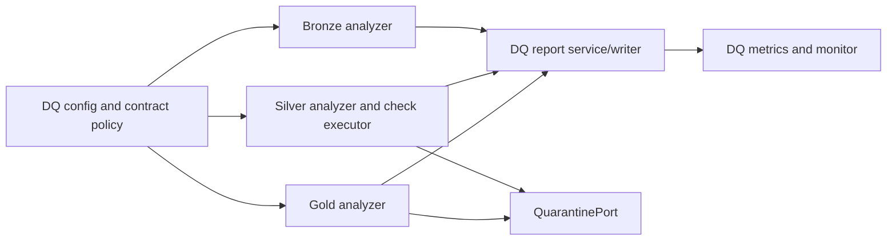

______________________________________________________________________

Version: 1.0.0
Status: active
Class: published
Owner: BioETL Team
Reviewers:

- BioETL Team
  Last verified: '2026-06-03'

______________________________________________________________________

# Data Quality Framework

This guide describes the current DQ execution model from code and config.

## Source Of Truth

| Surface | File(s) |
| --- | --- |
| DQ analyzers | `src/bioetl/application/services/dq/{bronze_analyzer.py,silver_analyzer.py,gold_analyzer.py}` |
| DQ checks | `src/bioetl/application/services/dq/_checks_basic.py`, `_checks_business.py`, `_checks_integrity.py`, `_checks_statistical.py` |
| Silver check executor | `src/bioetl/application/services/dq/silver_check_executor.py` |
| DQ value objects | `src/bioetl/domain/value_objects/dq_*.py` |
| DQ ports | `src/bioetl/domain/ports/quality/*.py`, `src/bioetl/domain/ports/observability/dq_monitor.py` |
| DQ config loaders | `src/bioetl/infrastructure/config/dq_config_loader.py`, `dq_contract_config_loader.py` |
| DQ config | `configs/base/dq.yaml`, `configs/quality/*.yaml`, DQ sections in entity/contract configs |

## Lifecycle



## Boundary Rules

- DQ rule and contract loading is infrastructure-owned.
- DQ orchestration is application-owned.
- DQ result semantics and report value objects are domain-owned.
- Quarantine writes occur through `QuarantinePort`; concrete persistence stays
  in infrastructure.
- DQ metrics use bounded labels and must not include raw payload values,
  filesystem paths, record IDs, run IDs, manifest IDs, or content hashes.

## Silver/Gold Filter Boundary

The current code keeps YAML compatibility for legacy semantic Silver filter
keys while projecting domain Silver filters as structural-only:

- `configs/entities/**/*.yaml` may still contain semantic
  `filters.silver_filters.columns` and `filters.silver_filters.ranges`.
- `src/bioetl/infrastructure/config/silver_filter_migration.py` promotes
  semantic Silver sections into `gold_filters` and leaves Silver with
  `required_fields` / `exclude_if_present`.
- `src/bioetl/infrastructure/schemas/filter_config.py` and
  `src/bioetl/infrastructure/schemas/pipeline_config.py` apply this
  normalization before validation.
- `SilverFiltersFileConfig.to_domain()` and `SilverFiltersConfig.to_domain()`
  return structural-only `SilverFilterConfig` instances for application/domain
  consumption.

This means documentation and dashboards should describe current Silver rejects
as structural Silver filter rejects, while noting that entity YAML still
contains legacy semantic keys during the compatibility window.

## Operational Surfaces

- DQ CLI/config guide: [DQ Configuration](dq-configuration.md)
- DQ dashboards: [Dashboard Guide](dashboard-guide.md)
- Quarantine triage: [Troubleshooting](troubleshooting.md)
- DQ contracts: [Data Contracts Current State](../04-reference/contracts/data-contracts-current.md)

## Quality Gates

Run the relevant contract, DQ, and architecture tests after changing DQ docs or
rules:

```bash
python -m pytest tests/architecture -q
python -m pytest tests/contract -q
python -m pytest tests/unit/application/services/dq -q
```
